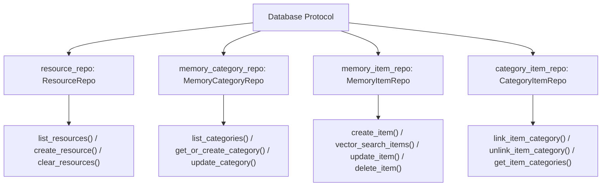
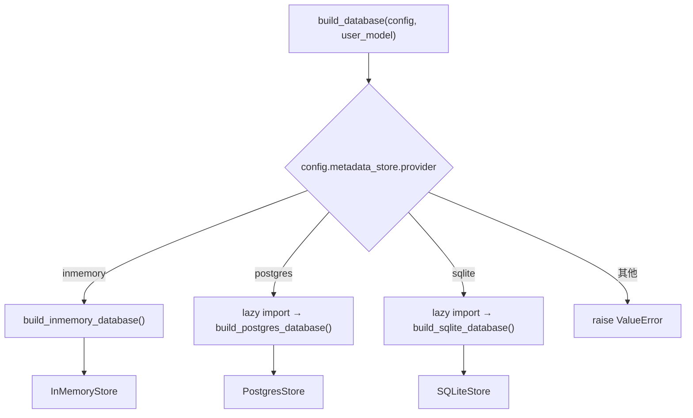
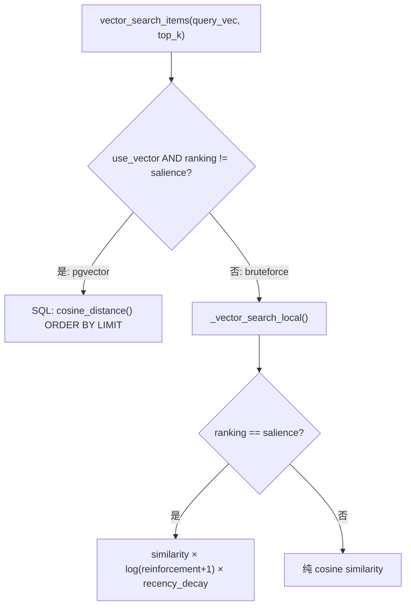

# PD-474.01 memU — Repository + Factory 可插拔存储后端

> 文档编号：PD-474.01
> 来源：memU `src/memu/database/`
> GitHub：https://github.com/NevaMind-AI/memU.git
> 问题域：PD-474 可插拔存储后端 Pluggable Storage Backend
> 状态：可复用方案

---

## 第 1 章 问题与动机

### 1.1 核心问题

Agent 记忆系统需要持久化存储，但不同部署场景对存储后端的需求差异巨大：

- **本地开发/测试**：需要零依赖的内存存储，启动即用
- **轻量部署**：需要 SQLite 文件存储，单机可用无需外部服务
- **生产环境**：需要 PostgreSQL + pgvector，支持高并发和原生向量检索
- **向量检索**：元数据存储和向量索引的最优后端可能不同（如 SQLite 元数据 + bruteforce 向量 vs Postgres 元数据 + pgvector 向量）

如果存储层与业务逻辑耦合，每次切换后端都需要修改大量代码，且无法在不同环境间平滑迁移。

### 1.2 memU 的解法概述

memU 采用三层抽象实现完全可插拔的存储后端：

1. **Protocol 接口层**：用 Python `Protocol`（`runtime_checkable`）定义 4 个 Repository 契约 + 1 个 Database 门面契约（`src/memu/database/interfaces.py:13`）
2. **Factory 分发层**：`build_database()` 工厂函数按 `config.metadata_store.provider` 字符串分发到 inmemory/postgres/sqlite 三个后端（`src/memu/database/factory.py:15`）
3. **向量索引独立抽象**：`VectorIndexConfig` 独立于 `MetadataStoreConfig`，允许 bruteforce/pgvector/none 三种向量后端与元数据后端自由组合（`src/memu/app/settings.py:305-307`）
4. **Scope Model 动态注入**：通过 `merge_scope_model()` 在运行时将用户自定义字段（如 `user_id`）动态合并到所有记录模型中（`src/memu/database/models.py:108-121`）
5. **惰性导入隔离依赖**：postgres/sqlite 后端使用惰性 import，不使用时不需要安装对应依赖（`src/memu/database/factory.py:33-34`）

### 1.3 设计思想

| 设计原则 | 具体实现 | 理由 | 替代方案 |
|----------|----------|------|----------|
| Protocol 契约 | `@runtime_checkable class Database(Protocol)` 定义门面 | 结构化子类型，无需继承即可满足契约，降低耦合 | ABC 抽象基类（需要显式继承） |
| Factory 模式 | `build_database()` 按 provider 字符串分发 | 单一入口，调用方无需知道具体实现类 | Registry 注册表（更灵活但更复杂） |
| 惰性导入 | `if provider == "postgres": from ... import ...` | 避免未使用后端的依赖污染，减少安装要求 | 全量导入 + try/except（启动慢） |
| 元数据/向量分离 | `MetadataStoreConfig` + `VectorIndexConfig` 独立配置 | 允许 SQLite 元数据 + bruteforce 向量的混合部署 | 单一 provider 绑定（灵活性差） |
| 动态 Scope 注入 | `merge_scope_model(user_model, core_model)` 运行时合并 | 多租户隔离无需硬编码字段，用户自定义 scope | 固定 user_id 字段（不可扩展） |

---

## 第 2 章 源码实现分析

### 2.1 架构概览

memU 的存储层采用四层架构，从上到下依次为：门面接口 → Repository 契约 → 具体实现 → 存储引擎。

```
┌─────────────────────────────────────────────────────────┐
│                    业务层 (MemoryUser)                    │
│              只依赖 Database Protocol 门面                │
└──────────────────────┬──────────────────────────────────┘
                       │ 调用
┌──────────────────────▼──────────────────────────────────┐
│              Database Protocol (interfaces.py)           │
│  ┌──────────┐ ┌──────────────┐ ┌──────────┐ ┌────────┐ │
│  │ResourceRe│ │MemoryCategoryR│ │MemoryItem│ │Category│ │
│  │   po     │ │     epo      │ │  Repo    │ │ItemRepo│ │
│  └──────────┘ └──────────────┘ └──────────┘ └────────┘ │
└──────────────────────┬──────────────────────────────────┘
                       │ build_database() 分发
          ┌────────────┼────────────┐
          ▼            ▼            ▼
   ┌────────────┐ ┌─────────┐ ┌─────────┐
   │InMemoryStore│ │Postgres │ │ SQLite  │
   │  (dict缓存) │ │  Store  │ │  Store  │
   └────────────┘ └────┬────┘ └────┬────┘
                       │           │
                  ┌────▼────┐ ┌───▼────┐
                  │pgvector │ │brute-  │
                  │(原生SQL)│ │force   │
                  └─────────┘ └────────┘
```

### 2.2 核心实现

#### 2.2.1 Protocol 接口定义



对应源码 `src/memu/database/interfaces.py:12-27`：

```python
@runtime_checkable
class Database(Protocol):
    """Backend-agnostic database contract."""

    resource_repo: ResourceRepo
    memory_category_repo: MemoryCategoryRepo
    memory_item_repo: MemoryItemRepo
    category_item_repo: CategoryItemRepo

    resources: dict[str, ResourceRecord]
    items: dict[str, MemoryItemRecord]
    categories: dict[str, MemoryCategoryRecord]
    relations: list[CategoryItemRecord]

    def close(self) -> None: ...
```

每个 Repository 也是 Protocol，例如 `MemoryItemRepo`（`src/memu/database/repositories/memory_item.py:10-54`）定义了 CRUD + 向量搜索的完整契约，包括 `vector_search_items(query_vec, top_k, where)` 方法。

#### 2.2.2 Factory 分发与惰性导入



对应源码 `src/memu/database/factory.py:15-43`：

```python
def build_database(
    *,
    config: DatabaseConfig,
    user_model: type[BaseModel],
) -> Database:
    provider = config.metadata_store.provider
    if provider == "inmemory":
        return build_inmemory_database(config=config, user_model=user_model)
    elif provider == "postgres":
        # Lazy import to avoid requiring pgvector when not using postgres
        from memu.database.postgres import build_postgres_database
        return build_postgres_database(config=config, user_model=user_model)
    elif provider == "sqlite":
        # Lazy import to avoid loading SQLite dependencies when not needed
        from memu.database.sqlite import build_sqlite_database
        return build_sqlite_database(config=config, user_model=user_model)
    else:
        msg = f"Unsupported metadata_store provider: {provider}"
        raise ValueError(msg)
```

#### 2.2.3 向量索引双轨策略



对应源码 `src/memu/database/postgres/repositories/memory_item_repo.py:280-308`：

```python
def vector_search_items(
    self, query_vec: list[float], top_k: int,
    where: Mapping[str, Any] | None = None,
    *, ranking: str = "similarity", recency_decay_days: float = 30.0,
) -> list[tuple[str, float]]:
    if not self._use_vector or ranking == "salience":
        return self._vector_search_local(
            query_vec, top_k, where=where,
            ranking=ranking, recency_decay_days=recency_decay_days
        )
    # pgvector 原生 SQL 路径
    distance = self._sqla_models.MemoryItem.embedding.cosine_distance(query_vec)
    filters = [self._sqla_models.MemoryItem.embedding.isnot(None)]
    filters.extend(self._build_filters(self._sqla_models.MemoryItem, where))
    stmt = (
        select(self._sqla_models.MemoryItem.id, (1 - distance).label("score"))
        .where(*filters).order_by(distance).limit(top_k)
    )
    with self._sessions.session() as session:
        rows = session.execute(stmt).all()
    return [(rid, float(score)) for rid, score in rows]
```

InMemory 后端使用 numpy 向量化的 bruteforce 搜索（`src/memu/database/inmemory/vector.py:56-91`），采用 `np.argpartition` 实现 O(n) top-k 选择。

### 2.3 实现细节

#### Scope Model 动态合并

`merge_scope_model()` 在运行时将用户自定义的 scope 字段（如 `user_id`、`agent_id`）动态合并到 Pydantic 记录模型中（`src/memu/database/models.py:108-121`）。这使得多租户隔离完全由配置驱动，无需修改核心模型代码。

Postgres 后端进一步通过 `build_table_model()` 将 scope 字段注入 SQLModel ORM 模型，并自动创建 scope 索引（`src/memu/database/postgres/models.py:111-154`）：

```python
if scope_fields:
    table_args.append(Index(f"ix_{tablename}__scope", *scope_fields))
```

#### DatabaseConfig 自动推导向量后端

`DatabaseConfig.model_post_init()` 根据元数据后端自动推导向量索引配置（`src/memu/app/settings.py:314-321`）：
- postgres → 默认 pgvector，DSN 自动复用
- 其他 → 默认 bruteforce

#### 共享 DatabaseState 缓存

所有后端共享 `DatabaseState` dataclass 作为内存缓存（`src/memu/database/state.py:8-14`），Postgres/SQLite 后端在写入数据库后同步更新缓存，读取时优先走缓存。

---

## 第 3 章 迁移指南

### 3.1 迁移清单

**阶段 1：定义接口层**

- [ ] 定义领域记录模型（Pydantic BaseModel），包含 `id`、`created_at`、`updated_at` 基础字段
- [ ] 为每个实体定义 Repository Protocol（`@runtime_checkable`），声明 CRUD + 查询方法签名
- [ ] 定义 Database 门面 Protocol，聚合所有 Repository 引用

**阶段 2：实现 InMemory 后端**

- [ ] 实现 InMemoryStore，用 `dict[str, Model]` 作为存储
- [ ] 实现 bruteforce 向量搜索（numpy cosine similarity）
- [ ] 编写单元测试验证所有 Repository 方法

**阶段 3：实现持久化后端**

- [ ] 实现 PostgresStore（SQLModel ORM + pgvector）
- [ ] 实现 SQLiteStore（SQLModel ORM + bruteforce 向量）
- [ ] 实现 Alembic 迁移管理（postgres）
- [ ] 实现 DDL 模式：`create`（自动建表）/ `validate`（仅校验）

**阶段 4：Factory + 配置**

- [ ] 实现 `build_database()` 工厂函数，按 provider 分发
- [ ] 配置 `MetadataStoreConfig`（provider + dsn + ddl_mode）
- [ ] 配置 `VectorIndexConfig`（provider: bruteforce/pgvector/none）
- [ ] 实现自动推导逻辑（postgres → pgvector，其他 → bruteforce）

### 3.2 适配代码模板

以下是一个最小可运行的可插拔存储后端实现：

```python
"""可插拔存储后端 — 最小可运行模板"""
from __future__ import annotations

import uuid
from dataclasses import dataclass, field
from typing import Any, Protocol, runtime_checkable

from pydantic import BaseModel, Field


# ── 1. 领域模型 ──────────────────────────────────────────
class BaseRecord(BaseModel):
    id: str = Field(default_factory=lambda: str(uuid.uuid4()))


class Item(BaseRecord):
    content: str
    embedding: list[float] | None = None
    metadata: dict[str, Any] = Field(default_factory=dict)


# ── 2. Repository Protocol ───────────────────────────────
@runtime_checkable
class ItemRepo(Protocol):
    def create(self, *, content: str, embedding: list[float] | None = None) -> Item: ...
    def get(self, item_id: str) -> Item | None: ...
    def list_all(self) -> dict[str, Item]: ...
    def vector_search(self, query_vec: list[float], top_k: int) -> list[tuple[str, float]]: ...


@runtime_checkable
class Database(Protocol):
    item_repo: ItemRepo
    def close(self) -> None: ...


# ── 3. InMemory 实现 ─────────────────────────────────────
@dataclass
class InMemoryState:
    items: dict[str, Item] = field(default_factory=dict)


class InMemoryItemRepo:
    def __init__(self, state: InMemoryState) -> None:
        self._state = state

    def create(self, *, content: str, embedding: list[float] | None = None) -> Item:
        item = Item(content=content, embedding=embedding)
        self._state.items[item.id] = item
        return item

    def get(self, item_id: str) -> Item | None:
        return self._state.items.get(item_id)

    def list_all(self) -> dict[str, Item]:
        return dict(self._state.items)

    def vector_search(self, query_vec: list[float], top_k: int) -> list[tuple[str, float]]:
        import numpy as np
        scored = []
        q = np.array(query_vec, dtype=np.float32)
        for item in self._state.items.values():
            if item.embedding is None:
                continue
            v = np.array(item.embedding, dtype=np.float32)
            sim = float(np.dot(q, v) / (np.linalg.norm(q) * np.linalg.norm(v) + 1e-9))
            scored.append((item.id, sim))
        scored.sort(key=lambda x: x[1], reverse=True)
        return scored[:top_k]


class InMemoryStore:
    def __init__(self) -> None:
        self._state = InMemoryState()
        self.item_repo: ItemRepo = InMemoryItemRepo(self._state)

    def close(self) -> None:
        pass


# ── 4. Factory ────────────────────────────────────────────
def build_database(provider: str = "inmemory", **kwargs: Any) -> Database:
    if provider == "inmemory":
        return InMemoryStore()
    elif provider == "postgres":
        from myapp.database.postgres import build_postgres_database
        return build_postgres_database(**kwargs)
    else:
        raise ValueError(f"Unsupported provider: {provider}")


# ── 5. 使用 ──────────────────────────────────────────────
if __name__ == "__main__":
    db = build_database("inmemory")
    item = db.item_repo.create(content="hello", embedding=[0.1, 0.2, 0.3])
    print(f"Created: {item.id}")
    results = db.item_repo.vector_search([0.1, 0.2, 0.3], top_k=5)
    print(f"Search: {results}")
    db.close()
```

### 3.3 适用场景

| 场景 | 适用度 | 说明 |
|------|--------|------|
| Agent 记忆系统 | ⭐⭐⭐ | 核心场景，需要多后端切换 + 向量检索 |
| RAG 知识库 | ⭐⭐⭐ | 文档存储 + 向量索引，天然适配 |
| 多租户 SaaS | ⭐⭐⭐ | Scope Model 动态注入完美支持租户隔离 |
| 单后端简单应用 | ⭐ | 过度设计，直接用 ORM 即可 |
| 高吞吐流式写入 | ⭐⭐ | 缓存层有帮助，但缺少批量写入优化 |

---

## 第 4 章 测试用例

```python
"""PD-474 可插拔存储后端 — 测试用例"""
import pytest
from unittest.mock import MagicMock
from pydantic import BaseModel


# ── 模拟 memU 核心类型 ──────────────────────────────────
class FakeItem(BaseModel):
    id: str = "test-1"
    content: str = ""
    embedding: list[float] | None = None
    extra: dict = {}


class FakeState:
    def __init__(self):
        self.items: dict[str, FakeItem] = {}


# ── 测试 Factory 分发 ───────────────────────────────────
class TestBuildDatabase:
    def test_inmemory_provider(self):
        """inmemory provider 应返回 InMemoryStore 实例"""
        from memu.database.factory import build_database
        from memu.app.settings import DatabaseConfig, MetadataStoreConfig

        config = DatabaseConfig(metadata_store=MetadataStoreConfig(provider="inmemory"))

        class UserModel(BaseModel):
            user_id: str | None = None

        db = build_database(config=config, user_model=UserModel)
        assert hasattr(db, "resource_repo")
        assert hasattr(db, "memory_item_repo")
        db.close()

    def test_unsupported_provider_raises(self):
        """不支持的 provider 应抛出 ValueError"""
        from memu.database.factory import build_database
        from memu.app.settings import DatabaseConfig, MetadataStoreConfig

        config = DatabaseConfig(metadata_store=MetadataStoreConfig(provider="inmemory"))
        # 手动篡改 provider 绕过 Literal 校验
        config.metadata_store.provider = "redis"

        with pytest.raises(ValueError, match="Unsupported"):
            build_database(config=config, user_model=BaseModel)

    def test_vector_index_auto_derivation(self):
        """postgres provider 应自动推导 pgvector 向量索引"""
        from memu.app.settings import DatabaseConfig, MetadataStoreConfig

        config = DatabaseConfig(
            metadata_store=MetadataStoreConfig(provider="postgres", dsn="postgresql://localhost/test")
        )
        assert config.vector_index is not None
        assert config.vector_index.provider == "pgvector"
        assert config.vector_index.dsn == "postgresql://localhost/test"

    def test_inmemory_defaults_to_bruteforce(self):
        """inmemory provider 应默认使用 bruteforce 向量索引"""
        from memu.app.settings import DatabaseConfig, MetadataStoreConfig

        config = DatabaseConfig(metadata_store=MetadataStoreConfig(provider="inmemory"))
        assert config.vector_index is not None
        assert config.vector_index.provider == "bruteforce"


# ── 测试 Protocol 契约 ──────────────────────────────────
class TestProtocolCompliance:
    def test_database_protocol_check(self):
        """InMemoryStore 应满足 Database Protocol"""
        from memu.database.interfaces import Database
        from memu.database.inmemory.repo import InMemoryStore

        store = InMemoryStore()
        assert isinstance(store, Database)

    def test_repo_protocol_check(self):
        """InMemoryMemoryItemRepository 应满足 MemoryItemRepo Protocol"""
        from memu.database.repositories.memory_item import MemoryItemRepo
        from memu.database.inmemory.repositories.memory_item_repo import InMemoryMemoryItemRepository
        from memu.database.inmemory.state import InMemoryState
        from memu.database.models import MemoryItem

        repo = InMemoryMemoryItemRepository(state=InMemoryState(), memory_item_model=MemoryItem)
        assert isinstance(repo, MemoryItemRepo)


# ── 测试向量搜索 ────────────────────────────────────────
class TestVectorSearch:
    def test_cosine_topk_basic(self):
        """bruteforce cosine top-k 应返回最相似的结果"""
        from memu.database.inmemory.vector import cosine_topk

        corpus = [
            ("a", [1.0, 0.0, 0.0]),
            ("b", [0.0, 1.0, 0.0]),
            ("c", [0.9, 0.1, 0.0]),
        ]
        results = cosine_topk([1.0, 0.0, 0.0], corpus, k=2)
        assert len(results) == 2
        assert results[0][0] == "a"  # 完全匹配排第一
        assert results[1][0] == "c"  # 次相似排第二

    def test_cosine_topk_with_none_vectors(self):
        """含 None 向量的条目应被跳过"""
        from memu.database.inmemory.vector import cosine_topk

        corpus = [
            ("a", [1.0, 0.0]),
            ("b", None),
            ("c", [0.0, 1.0]),
        ]
        results = cosine_topk([1.0, 0.0], corpus, k=5)
        assert len(results) == 2
        ids = [r[0] for r in results]
        assert "b" not in ids

    def test_salience_score_computation(self):
        """salience 评分应综合 similarity、reinforcement、recency"""
        from memu.database.inmemory.vector import salience_score
        from datetime import datetime, timezone

        now = datetime.now(timezone.utc)
        score = salience_score(
            similarity=0.9,
            reinforcement_count=3,
            last_reinforced_at=now,
            recency_decay_days=30.0,
        )
        # similarity=0.9, reinforcement=log(4)≈1.386, recency≈1.0
        assert 1.0 < score < 1.5


# ── 测试 Scope Model 合并 ───────────────────────────────
class TestScopeModel:
    def test_merge_scope_model(self):
        """scope 字段应正确合并到记录模型"""
        from memu.database.models import merge_scope_model, Resource

        class UserScope(BaseModel):
            user_id: str = "default"

        Merged = merge_scope_model(UserScope, Resource, name_suffix="Test")
        instance = Merged(user_id="u1", url="http://x", modality="text", local_path="/tmp")
        assert instance.user_id == "u1"
        assert instance.url == "http://x"

    def test_merge_scope_model_conflict_raises(self):
        """scope 字段与核心字段冲突应抛出 TypeError"""
        from memu.database.models import merge_scope_model, Resource

        class BadScope(BaseModel):
            url: str = ""  # 与 Resource.url 冲突

        with pytest.raises(TypeError, match="conflict"):
            merge_scope_model(BadScope, Resource, name_suffix="Bad")
```

---

## 第 5 章 跨域关联

| 关联域 | 关系类型 | 说明 |
|--------|----------|------|
| PD-06 记忆持久化 | 强依赖 | 可插拔存储后端是记忆持久化的基础设施层；memU 的 `MemoryItem`/`MemoryCategory` 模型直接服务于记忆系统 |
| PD-08 搜索与检索 | 协同 | `vector_search_items()` 方法是 RAG 检索的底层实现；bruteforce/pgvector 双轨策略直接影响检索性能 |
| PD-475 记忆去重与强化 | 协同 | `create_item_reinforce()` 中的 `content_hash` 去重和 `reinforcement_count` 强化机制依赖存储层的原子更新能力 |
| PD-01 上下文管理 | 间接 | 存储后端的检索效率影响上下文窗口的填充策略；pgvector 原生检索比 bruteforce 快数个量级 |
| PD-10 中间件管道 | 互补 | 存储后端可作为中间件管道的持久化层，但 memU 中两者独立设计 |

---

## 第 6 章 来源文件索引

| 文件 | 行范围 | 关键实现 |
|------|--------|----------|
| `src/memu/database/interfaces.py` | L12-27 | Database Protocol 门面定义，4 个 Repo 引用 + close() |
| `src/memu/database/factory.py` | L15-43 | `build_database()` 工厂函数，按 provider 惰性分发 |
| `src/memu/database/repositories/memory_item.py` | L10-54 | MemoryItemRepo Protocol，含 vector_search_items 签名 |
| `src/memu/database/repositories/resource.py` | L10-31 | ResourceRepo Protocol |
| `src/memu/database/repositories/memory_category.py` | L10-33 | MemoryCategoryRepo Protocol |
| `src/memu/database/repositories/category_item.py` | L10-23 | CategoryItemRepo Protocol |
| `src/memu/database/models.py` | L35-148 | BaseRecord + 4 实体模型 + merge_scope_model + build_scoped_models |
| `src/memu/database/inmemory/repo.py` | L20-61 | InMemoryStore 实现 |
| `src/memu/database/inmemory/vector.py` | L56-91 | cosine_topk bruteforce 向量搜索（numpy argpartition） |
| `src/memu/database/inmemory/vector.py` | L16-53 | salience_score 显著性评分算法 |
| `src/memu/database/postgres/postgres.py` | L23-109 | PostgresStore 实现，含 Alembic 迁移调用 |
| `src/memu/database/postgres/schema.py` | L51-101 | SQLModel ORM 模型构建 + 缓存 |
| `src/memu/database/postgres/models.py` | L111-154 | build_table_model 动态 scope 注入 + 索引创建 |
| `src/memu/database/postgres/migration.py` | L31-79 | run_migrations DDL 模式 + pgvector 扩展 + Alembic |
| `src/memu/database/postgres/repositories/memory_item_repo.py` | L280-308 | pgvector cosine_distance 原生 SQL 向量搜索 |
| `src/memu/database/postgres/repositories/base.py` | L15-113 | PostgresRepoBase 公共基类，含 filter 构建 + embedding 归一化 |
| `src/memu/database/sqlite/sqlite.py` | L25-145 | SQLiteStore 实现 |
| `src/memu/database/sqlite/__init__.py` | L11-33 | build_sqlite_database 构建函数 |
| `src/memu/database/state.py` | L8-14 | DatabaseState 共享缓存 dataclass |
| `src/memu/app/settings.py` | L299-321 | MetadataStoreConfig + VectorIndexConfig + DatabaseConfig 自动推导 |

---

## 第 7 章 横向对比维度

```json comparison_data
{
  "project": "memU",
  "dimensions": {
    "接口抽象": "Python Protocol（runtime_checkable），4 Repo + 1 Database 门面",
    "后端种类": "inmemory / postgres+pgvector / sqlite，三后端 Factory 分发",
    "向量索引": "bruteforce（numpy argpartition O(n)）与 pgvector 原生 SQL 双轨",
    "Scope 隔离": "merge_scope_model 运行时动态注入用户字段到 Pydantic/SQLModel",
    "迁移管理": "Alembic + DDL 双模式（create 自动建表 / validate 仅校验）",
    "依赖隔离": "惰性 import，未使用后端无需安装对应依赖（pgvector/sqlmodel）",
    "缓存策略": "共享 DatabaseState dataclass，写入后同步更新内存 dict 缓存"
  }
}
```

### 域元数据补充

```json domain_metadata
{
  "solution_summary": "memU 用 Python Protocol 定义 4 Repo 契约 + Factory 惰性分发 inmemory/postgres/sqlite 三后端，VectorIndexConfig 独立配置 bruteforce/pgvector 双轨向量检索",
  "description": "通过配置驱动的 Factory + Protocol 契约实现存储后端零代码切换",
  "sub_problems": [
    "Scope Model 动态注入实现多租户字段隔离",
    "惰性导入隔离未使用后端的依赖",
    "DDL 双模式管理（自动建表 vs 仅校验）"
  ],
  "best_practices": [
    "用 runtime_checkable Protocol 替代 ABC，实现结构化子类型无需继承",
    "DatabaseConfig.model_post_init 自动推导向量后端，减少配置负担",
    "共享 DatabaseState 缓存层统一 inmemory/postgres/sqlite 的读取路径"
  ]
}
```
