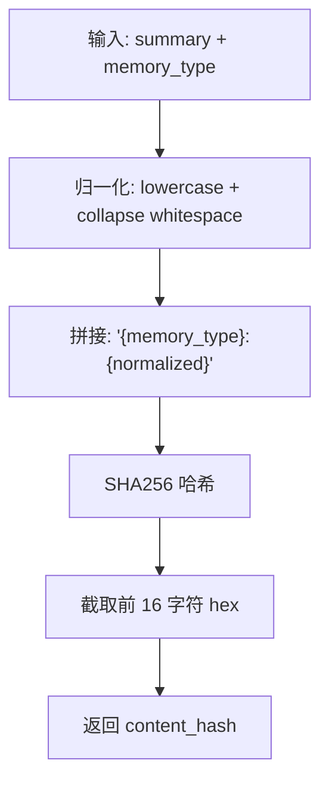
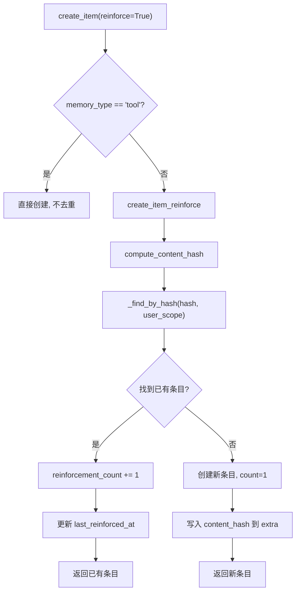
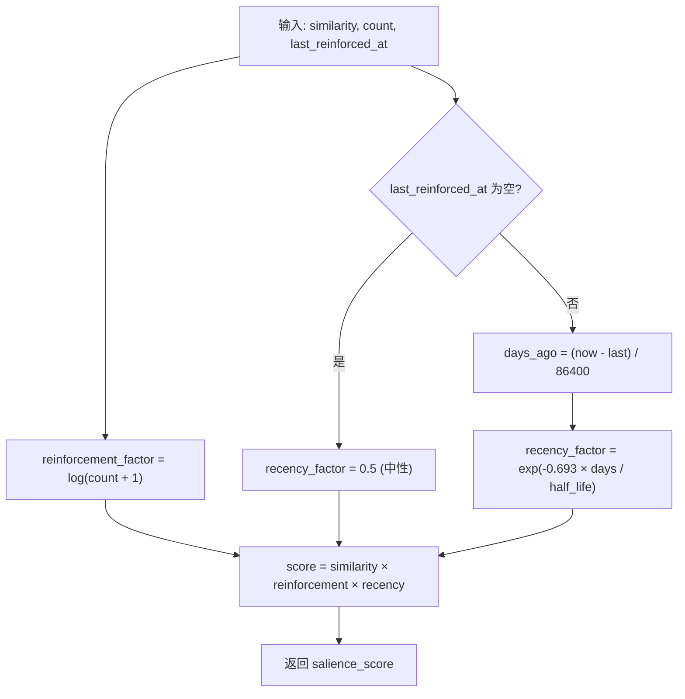
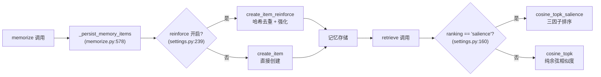

# PD-475.01 memU — SHA256 内容哈希去重与 Salience 强化评分

> 文档编号：PD-475.01
> 来源：memU `src/memu/database/inmemory/vector.py`, `src/memu/database/inmemory/repositories/memory_item_repo.py`, `src/memu/database/models.py`
> GitHub：https://github.com/NevaMind-AI/memU.git
> 问题域：PD-475 记忆去重与强化 Memory Deduplication & Reinforcement
> 状态：可复用方案

---

## 第 1 章 问题与动机

### 1.1 核心问题

Agent 记忆系统在持续运行中会反复接收相同或高度相似的信息。如果不做去重，记忆库会膨胀出大量冗余条目，导致检索质量下降、存储浪费、以及 top-k 结果被重复内容占据。同时，被反复提及的信息理应比只出现一次的信息更重要——这就是"强化"的需求。

更进一步，记忆还需要"遗忘"：长时间未被提及的信息应该自然衰减，让位给更新鲜的记忆。这三个需求（去重、强化、遗忘）需要一个统一的评分机制来协调。

### 1.2 memU 的解法概述

memU 通过三层机制解决这个问题：

1. **内容哈希去重**：对 `summary + memory_type` 做 SHA256 哈希（截取前 16 字符），写入时先查哈希是否已存在，存在则走强化路径而非创建新条目（`src/memu/database/models.py:15-32`）
2. **强化计数追踪**：每次去重命中时 `reinforcement_count += 1`，并更新 `last_reinforced_at` 时间戳，所有元数据存储在 `extra` JSON 字段中（`src/memu/database/inmemory/repositories/memory_item_repo.py:122-167`）
3. **Salience 综合评分**：检索时用 `similarity × log(reinforcement+1) × exp(-0.693 × days/half_life)` 三因子乘积排序，平衡相关性、重要性和时效性（`src/memu/database/inmemory/vector.py:16-53`）
4. **配置驱动开关**：通过 `enable_item_reinforcement` 和 `ranking: "salience"` 两个配置项控制是否启用，默认关闭保持向后兼容（`src/memu/app/settings.py:239-242`）
5. **多后端一致实现**：InMemory、SQLite、PostgreSQL 三个后端共享同一套去重/强化逻辑和 `compute_content_hash` 函数

### 1.3 设计思想

| 设计原则 | 具体实现 | 理由 | 替代方案 |
|----------|----------|------|----------|
| 写时去重 | SHA256 哈希在 `create_item_reinforce` 中计算并查重 | 避免读时去重的性能开销，写入频率远低于读取 | 读时聚类去重（计算量大） |
| 对数阻尼强化 | `log(count+1)` 而非线性 count | 防止高频记忆垄断 top-k，100 次强化只比 10 次高 2 倍 | 线性因子（会导致热门记忆垄断） |
| 半衰期指数衰减 | `exp(-0.693 × days / half_life)` | 物理学半衰期模型，30 天后权重降至 0.5，语义直观 | 线性衰减（不够平滑）、阶梯衰减（不连续） |
| 元数据存 extra JSON | `content_hash`、`reinforcement_count`、`last_reinforced_at` 全部存在 `extra` 字段 | 不修改核心 schema，向后兼容，灵活扩展 | 新增数据库列（需要 migration） |
| 归一化哈希输入 | `" ".join(summary.lower().split())` 消除大小写和多余空格 | "I love coffee" 和 "I  Love  Coffee" 应视为相同内容 | 精确匹配（过于严格） |
| 配置驱动默认关闭 | `enable_item_reinforcement=False`, `ranking="similarity"` | 不影响已有用户，按需开启 | 默认开启（可能破坏已有行为） |

---

## 第 2 章 源码实现分析

### 2.1 架构概览

memU 的记忆去重与强化系统由三个核心模块组成，分布在数据模型层、仓储层和向量计算层：

```
┌─────────────────────────────────────────────────────────────┐
│                    MemorizeMixin (app/memorize.py)           │
│  enable_item_reinforcement → create_item(reinforce=True)    │
└──────────────────────────┬──────────────────────────────────┘
                           │
                           ▼
┌─────────────────────────────────────────────────────────────┐
│              MemoryItemRepo Protocol (repositories/)         │
│  create_item(reinforce=bool) → create_item_reinforce()      │
│  vector_search_items(ranking="salience")                     │
├─────────────┬──────────────────┬────────────────────────────┤
│  InMemory   │     SQLite       │     PostgreSQL             │
│  (dict)     │  (json_extract)  │  (jsonb)                   │
└──────┬──────┴────────┬─────────┴──────────┬─────────────────┘
       │               │                    │
       ▼               ▼                    ▼
┌─────────────────────────────────────────────────────────────┐
│  compute_content_hash()     │  salience_score()             │
│  (models.py)                │  cosine_topk_salience()       │
│  SHA256 截取 16 字符         │  (vector.py)                  │
└─────────────────────────────┴───────────────────────────────┘
```

### 2.2 核心实现

#### 2.2.1 内容哈希计算



对应源码 `src/memu/database/models.py:15-32`：

```python
def compute_content_hash(summary: str, memory_type: str) -> str:
    """
    Generate unique hash for memory deduplication.
    Operates on post-summary content. Normalizes whitespace to handle
    minor formatting differences like "I love coffee" vs "I  love  coffee".
    """
    # Normalize: lowercase, strip, collapse whitespace
    normalized = " ".join(summary.lower().split())
    content = f"{memory_type}:{normalized}"
    return hashlib.sha256(content.encode()).hexdigest()[:16]
```

关键设计点：
- 哈希输入包含 `memory_type` 前缀，确保不同类型的相同文本不会被误判为重复（`models.py:31`）
- 截取 16 字符 hex（64 bit）在百万级记忆规模下碰撞概率极低
- 归一化只处理空格和大小写，不做语义归一化——这是有意为之，语义去重交给 embedding 相似度

#### 2.2.2 写入时去重与强化



对应源码 `src/memu/database/inmemory/repositories/memory_item_repo.py:122-167`：

```python
def create_item_reinforce(
    self,
    *,
    resource_id: str,
    memory_type: MemoryType,
    summary: str,
    embedding: list[float],
    user_data: dict[str, Any],
    reinforce: bool = False,
) -> MemoryItem:
    content_hash = compute_content_hash(summary, memory_type)

    # Check for existing item with same hash in same scope (deduplication)
    existing = self._find_by_hash(content_hash, user_data)
    if existing:
        # Reinforce existing memory instead of creating duplicate
        current_extra = existing.extra or {}
        current_count = current_extra.get("reinforcement_count", 1)
        existing.extra = {
            **current_extra,
            "reinforcement_count": current_count + 1,
            "last_reinforced_at": pendulum.now("UTC").isoformat(),
        }
        existing.updated_at = pendulum.now("UTC")
        return existing

    # Create new item with salience tracking in extra
    mid = str(uuid.uuid4())
    now = pendulum.now("UTC")
    item_extra = user_data.pop("extra", {}) if "extra" in user_data else {}
    item_extra.update({
        "content_hash": content_hash,
        "reinforcement_count": 1,
        "last_reinforced_at": now.isoformat(),
    })
    it = self.memory_item_model(
        id=mid, resource_id=resource_id, memory_type=memory_type,
        summary=summary, embedding=embedding, extra=item_extra, **user_data,
    )
    self.items[mid] = it
    return it
```

关键设计点：
- `_find_by_hash` 在同一 user scope 内查找（`memory_item_repo.py:62-77`），多用户场景下不会跨用户去重
- `tool` 类型记忆跳过去重（`memory_item_repo.py:90`），因为工具调用记录需要保留每次调用的完整历史
- SQLite 后端用 `json_extract(extra, '$.content_hash')` 实现同样的查重逻辑（`sqlite/repositories/memory_item_repo.py:309-320`）

#### 2.2.3 Salience 三因子评分



对应源码 `src/memu/database/inmemory/vector.py:16-53`：

```python
def salience_score(
    similarity: float,
    reinforcement_count: int,
    last_reinforced_at: datetime | None,
    recency_decay_days: float = 30.0,
) -> float:
    """
    Compute salience-aware score combining similarity, reinforcement, and recency.
    Formula: similarity * reinforcement_factor * recency_factor
    """
    # Reinforcement factor (logarithmic to prevent runaway scores)
    reinforcement_factor = math.log(reinforcement_count + 1)

    # Recency factor (exponential decay with half-life)
    if last_reinforced_at is None:
        recency_factor = 0.5  # Unknown recency gets neutral score
    else:
        now = datetime.now(last_reinforced_at.tzinfo) if last_reinforced_at.tzinfo else datetime.utcnow()
        days_ago = (now - last_reinforced_at).total_seconds() / 86400
        # 0.693 = ln(2), gives us proper half-life decay
        recency_factor = math.exp(-0.693 * days_ago / recency_decay_days)

    return similarity * reinforcement_factor * recency_factor
```

### 2.3 实现细节

**数据流：从写入到检索的完整路径**



**ToolCallResult 的独立去重机制**

memU 对工具调用记录有独立的去重策略（`models.py:56-65`）：用 MD5 哈希 `tool_name|input|output` 生成 `call_hash`，但这个去重发生在工具记忆的聚合层，不走 `create_item_reinforce` 路径。这体现了"不同类型记忆用不同去重策略"的设计思想。

**向量检索的性能优化**

`cosine_topk` 使用 NumPy 矩阵化计算 + `argpartition` 实现 O(n) 的 top-k 选择（`vector.py:56-91`），而 `cosine_topk_salience` 因为需要逐条计算三因子，退化为逐条遍历（`vector.py:94-127`）。这是一个有意的权衡：salience 排序需要额外的元数据，无法完全矩阵化。

**多后端一致性**

三个后端（InMemory、SQLite、PostgreSQL）共享 `compute_content_hash` 和 `salience_score` 函数，但查重方式不同：
- InMemory：遍历 dict 匹配 `extra.content_hash`（`memory_item_repo.py:62-77`）
- SQLite：`json_extract(extra, '$.content_hash')` SQL 查询（`sqlite/repositories/memory_item_repo.py:316`）
- PostgreSQL：JSONB 操作符查询

---

## 第 3 章 迁移指南

### 3.1 迁移清单

**阶段 1：数据模型（1 个文件）**
- [ ] 添加 `compute_content_hash(summary, memory_type)` 函数
- [ ] 在记忆条目的 extra/metadata 字段中预留 `content_hash`、`reinforcement_count`、`last_reinforced_at` 三个键

**阶段 2：写入去重（1-2 个文件）**
- [ ] 在记忆写入路径中添加 `reinforce` 开关
- [ ] 实现 `_find_by_hash` 查重逻辑（需适配你的存储后端）
- [ ] 命中时更新 count 和时间戳，未命中时创建新条目并写入 hash

**阶段 3：Salience 检索（1 个文件）**
- [ ] 实现 `salience_score` 三因子评分函数
- [ ] 在向量检索接口中添加 `ranking` 参数，支持 `"similarity"` 和 `"salience"` 两种模式
- [ ] 配置 `recency_decay_days` 半衰期参数

**阶段 4：配置集成**
- [ ] 添加 `enable_item_reinforcement` 配置项（默认 False）
- [ ] 添加 `ranking` 和 `recency_decay_days` 检索配置项

### 3.2 适配代码模板

以下是一个可直接复用的最小实现，不依赖 memU 的任何内部模块：

```python
"""记忆去重与强化 — 可移植实现模板"""
import hashlib
import math
from datetime import datetime, timezone
from dataclasses import dataclass, field


def compute_content_hash(content: str, content_type: str) -> str:
    """内容哈希去重。归一化后 SHA256 截取 16 字符。"""
    normalized = " ".join(content.lower().split())
    payload = f"{content_type}:{normalized}"
    return hashlib.sha256(payload.encode()).hexdigest()[:16]


def salience_score(
    similarity: float,
    reinforcement_count: int,
    last_reinforced_at: datetime | None,
    half_life_days: float = 30.0,
) -> float:
    """
    三因子 Salience 评分：similarity × log(count+1) × recency_decay
    
    - similarity: 余弦相似度 [0, 1]
    - reinforcement_count: 强化次数 ≥ 1
    - last_reinforced_at: 最后强化时间（UTC）
    - half_life_days: 半衰期天数，默认 30 天
    """
    # 对数阻尼：防止高频记忆垄断
    reinforce_factor = math.log(reinforcement_count + 1)
    
    # 指数衰减：半衰期模型
    if last_reinforced_at is None:
        recency_factor = 0.5
    else:
        now = datetime.now(timezone.utc)
        days_ago = (now - last_reinforced_at).total_seconds() / 86400
        recency_factor = math.exp(-0.693 * days_ago / half_life_days)
    
    return similarity * reinforce_factor * recency_factor


@dataclass
class MemoryEntry:
    id: str
    content: str
    content_type: str
    embedding: list[float]
    content_hash: str = ""
    reinforcement_count: int = 1
    last_reinforced_at: datetime = field(default_factory=lambda: datetime.now(timezone.utc))
    
    def __post_init__(self):
        if not self.content_hash:
            self.content_hash = compute_content_hash(self.content, self.content_type)


class MemoryStore:
    """带去重和强化的记忆存储。"""
    
    def __init__(self):
        self._entries: dict[str, MemoryEntry] = {}
        self._hash_index: dict[str, str] = {}  # content_hash -> entry_id
    
    def upsert(self, entry: MemoryEntry) -> MemoryEntry:
        """写入或强化记忆。"""
        existing_id = self._hash_index.get(entry.content_hash)
        if existing_id and existing_id in self._entries:
            existing = self._entries[existing_id]
            existing.reinforcement_count += 1
            existing.last_reinforced_at = datetime.now(timezone.utc)
            return existing
        
        self._entries[entry.id] = entry
        self._hash_index[entry.content_hash] = entry.id
        return entry
    
    def search(
        self,
        query_embedding: list[float],
        top_k: int = 5,
        ranking: str = "similarity",  # "similarity" | "salience"
        half_life_days: float = 30.0,
    ) -> list[tuple[str, float]]:
        """向量检索，支持 salience 排序。"""
        import numpy as np
        
        q = np.array(query_embedding, dtype=np.float32)
        scored: list[tuple[str, float]] = []
        
        for entry in self._entries.values():
            v = np.array(entry.embedding, dtype=np.float32)
            cos_sim = float(np.dot(q, v) / (np.linalg.norm(q) * np.linalg.norm(v) + 1e-9))
            
            if ranking == "salience":
                score = salience_score(
                    cos_sim, entry.reinforcement_count,
                    entry.last_reinforced_at, half_life_days,
                )
            else:
                score = cos_sim
            scored.append((entry.id, score))
        
        scored.sort(key=lambda x: x[1], reverse=True)
        return scored[:top_k]
```

### 3.3 适用场景

| 场景 | 适用度 | 说明 |
|------|--------|------|
| 对话式 Agent 长期记忆 | ⭐⭐⭐ | 用户反复提及的偏好/事实自然强化，旧记忆自然衰减 |
| 知识库增量更新 | ⭐⭐⭐ | 相同知识点多次导入时去重，避免检索结果冗余 |
| 多轮对话上下文管理 | ⭐⭐ | 短期对话中强化效果不明显，更适合长期记忆场景 |
| 工具调用记录 | ⭐ | memU 有意跳过 tool 类型的去重，因为每次调用都有独立价值 |
| 实时流式数据 | ⭐⭐ | 高频写入场景下哈希查重的 O(n) 遍历可能成为瓶颈，需加索引 |

---

## 第 4 章 测试用例

```python
"""基于 memU 真实函数签名的测试用例"""
import math
from datetime import datetime, timedelta, timezone

import pytest


class TestComputeContentHash:
    """测试 compute_content_hash (models.py:15-32)"""
    
    def test_same_content_same_hash(self):
        from memu.database.models import compute_content_hash
        h1 = compute_content_hash("I love coffee", "profile")
        h2 = compute_content_hash("I love coffee", "profile")
        assert h1 == h2
    
    def test_whitespace_normalization(self):
        """多余空格和大小写不影响哈希"""
        from memu.database.models import compute_content_hash
        h1 = compute_content_hash("I love coffee", "profile")
        h2 = compute_content_hash("I  Love  Coffee", "profile")
        assert h1 == h2
    
    def test_different_type_different_hash(self):
        """不同 memory_type 产生不同哈希"""
        from memu.database.models import compute_content_hash
        h1 = compute_content_hash("I love coffee", "profile")
        h2 = compute_content_hash("I love coffee", "event")
        assert h1 != h2
    
    def test_hash_length(self):
        from memu.database.models import compute_content_hash
        h = compute_content_hash("test", "profile")
        assert len(h) == 16
        assert all(c in "0123456789abcdef" for c in h)


class TestSalienceScore:
    """测试 salience_score (vector.py:16-53)"""
    
    def test_basic_computation(self):
        from memu.database.inmemory.vector import salience_score
        now = datetime.now(timezone.utc)
        score = salience_score(0.9, 5, now, recency_decay_days=30.0)
        expected = 0.9 * math.log(6) * 1.0  # recency ≈ 1.0 for "now"
        assert abs(score - expected) < 0.01
    
    def test_reinforcement_dampening(self):
        """100 次强化不应比 10 次高太多（对数阻尼）"""
        from memu.database.inmemory.vector import salience_score
        now = datetime.now(timezone.utc)
        score_10 = salience_score(1.0, 10, now)
        score_100 = salience_score(1.0, 100, now)
        ratio = score_100 / score_10
        assert ratio < 2.0  # log(101)/log(11) ≈ 1.92
    
    def test_recency_half_life(self):
        """30 天后 recency factor 应约为 0.5"""
        from memu.database.inmemory.vector import salience_score
        past = datetime.now(timezone.utc) - timedelta(days=30)
        score = salience_score(1.0, 1, past, recency_decay_days=30.0)
        expected = math.log(2) * 0.5  # similarity=1, log(2), recency≈0.5
        assert abs(score - expected) < 0.05
    
    def test_none_recency_gets_neutral(self):
        """last_reinforced_at 为 None 时 recency_factor = 0.5"""
        from memu.database.inmemory.vector import salience_score
        score = salience_score(1.0, 1, None)
        expected = 1.0 * math.log(2) * 0.5
        assert abs(score - expected) < 0.01
    
    def test_zero_reinforcement(self):
        """reinforcement_count=0 时 factor = log(1) = 0"""
        from memu.database.inmemory.vector import salience_score
        now = datetime.now(timezone.utc)
        score = salience_score(1.0, 0, now)
        assert score == 0.0


class TestDeduplication:
    """测试写入去重行为 (memory_item_repo.py:122-167)"""
    
    def test_reinforce_increments_count(self):
        """重复写入应增加 reinforcement_count 而非创建新条目"""
        # 模拟 create_item_reinforce 的核心逻辑
        store: dict[str, dict] = {}
        
        def upsert(summary: str, memory_type: str):
            from memu.database.models import compute_content_hash
            h = compute_content_hash(summary, memory_type)
            if h in store:
                store[h]["reinforcement_count"] += 1
                return store[h], False  # existing
            store[h] = {"summary": summary, "reinforcement_count": 1, "hash": h}
            return store[h], True  # new
        
        entry1, is_new1 = upsert("I love coffee", "profile")
        assert is_new1 is True
        assert entry1["reinforcement_count"] == 1
        
        entry2, is_new2 = upsert("I love coffee", "profile")
        assert is_new2 is False
        assert entry2["reinforcement_count"] == 2
        
        # 只有一个条目
        assert len(store) == 1
    
    def test_different_content_creates_new(self):
        """不同内容应创建新条目"""
        from memu.database.models import compute_content_hash
        h1 = compute_content_hash("I love coffee", "profile")
        h2 = compute_content_hash("I love tea", "profile")
        assert h1 != h2
```

---

## 第 5 章 跨域关联

| 关联域 | 关系类型 | 说明 |
|--------|----------|------|
| PD-06 记忆持久化 | 依赖 | 去重和强化的元数据（content_hash、reinforcement_count）需要持久化存储支持。memU 通过 extra JSON 字段实现，SQLite 用 `json_extract`，PostgreSQL 用 JSONB |
| PD-08 搜索与检索 | 协同 | Salience 评分直接影响检索排序。`cosine_topk_salience` 是对标准向量检索的增强，需要检索层支持自定义排序策略 |
| PD-01 上下文管理 | 协同 | 去重减少记忆条目数量，间接降低注入上下文时的 token 消耗。强化排序让最相关的记忆优先进入有限的上下文窗口 |
| PD-07 质量检查 | 协同 | Salience 评分可作为记忆质量的代理指标：高强化 + 高相似度 + 近期活跃 = 高质量记忆 |
| PD-10 中间件管道 | 依赖 | memU 的 memorize 工作流通过 `WorkflowStep` 管道执行，`dedupe_merge` 是管道中的一个独立步骤（`memorize.py:132-138`） |

---

## 第 6 章 来源文件索引

| 文件 | 行范围 | 关键实现 |
|------|--------|----------|
| `src/memu/database/models.py` | L15-L32 | `compute_content_hash` — SHA256 哈希计算与归一化 |
| `src/memu/database/models.py` | L76-L94 | `MemoryItem` 模型定义，extra 字段结构说明 |
| `src/memu/database/models.py` | L56-L65 | `ToolCallResult.generate_hash` — 工具调用的独立 MD5 去重 |
| `src/memu/database/inmemory/vector.py` | L16-L53 | `salience_score` — 三因子评分函数 |
| `src/memu/database/inmemory/vector.py` | L56-L91 | `cosine_topk` — NumPy 矩阵化 top-k 检索 |
| `src/memu/database/inmemory/vector.py` | L94-L127 | `cosine_topk_salience` — Salience 感知的 top-k 检索 |
| `src/memu/database/inmemory/repositories/memory_item_repo.py` | L62-L77 | `_find_by_hash` — 按内容哈希查找已有条目 |
| `src/memu/database/inmemory/repositories/memory_item_repo.py` | L79-L120 | `create_item` — 写入入口，reinforce 分发 |
| `src/memu/database/inmemory/repositories/memory_item_repo.py` | L122-L167 | `create_item_reinforce` — 去重 + 强化核心逻辑 |
| `src/memu/database/inmemory/repositories/memory_item_repo.py` | L169-L196 | `vector_search_items` — 支持 salience 排序的检索 |
| `src/memu/database/sqlite/repositories/memory_item_repo.py` | L285-L386 | SQLite 后端的 `create_item_reinforce`，用 `json_extract` 查重 |
| `src/memu/database/repositories/memory_item.py` | L10-L54 | `MemoryItemRepo` Protocol — 抽象接口定义 |
| `src/memu/app/settings.py` | L160-L167 | `RetrieveItemConfig` — ranking 和 recency_decay_days 配置 |
| `src/memu/app/settings.py` | L239-L242 | `enable_item_reinforcement` 配置项 |
| `src/memu/app/memorize.py` | L603-L612 | `_persist_memory_items` — 调用 `create_item(reinforce=...)` |

---

## 第 7 章 横向对比维度

```json comparison_data
{
  "project": "memU",
  "dimensions": {
    "去重策略": "SHA256(type:normalized_summary) 截取 16 字符，写时哈希查重",
    "强化机制": "reinforcement_count 递增 + last_reinforced_at 时间戳更新",
    "评分公式": "similarity × log(count+1) × exp(-0.693 × days/half_life)",
    "衰减模型": "指数半衰期衰减，默认 30 天，可配置 recency_decay_days",
    "存储方式": "extra JSON 字段存储元数据，不修改核心 schema",
    "多后端支持": "InMemory/SQLite/PostgreSQL 三后端一致实现"
  }
}
```

### 域元数据补充

```json domain_metadata
{
  "solution_summary": "memU 用 SHA256(type:normalized_summary) 写时哈希去重，命中时递增 reinforcement_count，检索时用 similarity×log(count+1)×exp_decay 三因子 Salience 评分排序",
  "description": "写时哈希去重与检索时三因子加权排序的协同机制",
  "sub_problems": [
    "多存储后端的去重一致性（InMemory/SQLite/PostgreSQL）",
    "工具调用记录的独立去重策略（MD5 call_hash）",
    "哈希归一化边界（空格/大小写 vs 语义等价）"
  ],
  "best_practices": [
    "将去重元数据存入 extra JSON 字段而非新增列，避免 schema migration",
    "对 tool 类型记忆跳过去重，保留每次调用的完整历史",
    "用 type 前缀区分哈希命名空间，防止跨类型误判"
  ]
}
```
