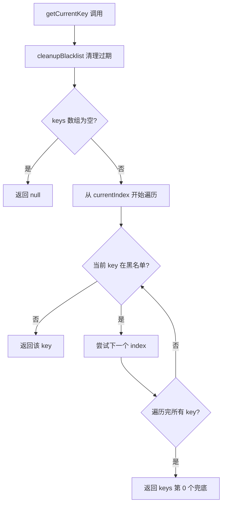
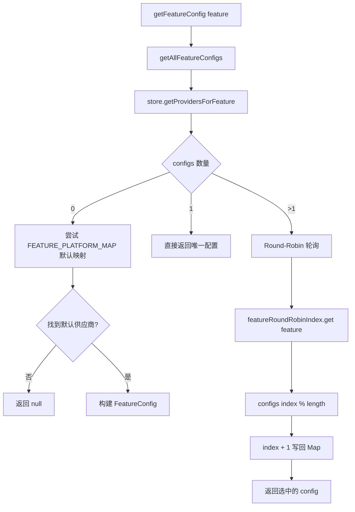
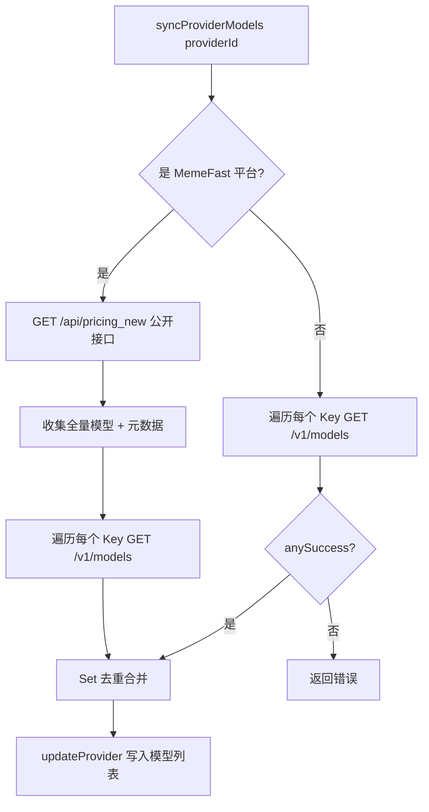

# PD-476.01 moyin-creator — ApiKeyManager 多 Key 轮询与功能级模型路由

> 文档编号：PD-476.01
> 来源：moyin-creator `src/lib/api-key-manager.ts` `src/lib/ai/feature-router.ts` `src/stores/api-config-store.ts`
> GitHub：https://github.com/MemeCalculate/moyin-creator.git
> 问题域：PD-476 API Key 轮询与多供应商管理
> 状态：可复用方案

---

## 第 1 章 问题与动机

### 1.1 核心问题

AI 应用在生产环境中面临三个关键的 API 管理挑战：

1. **单 Key 限流瓶颈**：单个 API Key 受 RPM/TPM 限制，高并发场景下成为吞吐量天花板。尤其在批量生成（剧本分析 → 角色生成 → 分镜 → 视频）的流水线中，单 Key 频繁触发 429 限流。
2. **功能与模型的绑定粒度**：不同 AI 功能（文本分析、图片生成、视频生成）对模型能力要求不同，全局配置一个模型无法满足多功能需求。需要按功能域（feature）独立绑定供应商和模型。
3. **Key 失效的运行时容错**：API Key 可能因欠费、过期、被封等原因失效，需要自动检测并切换到可用 Key，而非直接报错中断用户流程。

### 1.2 moyin-creator 的解法概述

moyin-creator 构建了一套三层架构来解决上述问题：

1. **ApiKeyManager 类**（`src/lib/api-key-manager.ts:259`）：逗号/换行分隔多 Key 解析 + 随机起始索引 + 90 秒黑名单自动恢复的轮询管理器
2. **Feature Router**（`src/lib/ai/feature-router.ts:133`）：按 AIFeature 枚举路由到绑定的供应商+模型，支持多模型 round-robin 轮询
3. **API Config Store**（`src/stores/api-config-store.ts:364`）：Zustand 持久化 Store，管理供应商 CRUD + 功能绑定 + `syncProviderModels` 自动发现供应商可用模型列表
4. **Error-driven Discovery**（`src/lib/script/script-parser.ts:337`）：从 400 错误响应中自动解析模型限制并缓存，下次调用自动使用正确参数
5. **统一调用入口 callFeatureAPI**（`src/lib/ai/feature-router.ts:238`）：业务代码只需传 feature 名称，自动获取配置、轮询 Key、路由模型

### 1.3 设计思想

| 设计原则 | 具体实现 | 理由 | 替代方案 |
|----------|----------|------|----------|
| 功能级绑定 | `FeatureBindings: Record<AIFeature, string[]>` 每个功能独立绑定多个 `platform:model` | 剧本分析用 DeepSeek，图片生成用 DALL-E，视频用 Sora，各取所长 | 全局单模型配置（无法满足多功能需求） |
| 随机起始 + 轮询 | `Math.floor(Math.random() * keys.length)` 初始化 + round-robin | 多实例部署时避免所有实例同时打同一个 Key | 固定从第一个 Key 开始（热点集中） |
| 黑名单自愈 | 90 秒 TTL 黑名单，`cleanupBlacklist()` 自动过期恢复 | 临时限流的 Key 过一段时间可能恢复，不应永久排除 | 永久移除失败 Key（浪费可用资源） |
| 错误驱动发现 | 从 400 错误体解析 `max_tokens` 限制并缓存到 localStorage | 552+ 模型不可能全部预注册，运行时自动学习最准确 | 维护巨大的静态模型限制表（维护成本高） |
| 供应商模型自动发现 | `syncProviderModels` 遍历每个 Key 调 `/v1/models`，Set 去重合并 | 不同 Key 可能有不同的模型权限，合并后展示完整列表 | 手动输入模型名（易出错） |

---

## 第 2 章 源码实现分析

### 2.1 架构概览

```
┌─────────────────────────────────────────────────────────────────┐
│                      业务层 (callFeatureAPI)                      │
│  script-parser / character-gen / video-gen / batch-processor     │
└──────────────────────────┬──────────────────────────────────────┘
                           │ feature: AIFeature
                           ▼
┌─────────────────────────────────────────────────────────────────┐
│                   Feature Router (feature-router.ts)              │
│  getFeatureConfig(feature) → FeatureConfig                       │
│  ┌─────────────┐  ┌──────────────────┐  ┌───────────────────┐  │
│  │ 功能绑定查询  │→│ 多模型 Round-Robin │→│ ApiKeyManager 注入 │  │
│  └─────────────┘  └──────────────────┘  └───────────────────┘  │
└──────────────────────────┬──────────────────────────────────────┘
                           │
          ┌────────────────┼────────────────┐
          ▼                ▼                ▼
┌──────────────┐  ┌──────────────┐  ┌──────────────────────┐
│ ApiKeyManager │  │ API Config   │  │ Model Registry       │
│ (轮询+黑名单) │  │ Store(Zustand)│  │ (三层限制查找)        │
│ key-manager.ts│  │ config-store │  │ model-registry.ts    │
└──────────────┘  └──────────────┘  └──────────────────────┘
```

### 2.2 核心实现

#### 2.2.1 ApiKeyManager：多 Key 轮询与黑名单



对应源码 `src/lib/api-key-manager.ts:259-387`：

```typescript
export class ApiKeyManager {
  private keys: string[];
  private currentIndex: number;
  private blacklist: Map<string, BlacklistedKey> = new Map();

  constructor(apiKeyString: string) {
    this.keys = parseApiKeys(apiKeyString);
    // 随机起始索引：多实例部署时避免热点
    this.currentIndex = this.keys.length > 0
      ? Math.floor(Math.random() * this.keys.length) : 0;
  }

  getCurrentKey(): string | null {
    this.cleanupBlacklist();
    if (this.keys.length === 0) return null;
    for (let i = 0; i < this.keys.length; i++) {
      const index = (this.currentIndex + i) % this.keys.length;
      const key = this.keys[index];
      if (!this.blacklist.has(key)) {
        this.currentIndex = index;
        return key;
      }
    }
    return this.keys.length > 0 ? this.keys[0] : null;
  }

  handleError(statusCode: number): boolean {
    // 429 限流、401 认证失败、503 服务不可用 → 黑名单 + 轮换
    if (statusCode === 429 || statusCode === 401 || statusCode === 503) {
      this.markCurrentKeyFailed();
      return true;
    }
    return false;
  }
}
```

关键设计点：
- **随机起始**（`api-key-manager.ts:267`）：`Math.floor(Math.random() * this.keys.length)` 确保多实例不会同时打同一个 Key
- **90 秒黑名单 TTL**（`api-key-manager.ts:253`）：`BLACKLIST_DURATION_MS = 90 * 1000`，临时限流的 Key 自动恢复
- **全部黑名单兜底**（`api-key-manager.ts:290`）：所有 Key 都被黑名单时返回第一个 Key，不会返回 null 导致业务中断

#### 2.2.2 Feature Router：功能级模型路由与多模型轮询



对应源码 `src/lib/ai/feature-router.ts:133-182`：

```typescript
// 多模型轮询调度器：记录每个功能的当前索引
const featureRoundRobinIndex: Map<AIFeature, number> = new Map();

export function getFeatureConfig(feature: AIFeature): FeatureConfig | null {
  const configs = getAllFeatureConfigs(feature);

  if (configs.length === 0) {
    // Fallback: 尝试使用默认平台映射
    const store = useAPIConfigStore.getState();
    const defaultPlatform = FEATURE_PLATFORM_MAP[feature];
    if (defaultPlatform) {
      const provider = store.providers.find(p => p.platform === defaultPlatform);
      if (provider) { /* 构建 FeatureConfig ... */ }
    }
    return null;
  }

  if (configs.length === 1) return configs[0];

  // 多模型轮询
  const currentIndex = featureRoundRobinIndex.get(feature) || 0;
  const config = configs[currentIndex % configs.length];
  featureRoundRobinIndex.set(feature, currentIndex + 1);
  return config;
}
```

#### 2.2.3 syncProviderModels：供应商模型自动发现



对应源码 `src/stores/api-config-store.ts:364-523`：

```typescript
syncProviderModels: async (providerId) => {
  const provider = get().providers.find(p => p.id === providerId);
  const keys = parseApiKeys(provider.apiKey);
  const allModelIds = new Set<string>();

  if (isMemefast) {
    // 1. 公开接口获取全量模型 + 元数据（model_type, tags, endpoint_types）
    const pricingUrl = `${domain}/api/pricing_new`;
    const response = await fetch(pricingUrl);
    // ... 收集 allModelIds + 存储 modelTypes/modelTags/modelEndpointTypes

    // 2. 遍历每个 Key 补充该 Key 独有模型
    for (let ki = 0; ki < keys.length; ki++) {
      const resp = await fetch(modelsUrl, {
        headers: { 'Authorization': `Bearer ${keys[ki]}` },
      });
      // ... 合并到 allModelIds
    }
  } else {
    // 标准 OpenAI 兼容：遍历每个 Key 查 /v1/models，合并去重
    for (let ki = 0; ki < keys.length; ki++) { /* ... */ }
  }

  get().updateProvider({ ...provider, model: Array.from(allModelIds) });
}
```

### 2.3 实现细节

**Key 解析与分隔符支持**（`api-key-manager.ts:222-228`）：

```typescript
export function parseApiKeys(apiKey: string): string[] {
  if (!apiKey) return [];
  return apiKey.split(/[,\n]/).map(k => k.trim()).filter(k => k.length > 0);
}
```

支持逗号和换行两种分隔符，用户可以在输入框中粘贴多个 Key，每行一个或逗号分隔。

**Error-driven Discovery**（`script-parser.ts:337-367`）：当 API 返回 400 错误时，从错误消息中解析模型的真实 `max_tokens` 限制，缓存到 localStorage，下次调用自动使用正确值。这使得 552+ 模型无需全部预注册。

**Provider Key Manager 全局单例**（`api-key-manager.ts:392-418`）：每个 provider 维护一个全局 `ApiKeyManager` 实例，通过 `getProviderKeyManager(providerId, apiKey)` 获取。Store 更新 Key 时同步调用 `updateProviderKeys` 重置 manager。

**功能绑定格式演进**（`api-config-store.ts:1000-1057`）：从 v1 单字符串 → v5 `string[]` 多选 → v8 `platform:model` → v9 `id:model`（修复多个 custom 供应商歧义），通过 `migrate` 函数自动升级。


---

## 第 3 章 迁移指南

### 3.1 迁移清单

**阶段 1：Key 管理基础（1 个文件）**

- [ ] 移植 `ApiKeyManager` 类（含 `parseApiKeys`、`maskApiKey` 工具函数）
- [ ] 配置黑名单 TTL（默认 90 秒，可根据供应商限流策略调整）
- [ ] 在 API 调用层集成 `handleError(statusCode)` 自动轮换

**阶段 2：功能级路由（2 个文件）**

- [ ] 定义 `AIFeature` 枚举（按业务功能划分）
- [ ] 实现 `FeatureBindings` 存储（`Record<AIFeature, string[]>`）
- [ ] 实现 `getFeatureConfig(feature)` 路由函数
- [ ] 实现多模型 round-robin 轮询（`featureRoundRobinIndex` Map）

**阶段 3：供应商管理（1 个文件）**

- [ ] 实现 `IProvider` 接口和 CRUD 操作
- [ ] 实现 `syncProviderModels` 自动发现（调 `/v1/models` 接口）
- [ ] 实现持久化存储（Zustand persist / localStorage）
- [ ] 实现版本迁移（`migrate` 函数处理数据格式升级）

### 3.2 适配代码模板

#### 最小可用版本：ApiKeyManager + Feature Router

```typescript
// ============ api-key-manager.ts ============

interface BlacklistedKey {
  key: string;
  blacklistedAt: number;
}

const BLACKLIST_DURATION_MS = 90_000; // 90 秒

export function parseApiKeys(raw: string): string[] {
  if (!raw) return [];
  return raw.split(/[,\n]/).map(k => k.trim()).filter(Boolean);
}

export class ApiKeyManager {
  private keys: string[];
  private currentIndex: number;
  private blacklist = new Map<string, BlacklistedKey>();

  constructor(apiKeyString: string) {
    this.keys = parseApiKeys(apiKeyString);
    this.currentIndex = this.keys.length > 0
      ? Math.floor(Math.random() * this.keys.length)
      : 0;
  }

  getCurrentKey(): string | null {
    this.cleanExpired();
    for (let i = 0; i < this.keys.length; i++) {
      const idx = (this.currentIndex + i) % this.keys.length;
      if (!this.blacklist.has(this.keys[idx])) {
        this.currentIndex = idx;
        return this.keys[idx];
      }
    }
    return this.keys[0] ?? null; // 全部黑名单时兜底
  }

  rotateKey(): string | null {
    if (this.keys.length <= 1) return this.getCurrentKey();
    this.currentIndex = (this.currentIndex + 1) % this.keys.length;
    return this.getCurrentKey();
  }

  handleError(status: number): boolean {
    if ([429, 401, 503].includes(status)) {
      const key = this.keys[this.currentIndex];
      if (key) this.blacklist.set(key, { key, blacklistedAt: Date.now() });
      this.rotateKey();
      return true;
    }
    return false;
  }

  getAvailableCount(): number {
    this.cleanExpired();
    return this.keys.filter(k => !this.blacklist.has(k)).length;
  }

  private cleanExpired(): void {
    const now = Date.now();
    for (const [key, entry] of this.blacklist) {
      if (now - entry.blacklistedAt >= BLACKLIST_DURATION_MS) {
        this.blacklist.delete(key);
      }
    }
  }
}

// ============ feature-router.ts ============

type AIFeature = string; // 按业务定义枚举

interface FeatureConfig {
  feature: AIFeature;
  provider: { name: string; baseUrl: string; apiKey: string };
  model: string;
  keyManager: ApiKeyManager;
}

// 功能绑定存储（实际项目中用 Zustand/Redux 持久化）
const featureBindings = new Map<AIFeature, Array<{ providerKey: string; model: string }>>();
const roundRobinIndex = new Map<AIFeature, number>();

export function getFeatureConfig(feature: AIFeature): FeatureConfig | null {
  const bindings = featureBindings.get(feature);
  if (!bindings || bindings.length === 0) return null;

  if (bindings.length === 1) {
    // 单绑定直接返回
    return buildConfig(feature, bindings[0]);
  }

  // 多绑定 round-robin
  const idx = roundRobinIndex.get(feature) ?? 0;
  const binding = bindings[idx % bindings.length];
  roundRobinIndex.set(feature, idx + 1);
  return buildConfig(feature, binding);
}
```

### 3.3 适用场景

| 场景 | 适用度 | 说明 |
|------|--------|------|
| 多 Key 负载均衡 | ⭐⭐⭐ | 核心场景，逗号分隔多 Key + 随机起始 + round-robin |
| 功能级模型绑定 | ⭐⭐⭐ | 不同 AI 功能绑定不同供应商/模型，各取所长 |
| Key 失效自动切换 | ⭐⭐⭐ | 429/401/503 自动黑名单 + 90 秒自愈 |
| 供应商模型自动发现 | ⭐⭐ | 适用于 OpenAI 兼容 API，需要 `/v1/models` 端点支持 |
| 多实例部署 | ⭐⭐ | 随机起始索引避免热点，但无跨实例协调 |
| 高可用生产环境 | ⭐ | 缺少持久化黑名单、跨实例共享状态、健康检查等 |

---

## 第 4 章 测试用例

```typescript
import { describe, it, expect, vi, beforeEach } from 'vitest';

// ==================== ApiKeyManager Tests ====================

class ApiKeyManager {
  // ... (同 3.2 适配代码)
  private keys: string[];
  private currentIndex: number;
  private blacklist = new Map<string, { key: string; blacklistedAt: number }>();
  private BLACKLIST_DURATION_MS = 90_000;

  constructor(apiKeyString: string) {
    this.keys = apiKeyString.split(/[,\n]/).map(k => k.trim()).filter(Boolean);
    this.currentIndex = this.keys.length > 0
      ? Math.floor(Math.random() * this.keys.length) : 0;
  }

  getCurrentKey(): string | null {
    this.cleanExpired();
    for (let i = 0; i < this.keys.length; i++) {
      const idx = (this.currentIndex + i) % this.keys.length;
      if (!this.blacklist.has(this.keys[idx])) {
        this.currentIndex = idx;
        return this.keys[idx];
      }
    }
    return this.keys[0] ?? null;
  }

  rotateKey(): string | null {
    if (this.keys.length <= 1) return this.getCurrentKey();
    this.currentIndex = (this.currentIndex + 1) % this.keys.length;
    return this.getCurrentKey();
  }

  handleError(status: number): boolean {
    if ([429, 401, 503].includes(status)) {
      const key = this.keys[this.currentIndex];
      if (key) this.blacklist.set(key, { key, blacklistedAt: Date.now() });
      this.rotateKey();
      return true;
    }
    return false;
  }

  getAvailableCount(): number {
    this.cleanExpired();
    return this.keys.filter(k => !this.blacklist.has(k)).length;
  }

  private cleanExpired(): void {
    const now = Date.now();
    for (const [key, entry] of this.blacklist) {
      if (now - entry.blacklistedAt >= this.BLACKLIST_DURATION_MS) {
        this.blacklist.delete(key);
      }
    }
  }
}

describe('ApiKeyManager', () => {
  it('should parse comma-separated keys', () => {
    const mgr = new ApiKeyManager('key1,key2,key3');
    expect(mgr.getAvailableCount()).toBe(3);
  });

  it('should parse newline-separated keys', () => {
    const mgr = new ApiKeyManager('key1\nkey2\nkey3');
    expect(mgr.getAvailableCount()).toBe(3);
  });

  it('should return null for empty input', () => {
    const mgr = new ApiKeyManager('');
    expect(mgr.getCurrentKey()).toBeNull();
  });

  it('should rotate through keys', () => {
    const mgr = new ApiKeyManager('key1,key2,key3');
    const seen = new Set<string>();
    for (let i = 0; i < 6; i++) {
      const key = mgr.getCurrentKey();
      seen.add(key!);
      mgr.rotateKey();
    }
    expect(seen.size).toBe(3);
  });

  it('should blacklist key on 429 and skip it', () => {
    const mgr = new ApiKeyManager('key1,key2');
    // 强制从 key1 开始
    while (mgr.getCurrentKey() !== 'key1') mgr.rotateKey();

    mgr.handleError(429);
    // key1 被黑名单，应该返回 key2
    expect(mgr.getCurrentKey()).toBe('key2');
  });

  it('should recover blacklisted key after TTL', () => {
    const mgr = new ApiKeyManager('key1,key2');
    while (mgr.getCurrentKey() !== 'key1') mgr.rotateKey();

    mgr.handleError(429);
    expect(mgr.getCurrentKey()).toBe('key2');

    // 模拟 90 秒后
    vi.useFakeTimers();
    vi.advanceTimersByTime(91_000);
    // key1 应该恢复
    expect(mgr.getAvailableCount()).toBe(2);
    vi.useRealTimers();
  });

  it('should fallback to first key when all blacklisted', () => {
    const mgr = new ApiKeyManager('key1,key2');
    mgr.handleError(429); // 黑名单当前 key
    mgr.handleError(429); // 黑名单另一个 key
    // 全部黑名单时应返回第一个 key 兜底
    expect(mgr.getCurrentKey()).toBe('key1');
  });

  it('should not rotate on 400 errors', () => {
    const mgr = new ApiKeyManager('key1,key2');
    const before = mgr.getCurrentKey();
    const rotated = mgr.handleError(400);
    expect(rotated).toBe(false);
    expect(mgr.getCurrentKey()).toBe(before);
  });
});
```


---

## 第 5 章 跨域关联

| 关联域 | 关系类型 | 说明 |
|--------|----------|------|
| PD-03 容错与重试 | 协同 | ApiKeyManager 的黑名单机制是容错的一部分；`callChatAPI` 中的 `retryOperation` + `handleError` 组合实现了 Key 级别的容错重试 |
| PD-04 工具系统 | 协同 | Feature Router 本质上是一个工具路由层，将不同 AI 功能路由到不同供应商，类似工具注册与分发 |
| PD-01 上下文管理 | 依赖 | `callChatAPI` 中的 Token Budget Calculator 依赖 Model Registry 的 contextWindow 限制，与 Key 管理共同决定请求参数 |
| PD-11 可观测性 | 协同 | Feature Router 的 `console.log` 记录了每次路由决策（功能→供应商→模型→Key 索引），为调试提供可观测性 |
| PD-443 多模型路由 | 强关联 | Feature Router 的多模型 round-robin 轮询与 PD-443 的模型路由策略高度相关，但 moyin-creator 侧重功能级绑定而非智能路由 |

---

## 第 6 章 来源文件索引

| 文件 | 行范围 | 关键实现 |
|------|--------|----------|
| `src/lib/api-key-manager.ts` | L222-L228 | `parseApiKeys` 逗号/换行分隔解析 |
| `src/lib/api-key-manager.ts` | L248-L253 | `BlacklistedKey` 接口 + 90 秒 TTL 常量 |
| `src/lib/api-key-manager.ts` | L259-L387 | `ApiKeyManager` 类完整实现（轮询+黑名单+错误处理） |
| `src/lib/api-key-manager.ts` | L392-L418 | Provider Key Manager 全局单例管理 |
| `src/lib/ai/feature-router.ts` | L22-L33 | `FeatureConfig` 接口定义 |
| `src/lib/ai/feature-router.ts` | L36-L49 | `featureRoundRobinIndex` + `FEATURE_PLATFORM_MAP` 默认映射 |
| `src/lib/ai/feature-router.ts` | L97-L125 | `getAllFeatureConfigs` 获取功能的所有可用配置 |
| `src/lib/ai/feature-router.ts` | L133-L182 | `getFeatureConfig` 核心路由 + 多模型轮询 |
| `src/lib/ai/feature-router.ts` | L238-L279 | `callFeatureAPI` 统一调用入口 |
| `src/stores/api-config-store.ts` | L33-L66 | `AIFeature` 类型 + `AI_FEATURES` 功能定义 |
| `src/stores/api-config-store.ts` | L364-L523 | `syncProviderModels` 供应商模型自动发现 |
| `src/stores/api-config-store.ts` | L583-L609 | `getProvidersForFeature` 功能绑定解析（id/platform 双重匹配） |
| `src/stores/api-config-store.ts` | L1000-L1057 | v8→v9 迁移：platform:model → id:model 格式转换 |
| `src/lib/script/script-parser.ts` | L288-L295 | `callChatAPI` 中 KeyManager 集成（getCurrentKey + 轮换） |
| `src/lib/script/script-parser.ts` | L328-L367 | 错误处理：handleError 轮换 + Error-driven Discovery |
| `src/lib/ai/batch-processor.ts` | L105-L233 | `processBatched` 批处理中通过 `callFeatureAPI` 自动使用 Key 轮询 |

---

## 第 7 章 横向对比维度

```json comparison_data
{
  "project": "moyin-creator",
  "dimensions": {
    "Key管理模式": "ApiKeyManager 类：逗号/换行分隔解析 + 随机起始 round-robin + 90秒 TTL 黑名单",
    "路由粒度": "功能级绑定：8 种 AIFeature 各自绑定 platform:model 数组",
    "模型发现": "syncProviderModels 遍历每个 Key 调 /v1/models + pricing_new 公开接口，Set 去重合并",
    "失效检测": "handleError 按 HTTP 状态码（429/401/503）自动黑名单 + 轮换，90秒自愈",
    "多模型调度": "双层 round-robin：功能级多模型轮询 + Key 级轮询，互不干扰",
    "数据迁移": "Zustand persist v1→v9 九版本渐进迁移，自动处理格式升级"
  }
}
```

### 域元数据补充

```json domain_metadata
{
  "solution_summary": "moyin-creator 用 ApiKeyManager 类实现逗号分隔多Key随机起始轮询+90秒TTL黑名单自愈，Feature Router 按8种功能域独立绑定供应商模型并支持多模型round-robin",
  "description": "API Key 生命周期管理与功能级模型路由的工程实践",
  "sub_problems": [
    "黑名单自愈策略（TTL vs 永久移除 vs 健康检查）",
    "功能绑定格式的版本迁移与向后兼容",
    "多实例部署下的Key分配协调"
  ],
  "best_practices": [
    "随机起始索引避免多实例热点集中",
    "全部Key黑名单时兜底返回第一个Key而非null",
    "Error-driven Discovery从400错误自动学习模型限制"
  ]
}
```

