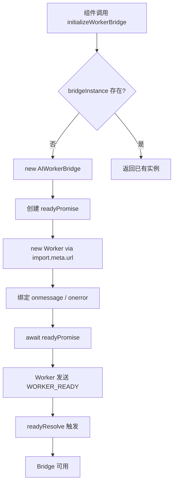
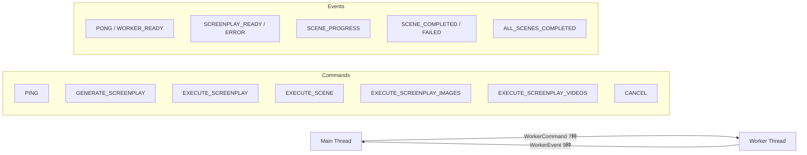
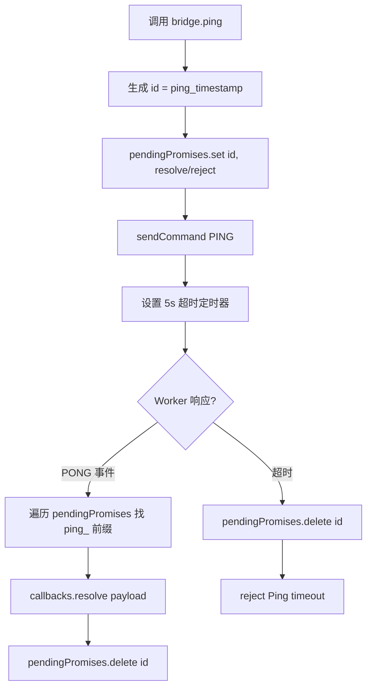
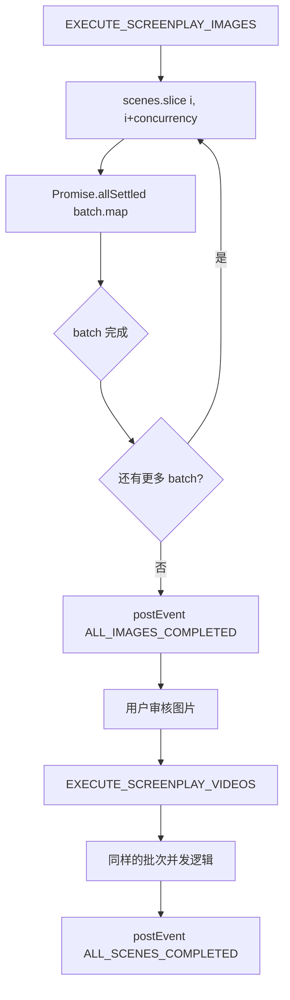

# PD-477.01 moyin-creator — AIWorkerBridge 单例桥接与双阶段媒体生成卸载

> 文档编号：PD-477.01
> 来源：moyin-creator `src/lib/ai/worker-bridge.ts` `src/workers/ai-worker.ts`
> GitHub：https://github.com/MemeCalculate/moyin-creator.git
> 问题域：PD-477 Web Worker 任务卸载 Web Worker Task Offloading
> 状态：可复用方案

---

## 第 1 章 问题与动机（≥ 30 行）

### 1.1 核心问题

在浏览器端 AI 视频创作应用中，剧本生成（LLM 调用）、图片生成（Diffusion API 轮询）、视频生成（视频 API 轮询）三类任务都是长时间阻塞操作。如果在主线程执行：

- **UI 冻结**：单次图片生成轮询可达 60 次（2s 间隔 = 2 分钟），视频生成可达 120 次（4 分钟），期间主线程被 `await fetch` 阻塞
- **进度丢失**：用户无法看到实时进度，因为 React 渲染被阻塞
- **取消困难**：长轮询中无法响应用户的取消操作
- **并发受限**：多场景并行生成时，主线程的事件循环被大量 Promise 占满

moyin-creator 是一个 AI 驱动的短视频创作工具，核心流程是：用户输入 prompt → LLM 生成剧本（多场景）→ 每个场景生成图片 → 每个场景生成视频 → 组装时间线。这个流程涉及大量异步 API 调用和轮询，天然适合卸载到 Web Worker。

### 1.2 moyin-creator 的解法概述

1. **Singleton Bridge 模式**：`AIWorkerBridge` 类通过 `getWorkerBridge()` 工厂函数提供全局单例，统一管理 Worker 生命周期和消息路由（`src/lib/ai/worker-bridge.ts:413-424`）
2. **强类型双向协议**：`WorkerCommand`（7 种命令）和 `WorkerEvent`（9 种事件）通过 TypeScript 联合类型 + 类型映射确保编译期安全（`src/packages/ai-core/protocol/index.ts:16-23, 83-92`）
3. **Promise 回调管理**：Bridge 内部维护 `pendingPromises: Map<string, PromiseCallbacks>`，将异步 Worker 消息转换为 Promise 语义，支持超时自动清理（`src/lib/ai/worker-bridge.ts:30, 96-117`）
4. **双阶段生成流水线**：Worker 支持 Image-Only → Video-Only 两步流程，允许用户在图片阶段审核后再决定是否生成视频（`src/workers/ai-worker.ts:642-738, 744-823`）
5. **批次并发控制**：通过 `concurrency` 参数控制场景并行度，使用 `Promise.allSettled` + 批次循环实现受控并发（`src/workers/ai-worker.ts:601-622`）

### 1.3 设计思想

| 设计原则 | 具体实现 | 理由 | 替代方案 |
|----------|----------|------|----------|
| 单例桥接 | `getWorkerBridge()` 懒初始化全局唯一 Bridge | 避免多 Worker 实例竞争资源，简化状态管理 | 每个组件创建独立 Worker（资源浪费） |
| 协议优先 | `WorkerCommand` / `WorkerEvent` 联合类型 + `CommandHandlers` / `EventHandlers` 类型映射 | 编译期捕获消息类型错误，IDE 自动补全 | 裸 `postMessage` + 运行时类型检查 |
| Promise 桥接 | `pendingPromises` Map 将 Worker 异步消息转为 Promise | 调用方可用 `await bridge.generateScreenplay()` | 纯事件回调（调用方代码复杂） |
| 双阶段解耦 | Image-Only / Video-Only 独立命令 | 用户可审核图片后再生成视频，节省成本 | 一次性生成全部（无法中途审核） |
| 批次并发 | `for + slice + Promise.allSettled` | 控制并发数避免 API 限流，`allSettled` 保证部分失败不影响其他场景 | `Promise.all`（一个失败全部失败） |

---

## 第 2 章 源码实现分析（≥ 60 行，核心章节）

### 2.1 架构概览

moyin-creator 的 Worker 卸载架构分为三层：

```
┌─────────────────────────────────────────────────────────────┐
│                    Main Thread (React)                       │
│                                                             │
│  ┌──────────────┐  ┌──────────────────┐  ┌──────────────┐  │
│  │ScreenplayInput│  │GenerationProgress│  │DirectorStore │  │
│  │  (触发生成)   │  │  (注册事件回调)   │  │ (状态管理)   │  │
│  └──────┬───────┘  └────────┬─────────┘  └──────▲───────┘  │
│         │                   │                    │           │
│         ▼                   ▼                    │           │
│  ┌──────────────────────────────────────────┐    │           │
│  │        AIWorkerBridge (Singleton)         │    │           │
│  │  - pendingPromises: Map<id, callbacks>   │    │           │
│  │  - eventHandlers: Partial<EventHandlers> │    │           │
│  │  - handleSceneCompleted → Store 注入     │────┘           │
│  └──────────────────┬───────────────────────┘               │
│                     │ postMessage / onmessage                │
├─────────────────────┼───────────────────────────────────────┤
│                     │        Web Worker Thread               │
│  ┌──────────────────▼───────────────────────┐               │
│  │            AI Worker (ai-worker.ts)       │               │
│  │  - self.onmessage → switch(command.type)  │               │
│  │  - PromptCompiler (模板编译)              │               │
│  │  - TaskPoller (异步轮询)                  │               │
│  │  - generateImage / generateVideo (API)    │               │
│  │  - 批次并发: for + slice + allSettled     │               │
│  └──────────────────────────────────────────┘               │
└─────────────────────────────────────────────────────────────┘
```

### 2.2 核心实现

#### 2.2.1 Singleton Bridge 与 Worker 初始化



对应源码 `src/lib/ai/worker-bridge.ts:27-62`：
```typescript
export class AIWorkerBridge {
  private worker: Worker | null = null;
  private eventHandlers: Partial<EventHandlers> = {};
  private pendingPromises: Map<string, PromiseCallbacks> = new Map();
  private isReady = false;
  private readyPromise: Promise<void>;
  private readyResolve: (() => void) | null = null;

  constructor() {
    this.readyPromise = new Promise((resolve) => {
      this.readyResolve = resolve;
    });
  }

  async initialize(): Promise<void> {
    if (this.worker) {
      console.warn('[WorkerBridge] Worker already initialized');
      return;
    }
    this.worker = new Worker(
      new URL('../../workers/ai-worker.ts', import.meta.url)
    );
    this.worker.onmessage = this.handleWorkerMessage.bind(this);
    this.worker.onerror = this.handleWorkerError.bind(this);
    await this.readyPromise;
  }
}

// Singleton
let bridgeInstance: AIWorkerBridge | null = null;
export function getWorkerBridge(): AIWorkerBridge {
  if (!bridgeInstance) {
    bridgeInstance = new AIWorkerBridge();
  }
  return bridgeInstance;
}
```

关键设计：`readyPromise` 模式确保 `initialize()` 返回时 Worker 已完成初始化（收到 `WORKER_READY` 事件），调用方无需关心 Worker 启动时序。

#### 2.2.2 强类型双向协议



对应源码 `src/packages/ai-core/protocol/index.ts:16-23, 83-92, 181-194`：
```typescript
// 命令联合类型
export type WorkerCommand =
  | PingCommand
  | GenerateScreenplayCommand
  | ExecuteScreenplayCommand
  | ExecuteSceneCommand
  | RetrySceneCommand
  | CancelCommand
  | UpdateConfigCommand;

// 事件联合类型
export type WorkerEvent =
  | PongEvent
  | ScreenplayReadyEvent
  | ScreenplayErrorEvent
  | SceneProgressEvent
  | SceneCompletedEvent
  | SceneFailedEvent
  | AllScenesCompletedEvent
  | WorkerErrorEvent
  | WorkerReadyEvent;

// 类型安全的事件处理器映射
export type EventHandlers = {
  [K in EventType]?: (
    payload: Extract<WorkerEvent, { type: K }>['payload']
  ) => void;
};
```

`EventHandlers` 使用 TypeScript 映射类型 + `Extract` 条件类型，确保每个事件处理器的参数类型与对应事件的 payload 精确匹配。

#### 2.2.3 Promise 回调管理与超时



对应源码 `src/lib/ai/worker-bridge.ts:95-117`：
```typescript
async ping(): Promise<number> {
  const timestamp = Date.now();
  return new Promise((resolve, reject) => {
    const id = `ping_${timestamp}`;
    this.pendingPromises.set(id, {
      resolve: (payload: unknown) => {
        const p = payload as { workerTimestamp: number };
        resolve(p.workerTimestamp - timestamp);
      },
      reject,
    });
    this.sendCommand({ type: 'PING', payload: { timestamp } });
    // Timeout after 5 seconds
    setTimeout(() => {
      if (this.pendingPromises.has(id)) {
        this.pendingPromises.delete(id);
        reject(new Error('Ping timeout'));
      }
    }, 5000);
  });
}
```

Promise 管理的核心模式：用 `id` 前缀（`ping_`、`screenplay_`）区分不同类型的待处理 Promise，在 `handleWorkerMessage` 中通过前缀匹配找到对应的 resolve/reject 回调。

#### 2.2.4 批次并发控制与双阶段流水线



对应源码 `src/workers/ai-worker.ts:697-737`：
```typescript
// Process scenes in batches
for (let i = 0; i < scenes.length; i += concurrency) {
  if (cancelled) {
    console.log('[AI Worker] Image generation cancelled');
    break;
  }
  const batch = scenes.slice(i, i + concurrency);
  // Execute batch in parallel
  await Promise.allSettled(
    batch.map(async (scene) => {
      try {
        await generateSceneImageOnly(
          screenplay.id, scene, extendedConfig,
          screenplay.characterBible, characterReferenceImages
        );
        completedCount++;
      } catch (error) {
        failedCount++;
      }
    })
  );
}
```

关键设计：
- `Promise.allSettled` 而非 `Promise.all`：单个场景失败不会中断整个批次
- `cancelled` 标志在批次间检查：允许用户在批次间隙取消
- 双阶段解耦：`EXECUTE_SCREENPLAY_IMAGES` 和 `EXECUTE_SCREENPLAY_VIDEOS` 是独立命令，中间可插入用户审核

### 2.3 实现细节

#### Worker 端消息分发

Worker 使用 `self.onmessage` + `switch` 模式分发命令（`src/workers/ai-worker.ts:84-130`）。每个命令处理器是独立的 async 函数，顶层 try-catch 捕获未处理异常并通过 `WORKER_ERROR` 事件上报。

#### Bridge 端 Store 注入

`handleSceneCompleted`（`src/lib/ai/worker-bridge.ts:332-388`）是 Bridge 的核心副作用处理器：
1. 将 Worker 返回的 `mediaBlob` 转为 `File` 对象
2. 动态导入 `useMediaStore`、`useProjectStore`、`useDirectorStore`（避免循环依赖）
3. 将文件注入 MediaStore 的 `ai-video` 分类文件夹
4. 通知 DirectorStore 更新场景状态

#### 取消机制

Worker 端通过模块级 `cancelled` 标志实现取消（`src/workers/ai-worker.ts:80, 1178-1186`）：
- `CANCEL` 命令设置 `cancelled = true`
- 轮询循环和批次循环在每次迭代前检查该标志
- 100ms 后自动重置，允许后续新操作

#### TaskPoller 动态超时

`TaskPoller`（`src/packages/ai-core/api/task-poller.ts:33-120`）支持根据服务端返回的 `estimatedTime` 动态调整超时：
- 默认超时 10 分钟，最大 30 分钟
- 如果服务端返回预估时间，取 `estimatedTime * 2 + 120s` 作为新超时
- 网络错误不中断轮询，仅 warn 后继续

---

## 第 3 章 迁移指南（≥ 40 行）

### 3.1 迁移清单

**阶段 1：协议定义**
- [ ] 定义 `WorkerCommand` 和 `WorkerEvent` 联合类型
- [ ] 为每种命令/事件定义独立 interface（含 `type` 字面量和 `payload`）
- [ ] 导出 `EventHandlers` 和 `CommandHandlers` 类型映射

**阶段 2：Worker 实现**
- [ ] 创建 Worker 文件，实现 `self.onmessage` + switch 分发
- [ ] 实现各命令处理器（async 函数）
- [ ] 添加 `WORKER_READY` 初始化信号
- [ ] 实现取消标志和批次并发逻辑

**阶段 3：Bridge 实现**
- [ ] 实现 `AIWorkerBridge` 类（Worker 创建、消息路由、事件分发）
- [ ] 实现 `pendingPromises` Map 的 Promise 桥接
- [ ] 实现 Singleton 工厂函数
- [ ] 添加 `readyPromise` 初始化等待机制

**阶段 4：集成**
- [ ] 在 UI 组件中通过 `getWorkerBridge()` 获取单例
- [ ] 注册事件处理器更新 UI 状态
- [ ] 处理 Worker 错误和 Promise 超时

### 3.2 适配代码模板

以下是一个可直接复用的最小化 Worker Bridge 模板：

```typescript
// === protocol.ts ===
export type WorkerCommand =
  | { type: 'PING'; payload: { timestamp: number } }
  | { type: 'PROCESS'; payload: { taskId: string; data: unknown } }
  | { type: 'CANCEL'; payload?: { taskId?: string } };

export type WorkerEvent =
  | { type: 'PONG'; payload: { latency: number } }
  | { type: 'WORKER_READY'; payload: { version: string } }
  | { type: 'PROGRESS'; payload: { taskId: string; progress: number } }
  | { type: 'COMPLETED'; payload: { taskId: string; result: unknown } }
  | { type: 'FAILED'; payload: { taskId: string; error: string } }
  | { type: 'WORKER_ERROR'; payload: { message: string } };

export type EventType = WorkerEvent['type'];
export type EventHandlers = {
  [K in EventType]?: (payload: Extract<WorkerEvent, { type: K }>['payload']) => void;
};

// === worker-bridge.ts ===
type PromiseCallbacks = {
  resolve: (value: unknown) => void;
  reject: (error: Error) => void;
};

export class WorkerBridge {
  private worker: Worker | null = null;
  private handlers: Partial<EventHandlers> = {};
  private pending: Map<string, PromiseCallbacks> = new Map();
  private readyResolve: (() => void) | null = null;
  private readyPromise: Promise<void>;

  constructor() {
    this.readyPromise = new Promise(r => { this.readyResolve = r; });
  }

  async initialize(workerUrl: URL): Promise<void> {
    if (this.worker) return;
    this.worker = new Worker(workerUrl);
    this.worker.onmessage = (e: MessageEvent<WorkerEvent>) => {
      const event = e.data;
      if (event.type === 'WORKER_READY') {
        this.readyResolve?.();
        return;
      }
      // Resolve pending promises by prefix match
      for (const [id, cb] of this.pending) {
        if (this.matchEvent(id, event.type)) {
          cb.resolve(event.payload);
          this.pending.delete(id);
          break;
        }
      }
      // Dispatch to registered handlers
      (this.handlers as any)[event.type]?.(event.payload);
    };
    this.worker.onerror = (err) => {
      for (const [, cb] of this.pending) cb.reject(new Error(err.message));
      this.pending.clear();
    };
    await this.readyPromise;
  }

  on<K extends EventType>(type: K, handler: EventHandlers[K]): void {
    this.handlers[type] = handler;
  }

  send(command: WorkerCommand): void {
    this.worker?.postMessage(command);
  }

  request<T>(command: WorkerCommand, prefix: string, timeoutMs = 30000): Promise<T> {
    return new Promise((resolve, reject) => {
      const id = `${prefix}_${Date.now()}`;
      this.pending.set(id, { resolve: resolve as any, reject });
      this.send(command);
      setTimeout(() => {
        if (this.pending.has(id)) {
          this.pending.delete(id);
          reject(new Error(`${prefix} timeout`));
        }
      }, timeoutMs);
    });
  }

  terminate(): void {
    this.worker?.terminate();
    this.worker = null;
  }

  private matchEvent(id: string, eventType: string): boolean {
    const prefix = id.split('_')[0];
    const map: Record<string, string[]> = {
      ping: ['PONG'],
      process: ['COMPLETED', 'FAILED'],
    };
    return map[prefix]?.includes(eventType) ?? false;
  }
}

// Singleton
let instance: WorkerBridge | null = null;
export function getWorkerBridge(): WorkerBridge {
  if (!instance) instance = new WorkerBridge();
  return instance;
}
```

### 3.3 适用场景

| 场景 | 适用度 | 说明 |
|------|--------|------|
| AI 生成类应用（图片/视频/音频） | ⭐⭐⭐ | 长轮询 + 进度回调是核心需求 |
| 批量数据处理（CSV/Excel 解析） | ⭐⭐⭐ | CPU 密集型任务卸载到 Worker |
| 实时协作编辑器 | ⭐⭐ | 可用于 OT/CRDT 计算卸载，但需要更复杂的状态同步 |
| 简单表单提交 | ⭐ | 过度设计，直接在主线程 fetch 即可 |
| SSR/Node.js 环境 | ❌ | Web Worker 是浏览器 API，不适用 |

---

## 第 4 章 测试用例（≥ 20 行）

```typescript
import { describe, it, expect, vi, beforeEach, afterEach } from 'vitest';

// Mock Worker
class MockWorker {
  onmessage: ((e: MessageEvent) => void) | null = null;
  onerror: ((e: ErrorEvent) => void) | null = null;
  private messageLog: any[] = [];

  postMessage(data: any): void {
    this.messageLog.push(data);
    // Simulate WORKER_READY on first message or immediately
    if (data.type === 'PING') {
      setTimeout(() => {
        this.onmessage?.({ data: { type: 'PONG', payload: { timestamp: data.payload.timestamp, workerTimestamp: Date.now() } } } as any);
      }, 10);
    }
  }

  simulateEvent(event: any): void {
    this.onmessage?.({ data: event } as any);
  }

  terminate(): void {}
  getMessages(): any[] { return this.messageLog; }
}

describe('AIWorkerBridge', () => {
  let bridge: any;
  let mockWorker: MockWorker;

  beforeEach(() => {
    mockWorker = new MockWorker();
    vi.stubGlobal('Worker', vi.fn(() => mockWorker));
  });

  afterEach(() => {
    vi.restoreAllMocks();
  });

  describe('Singleton Pattern', () => {
    it('should return same instance on multiple calls', () => {
      // getWorkerBridge always returns the same instance
      const { getWorkerBridge } = require('./worker-bridge');
      const a = getWorkerBridge();
      const b = getWorkerBridge();
      expect(a).toBe(b);
    });
  });

  describe('Initialization', () => {
    it('should wait for WORKER_READY before resolving initialize()', async () => {
      const { AIWorkerBridge } = require('./worker-bridge');
      bridge = new AIWorkerBridge();

      const initPromise = bridge.initialize();
      // Worker not ready yet
      expect(bridge.isReady).toBeFalsy();

      // Simulate worker ready
      mockWorker.simulateEvent({ type: 'WORKER_READY', payload: { version: '0.3.1' } });

      await initPromise;
      // Now ready
    });

    it('should skip re-initialization if already initialized', async () => {
      const { AIWorkerBridge } = require('./worker-bridge');
      bridge = new AIWorkerBridge();
      mockWorker.simulateEvent({ type: 'WORKER_READY', payload: { version: '0.3.1' } });
      await bridge.initialize();
      await bridge.initialize(); // Should not throw
    });
  });

  describe('Promise Management', () => {
    it('should resolve ping with latency', async () => {
      const { AIWorkerBridge } = require('./worker-bridge');
      bridge = new AIWorkerBridge();
      mockWorker.simulateEvent({ type: 'WORKER_READY', payload: { version: '0.3.1' } });
      await bridge.initialize();

      const pingPromise = bridge.ping();
      // PONG will be auto-simulated by MockWorker
      const latency = await pingPromise;
      expect(typeof latency).toBe('number');
    });

    it('should reject ping on timeout', async () => {
      vi.useFakeTimers();
      const { AIWorkerBridge } = require('./worker-bridge');
      bridge = new AIWorkerBridge();
      mockWorker.postMessage = vi.fn(); // Don't auto-respond
      mockWorker.simulateEvent({ type: 'WORKER_READY', payload: { version: '0.3.1' } });
      await bridge.initialize();

      const pingPromise = bridge.ping();
      vi.advanceTimersByTime(6000);
      await expect(pingPromise).rejects.toThrow('Ping timeout');
      vi.useRealTimers();
    });
  });

  describe('Event Handlers', () => {
    it('should dispatch events to registered handlers', async () => {
      const { AIWorkerBridge } = require('./worker-bridge');
      bridge = new AIWorkerBridge();
      mockWorker.simulateEvent({ type: 'WORKER_READY', payload: { version: '0.3.1' } });
      await bridge.initialize();

      const handler = vi.fn();
      bridge.on('SCENE_PROGRESS', handler);

      mockWorker.simulateEvent({
        type: 'SCENE_PROGRESS',
        payload: { screenplayId: 'sp1', sceneId: 1, progress: { sceneId: 1, status: 'generating', stage: 'image', progress: 50 } },
      });

      expect(handler).toHaveBeenCalledWith(
        expect.objectContaining({ sceneId: 1 })
      );
    });

    it('should remove handler with off()', async () => {
      const { AIWorkerBridge } = require('./worker-bridge');
      bridge = new AIWorkerBridge();
      mockWorker.simulateEvent({ type: 'WORKER_READY', payload: { version: '0.3.1' } });
      await bridge.initialize();

      const handler = vi.fn();
      bridge.on('SCENE_PROGRESS', handler);
      bridge.off('SCENE_PROGRESS');

      mockWorker.simulateEvent({
        type: 'SCENE_PROGRESS',
        payload: { screenplayId: 'sp1', sceneId: 1, progress: {} },
      });

      expect(handler).not.toHaveBeenCalled();
    });
  });

  describe('Error Handling', () => {
    it('should reject all pending promises on worker error', async () => {
      const { AIWorkerBridge } = require('./worker-bridge');
      bridge = new AIWorkerBridge();
      mockWorker.simulateEvent({ type: 'WORKER_READY', payload: { version: '0.3.1' } });
      await bridge.initialize();

      // Don't auto-respond to ping
      mockWorker.postMessage = vi.fn();
      const pingPromise = bridge.ping();

      // Simulate worker crash
      mockWorker.onerror?.({ message: 'Worker crashed' } as any);

      await expect(pingPromise).rejects.toThrow('Worker error');
    });
  });

  describe('Cancellation', () => {
    it('should send CANCEL command to worker', async () => {
      const { AIWorkerBridge } = require('./worker-bridge');
      bridge = new AIWorkerBridge();
      mockWorker.simulateEvent({ type: 'WORKER_READY', payload: { version: '0.3.1' } });
      await bridge.initialize();

      bridge.cancel('sp1', 2);
      const messages = mockWorker.getMessages();
      const cancelMsg = messages.find((m: any) => m.type === 'CANCEL');
      expect(cancelMsg).toBeDefined();
      expect(cancelMsg.payload).toEqual({ screenplayId: 'sp1', sceneId: 2 });
    });
  });
});

describe('Batch Concurrency (Worker-side)', () => {
  it('should process scenes in batches with controlled concurrency', async () => {
    const scenes = Array.from({ length: 5 }, (_, i) => ({ sceneId: i + 1 }));
    const concurrency = 2;
    const processed: number[] = [];

    // Simulate batch processing logic
    for (let i = 0; i < scenes.length; i += concurrency) {
      const batch = scenes.slice(i, i + concurrency);
      await Promise.allSettled(
        batch.map(async (scene) => {
          processed.push(scene.sceneId);
        })
      );
    }

    expect(processed).toEqual([1, 2, 3, 4, 5]);
    // Batches: [1,2], [3,4], [5]
  });

  it('should continue on partial failure with allSettled', async () => {
    const results = await Promise.allSettled([
      Promise.resolve('ok'),
      Promise.reject(new Error('fail')),
      Promise.resolve('ok2'),
    ]);

    expect(results[0]).toEqual({ status: 'fulfilled', value: 'ok' });
    expect(results[1]).toMatchObject({ status: 'rejected' });
    expect(results[2]).toEqual({ status: 'fulfilled', value: 'ok2' });
  });
});
```

---

## 第 5 章 跨域关联

| 关联域 | 关系类型 | 说明 |
|--------|----------|------|
| PD-03 容错与重试 | 协同 | Worker 的 `cancelled` 标志 + `Promise.allSettled` 批次容错 + TaskPoller 网络错误重试，构成多层容错体系 |
| PD-04 工具系统 | 协同 | Worker 内部的 `PromptCompiler` 和 `TaskPoller` 是可插拔的工具组件，通过 import 注入 |
| PD-10 中间件管道 | 协同 | Bridge 的 `handleSceneCompleted` 是一个隐式管道：Blob → File → MediaStore → DirectorStore，可抽象为中间件链 |
| PD-11 可观测性 | 协同 | `SCENE_PROGRESS` 事件提供细粒度进度追踪（stage + progress%），`console.log` 贯穿全链路 |
| PD-483 异步任务轮询 | 强依赖 | Worker 内部的 `pollTaskCompletion` 和 `TaskPoller` 是异步轮询的核心实现，PD-477 依赖 PD-483 的轮询能力 |

---

## 第 6 章 来源文件索引

| 文件 | 行范围 | 关键实现 |
|------|--------|----------|
| `src/lib/ai/worker-bridge.ts` | L27-62 | AIWorkerBridge 类定义、初始化、readyPromise |
| `src/lib/ai/worker-bridge.ts` | L78-117 | 事件注册 on/off、ping Promise 管理 |
| `src/lib/ai/worker-bridge.ts` | L122-148 | generateScreenplay Promise 桥接 |
| `src/lib/ai/worker-bridge.ts` | L234-317 | handleWorkerMessage 消息路由 |
| `src/lib/ai/worker-bridge.ts` | L332-410 | handleSceneCompleted/Failed Store 注入 |
| `src/lib/ai/worker-bridge.ts` | L413-434 | Singleton 工厂函数 |
| `src/workers/ai-worker.ts` | L84-130 | self.onmessage 命令分发 |
| `src/workers/ai-worker.ts` | L144-212 | handleGenerateScreenplay API 调用 |
| `src/workers/ai-worker.ts` | L328-394 | pollTaskCompletion 轮询逻辑 |
| `src/workers/ai-worker.ts` | L562-636 | handleExecuteScreenplay 批次并发 |
| `src/workers/ai-worker.ts` | L642-738 | handleExecuteScreenplayImages 双阶段 Step 1 |
| `src/workers/ai-worker.ts` | L744-823 | handleExecuteScreenplayVideos 双阶段 Step 2 |
| `src/workers/ai-worker.ts` | L1178-1186 | handleCancel 取消机制 |
| `src/packages/ai-core/protocol/index.ts` | L16-23 | WorkerCommand 联合类型 |
| `src/packages/ai-core/protocol/index.ts` | L83-92 | WorkerEvent 联合类型 |
| `src/packages/ai-core/protocol/index.ts` | L181-194 | EventHandlers/CommandHandlers 类型映射 |
| `src/packages/ai-core/types/index.ts` | L14-26 | AIScreenplay 接口 |
| `src/packages/ai-core/types/index.ts` | L42-61 | AIScene 接口 |
| `src/packages/ai-core/types/index.ts` | L83-95 | SceneProgress 接口 |
| `src/packages/ai-core/types/index.ts` | L119-140 | GenerationConfig 接口 |
| `src/packages/ai-core/api/task-poller.ts` | L24-120 | TaskPoller 动态超时轮询 |
| `src/components/panels/director/screenplay-input.tsx` | L19, L373 | Bridge 初始化调用点 |
| `src/components/panels/director/generation-progress.tsx` | L23, L105 | Bridge 事件注册调用点 |
| `src/stores/director-store.ts` | L1592-1634 | onSceneCompleted/Failed/AllCompleted 状态更新 |

---

## 第 7 章 横向对比维度

> **重要：** 本章用于自动填充 Butcher Wiki 的横向对比表。
> 必须严格按以下 JSON 格式输出，放在 `comparison_data` 代码块中。

```json comparison_data
{
  "project": "moyin-creator",
  "dimensions": {
    "桥接模式": "Singleton AIWorkerBridge，readyPromise 等待初始化",
    "协议设计": "TypeScript 联合类型 + Extract 映射，7 命令 9 事件",
    "Promise管理": "pendingPromises Map + 前缀匹配 + 超时清理",
    "并发控制": "for+slice+allSettled 批次并发，configurable concurrency",
    "生成流水线": "双阶段解耦：Image-Only → 用户审核 → Video-Only",
    "取消机制": "模块级 cancelled 标志 + 100ms 自动重置",
    "Store集成": "Bridge 内动态 import Store，完成后自动注入媒体资源"
  }
}
```

### 域元数据补充

```json domain_metadata
{
  "solution_summary": "moyin-creator 用 Singleton AIWorkerBridge + 强类型双向协议将 AI 图片/视频生成卸载到 Web Worker，支持双阶段流水线和批次并发控制",
  "description": "浏览器端长时间 AI 生成任务的主线程解耦与异步编排",
  "sub_problems": [
    "双阶段生成流水线的中间审核点设计",
    "Worker 内批次并发度控制与 API 限流适配",
    "Bridge 到 Store 的副作用注入与循环依赖规避"
  ],
  "best_practices": [
    "readyPromise 模式确保 Worker 初始化完成后再接受命令",
    "Promise.allSettled 批次执行保证部分失败不影响整体",
    "动态 import Store 避免 Bridge 与 UI 层循环依赖"
  ]
}
```
