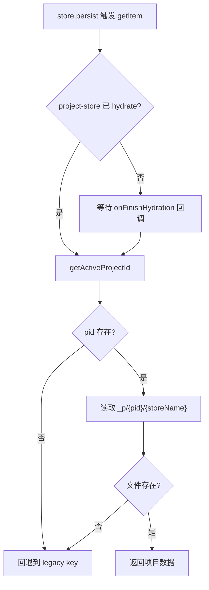
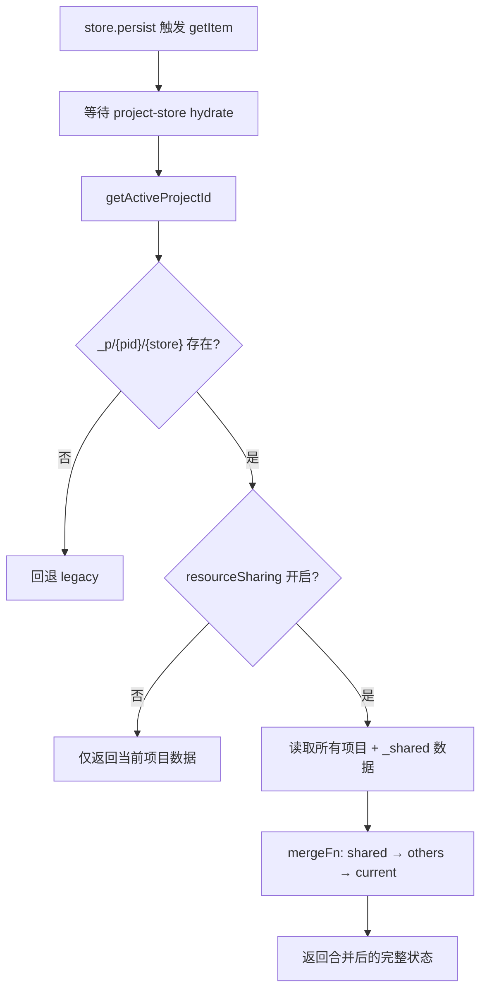
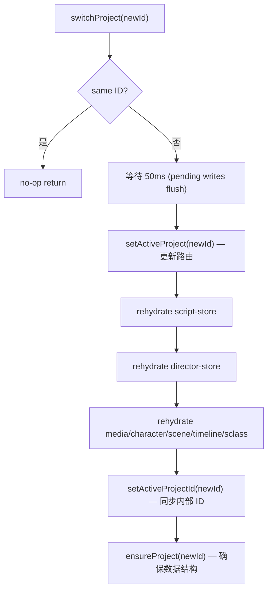

# PD-478.01 moyin-creator — Zustand 双轨 Storage Adapter 项目级状态隔离

> 文档编号：PD-478.01
> 来源：moyin-creator `src/lib/project-storage.ts` `src/lib/project-switcher.ts` `src/lib/storage-migration.ts`
> GitHub：https://github.com/MemeCalculate/moyin-creator.git
> 问题域：PD-478 项目级状态隔离 Project-Scoped State Isolation
> 状态：可复用方案

---

## 第 1 章 问题与动机

### 1.1 核心问题

Electron 桌面应用中，多个项目共享同一组 Zustand store。当用户在项目间切换时，store 中的状态属于"上一个项目"，如果不做隔离，会出现：

1. **数据串写**：项目 A 的脚本数据被写入项目 B 的存储文件
2. **rehydrate 竞态**：切换项目时，persist 中间件的自动写入与 rehydrate 读取产生竞态，导致新项目文件被空数据覆盖
3. **资源归属模糊**：媒体、角色、场景等资源有的属于项目、有的是全局共享，单体存储无法区分
4. **迁移风险**：从单文件存储升级到多项目存储时，数据丢失不可逆

moyin-creator 是一个 Electron + React 视频创作工具，包含脚本编辑、分镜、角色库、媒体库、时间线等 7 个 Zustand store，每个 store 都需要按项目隔离。

### 1.2 moyin-creator 的解法概述

moyin-creator 设计了一套**双轨 Storage Adapter** 体系，在 Zustand persist 中间件层面拦截读写，实现透明的项目级路由：

1. **`createProjectScopedStorage`**（纯项目轨）：将 store 数据路由到 `_p/{projectId}/{storeName}.json`，用于脚本、分镜、时间线等纯项目数据（`project-storage.ts:61`）
2. **`createSplitStorage`**（分裂轨）：将 store 数据拆分为项目部分 `_p/{pid}/` 和共享部分 `_shared/`，用于媒体、角色、场景等混合数据（`project-storage.ts:169`）
3. **`switchProject`**（切换协调器）：严格控制 rehydrate 顺序，先更新路由再 rehydrate 再同步内部 ID，避免竞态覆盖（`project-switcher.ts:39`）
4. **`migrateToProjectStorage`**（安全迁移）：幂等迁移 + flag 标记 + 旧文件保留，从单体存储无损升级（`storage-migration.ts:23`）
5. **`recoverFromLegacy`**（数据恢复）：启动时自动检测被竞态 bug 覆盖的数据，从旧文件恢复（`storage-migration.ts:254`）

### 1.3 设计思想

| 设计原则 | 具体实现 | 理由 | 替代方案 |
|----------|----------|------|----------|
| Adapter 模式透明路由 | Storage Adapter 实现 `StateStorage` 接口，store 代码无需修改 | Zustand persist 的 `storage` 选项天然支持自定义 adapter，零侵入 | 在每个 store 内部手动拼接路径（侵入性强） |
| 双轨分离 | 纯项目数据用 ProjectScoped，混合数据用 Split | 媒体/角色可跨项目共享，脚本/分镜不可共享，两种需求不同 | 统一用 Split（纯项目 store 不需要 shared 文件） |
| 先路由后 rehydrate | switchProject 先设 activeProjectId 再逐 store rehydrate | 避免 rehydrate 读到旧项目数据；避免 persist 写入覆盖新项目文件 | 同时设置（会触发竞态写入） |
| 数据内嵌 projectId 校验 | setItem 从 JSON payload 提取 activeProjectId 而非仅依赖全局路由 | 防止 persist 异步写入时全局 ID 已切换导致跨项目覆盖 | 仅依赖 getActiveProjectId()（有竞态风险） |
| 幂等迁移 + flag | `_p/_migrated` flag 文件标记迁移完成，重复执行安全跳过 | 应用崩溃后重启不会重复迁移 | 版本号字段（需要额外 schema 管理） |

---

## 第 2 章 源码实现分析

### 2.1 架构概览

```
┌─────────────────────────────────────────────────────────────────┐
│                        App.tsx (启动)                            │
│  migrateToProjectStorage() → recoverFromLegacy() → render       │
└──────────────────────────────┬──────────────────────────────────┘
                               │
┌──────────────────────────────▼──────────────────────────────────┐
│                     project-store (路由中心)                      │
│  activeProjectId ← 所有 adapter 通过 getActiveProjectId() 读取    │
└──────────────────────────────┬──────────────────────────────────┘
                               │
          ┌────────────────────┼────────────────────┐
          │                    │                    │
    ┌─────▼──────┐     ┌──────▼──────┐     ┌──────▼──────┐
    │ ProjectScoped│     │ SplitStorage │     │ fileStorage  │
    │   Adapter   │     │   Adapter    │     │  (底层 IPC)  │
    └──────┬──────┘     └──────┬──────┘     └──────┬──────┘
           │                   │                    │
    ┌──────▼──────┐     ┌──────▼──────┐     ┌──────▼──────┐
    │ _p/{pid}/   │     │ _p/{pid}/   │     │ Electron FS │
    │ script.json │     │ media.json  │     │ / localStorage│
    │ director.json│    │ + _shared/  │     │ / IndexedDB  │
    │ timeline.json│    │   media.json│     └─────────────┘
    │ sclass.json │     │ characters/ │
    └─────────────┘     │ scenes/     │
                        └─────────────┘
```

7 个 store 的 adapter 分配：
- **ProjectScoped**（4 个）：script-store、director-store、simple-timeline-store、sclass-store
- **SplitStorage**（3 个）：media-store、character-library-store、scene-store

### 2.2 核心实现

#### 2.2.1 ProjectScoped Adapter — 纯项目路由



对应源码 `src/lib/project-storage.ts:61-145`：

```typescript
export function createProjectScopedStorage(storeName: string): StateStorage {
  return {
    getItem: async (name: string): Promise<string | null> => {
      // 等待 project-store 完成 rehydration，确保拿到正确的 activeProjectId
      if (!useProjectStore.persist.hasHydrated()) {
        await new Promise<void>((resolve) => {
          const unsub = useProjectStore.persist.onFinishHydration(() => {
            unsub();
            resolve();
          });
        });
      }

      const pid = getActiveProjectId();
      if (!pid) {
        return fileStorage.getItem(name); // 回退到 legacy
      }

      const projectKey = `_p/${pid}/${storeName}`;
      const projectData = await fileStorage.getItem(projectKey);
      if (projectData) return projectData;

      // Fall back to legacy monolithic file (pre-migration)
      return fileStorage.getItem(name);
    },

    setItem: async (name: string, value: string): Promise<void> => {
      // 从 JSON payload 提取 projectId，防止竞态覆盖
      let dataProjectId: string | null = null;
      try {
        const parsed = JSON.parse(value);
        const state = parsed?.state ?? parsed;
        if (state?.activeProjectId) dataProjectId = state.activeProjectId;
      } catch {}

      const pid = dataProjectId || getActiveProjectId();
      if (!pid) { await fileStorage.setItem(name, value); return; }

      const projectKey = `_p/${pid}/${storeName}`;
      await fileStorage.setItem(projectKey, value);
    },
  };
}
```

关键设计点：
- **hydration 等待**（L66-73）：getItem 在 project-store 未 hydrate 时阻塞，避免读到默认 `"default-project"` 导致读错文件
- **双源 projectId**（L102-113）：setItem 优先从 payload 内的 `activeProjectId` 取值，而非全局路由，防止异步写入时全局 ID 已切换

#### 2.2.2 SplitStorage Adapter — 项目/共享分裂



对应源码 `src/lib/project-storage.ts:169-315`：

```typescript
export function createSplitStorage<T = any>(
  storeName: string,
  splitFn: SplitFn<T>,
  mergeFn: MergeFn<T>,
  sharingKey?: 'shareCharacters' | 'shareScenes' | 'shareMedia',
): StateStorage {
  return {
    getItem: async (name: string): Promise<string | null> => {
      // ... hydration 等待同上 ...
      const pid = getActiveProjectId();
      const projectKey = `_p/${pid}/${storeName}`;
      const projectRaw = await fileStorage.getItem(projectKey);
      if (!projectRaw) return fileStorage.getItem(name); // legacy fallback

      let sharingEnabled = false;
      if (sharingKey) {
        const sharing = getResourceSharing();
        sharingEnabled = sharing[sharingKey];
      }

      if (sharingEnabled) {
        // 加载所有项目 + shared，按优先级合并
        const allPids = getAllProjectIds();
        // shared → other projects → current project (last wins)
        let merged = mergeFn(null, sharedPayload);
        for (const pd of otherPayloads) merged = mergeFn(pd, merged);
        merged = mergeFn(projectPayload, merged);
        return JSON.stringify({ state: merged, version });
      } else {
        return JSON.stringify({ state: projectPayload, version });
      }
    },

    setItem: async (name: string, value: string): Promise<void> => {
      const { projectData, sharedData } = splitFn(state as T, pid);
      await fileStorage.setItem(`_p/${pid}/${storeName}`, projectPayload);
      await fileStorage.setItem(`_shared/${storeName}`, sharedPayload);
    },
  };
}
```

关键设计点：
- **splitFn/mergeFn 策略注入**：每个 store 自定义拆分和合并逻辑，adapter 本身不关心数据结构
- **合并优先级**：shared → 其他项目 → 当前项目，当前项目数据优先级最高（如 `currentFolderId`）
- **sharingKey 开关**：通过 `app-settings-store` 的 `resourceSharing` 配置控制是否跨项目共享

#### 2.2.3 switchProject — 切换协调器



对应源码 `src/lib/project-switcher.ts:39-114`：

```typescript
export async function switchProject(newProjectId: string): Promise<void> {
  const currentId = useProjectStore.getState().activeProjectId;
  if (currentId === newProjectId) return;

  // 1. 等待 pending persist writes 完成
  await new Promise((r) => setTimeout(r, 50));

  // 2. 更新路由（storage adapter 从此读写新项目文件）
  useProjectStore.getState().setActiveProject(newProjectId);

  // 3. 逐 store rehydrate（每个独立 try-catch，一个失败不影响其他）
  try { await useScriptStore.persist.rehydrate(); } catch (e) { /* warn */ }
  try { await useDirectorStore.persist.rehydrate(); } catch (e) { /* warn */ }
  try { await useMediaStore.persist.rehydrate(); } catch (e) { /* warn */ }
  // ... 共 7 个 store ...

  // 4. 现在才同步内部 activeProjectId（此时数据已加载，persist 写入不会覆盖空数据）
  useScriptStore.getState().setActiveProjectId(newProjectId);
  useDirectorStore.getState().setActiveProjectId(newProjectId);

  // 5. 确保项目数据结构存在
  useScriptStore.getState().ensureProject(newProjectId);
  useDirectorStore.getState().ensureProject(newProjectId);
}
```

**关键 bug 修复记录**（`project-switcher.ts:27-31`）：
> Previous bug: setting internal activeProjectId BEFORE rehydrate triggered persist writes that overwrote per-project files with empty/default data.

这个 bug 的根因是 Zustand persist 中间件在 state 变化时同步触发 `setItem`，如果先设置 `activeProjectId` 再 rehydrate，persist 会把当前（旧项目的）空状态写入新项目文件。

### 2.3 实现细节

#### 存储目录结构

```
userData/
├── moyin-project-store.json          # 项目索引（全局）
├── moyin-app-settings.json           # 应用设置（全局）
├── _p/
│   ├── _migrated                     # 迁移完成标记
│   ├── {projectId-A}/
│   │   ├── script.json               # ProjectScoped
│   │   ├── director.json             # ProjectScoped
│   │   ├── timeline.json             # ProjectScoped
│   │   ├── sclass.json               # ProjectScoped
│   │   ├── media.json                # Split (项目部分)
│   │   ├── characters.json           # Split (项目部分)
│   │   └── scenes.json               # Split (项目部分)
│   └── {projectId-B}/
│       └── ...
├── _shared/
│   ├── media.json                    # Split (共享部分)
│   ├── characters.json               # Split (共享部分)
│   └── scenes.json                   # Split (共享部分)
└── moyin-script-store.json           # legacy 单体文件（迁移后保留）
```

#### 三层存储回退链（indexed-db-storage.ts:62-124）

fileStorage adapter 在 Electron 环境下实现三层回退：
1. **Electron File System**（IPC 调用原生 FS）— 主存储
2. **localStorage** — 浏览器模式回退
3. **IndexedDB** — 历史遗留数据源

启动时自动检测哪个源有"更丰富"的数据（`hasRichData` 函数），将数据迁移到 File System 并清理旧源。

---

## 第 3 章 迁移指南

### 3.1 迁移清单

**阶段 1：底层存储 adapter**
- [ ] 实现 `createProjectScopedStorage(storeName)` — 返回 `StateStorage` 接口
- [ ] 实现 `getActiveProjectId()` 辅助函数 — 从全局 store 同步读取当前项目 ID
- [ ] 在 adapter 的 `getItem` 中加入 hydration 等待逻辑（防止读到默认 ID）
- [ ] 在 adapter 的 `setItem` 中加入 payload projectId 提取（防止竞态覆盖）

**阶段 2：分裂存储（如有混合数据）**
- [ ] 实现 `createSplitStorage(storeName, splitFn, mergeFn, sharingKey)`
- [ ] 为每个混合 store 编写 `splitFn`（按 projectId 字段拆分数组）和 `mergeFn`（合并数组去重）
- [ ] 实现资源共享开关（可选）

**阶段 3：切换协调器**
- [ ] 实现 `switchProject(newId)` — 严格按"路由 → rehydrate → 同步 ID"顺序执行
- [ ] 每个 store 的 rehydrate 独立 try-catch
- [ ] 切换前等待 pending writes flush（50ms 或更长）

**阶段 4：数据迁移**
- [ ] 实现 `migrateToProjectStorage()` — 幂等，flag 标记
- [ ] Record 型 store：按 key 拆分到 `_p/{pid}/`
- [ ] 数组型 store：按 projectId 字段过滤 + shared 提取
- [ ] 迁移失败不写 flag，下次启动重试

**阶段 5：集成**
- [ ] App 启动时先迁移再渲染（显示 loading）
- [ ] 所有项目切换入口统一走 `switchProject()`
- [ ] 项目删除时清理 `_p/{pid}/` 目录

### 3.2 适配代码模板

以下是一个可直接复用的最小实现（TypeScript + Zustand）：

```typescript
// project-scoped-storage.ts
import type { StateStorage } from 'zustand/middleware';

// 全局项目 ID 获取函数（需要适配你的项目 store）
let getActiveProjectId: () => string | null = () => null;
let waitForHydration: () => Promise<void> = () => Promise.resolve();

export function setProjectIdProvider(
  getter: () => string | null,
  hydrationWaiter: () => Promise<void>,
) {
  getActiveProjectId = getter;
  waitForHydration = hydrationWaiter;
}

export function createProjectScopedStorage(
  storeName: string,
  baseStorage: StateStorage,
): StateStorage {
  return {
    getItem: async (name: string) => {
      await waitForHydration();
      const pid = getActiveProjectId();
      if (!pid) return baseStorage.getItem(name);

      const projectKey = `_p/${pid}/${storeName}`;
      const data = await baseStorage.getItem(projectKey);
      return data ?? baseStorage.getItem(name); // legacy fallback
    },

    setItem: async (name: string, value: string) => {
      // 从 payload 提取 projectId 防止竞态
      let payloadPid: string | null = null;
      try {
        const parsed = JSON.parse(value);
        payloadPid = parsed?.state?.activeProjectId ?? null;
      } catch {}

      const pid = payloadPid || getActiveProjectId();
      if (!pid) { await baseStorage.setItem(name, value); return; }

      await baseStorage.setItem(`_p/${pid}/${storeName}`, value);
    },

    removeItem: async (name: string) => {
      const pid = getActiveProjectId();
      if (!pid) { await baseStorage.removeItem(name); return; }
      await baseStorage.removeItem(`_p/${pid}/${storeName}`);
    },
  };
}

// 使用示例
// import { persist, createJSONStorage } from 'zustand/middleware';
// const store = create(persist(stateCreator, {
//   name: 'my-store',
//   storage: createJSONStorage(() => createProjectScopedStorage('my-store', fileStorage)),
// }));
```

```typescript
// switch-project.ts
export async function switchProject(
  newId: string,
  stores: Array<{ persist: { rehydrate: () => Promise<void> } }>,
  setActiveProject: (id: string) => void,
  getCurrentId: () => string | null,
) {
  if (getCurrentId() === newId) return;

  // 1. Flush pending writes
  await new Promise(r => setTimeout(r, 50));

  // 2. Update route
  setActiveProject(newId);

  // 3. Rehydrate all stores (isolated error handling)
  for (const store of stores) {
    try { await store.persist.rehydrate(); }
    catch (e) { console.warn('Rehydrate failed:', e); }
  }
}
```

### 3.3 适用场景

| 场景 | 适用度 | 说明 |
|------|--------|------|
| Electron 多项目桌面应用 | ⭐⭐⭐ | 完美匹配：文件系统存储 + 项目隔离 |
| Web 应用多租户/多工作区 | ⭐⭐⭐ | 将 fileStorage 替换为 IndexedDB/API 即可 |
| 移动端多账户数据隔离 | ⭐⭐ | 需要适配移动端存储 API |
| 单项目应用 | ⭐ | 无需项目隔离，过度设计 |
| 实时协作多人编辑 | ⭐ | 需要服务端同步，本方案是单机方案 |

---

## 第 4 章 测试用例

```typescript
import { describe, it, expect, vi, beforeEach } from 'vitest';

// Mock fileStorage
const mockStorage = new Map<string, string>();
const fileStorage = {
  getItem: vi.fn(async (key: string) => mockStorage.get(key) ?? null),
  setItem: vi.fn(async (key: string, value: string) => { mockStorage.set(key, value); }),
  removeItem: vi.fn(async (key: string) => { mockStorage.delete(key); }),
};

// Mock project store
let activeProjectId: string | null = 'proj-001';
const getActiveProjectId = () => activeProjectId;

describe('createProjectScopedStorage', () => {
  beforeEach(() => {
    mockStorage.clear();
    vi.clearAllMocks();
    activeProjectId = 'proj-001';
  });

  it('routes getItem to per-project path', async () => {
    mockStorage.set('_p/proj-001/script', JSON.stringify({ state: { text: 'hello' } }));
    
    const adapter = createProjectScopedStorage('script', fileStorage as any);
    const result = await adapter.getItem('moyin-script-store');
    
    expect(result).toContain('hello');
    expect(fileStorage.getItem).toHaveBeenCalledWith('_p/proj-001/script');
  });

  it('falls back to legacy key when project file missing', async () => {
    mockStorage.set('moyin-script-store', JSON.stringify({ state: { text: 'legacy' } }));
    
    const adapter = createProjectScopedStorage('script', fileStorage as any);
    const result = await adapter.getItem('moyin-script-store');
    
    expect(result).toContain('legacy');
  });

  it('routes setItem using payload projectId over global', async () => {
    activeProjectId = 'proj-002'; // global says proj-002
    const payload = JSON.stringify({
      state: { activeProjectId: 'proj-001', text: 'data' }, // payload says proj-001
    });

    const adapter = createProjectScopedStorage('script', fileStorage as any);
    await adapter.setItem('moyin-script-store', payload);

    // Should write to proj-001 (payload wins), not proj-002 (global)
    expect(mockStorage.has('_p/proj-001/script')).toBe(true);
    expect(mockStorage.has('_p/proj-002/script')).toBe(false);
  });

  it('falls back to legacy when no activeProjectId', async () => {
    activeProjectId = null;
    
    const adapter = createProjectScopedStorage('script', fileStorage as any);
    await adapter.setItem('moyin-script-store', '{"state":{}}');
    
    expect(fileStorage.setItem).toHaveBeenCalledWith('moyin-script-store', '{"state":{}}');
  });
});

describe('switchProject ordering', () => {
  it('rehydrates AFTER setting active project', async () => {
    const callOrder: string[] = [];
    const mockSetActive = vi.fn(() => callOrder.push('setActive'));
    const mockStore = {
      persist: {
        rehydrate: vi.fn(async () => callOrder.push('rehydrate')),
      },
    };

    await switchProject('new-id', [mockStore], mockSetActive, () => 'old-id');

    expect(callOrder).toEqual(['setActive', 'rehydrate']);
  });

  it('no-ops when switching to same project', async () => {
    const mockSetActive = vi.fn();
    await switchProject('same-id', [], mockSetActive, () => 'same-id');
    expect(mockSetActive).not.toHaveBeenCalled();
  });
});

describe('migrateToProjectStorage', () => {
  it('is idempotent — skips when flag exists', async () => {
    mockStorage.set('_p/_migrated', JSON.stringify({ version: 1 }));
    
    // Should return early without touching any store data
    const getItemCalls = fileStorage.getItem.mock.calls.length;
    // migrateToProjectStorage() would check flag and return
    expect(mockStorage.has('_p/_migrated')).toBe(true);
  });

  it('splits Record store by project keys', async () => {
    const legacyData = {
      state: {
        projects: {
          'proj-001': { rawScript: 'scene 1...' },
          'proj-002': { rawScript: 'scene 2...' },
        },
      },
      version: 1,
    };
    mockStorage.set('moyin-script-store', JSON.stringify(legacyData));

    // After migration, each project should have its own file
    // _p/proj-001/script and _p/proj-002/script
  });
});
```

---

## 第 5 章 跨域关联

| 关联域 | 关系类型 | 说明 |
|--------|----------|------|
| PD-06 记忆持久化 | 协同 | project-storage 是持久化层的上层路由，底层 fileStorage 负责实际读写 |
| PD-484 Store 版本迁移 | 依赖 | storage-migration 依赖 Zustand persist 的 version/migrate 机制做数据格式升级 |
| PD-482 Electron 混合存储 | 协同 | indexed-db-storage 的三层回退（File/localStorage/IndexedDB）为 project-storage 提供底层支撑 |
| PD-09 Human-in-the-Loop | 协同 | 项目切换是用户主动操作，switchProject 是 UI 事件到状态同步的桥梁 |
| PD-10 中间件管道 | 类比 | Storage Adapter 模式类似中间件拦截，在 persist 层面插入路由逻辑 |

---

## 第 6 章 来源文件索引

| 文件 | 行范围 | 关键实现 |
|------|--------|----------|
| `src/lib/project-storage.ts` | L1-316 | 双轨 Storage Adapter：createProjectScopedStorage + createSplitStorage |
| `src/lib/project-storage.ts` | L22-28 | getActiveProjectId 辅助函数 |
| `src/lib/project-storage.ts` | L61-145 | ProjectScoped adapter 完整实现 |
| `src/lib/project-storage.ts` | L96-133 | setItem 双源 projectId 防竞态逻辑 |
| `src/lib/project-storage.ts` | L169-315 | SplitStorage adapter 完整实现 |
| `src/lib/project-storage.ts` | L217-265 | 跨项目共享合并逻辑（sharing ON 分支） |
| `src/lib/project-switcher.ts` | L39-114 | switchProject 切换协调器 |
| `src/lib/project-switcher.ts` | L27-31 | 竞态 bug 修复注释 |
| `src/lib/storage-migration.ts` | L23-103 | migrateToProjectStorage 主流程 |
| `src/lib/storage-migration.ts` | L107-152 | migrateRecordStore — Record 型 store 迁移 |
| `src/lib/storage-migration.ts` | L162-218 | migrateFlatStore — 数组型 store 迁移 + shared 提取 |
| `src/lib/storage-migration.ts` | L222-239 | migrateTimelineStore — 时间线整体迁移 |
| `src/lib/storage-migration.ts` | L254-362 | recoverFromLegacy — 数据恢复（检测空数据 + 从旧文件恢复） |
| `src/lib/storage-migration.ts` | L279-295 | isScriptDataRich / isDirectorDataRich — 数据丰富度判断 |
| `src/lib/indexed-db-storage.ts` | L61-156 | fileStorage adapter — 三层存储回退 |
| `src/lib/indexed-db-storage.ts` | L31-59 | hasRichData — 数据丰富度启发式判断 |
| `src/stores/project-store.ts` | L35-143 | 项目索引 store — activeProjectId 路由中心 |
| `src/stores/project-store.ts` | L87-103 | deleteProject — 清理 _p/{pid}/ 目录 |
| `src/stores/app-settings-store.ts` | L8-12 | ResourceSharingSettings 接口定义 |
| `src/App.tsx` | L18-28 | 启动时迁移 + 恢复流程 |
| `src/components/Dashboard.tsx` | L144-254 | handleDuplicate — 项目复制（文件级 copy + ID 重写） |

---

## 第 7 章 横向对比维度

```json comparison_data
{
  "project": "moyin-creator",
  "dimensions": {
    "路由机制": "Zustand persist storage 选项注入自定义 StateStorage adapter",
    "存储拓扑": "双轨：ProjectScoped 纯项目路由 + SplitStorage 项目/共享分裂",
    "切换协调": "switchProject 严格 5 步序列：flush → 路由 → rehydrate → 同步 ID → ensure",
    "竞态防护": "setItem 从 payload 提取 projectId，不依赖全局路由；hydration 等待阻塞",
    "迁移策略": "幂等 flag + Record/Flat/Timeline 三类迁移器 + recoverFromLegacy 自动恢复",
    "共享控制": "app-settings-store 三开关（media/characters/scenes）控制跨项目可见性"
  }
}
```

```json domain_metadata
{
  "solution_summary": "moyin-creator 用双轨 Zustand Storage Adapter（ProjectScoped + SplitStorage）实现 7 个 store 的项目级路由，switchProject 协调 rehydrate 顺序防竞态覆盖",
  "description": "Zustand persist 层面的透明路由拦截，支持纯项目和项目/共享混合两种隔离模式",
  "sub_problems": [
    "persist 异步写入与项目切换的竞态覆盖",
    "项目复制时的文件级 copy 与 ID 重写",
    "三层存储源（File/localStorage/IndexedDB）的数据丰富度仲裁"
  ],
  "best_practices": [
    "setItem 从 payload 提取 projectId 而非仅依赖全局路由防竞态",
    "rehydrate 前阻塞等待 project-store hydration 完成",
    "迁移失败不写 flag 确保下次启动自动重试"
  ]
}
```
