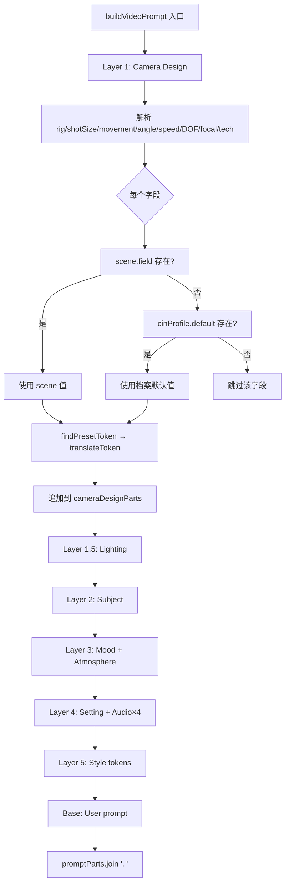
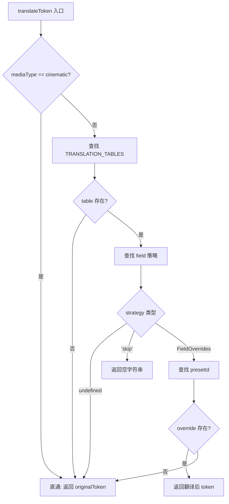

# PD-479.01 moyin-creator — 五层语义 Prompt 组装与媒介类型翻译管道

> 文档编号：PD-479.01
> 来源：moyin-creator `src/lib/generation/prompt-builder.ts`
> GitHub：https://github.com/MemeCalculate/moyin-creator.git
> 问题域：PD-479 提示词工程管道 Prompt Engineering Pipeline
> 状态：可复用方案

---

## 第 1 章 问题与动机

### 1.1 核心问题

视频生成 AI（如 Kling、Runway、Pika）接受自然语言 prompt 作为输入，但 prompt 质量直接决定生成效果。实际场景中存在三个核心矛盾：

1. **参数碎片化 vs 语义连贯**：摄影参数（景别、运镜、灯光、景深、焦距、色温……）多达 15+ 维度，简单拼接会导致信号稀释，AI 无法区分主次
2. **物理摄影词汇 vs 媒介差异**：`dolly push-in` 对真人电影有效，但对 2D 动画、定格动画、像素画毫无意义——不同媒介需要不同的视觉语言
3. **逐镜自由度 vs 项目一致性**：每个分镜可以自定义所有参数，但项目需要统一的摄影语言基准，否则风格会在镜头间跳跃

### 1.2 moyin-creator 的解法概述

moyin-creator 构建了一套完整的 prompt 工程管道，核心由三个模块协作：

1. **五层语义优先级组装**（`prompt-builder.ts:112-350`）：将 15+ 摄影参数按 Camera → Lighting → Subject → Mood → Style 五层语义优先级组装，每层用标签前缀（`Camera:`, `Lighting:`, `Subject:` 等）显式分隔，避免信号稀释
2. **媒介类型翻译层**（`media-type-tokens.ts:185-208`）：`translateToken()` 函数根据 MediaType（cinematic/animation/stop-motion/graphic）将物理摄影 token 翻译为该媒介能理解的等效表达，或静默跳过不适用的参数
3. **摄影风格档案回退**（`cinematography-profiles.ts:36-84`）：`CinematographyProfile` 为项目提供 7 维默认值（灯光、焦点、器材、氛围、速度、角度、技法），逐镜字段为空时自动回退到档案默认值
4. **三层 prompt 体系**：每个分镜维护 imagePrompt（首帧静态）、videoPrompt（视频动态）、endFramePrompt（尾帧静态）三层独立 prompt
5. **80+ 视觉风格预设**（`visual-styles.ts:21`）：每个风格绑定 MediaType，自动路由到对应的翻译策略

### 1.3 设计思想

| 设计原则 | 具体实现 | 理由 | 替代方案 |
|----------|----------|------|----------|
| 语义分层优先级 | Camera > Lighting > Subject > Mood > Style 五层 | AI 模型对 prompt 前部权重更高，摄影参数放最前确保执行 | 扁平拼接（信号稀释）、JSON 结构化（模型不一定支持） |
| 媒介感知翻译 | translateToken 按 4 种 MediaType 路由翻译 | 同一个 `dolly` 在动画里应该是 `parallax layers`，在 graphic 里应该跳过 | 为每种媒介写独立 builder（代码爆炸）、忽略媒介差异（效果差） |
| 逐镜→档案回退链 | `scene.field \|\| cinProfile.defaultField` | 保证项目风格一致性的同时允许逐镜自由偏离 | 全局锁定（丧失灵活性）、无默认值（每镜都要手动设） |
| 预设 ID + promptToken 分离 | 预设用 ID 存储，运行时查表获取 token | UI 展示用中文 label，prompt 用英文 token，解耦展示与生成 | 直接存 prompt 文本（难以翻译和维护） |
| 显式标签前缀 | `Camera:`, `Lighting:`, `Subject:` 等 | 帮助 AI 理解每段 prompt 的语义角色，类似 XML tag 的轻量版 | 无标签纯文本（AI 难以区分参数边界） |

---

## 第 2 章 源码实现分析

### 2.1 架构概览

整个 prompt 工程管道的数据流如下：

```
┌─────────────────────┐     ┌──────────────────────┐     ┌─────────────────────┐
│   Visual Styles     │     │  Director Store       │     │ Cinematography      │
│   (80+ presets)     │     │  (SplitScene data)    │     │ Profiles (14 预设)  │
│                     │     │                       │     │                     │
│ styleId → MediaType │     │ 逐镜摄影参数 (15维)   │     │ 7维默认值回退源     │
└────────┬────────────┘     └──────────┬────────────┘     └──────────┬──────────┘
         │                             │                             │
         ▼                             ▼                             ▼
┌────────────────────────────────────────────────────────────────────────────┐
│                    buildVideoPrompt(scene, cinProfile, config)            │
│                         prompt-builder.ts:112                             │
│                                                                          │
│  ┌─ Layer 1: Camera ──────────────────────────────────────────────────┐   │
│  │  rig → shotSize → movement → angle → speed → DOF → focal → tech  │   │
│  │  每个字段: scene.field || cinProfile.default → findPresetToken()  │   │
│  │                                    ↓                              │   │
│  │                         translateToken(mediaType, ...)            │   │
│  └───────────────────────────────────────────────────────────────────┘   │
│  ┌─ Layer 1.5: Lighting ─┐  ┌─ Layer 2: Subject ─┐                     │
│  │  style + dir + temp   │  │  blocking + action  │                     │
│  └───────────────────────┘  └─────────────────────┘                     │
│  ┌─ Layer 3: Mood ───────┐  ┌─ Layer 4: Setting ──┐                    │
│  │  emotion + narrative  │  │  scene + audio(×4)  │                     │
│  └───────────────────────┘  └─────────────────────┘                     │
│  ┌─ Layer 5: Style ──────┐  ┌─ Base: User Prompt ─┐                    │
│  │  styleTokens[]        │  │  videoPrompt/Zh     │                     │
│  └───────────────────────┘  └─────────────────────┘                     │
│                                                                          │
│  return promptParts.join('. ')                                           │
└──────────────────────────────────────────────────────────────────────────┘
```

### 2.2 核心实现

#### 2.2.1 五层语义组装引擎



对应源码 `src/lib/generation/prompt-builder.ts:112-350`：

```typescript
export function buildVideoPrompt(
  scene: SplitScene,
  cinProfile: CinematographyProfile | undefined,
  config: VideoPromptConfig = {},
): string {
  const promptParts: string[] = [];
  const mt = config.mediaType;

  // ---------- Layer 1: 镜头设计 (Camera Design) ----------
  const cameraDesignParts: string[] = [];

  // 1.0 器材类型 —— 逐镜优先，回退摄影档案
  const effectiveRig = scene.cameraRig || cinProfile?.defaultRig?.cameraRig;
  const rigToken = findPresetToken(CAMERA_RIG_PRESETS, effectiveRig, mt, 'cameraRig');
  if (rigToken) cameraDesignParts.push(rigToken);

  // ... 1.1~1.9 同样模式：scene.field || cinProfile.default → findPresetToken

  // 组装 Layer 1
  if (cameraDesignParts.length > 0) {
    promptParts.push(`Camera: ${cameraDesignParts.join(', ')}`);
  }

  // ---------- Layer 1.5~5 同样模式 ----------
  // 最终组装
  return promptParts.join('. ');
}
```

每一层的组装模式完全一致：收集该层所有有效 token → 用标签前缀包装 → 追加到 promptParts。

#### 2.2.2 媒介类型翻译引擎



对应源码 `src/lib/generation/media-type-tokens.ts:185-208`：

```typescript
export function translateToken(
  mediaType: MediaType,
  field: CinematographyField,
  presetId: string,
  originalToken: string,
): string {
  // cinematic → 直通
  if (mediaType === 'cinematic') return originalToken;

  const table = TRANSLATION_TABLES[mediaType];
  if (!table) return originalToken;

  const strategy = table[field];

  // 该字段无特殊处理 → 沿用原始 token
  if (strategy === undefined) return originalToken;

  // 整体跳过
  if (strategy === 'skip') return '';

  // 查表替换
  const override = strategy[presetId];
  return override !== undefined ? override : originalToken;
}
```

翻译策略的三种模式：
- **直通**（cinematic）：物理摄影词汇原样输出
- **查表替换**（animation/stop-motion）：`dolly` → `smooth tracking with parallax layers,`
- **整体跳过**（graphic 的物理参数）：返回空字符串，该参数不出现在 prompt 中

#### 2.2.3 摄影风格档案与回退机制

`CinematographyProfile` 定义在 `src/lib/constants/cinematography-profiles.ts:36-84`，包含 7 个维度的默认值：

```typescript
export interface CinematographyProfile {
  id: string;
  name: string;          // 中文名
  nameEn: string;        // 英文名
  category: CinematographyCategory;  // cinematic|documentary|stylized|genre|era

  defaultLighting: { style: LightingStyle; direction: LightingDirection; colorTemperature: ColorTemperature };
  defaultFocus: { depthOfField: DepthOfField; focusTransition: FocusTransition };
  defaultRig: { cameraRig: CameraRig; movementSpeed: MovementSpeed };
  defaultAtmosphere: { effects: AtmosphericEffect[]; intensity: EffectIntensity };
  defaultSpeed: { playbackSpeed: PlaybackSpeed };
  defaultAngle?: CameraAngle;
  defaultFocalLength?: FocalLength;
  defaultTechnique?: PhotographyTechnique;

  promptGuidance: string;      // AI system prompt 注入
  referenceFilms: string[];    // 参考影片
}
```

项目提供了 14 个预设档案（`cinematography-profiles.ts:100-408`），覆盖 5 大分类：
- **电影类**：经典电影、黑色电影、史诗大片、亲密剧情、浪漫爱情
- **纪实类**：纪实手持、新闻纪实
- **风格化**：赛博朋克、古典武侠、恐怖惊悚、MV风格
- **类型片**：家庭温情、动作激烈、悬疑推理
- **时代风格**：90s港片、好莱坞黄金时代

每个档案还附带 `promptGuidance`（2-3 句中文摄影指导）和 `referenceFilms`（参考影片列表），用于注入 AI 的 system prompt。

### 2.3 实现细节

**findPresetToken 的桥接作用**（`prompt-builder.ts:78-89`）：

这个辅助函数是预设查找与媒介翻译之间的桥梁。它先从预设数组中查找 ID 对应的 promptToken，然后立即调用 `translateToken` 进行媒介适配。空字符串结果被转为 `undefined`，使得被跳过的参数不会在 prompt 中留下空位。

```typescript
function findPresetToken<T extends { id: string; promptToken: string }>(
  presets: readonly T[],
  id: string | undefined,
  mediaType: MediaType | undefined,
  field: CinematographyField,
): string | undefined {
  if (!id) return undefined;
  const preset = presets.find(p => p.id === id);
  if (!preset?.promptToken) return undefined;
  const translated = translateToken(mediaType ?? 'cinematic', field, id, preset.promptToken);
  return translated || undefined; // 空字符串 → undefined（跳过）
}
```

**音频四通道显式控制**（`prompt-builder.ts:300-323`）：

Layer 4 的音频处理采用"有则包含，无则显式禁止"策略。对白、环境音、音效、背景音乐四个通道各自独立控制，未启用的通道会输出 `Dialogue: 禁止对白` 这样的显式否定指令，防止 AI 自行脑补音频内容。

**MediaType 与 StyleCategory 的解耦**（`visual-styles.ts:12-21`）：

`StyleCategory`（3d/2d/real/stop_motion）是 UI 分类维度，`MediaType`（cinematic/animation/stop-motion/graphic）是 prompt 翻译维度。两者并非一一对应——例如 `3d_xuanhuan`（3D玄幻）的 category 是 `3d` 但 mediaType 是 `cinematic`（因为写实 3D 可以使用物理摄影词汇），而 `3d_american`（3D美式）的 mediaType 是 `animation`（因为皮克斯风格需要虚拟摄像机语义）。


---

## 第 3 章 迁移指南

### 3.1 迁移清单

**阶段 1：核心管道（最小可用）**

- [ ] 定义你的语义层次（至少 3 层：Camera/Subject/Style）
- [ ] 实现 `buildPrompt(scene, config)` 函数，按层收集 token 并用标签前缀组装
- [ ] 定义预设数据结构：`{ id: string; promptToken: string; label: string }`
- [ ] 实现 `findPresetToken()` 桥接函数

**阶段 2：媒介翻译（多风格支持）**

- [ ] 定义你的 MediaType 枚举（至少 2 种：直通 + 翻译）
- [ ] 为每种非直通媒介建立翻译表（字段级 override 或 skip）
- [ ] 实现 `translateToken(mediaType, field, presetId, originalToken)` 函数
- [ ] 在每个风格预设上标注 mediaType

**阶段 3：档案回退（项目一致性）**

- [ ] 定义 Profile 接口，包含所有维度的默认值
- [ ] 在 buildPrompt 中实现 `scene.field || profile.default` 回退链
- [ ] 创建至少 3 个预设档案覆盖常见场景

### 3.2 适配代码模板

以下是一个可直接运行的 Python 迁移模板，提取了 moyin-creator 的核心模式：

```python
"""
Prompt Engineering Pipeline — 从 moyin-creator 迁移的核心模式
可直接运行，支持多层语义组装 + 媒介翻译 + 档案回退
"""
from dataclasses import dataclass, field
from typing import Optional
from enum import Enum

# ==================== 媒介类型 ====================

class MediaType(Enum):
    CINEMATIC = "cinematic"      # 直通物理摄影词汇
    ANIMATION = "animation"      # 虚拟摄像机适配
    GRAPHIC = "graphic"          # 跳过物理参数，仅色彩/情绪

# ==================== 翻译表 ====================

TRANSLATION_TABLES: dict[str, dict[str, dict[str, str] | str]] = {
    "animation": {
        "camera_rig": {
            "dolly": "smooth tracking with parallax layers,",
            "crane": "sweeping vertical arc camera,",
            "handheld": "slight camera wobble, animated shake,",
        },
        "depth_of_field": {
            "shallow": "soft background blur, depth layers,",
            "deep": "all layers in sharp focus,",
        },
    },
    "graphic": {
        "camera_rig": "skip",
        "depth_of_field": "skip",
        "focal_length": "skip",
        "lighting_style": {
            "high-key": "bright palette, open composition,",
            "low-key": "dark tones, heavy contrast areas,",
        },
    },
}

def translate_token(
    media_type: MediaType,
    field_name: str,
    preset_id: str,
    original_token: str,
) -> str:
    """媒介类型翻译：cinematic 直通，其他查表替换或跳过"""
    if media_type == MediaType.CINEMATIC:
        return original_token

    table = TRANSLATION_TABLES.get(media_type.value, {})
    strategy = table.get(field_name)

    if strategy is None:
        return original_token
    if strategy == "skip":
        return ""
    if isinstance(strategy, dict):
        return strategy.get(preset_id, original_token)
    return original_token

# ==================== 预设与档案 ====================

CAMERA_RIG_PRESETS = {
    "dolly": "smooth dolly push-in,",
    "crane": "crane sweeping movement,",
    "handheld": "handheld camera,",
    "tripod": "locked tripod,",
    "steadicam": "steadicam smooth glide,",
}

@dataclass
class CinematographyProfile:
    """摄影风格档案 — 项目级默认值"""
    name: str
    default_rig: str = "dolly"
    default_dof: str = "medium"
    default_lighting: str = "natural"
    default_speed: str = "normal"

@dataclass
class SceneData:
    """分镜数据"""
    camera_rig: Optional[str] = None
    depth_of_field: Optional[str] = None
    lighting_style: Optional[str] = None
    subject: str = ""
    emotion: str = ""
    style_tokens: list[str] = field(default_factory=list)

# ==================== 核心组装 ====================

def build_video_prompt(
    scene: SceneData,
    profile: Optional[CinematographyProfile],
    media_type: MediaType = MediaType.CINEMATIC,
) -> str:
    """五层语义优先级 prompt 组装"""
    parts: list[str] = []

    # Layer 1: Camera
    camera_parts: list[str] = []
    effective_rig = scene.camera_rig or (profile.default_rig if profile else None)
    if effective_rig and effective_rig in CAMERA_RIG_PRESETS:
        token = translate_token(media_type, "camera_rig", effective_rig, CAMERA_RIG_PRESETS[effective_rig])
        if token:
            camera_parts.append(token)
    if camera_parts:
        parts.append(f"Camera: {', '.join(camera_parts)}")

    # Layer 2: Subject
    if scene.subject:
        parts.append(f"Subject: {scene.subject}")

    # Layer 3: Mood
    if scene.emotion:
        parts.append(f"Mood: {scene.emotion}")

    # Layer 4: Style
    if scene.style_tokens:
        parts.append(f"Style: {', '.join(scene.style_tokens)}")

    return ". ".join(parts)

# ==================== 使用示例 ====================

if __name__ == "__main__":
    profile = CinematographyProfile(name="Film Noir", default_rig="handheld", default_dof="shallow")
    scene = SceneData(subject="detective walks through rain", emotion="tense, mysterious")

    # cinematic: 使用物理摄影词汇
    print("=== Cinematic ===")
    print(build_video_prompt(scene, profile, MediaType.CINEMATIC))

    # animation: 翻译为虚拟摄像机
    scene.camera_rig = "dolly"
    print("\n=== Animation ===")
    print(build_video_prompt(scene, profile, MediaType.ANIMATION))

    # graphic: 跳过物理参数
    print("\n=== Graphic ===")
    print(build_video_prompt(scene, profile, MediaType.GRAPHIC))
```

### 3.3 适用场景

| 场景 | 适用度 | 说明 |
|------|--------|------|
| AI 视频生成工具 | ⭐⭐⭐ | 完美匹配：多维摄影参数 + 多风格支持 |
| AI 图片生成工具 | ⭐⭐⭐ | 去掉运动/音频层即可复用 Camera+Lighting+Style 层 |
| 多模态 prompt 管理 | ⭐⭐ | 语义分层思想可迁移，但翻译表需要重新定义 |
| 纯文本 LLM prompt | ⭐ | 过度设计：文本 LLM 不需要摄影参数翻译 |
| 游戏引擎摄像机控制 | ⭐⭐ | 档案回退机制有价值，但输出格式需改为 API 参数而非自然语言 |

---

## 第 4 章 测试用例

```python
"""
基于 moyin-creator 真实函数签名的测试用例
覆盖：翻译引擎、回退链、五层组装
"""
import pytest
from prompt_pipeline import (
    translate_token, MediaType, build_video_prompt,
    SceneData, CinematographyProfile, CAMERA_RIG_PRESETS,
)


class TestTranslateToken:
    """媒介类型翻译引擎测试"""

    def test_cinematic_passthrough(self):
        """cinematic 模式直通原始 token"""
        result = translate_token(MediaType.CINEMATIC, "camera_rig", "dolly", "smooth dolly push-in,")
        assert result == "smooth dolly push-in,"

    def test_animation_override(self):
        """animation 模式查表替换"""
        result = translate_token(MediaType.ANIMATION, "camera_rig", "dolly", "smooth dolly push-in,")
        assert result == "smooth tracking with parallax layers,"

    def test_graphic_skip(self):
        """graphic 模式跳过物理参数"""
        result = translate_token(MediaType.GRAPHIC, "camera_rig", "dolly", "smooth dolly push-in,")
        assert result == ""

    def test_unknown_preset_fallback(self):
        """翻译表中没有的 presetId 回退到原始 token"""
        result = translate_token(MediaType.ANIMATION, "camera_rig", "unknown_rig", "original,")
        assert result == "original,"

    def test_undefined_field_passthrough(self):
        """翻译表中没有的字段直通"""
        result = translate_token(MediaType.ANIMATION, "some_new_field", "any", "original,")
        assert result == "original,"

    def test_graphic_lighting_translates(self):
        """graphic 模式灯光转译为色彩描述"""
        result = translate_token(MediaType.GRAPHIC, "lighting_style", "high-key", "high-key lighting,")
        assert result == "bright palette, open composition,"


class TestFallbackChain:
    """逐镜→档案回退链测试"""

    def test_scene_field_takes_priority(self):
        """逐镜字段优先于档案默认值"""
        profile = CinematographyProfile(name="test", default_rig="tripod")
        scene = SceneData(camera_rig="crane", subject="hero")
        prompt = build_video_prompt(scene, profile)
        assert "crane" in prompt.lower()
        assert "tripod" not in prompt.lower()

    def test_profile_fallback_when_scene_empty(self):
        """逐镜字段为空时回退到档案"""
        profile = CinematographyProfile(name="test", default_rig="handheld")
        scene = SceneData(subject="hero")  # camera_rig=None
        prompt = build_video_prompt(scene, profile)
        assert "handheld" in prompt.lower()

    def test_no_profile_no_camera(self):
        """无档案且无逐镜字段时，Camera 层不出现"""
        scene = SceneData(subject="hero")
        prompt = build_video_prompt(scene, None)
        assert "Camera:" not in prompt


class TestLayerAssembly:
    """五层语义组装测试"""

    def test_layer_order(self):
        """Camera 在 Subject 之前，Subject 在 Mood 之前"""
        scene = SceneData(
            camera_rig="dolly",
            subject="hero walks",
            emotion="tense",
            style_tokens=["cinematic"],
        )
        prompt = build_video_prompt(scene, None)
        cam_pos = prompt.find("Camera:")
        sub_pos = prompt.find("Subject:")
        mood_pos = prompt.find("Mood:")
        style_pos = prompt.find("Style:")
        assert cam_pos < sub_pos < mood_pos < style_pos

    def test_empty_layers_skipped(self):
        """空层不出现在输出中"""
        scene = SceneData(subject="hero")
        prompt = build_video_prompt(scene, None)
        assert "Camera:" not in prompt
        assert "Mood:" not in prompt
        assert "Subject: hero" in prompt

    def test_dot_separator(self):
        """各层之间用 '. ' 分隔"""
        scene = SceneData(subject="hero", emotion="happy")
        prompt = build_video_prompt(scene, None)
        assert ". " in prompt
```


---

## 第 5 章 跨域关联

| 关联域 | 关系类型 | 说明 |
|--------|----------|------|
| PD-10 中间件管道 | 协同 | prompt-builder 本身就是一个管道模式：五层顺序组装，每层独立收集 token。可以用中间件模式重构为可插拔层 |
| PD-01 上下文管理 | 协同 | prompt 长度直接影响 token 消耗。translateToken 的 skip 策略本质上是一种 prompt 压缩——跳过不适用的参数减少 token 浪费 |
| PD-04 工具系统 | 依赖 | prompt-builder 依赖预设数据（CAMERA_RIG_PRESETS 等），这些预设可以视为"工具配置"。如果预设支持热更新，prompt 管道也随之更新 |
| PD-06 记忆持久化 | 协同 | CinematographyProfile 作为项目级配置持久化在 store 中，是一种"项目记忆"。逐镜参数也持久化在 SplitScene 中 |
| PD-07 质量检查 | 协同 | prompt 质量直接影响生成质量。可以在 buildVideoPrompt 输出后加一层 LLM 质量检查，验证 prompt 的语义完整性 |

---

## 第 6 章 来源文件索引

| 文件 | 行范围 | 关键实现 |
|------|--------|----------|
| `src/lib/generation/prompt-builder.ts` | L1-L351 | 五层语义组装核心：buildVideoPrompt、buildEmotionDescription、findPresetToken |
| `src/lib/generation/media-type-tokens.ts` | L1-L234 | 媒介翻译引擎：translateToken、isFieldSkipped、getMediaTypeGuidance |
| `src/lib/generation/media-type-tokens.ts` | L57-L163 | 三张翻译表：ANIMATION_TABLE、STOP_MOTION_TABLE、GRAPHIC_TABLE |
| `src/lib/constants/cinematography-profiles.ts` | L36-L84 | CinematographyProfile 接口定义（7 维默认值） |
| `src/lib/constants/cinematography-profiles.ts` | L100-L408 | 14 个预设档案（5 大分类） |
| `src/lib/constants/cinematography-profiles.ts` | L436-L466 | buildCinematographyGuidance：AI system prompt 注入 |
| `src/lib/constants/visual-styles.ts` | L12-L37 | MediaType 枚举 + StylePreset 接口 |
| `src/lib/constants/visual-styles.ts` | L43-L80 | 80+ 视觉风格预设（含 mediaType 标注） |
| `src/stores/director-store.ts` | 全文 | SplitScene 接口（15+ 摄影字段）、DirectorProjectData、状态管理 |
| `src/lib/storyboard/prompt-builder.ts` | L31-L97 | 分镜板 prompt 组装（网格布局 + 风格注入） |

---

## 第 7 章 横向对比维度

```json comparison_data
{
  "project": "moyin-creator",
  "dimensions": {
    "组装架构": "五层语义优先级：Camera→Lighting→Subject→Mood→Style，标签前缀显式分隔",
    "媒介适配": "四种 MediaType 路由翻译表，字段级 override/skip 策略",
    "回退机制": "逐镜字段→CinematographyProfile 档案默认值→跳过 三级回退链",
    "预设体系": "15 维摄影参数 × 80+ 视觉风格 × 14 摄影档案，ID+promptToken 分离",
    "音频控制": "四通道独立开关，未启用通道显式输出禁止指令防止 AI 脑补"
  }
}
```

### 域元数据补充

```json domain_metadata
{
  "solution_summary": "moyin-creator 用五层语义优先级（Camera→Lighting→Subject→Mood→Style）组装视频 prompt，translateToken 按四种 MediaType 路由翻译物理摄影参数，CinematographyProfile 提供 14 档案 7 维回退默认值",
  "description": "视频生成场景下摄影参数到自然语言 prompt 的结构化翻译与组装",
  "sub_problems": [
    "音频四通道显式否定控制（防止AI自行脑补音频）",
    "MediaType与StyleCategory解耦路由",
    "预设ID与promptToken分离的双层数据模型"
  ],
  "best_practices": [
    "用标签前缀（Camera:/Lighting:/Subject:）显式标注语义边界",
    "未启用的参数通道输出显式禁止指令而非静默跳过",
    "摄影档案附带promptGuidance和referenceFilms注入AI system prompt"
  ]
}
```
