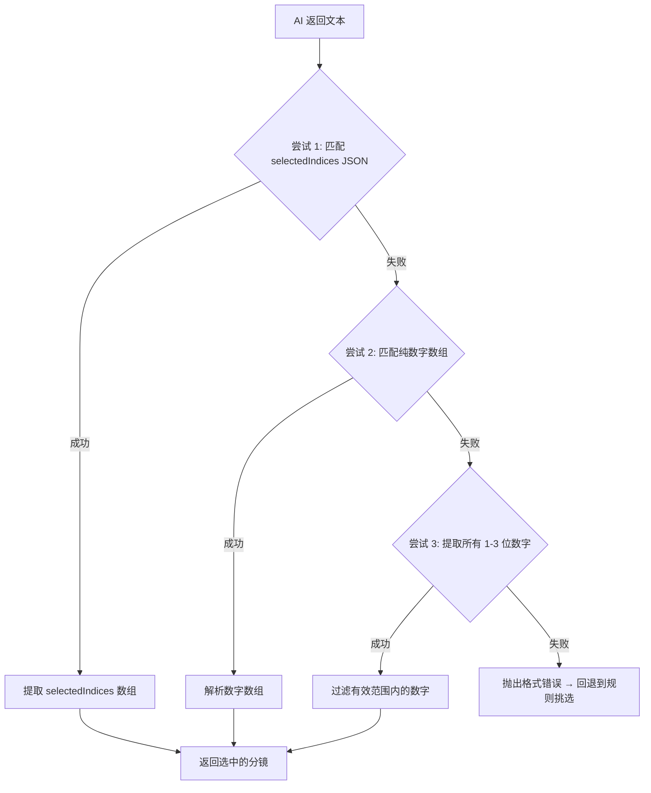
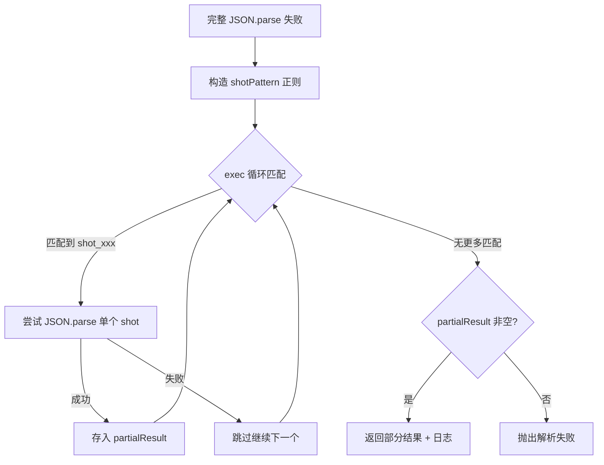

# PD-480.02 moyin-creator — 多层级 AI 输出解析与部分恢复

> 文档编号：PD-480.02
> 来源：moyin-creator `src/lib/utils/json-cleaner.ts` `src/lib/script/script-parser.ts`
> GitHub：https://github.com/MemeCalculate/moyin-creator.git
> 问题域：PD-480 AI 输出解析与清洗 AI Output Parsing & Cleaning
> 状态：可复用方案

---

## 第 1 章 问题与动机

### 1.1 核心问题

LLM 返回的文本几乎不可能保证是纯净 JSON。实际生产中，AI 输出会夹带 markdown 围栏（` ```json `）、前后解释性文字、数值型 ID（本应为字符串）、截断的不完整 JSON 等问题。moyin-creator 是一个 AI 驱动的影视分镜生成工具，其核心流程——剧本解析、分镜生成、预告片挑选、分镜校准——全部依赖 LLM 返回结构化 JSON。任何一次解析失败都意味着用户的创作流程中断。

该项目面临的具体挑战：
- **多场景并行生成**：一次可能调用 4 个并行 API 请求，每个返回不同格式的 JSON
- **多 LLM 提供商**：支持智谱、OpenAI 兼容 API，不同模型的输出格式差异大
- **长 JSON 截断**：分镜数据可能包含 30+ 个 shot 对象，容易被 `max_tokens` 截断
- **中文内容**：角色名、场景描述等中文字段增加了 token 消耗和截断风险

### 1.2 moyin-creator 的解法概述

1. **集中式清洗工具库** (`json-cleaner.ts:13-98`)：5 个纯函数组成的清洗管线，处理围栏去除、边界提取、安全解析、ID 规范化、数组校验
2. **三级降级解析策略**：先尝试完整 JSON 解析，失败后用正则提取特定结构，最终回退到逐对象部分恢复 (`full-script-service.ts:1887-1934`)
3. **场景特化的解析器**：预告片服务用三层 fallback 提取数字数组 (`trailer-service.ts:134-166`)，校准服务用局部 `parseStageJSON` 处理批量结果 (`shot-calibration-stages.ts:93-102`)
4. **类型安全的泛型设计**：`safeParseJson<T>` 和 `normalizeIds<T>` 使用 TypeScript 泛型确保类型推断 (`json-cleaner.ts:46-67`)
5. **中文时间值规范化**：`normalizeTimeValue` 将 AI 返回的中文时间描述映射为标准英文枚举 (`script-parser.ts:21-54`)

### 1.3 设计思想

| 设计原则 | 具体实现 | 理由 | 替代方案 |
|----------|----------|------|----------|
| 先清洗再解析 | `cleanJsonString` → `JSON.parse` 两步分离 | 清洗逻辑可复用，解析失败时可定位是清洗不足还是 JSON 本身损坏 | 直接用 `JSON.parse` + try/catch（无法区分失败原因） |
| 泛型 fallback | `safeParseJson<T>(str, fallback)` 返回类型安全的默认值 | 调用方不需要写 try/catch，流程不中断 | 抛异常让调用方处理（代码冗余） |
| 场景特化解析 | trailer-service 用三层 regex fallback 提取数字 | 不同 AI 任务的输出格式差异大，通用解析器无法覆盖所有情况 | 统一用 json-cleaner（无法处理纯数字列表） |
| 部分恢复 | 截断 JSON 时用 regex 逐个提取已完成的 shot 对象 | 30+ shot 的长 JSON 被截断时，已生成的 20 个 shot 不应浪费 | 整体失败重试（浪费 API 调用和时间） |
| ID 类型修正 | `normalizeIds` 强制 `String(item.id)` | AI 经常返回 `1` 而非 `"char_1"`，下游代码依赖字符串 ID | 在每个消费处手动转换（容易遗漏） |

---

## 第 2 章 源码实现分析

### 2.1 架构概览

moyin-creator 的 AI 输出解析分为三层：集中式工具层、业务解析层、场景特化层。

```
┌─────────────────────────────────────────────────────────┐
│                    业务调用层                              │
│  parseScript()  generateShotList()  calibrateShots()     │
│  selectTrailerShots()  generateScenePrompts()            │
└──────────┬──────────────┬──────────────┬────────────────┘
           │              │              │
           ▼              ▼              ▼
┌──────────────┐ ┌────────────────┐ ┌──────────────────┐
│ json-cleaner │ │ parseStageJSON │ │ trailer 三层      │
│  (集中式)     │ │  (校准特化)     │ │  fallback (特化)  │
│              │ │                │ │                  │
│ cleanJson    │ │ fence removal  │ │ 1. JSON match    │
│ safeParseJson│ │ bounds extract │ │ 2. array match   │
│ normalizeIds │ │ .shots unwrap  │ │ 3. number extract│
│ cleanArray   │ │                │ │                  │
│ extractJson  │ │                │ │                  │
└──────────────┘ └────────────────┘ └──────────────────┘
           │              │              │
           ▼              ▼              ▼
┌─────────────────────────────────────────────────────────┐
│              部分恢复层 (full-script-service)              │
│  完整解析失败 → regex 逐对象提取 → 部分结果返回             │
└─────────────────────────────────────────────────────────┘
```

### 2.2 核心实现

#### 2.2.1 集中式清洗管线

```mermaid
graph TD
    A[AI 原始输出 string] --> B{输入为空?}
    B -->|是| C["返回 '{}'"]
    B -->|否| D[去除 markdown 围栏]
    D --> E[trim 空白]
    E --> F{查找 JSON 边界}
    F -->|找到 '{'| G["slice(firstBrace, lastBrace+1)"]
    F -->|找到 '['| H["slice(firstBracket, lastBracket+1)"]
    F -->|都没找到| I[返回 trimmed 原文]
    G --> J[返回清洗后 JSON 字符串]
    H --> J
```

对应源码 `src/lib/utils/json-cleaner.ts:13-41`：

```typescript
export function cleanJsonString(str: string): string {
  if (!str) return "{}";
  let cleaned = str;
  // Remove markdown code fences (```json ... ``` or ``` ... ```)
  cleaned = cleaned.replace(/```json\s*/gi, "");
  cleaned = cleaned.replace(/```\s*/g, "");
  cleaned = cleaned.trim();
  // Try to find JSON object or array bounds
  const firstBrace = cleaned.indexOf("{");
  const firstBracket = cleaned.indexOf("[");
  const lastBrace = cleaned.lastIndexOf("}");
  const lastBracket = cleaned.lastIndexOf("]");
  // If we found valid JSON bounds, extract just the JSON
  if (firstBrace !== -1 && lastBrace !== -1 && firstBrace < lastBrace) {
    if (firstBracket === -1 || firstBrace < firstBracket) {
      cleaned = cleaned.slice(firstBrace, lastBrace + 1);
    }
  } else if (firstBracket !== -1 && lastBracket !== -1 && firstBracket < lastBracket) {
    cleaned = cleaned.slice(firstBracket, lastBracket + 1);
  }
  return cleaned;
}
```

关键设计点：对象优先于数组（`firstBrace < firstBracket` 判断），因为大多数 AI 返回的是 `{ ... }` 包裹的结构。

#### 2.2.2 预告片服务的三层降级解析



对应源码 `src/lib/script/trailer-service.ts:134-166`：

```typescript
// 尝试匹配 { "selectedIndices": [...] } 格式
const jsonMatch = result.match(
  /\{[\s\S]*?"selectedIndices"\s*:\s*\[[\d,\s]*\][\s\S]*?\}/
);
if (jsonMatch) {
  const parsed = JSON.parse(jsonMatch[0]);
  selectedIndices = parsed.selectedIndices || [];
}
// 如果上面失败，尝试直接匹配数字数组 [1, 2, 3, ...]
if (selectedIndices.length === 0) {
  const arrayMatch = result.match(/\[\s*\d+(?:\s*,\s*\d+)*\s*\]/);
  if (arrayMatch) {
    selectedIndices = JSON.parse(arrayMatch[0]);
  }
}
// 如果还是失败，尝试提取所有数字
if (selectedIndices.length === 0) {
  const numbers = result.match(/\b(\d{1,3})\b/g);
  if (numbers) {
    selectedIndices = numbers
      .map(n => parseInt(n, 10))
      .filter(n => n >= 1 && n <= shots.length)
      .slice(0, targetCount);
  }
}
```

### 2.3 实现细节

#### 部分恢复：截断 JSON 的逐对象提取

当 `max_tokens` 不足导致 JSON 被截断时，`full-script-service.ts:1910-1932` 实现了逐对象部分恢复：



正则模式 `/"(shot_[^"]+)"\s*:\s*(\{[^{}]*(?:\{[^{}]*\}[^{}]*)*\})/g` 支持一层嵌套对象（如 keyframes），能从截断的 JSON 中恢复已完成的 shot 对象。

#### 中文时间值规范化

`script-parser.ts:21-54` 的 `normalizeTimeValue` 将 AI 可能返回的 13 种中文时间描述映射为 6 个标准英文枚举值（day/night/dawn/dusk/noon/midnight），确保下游 UI 组件的 TIME_PRESETS 能正确匹配。

#### 类型安全的数组校验

`json-cleaner.ts:72-83` 的 `cleanArray<T>` 接受可选的类型守卫函数，在运行时过滤不符合类型的元素：

```typescript
export function cleanArray<T>(
  data: unknown,
  validator?: (item: unknown) => item is T
): T[] {
  if (!Array.isArray(data)) return [];
  if (validator) {
    return data.filter(validator);
  }
  return data as T[];
}
```


---

## 第 3 章 迁移指南

### 3.1 迁移清单

**阶段 1：基础清洗层（1 个文件）**
- [ ] 复制 `json-cleaner.ts` 的 5 个函数到项目 `utils/` 目录
- [ ] 根据项目的 AI 输出格式调整 `cleanJsonString` 的围栏匹配模式（如需支持 ` ```xml ` 等）
- [ ] 为 `safeParseJson` 添加项目级日志（替换 `console.error`）

**阶段 2：业务解析集成**
- [ ] 在每个 AI API 调用点使用 `cleanJsonString` + `JSON.parse` 或 `safeParseJson`
- [ ] 为返回数组的 API 调用添加 `cleanArray` 校验
- [ ] 如果 AI 返回的 ID 字段可能是数值，添加 `normalizeIds` 后处理

**阶段 3：部分恢复（可选，长 JSON 场景）**
- [ ] 为可能被截断的长 JSON 响应实现逐对象正则提取
- [ ] 定义项目特定的对象 ID 模式（如 `shot_xxx`、`item_xxx`）
- [ ] 添加部分恢复的监控指标（恢复率、丢失率）

**阶段 4：场景特化解析器（按需）**
- [ ] 为特定 AI 任务（如数字列表、布尔判断）编写专用解析器
- [ ] 实现多层 fallback 链，最后一层用规则兜底

### 3.2 适配代码模板

可直接复用的通用 AI 输出解析模块：

```typescript
// ai-output-parser.ts — 可移植的 AI 输出解析工具集

/**
 * 清洗 AI 返回的 JSON 字符串
 * 去除 markdown 围栏，提取 JSON 边界
 */
export function cleanAiJson(raw: string): string {
  if (!raw) return '{}';
  // 去除所有常见围栏格式
  let s = raw.replace(/```(?:json|javascript|typescript|python)?\s*/gi, '');
  s = s.trim();
  // 提取 JSON 边界（对象优先于数组）
  const ob = s.indexOf('{'), cb = s.lastIndexOf('}');
  const os = s.indexOf('['), cs = s.lastIndexOf(']');
  if (ob !== -1 && cb > ob && (os === -1 || ob < os)) {
    return s.slice(ob, cb + 1);
  }
  if (os !== -1 && cs > os) {
    return s.slice(os, cs + 1);
  }
  return s;
}

/**
 * 安全解析 JSON，失败返回 fallback
 */
export function safeParse<T>(raw: string, fallback: T): T {
  try {
    return JSON.parse(cleanAiJson(raw)) as T;
  } catch {
    return fallback;
  }
}

/**
 * 部分恢复：从截断的 JSON 中提取已完成的对象
 * @param raw - 可能被截断的 JSON 字符串
 * @param idPattern - 对象 ID 的正则模式，如 /item_\d+/
 */
export function partialRecover<T>(
  raw: string,
  idPattern: RegExp
): Map<string, T> {
  const result = new Map<string, T>();
  const pattern = new RegExp(
    `"(${idPattern.source})"\\s*:\\s*(\\{[^{}]*(?:\\{[^{}]*\\}[^{}]*)*\\})`,
    'g'
  );
  let match;
  while ((match = pattern.exec(raw)) !== null) {
    try {
      result.set(match[1], JSON.parse(match[2]) as T);
    } catch {
      // 单个对象解析失败，继续
    }
  }
  return result;
}

/**
 * 规范化 ID 字段为字符串
 */
export function normalizeIds<T extends { id?: string | number }>(
  items: T[]
): (T & { id: string })[] {
  return items.map(item => ({ ...item, id: String(item.id || '') }));
}
```

### 3.3 适用场景

| 场景 | 适用度 | 说明 |
|------|--------|------|
| LLM 返回结构化 JSON 的应用 | ⭐⭐⭐ | 核心场景，cleanJsonString + safeParseJson 直接可用 |
| 长 JSON 可能被截断的批量生成 | ⭐⭐⭐ | 部分恢复策略避免整体重试，节省 API 成本 |
| 多 LLM 提供商的统一解析 | ⭐⭐⭐ | 不同模型输出格式差异大，清洗层屏蔽差异 |
| AI 返回简单值（数字、布尔） | ⭐⭐ | 需要场景特化的 regex fallback，通用清洗不够 |
| 流式 JSON 解析 | ⭐ | 当前方案基于完整响应，不支持流式增量解析 |

---

## 第 4 章 测试用例

```typescript
import { describe, it, expect } from 'vitest';

// 测试基于 json-cleaner.ts 的真实函数签名

describe('cleanJsonString', () => {
  // 基于 json-cleaner.ts:13-41 的实际实现

  it('应去除 markdown json 围栏', () => {
    const input = '```json\n{"name": "test"}\n```';
    const result = cleanJsonString(input);
    expect(JSON.parse(result)).toEqual({ name: 'test' });
  });

  it('应去除无语言标记的围栏', () => {
    const input = '```\n[1, 2, 3]\n```';
    const result = cleanJsonString(input);
    expect(JSON.parse(result)).toEqual([1, 2, 3]);
  });

  it('应从混合文本中提取 JSON 对象', () => {
    const input = 'Here is the result:\n{"id": 1, "name": "test"}\nHope this helps!';
    const result = cleanJsonString(input);
    expect(JSON.parse(result)).toEqual({ id: 1, name: 'test' });
  });

  it('应从混合文本中提取 JSON 数组', () => {
    const input = 'The array is: [{"a":1},{"b":2}] end';
    const result = cleanJsonString(input);
    expect(JSON.parse(result)).toEqual([{ a: 1 }, { b: 2 }]);
  });

  it('对象优先于数组（当对象在前时）', () => {
    const input = '{"items": [1,2,3]}';
    const result = cleanJsonString(input);
    expect(result).toBe('{"items": [1,2,3]}');
  });

  it('空输入返回 {}', () => {
    expect(cleanJsonString('')).toBe('{}');
    expect(cleanJsonString(null as any)).toBe('{}');
  });
});

describe('safeParseJson', () => {
  // 基于 json-cleaner.ts:46-54

  it('正常解析 JSON', () => {
    const result = safeParseJson('{"a": 1}', { a: 0 });
    expect(result).toEqual({ a: 1 });
  });

  it('解析失败返回 fallback', () => {
    const fallback = { default: true };
    const result = safeParseJson('not json at all', fallback);
    expect(result).toBe(fallback);
  });

  it('自动清洗 markdown 围栏后解析', () => {
    const result = safeParseJson('```json\n{"ok": true}\n```', { ok: false });
    expect(result).toEqual({ ok: true });
  });
});

describe('normalizeIds', () => {
  // 基于 json-cleaner.ts:60-67

  it('将数值 ID 转为字符串', () => {
    const items = [{ id: 1, name: 'a' }, { id: 2, name: 'b' }];
    const result = normalizeIds(items);
    expect(result[0].id).toBe('1');
    expect(result[1].id).toBe('2');
  });

  it('保留已有的字符串 ID', () => {
    const items = [{ id: 'char_1', name: 'a' }];
    const result = normalizeIds(items);
    expect(result[0].id).toBe('char_1');
  });

  it('缺失 ID 转为空字符串', () => {
    const items = [{ name: 'no-id' } as any];
    const result = normalizeIds(items);
    expect(result[0].id).toBe('');
  });
});

describe('部分恢复 - 截断 JSON', () => {
  // 基于 full-script-service.ts:1910-1932 的 shotPattern

  it('从截断 JSON 中恢复已完成的对象', () => {
    const truncated = `{
      "shot_1": {"visualDescription": "远景", "duration": 4},
      "shot_2": {"visualDescription": "近景", "duration": 3},
      "shot_3": {"visualDescr`;  // 截断

    const shotPattern = /"(shot_[^"]+)"\s*:\s*(\{[^{}]*(?:\{[^{}]*\}[^{}]*)*\})/g;
    const recovered: Record<string, any> = {};
    let match;
    while ((match = shotPattern.exec(truncated)) !== null) {
      try {
        recovered[match[1]] = JSON.parse(match[2]);
      } catch { /* skip */ }
    }
    expect(Object.keys(recovered)).toEqual(['shot_1', 'shot_2']);
    expect(recovered['shot_1'].duration).toBe(4);
  });
});

describe('normalizeTimeValue', () => {
  // 基于 script-parser.ts:21-54

  it('中文时间映射到英文枚举', () => {
    expect(normalizeTimeValue('白天')).toBe('day');
    expect(normalizeTimeValue('夜晚')).toBe('night');
    expect(normalizeTimeValue('黄昏')).toBe('dusk');
    expect(normalizeTimeValue('黎明')).toBe('dawn');
    expect(normalizeTimeValue('深夜')).toBe('midnight');
    expect(normalizeTimeValue('中午')).toBe('noon');
  });

  it('英文直接透传', () => {
    expect(normalizeTimeValue('day')).toBe('day');
    expect(normalizeTimeValue('night')).toBe('night');
  });

  it('未知值默认 day', () => {
    expect(normalizeTimeValue('未知')).toBe('day');
    expect(normalizeTimeValue(undefined)).toBe('day');
  });
});
```


---

## 第 5 章 跨域关联

| 关联域 | 关系类型 | 说明 |
|--------|----------|------|
| PD-01 上下文管理 | 协同 | Token Budget Calculator (`script-parser.ts:254-283`) 在解析前预估输入 token，超出 90% context window 直接拒绝请求，避免输出被截断导致解析失败 |
| PD-03 容错与重试 | 依赖 | `callChatAPI` 使用 `retryOperation` 包裹 (`script-parser.ts:288`)，解析失败可触发重试；推理模型 token 耗尽时自动双倍 `max_tokens` 重试 (`script-parser.ts:413-451`) |
| PD-04 工具系统 | 协同 | 清洗后的 JSON 直接驱动分镜生成工具链（shot → keyframe → image → video），解析质量决定下游工具输入质量 |
| PD-07 质量检查 | 协同 | `cleanArray` 的 validator 参数可作为运行时类型校验，确保 AI 返回的数组元素符合预期 schema |
| PD-11 可观测性 | 协同 | 解析失败时的详细诊断日志（`script-parser.ts:382-388`）记录 finish_reason、usage、reasoning_content 长度，帮助定位截断原因 |

---

## 第 6 章 来源文件索引

| 文件 | 行范围 | 关键实现 |
|------|--------|----------|
| `src/lib/utils/json-cleaner.ts` | L13-L41 | `cleanJsonString` — 围栏去除 + JSON 边界提取 |
| `src/lib/utils/json-cleaner.ts` | L46-L54 | `safeParseJson<T>` — 泛型安全解析 + fallback |
| `src/lib/utils/json-cleaner.ts` | L60-L67 | `normalizeIds<T>` — 数值 ID 转字符串 |
| `src/lib/utils/json-cleaner.ts` | L72-L83 | `cleanArray<T>` — 数组校验 + 类型守卫过滤 |
| `src/lib/utils/json-cleaner.ts` | L88-L98 | `extractJson` — 正则提取 JSON 对象/数组 |
| `src/lib/script/script-parser.ts` | L21-L54 | `normalizeTimeValue` — 中文时间值规范化映射 |
| `src/lib/script/script-parser.ts` | L484-L486 | `parseScript` 中的清洗 + 解析调用 |
| `src/lib/script/script-parser.ts` | L674-L675 | `generateShotList` 中的 `safeParseJson` 调用 |
| `src/lib/script/trailer-service.ts` | L134-L166 | 三层降级解析（JSON → 数组 → 数字提取） |
| `src/lib/script/shot-calibration-stages.ts` | L93-L102 | `parseStageJSON` — 校准批量结果解析 |
| `src/lib/script/full-script-service.ts` | L1887-L1934 | 增强解析 + 截断 JSON 部分恢复 |
| `src/lib/storyboard/scene-prompt-generator.ts` | L483-L491 | 场景 prompt 的简单围栏去除 |

---

## 第 7 章 横向对比维度

```json comparison_data
{
  "project": "moyin-creator",
  "dimensions": {
    "清洗策略": "集中式 5 函数工具库，围栏去除 + indexOf 边界提取",
    "解析降级": "三级降级：完整解析 → 正则结构匹配 → 逐对象部分恢复",
    "类型安全": "TypeScript 泛型 safeParseJson<T> + normalizeIds<T>",
    "场景特化": "trailer/calibration/prompt 各有独立解析器，非统一管线",
    "部分恢复": "截断 JSON 用 regex 逐 shot 提取，恢复已完成对象",
    "值规范化": "normalizeTimeValue 13 种中文→6 种英文枚举映射"
  }
}
```

### 域元数据补充

```json domain_metadata
{
  "solution_summary": "moyin-creator 用集中式 cleanJsonString 五函数工具库 + 三级降级解析（完整→正则→逐对象部分恢复）处理多场景 AI 输出",
  "description": "长 JSON 截断后的部分恢复与场景特化解析器设计",
  "sub_problems": [
    "截断 JSON 的逐对象部分恢复",
    "中文枚举值到标准英文枚举的规范化映射",
    "多场景并行生成时不同格式输出的统一处理"
  ],
  "best_practices": [
    "对象优先于数组的边界提取策略（大多数 AI 返回对象包裹）",
    "场景特化解析器配合通用清洗层的分层设计",
    "截断 JSON 用正则逐对象提取而非整体重试"
  ]
}
```
