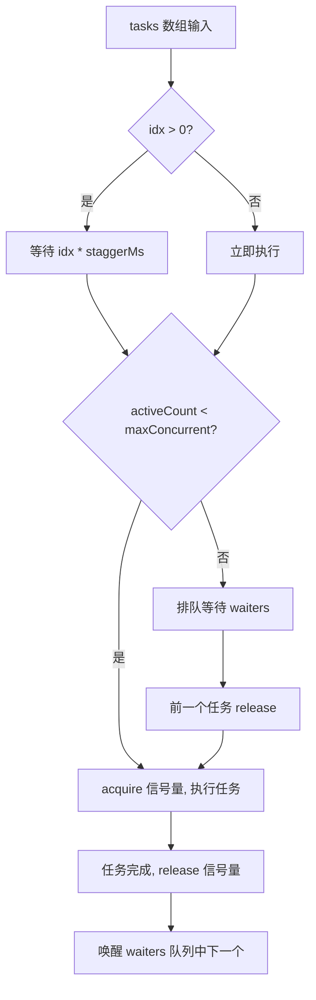
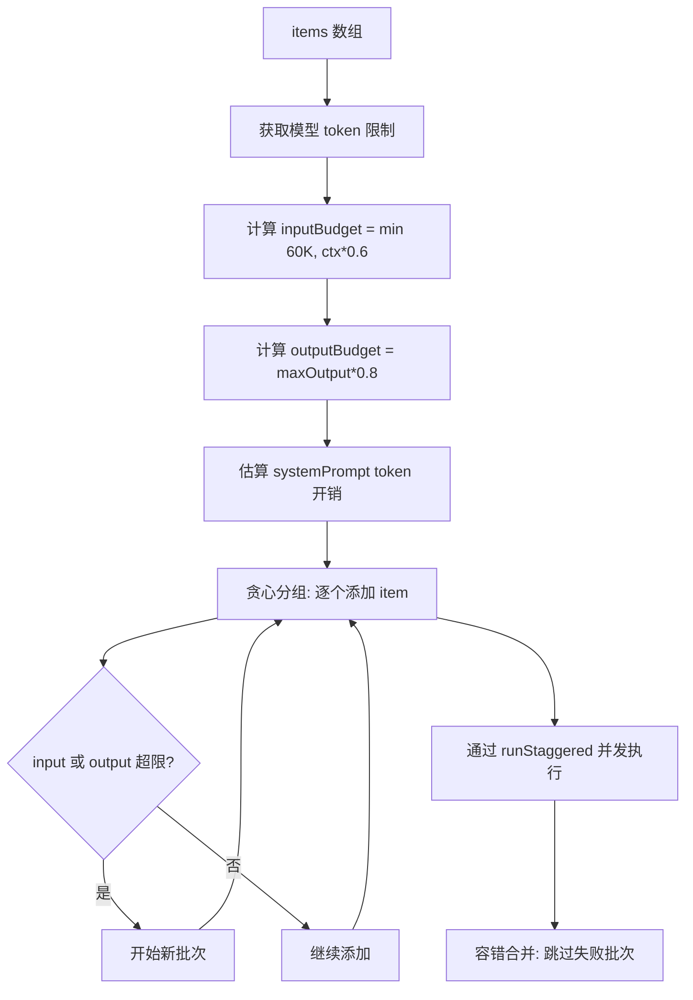
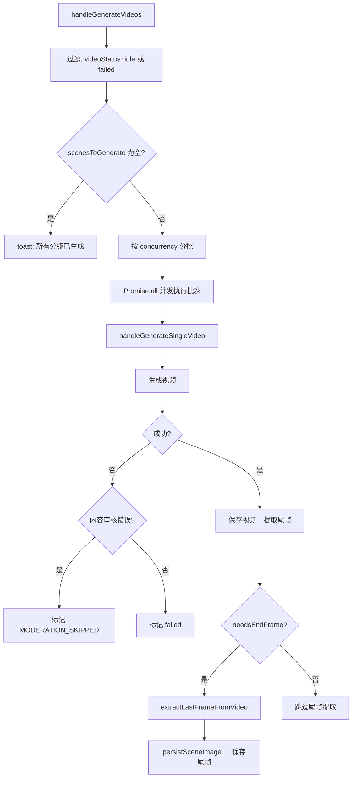

# PD-481.01 moyin-creator — 三层批量生成管道与断点续传

> 文档编号：PD-481.01
> 来源：moyin-creator `src/lib/ai/batch-processor.ts` `src/lib/utils/concurrency.ts` `src/components/panels/director/split-scenes.tsx`
> GitHub：https://github.com/MemeCalculate/moyin-creator.git
> 问题域：PD-481 批量生成管道 Batch Generation Pipeline
> 状态：可复用方案

---

## 第 1 章 问题与动机

### 1.1 核心问题

AI 内容创作工具（如视频分镜生成）需要对大量 items 进行批量 AI 调用。直接逐个串行调用存在三个核心痛点：

1. **效率低下**：串行调用无法利用 API 并发能力，N 个分镜需要 N 倍等待时间
2. **脆弱性**：任何一个分镜生成失败（网络超时、内容审核拒绝、API 限流）都可能中断整个批次
3. **上下文断裂**：视频分镜之间需要视觉连续性，前一个视频的尾帧应作为下一个视频的首帧参考

moyin-creator 面对的场景更复杂：它不仅要批量生成视频，还要批量调用 LLM 做剧本分析、角色校准等文本任务。这些文本任务有 token 限制约束，需要自适应分批。

### 1.2 moyin-creator 的解法概述

moyin-creator 构建了一个三层批量生成管道：

1. **底层并发控制器** (`concurrency.ts:27-83`)：`runStaggered` 函数实现信号量 + 错开启动的并发调度，确保 API 请求不会瞬间打满
2. **中层自适应批处理器** (`batch-processor.ts:105-233`)：`processBatched` 函数实现双重 token 约束（input + output）的贪心分组，自动将大量 items 拆分为合理批次
3. **上层业务编排** (`split-scenes.tsx:1436-1494`)：`handleGenerateVideos` 函数实现断点续传（跳过已完成分镜）、内容审核容错跳过、视觉连续性尾帧传递

三层之间通过 Zustand store 中的 `concurrency` 配置和 `advancedOptions` 开关联动。

### 1.3 设计思想

| 设计原则 | 具体实现 | 理由 | 替代方案 |
|----------|----------|------|----------|
| 错开启动 | `runStaggered` 每个任务间隔 staggerMs 启动 | 避免瞬间并发打满 API 限流 | 固定窗口限流（不够灵活） |
| 双重约束分批 | input token + output token 贪心分组 | 防止超长上下文 TTFT 过高 + 输出截断 | 固定 batch size（浪费或溢出） |
| 60K Hard Cap | 无论模型支持多大上下文，每批 input ≤ 60K | 防止 Lost in the middle 问题 | 信任模型标称值（实际效果差） |
| 容错隔离 | 单批次失败不影响其他批次，部分成功也返回结果 | 批量任务不应因个别失败全部作废 | 全部重试（浪费已成功的结果） |
| 断点续传 | 过滤 `videoStatus === 'idle' \|\| 'failed'` 的分镜 | 中断后只重新生成未完成的部分 | 全部重新生成（浪费时间和费用） |
| 审核容错 | `isContentModerationError` 检测 → 标记跳过 | 敏感内容不应阻塞整个批次 | 中断整个批次（用户体验差） |
| 尾帧传递 | `extractLastFrameFromVideo` → 下一分镜首帧 | 保证视频序列的视觉连续性 | 无连续性（画面跳跃） |

---

## 第 2 章 源码实现分析

### 2.1 架构概览

moyin-creator 的批量生成管道由三层组成，每层解决不同粒度的问题：

```
┌─────────────────────────────────────────────────────────┐
│  Layer 3: 业务编排 (split-scenes.tsx)                    │
│  handleGenerateVideos → 断点续传 + 审核容错 + 尾帧传递    │
│  ┌─────────────────────────────────────────────────────┐ │
│  │  Layer 2: 自适应批处理 (batch-processor.ts)          │ │
│  │  processBatched → 双重 token 约束分组 + 重试         │ │
│  │  ┌─────────────────────────────────────────────────┐ │ │
│  │  │  Layer 1: 并发控制 (concurrency.ts)             │ │ │
│  │  │  runStaggered → 信号量 + 错开启动               │ │ │
│  │  └─────────────────────────────────────────────────┘ │ │
│  └─────────────────────────────────────────────────────┘ │
│                                                           │
│  横切关注点:                                              │
│  ├── api-config-store.ts → concurrency + advancedOptions │
│  ├── feature-router.ts → 多模型轮询调度                   │
│  ├── model-registry.ts → 模型 token 限制查询              │
│  └── rate-limiter.ts → 简单限流工具                       │
└─────────────────────────────────────────────────────────┘
```

### 2.2 核心实现

#### 2.2.1 Layer 1: 错开启动的并发控制器



对应源码 `src/lib/utils/concurrency.ts:27-83`：

```typescript
export async function runStaggered<T>(
  tasks: (() => Promise<T>)[],
  maxConcurrent: number,
  staggerMs: number = 5000
): Promise<PromiseSettledResult<T>[]> {
  const results: PromiseSettledResult<T>[] = new Array(tasks.length);

  // 信号量：控制最大并发数
  let activeCount = 0;
  const waiters: (() => void)[] = [];

  const acquire = async (): Promise<void> => {
    if (activeCount < maxConcurrent) {
      activeCount++;
      return;
    }
    await new Promise<void>((resolve) => waiters.push(resolve));
  };

  const release = (): void => {
    activeCount--;
    if (waiters.length > 0) {
      activeCount++;
      const next = waiters.shift()!;
      next();
    }
  };

  const taskPromises = tasks.map(async (task, idx) => {
    if (idx > 0) {
      await new Promise<void>((r) => setTimeout(r, idx * staggerMs));
    }
    await acquire();
    try {
      const value = await task();
      results[idx] = { status: 'fulfilled', value };
    } catch (reason) {
      results[idx] = { status: 'rejected', reason: reason as any };
    } finally {
      release();
    }
  });

  await Promise.all(taskPromises);
  return results;
}
```

关键设计：`runStaggered` 返回 `PromiseSettledResult<T>[]`（而非 `T[]`），这意味着单个任务失败不会导致整个批次 reject。调用方可以逐个检查 `status === 'fulfilled'` 来收集成功结果。

#### 2.2.2 Layer 2: 双重约束自适应分批



对应源码 `src/lib/ai/batch-processor.ts:105-233`：

```typescript
export async function processBatched<TItem, TResult>(
  opts: ProcessBatchedOptions<TItem, TResult>,
): Promise<ProcessBatchedResult<TResult>> {
  const { items, feature, buildPrompts, parseResult, mergeResults,
    estimateItemTokens, estimateItemOutputTokens, apiOptions, onProgress } = opts;

  if (items.length === 0) {
    return { results: new Map(), failedBatches: 0, totalBatches: 0 };
  }

  // 1. 获取模型限制
  const store = useAPIConfigStore.getState();
  const providerInfo = store.getProviderForFeature(feature);
  const modelName = providerInfo?.model?.[0] || '';
  const limits = getModelLimits(modelName);

  const inputBudget = Math.min(Math.floor(limits.contextWindow * 0.6), HARD_CAP_TOKENS);
  const outputBudget = Math.floor(limits.maxOutput * 0.8);

  // 2. 估算 system prompt token 开销
  const samplePrompts = buildPrompts([items[0]]);
  const systemPromptTokens = estimateTokens(samplePrompts.system);

  // 3. 双重约束贪心分组
  const batches = createBatches(items, getItemTokens, getItemOutputTokens,
    inputBudget, outputBudget, systemPromptTokens);

  // 4. 并发执行
  const concurrency = store.concurrency || 1;
  const batchTasks = batches.map((batch, idx) => {
    return async () => {
      const result = await executeBatchWithRetry(batch, feature, buildPrompts, parseResult, apiOptions);
      return result;
    };
  });
  const settled = await runStaggered(batchTasks, concurrency, 5000);

  // 5. 容错合并
  const successResults: Map<string, TResult>[] = [];
  let failedBatches = 0;
  for (const result of settled) {
    if (result.status === 'fulfilled') {
      successResults.push(result.value);
    } else {
      failedBatches++;
    }
  }

  let finalResults: Map<string, TResult>;
  if (mergeResults) {
    finalResults = mergeResults(successResults);
  } else {
    finalResults = new Map();
    for (const map of successResults) {
      for (const [key, value] of map) finalResults.set(key, value);
    }
  }
  return { results: finalResults, failedBatches, totalBatches: batches.length };
}
```

分批核心算法 `createBatches` (`batch-processor.ts:246-285`) 使用贪心策略：逐个添加 item，当 input token 或 output token 任一约束即将超出时开始新批次。单个 item 超出预算时仍独立成批（保证至少每批 1 个 item）。

#### 2.2.3 Layer 3: 业务编排 — 断点续传 + 审核容错 + 尾帧传递



对应源码 `src/components/panels/director/split-scenes.tsx:1436-1494`：

```typescript
const handleGenerateVideos = useCallback(async () => {
  // 断点续传：只处理 idle 或 failed 的分镜
  const scenesToGenerate = splitScenes.filter(
    s => s.videoStatus === 'idle' || s.videoStatus === 'failed'
  );
  if (scenesToGenerate.length === 0) {
    toast.info("所有分镜已生成或正在生成中");
    return;
  }

  // 按用户配置的 concurrency 分批并发
  for (let i = 0; i < scenesToGenerate.length; i += concurrency) {
    const batch = scenesToGenerate.slice(i, i + concurrency);
    await Promise.all(batch.map(async (scene) => {
      try {
        await handleGenerateSingleVideo(scene.id);
        successCount++;
      } catch (error) {
        console.error(`Batch: Scene ${scene.id} failed:`, error);
      }
    }));
  }
}, [splitScenes, concurrency, handleGenerateSingleVideo]);
```

### 2.3 实现细节

#### 2.3.1 内容审核容错

`use-video-generation.ts:15-51` 定义了 16 个中英文审核关键词，当视频生成 API 返回包含这些关键词的错误时，`split-scenes.tsx:1407-1418` 将该分镜标记为 `MODERATION_SKIPPED` 而非 `failed`，不阻塞后续分镜生成。

#### 2.3.2 视觉连续性尾帧传递

`split-scenes.tsx:1373-1398` 在视频生成成功后，检查当前分镜是否需要尾帧（`needsEndFrame`）。如果需要，调用 `extractLastFrameFromVideo` 从视频末尾提取一帧，通过 `persistSceneImage` 持久化后存入当前分镜的 `endFrameImageUrl`。

手动传递路径：`handleExtractVideoLastFrame` (`split-scenes.tsx:371-411`) 允许用户手动将当前分镜的视频尾帧插入到下一个分镜的首帧，实现跨分镜的视觉连续性。

#### 2.3.3 用户可配置并发度

`api-config-store.ts:164` 定义 `concurrency: number`，默认值为 1（串行执行），用户可在设置面板调整。`setConcurrency` (`api-config-store.ts:692-695`) 强制最小值为 1，无上限。该值通过 Zustand persist 持久化到 localStorage。

#### 2.3.4 单批次指数退避重试

`batch-processor.ts:292-326` 的 `executeBatchWithRetry` 实现最多 2 次重试，基础延迟 3 秒，指数退避（3s → 6s）。特殊处理：`TOKEN_BUDGET_EXCEEDED` 错误不重试（输入太大，重试也没用）。

#### 2.3.5 模型 token 限制三层查找

`model-registry.ts` 实现三层查找策略：
1. 持久化缓存（从 API 400 错误中自动学到的真实限制）
2. 静态注册表（官方文档验证过的已知模型，含 prefix 匹配）
3. 保守默认值（未知模型宁可多分批也不撞限制）

---

## 第 3 章 迁移指南

### 3.1 迁移清单

**阶段 1：并发控制器（1 个文件）**
- [ ] 复制 `runStaggered` 函数到项目的 utils 目录
- [ ] 确认项目的 Promise 环境支持 `PromiseSettledResult`（ES2020+）

**阶段 2：自适应批处理器（2 个文件）**
- [ ] 实现 `ModelLimits` 接口和模型注册表（或使用硬编码默认值）
- [ ] 实现 `estimateTokens` 函数（可用 `text.length / 4` 粗估）
- [ ] 复制 `processBatched` 和 `createBatches` 函数
- [ ] 适配 `callFeatureAPI` 为项目的 LLM 调用接口

**阶段 3：业务编排层（按需）**
- [ ] 实现断点续传：在 item 上维护 status 字段，批量执行时过滤已完成的
- [ ] 实现审核容错：定义审核关键词列表，catch 中检测并标记跳过
- [ ] 实现尾帧传递：视频生成后提取最后一帧，传递给下一个 item

### 3.2 适配代码模板

#### 最小可用版本：并发控制 + 容错

```typescript
// concurrency.ts — 直接复用，无需修改
export async function runStaggered<T>(
  tasks: (() => Promise<T>)[],
  maxConcurrent: number,
  staggerMs: number = 5000
): Promise<PromiseSettledResult<T>[]> {
  if (tasks.length === 0) return [];
  const results: PromiseSettledResult<T>[] = new Array(tasks.length);
  let activeCount = 0;
  const waiters: (() => void)[] = [];

  const acquire = async (): Promise<void> => {
    if (activeCount < maxConcurrent) { activeCount++; return; }
    await new Promise<void>((resolve) => waiters.push(resolve));
  };
  const release = (): void => {
    activeCount--;
    if (waiters.length > 0) { activeCount++; waiters.shift()!(); }
  };

  const taskPromises = tasks.map(async (task, idx) => {
    if (idx > 0) await new Promise<void>(r => setTimeout(r, idx * staggerMs));
    await acquire();
    try {
      results[idx] = { status: 'fulfilled', value: await task() };
    } catch (reason) {
      results[idx] = { status: 'rejected', reason: reason as any };
    } finally { release(); }
  });
  await Promise.all(taskPromises);
  return results;
}

// batch-runner.ts — 简化版批量执行器
interface BatchRunnerOptions<T> {
  items: T[];
  concurrency: number;
  staggerMs?: number;
  execute: (item: T) => Promise<void>;
  shouldSkip?: (item: T) => boolean;  // 断点续传
  onModerationError?: (item: T, error: Error) => void;  // 审核容错
}

async function runBatch<T>(opts: BatchRunnerOptions<T>) {
  const { items, concurrency, staggerMs = 5000, execute, shouldSkip, onModerationError } = opts;
  const toProcess = shouldSkip ? items.filter(i => !shouldSkip(i)) : items;

  const tasks = toProcess.map(item => async () => {
    try {
      await execute(item);
    } catch (err) {
      if (onModerationError && isModerationError(err)) {
        onModerationError(item, err as Error);
      } else {
        throw err;
      }
    }
  });

  return runStaggered(tasks, concurrency, staggerMs);
}

const MODERATION_KEYWORDS = ['moderation', 'sensitive', 'blocked', 'prohibited', 'policy'];
function isModerationError(err: unknown): boolean {
  const msg = (err instanceof Error ? err.message : String(err)).toLowerCase();
  return MODERATION_KEYWORDS.some(k => msg.includes(k));
}
```

#### 自适应分批模板

```typescript
// adaptive-batcher.ts — 双重约束分批
interface BatchConfig {
  inputBudgetTokens: number;   // 每批最大 input token
  outputBudgetTokens: number;  // 每批最大 output token
  systemPromptTokens: number;  // system prompt 固定开销
}

function createAdaptiveBatches<T>(
  items: T[],
  getInputTokens: (item: T) => number,
  getOutputTokens: (item: T) => number,
  config: BatchConfig,
): T[][] {
  const { inputBudgetTokens, outputBudgetTokens, systemPromptTokens } = config;
  const batches: T[][] = [];
  let batch: T[] = [];
  let inputUsed = systemPromptTokens;
  let outputUsed = 0;

  for (const item of items) {
    const inTok = getInputTokens(item);
    const outTok = getOutputTokens(item);
    if (batch.length > 0 && (inputUsed + inTok > inputBudgetTokens || outputUsed + outTok > outputBudgetTokens)) {
      batches.push(batch);
      batch = [];
      inputUsed = systemPromptTokens;
      outputUsed = 0;
    }
    batch.push(item);
    inputUsed += inTok;
    outputUsed += outTok;
  }
  if (batch.length > 0) batches.push(batch);
  return batches;
}
```

### 3.3 适用场景

| 场景 | 适用度 | 说明 |
|------|--------|------|
| 批量 AI 图片/视频生成 | ⭐⭐⭐ | 核心场景，直接复用三层架构 |
| 批量 LLM 文本处理（摘要、翻译） | ⭐⭐⭐ | 自适应分批 + 并发控制完美匹配 |
| 批量 API 调用（非 AI） | ⭐⭐ | 并发控制层可复用，分批层不需要 |
| 实时流式生成 | ⭐ | 不适用，本方案面向批量离线任务 |
| 单次 AI 调用 | ⭐ | 过度设计，直接调用即可 |

---

## 第 4 章 测试用例

```typescript
import { describe, it, expect, vi } from 'vitest';

// ==================== runStaggered 测试 ====================

describe('runStaggered', () => {
  it('should respect maxConcurrent limit', async () => {
    let maxActive = 0;
    let currentActive = 0;

    const tasks = Array.from({ length: 5 }, () => async () => {
      currentActive++;
      maxActive = Math.max(maxActive, currentActive);
      await new Promise(r => setTimeout(r, 50));
      currentActive--;
      return 'done';
    });

    await runStaggered(tasks, 2, 10);
    expect(maxActive).toBeLessThanOrEqual(2);
  });

  it('should return PromiseSettledResult for mixed success/failure', async () => {
    const tasks = [
      async () => 'ok',
      async () => { throw new Error('fail'); },
      async () => 'ok2',
    ];

    const results = await runStaggered(tasks, 3, 0);
    expect(results[0]).toEqual({ status: 'fulfilled', value: 'ok' });
    expect(results[1].status).toBe('rejected');
    expect(results[2]).toEqual({ status: 'fulfilled', value: 'ok2' });
  });

  it('should handle empty tasks array', async () => {
    const results = await runStaggered([], 3);
    expect(results).toEqual([]);
  });
});

// ==================== createBatches 测试 ====================

describe('createBatches (adaptive splitting)', () => {
  it('should split items when input budget exceeded', () => {
    const items = [{ text: 'a'.repeat(100) }, { text: 'b'.repeat(100) }, { text: 'c'.repeat(100) }];
    const batches = createAdaptiveBatches(
      items,
      (item) => item.text.length,  // 1 char ≈ 1 token
      () => 50,
      { inputBudgetTokens: 150, outputBudgetTokens: 1000, systemPromptTokens: 20 }
    );
    // 20 + 100 = 120 (fits), 120 + 100 = 220 > 150 → new batch
    expect(batches.length).toBe(2);
    expect(batches[0].length).toBe(1);
    expect(batches[1].length).toBe(2);
  });

  it('should split items when output budget exceeded', () => {
    const items = Array.from({ length: 5 }, (_, i) => ({ id: i }));
    const batches = createAdaptiveBatches(
      items,
      () => 10,
      () => 300,  // 每项 300 output tokens
      { inputBudgetTokens: 10000, outputBudgetTokens: 800, systemPromptTokens: 0 }
    );
    // 300 + 300 = 600 (fits), 600 + 300 = 900 > 800 → new batch
    expect(batches.length).toBe(3);
  });

  it('should keep single oversized item in its own batch', () => {
    const items = [{ text: 'x'.repeat(1000) }];
    const batches = createAdaptiveBatches(
      items,
      (item) => item.text.length,
      () => 50,
      { inputBudgetTokens: 100, outputBudgetTokens: 1000, systemPromptTokens: 0 }
    );
    expect(batches.length).toBe(1);
    expect(batches[0].length).toBe(1);
  });
});

// ==================== 断点续传测试 ====================

describe('Resume generation (断点续传)', () => {
  it('should skip completed scenes', () => {
    const scenes = [
      { id: 0, videoStatus: 'completed' },
      { id: 1, videoStatus: 'failed' },
      { id: 2, videoStatus: 'idle' },
      { id: 3, videoStatus: 'generating' },
    ];
    const toGenerate = scenes.filter(
      s => s.videoStatus === 'idle' || s.videoStatus === 'failed'
    );
    expect(toGenerate.map(s => s.id)).toEqual([1, 2]);
  });
});

// ==================== 内容审核容错测试 ====================

describe('Content moderation detection', () => {
  it('should detect English moderation keywords', () => {
    expect(isModerationError(new Error('content blocked by moderation'))).toBe(true);
    expect(isModerationError(new Error('request rejected due to policy'))).toBe(true);
  });

  it('should detect Chinese moderation keywords', () => {
    expect(isModerationError(new Error('内容审核未通过'))).toBe(true);
    expect(isModerationError(new Error('该内容违规'))).toBe(true);
  });

  it('should not flag normal errors', () => {
    expect(isModerationError(new Error('network timeout'))).toBe(false);
    expect(isModerationError(new Error('API rate limit exceeded'))).toBe(false);
  });
});
```

---

## 第 5 章 跨域关联

| 关联域 | 关系类型 | 说明 |
|--------|----------|------|
| PD-01 上下文管理 | 依赖 | `processBatched` 的 60K Hard Cap 和双重 token 约束本质上是上下文窗口管理策略 |
| PD-03 容错与重试 | 协同 | `executeBatchWithRetry` 的指数退避重试 + `isContentModerationError` 的审核容错跳过 |
| PD-04 工具系统 | 协同 | `feature-router.ts` 的多模型轮询调度为批量管道提供 API 路由能力 |
| PD-11 可观测性 | 协同 | `BatchProgressOverlay` 组件 + `onProgress` 回调提供批量任务的实时进度可视化 |

---

## 第 6 章 来源文件索引

| 文件 | 行范围 | 关键实现 |
|------|--------|----------|
| `src/lib/utils/concurrency.ts` | L27-L83 | `runStaggered` 错开启动并发控制器 |
| `src/lib/ai/batch-processor.ts` | L24-L33 | 常量定义：HARD_CAP_TOKENS, MAX_BATCH_RETRIES |
| `src/lib/ai/batch-processor.ts` | L37-L91 | `ProcessBatchedOptions` 和 `ProcessBatchedResult` 类型定义 |
| `src/lib/ai/batch-processor.ts` | L105-L233 | `processBatched` 核心函数：分批 + 并发 + 容错合并 |
| `src/lib/ai/batch-processor.ts` | L246-L285 | `createBatches` 双重约束贪心分组算法 |
| `src/lib/ai/batch-processor.ts` | L292-L326 | `executeBatchWithRetry` 指数退避重试 |
| `src/lib/utils/rate-limiter.ts` | L31-L61 | `rateLimitedBatch` 简单限流批处理 |
| `src/lib/utils/rate-limiter.ts` | L96-L165 | `batchProcess` 分批并行/串行处理 |
| `src/stores/api-config-store.ts` | L74-L91 | `AdvancedGenerationOptions` 类型（含 enableVisualContinuity, enableResumeGeneration） |
| `src/stores/api-config-store.ts` | L164 | `concurrency: number` 用户可配置并发度 |
| `src/stores/api-config-store.ts` | L692-L695 | `setConcurrency` 设置并发度（最小 1） |
| `src/components/panels/director/split-scenes.tsx` | L371-L411 | `handleExtractVideoLastFrame` 尾帧提取并插入下一分镜 |
| `src/components/panels/director/split-scenes.tsx` | L1373-L1398 | 视频生成后自动提取尾帧（视觉连续性） |
| `src/components/panels/director/split-scenes.tsx` | L1407-L1418 | 内容审核容错：标记 MODERATION_SKIPPED |
| `src/components/panels/director/split-scenes.tsx` | L1436-L1494 | `handleGenerateVideos` 批量生成入口（断点续传 + 并发分批） |
| `src/components/panels/director/use-video-generation.ts` | L15-L51 | `isContentModerationError` 审核关键词检测 |
| `src/components/panels/director/use-video-generation.ts` | L1158-L1329 | `extractLastFrameFromVideo` 视频尾帧提取 |
| `src/components/BatchProgressOverlay.tsx` | L27-L77 | 批量进度覆盖层 UI 组件 |
| `src/lib/ai/feature-router.ts` | L133-L182 | `getFeatureConfig` 多模型轮询调度 |
| `src/lib/ai/model-registry.ts` | L1-L80 | 模型 token 限制三层查找注册表 |

---

## 第 7 章 横向对比维度

```json comparison_data
{
  "project": "moyin-creator",
  "dimensions": {
    "并发模型": "信号量 + 错开启动（stagger），用户可配置 concurrency",
    "分批策略": "双重约束贪心分组（input token + output token），60K Hard Cap",
    "容错策略": "单批次指数退避重试 + 审核关键词检测跳过 + PromiseSettledResult 隔离",
    "断点续传": "基于 videoStatus 字段过滤，只重新生成 idle/failed 的 items",
    "视觉连续性": "extractLastFrameFromVideo 提取尾帧 → 下一分镜首帧",
    "进度可视化": "BatchProgressOverlay 组件 + onProgress 回调实时更新"
  }
}
```

### 域元数据补充

```json domain_metadata
{
  "solution_summary": "moyin-creator 用三层管道（runStaggered 信号量并发 + processBatched 双重 token 约束分批 + 业务层断点续传/审核跳过/尾帧传递）实现批量 AI 生成",
  "description": "批量 AI 生成中的自适应分批与多层容错编排",
  "sub_problems": [
    "双重 token 约束（input + output）的自适应分批",
    "60K Hard Cap 防止 Lost in the middle",
    "多模型轮询调度与批量任务的协同"
  ],
  "best_practices": [
    "PromiseSettledResult 实现批次级容错隔离",
    "错开启动（stagger）避免瞬间并发打满限流",
    "TOKEN_BUDGET_EXCEEDED 错误不重试避免无效重试"
  ]
}
```
