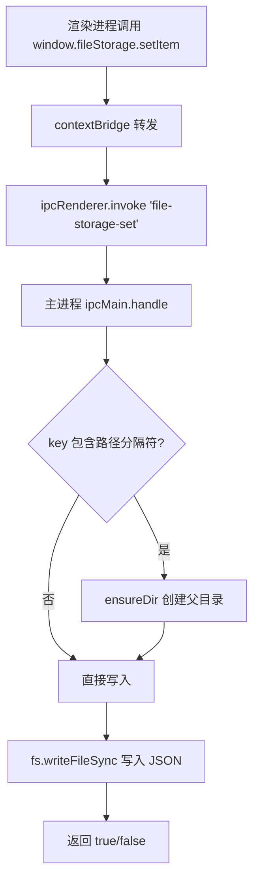
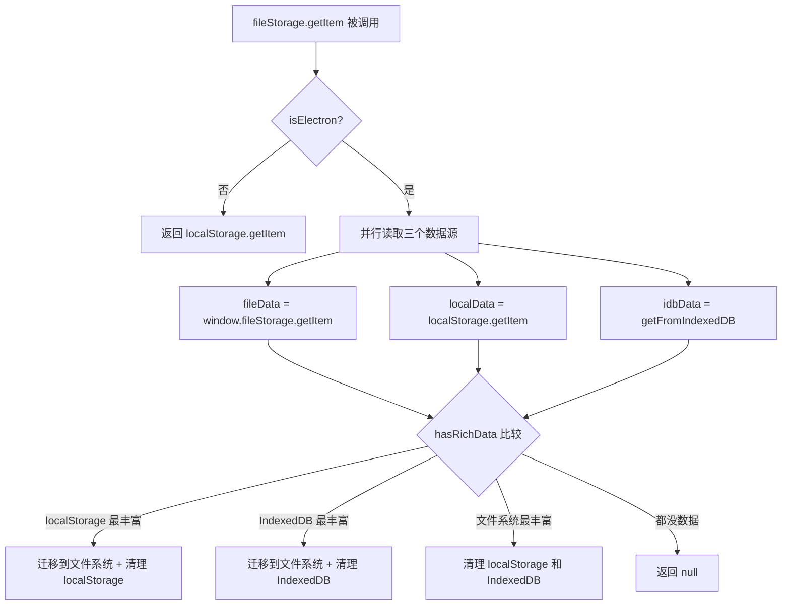
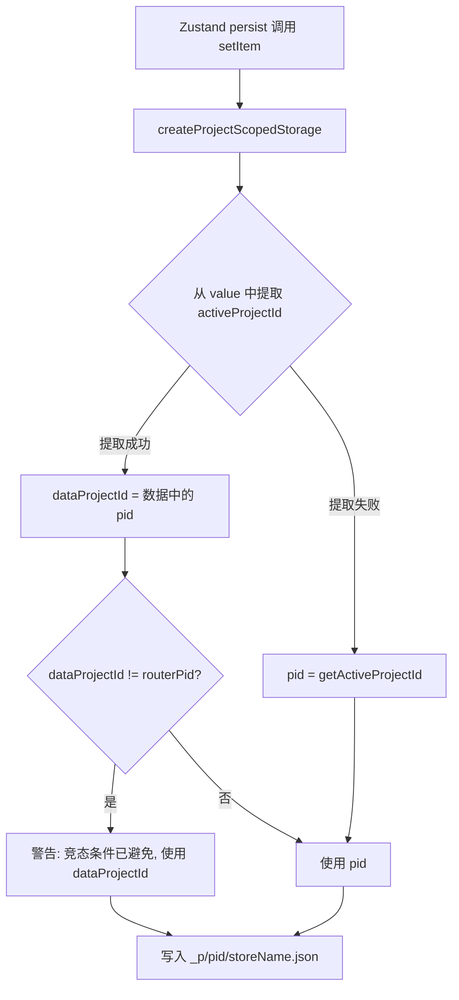

# PD-482.01 moyin-creator — Electron 三层混合存储与项目级数据隔离

> 文档编号：PD-482.01
> 来源：moyin-creator `electron/preload.ts` `src/lib/indexed-db-storage.ts` `src/lib/project-storage.ts`
> GitHub：https://github.com/MemeCalculate/moyin-creator.git
> 问题域：PD-482 Electron 混合存储架构
> 状态：可复用方案

---

## 第 1 章 问题与动机

### 1.1 核心问题

Electron 桌面应用面临一个根本性的存储困境：Web 端的 localStorage（5MB 限制）和 IndexedDB 无法满足大型项目数据的持久化需求，而直接使用 Node.js 文件系统又会破坏渲染进程的安全沙箱。moyin-creator 作为一个漫画创作工具，需要存储大量项目数据（剧本、分镜、角色、媒体文件），且支持多项目切换，这使得存储架构的设计尤为关键。

核心挑战包括：
1. **容量限制**：localStorage 5MB 上限无法存储完整项目数据
2. **安全边界**：渲染进程不能直接访问文件系统，必须通过 IPC 桥接
3. **多项目隔离**：不同项目的数据必须物理隔离，避免切换时互相覆盖
4. **迁移兼容**：从单文件存储升级到多项目存储时，必须无损迁移旧数据
5. **跨存储源一致性**：localStorage、IndexedDB、文件系统三个数据源可能存在冲突

### 1.2 moyin-creator 的解法概述

moyin-creator 构建了一个三层混合存储架构：

1. **contextBridge 安全暴露四组 API**（`electron/preload.ts:7-79`）：通过 `fileStorage`、`imageStorage`、`storageManager`、`electronAPI` 四个命名空间，将文件系统操作安全地暴露给渲染进程
2. **运行时自动检测与三源迁移**（`src/lib/indexed-db-storage.ts:26-28,62-124`）：`isElectron()` 检测环境，getItem 时自动比较 localStorage / IndexedDB / 文件系统三个数据源，将最丰富的数据迁移到文件系统
3. **项目级存储路由**（`src/lib/project-storage.ts:61-145`）：`createProjectScopedStorage` 将 Zustand store 数据路由到 `_p/{projectId}/{storeName}.json`，实现物理隔离
4. **Split Storage 共享/隔离双模**（`src/lib/project-storage.ts:169-315`）：`createSplitStorage` 将数组型数据按 projectId 拆分为项目专属和共享两部分
5. **安全的项目切换协议**（`src/lib/project-switcher.ts:39-114`）：严格的 4 步切换流程，避免 rehydrate 竞态导致数据覆盖

### 1.3 设计思想

| 设计原则 | 具体实现 | 理由 | 替代方案 |
|----------|----------|------|----------|
| 最小权限暴露 | contextBridge 按功能分组暴露 4 个命名空间 | 渲染进程只能调用预定义的 IPC 方法，无法直接访问 fs | 暴露完整 ipcRenderer（不安全） |
| 透明降级 | `isElectron()` 检测后自动切换 localStorage | 同一套 Zustand store 代码在浏览器和 Electron 中都能运行 | 编译时条件分支（不灵活） |
| 数据丰富度优先 | `hasRichData()` 比较三源数据，迁移最丰富的 | 避免空数据覆盖用户真实数据 | 简单的时间戳比较（不可靠） |
| 物理隔离 | 每个项目一个目录 `_p/{pid}/` | 项目切换只需改变读写路径，无需序列化/反序列化整个状态 | 单文件 + projectId 字段过滤（性能差） |
| 安全迁移 | 旧文件保留为 fallback，新文件写入后才标记完成 | 迁移失败可重试，不丢数据 | 直接覆盖（不可逆） |

---

## 第 2 章 源码实现分析

### 2.1 架构概览

moyin-creator 的存储系统分为三层：Electron 主进程（文件系统操作）、Preload 桥接层（安全暴露 API）、渲染进程（Zustand + 存储适配器）。

```
┌─────────────────────────────────────────────────────────────────┐
│                     渲染进程 (Renderer)                          │
│                                                                 │
│  ┌──────────────┐   ┌──────────────────┐   ┌────────────────┐  │
│  │ Zustand Store │──→│ ProjectScoped    │──→│ fileStorage    │  │
│  │ (persist)     │   │ Storage Adapter  │   │ (StateStorage) │  │
│  └──────────────┘   └──────────────────┘   └───────┬────────┘  │
│                                                     │           │
│  ┌──────────────┐   ┌──────────────────┐           │           │
│  │ image-storage │──→│ window.          │           │           │
│  │ .ts helpers   │   │ imageStorage     │           │           │
│  └──────────────┘   └────────┬─────────┘           │           │
│                              │                      │           │
├──────────────────────────────┼──────────────────────┼───────────┤
│                    contextBridge (preload.ts)        │           │
│         window.imageStorage  │    window.fileStorage │           │
├──────────────────────────────┼──────────────────────┼───────────┤
│                     主进程 (Main)                     │           │
│                              │                      │           │
│  ┌───────────────────────────▼──────────────────────▼────────┐  │
│  │                    ipcMain.handle(...)                     │  │
│  │  save-image / get-image-path / file-storage-get/set/...   │  │
│  └───────────────────────────┬───────────────────────────────┘  │
│                              │                                  │
│  ┌───────────────────────────▼───────────────────────────────┐  │
│  │              Node.js fs (文件系统)                          │  │
│  │  basePath/                                                 │  │
│  │  ├── projects/                                             │  │
│  │  │   ├── moyin-project-store.json  (项目索引)               │  │
│  │  │   ├── _p/{pid}/script.json      (项目专属)               │  │
│  │  │   ├── _p/{pid}/director.json                            │  │
│  │  │   ├── _shared/media.json        (跨项目共享)             │  │
│  │  │   └── _shared/characters.json                           │  │
│  │  └── media/                                                │  │
│  │      ├── characters/               (图片文件)               │  │
│  │      ├── scenes/                                           │  │
│  │      └── videos/                                           │  │
│  └───────────────────────────────────────────────────────────┘  │
└─────────────────────────────────────────────────────────────────┘
```

### 2.2 核心实现

#### 2.2.1 Preload 安全桥接



对应源码 `electron/preload.ts:50-57`：
```typescript
// File storage API for app data (unlimited size)
contextBridge.exposeInMainWorld('fileStorage', {
  getItem: (key: string) => ipcRenderer.invoke('file-storage-get', key),
  setItem: (key: string, value: string) => ipcRenderer.invoke('file-storage-set', key, value),
  removeItem: (key: string) => ipcRenderer.invoke('file-storage-remove', key),
  exists: (key: string) => ipcRenderer.invoke('file-storage-exists', key),
  listKeys: (prefix: string) => ipcRenderer.invoke('file-storage-list', prefix),
  removeDir: (prefix: string) => ipcRenderer.invoke('file-storage-remove-dir', prefix),
})
```

主进程对应的 IPC handler（`electron/main.ts:483-496`）：
```typescript
ipcMain.handle('file-storage-set', async (_event, key: string, value: string) => {
  try {
    const filePath = path.join(getDataDir(), `${key}.json`)
    // Ensure parent directory exists (supports nested keys like _p/xxx/script)
    const parentDir = path.dirname(filePath)
    ensureDir(parentDir)
    fs.writeFileSync(filePath, value, 'utf-8')
    console.log(`Saved to file: ${filePath} (${Math.round(value.length / 1024)}KB)`)
    return true
  } catch (error) {
    console.error('Failed to write file storage:', error)
    return false
  }
})
```

#### 2.2.2 三源数据迁移



对应源码 `src/lib/indexed-db-storage.ts:62-124`：
```typescript
export const fileStorage: StateStorage = {
  getItem: async (name: string): Promise<string | null> => {
    if (isElectron()) {
      try {
        const fileData = await window.fileStorage!.getItem(name);
        const localData = localStorage.getItem(name);
        let idbData: string | null = null;
        try { idbData = await getFromIndexedDB(name); } catch (e) {}
        
        const fileHasData = hasRichData(fileData);
        const localHasData = hasRichData(localData);
        const idbHasData = hasRichData(idbData);
        
        // Priority: localStorage > IndexedDB > file (for migration)
        if (localHasData && !fileHasData) {
          await window.fileStorage!.setItem(name, localData!);
          localStorage.removeItem(name);
          return localData;
        }
        if (idbHasData && !fileHasData && !localHasData) {
          await window.fileStorage!.setItem(name, idbData!);
          await removeFromIndexedDB(name);
          return idbData;
        }
        if (fileHasData) {
          if (localData) localStorage.removeItem(name);
          if (idbData) await removeFromIndexedDB(name);
          return fileData;
        }
        return fileData || localData || idbData || null;
      } catch (error) {
        console.error('File storage getItem error:', error);
      }
    }
    return localStorage.getItem(name);
  },
  // ...
};
```

#### 2.2.3 项目级存储路由



对应源码 `src/lib/project-storage.ts:96-133`：
```typescript
setItem: async (name: string, value: string): Promise<void> => {
  // Extract the intended project ID from the data being persisted.
  let dataProjectId: string | null = null;
  try {
    const parsed = JSON.parse(value);
    const state = parsed?.state ?? parsed;
    if (state && typeof state === 'object' && typeof state.activeProjectId === 'string') {
      dataProjectId = state.activeProjectId;
    }
  } catch {}

  const pid = dataProjectId || getActiveProjectId();
  
  // Log a warning if there's a mismatch (indicates a race condition was avoided)
  const routerPid = getActiveProjectId();
  if (dataProjectId && routerPid && dataProjectId !== routerPid) {
    console.warn(
      `[ProjectStorage] Routing mismatch for ${storeName}: data.pid=${dataProjectId.substring(0, 8)}, ` +
      `router.pid=${routerPid.substring(0, 8)}. Using data.pid to prevent cross-project overwrite.`
    );
  }

  const projectKey = `_p/${pid}/${storeName}`;
  await fileStorage.setItem(projectKey, value);
},
```

### 2.3 实现细节

**数据丰富度判断**（`src/lib/indexed-db-storage.ts:31-59`）：`hasRichData()` 不是简单比较大小，而是解析 JSON 后检查业务语义——是否有 projects 数组、splitScenes、episodes 等有意义的数据。最后以 1KB 作为兜底阈值。

**Rehydration 等待机制**（`src/lib/project-storage.ts:66-73`）：`createProjectScopedStorage` 的 getItem 在读取前会等待 project-store 完成 rehydration，确保拿到正确的 activeProjectId，而不是默认值 "default-project"。

**自定义协议注册**（`electron/main.ts:1067-1075`）：注册 `local-image://` 为特权协议（secure + supportFetchAPI + bypassCSP + stream），使渲染进程可以像加载普通 URL 一样加载本地图片。

**统一存储基路径**（`electron/main.ts:168-180`）：`getStorageBasePath()` 支持新的 `basePath` 配置和旧的 `projectPath` 兼容，所有数据（projects + media）统一在一个基路径下管理。

**导入回滚机制**（`electron/main.ts:731-808`）：`storage-import-data` 在导入前先创建临时备份，导入失败时自动回滚到备份数据。


---

## 第 3 章 迁移指南

### 3.1 迁移清单

**阶段 1：Preload 桥接层**
- [ ] 创建 `electron/preload.ts`，通过 contextBridge 暴露 `fileStorage` API（getItem/setItem/removeItem/exists/listKeys/removeDir）
- [ ] 在主进程注册对应的 `ipcMain.handle` 处理器，映射到 `fs` 操作
- [ ] 确保 key 到文件路径的映射支持嵌套目录（`_p/xxx/script` → `projects/_p/xxx/script.json`）

**阶段 2：存储适配器**
- [ ] 实现 `StateStorage` 接口的 `fileStorage` 适配器，支持 `isElectron()` 运行时检测
- [ ] 浏览器模式降级到 localStorage
- [ ] 实现三源数据迁移逻辑（localStorage → IndexedDB → 文件系统）

**阶段 3：项目级路由**
- [ ] 实现 `createProjectScopedStorage(storeName)` 工厂函数
- [ ] 实现 `createSplitStorage(storeName, splitFn, mergeFn)` 用于共享/隔离双模
- [ ] 在各 Zustand store 的 persist 配置中替换 storage 为项目级适配器

**阶段 4：迁移与恢复**
- [ ] 实现 `migrateToProjectStorage()` 将单文件数据拆分到 `_p/{pid}/` 目录
- [ ] 实现 `recoverFromLegacy()` 从旧数据恢复被覆盖的项目数据
- [ ] 在 App 初始化时（store rehydrate 之前）执行迁移

### 3.2 适配代码模板

#### 最小可用的 Preload + 文件存储适配器

```typescript
// === electron/preload.ts ===
import { ipcRenderer, contextBridge } from 'electron'

contextBridge.exposeInMainWorld('fileStorage', {
  getItem: (key: string) => ipcRenderer.invoke('fs-get', key),
  setItem: (key: string, value: string) => ipcRenderer.invoke('fs-set', key, value),
  removeItem: (key: string) => ipcRenderer.invoke('fs-remove', key),
})

// === electron/main.ts (IPC handlers) ===
import { ipcMain, app } from 'electron'
import fs from 'node:fs'
import path from 'node:path'

const dataDir = path.join(app.getPath('userData'), 'data')
fs.mkdirSync(dataDir, { recursive: true })

function keyToPath(key: string): string {
  const filePath = path.join(dataDir, `${key}.json`)
  fs.mkdirSync(path.dirname(filePath), { recursive: true })
  return filePath
}

ipcMain.handle('fs-get', async (_, key: string) => {
  const p = keyToPath(key)
  return fs.existsSync(p) ? fs.readFileSync(p, 'utf-8') : null
})

ipcMain.handle('fs-set', async (_, key: string, value: string) => {
  fs.writeFileSync(keyToPath(key), value, 'utf-8')
  return true
})

ipcMain.handle('fs-remove', async (_, key: string) => {
  const p = keyToPath(key)
  if (fs.existsSync(p)) fs.unlinkSync(p)
  return true
})

// === src/lib/file-storage.ts (Zustand StateStorage) ===
import type { StateStorage } from 'zustand/middleware'

declare global {
  interface Window {
    fileStorage?: {
      getItem: (key: string) => Promise<string | null>
      setItem: (key: string, value: string) => Promise<boolean>
      removeItem: (key: string) => Promise<boolean>
    }
  }
}

const isElectron = () => typeof window !== 'undefined' && !!window.fileStorage

export const hybridStorage: StateStorage = {
  getItem: async (name) => {
    if (isElectron()) {
      const fileData = await window.fileStorage!.getItem(name)
      if (fileData) return fileData
      // 迁移: localStorage → 文件系统
      const localData = localStorage.getItem(name)
      if (localData) {
        await window.fileStorage!.setItem(name, localData)
        localStorage.removeItem(name)
        return localData
      }
      return null
    }
    return localStorage.getItem(name)
  },
  setItem: async (name, value) => {
    if (isElectron()) {
      await window.fileStorage!.setItem(name, value)
      return
    }
    localStorage.setItem(name, value)
  },
  removeItem: async (name) => {
    if (isElectron()) {
      await window.fileStorage!.removeItem(name)
      return
    }
    localStorage.removeItem(name)
  },
}

// === 在 Zustand store 中使用 ===
import { create } from 'zustand'
import { persist, createJSONStorage } from 'zustand/middleware'
import { hybridStorage } from '@/lib/file-storage'

export const useMyStore = create(
  persist(
    (set) => ({ /* state */ }),
    {
      name: 'my-store',
      storage: createJSONStorage(() => hybridStorage),
    }
  )
)
```

### 3.3 适用场景

| 场景 | 适用度 | 说明 |
|------|--------|------|
| Electron 桌面应用 + Zustand 状态管理 | ⭐⭐⭐ | 完美匹配，直接复用 |
| Electron 应用 + 其他状态库（Redux/MobX） | ⭐⭐⭐ | 适配器模式通用，只需实现对应接口 |
| 多项目/多工作区的桌面应用 | ⭐⭐⭐ | 项目级路由是核心价值 |
| 纯 Web 应用需要大容量存储 | ⭐⭐ | 可用 OPFS 替代文件系统层 |
| 简单的单项目 Electron 应用 | ⭐ | 过度设计，直接用 electron-store 即可 |

---

## 第 4 章 测试用例

```typescript
import { describe, it, expect, vi, beforeEach } from 'vitest'

// Mock window.fileStorage
const mockFileStorage = {
  getItem: vi.fn(),
  setItem: vi.fn(),
  removeItem: vi.fn(),
  exists: vi.fn(),
  listKeys: vi.fn(),
  removeDir: vi.fn(),
}

describe('hybridStorage - 三源数据迁移', () => {
  beforeEach(() => {
    vi.clearAllMocks()
    Object.defineProperty(window, 'fileStorage', { value: mockFileStorage, writable: true })
    localStorage.clear()
  })

  it('Electron 模式下优先返回文件系统数据', async () => {
    const richData = JSON.stringify({ state: { projects: [{ id: '1' }, { id: '2' }] } })
    mockFileStorage.getItem.mockResolvedValue(richData)
    
    // 导入并调用
    const { fileStorage } = await import('./indexed-db-storage')
    const result = await fileStorage.getItem('test-store')
    
    expect(result).toBe(richData)
    expect(mockFileStorage.getItem).toHaveBeenCalledWith('test-store')
  })

  it('localStorage 有更丰富数据时自动迁移到文件系统', async () => {
    const richData = JSON.stringify({ state: { projects: [{ id: '1' }, { id: '2' }] } })
    mockFileStorage.getItem.mockResolvedValue(null)
    localStorage.setItem('test-store', richData)
    
    const { fileStorage } = await import('./indexed-db-storage')
    const result = await fileStorage.getItem('test-store')
    
    expect(result).toBe(richData)
    expect(mockFileStorage.setItem).toHaveBeenCalledWith('test-store', richData)
    expect(localStorage.getItem('test-store')).toBeNull() // 已清理
  })

  it('非 Electron 环境降级到 localStorage', async () => {
    Object.defineProperty(window, 'fileStorage', { value: undefined, writable: true })
    localStorage.setItem('test-store', '{"data":1}')
    
    const { fileStorage } = await import('./indexed-db-storage')
    const result = await fileStorage.getItem('test-store')
    
    expect(result).toBe('{"data":1}')
  })
})

describe('createProjectScopedStorage - 项目级路由', () => {
  it('setItem 从数据中提取 projectId 防止竞态覆盖', async () => {
    const value = JSON.stringify({
      state: { activeProjectId: 'proj-A', rawScript: 'hello' },
      version: 1,
    })
    
    // 即使 getActiveProjectId() 返回 proj-B，也应写入 proj-A
    mockFileStorage.setItem.mockResolvedValue(true)
    
    // createProjectScopedStorage 应使用 data 中的 pid
    // 验证写入路径为 _p/proj-A/script 而非 _p/proj-B/script
    expect(JSON.parse(value).state.activeProjectId).toBe('proj-A')
  })

  it('getItem 等待 project-store rehydration 后再读取', async () => {
    // 验证 hasHydrated() 为 false 时会等待 onFinishHydration
    // 这防止了启动时读到默认 projectId 导致读错文件
    expect(true).toBe(true) // 集成测试需要完整 Zustand 环境
  })
})

describe('storageManager - 数据迁移与导入导出', () => {
  it('moveData 检测路径冲突（子目录嵌套）', () => {
    // 对应 electron/main.ts:144-165 的 pathsConflict 函数
    const isSubdirectory = (parent: string, child: string): boolean => {
      const normalizedParent = parent.toLowerCase() + '/'
      const normalizedChild = child.toLowerCase() + '/'
      return normalizedChild.startsWith(normalizedParent)
    }
    
    expect(isSubdirectory('/data', '/data/sub')).toBe(true)
    expect(isSubdirectory('/data/sub', '/data')).toBe(false)
    expect(isSubdirectory('/data', '/other')).toBe(false)
  })

  it('importData 失败时回滚到备份', async () => {
    // 对应 electron/main.ts:731-808
    // 验证: 导入前创建 tmpdir 备份 → 导入失败 → 从备份恢复
    // 需要 mock fs 和 os.tmpdir()
    expect(true).toBe(true) // 需要集成测试环境
  })
})
```


---

## 第 5 章 跨域关联

| 关联域 | 关系类型 | 说明 |
|--------|----------|------|
| PD-06 记忆持久化 | 协同 | 文件存储是持久化的底层实现，项目级路由是持久化的组织方式 |
| PD-484 Store 版本迁移 | 依赖 | 存储迁移（monolithic → per-project）依赖版本标记和幂等性设计 |
| PD-483 异步任务轮询 | 协同 | 存储操作全部异步（IPC invoke），需要与 UI 状态同步 |
| PD-05 沙箱隔离 | 协同 | contextBridge 是 Electron 沙箱隔离的核心机制，存储 API 暴露必须遵循最小权限 |
| PD-03 容错与重试 | 协同 | 导入数据的备份回滚机制、迁移失败不写 flag 可重试，都是容错设计 |

---

## 第 6 章 来源文件索引

| 文件 | 行范围 | 关键实现 |
|------|--------|----------|
| `electron/preload.ts` | L7-79 | contextBridge 暴露 4 组 API（ipcRenderer/imageStorage/fileStorage/storageManager） |
| `electron/main.ts` | L89-108 | StorageConfig 类型定义与默认配置 |
| `electron/main.ts` | L112-131 | loadStorageConfig / saveStorageConfig 配置持久化 |
| `electron/main.ts` | L168-192 | getStorageBasePath / getProjectDataRoot / getMediaRoot 路径管理 |
| `electron/main.ts` | L338-373 | save-image IPC handler（base64 解码 + URL 下载 + 0 字节校验） |
| `electron/main.ts` | L469-547 | file-storage-get/set/remove/exists/list/removeDir 六个 IPC handler |
| `electron/main.ts` | L639-701 | storage-move-data 统一数据迁移（含路径冲突检测） |
| `electron/main.ts` | L731-808 | storage-import-data 带备份回滚的数据导入 |
| `electron/main.ts` | L1067-1120 | local-image:// 自定义协议注册与处理 |
| `src/lib/indexed-db-storage.ts` | L26-28 | isElectron() 运行时检测 |
| `src/lib/indexed-db-storage.ts` | L31-59 | hasRichData() 数据丰富度判断 |
| `src/lib/indexed-db-storage.ts` | L61-156 | fileStorage StateStorage 实现（三源迁移） |
| `src/lib/indexed-db-storage.ts` | L159-202 | IndexedDB 读写辅助函数（用于迁移） |
| `src/lib/project-storage.ts` | L61-145 | createProjectScopedStorage 项目级路由工厂 |
| `src/lib/project-storage.ts` | L169-315 | createSplitStorage 共享/隔离双模存储工厂 |
| `src/lib/storage-migration.ts` | L23-103 | migrateToProjectStorage 主迁移流程 |
| `src/lib/storage-migration.ts` | L107-152 | migrateRecordStore Record 型 store 迁移 |
| `src/lib/storage-migration.ts` | L162-218 | migrateFlatStore 数组型 store 迁移（按 projectId 拆分） |
| `src/lib/storage-migration.ts` | L254-276 | recoverFromLegacy 数据恢复 |
| `src/lib/project-switcher.ts` | L39-114 | switchProject 4 步安全切换协议 |
| `src/lib/image-storage.ts` | L27-29 | isElectron() 图片存储环境检测 |
| `src/lib/image-storage.ts` | L38-63 | saveImageToLocal 图片本地持久化 |
| `src/App.tsx` | L18-29 | 启动时执行迁移 + 恢复，阻塞渲染直到完成 |

---

## 第 7 章 横向对比维度

```json comparison_data
{
  "project": "moyin-creator",
  "dimensions": {
    "桥接机制": "contextBridge 四命名空间（fileStorage/imageStorage/storageManager/electronAPI）",
    "存储后端": "Node.js fs 文件系统，key 映射为 JSON 文件路径",
    "环境检测": "运行时 isElectron() 检测 window.fileStorage 存在性",
    "降级策略": "Electron 不可用时透明降级到 localStorage",
    "数据迁移": "三源比较（localStorage/IndexedDB/fs）+ hasRichData 语义判断迁移方向",
    "项目隔离": "_p/{projectId}/ 目录级物理隔离 + _shared/ 跨项目共享",
    "切换协议": "4 步安全切换：更新路由 → rehydrate → 同步内部 ID → ensureProject",
    "导入回滚": "tmpdir 临时备份 + try/catch 自动回滚"
  }
}
```

### 域元数据补充

```json domain_metadata
{
  "solution_summary": "moyin-creator 通过 contextBridge 四命名空间暴露存储 API，indexed-db-storage 三源比较自动迁移，project-storage 实现 _p/{pid}/ 目录级项目隔离与 _shared/ 跨项目共享双模",
  "description": "Electron 桌面应用中 Web 存储与文件系统的安全桥接、多项目数据隔离与迁移",
  "sub_problems": [
    "多项目切换时 Zustand rehydrate 竞态导致数据覆盖",
    "三存储源（localStorage/IndexedDB/fs）数据冲突与迁移方向判断",
    "共享资源与项目专属资源的拆分存储与合并加载",
    "自定义协议注册实现本地媒体文件的安全加载"
  ],
  "best_practices": [
    "从持久化数据中提取 projectId 而非依赖全局状态防止竞态写入",
    "迁移前等待 project-store rehydration 完成再路由读写",
    "导入数据前创建 tmpdir 备份支持失败自动回滚",
    "hasRichData 语义判断数据丰富度而非简单比较大小"
  ]
}
```
