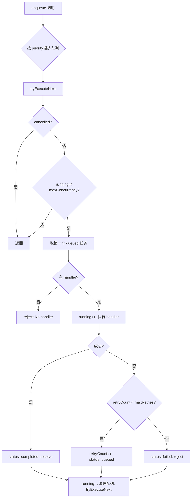
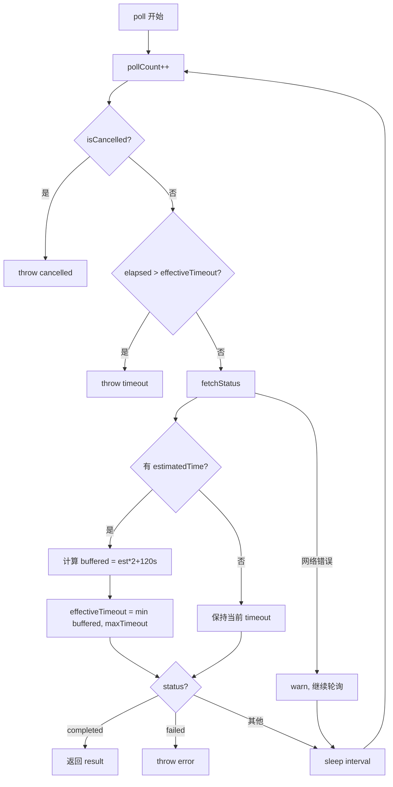

# PD-483.01 moyin-creator — 双层异步轮询与优先级任务队列

> 文档编号：PD-483.01
> 来源：moyin-creator `src/packages/ai-core/api/task-poller.ts`, `src/packages/ai-core/api/task-queue.ts`
> GitHub：https://github.com/MemeCalculate/moyin-creator.git
> 问题域：PD-483 异步任务轮询 Async Task Polling
> 状态：可复用方案

---

## 第 1 章 问题与动机（≥ 30 行）

### 1.1 核心问题

AI 媒体生成（图片、视频）通常是异步 API：客户端提交任务后获得 taskId，需要反复轮询直到任务完成或失败。在 moyin-creator 这样的多场景剧本生成器中，一个剧本可能包含 5-10 个场景，每个场景需要依次生成图片和视频，产生大量并发异步任务。

核心挑战：
1. **轮询生命周期管理** — 何时开始、多久轮询一次、何时超时、如何取消
2. **并发控制** — 多个场景同时生成时，如何限制并发数避免 API 限流
3. **优先级调度** — 不同类型任务（screenplay/image/video）优先级不同
4. **动态超时** — 视频生成比图片慢得多，超时策略需要自适应
5. **网络容错** — 轮询过程中的网络错误不应终止整个任务

### 1.2 moyin-creator 的解法概述

moyin-creator 采用**双层架构**解决异步任务管理：

1. **TaskQueue（任务队列层）** — 管理多个任务的排队、优先级排序和并发控制，内置重试机制（`task-queue.ts:26-152`）
2. **TaskPoller（轮询层）** — 单个异步任务的状态轮询，支持动态超时扩展和网络错误容忍（`task-poller.ts:24-139`）
3. **Web Worker 集成** — 整个 AI 生成流水线运行在 Web Worker 中，通过 postMessage 与主线程通信（`ai-worker.ts:84-130`）
4. **Provider 接口标准化** — ImageProvider/VideoProvider 统一定义 `generateImage` + `pollImageTask` 的提交-轮询接口（`providers/types.ts:45-70`）
5. **双实现轮询** — ai-worker 中的 `pollTaskCompletion` 和 storyboard-service 中的同名函数分别处理不同 API 后端的轮询逻辑

### 1.3 设计思想

| 设计原则 | 具体实现 | 理由 | 替代方案 |
|----------|----------|------|----------|
| 关注点分离 | TaskQueue 管并发，TaskPoller 管轮询 | 队列调度和轮询逻辑是正交关注点 | 单一类同时管理队列和轮询（耦合度高） |
| 动态并发 | `getMaxConcurrency` 是函数而非常量 | 允许运行时调整并发数（如根据 API 配额） | 固定并发数（不灵活） |
| 优先级插入 | `enqueue` 时按 priority 二分插入 | 高优先级任务（如用户正在预览的场景）优先执行 | FIFO 队列（无法区分紧急程度） |
| 动态超时 | 根据服务端 `estimatedTime` 自动延长超时 | 视频生成时间不可预测，固定超时会误杀 | 固定超时（视频任务频繁超时） |
| 网络容错 | 轮询中网络错误只 warn 不 throw | 临时网络抖动不应终止长时间运行的生成任务 | 网络错误立即失败（脆弱） |
| Promise 封装 | `enqueue` 返回 Promise，内部存储 resolve/reject | 调用方用 await 即可，无需关心队列内部状态 | 回调模式或事件模式（使用复杂） |

---

## 第 2 章 源码实现分析（≥ 60 行，核心章节）

### 2.1 架构概览

moyin-creator 的异步任务系统分为三层：

```
┌─────────────────────────────────────────────────────────┐
│                    Main Thread (UI)                       │
│  ┌──────────────┐    postMessage     ┌───────────────┐  │
│  │ Screenplay   │ ──────────────────→│  AI Worker    │  │
│  │ Store (Pinia)│ ←──────────────────│  (Web Worker) │  │
│  └──────────────┘    WorkerEvent     └───────┬───────┘  │
│                                              │          │
└──────────────────────────────────────────────┼──────────┘
                                               │
                    ┌──────────────────────────┼──────────────┐
                    │         AI Core Package                  │
                    │                                          │
                    │  ┌──────────────┐  ┌─────────────────┐  │
                    │  │  TaskQueue   │  │   TaskPoller     │  │
                    │  │ (并发+优先级) │  │ (轮询+动态超时)  │  │
                    │  └──────┬───────┘  └────────┬────────┘  │
                    │         │                   │            │
                    │         ▼                   ▼            │
                    │  ┌──────────────────────────────────┐   │
                    │  │  Provider Interface               │   │
                    │  │  generateImage → taskId           │   │
                    │  │  pollImageTask → AsyncTaskResult   │   │
                    │  └──────────────────────────────────┘   │
                    └─────────────────────────────────────────┘
```

### 2.2 核心实现

#### TaskQueue：优先级并发队列



对应源码 `src/packages/ai-core/api/task-queue.ts:48-112`：

```typescript
enqueue<T, R>(
  task: Omit<TaskItem<T>, 'status' | 'resolve' | 'reject' | 'createdAt'>
): Promise<R> {
  return new Promise((resolve, reject) => {
    const fullTask: TaskItem<T> = {
      ...task,
      status: 'queued',
      createdAt: Date.now(),
      resolve: resolve as (result: unknown) => void,
      reject,
    };
    // Insert by priority (higher priority first)
    const idx = this.queue.findIndex(t => t.priority < fullTask.priority);
    if (idx === -1) {
      this.queue.push(fullTask as TaskItem);
    } else {
      this.queue.splice(idx, 0, fullTask as TaskItem);
    }
    this.tryExecuteNext();
  });
}

private async tryExecuteNext(): Promise<void> {
  if (this.cancelled) return;
  if (this.running >= this.getMaxConcurrency()) return;
  const task = this.queue.find(t => t.status === 'queued');
  if (!task) return;
  const handler = this.handlers.get(task.type);
  if (!handler) {
    task.status = 'failed';
    task.reject(new Error(`No handler registered for task type: ${task.type}`));
    this.tryExecuteNext();
    return;
  }
  this.running++;
  task.status = 'running';
  try {
    const result = await handler(task);
    task.status = 'completed';
    task.resolve(result);
  } catch (e) {
    const error = e as Error;
    if (task.retryCount < task.maxRetries) {
      task.retryCount++;
      task.status = 'queued';
    } else {
      task.status = 'failed';
      task.reject(error);
    }
  } finally {
    this.running--;
    this.queue = this.queue.filter(t => t.status === 'queued' || t.status === 'running');
    this.tryExecuteNext();
  }
}
```

关键设计点：
- **Promise 内嵌 resolve/reject**（`task-queue.ts:51-58`）：将 Promise 的控制权存入 TaskItem，使得队列可以在任意时刻 resolve 或 reject 任务
- **优先级插入排序**（`task-queue.ts:61-66`）：`findIndex` 找到第一个优先级更低的位置插入，保持队列有序
- **自驱动调度**（`task-queue.ts:111`）：`finally` 块中递归调用 `tryExecuteNext`，任务完成后自动拉取下一个

#### TaskPoller：动态超时轮询器



对应源码 `src/packages/ai-core/api/task-poller.ts:33-120`：

```typescript
async poll(
  taskId: string,
  type: 'image' | 'video',
  options: PollOptions
): Promise<AsyncTaskResult> {
  const { fetchStatus, onProgress, isCancelled,
    interval = this.defaultInterval,
    timeout = this.defaultTimeout,
  } = options;
  const startTime = Date.now();
  let effectiveTimeout = timeout;
  let pollCount = 0;

  while (true) {
    pollCount++;
    if (isCancelled?.()) throw new Error('Task cancelled');
    const elapsed = Date.now() - startTime;
    if (elapsed > effectiveTimeout) {
      throw new Error(`${type} generation timeout after ${Math.floor(effectiveTimeout / 60000)} minutes`);
    }
    try {
      const result = await fetchStatus();
      onProgress?.(result.progress ?? 0, result.status);
      // Dynamic timeout adjustment
      if (result.estimatedTime && result.estimatedTime > 0) {
        const buffered = (result.estimatedTime * 2 + 120) * 1000;
        const newTimeout = Math.min(buffered, this.maxTimeout);
        if (newTimeout > effectiveTimeout) {
          effectiveTimeout = newTimeout;
        }
      }
      if (result.status === 'completed') return result;
      if (result.status === 'failed') throw new Error(result.error || 'Task failed');
    } catch (e) {
      const error = e as Error;
      if (error.message.includes('cancelled') || 
          error.message.includes('timeout') ||
          error.message.includes('Task failed')) {
        throw error;
      }
      // Network errors: continue polling
      console.warn(`[TaskPoller] Network error on poll #${pollCount}, will retry:`, error.message);
    }
    await this.sleep(interval);
  }
}
```

### 2.3 实现细节

#### 双实现轮询策略

moyin-creator 存在两套轮询实现，服务于不同场景：

| 实现 | 文件 | 特点 |
|------|------|------|
| TaskPoller 类 | `api/task-poller.ts:24` | 通用轮询器，动态超时，注入式 fetchStatus |
| pollTaskCompletion 函数 | `ai-worker.ts:328` | Worker 内联实现，固定间隔 2s，按类型区分最大尝试次数 |
| pollTaskCompletion 函数 | `storyboard-service.ts:242` | 服务层实现，状态映射表兼容多 API 后端 |

Worker 中的 `pollTaskCompletion`（`ai-worker.ts:335-338`）按任务类型设置不同的最大尝试次数：
- 图片：60 次 × 2s = 120s
- 视频：120 次 × 2s = 240s

storyboard-service 中的实现（`storyboard-service.ts:290-302`）使用状态映射表兼容不同 API 后端返回的状态字符串：
```typescript
const statusMap: Record<string, string> = {
  'pending': 'pending', 'submitted': 'pending', 'queued': 'pending',
  'processing': 'processing', 'running': 'processing', 'in_progress': 'processing',
  'completed': 'completed', 'succeeded': 'completed', 'success': 'completed',
  'failed': 'failed', 'error': 'failed',
};
```

#### Web Worker 批量执行与并发控制

`ai-worker.ts:601-622` 中的 `handleExecuteScreenplay` 使用分批并行策略：

```typescript
for (let i = 0; i < scenes.length; i += concurrency) {
  if (cancelled) break;
  const batch = scenes.slice(i, i + concurrency);
  await Promise.allSettled(
    batch.map(async (scene) => {
      await executeSceneInternal(screenplay.id, scene, extendedConfig, ...);
    })
  );
}
```

这是一个**滑动窗口批处理**模式：每批 `concurrency` 个场景并行执行，一批完成后再启动下一批。使用 `Promise.allSettled` 而非 `Promise.all`，确保单个场景失败不会中断整批。

#### 取消机制

取消通过模块级 `cancelled` 标志实现（`ai-worker.ts:80`），在三个层面检查：
1. **轮询循环内**（`ai-worker.ts:339-341`）：每次轮询前检查
2. **场景执行入口**（`ai-worker.ts:413`）：开始执行前检查
3. **批处理循环**（`ai-worker.ts:602`）：每批开始前检查

`handleCancel`（`ai-worker.ts:1178-1186`）设置标志后 100ms 自动重置，允许后续新操作。

---

## 第 3 章 迁移指南（≥ 40 行）

### 3.1 迁移清单

**阶段 1：基础轮询器（1 个文件）**
- [ ] 定义 `AsyncTaskResult` 接口（status/progress/resultUrl/error/estimatedTime）
- [ ] 实现 `TaskPoller` 类，支持固定间隔轮询 + 超时
- [ ] 添加动态超时扩展逻辑（基于服务端 estimatedTime）
- [ ] 添加取消检查（isCancelled 回调）
- [ ] 添加网络错误容忍（catch 中区分业务错误和网络错误）

**阶段 2：任务队列（1 个文件）**
- [ ] 实现 `TaskQueue` 类，支持泛型 TaskItem
- [ ] 实现优先级插入排序（findIndex + splice）
- [ ] 实现动态并发控制（getMaxConcurrency 函数注入）
- [ ] 实现内置重试（retryCount/maxRetries）
- [ ] 实现 cancelAll/resume 生命周期方法
- [ ] 实现 getStats/isIdle 监控方法

**阶段 3：Provider 接口标准化（可选）**
- [ ] 定义 ImageProvider/VideoProvider 接口（generateX + pollXTask）
- [ ] 实现状态映射表兼容多 API 后端

### 3.2 适配代码模板

#### 最小可用轮询器（TypeScript）

```typescript
interface AsyncTaskResult {
  status: 'pending' | 'processing' | 'completed' | 'failed';
  progress?: number;
  resultUrl?: string;
  error?: string;
  estimatedTime?: number; // 服务端预估剩余秒数
}

interface PollOptions {
  fetchStatus: () => Promise<AsyncTaskResult>;
  onProgress?: (progress: number, status: string) => void;
  isCancelled?: () => boolean;
  interval?: number;
  timeout?: number;
}

class TaskPoller {
  private defaultInterval = 3000;
  private defaultTimeout = 600_000;  // 10 min
  private maxTimeout = 1_800_000;    // 30 min cap

  async poll(taskId: string, options: PollOptions): Promise<AsyncTaskResult> {
    const {
      fetchStatus, onProgress, isCancelled,
      interval = this.defaultInterval,
      timeout = this.defaultTimeout,
    } = options;

    const startTime = Date.now();
    let effectiveTimeout = timeout;

    while (true) {
      if (isCancelled?.()) throw new Error('Task cancelled');
      if (Date.now() - startTime > effectiveTimeout) {
        throw new Error(`Task ${taskId} timed out`);
      }

      try {
        const result = await fetchStatus();
        onProgress?.(result.progress ?? 0, result.status);

        // 动态超时：服务端预估时间 × 2 + 2分钟缓冲
        if (result.estimatedTime && result.estimatedTime > 0) {
          const buffered = (result.estimatedTime * 2 + 120) * 1000;
          effectiveTimeout = Math.max(effectiveTimeout, Math.min(buffered, this.maxTimeout));
        }

        if (result.status === 'completed') return result;
        if (result.status === 'failed') throw new Error(result.error || 'Task failed');
      } catch (e) {
        const err = e as Error;
        // 业务错误直接抛出，网络错误继续轮询
        if (err.message.includes('cancelled') || err.message.includes('timed out') || err.message.includes('Task failed')) {
          throw err;
        }
      }

      await new Promise(r => setTimeout(r, interval));
    }
  }
}
```

#### 最小可用优先级队列（TypeScript）

```typescript
interface TaskItem<T = unknown> {
  id: string;
  type: string;
  priority: number;
  payload: T;
  status: 'queued' | 'running' | 'completed' | 'failed';
  retryCount: number;
  maxRetries: number;
  resolve: (result: unknown) => void;
  reject: (error: Error) => void;
}

class TaskQueue {
  private queue: TaskItem[] = [];
  private running = 0;
  private handlers = new Map<string, (task: TaskItem) => Promise<unknown>>();

  constructor(private getMaxConcurrency: () => number) {}

  setHandler(type: string, handler: (task: TaskItem) => Promise<unknown>) {
    this.handlers.set(type, handler);
  }

  enqueue<T>(task: Omit<TaskItem<T>, 'status' | 'resolve' | 'reject'>): Promise<unknown> {
    return new Promise((resolve, reject) => {
      const full = { ...task, status: 'queued' as const, resolve, reject };
      const idx = this.queue.findIndex(t => t.priority < full.priority);
      idx === -1 ? this.queue.push(full as TaskItem) : this.queue.splice(idx, 0, full as TaskItem);
      this.drain();
    });
  }

  private async drain() {
    if (this.running >= this.getMaxConcurrency()) return;
    const task = this.queue.find(t => t.status === 'queued');
    if (!task) return;
    const handler = this.handlers.get(task.type);
    if (!handler) { task.reject(new Error(`No handler: ${task.type}`)); return; }

    this.running++;
    task.status = 'running';
    try {
      task.resolve(await handler(task));
      task.status = 'completed';
    } catch (e) {
      if (task.retryCount < task.maxRetries) {
        task.retryCount++;
        task.status = 'queued';
      } else {
        task.status = 'failed';
        task.reject(e as Error);
      }
    } finally {
      this.running--;
      this.queue = this.queue.filter(t => t.status === 'queued' || t.status === 'running');
      this.drain();
    }
  }
}
```

### 3.3 适用场景

| 场景 | 适用度 | 说明 |
|------|--------|------|
| AI 图片/视频生成 API | ⭐⭐⭐ | 完美匹配：提交-轮询-获取模式 |
| 批量文档处理（OCR、翻译） | ⭐⭐⭐ | 多任务并发 + 轮询等待 |
| CI/CD 流水线状态追踪 | ⭐⭐ | 轮询适用，但通常有 webhook 替代 |
| 实时聊天/流式响应 | ⭐ | 不适用，应使用 SSE/WebSocket |
| 同步 API 调用 | ⭐ | 不需要轮询 |

---

## 第 4 章 测试用例（≥ 20 行）

```typescript
import { describe, it, expect, vi, beforeEach } from 'vitest';

// ==================== TaskPoller Tests ====================

describe('TaskPoller', () => {
  let poller: TaskPoller;

  beforeEach(() => {
    poller = new TaskPoller();
  });

  it('should return result on completed status', async () => {
    const fetchStatus = vi.fn().mockResolvedValue({
      status: 'completed',
      progress: 100,
      resultUrl: 'https://example.com/result.png',
    });

    const result = await poller.poll('task-1', 'image', { fetchStatus });
    expect(result.status).toBe('completed');
    expect(result.resultUrl).toBe('https://example.com/result.png');
    expect(fetchStatus).toHaveBeenCalledTimes(1);
  });

  it('should poll multiple times until completed', async () => {
    const fetchStatus = vi.fn()
      .mockResolvedValueOnce({ status: 'pending', progress: 0 })
      .mockResolvedValueOnce({ status: 'processing', progress: 50 })
      .mockResolvedValueOnce({ status: 'completed', progress: 100, resultUrl: 'url' });

    const result = await poller.poll('task-2', 'image', { fetchStatus, interval: 10 });
    expect(result.status).toBe('completed');
    expect(fetchStatus).toHaveBeenCalledTimes(3);
  });

  it('should throw on failed status', async () => {
    const fetchStatus = vi.fn().mockResolvedValue({
      status: 'failed',
      error: 'GPU out of memory',
    });

    await expect(poller.poll('task-3', 'image', { fetchStatus }))
      .rejects.toThrow('GPU out of memory');
  });

  it('should throw on timeout', async () => {
    const fetchStatus = vi.fn().mockResolvedValue({ status: 'processing', progress: 10 });

    await expect(poller.poll('task-4', 'image', {
      fetchStatus,
      timeout: 50,
      interval: 20,
    })).rejects.toThrow('timeout');
  });

  it('should extend timeout based on estimatedTime', async () => {
    let callCount = 0;
    const fetchStatus = vi.fn().mockImplementation(async () => {
      callCount++;
      if (callCount === 1) return { status: 'processing', progress: 10, estimatedTime: 300 };
      if (callCount < 5) return { status: 'processing', progress: 50 };
      return { status: 'completed', progress: 100, resultUrl: 'url' };
    });

    const result = await poller.poll('task-5', 'video', {
      fetchStatus,
      timeout: 100,  // 初始超时很短
      interval: 10,
    });
    // 不会超时，因为 estimatedTime=300 会将超时扩展到 (300*2+120)*1000 = 720s
    expect(result.status).toBe('completed');
  });

  it('should respect cancellation', async () => {
    let cancelled = false;
    const fetchStatus = vi.fn().mockResolvedValue({ status: 'processing' });

    setTimeout(() => { cancelled = true; }, 50);

    await expect(poller.poll('task-6', 'image', {
      fetchStatus,
      isCancelled: () => cancelled,
      interval: 10,
    })).rejects.toThrow('cancelled');
  });

  it('should tolerate network errors and continue polling', async () => {
    const fetchStatus = vi.fn()
      .mockRejectedValueOnce(new Error('Network error'))
      .mockRejectedValueOnce(new Error('ECONNRESET'))
      .mockResolvedValueOnce({ status: 'completed', progress: 100, resultUrl: 'url' });

    const result = await poller.poll('task-7', 'image', { fetchStatus, interval: 10 });
    expect(result.status).toBe('completed');
    expect(fetchStatus).toHaveBeenCalledTimes(3);
  });
});

// ==================== TaskQueue Tests ====================

describe('TaskQueue', () => {
  let queue: TaskQueue;

  beforeEach(() => {
    queue = new TaskQueue(() => 2); // max 2 concurrent
  });

  it('should execute tasks and resolve promises', async () => {
    queue.setHandler('image', async (task) => `result-${task.id}`);

    const result = await queue.enqueue({
      id: 'img-1', type: 'image', priority: 1,
      payload: {}, retryCount: 0, maxRetries: 3,
    });
    expect(result).toBe('result-img-1');
  });

  it('should respect priority ordering', async () => {
    const order: string[] = [];
    queue = new TaskQueue(() => 1); // serial execution
    queue.setHandler('image', async (task) => {
      order.push(task.id);
      return task.id;
    });

    // Enqueue low priority first, then high priority
    const p1 = queue.enqueue({ id: 'low', type: 'image', priority: 1, payload: {}, retryCount: 0, maxRetries: 0 });
    const p2 = queue.enqueue({ id: 'high', type: 'image', priority: 10, payload: {}, retryCount: 0, maxRetries: 0 });

    await Promise.all([p1, p2]);
    // 'low' starts first (already running), 'high' executes next
    expect(order[0]).toBe('low'); // was already picked up
    expect(order[1]).toBe('high');
  });

  it('should retry failed tasks', async () => {
    let attempts = 0;
    queue.setHandler('image', async () => {
      attempts++;
      if (attempts < 3) throw new Error('Transient error');
      return 'success';
    });

    const result = await queue.enqueue({
      id: 'retry-1', type: 'image', priority: 1,
      payload: {}, retryCount: 0, maxRetries: 3,
    });
    expect(result).toBe('success');
    expect(attempts).toBe(3);
  });

  it('should reject after max retries exhausted', async () => {
    queue.setHandler('image', async () => { throw new Error('Permanent error'); });

    await expect(queue.enqueue({
      id: 'fail-1', type: 'image', priority: 1,
      payload: {}, retryCount: 0, maxRetries: 2,
    })).rejects.toThrow('Permanent error');
  });

  it('should cancel pending tasks', async () => {
    queue = new TaskQueue(() => 0); // block all execution
    queue.setHandler('image', async () => 'done');

    const promise = queue.enqueue({
      id: 'cancel-1', type: 'image', priority: 1,
      payload: {}, retryCount: 0, maxRetries: 0,
    });

    queue.cancelAll();
    await expect(promise).rejects.toThrow('Task cancelled');
  });

  it('should report correct stats', () => {
    queue.setHandler('image', async () => new Promise(() => {})); // never resolves
    queue.enqueue({ id: 's1', type: 'image', priority: 1, payload: {}, retryCount: 0, maxRetries: 0 });
    queue.enqueue({ id: 's2', type: 'image', priority: 1, payload: {}, retryCount: 0, maxRetries: 0 });
    queue.enqueue({ id: 's3', type: 'image', priority: 1, payload: {}, retryCount: 0, maxRetries: 0 });

    const stats = queue.getStats();
    expect(stats.running).toBe(2);  // maxConcurrency = 2
    expect(stats.queued).toBe(1);
    expect(stats.maxConcurrency).toBe(2);
  });
});
```

---

## 第 5 章 跨域关联

| 关联域 | 关系类型 | 说明 |
|--------|----------|------|
| PD-03 容错与重试 | 依赖 | TaskQueue 的 retryCount/maxRetries 机制是容错的具体实现；TaskPoller 的网络错误容忍也是容错策略 |
| PD-02 多 Agent 编排 | 协同 | TaskQueue 的并发控制和优先级调度可作为多 Agent 任务分发的底层基础设施 |
| PD-11 可观测性 | 协同 | TaskPoller 的 pollCount 日志和 TaskQueue 的 getStats 提供了任务级可观测性数据 |
| PD-10 中间件管道 | 协同 | TaskQueue 的 handler 注册模式类似中间件管道的处理器注册，可扩展为管道式任务处理 |
| PD-04 工具系统 | 协同 | Provider 接口（generateImage + pollImageTask）是工具系统的一种实现，标准化了异步工具的调用协议 |

---

## 第 6 章 来源文件索引

| 文件 | 行范围 | 关键实现 |
|------|--------|----------|
| `src/packages/ai-core/api/task-queue.ts` | L9-L22 | TaskItem 接口定义（4 态状态机 + 优先级 + 重试计数） |
| `src/packages/ai-core/api/task-queue.ts` | L26-L152 | TaskQueue 类完整实现（优先级插入 + 并发控制 + 自驱动调度） |
| `src/packages/ai-core/api/task-queue.ts` | L48-L69 | enqueue 方法：Promise 封装 + 优先级排序插入 |
| `src/packages/ai-core/api/task-queue.ts` | L75-L112 | tryExecuteNext：并发检查 + handler 分发 + 重试逻辑 |
| `src/packages/ai-core/api/task-queue.ts` | L118-L126 | cancelAll：批量取消 pending 任务 |
| `src/packages/ai-core/api/task-poller.ts` | L10-L22 | PollOptions 接口（fetchStatus 注入 + 动态超时参数） |
| `src/packages/ai-core/api/task-poller.ts` | L24-L139 | TaskPoller 类完整实现（动态超时 + 网络容错 + 取消检查） |
| `src/packages/ai-core/api/task-poller.ts` | L76-L84 | 动态超时扩展逻辑（estimatedTime × 2 + 120s，上限 30min） |
| `src/packages/ai-core/api/task-poller.ts` | L103-L115 | 错误分类：业务错误 throw vs 网络错误 warn+continue |
| `src/packages/ai-core/types/index.ts` | L157-L163 | AsyncTaskResult 接口（5 字段标准化异步任务结果） |
| `src/packages/ai-core/providers/types.ts` | L45-L70 | ImageProvider/VideoProvider 接口（提交+轮询双方法标准） |
| `src/packages/ai-core/providers/types.ts` | L111-L114 | TaskSubmitResult 接口（taskId + estimatedTime） |
| `src/workers/ai-worker.ts` | L76-L77 | TaskPoller 实例化（Worker 全局单例） |
| `src/workers/ai-worker.ts` | L219-L268 | generateImage：提交-轮询-获取完整流程 |
| `src/workers/ai-worker.ts` | L328-L394 | pollTaskCompletion：Worker 内联轮询（按类型区分超时） |
| `src/workers/ai-worker.ts` | L601-L622 | handleExecuteScreenplay：滑动窗口批处理 + Promise.allSettled |
| `src/lib/storyboard/storyboard-service.ts` | L242-L359 | pollTaskCompletion：状态映射表兼容多 API 后端 |
| `src/lib/storyboard/storyboard-service.ts` | L290-L302 | statusMap：11 种 API 状态字符串映射到 4 种标准状态 |

---

## 第 7 章 横向对比维度

> **重要：** 本章用于自动填充 Butcher Wiki 的横向对比表。

```json comparison_data
{
  "project": "moyin-creator",
  "dimensions": {
    "轮询策略": "固定间隔轮询（2-3s），TaskPoller 支持动态超时扩展",
    "并发控制": "TaskQueue 优先级队列 + 动态 maxConcurrency 函数注入",
    "超时机制": "三级超时：默认10min / estimatedTime×2+2min / 硬上限30min",
    "重试策略": "TaskQueue 内置 retryCount/maxRetries，TaskPoller 网络错误自动重试",
    "取消机制": "模块级 cancelled 标志 + TaskQueue.cancelAll 批量取消",
    "状态模型": "TaskItem 4态（queued/running/completed/failed）+ AsyncTaskResult 4态",
    "Worker隔离": "整个 AI 流水线运行在 Web Worker 中，postMessage 通信",
    "多后端兼容": "storyboard-service 状态映射表兼容 11 种 API 状态字符串"
  }
}
```

### 域元数据补充

```json domain_metadata
{
  "solution_summary": "moyin-creator 用 TaskQueue 优先级队列管理并发 + TaskPoller 动态超时轮询器，双层架构分离调度与轮询关注点，在 Web Worker 中运行 AI 生成流水线",
  "description": "异步任务的双层架构：队列层管并发调度，轮询层管状态追踪",
  "sub_problems": [
    "多 API 后端状态字符串归一化映射",
    "Web Worker 中的任务生命周期与主线程通信",
    "批量场景的滑动窗口并发执行"
  ],
  "best_practices": [
    "Promise 内嵌 resolve/reject 实现队列到调用方的透明等待",
    "动态超时基于服务端 estimatedTime 自适应扩展",
    "网络错误与业务错误分类处理避免误杀长任务"
  ]
}
```
