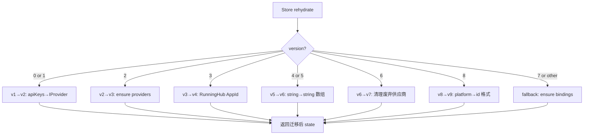
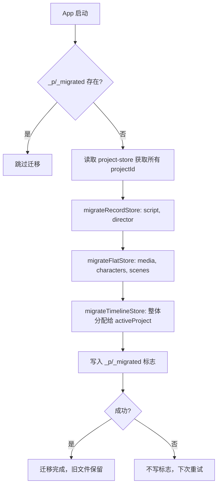

# PD-484.01 moyin-creator — Zustand 双层版本迁移链与 Monolith→Per-Project 拆分恢复

> 文档编号：PD-484.01
> 来源：moyin-creator `src/stores/api-config-store.ts`, `src/lib/storage-migration.ts`
> GitHub：https://github.com/MemeCalculate/moyin-creator.git
> 问题域：PD-484 Store 版本迁移 Store Version Migration
> 状态：可复用方案

---

## 第 1 章 问题与动机

### 1.1 核心问题

Electron + Web 混合应用的持久化状态在产品迭代中不可避免地面临 schema 变更：供应商被废弃需要清理、单选字段升级为多选、标识符格式从 `platform:model` 变为 `id:model`、甚至整个存储拓扑从单体文件拆分为 per-project 目录。如果没有版本化迁移机制，用户升级后要么丢失配置，要么遇到运行时崩溃。

moyin-creator 面临的具体挑战：
1. **API 配置 store 经历 9 个版本**（v1→v9），每个版本对应不同的 schema 变更
2. **存储拓扑迁移**：从 localStorage/IndexedDB 单体文件迁移到 Electron 文件系统的 `_p/{projectId}/` 目录结构
3. **迁移后数据恢复**：`switchProject()` 的竞态 bug 导致 per-project 文件被空数据覆盖，需要从旧单体文件恢复

### 1.2 moyin-creator 的解法概述

1. **Zustand persist middleware 内置迁移链**：利用 `version` + `migrate` 回调，在 store rehydrate 时自动执行 v1→v9 的链式迁移（`api-config-store.ts:863-1149`）
2. **独立的存储拓扑迁移模块**：`storage-migration.ts` 在 App 启动时将单体 JSON 拆分为 per-project 文件，使用幂等标志位 `_p/_migrated` 防止重复执行（`storage-migration.ts:17-103`）
3. **数据恢复机制**：`recoverFromLegacy()` 在每次启动时对比 per-project 文件与旧单体文件的"丰富度"，自动恢复被竞态 bug 覆盖的数据（`storage-migration.ts:254-362`）
4. **三源优先级存储适配器**：`indexed-db-storage.ts` 在 getItem 时自动比较 file/localStorage/IndexedDB 三个数据源，选择最丰富的并迁移到目标存储（`indexed-db-storage.ts:62-124`）
5. **Project-scoped 路由存储**：`project-storage.ts` 提供 `createProjectScopedStorage` 和 `createSplitStorage` 两种适配器，将 Zustand persist 的读写路由到正确的 per-project 路径（`project-storage.ts:61-145`）

### 1.3 设计思想

| 设计原则 | 具体实现 | 理由 | 替代方案 |
|----------|----------|------|----------|
| 版本号单调递增 | `version: 9` + `migrate(state, version)` 分支 | Zustand persist 原生支持，零额外依赖 | 自建迁移注册表 |
| 每版本独立迁移函数 | `if (version === N)` 分支各自处理 | 隔离变更影响，单版本 bug 不扩散 | 累积式 transform |
| 幂等拓扑迁移 | `_p/_migrated` 标志位 + try/catch 不写标志 | 失败可重试，成功不重复 | 版本号文件 |
| 丰富度比较恢复 | `isScriptDataRich()` / `isDirectorDataRich()` | 精确判断数据是否有意义，避免误恢复 | 时间戳比较 |
| 旧文件保留 | 迁移后不删除旧文件，作为 fallback | 最大安全性，可手动回滚 | 迁移后删除 |

---

## 第 2 章 源码实现分析

### 2.1 架构概览

moyin-creator 的版本迁移分为两个独立层次：

```
┌─────────────────────────────────────────────────────────┐
│                    App.tsx (启动入口)                      │
│  useEffect → migrateToProjectStorage() → recoverFromLegacy() │
└──────────────────────┬──────────────────────────────────┘
                       │ 1. 拓扑迁移（一次性）
                       ▼
┌─────────────────────────────────────────────────────────┐
│           storage-migration.ts (Layer 1)                 │
│  单体 JSON → _p/{pid}/store.json + _shared/store.json    │
│  幂等标志: _p/_migrated                                   │
│  恢复: recoverFromLegacy() 对比丰富度                      │
└──────────────────────┬──────────────────────────────────┘
                       │ 2. Schema 迁移（每次 rehydrate）
                       ▼
┌─────────────────────────────────────────────────────────┐
│        api-config-store.ts persist.migrate (Layer 2)     │
│  v0/v1 → v2: apiKeys → IProvider[]                       │
│  v2 → v3: 确保 providers + featureBindings 存在            │
│  v3 → v4: RunningHub model 修正为 AppId                   │
│  v4/v5 → v6: string → string[] (单选→多选)                │
│  v6 → v7: 清理废弃供应商 (dik3, nanohajimi, apimart, zhipu)│
│  v8 → v9: platform:model → id:model 格式转换              │
└─────────────────────────────────────────────────────────┘
                       │
                       ▼
┌─────────────────────────────────────────────────────────┐
│     indexed-db-storage.ts + project-storage.ts           │
│  三源优先级: localStorage > IndexedDB > fileStorage       │
│  路由: createProjectScopedStorage / createSplitStorage    │
└─────────────────────────────────────────────────────────┘
```

### 2.2 核心实现

#### 2.2.1 Zustand persist 版本迁移链



对应源码 `src/stores/api-config-store.ts:863-1149`：

```typescript
// Zustand persist 配置 — 版本号与迁移入口
{
  name: 'opencut-api-config',  // localStorage key
  version: 9,  // v9: convert platform:model bindings to id:model
  migrate: (persistedState: unknown, version: number) => {
    const state = persistedState as Partial<APIConfigState> & { imageHostConfig?: LegacyImageHostConfig };
    console.log(`[APIConfig] Migrating from version ${version}`);

    // v1 -> v2: Migrate apiKeys to providers
    if (version === 1 || version === 0) {
      const oldApiKeys = state?.apiKeys || {};
      const providers: IProvider[] = [];
      for (const template of DEFAULT_PROVIDERS) {
        const existingKey = oldApiKeys[template.platform as ProviderId] || '';
        providers.push({ id: generateId(), ...template, apiKey: existingKey });
      }
      return { ...state, providers, featureBindings: defaultBindings, apiKeys: oldApiKeys };
    }

    // v6 -> v7: Remove deprecated providers
    if (version === 6) {
      const DEPRECATED_PLATFORMS = ['dik3', 'nanohajimi', 'apimart', 'zhipu'];
      const cleanedProviders = (state?.providers || []).filter(
        (p: IProvider) => !DEPRECATED_PLATFORMS.includes(p.platform)
      );
      // 同时清理引用废弃供应商的 featureBindings
      const cleanedBindings: FeatureBindings = { ...defaultBindings };
      for (const [key, value] of Object.entries(state?.featureBindings || {})) {
        if (Array.isArray(value)) {
          const filtered = value.filter(
            (b: string) => !DEPRECATED_PLATFORMS.some((dp) => b.startsWith(dp + ':'))
          );
          cleanedBindings[key as AIFeature] = filtered.length > 0 ? filtered : null;
        }
      }
      return { ...state, providers: cleanedProviders, featureBindings: cleanedBindings };
    }

    // v8 -> v9: Convert platform:model → id:model
    if (version === 8) {
      const providers: IProvider[] = state?.providers || [];
      const newBindings: FeatureBindings = { ...defaultBindings };
      for (const [key, value] of Object.entries(state?.featureBindings || {})) {
        if (!Array.isArray(value)) continue;
        const converted: string[] = [];
        for (const binding of value) {
          const idx = binding.indexOf(':');
          const platformOrId = binding.slice(0, idx);
          const model = binding.slice(idx + 1);
          // 已经是 id:model 格式？
          if (providers.some(p => p.id === platformOrId)) { converted.push(binding); continue; }
          // platform:model → 查找唯一匹配的 provider
          const matches = providers.filter(p => p.platform === platformOrId);
          if (matches.length === 1) {
            converted.push(`${matches[0].id}:${model}`);  // 无歧义转换
          }
          // 多个匹配 → 丢弃（用户需手动重新绑定）
        }
        newBindings[key as AIFeature] = converted.length > 0 ? converted : null;
      }
      return { ...state, featureBindings: newBindings };
    }
    // ... 其他版本分支
  },
}
```

#### 2.2.2 存储拓扑迁移（Monolith → Per-Project）



对应源码 `src/lib/storage-migration.ts:23-103`：

```typescript
export async function migrateToProjectStorage(): Promise<void> {
  if (!window.fileStorage) return;  // 仅 Electron 环境

  // 幂等检查
  try {
    const flagExists = await window.fileStorage.exists(MIGRATION_FLAG_KEY);
    if (flagExists) { console.log('[Migration] Already migrated, skipping.'); return; }
  } catch {
    const flag = await fileStorage.getItem(MIGRATION_FLAG_KEY);
    if (flag) return;
  }

  try {
    const projectStoreRaw = await fileStorage.getItem('moyin-project-store');
    const projectState = JSON.parse(projectStoreRaw).state ?? JSON.parse(projectStoreRaw);
    const projectIds: string[] = (projectState.projects ?? []).map((p: any) => p.id);

    // Record-based stores: 按 projects[pid] 键拆分
    await migrateRecordStore('moyin-script-store', 'script', projectIds);
    await migrateRecordStore('moyin-director-store', 'director', projectIds);

    // Flat-array stores: 按 item.projectId 过滤 + shared 分离
    await migrateFlatStore('moyin-media-store', 'media', projectIds, {
      arrayKeys: ['mediaFiles', 'folders'],
      projectIdField: 'projectId',
      sharedFilter: (item, key) => key === 'folders' ? item.isSystem || !item.projectId : !item.projectId,
    });

    // Timeline: 无 projectId，整体分配给 activeProject
    await migrateTimelineStore(projectState.activeProjectId || projectIds[0]);

    await writeMigrationFlag();  // 成功才写标志
  } catch (error) {
    console.error('[Migration] ❌ Migration failed:', error);
    // 不写标志 — 下次启动重试
  }
}
```

### 2.3 实现细节

#### 数据恢复：竞态 bug 的事后修复

`switchProject()` 存在一个竞态 bug：在 `setActiveProjectId()` 之后、`rehydrate()` 之前，Zustand persist 会触发一次写入，将空/默认数据覆盖到新项目的 per-project 文件中。

`recoverFromLegacy()` 的修复策略（`storage-migration.ts:254-362`）：
- 每次启动都运行（快速：只在需要时读取和比较）
- 对比 per-project 文件与旧单体文件中同一 projectId 的数据
- 使用 `isScriptDataRich()` / `isDirectorDataRich()` 判断数据是否有意义内容
- 如果旧文件更丰富，覆盖 per-project 文件

```typescript
// storage-migration.ts:279-286
function isScriptDataRich(data: any): boolean {
  if (!data) return false;
  if (data.rawScript && data.rawScript.length > 10) return true;
  if (data.shots && data.shots.length > 0) return true;
  if (data.scriptData && data.scriptData.episodes && data.scriptData.episodes.length > 0) return true;
  return false;
}
```

#### 三源优先级存储适配器

`indexed-db-storage.ts:62-124` 在 Electron 环境下实现了三源数据竞争：

| 优先级 | 数据源 | 条件 |
|--------|--------|------|
| 1 | localStorage | `hasRichData(localData) && !hasRichData(fileData)` → 迁移到 file |
| 2 | IndexedDB | `hasRichData(idbData) && !hasRichData(fileData) && !hasRichData(localData)` → 迁移到 file |
| 3 | fileStorage | 默认源，清理其他两个源的残留 |


---

## 第 3 章 迁移指南

### 3.1 迁移清单

**阶段 1：基础版本迁移（1-2 天）**
- [ ] 在 Zustand persist 配置中添加 `version` 和 `migrate` 字段
- [ ] 为每个 schema 变更创建独立的 `if (version === N)` 分支
- [ ] 确保每个分支返回完整的 state 对象（spread 旧 state + 覆盖变更字段）
- [ ] 添加 `console.log` 记录迁移版本号，便于调试

**阶段 2：废弃字段清理（0.5 天）**
- [ ] 定义废弃项列表（如 `DEPRECATED_PLATFORMS`）
- [ ] 在迁移函数中过滤 providers 数组和 featureBindings 引用
- [ ] 保留旧字段（如 `apiKeys`）用于向后兼容

**阶段 3：存储拓扑迁移（2-3 天，如需要）**
- [ ] 实现幂等标志位检查（如 `_p/_migrated`）
- [ ] 区分 Record-based 和 Flat-array 两种 store 的拆分策略
- [ ] 实现 shared 数据分离（无 projectId 的全局数据）
- [ ] 旧文件保留不删除，作为 fallback
- [ ] 在 App 入口 useEffect 中调用迁移函数

**阶段 4：数据恢复（1 天，如需要）**
- [ ] 实现"丰富度"判断函数（检查关键字段是否有意义内容）
- [ ] 每次启动对比新旧数据源，自动恢复被覆盖的数据

### 3.2 适配代码模板

#### 模板 1：Zustand persist 版本迁移链

```typescript
import { create } from 'zustand';
import { persist } from 'zustand/middleware';

interface MyState {
  items: Array<{ id: string; name: string; tags: string[] }>;
  // v2 新增字段
  settings: { theme: 'light' | 'dark' };
}

const DEPRECATED_ITEMS = ['old-item-1', 'old-item-2'];

export const useMyStore = create<MyState>()(
  persist(
    (set, get) => ({
      items: [],
      settings: { theme: 'light' },
    }),
    {
      name: 'my-store',
      version: 3, // 当前最新版本
      migrate: (persisted: unknown, version: number) => {
        const state = persisted as Partial<MyState>;

        // v0/v1 → v2: 添加 settings 字段
        if (version <= 1) {
          return {
            ...state,
            settings: { theme: 'light' },
          };
        }

        // v2 → v3: 清理废弃项 + tags 从 string 转 string[]
        if (version === 2) {
          const items = (state.items || [])
            .filter(item => !DEPRECATED_ITEMS.includes(item.id))
            .map(item => ({
              ...item,
              tags: typeof (item as any).tags === 'string'
                ? [(item as any).tags]
                : item.tags || [],
            }));
          return { ...state, items };
        }

        return state;
      },
    }
  )
);
```

#### 模板 2：幂等拓扑迁移

```typescript
const MIGRATION_FLAG = '_migrated_v2';

export async function migrateStorageTopology(
  storage: StateStorage,
  getProjectIds: () => string[],
): Promise<void> {
  // 幂等检查
  const flag = await storage.getItem(MIGRATION_FLAG);
  if (flag) return;

  try {
    const projectIds = getProjectIds();
    for (const pid of projectIds) {
      const legacyData = await storage.getItem('my-store');
      if (!legacyData) continue;

      const parsed = JSON.parse(legacyData);
      const projectData = parsed.state?.projects?.[pid];
      if (!projectData) continue;

      await storage.setItem(
        `_p/${pid}/my-store`,
        JSON.stringify({ state: projectData, version: parsed.version ?? 0 })
      );
    }

    // 成功才写标志
    await storage.setItem(MIGRATION_FLAG, JSON.stringify({
      migratedAt: new Date().toISOString(),
      version: 1,
    }));
  } catch (error) {
    console.error('Migration failed, will retry on next startup:', error);
    // 不写标志 — 下次重试
  }
}
```

### 3.3 适用场景

| 场景 | 适用度 | 说明 |
|------|--------|------|
| Electron 桌面应用 store 升级 | ⭐⭐⭐ | 完美匹配：Zustand persist + 文件系统 |
| Web SPA localStorage 迁移 | ⭐⭐⭐ | Zustand persist 的 version/migrate 直接可用 |
| 多租户/多项目数据拆分 | ⭐⭐⭐ | per-project 路由存储模式可直接复用 |
| 移动端 React Native 存储迁移 | ⭐⭐ | 需替换 fileStorage 为 AsyncStorage |
| 后端数据库 schema 迁移 | ⭐ | 思路可借鉴，但工具链不同（用 Flyway/Alembic 更合适） |

---

## 第 4 章 测试用例

```typescript
import { describe, it, expect, vi, beforeEach } from 'vitest';

// ==================== 版本迁移链测试 ====================

// 模拟 migrate 函数（从 api-config-store.ts:864 提取的逻辑）
function migrate(persistedState: any, version: number): any {
  const state = persistedState;
  const defaultBindings = {
    script_analysis: null,
    character_generation: null,
    scene_generation: null,
    video_generation: null,
    image_understanding: null,
    chat: null,
    freedom_image: null,
    freedom_video: null,
  };

  // v1 → v2
  if (version === 1 || version === 0) {
    const oldApiKeys = state?.apiKeys || {};
    const providers = [
      { id: 'p1', platform: 'memefast', name: '魔因API', baseUrl: 'https://memefast.top', apiKey: oldApiKeys['memefast'] || '', model: [] },
    ];
    return { ...state, providers, featureBindings: defaultBindings, apiKeys: oldApiKeys };
  }

  // v5 → v6: string → string[]
  if (version === 5 || version === 4) {
    const oldBindings = state?.featureBindings || {};
    const newBindings = { ...defaultBindings };
    for (const [key, value] of Object.entries(oldBindings)) {
      if (typeof value === 'string' && value) {
        newBindings[key as keyof typeof defaultBindings] = [value];
      } else if (Array.isArray(value)) {
        newBindings[key as keyof typeof defaultBindings] = value;
      }
    }
    return { ...state, featureBindings: newBindings };
  }

  // v6 → v7: 清理废弃供应商
  if (version === 6) {
    const DEPRECATED = ['dik3', 'nanohajimi', 'apimart', 'zhipu'];
    const cleaned = (state?.providers || []).filter(
      (p: any) => !DEPRECATED.includes(p.platform)
    );
    return { ...state, providers: cleaned };
  }

  // v8 → v9: platform:model → id:model
  if (version === 8) {
    const providers = state?.providers || [];
    const newBindings = { ...defaultBindings };
    for (const [key, value] of Object.entries(state?.featureBindings || {})) {
      if (!Array.isArray(value)) continue;
      const converted: string[] = [];
      for (const binding of value) {
        const idx = binding.indexOf(':');
        if (idx <= 0) { converted.push(binding); continue; }
        const platformOrId = binding.slice(0, idx);
        const model = binding.slice(idx + 1);
        if (providers.some((p: any) => p.id === platformOrId)) {
          converted.push(binding);
          continue;
        }
        const matches = providers.filter((p: any) => p.platform === platformOrId);
        if (matches.length === 1) converted.push(`${matches[0].id}:${model}`);
        // 多匹配 → 丢弃
      }
      newBindings[key as keyof typeof defaultBindings] = converted.length > 0 ? converted : null;
    }
    return { ...state, featureBindings: newBindings };
  }

  return state;
}

describe('API Config Store Migration Chain', () => {
  it('v0→v2: should migrate apiKeys to providers', () => {
    const v0State = { apiKeys: { memefast: 'sk-test-key' } };
    const result = migrate(v0State, 0);
    expect(result.providers).toHaveLength(1);
    expect(result.providers[0].platform).toBe('memefast');
    expect(result.providers[0].apiKey).toBe('sk-test-key');
    expect(result.apiKeys).toEqual({ memefast: 'sk-test-key' }); // 保留旧字段
    expect(result.featureBindings.script_analysis).toBeNull();
  });

  it('v5→v6: should convert string bindings to string[]', () => {
    const v5State = {
      featureBindings: {
        script_analysis: 'memefast:deepseek-v3',
        chat: null,
        video_generation: ['memefast:sora-2'],
      },
    };
    const result = migrate(v5State, 5);
    expect(result.featureBindings.script_analysis).toEqual(['memefast:deepseek-v3']);
    expect(result.featureBindings.chat).toBeNull();
    expect(result.featureBindings.video_generation).toEqual(['memefast:sora-2']);
  });

  it('v6→v7: should remove deprecated providers', () => {
    const v6State = {
      providers: [
        { id: 'p1', platform: 'memefast', name: '魔因' },
        { id: 'p2', platform: 'dik3', name: 'Dik3' },
        { id: 'p3', platform: 'zhipu', name: '智谱' },
      ],
    };
    const result = migrate(v6State, 6);
    expect(result.providers).toHaveLength(1);
    expect(result.providers[0].platform).toBe('memefast');
  });

  it('v8→v9: should convert platform:model to id:model', () => {
    const v8State = {
      providers: [
        { id: 'uuid-1', platform: 'memefast', name: '魔因' },
      ],
      featureBindings: {
        script_analysis: ['memefast:deepseek-v3'],
        chat: ['uuid-1:glm-4'],  // 已经是 id 格式
      },
    };
    const result = migrate(v8State, 8);
    expect(result.featureBindings.script_analysis).toEqual(['uuid-1:deepseek-v3']);
    expect(result.featureBindings.chat).toEqual(['uuid-1:glm-4']);
  });

  it('v8→v9: should drop ambiguous platform bindings', () => {
    const v8State = {
      providers: [
        { id: 'uuid-1', platform: 'custom', name: 'Custom 1' },
        { id: 'uuid-2', platform: 'custom', name: 'Custom 2' },
      ],
      featureBindings: {
        chat: ['custom:deepseek-chat'],  // 歧义：两个 custom provider
      },
    };
    const result = migrate(v8State, 8);
    expect(result.featureBindings.chat).toBeNull(); // 被丢弃
  });
});

// ==================== 拓扑迁移测试 ====================

describe('Storage Topology Migration', () => {
  it('should be idempotent (skip if flag exists)', async () => {
    const storage = new Map<string, string>();
    storage.set('_p/_migrated', JSON.stringify({ migratedAt: '2025-01-01' }));

    // migrateToProjectStorage 检查标志后应直接返回
    const flagExists = storage.has('_p/_migrated');
    expect(flagExists).toBe(true);
  });

  it('should split record store by projectId keys', () => {
    const monolithState = {
      state: {
        projects: {
          'proj-1': { rawScript: 'Hello world', shots: [{ id: 's1' }] },
          'proj-2': { rawScript: '', shots: [] },
        },
      },
      version: 3,
    };

    // 模拟 migrateRecordStore 的拆分逻辑
    const projects = monolithState.state.projects;
    const results: Record<string, any> = {};
    for (const pid of Object.keys(projects)) {
      results[`_p/${pid}/script`] = {
        state: { activeProjectId: pid, projectData: projects[pid] },
        version: monolithState.version,
      };
    }

    expect(Object.keys(results)).toHaveLength(2);
    expect(results['_p/proj-1/script'].state.projectData.rawScript).toBe('Hello world');
  });

  it('should recover rich data from legacy when per-project is empty', () => {
    const isRich = (data: any): boolean => {
      if (!data) return false;
      if (data.rawScript && data.rawScript.length > 10) return true;
      if (data.shots && data.shots.length > 0) return true;
      return false;
    };

    const legacyData = { rawScript: 'A long script content here', shots: [{ id: 's1' }] };
    const perProjectData = { rawScript: '', shots: [] };

    expect(isRich(legacyData)).toBe(true);
    expect(isRich(perProjectData)).toBe(false);
    // 应触发恢复
  });
});
```


---

## 第 5 章 跨域关联

| 关联域 | 关系类型 | 说明 |
|--------|----------|------|
| PD-06 记忆持久化 | 强依赖 | 版本迁移的前提是有持久化存储层；moyin-creator 的三源适配器（localStorage/IndexedDB/fileStorage）本身就是持久化方案 |
| PD-482 Electron 混合存储 | 协同 | `indexed-db-storage.ts` 的三源优先级策略与 Electron 文件系统存储直接相关 |
| PD-478 项目作用域状态 | 协同 | `project-storage.ts` 的 `createProjectScopedStorage` 和 `createSplitStorage` 是 per-project 状态隔离的核心 |
| PD-03 容错与重试 | 协同 | 迁移失败不写标志位（下次重试）、旧文件保留作为 fallback、竞态 bug 的事后恢复，都是容错设计 |
| PD-476 API Key 轮换 | 协同 | v1→v2 迁移将单 key 升级为 IProvider 多 key 结构，为 `ApiKeyManager` 的轮换和黑名单机制提供数据基础 |

---

## 第 6 章 来源文件索引

| 文件 | 行范围 | 关键实现 |
|------|--------|----------|
| `src/stores/api-config-store.ts` | L863-L1149 | Zustand persist version/migrate 配置，v1-v9 迁移链 |
| `src/stores/api-config-store.ts` | L933-L958 | v1→v2: apiKeys 到 IProvider[] 的迁移 |
| `src/stores/api-config-store.ts` | L1000-L1057 | v8→v9: platform:model 到 id:model 格式转换 |
| `src/stores/api-config-store.ts` | L1059-L1092 | v6→v7: 废弃供应商清理 |
| `src/stores/api-config-store.ts` | L1094-L1120 | v5→v6: 单选字符串转多选数组 |
| `src/lib/storage-migration.ts` | L23-L103 | `migrateToProjectStorage()` 拓扑迁移主函数 |
| `src/lib/storage-migration.ts` | L107-L152 | `migrateRecordStore()` Record 类 store 拆分 |
| `src/lib/storage-migration.ts` | L162-L218 | `migrateFlatStore()` 扁平数组 store 拆分 |
| `src/lib/storage-migration.ts` | L254-L362 | `recoverFromLegacy()` 竞态 bug 数据恢复 |
| `src/lib/storage-migration.ts` | L279-L295 | `isScriptDataRich()` / `isDirectorDataRich()` 丰富度判断 |
| `src/lib/indexed-db-storage.ts` | L62-L124 | 三源优先级存储适配器 |
| `src/lib/project-storage.ts` | L61-L145 | `createProjectScopedStorage()` 项目作用域路由 |
| `src/lib/project-storage.ts` | L169-L315 | `createSplitStorage()` 分裂存储（project + shared） |
| `src/lib/api-key-manager.ts` | L21-L30 | `IProvider` 接口定义 |
| `src/lib/api-key-manager.ts` | L40-L67 | `DEFAULT_PROVIDERS` 供应商模板 |
| `src/App.tsx` | L18-L29 | 启动时调用 migrateToProjectStorage + recoverFromLegacy |

---

## 第 7 章 横向对比维度

```json comparison_data
{
  "project": "moyin-creator",
  "dimensions": {
    "迁移框架": "Zustand persist 内置 version + migrate 回调，零额外依赖",
    "版本链长度": "v1-v9 共 9 个版本，覆盖 schema 变更、废弃清理、格式转换",
    "拓扑迁移": "独立模块将单体 JSON 拆分为 _p/{pid}/ 目录结构，幂等标志位控制",
    "数据恢复": "丰富度比较函数检测竞态 bug 导致的空数据覆盖，自动从旧文件恢复",
    "向后兼容": "旧字段保留（apiKeys）、旧文件不删除、legacy fallback 读取路径",
    "存储适配": "三源优先级（localStorage > IndexedDB > fileStorage）自动迁移最丰富数据"
  }
}
```

### 域元数据补充

```json domain_metadata
{
  "solution_summary": "moyin-creator 用 Zustand persist 内置 version/migrate 实现 v1-v9 九版本迁移链，配合独立拓扑迁移模块将单体 JSON 拆分为 per-project 目录，并通过丰富度比较自动恢复竞态 bug 导致的数据丢失",
  "description": "客户端持久化状态的存储拓扑变更与竞态数据恢复",
  "sub_problems": [
    "存储拓扑迁移（单体文件→per-project目录结构）",
    "竞态条件导致的数据覆盖与事后恢复",
    "多数据源（localStorage/IndexedDB/文件系统）优先级仲裁"
  ],
  "best_practices": [
    "拓扑迁移使用幂等标志位，失败不写标志下次重试",
    "旧文件保留不删除，作为 fallback 和恢复数据源",
    "用丰富度判断函数（检查关键字段内容）替代简单的时间戳比较"
  ]
}
```
