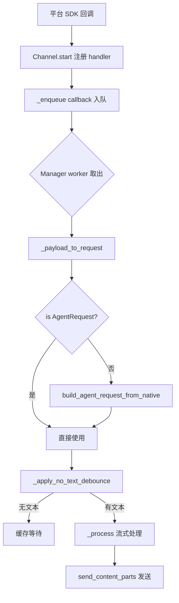
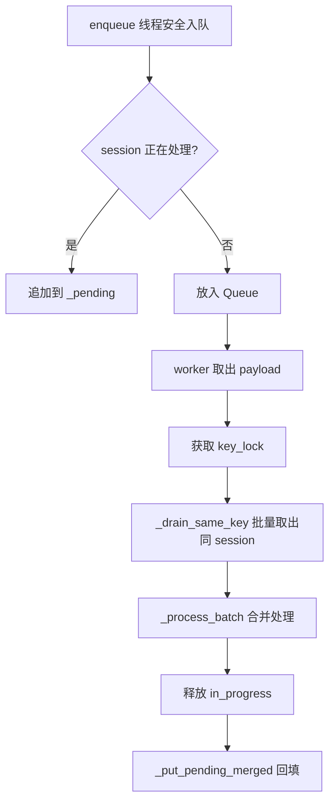
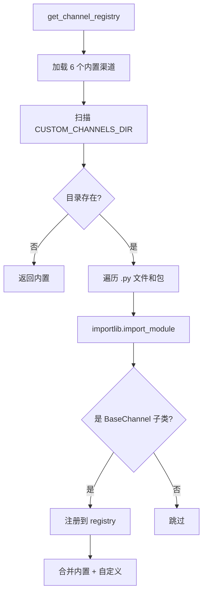

# PD-485.01 CoPaw — 六渠道统一接入与插件动态发现

> 文档编号：PD-485.01
> 来源：CoPaw `src/copaw/app/channels/`
> GitHub：https://github.com/agentscope-ai/CoPaw.git
> 问题域：PD-485 多渠道消息适配 Multi-Channel Messaging
> 状态：可复用方案

---

## 第 1 章 问题与动机

### 1.1 核心问题

Agent 应用需要同时接入多个即时通讯平台（DingTalk、Feishu、Discord、QQ、iMessage、Console），每个平台的消息协议、认证方式、多媒体处理、回复机制都完全不同。如果为每个平台写独立的 Agent 接入逻辑，会导致：

- 业务逻辑与平台 SDK 深度耦合，新增渠道需要改动核心代码
- 消息格式不统一，Agent 需要感知"当前在哪个平台"
- 多媒体（图片/视频/音频/文件）的上传、下载、发送路径各异
- 用户快速连续发送多条消息时，Agent 可能重复处理或丢失上下文

### 1.2 CoPaw 的解法概述

CoPaw 通过四层架构解决多渠道接入问题：

1. **BaseChannel 抽象基类**（`base.py:68`）：定义渠道协议——接收、转换、处理、发送的完整生命周期，所有渠道子类只需实现 `send()`、`start()`、`stop()` 和 `build_agent_request_from_native()` 四个核心方法
2. **ChannelManager 队列管理器**（`manager.py:113`）：为每个渠道维护独立的 asyncio.Queue，4 个 worker 并行消费，同 session 消息自动 drain 合并
3. **ChannelRegistry 插件发现**（`registry.py:72`）：6 个内置渠道 + `custom_channels/` 目录动态发现，`importlib.import_module` 自动加载 BaseChannel 子类
4. **MessageRenderer 渲染器**（`renderer.py:75`）：可插拔的消息渲染层，通过 RenderStyle 控制 markdown/emoji/code fence 能力，渠道无需硬编码格式

### 1.3 设计思想

| 设计原则 | 具体实现 | 理由 | 替代方案 |
|----------|----------|------|----------|
| 协议统一 | 所有渠道消息转为 AgentRequest（runtime Content types） | Agent 核心不感知平台差异 | 每个渠道独立 Agent 入口 |
| 队列隔离 | 每渠道独立 Queue + 4 worker | 一个渠道阻塞不影响其他渠道 | 全局单队列 |
| 去抖合并 | session 级 drain + no-text debounce + time debounce | 用户连发图片+文字合并为一次请求 | 每条消息独立处理 |
| 插件化 | `custom_channels/` 目录 + importlib 动态发现 | 新渠道零改动核心代码 | 硬编码注册表 |
| 热替换 | `replace_channel()` 先启动新渠道再停旧渠道 | 配置变更不中断服务 | 重启整个应用 |

---

## 第 2 章 源码实现分析

### 2.1 架构概览

```
┌─────────────────────────────────────────────────────────────────┐
│                        ChannelManager                           │
│  ┌──────────┐  ┌──────────┐  ┌──────────┐  ┌──────────┐       │
│  │ DingTalk  │  │  Feishu  │  │ Discord  │  │ Console  │  ...  │
│  │ Channel   │  │ Channel  │  │ Channel  │  │ Channel  │       │
│  └────┬─────┘  └────┬─────┘  └────┬─────┘  └────┬─────┘       │
│       │              │              │              │             │
│  ┌────▼─────┐  ┌────▼─────┐  ┌────▼─────┐  ┌────▼─────┐       │
│  │ Queue[0] │  │ Queue[1] │  │ Queue[2] │  │ Queue[3] │       │
│  │ 4 workers│  │ 4 workers│  │ 4 workers│  │ 4 workers│       │
│  └────┬─────┘  └────┬─────┘  └────┬─────┘  └────┬─────┘       │
│       └──────────────┴──────────────┴──────────────┘             │
│                              │                                   │
│                    ┌─────────▼──────────┐                       │
│                    │  _process(request)  │                       │
│                    │  (AgentApp runner)  │                       │
│                    └────────────────────┘                       │
└─────────────────────────────────────────────────────────────────┘

外部平台 SDK ──webhook/ws──▶ Channel.start() ──enqueue──▶ Queue
Queue ──worker drain──▶ _process_batch() ──▶ _consume_one_request()
  ──▶ _payload_to_request() ──▶ _process() ──▶ send_content_parts()
```

### 2.2 核心实现

#### 2.2.1 BaseChannel 抽象基类



对应源码 `src/copaw/app/channels/base.py:68-122`：

```python
class BaseChannel(ABC):
    """Base for all channels. Queue lives in ChannelManager; channel defines
    how to consume via consume_one().
    """
    channel: ChannelType
    uses_manager_queue: bool = True

    def __init__(
        self,
        process: ProcessHandler,
        on_reply_sent: OnReplySent = None,
        show_tool_details: bool = True,
    ):
        self._process = process
        self._on_reply_sent = on_reply_sent
        self._show_tool_details = show_tool_details
        self._enqueue: EnqueueCallback = None
        self._render_style = RenderStyle(show_tool_details=show_tool_details)
        self._renderer = MessageRenderer(self._render_style)
        self._pending_content_by_session: Dict[str, List[Any]] = {}
        self._debounce_seconds: float = 0.0
        self._debounce_pending: Dict[str, List[Any]] = {}
        self._debounce_timers: Dict[str, asyncio.Task[None]] = {}
```

关键设计点：
- `_process: ProcessHandler` 是统一的 Agent 处理函数，所有渠道共享同一个 `runner.stream_query`（`base.py:55`）
- `_enqueue` 回调由 ChannelManager 注入（`base.py:240-242`），渠道自身不持有队列
- `_renderer` 可插拔渲染器，子类可替换 `_render_style` 控制输出格式（`base.py:90-91`）
- 三层去抖机制：`_pending_content_by_session`（无文本缓存）、`_debounce_seconds`（时间窗口）、Manager 级 drain（队列级）

#### 2.2.2 ChannelManager 队列与消费循环



对应源码 `src/copaw/app/channels/manager.py:260-301`：

```python
async def _consume_channel_loop(
    self, channel_id: str, worker_index: int,
) -> None:
    q = self._queues.get(channel_id)
    if not q:
        return
    while True:
        try:
            payload = await q.get()
            ch = await self.get_channel(channel_id)
            if not ch:
                continue
            key = ch.get_debounce_key(payload)
            key_lock = self._key_locks.setdefault(
                (channel_id, key), asyncio.Lock(),
            )
            async with key_lock:
                self._in_progress.add((channel_id, key))
                batch = _drain_same_key(q, ch, key, payload)
            try:
                await _process_batch(ch, batch)
            finally:
                self._in_progress.discard((channel_id, key))
                pending = self._pending.pop((channel_id, key), [])
                _put_pending_merged(ch, q, pending)
        except asyncio.CancelledError:
            break
        except Exception:
            logger.exception(
                "channel consume_one failed: channel=%s worker=%s",
                channel_id, worker_index,
            )
```

关键设计点：
- 每渠道 4 个 worker（`manager.py:38`），不同 session 可并行处理
- `key_lock` 保证同 session 的消息不会被多个 worker 同时 drain（`manager.py:281-284`）
- `_in_progress` + `_pending` 二级缓冲：处理中的 session 新消息暂存，处理完后合并回填（`manager.py:127-128`）
- `_drain_same_key` 从队列中批量取出同 debounce key 的消息，非同 key 的放回（`manager.py:41-61`）

#### 2.2.3 ChannelRegistry 插件动态发现



对应源码 `src/copaw/app/channels/registry.py:34-76`：

```python
def _discover_custom_channels() -> dict[str, type[BaseChannel]]:
    """Load channel classes from CUSTOM_CHANNELS_DIR."""
    out: dict[str, type[BaseChannel]] = {}
    if not CUSTOM_CHANNELS_DIR.is_dir():
        return out
    dir_str = str(CUSTOM_CHANNELS_DIR)
    if dir_str not in sys.path:
        sys.path.insert(0, dir_str)
    for path in sorted(CUSTOM_CHANNELS_DIR.iterdir()):
        if path.suffix == ".py" and path.stem != "__init__":
            name = path.stem
        elif path.is_dir() and (path / "__init__.py").exists():
            name = path.name
        else:
            continue
        try:
            mod = importlib.import_module(name)
        except Exception:
            logger.exception("failed to load custom channel: %s", name)
            continue
        for obj in vars(mod).values():
            if (
                isinstance(obj, type)
                and issubclass(obj, BaseChannel)
                and obj is not BaseChannel
            ):
                key = getattr(obj, "channel", None)
                if key:
                    out[key] = obj
    return out

def get_channel_registry() -> dict[str, type[BaseChannel]]:
    """Built-in channel classes + custom channels from custom_channels/."""
    out = dict(_BUILTIN)
    out.update(_discover_custom_channels())
    return out
```

### 2.3 实现细节

**消息去抖三层机制：**

1. **Manager 级 drain**（`manager.py:41-61`）：worker 取出一条消息后，立即从队列中 drain 所有同 debounce key 的消息，合并为 batch 一次处理
2. **No-text debounce**（`base.py:217-238`）：如果消息只有图片/文件没有文本，缓存到 `_pending_content_by_session`，等文本到达时合并发送
3. **Time debounce**（`base.py:374-399`）：子类设置 `_debounce_seconds > 0` 时，同 key 消息在时间窗口内合并

**渠道热替换**（`manager.py:363-426`）：
- 先为新渠道创建队列和 enqueue 回调
- 在锁外启动新渠道（可能耗时，如 DingTalk Stream 连接）
- 在锁内原子交换：替换 channels 列表中的旧渠道，停止旧渠道
- 如果新渠道启动失败，不影响旧渠道继续运行

**多媒体内容统一类型**（`base.py:23-33`）：
所有渠道的消息内容统一为 `agentscope_runtime` 的 Content 类型：TextContent、ImageContent、VideoContent、AudioContent、FileContent、RefusalContent。渠道子类在 `build_agent_request_from_native` 中将平台原生消息转为这些类型。

---

## 第 3 章 迁移指南

### 3.1 迁移清单

**阶段 1：基础框架（必须）**

- [ ] 定义 `BaseChannel` 抽象基类，包含 `channel`、`start()`、`stop()`、`send()`、`build_agent_request_from_native()` 核心接口
- [ ] 实现 `ChannelManager`，为每个渠道创建独立 asyncio.Queue + N 个 consumer worker
- [ ] 定义统一的 `ContentType` 枚举和 Content 数据类（Text/Image/Video/Audio/File）
- [ ] 实现 `ProcessHandler` 类型：`Callable[[AgentRequest], AsyncIterator[Event]]`

**阶段 2：消息处理（推荐）**

- [ ] 实现 `_drain_same_key` 队列批量取出 + `_process_batch` 合并处理
- [ ] 实现 no-text debounce：无文本消息缓存，等文本到达合并
- [ ] 实现 `MessageRenderer` 可插拔渲染器，通过 `RenderStyle` 控制格式能力

**阶段 3：插件系统（可选）**

- [ ] 实现 `ChannelRegistry`：内置渠道 dict + `custom_channels/` 目录 importlib 动态发现
- [ ] 实现 `replace_channel()` 热替换：先启动新渠道，锁内原子交换，再停旧渠道
- [ ] 提供 CLI `channels install <key>` 生成渠道模板文件

### 3.2 适配代码模板

```python
"""最小可运行的多渠道框架模板"""
import asyncio
from abc import ABC
from typing import Any, AsyncIterator, Callable, Dict, List, Optional
from dataclasses import dataclass
from enum import Enum


# ── 统一内容类型 ──────────────────────────────────────────────
class ContentType(str, Enum):
    TEXT = "text"
    IMAGE = "image"
    VIDEO = "video"
    AUDIO = "audio"
    FILE = "file"


@dataclass
class TextContent:
    type: ContentType = ContentType.TEXT
    text: str = ""


@dataclass
class ImageContent:
    type: ContentType = ContentType.IMAGE
    image_url: str = ""


@dataclass
class AgentRequest:
    session_id: str
    user_id: str
    input: List[Any]
    channel: str = ""


@dataclass
class Event:
    object: str = ""
    status: str = ""
    content: Any = None


ProcessHandler = Callable[[AgentRequest], AsyncIterator[Event]]


# ── BaseChannel 抽象基类 ─────────────────────────────────────
class BaseChannel(ABC):
    channel: str = ""
    uses_manager_queue: bool = True

    def __init__(self, process: ProcessHandler):
        self._process = process
        self._enqueue: Optional[Callable[[Any], None]] = None
        self._pending_content: Dict[str, List[Any]] = {}

    def set_enqueue(self, cb: Optional[Callable[[Any], None]]) -> None:
        self._enqueue = cb

    def get_debounce_key(self, payload: Any) -> str:
        if isinstance(payload, dict):
            return payload.get("session_id") or payload.get("sender_id") or ""
        return getattr(payload, "session_id", "") or ""

    def build_agent_request_from_native(self, payload: Any) -> AgentRequest:
        raise NotImplementedError

    async def start(self) -> None:
        raise NotImplementedError

    async def stop(self) -> None:
        raise NotImplementedError

    async def send(self, to_handle: str, text: str, meta: Optional[dict] = None) -> None:
        raise NotImplementedError


# ── ChannelManager 队列管理器 ─────────────────────────────────
_WORKERS_PER_CHANNEL = 4
_QUEUE_MAXSIZE = 1000


def _drain_same_key(q: asyncio.Queue, ch: BaseChannel, key: str, first: Any) -> List[Any]:
    batch = [first]
    put_back = []
    while True:
        try:
            p = q.get_nowait()
        except asyncio.QueueEmpty:
            break
        if ch.get_debounce_key(p) == key:
            batch.append(p)
        else:
            put_back.append(p)
    for p in put_back:
        q.put_nowait(p)
    return batch


class ChannelManager:
    def __init__(self, channels: List[BaseChannel]):
        self.channels = channels
        self._queues: Dict[str, asyncio.Queue] = {}
        self._tasks: List[asyncio.Task] = []
        self._loop: Optional[asyncio.AbstractEventLoop] = None

    def enqueue(self, channel_id: str, payload: Any) -> None:
        if self._loop:
            self._loop.call_soon_threadsafe(
                self._queues[channel_id].put_nowait, payload
            )

    async def _consume_loop(self, channel_id: str, worker: int) -> None:
        q = self._queues[channel_id]
        ch = next(c for c in self.channels if c.channel == channel_id)
        while True:
            try:
                payload = await q.get()
                key = ch.get_debounce_key(payload)
                batch = _drain_same_key(q, ch, key, payload)
                # 合并 batch 为一个 request 处理
                request = ch.build_agent_request_from_native(batch[0])
                async for event in ch._process(request):
                    pass  # 处理事件
            except asyncio.CancelledError:
                break

    async def start_all(self) -> None:
        self._loop = asyncio.get_running_loop()
        for ch in self.channels:
            self._queues[ch.channel] = asyncio.Queue(maxsize=_QUEUE_MAXSIZE)
            ch.set_enqueue(lambda p, cid=ch.channel: self.enqueue(cid, p))
        for ch in self.channels:
            for w in range(_WORKERS_PER_CHANNEL):
                task = asyncio.create_task(self._consume_loop(ch.channel, w))
                self._tasks.append(task)
        for ch in self.channels:
            await ch.start()

    async def stop_all(self) -> None:
        for t in self._tasks:
            t.cancel()
        await asyncio.gather(*self._tasks, return_exceptions=True)
        for ch in reversed(self.channels):
            await ch.stop()


# ── ChannelRegistry 插件发现 ──────────────────────────────────
import importlib
import sys
from pathlib import Path

_BUILTIN: Dict[str, type] = {}  # 注册内置渠道

def discover_custom_channels(custom_dir: Path) -> Dict[str, type]:
    out = {}
    if not custom_dir.is_dir():
        return out
    if str(custom_dir) not in sys.path:
        sys.path.insert(0, str(custom_dir))
    for path in sorted(custom_dir.iterdir()):
        if path.suffix == ".py" and path.stem != "__init__":
            name = path.stem
        elif path.is_dir() and (path / "__init__.py").exists():
            name = path.name
        else:
            continue
        try:
            mod = importlib.import_module(name)
        except Exception:
            continue
        for obj in vars(mod).values():
            if isinstance(obj, type) and issubclass(obj, BaseChannel) and obj is not BaseChannel:
                key = getattr(obj, "channel", None)
                if key:
                    out[key] = obj
    return out

def get_registry(custom_dir: Path) -> Dict[str, type]:
    out = dict(_BUILTIN)
    out.update(discover_custom_channels(custom_dir))
    return out
```

### 3.3 适用场景

| 场景 | 适用度 | 说明 |
|------|--------|------|
| Agent 多平台接入 | ⭐⭐⭐ | 核心场景，6 渠道统一接入 |
| 企业内部 IM Bot | ⭐⭐⭐ | DingTalk/Feishu 开箱即用 |
| 社区 Bot（Discord） | ⭐⭐⭐ | Discord 渠道完整实现 |
| 自定义平台接入 | ⭐⭐⭐ | 插件系统 + CLI 模板生成 |
| 纯 API 服务（无 IM） | ⭐ | 过度设计，直接用 HTTP 端点即可 |
| 高吞吐消息队列 | ⭐⭐ | asyncio.Queue 适合中等负载，超高吞吐需 Redis/Kafka |

---

## 第 4 章 测试用例

```python
"""基于 CoPaw 真实函数签名的测试用例"""
import asyncio
import pytest
from unittest.mock import AsyncMock, MagicMock, patch
from typing import Any, Dict, List


# ── 测试 BaseChannel 去抖机制 ─────────────────────────────────

class TestNoTextDebounce:
    """测试 _apply_no_text_debounce：无文本消息缓存，文本到达时合并"""

    def _make_channel(self):
        """创建最小 BaseChannel 实例"""
        from copaw.app.channels.base import BaseChannel
        ch = MagicMock(spec=BaseChannel)
        ch._pending_content_by_session = {}
        ch._content_has_text = BaseChannel._content_has_text.__get__(ch)
        ch._apply_no_text_debounce = BaseChannel._apply_no_text_debounce.__get__(ch)
        return ch

    def test_image_only_buffered(self):
        """纯图片消息应被缓存，不触发处理"""
        ch = self._make_channel()
        from agentscope_runtime.engine.schemas.agent_schemas import (
            ImageContent, ContentType,
        )
        parts = [ImageContent(type=ContentType.IMAGE, image_url="http://img.png")]
        should_process, merged = ch._apply_no_text_debounce("sess1", parts)
        assert should_process is False
        assert merged == []
        assert "sess1" in ch._pending_content_by_session

    def test_text_flushes_buffer(self):
        """文本消息到达时，应合并之前缓存的图片"""
        ch = self._make_channel()
        from agentscope_runtime.engine.schemas.agent_schemas import (
            ImageContent, TextContent, ContentType,
        )
        img = ImageContent(type=ContentType.IMAGE, image_url="http://img.png")
        ch._pending_content_by_session["sess1"] = [img]
        text = TextContent(type=ContentType.TEXT, text="描述这张图")
        should_process, merged = ch._apply_no_text_debounce("sess1", [text])
        assert should_process is True
        assert len(merged) == 2  # img + text
        assert merged[0] == img


# ── 测试 ChannelManager drain 机制 ────────────────────────────

class TestDrainSameKey:
    """测试 _drain_same_key：从队列批量取出同 session 消息"""

    def test_drain_same_session(self):
        from copaw.app.channels.manager import _drain_same_key
        q = asyncio.Queue()
        ch = MagicMock()
        ch.get_debounce_key = lambda p: p.get("session_id", "")
        # 放入 3 条同 session + 1 条不同 session
        q.put_nowait({"session_id": "A", "text": "msg2"})
        q.put_nowait({"session_id": "B", "text": "other"})
        q.put_nowait({"session_id": "A", "text": "msg3"})
        first = {"session_id": "A", "text": "msg1"}
        batch = _drain_same_key(q, ch, "A", first)
        assert len(batch) == 3  # msg1 + msg2 + msg3
        assert q.qsize() == 1  # session B 留在队列

    def test_drain_empty_queue(self):
        from copaw.app.channels.manager import _drain_same_key
        q = asyncio.Queue()
        ch = MagicMock()
        ch.get_debounce_key = lambda p: "key"
        batch = _drain_same_key(q, ch, "key", {"data": 1})
        assert len(batch) == 1


# ── 测试 ChannelRegistry 插件发现 ─────────────────────────────

class TestChannelRegistry:
    """测试 get_channel_registry 内置 + 自定义渠道合并"""

    def test_builtin_channels(self):
        from copaw.app.channels.registry import get_channel_registry
        registry = get_channel_registry()
        assert "dingtalk" in registry
        assert "feishu" in registry
        assert "discord" in registry
        assert "console" in registry
        assert "imessage" in registry
        assert "qq" in registry

    def test_custom_channel_discovery(self, tmp_path):
        """自定义渠道 .py 文件应被自动发现"""
        from copaw.app.channels.registry import _discover_custom_channels
        from copaw.app.channels.base import BaseChannel
        # 写一个最小自定义渠道
        code = '''
from copaw.app.channels.base import BaseChannel
class MyChannel(BaseChannel):
    channel = "my_custom"
    async def start(self): pass
    async def stop(self): pass
    async def send(self, to, text, meta=None): pass
    def build_agent_request_from_native(self, p): pass
'''
        (tmp_path / "my_custom.py").write_text(code)
        with patch("copaw.app.channels.registry.CUSTOM_CHANNELS_DIR", tmp_path):
            found = _discover_custom_channels()
        assert "my_custom" in found
```

---

## 第 5 章 跨域关联

| 关联域 | 关系类型 | 说明 |
|--------|----------|------|
| PD-04 工具系统 | 协同 | 渠道接收的消息可能触发工具调用，工具输出通过 MessageRenderer 渲染后经渠道发送 |
| PD-10 中间件管道 | 协同 | ChannelManager 的 consume 循环可视为管道入口，消息经 debounce → convert → process → render → send 管道 |
| PD-03 容错与重试 | 依赖 | 各渠道的 send 方法需要处理平台 API 失败（如 DingTalk sessionWebhook 过期、Feishu token 刷新），依赖容错机制 |
| PD-06 记忆持久化 | 协同 | session_id 由渠道生成（如 `feishu:chat_id:xxx`），记忆系统按 session_id 存取上下文 |
| PD-09 Human-in-the-Loop | 协同 | 渠道是人机交互的物理通道，HITL 的暂停/恢复需要通过渠道的 send/receive 实现 |
| PD-11 可观测性 | 协同 | 每个渠道的 consume_one 和 send 都有详细的 logger 日志，可接入追踪系统 |

---

## 第 6 章 来源文件索引

| 文件 | 行范围 | 关键实现 |
|------|--------|----------|
| `src/copaw/app/channels/base.py` | L68-L122 | BaseChannel 抽象基类定义 |
| `src/copaw/app/channels/base.py` | L217-L238 | no-text debounce 去抖机制 |
| `src/copaw/app/channels/base.py` | L364-L400 | time debounce 时间窗口合并 |
| `src/copaw/app/channels/base.py` | L402-L459 | _consume_one_request 核心消费逻辑 |
| `src/copaw/app/channels/base.py` | L605-L656 | send_content_parts 多媒体发送 |
| `src/copaw/app/channels/manager.py` | L41-L61 | _drain_same_key 队列批量取出 |
| `src/copaw/app/channels/manager.py` | L113-L154 | ChannelManager 初始化与工厂方法 |
| `src/copaw/app/channels/manager.py` | L260-L301 | _consume_channel_loop 消费循环 |
| `src/copaw/app/channels/manager.py` | L303-L330 | start_all 启动所有渠道 |
| `src/copaw/app/channels/manager.py` | L363-L426 | replace_channel 热替换 |
| `src/copaw/app/channels/registry.py` | L24-L31 | 6 个内置渠道注册表 |
| `src/copaw/app/channels/registry.py` | L34-L66 | _discover_custom_channels 插件发现 |
| `src/copaw/app/channels/registry.py` | L72-L76 | get_channel_registry 合并注册表 |
| `src/copaw/app/channels/renderer.py` | L37-L44 | RenderStyle 渲染能力声明 |
| `src/copaw/app/channels/renderer.py` | L75-L305 | MessageRenderer 消息渲染器 |
| `src/copaw/app/channels/schema.py` | L13-L28 | ChannelAddress 统一路由 |
| `src/copaw/app/channels/schema.py` | L47-L66 | ChannelMessageConverter 协议 |
| `src/copaw/app/channels/dingtalk/channel.py` | L65-L157 | DingTalkChannel 初始化与工厂 |
| `src/copaw/app/channels/dingtalk/channel.py` | L949-L1022 | DingTalk send_content_parts 多媒体发送 |
| `src/copaw/app/channels/dingtalk/channel.py` | L1270-L1326 | DingTalk 去抖 key 与 merge 实现 |
| `src/copaw/app/channels/feishu/channel.py` | L78-L174 | FeishuChannel 初始化与工厂 |
| `src/copaw/app/channels/feishu/channel.py` | L466-L641 | Feishu 消息接收与内容解析 |
| `src/copaw/app/channels/feishu/channel.py` | L1376-L1456 | Feishu send_content_parts 多媒体发送 |
| `src/copaw/app/channels/discord_/channel.py` | L27-L340 | DiscordChannel 完整实现 |
| `src/copaw/app/channels/console/channel.py` | L49-L318 | ConsoleChannel stdout 输出 |
| `src/copaw/constant.py` | L44 | CUSTOM_CHANNELS_DIR 定义 |
| `src/copaw/cli/channels_cmd.py` | L50-L80 | CLI 渠道模板生成 |

---

## 第 7 章 横向对比维度

```json comparison_data
{
  "project": "CoPaw",
  "dimensions": {
    "渠道抽象": "BaseChannel ABC + ChannelType str 类型，6 内置 + 自定义插件",
    "消息统一": "agentscope_runtime Content 类型（Text/Image/Video/Audio/File/Refusal）",
    "队列模型": "每渠道独立 asyncio.Queue + 4 worker，key_lock 保证同 session 串行",
    "去抖策略": "三层：Manager drain + no-text buffer + time debounce",
    "插件发现": "custom_channels/ 目录 importlib 动态加载 BaseChannel 子类",
    "热替换": "replace_channel 先启动新渠道再锁内原子交换停旧渠道",
    "多媒体处理": "统一 Content 类型 + 渠道级 upload/send_media 覆写",
    "渲染层": "MessageRenderer + RenderStyle 可插拔，控制 markdown/emoji/code fence"
  }
}
```

### 域元数据补充

```json domain_metadata
{
  "solution_summary": "CoPaw 通过 BaseChannel ABC + ChannelManager 独立队列 + ChannelRegistry importlib 插件发现，实现 DingTalk/Feishu/Discord/QQ/iMessage/Console 六渠道统一接入，三层去抖合并消息",
  "description": "Agent 应用多平台 IM 接入的队列隔离、消息统一与插件化架构",
  "sub_problems": [
    "渠道热替换与零停机配置变更",
    "同 session 消息并发控制与队列 drain 合并",
    "渠道级消息渲染能力适配（markdown/emoji/code fence）"
  ],
  "best_practices": [
    "每渠道独立队列 + 多 worker 并行，key_lock 保证同 session 串行处理",
    "三层去抖（Manager drain + no-text buffer + time debounce）防止消息碎片化",
    "先启动新渠道再原子交换停旧渠道，实现热替换零停机"
  ]
}
```
