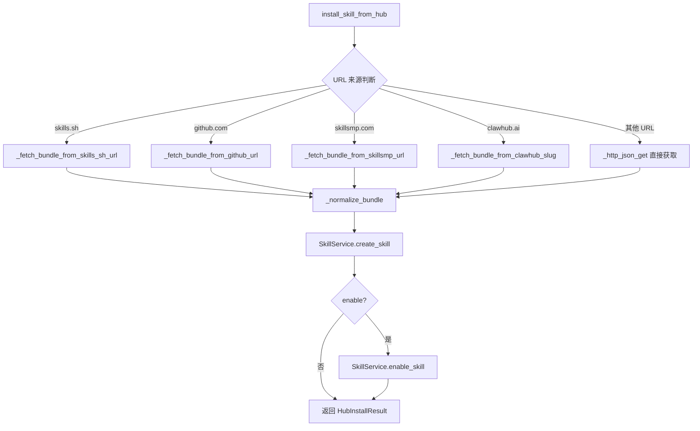
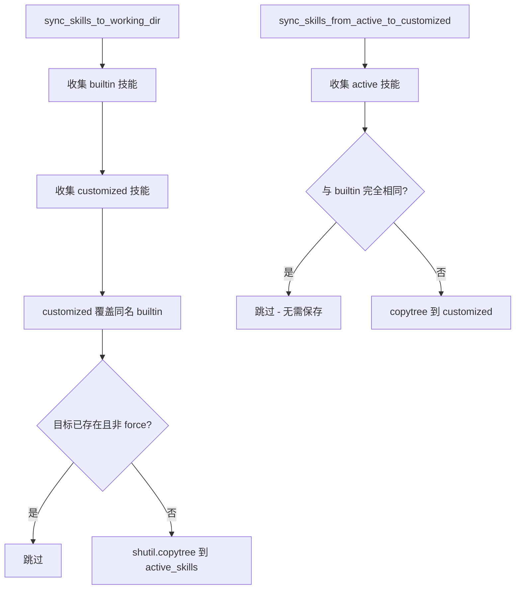

# PD-486.01 CoPaw — 四源技能市场与三级目录热安装

> 文档编号：PD-486.01
> 来源：CoPaw `src/copaw/agents/skills_hub.py` `src/copaw/agents/skills_manager.py`
> GitHub：https://github.com/agentscope-ai/CoPaw.git
> 问题域：PD-486 技能市场与热安装 Skill Marketplace & Hot Install
> 状态：可复用方案

---

## 第 1 章 问题与动机

### 1.1 核心问题

Agent 系统的能力扩展面临两个核心挑战：

1. **技能来源碎片化** — 技能散布在 ClawHub、skills.sh、GitHub 仓库、SkillsMP 等多个平台，用户需要手动下载、解压、放置到正确目录，流程繁琐且易出错。
2. **技能生命周期管理** — 内置技能需要随版本升级，用户自定义技能需要持久化保存，运行时激活的技能需要与前两者解耦。缺乏分层管理会导致升级覆盖用户修改、删除内置技能等问题。

### 1.2 CoPaw 的解法概述

CoPaw 设计了一套完整的技能市场与热安装系统，核心要点：

1. **SKILL.md 声明式定义** — 每个技能以 YAML Front Matter + Markdown 正文定义元数据和使用说明，`frontmatter` 库解析验证 (`skills_manager.py:571-573`)
2. **四源统一安装** — SkillsHub 支持从 ClawHub API、skills.sh（GitHub 仓库）、GitHub 直链、SkillsMP 四个来源安装技能，URL 自动路由到对应的 fetch 策略 (`skills_hub.py:1090-1122`)
3. **三级目录分离** — builtin（代码内置）/ customized（用户自定义）/ active（运行时激活）三级目录，customized 覆盖 builtin 同名技能 (`skills_manager.py:150-159`)
4. **双向同步机制** — builtin+customized → active 正向同步，active → customized 反向同步（保存运行时修改），通过 `filecmp.dircmp` 递归比较避免无效同步 (`skills_manager.py:207-248`)
5. **指数退避重试** — HTTP 请求支持可配置的指数退避重试，环境变量控制超时/重试次数/退避参数 (`skills_hub.py:52-88`)

### 1.3 设计思想

| 设计原则 | 具体实现 | 理由 | 替代方案 |
|----------|----------|------|----------|
| 声明式技能定义 | SKILL.md YAML Front Matter 包含 name/description/metadata | 人类可读、Git 友好、无需额外注册表 | JSON Schema、TOML 配置、数据库注册 |
| URL 路由式多源安装 | 解析 URL host 自动分发到 ClawHub/skills.sh/GitHub/SkillsMP handler | 用户只需提供 URL，无需关心来源差异 | 统一 registry API、手动选择来源 |
| 三级目录分离 | builtin(代码内) / customized(~/.copaw/) / active(~/.copaw/) | 升级不覆盖用户修改，运行时隔离 | 单目录 + 版本标记、数据库管理 |
| 文件系统即状态 | 技能存在 = 目录存在 + SKILL.md 存在 | 无需数据库，`ls` 即可审计 | SQLite、Redis、配置文件列表 |
| 环境变量驱动配置 | COPAW_SKILLS_HUB_* 系列环境变量控制 Hub URL/超时/重试 | 容器化部署友好，无需修改代码 | 配置文件、CLI 参数 |

---

## 第 2 章 源码实现分析

### 2.1 架构概览

CoPaw 技能系统由三层组成：存储层（三级目录）、管理层（SkillService）、市场层（SkillsHub）。

```
┌─────────────────────────────────────────────────────────────┐
│                    FastAPI Router Layer                       │
│  /skills  /skills/hub/search  /skills/hub/install            │
│  (src/copaw/app/routers/skills.py)                           │
├─────────────────────────────────────────────────────────────┤
│                    SkillsHub (市场层)                         │
│  search_hub_skills()  install_skill_from_hub()               │
│  四源 URL 路由: ClawHub / skills.sh / GitHub / SkillsMP      │
│  (src/copaw/agents/skills_hub.py)                            │
├─────────────────────────────────────────────────────────────┤
│                    SkillService (管理层)                      │
│  create / enable / disable / delete / sync / load_file       │
│  (src/copaw/agents/skills_manager.py)                        │
├─────────────────────────────────────────────────────────────┤
│                    三级目录 (存储层)                           │
│  builtin/          customized/          active_skills/        │
│  (代码内置)         (~/.copaw/)          (~/.copaw/)          │
│  只读               用户可写             运行时激活             │
└─────────────────────────────────────────────────────────────┘
```

### 2.2 核心实现

#### 2.2.1 四源 URL 路由安装



对应源码 `src/copaw/agents/skills_hub.py:1080-1153`：

```python
def install_skill_from_hub(
    *,
    bundle_url: str,
    version: str = "",
    enable: bool = True,
    overwrite: bool = False,
) -> HubInstallResult:
    source_url = bundle_url
    data: Any

    if not bundle_url or not _is_http_url(bundle_url):
        raise ValueError("bundle_url must be a valid http(s) URL")

    skills_spec = _extract_skills_sh_spec(bundle_url)
    if skills_spec is not None:
        data, source_url = _fetch_bundle_from_skills_sh_url(
            bundle_url, requested_version=version,
        )
    else:
        github_spec = _extract_github_spec(bundle_url)
        if github_spec is not None:
            data, source_url = _fetch_bundle_from_github_url(
                bundle_url, requested_version=version,
            )
        else:
            skillsmp_slug = _extract_skillsmp_slug(bundle_url)
            if skillsmp_slug:
                data, source_url = _fetch_bundle_from_skillsmp_url(
                    bundle_url, requested_version=version,
                )
            else:
                clawhub_slug = _resolve_clawhub_slug(bundle_url)
                if clawhub_slug:
                    data, source_url = _fetch_bundle_from_clawhub_slug(
                        clawhub_slug, version,
                    )
                else:
                    data = _http_json_get(bundle_url)

    name, content, references, scripts, extra_files = _normalize_bundle(data)
    created = SkillService.create_skill(
        name=name, content=content, overwrite=overwrite,
        references=references, scripts=scripts, extra_files=extra_files,
    )
    if enable:
        enabled = SkillService.enable_skill(name, force=True)
    return HubInstallResult(name=name, enabled=enabled, source_url=source_url)
```

URL 路由的优先级链：skills.sh → GitHub → SkillsMP → ClawHub → 直接 JSON。每个来源有独立的 URL 解析器（如 `_extract_skills_sh_spec` 解析 `skills.sh/{owner}/{repo}/{skill}` 三段路径），最终都归一化为 `(name, content, references, scripts, extra_files)` 五元组。

#### 2.2.2 三级目录同步机制



对应源码 `src/copaw/agents/skills_manager.py:129-204`：

```python
def sync_skills_to_working_dir(
    skill_names: list[str] | None = None,
    force: bool = False,
) -> tuple[int, int]:
    builtin_skills = get_builtin_skills_dir()
    customized_skills = get_customized_skills_dir()
    active_skills = get_active_skills_dir()
    active_skills.mkdir(parents=True, exist_ok=True)

    # Collect skills from both sources (customized overwrites builtin)
    skills_to_sync = _collect_skills_from_dir(builtin_skills)
    skills_to_sync.update(_collect_skills_from_dir(customized_skills))

    # Filter by skill_names if specified
    if skill_names is not None:
        skills_to_sync = {
            name: path for name, path in skills_to_sync.items()
            if name in skill_names
        }

    synced_count = 0
    skipped_count = 0
    for skill_name, skill_dir in skills_to_sync.items():
        target_dir = active_skills / skill_name
        if target_dir.exists() and not force:
            skipped_count += 1
            continue
        if target_dir.exists():
            shutil.rmtree(target_dir)
        shutil.copytree(skill_dir, target_dir)
        synced_count += 1
    return synced_count, skipped_count
```

关键设计：`skills_to_sync.update()` 利用 dict 的覆盖语义，customized 目录中的同名技能自动覆盖 builtin，无需额外优先级逻辑。

### 2.3 实现细节

#### SKILL.md 声明式定义

每个技能目录必须包含 `SKILL.md`，使用 YAML Front Matter 声明元数据。以 himalaya 技能为例 (`src/copaw/agents/skills/himalaya/SKILL.md:1-23`)：

```yaml
---
name: himalaya
description: "CLI to manage emails via IMAP/SMTP..."
homepage: https://github.com/pimalaya/himalaya
metadata:
  openclaw:
    emoji: "📧"
    requires: { bins: ["himalaya"] }
    install:
      - id: brew
        kind: brew
        formula: himalaya
        bins: ["himalaya"]
        label: "Install Himalaya (brew)"
---
```

`SkillService.create_skill` 在写入前用 `frontmatter.loads()` 验证 YAML Front Matter 必须包含 `name` 和 `description` 字段 (`skills_manager.py:571-593`)。

#### 技能目录结构约定

```
skill_name/
├── SKILL.md          # 必须：声明 + 使用说明
├── references/       # 可选：参考文档树
│   └── *.md
└── scripts/          # 可选：脚本树
    └── *.py
```

`_build_directory_tree()` 递归扫描 references/ 和 scripts/ 子目录，构建嵌套 dict 树结构 (`skills_manager.py:74-108`)。创建技能时 `_create_files_from_tree()` 反向从 dict 树还原文件系统 (`skills_manager.py:417-462`)。

#### 指数退避 HTTP 重试

Hub HTTP 客户端支持可配置的指数退避重试 (`skills_hub.py:84-88`)：

```python
def _compute_backoff_seconds(attempt: int) -> float:
    base = _hub_http_backoff_base()  # 默认 0.8s
    cap = _hub_http_backoff_cap()    # 默认 6s
    return min(cap, base * (2 ** max(0, attempt - 1)))
```

仅对 `RETRYABLE_HTTP_STATUS`（408/409/425/429/500/502/503/504）重试，GitHub 403 rate limit 直接抛出带引导信息的 RuntimeError。

#### 路径遍历防护

`load_skill_file` 和 `_safe_path_parts` 均包含路径遍历防护 (`skills_manager.py:822-828`, `skills_hub.py:248-257`)：

```python
# skills_manager.py:822-828
if ".." in normalized or normalized.startswith("/"):
    logger.error("Invalid file_path '%s': path traversal not allowed", file_path)
    return None

# skills_hub.py:254-256
for part in parts:
    if part in (".", ".."):
        return None
```

---

## 第 3 章 迁移指南

### 3.1 迁移清单

**阶段 1：技能定义层（1 天）**
- [ ] 定义 SKILL.md 规范：YAML Front Matter 必须字段（name, description）
- [ ] 实现 `frontmatter` 解析验证逻辑
- [ ] 约定技能目录结构：`skill_name/SKILL.md` + 可选 `references/` + `scripts/`

**阶段 2：三级目录管理（2 天）**
- [ ] 定义三级目录路径常量（builtin / customized / active）
- [ ] 实现 `_collect_skills_from_dir()` — 扫描目录收集技能
- [ ] 实现 `sync_skills_to_working_dir()` — 正向同步（builtin+customized → active）
- [ ] 实现 `sync_skills_from_active_to_customized()` — 反向同步（保存运行时修改）
- [ ] 实现 `_is_directory_same()` — 递归目录比较避免无效同步

**阶段 3：SkillService CRUD（1 天）**
- [ ] 实现 `create_skill()` — 创建技能到 customized 目录
- [ ] 实现 `enable_skill()` / `disable_skill()` — 同步到/移除 active 目录
- [ ] 实现 `delete_skill()` — 从 customized 永久删除
- [ ] 实现 `load_skill_file()` — 加载技能子文件（含路径遍历防护）

**阶段 4：多源安装（2 天）**
- [ ] 实现 URL 解析器：`_extract_github_spec()`, `_extract_skills_sh_spec()` 等
- [ ] 实现各来源 fetch 函数：`_fetch_bundle_from_github_url()` 等
- [ ] 实现 `_normalize_bundle()` — 统一不同来源的数据格式
- [ ] 实现 `install_skill_from_hub()` — URL 路由 + 安装 + 启用
- [ ] 添加指数退避重试和 GitHub Token 认证

**阶段 5：API 与 CLI（1 天）**
- [ ] FastAPI Router：GET /skills, POST /skills/hub/install, POST /{name}/enable 等
- [ ] CLI 命令：`skills list`, `skills config`（交互式多选启用/禁用）

### 3.2 适配代码模板

以下是一个可直接复用的三级目录技能管理器最小实现：

```python
"""Minimal skill manager with three-tier directory separation."""
import shutil
import filecmp
from pathlib import Path
from dataclasses import dataclass
from typing import Any

import frontmatter


@dataclass
class SkillInfo:
    name: str
    content: str
    source: str  # "builtin" | "customized" | "active"
    path: str


class SkillManager:
    """Three-tier skill directory manager."""

    def __init__(
        self,
        builtin_dir: Path,
        customized_dir: Path,
        active_dir: Path,
    ):
        self.builtin_dir = builtin_dir
        self.customized_dir = customized_dir
        self.active_dir = active_dir

    def _collect_skills(self, directory: Path) -> dict[str, Path]:
        skills: dict[str, Path] = {}
        if directory.exists():
            for d in directory.iterdir():
                if d.is_dir() and (d / "SKILL.md").exists():
                    skills[d.name] = d
        return skills

    def sync_to_active(self, force: bool = False) -> tuple[int, int]:
        """Sync builtin + customized → active (customized wins)."""
        self.active_dir.mkdir(parents=True, exist_ok=True)
        skills = self._collect_skills(self.builtin_dir)
        skills.update(self._collect_skills(self.customized_dir))

        synced, skipped = 0, 0
        for name, src in skills.items():
            dst = self.active_dir / name
            if dst.exists() and not force:
                skipped += 1
                continue
            if dst.exists():
                shutil.rmtree(dst)
            shutil.copytree(src, dst)
            synced += 1
        return synced, skipped

    def create_skill(self, name: str, content: str, overwrite: bool = False) -> bool:
        """Create skill in customized directory with YAML validation."""
        post = frontmatter.loads(content)
        if not post.get("name") or not post.get("description"):
            raise ValueError("SKILL.md must have 'name' and 'description' in front matter")

        skill_dir = self.customized_dir / name
        if skill_dir.exists() and not overwrite:
            return False

        self.customized_dir.mkdir(parents=True, exist_ok=True)
        if skill_dir.exists():
            shutil.rmtree(skill_dir)
        skill_dir.mkdir()
        (skill_dir / "SKILL.md").write_text(content, encoding="utf-8")
        return True

    def enable_skill(self, name: str) -> bool:
        """Sync a single skill to active directory."""
        synced, _ = self.sync_to_active()
        return (self.active_dir / name).exists()

    def disable_skill(self, name: str) -> bool:
        """Remove skill from active directory."""
        target = self.active_dir / name
        if not target.exists():
            return False
        shutil.rmtree(target)
        return True

    def save_active_modifications(self) -> tuple[int, int]:
        """Reverse sync: active → customized (skip unchanged builtins)."""
        self.customized_dir.mkdir(parents=True, exist_ok=True)
        active = self._collect_skills(self.active_dir)
        builtin = self._collect_skills(self.builtin_dir)

        synced, skipped = 0, 0
        for name, src in active.items():
            if name in builtin:
                dcmp = filecmp.dircmp(src, builtin[name])
                if not (dcmp.left_only or dcmp.right_only or dcmp.diff_files):
                    skipped += 1
                    continue
            dst = self.customized_dir / name
            if dst.exists():
                shutil.rmtree(dst)
            shutil.copytree(src, dst)
            synced += 1
        return synced, skipped
```

### 3.3 适用场景

| 场景 | 适用度 | 说明 |
|------|--------|------|
| Agent 框架技能扩展 | ⭐⭐⭐ | 核心场景：用户安装/管理 Agent 技能 |
| 插件系统（IDE/编辑器） | ⭐⭐⭐ | 三级目录模式适用于任何插件管理 |
| CLI 工具扩展 | ⭐⭐ | 适合需要热加载扩展的 CLI 工具 |
| 微服务配置分发 | ⭐ | 过于轻量，缺少版本锁定和依赖解析 |

---

## 第 4 章 测试用例

```python
"""Tests for CoPaw skill marketplace and three-tier directory management."""
import pytest
from pathlib import Path
from unittest.mock import patch, MagicMock

# --- SkillManager tests ---

class TestSkillDirectoryCollection:
    """Test _collect_skills_from_dir behavior."""

    def test_collect_valid_skills(self, tmp_path: Path):
        """Skills with SKILL.md are collected."""
        skill_a = tmp_path / "skill_a"
        skill_a.mkdir()
        (skill_a / "SKILL.md").write_text("---\nname: a\n---\n# A")

        skill_b = tmp_path / "skill_b"
        skill_b.mkdir()
        (skill_b / "SKILL.md").write_text("---\nname: b\n---\n# B")

        # Directory without SKILL.md should be ignored
        (tmp_path / "not_a_skill").mkdir()

        from copaw.agents.skills_manager import _collect_skills_from_dir
        result = _collect_skills_from_dir(tmp_path)
        assert set(result.keys()) == {"skill_a", "skill_b"}

    def test_collect_empty_dir(self, tmp_path: Path):
        from copaw.agents.skills_manager import _collect_skills_from_dir
        assert _collect_skills_from_dir(tmp_path) == {}

    def test_collect_nonexistent_dir(self):
        from copaw.agents.skills_manager import _collect_skills_from_dir
        assert _collect_skills_from_dir(Path("/nonexistent")) == {}


class TestSyncSkills:
    """Test three-tier sync logic."""

    def test_customized_overrides_builtin(self, tmp_path: Path):
        """Customized skill with same name should override builtin."""
        builtin = tmp_path / "builtin"
        customized = tmp_path / "customized"
        active = tmp_path / "active"

        # Create builtin skill
        (builtin / "email").mkdir(parents=True)
        (builtin / "email" / "SKILL.md").write_text("builtin version")

        # Create customized skill with same name
        (customized / "email").mkdir(parents=True)
        (customized / "email" / "SKILL.md").write_text("customized version")

        from copaw.agents.skills_manager import _collect_skills_from_dir
        skills = _collect_skills_from_dir(builtin)
        skills.update(_collect_skills_from_dir(customized))

        # Customized should win
        assert "customized" in str(skills["email"])

    def test_force_overwrite(self, tmp_path: Path):
        """force=True should overwrite existing active skills."""
        builtin = tmp_path / "builtin"
        active = tmp_path / "active"

        (builtin / "test_skill").mkdir(parents=True)
        (builtin / "test_skill" / "SKILL.md").write_text("v2")

        (active / "test_skill").mkdir(parents=True)
        (active / "test_skill" / "SKILL.md").write_text("v1")

        # After force sync, active should have v2
        import shutil
        shutil.rmtree(active / "test_skill")
        shutil.copytree(builtin / "test_skill", active / "test_skill")
        assert (active / "test_skill" / "SKILL.md").read_text() == "v2"


class TestSkillCreation:
    """Test SKILL.md validation on create."""

    def test_reject_missing_name(self):
        """SKILL.md without name field should be rejected."""
        import frontmatter
        content = "---\ndescription: test\n---\n# Test"
        post = frontmatter.loads(content)
        assert not post.get("name")

    def test_accept_valid_frontmatter(self):
        """SKILL.md with name and description should pass."""
        import frontmatter
        content = "---\nname: test\ndescription: A test skill\n---\n# Test"
        post = frontmatter.loads(content)
        assert post.get("name") == "test"
        assert post.get("description") == "A test skill"


class TestURLRouting:
    """Test multi-source URL parsing."""

    def test_extract_skills_sh_spec(self):
        from copaw.agents.skills_hub import _extract_skills_sh_spec
        result = _extract_skills_sh_spec("https://skills.sh/owner/repo/skill")
        assert result == ("owner", "repo", "skill")

    def test_extract_skills_sh_invalid(self):
        from copaw.agents.skills_hub import _extract_skills_sh_spec
        assert _extract_skills_sh_spec("https://github.com/owner/repo") is None

    def test_extract_github_spec(self):
        from copaw.agents.skills_hub import _extract_github_spec
        result = _extract_github_spec(
            "https://github.com/owner/repo/tree/main/skills/email"
        )
        assert result == ("owner", "repo", "main", "skills/email")

    def test_extract_clawhub_slug(self):
        from copaw.agents.skills_hub import _extract_clawhub_slug_from_url
        result = _extract_clawhub_slug_from_url("https://clawhub.ai/owner/my-skill")
        assert result == "my-skill"

    def test_path_traversal_blocked(self):
        from copaw.agents.skills_hub import _safe_path_parts
        assert _safe_path_parts("../etc/passwd") is None
        assert _safe_path_parts("./hidden") is None
        assert _safe_path_parts("references/doc.md") == ["references", "doc.md"]


class TestBackoff:
    """Test exponential backoff calculation."""

    def test_backoff_increases(self):
        from copaw.agents.skills_hub import _compute_backoff_seconds
        b1 = _compute_backoff_seconds(1)
        b2 = _compute_backoff_seconds(2)
        b3 = _compute_backoff_seconds(3)
        assert b1 < b2 < b3

    def test_backoff_capped(self):
        from copaw.agents.skills_hub import _compute_backoff_seconds
        # Default cap is 6.0
        assert _compute_backoff_seconds(100) <= 6.0
```

---

## 第 5 章 跨域关联

| 关联域 | 关系类型 | 说明 |
|--------|----------|------|
| PD-04 工具系统 | 依赖 | 技能最终通过 `toolkit.register_agent_skill()` 注册为 Agent 工具，技能市场是工具系统的上游供给 |
| PD-03 容错与重试 | 协同 | SkillsHub 的指数退避重试机制（`_compute_backoff_seconds`）是容错模式在 HTTP 层的具体应用 |
| PD-06 记忆持久化 | 协同 | 三级目录的 customized 层实现了技能配置的持久化，与记忆系统共享 `~/.copaw/` 工作目录 |
| PD-10 中间件管道 | 互补 | 技能定义了 Agent 的能力边界，中间件管道定义了请求处理流程，两者正交但共同构成 Agent 运行时 |
| PD-09 Human-in-the-Loop | 协同 | CLI `skills config` 命令提供交互式多选界面，是 HITL 模式在技能管理场景的应用 |

---

## 第 6 章 来源文件索引

| 文件 | 行范围 | 关键实现 |
|------|--------|----------|
| `src/copaw/agents/skills_hub.py` | L1-L1154 | 四源技能市场：URL 路由、HTTP 重试、bundle 归一化、安装流程 |
| `src/copaw/agents/skills_hub.py` | L84-L88 | 指数退避计算 `_compute_backoff_seconds` |
| `src/copaw/agents/skills_hub.py` | L1080-L1153 | 核心入口 `install_skill_from_hub` URL 路由链 |
| `src/copaw/agents/skills_hub.py` | L426-L485 | `_normalize_bundle` 多格式归一化 |
| `src/copaw/agents/skills_manager.py` | L16-L48 | `SkillInfo` Pydantic 模型定义 |
| `src/copaw/agents/skills_manager.py` | L74-L108 | `_build_directory_tree` 递归目录树构建 |
| `src/copaw/agents/skills_manager.py` | L129-L204 | `sync_skills_to_working_dir` 正向同步（builtin+customized → active） |
| `src/copaw/agents/skills_manager.py` | L251-L308 | `sync_skills_from_active_to_customized` 反向同步 |
| `src/copaw/agents/skills_manager.py` | L465-L655 | `SkillService` 完整 CRUD + 文件加载 |
| `src/copaw/agents/skills_manager.py` | L570-L593 | YAML Front Matter 验证逻辑 |
| `src/copaw/app/routers/skills.py` | L1-L216 | FastAPI REST API：搜索/安装/启用/禁用/删除/文件加载 |
| `src/copaw/cli/skills_cmd.py` | L12-L98 | CLI 交互式技能配置（多选启用/禁用） |
| `src/copaw/cli/init_cmd.py` | L242-L277 | 初始化流程中的技能同步（all/none/custom 三选一） |
| `src/copaw/constant.py` | L34-L37 | 三级目录路径常量定义 |
| `src/copaw/agents/react_agent.py` | L153-L176 | Agent 启动时技能注册到 Toolkit |
| `src/copaw/agents/skills/himalaya/SKILL.md` | L1-L23 | SKILL.md 声明式定义示例（YAML Front Matter + metadata） |

---

## 第 7 章 横向对比维度

> **重要：** 本章用于自动填充 Butcher Wiki 的横向对比表。

```json comparison_data
{
  "project": "CoPaw",
  "dimensions": {
    "技能定义方式": "SKILL.md YAML Front Matter 声明式，frontmatter 库解析验证",
    "安装来源": "四源 URL 路由：ClawHub API / skills.sh / GitHub / SkillsMP",
    "目录架构": "三级分离：builtin(代码内) / customized(用户) / active(运行时)",
    "同步策略": "双向同步：正向 builtin+customized→active，反向 active→customized",
    "生命周期操作": "create / enable / disable / delete / sync / load_file 六操作",
    "安全防护": "路径遍历检测 + GitHub rate limit 感知 + 指数退避重试",
    "CLI 交互": "交互式多选 checkbox 启用/禁用 + init 三选一(all/none/custom)"
  }
}
```

### 域元数据补充

```json domain_metadata
{
  "solution_summary": "CoPaw 通过四源 URL 路由（ClawHub/skills.sh/GitHub/SkillsMP）统一安装技能，三级目录（builtin/customized/active）双向同步管理生命周期，SKILL.md YAML Front Matter 声明式定义元数据",
  "description": "技能市场需要解决多源安装归一化与运行时热切换的工程问题",
  "sub_problems": [
    "多源 bundle 格式归一化（JSON/文件树/API 响应）",
    "GitHub API rate limit 感知与 Token 认证",
    "技能子文件（references/scripts）的树形结构序列化与反序列化"
  ],
  "best_practices": [
    "URL host 路由式多源安装，用户只需提供链接",
    "dict.update() 覆盖语义实现 customized 优先于 builtin",
    "filecmp.dircmp 递归比较避免无效反向同步",
    "环境变量驱动 Hub 配置（URL/超时/重试），容器化友好"
  ]
}
```
