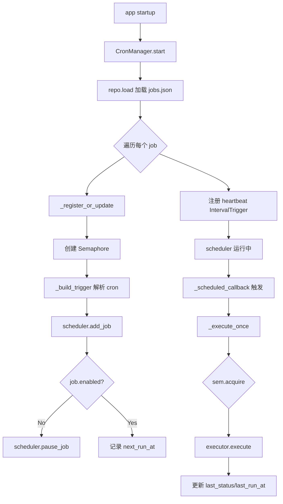
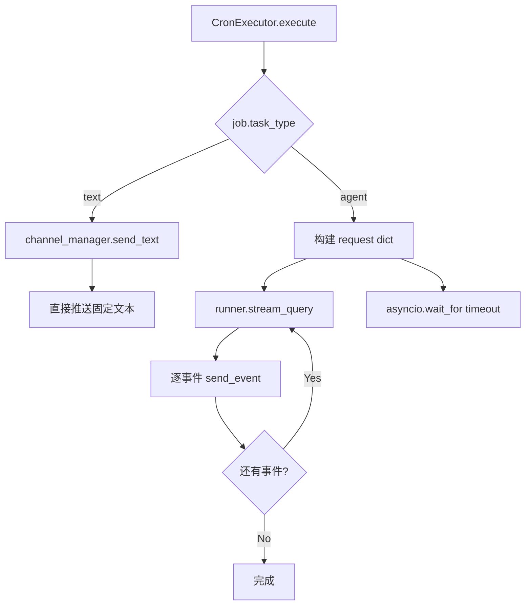

# PD-487.01 CoPaw — APScheduler 异步 Cron 调度与双轨任务执行

> 文档编号：PD-487.01
> 来源：CoPaw `src/copaw/app/crons/`
> GitHub：https://github.com/agentscope-ai/CoPaw.git
> 问题域：PD-487 定时任务调度 Scheduled Task System
> 状态：可复用方案

---

## 第 1 章 问题与动机

### 1.1 核心问题

Agent 系统需要在无人值守时定期执行任务——定时向用户推送 Agent 回复、周期性心跳检查、定时触发数据采集等。核心挑战包括：

1. **调度精度**：支持标准 cron 表达式，精确到分钟级触发
2. **并发安全**：同一任务的多次触发不能并行执行（避免重复推送）
3. **任务类型多样性**：既要支持简单文本推送，也要支持 Agent 推理后流式推送
4. **跨渠道投递**：任务结果需要路由到 Discord、飞书、钉钉、iMessage 等不同渠道
5. **生命周期管理**：任务的创建、暂停、恢复、删除、手动触发需要完整 API
6. **心跳机制**：独立于 cron 任务的周期性 Agent 自检，支持活跃时段窗口

### 1.2 CoPaw 的解法概述

CoPaw 构建了一个完整的 Cron 子系统，核心设计：

1. **APScheduler AsyncIOScheduler** 作为调度引擎，支持 CronTrigger 和 IntervalTrigger 两种触发器（`manager.py:10-11`）
2. **双轨任务类型**：`text` 直接推送固定文本，`agent` 调用 Agent 推理后流式推送结果（`executor.py:38-75`）
3. **Semaphore 并发控制**：每个任务独立的 asyncio.Semaphore 控制最大并发数（`manager.py:29,173-174`）
4. **Repository 模式持久化**：抽象 BaseJobRepository + JsonJobRepository 实现，支持原子写入（`repo/json_repo.py:33-43`）
5. **Heartbeat 独立子系统**：基于 HEARTBEAT.md 文件内容驱动的周期性 Agent 自检，支持活跃时段窗口和跨渠道推送（`heartbeat.py:76-142`）

### 1.3 设计思想

| 设计原则 | 具体实现 | 理由 | 替代方案 |
|----------|----------|------|----------|
| 调度与执行分离 | CronManager 负责调度，CronExecutor 负责执行 | 单一职责，便于独立测试和替换执行策略 | 合并到一个类中 |
| Pydantic 模型驱动 | CronJobSpec 用 Pydantic v2 定义，含 field_validator 和 model_validator | 输入校验前置，cron 表达式在反序列化时即校验 | 运行时手动校验 |
| Repository 抽象 | BaseJobRepository ABC + JsonJobRepository 实现 | 可替换为 Redis/SQLite 后端而不改业务逻辑 | 直接硬编码 JSON 文件操作 |
| 心跳文件驱动 | HEARTBEAT.md 文件内容作为 Agent 查询输入 | 用户可通过编辑文件控制心跳行为，无需重启 | 配置文件中写死查询内容 |
| Fire-and-forget 手动触发 | run_job 用 asyncio.create_task + done_callback | 不阻塞 API 响应，错误通过 push_store 推送到前端 | 同步等待执行完成 |

---

## 第 2 章 源码实现分析

### 2.1 架构概览

CoPaw 的 Cron 子系统由 6 个模块组成，形成清晰的分层架构：

```
┌─────────────────────────────────────────────────────┐
│                  FastAPI Router                      │
│              (api.py: CRUD + 控制端点)                │
├─────────────────────────────────────────────────────┤
│                  CronManager                         │
│    (manager.py: 调度编排 + 状态追踪 + 并发控制)        │
├──────────────┬──────────────┬───────────────────────┤
│ CronExecutor │  Heartbeat   │  console_push_store   │
│ (双轨执行)    │ (周期自检)    │  (错误推送缓冲)        │
├──────────────┴──────────────┴───────────────────────┤
│              APScheduler AsyncIOScheduler             │
│         (CronTrigger + IntervalTrigger)              │
├─────────────────────────────────────────────────────┤
│           BaseJobRepository (ABC)                    │
│         └── JsonJobRepository (原子 JSON)             │
├─────────────────────────────────────────────────────┤
│              Pydantic Models                         │
│  (CronJobSpec, ScheduleSpec, DispatchSpec, etc.)     │
└─────────────────────────────────────────────────────┘
```

### 2.2 核心实现

#### 2.2.1 CronManager 调度核心



对应源码 `src/copaw/app/crons/manager.py:32-78`：

```python
class CronManager:
    def __init__(
        self,
        *,
        repo: BaseJobRepository,
        runner: Any,
        channel_manager: Any,
        timezone: str = "UTC",
    ):
        self._repo = repo
        self._runner = runner
        self._channel_manager = channel_manager
        self._scheduler = AsyncIOScheduler(timezone=timezone)
        self._executor = CronExecutor(
            runner=runner,
            channel_manager=channel_manager,
        )
        self._lock = asyncio.Lock()
        self._states: Dict[str, CronJobState] = {}
        self._rt: Dict[str, _Runtime] = {}
        self._started = False

    async def start(self) -> None:
        async with self._lock:
            if self._started:
                return
            jobs_file = await self._repo.load()
            self._scheduler.start()
            for job in jobs_file.jobs:
                await self._register_or_update(job)
            # heartbeat: interval trigger
            hb = get_heartbeat_config()
            interval_seconds = parse_heartbeat_every(hb.every)
            self._scheduler.add_job(
                self._heartbeat_callback,
                trigger=IntervalTrigger(seconds=interval_seconds),
                id=HEARTBEAT_JOB_ID,
                replace_existing=True,
            )
            self._started = True
```

关键设计点：
- `_lock` 保护启动/停止的原子性（`manager.py:50`）
- `_states` 字典追踪每个任务的运行时状态（`manager.py:51`）
- `_rt` 字典存储每个任务的 Semaphore 运行时（`manager.py:52`）
- heartbeat 作为特殊的 IntervalTrigger 任务注册（`manager.py:66-73`）

#### 2.2.2 双轨任务执行器



对应源码 `src/copaw/app/crons/executor.py:13-75`：

```python
class CronExecutor:
    def __init__(self, *, runner: Any, channel_manager: Any):
        self._runner = runner
        self._channel_manager = channel_manager

    async def execute(self, job: CronJobSpec) -> None:
        target_user_id = job.dispatch.target.user_id
        target_session_id = job.dispatch.target.session_id
        dispatch_meta: Dict[str, Any] = dict(job.dispatch.meta or {})

        if job.task_type == "text" and job.text:
            await self._channel_manager.send_text(
                channel=job.dispatch.channel,
                user_id=target_user_id,
                session_id=target_session_id,
                text=job.text.strip(),
                meta=dispatch_meta,
            )
            return

        # agent: stream_query + send_event
        assert job.request is not None
        req: Dict[str, Any] = job.request.model_dump(mode="json")
        req["user_id"] = target_user_id or "cron"
        req["session_id"] = target_session_id or f"cron:{job.id}"

        async def _run() -> None:
            async for event in self._runner.stream_query(req):
                await self._channel_manager.send_event(
                    channel=job.dispatch.channel,
                    user_id=target_user_id,
                    session_id=target_session_id,
                    event=event,
                    meta=dispatch_meta,
                )

        await asyncio.wait_for(_run(), timeout=job.runtime.timeout_seconds)
```

关键设计点：
- `text` 类型直接调用 `send_text`，零 Agent 开销（`executor.py:38-52`）
- `agent` 类型通过 `stream_query` 流式获取 Agent 回复，逐事件推送到渠道（`executor.py:65-73`）
- `wait_for` 超时保护，默认 120 秒（`executor.py:75`）
- `user_id` 和 `session_id` 从 dispatch target 同步，保证 Agent 上下文一致（`executor.py:62-63`）

### 2.3 实现细节

#### Semaphore 并发控制与状态追踪

`_execute_once` 方法是并发控制和状态追踪的核心（`manager.py:243-273`）：

```python
async def _execute_once(self, job: CronJobSpec) -> None:
    rt = self._rt.get(job.id)
    if not rt:
        rt = _Runtime(sem=asyncio.Semaphore(job.runtime.max_concurrency))
        self._rt[job.id] = rt

    async with rt.sem:
        st = self._states.get(job.id, CronJobState())
        st.last_status = "running"
        self._states[job.id] = st
        try:
            await self._executor.execute(job)
            st.last_status = "success"
            st.last_error = None
        except Exception as e:
            st.last_status = "error"
            st.last_error = repr(e)
            raise
        finally:
            st.last_run_at = datetime.utcnow()
            self._states[job.id] = st
```

状态机转换：`None → running → success/error`，通过 `CronJobState` 四态模型追踪（`models.py:120-126`）。

#### Cron 表达式智能归一化

`ScheduleSpec` 的 `normalize_cron_5_fields` 验证器支持 3/4/5 字段自动补全（`models.py:23-44`）：
- 5 字段：标准 cron（min hour dom month dow）
- 4 字段：自动补 `minute=0`
- 3 字段：自动补 `minute=0, hour=0`
- 6 字段（含秒）：拒绝

#### Fire-and-forget 手动触发

`run_job` 方法使用 `asyncio.create_task` 实现非阻塞触发（`manager.py:119-142`），通过 `_task_done_cb` 回调捕获异常并推送到 `console_push_store`，前端可通过轮询获取错误消息。

#### 原子 JSON 持久化

`JsonJobRepository.save` 使用 tmp+replace 模式实现原子写入（`repo/json_repo.py:33-43`），避免写入中断导致 JSON 损坏。

---

## 第 3 章 迁移指南

### 3.1 迁移清单

**阶段 1：核心调度（最小可用）**
- [ ] 安装 `apscheduler>=3.10`（APScheduler 3.x AsyncIOScheduler）
- [ ] 定义 Pydantic 模型：`CronJobSpec`、`ScheduleSpec`、`DispatchSpec`、`JobRuntimeSpec`
- [ ] 实现 `CronManager`：初始化 AsyncIOScheduler + 注册/移除任务
- [ ] 实现 `CronExecutor`：至少支持一种任务类型（text 或 agent）

**阶段 2：持久化与 API**
- [ ] 实现 `BaseJobRepository` 抽象 + 至少一种后端（JSON/SQLite/Redis）
- [ ] 添加 FastAPI Router：CRUD + pause/resume/run 端点
- [ ] 集成到 app lifespan：startup 时 `cron_manager.start()`，shutdown 时 `cron_manager.stop()`

**阶段 3：心跳与增强**
- [ ] 实现 Heartbeat 子系统：文件驱动查询 + 活跃时段窗口
- [ ] 添加 console_push_store 错误推送机制
- [ ] 添加 misfire_grace_time 配置

### 3.2 适配代码模板

以下是一个可直接运行的最小 Cron 调度器模板：

```python
"""Minimal cron scheduler template based on CoPaw's architecture."""
from __future__ import annotations

import asyncio
import json
import logging
from dataclasses import dataclass
from datetime import datetime
from pathlib import Path
from typing import Any, Dict, Literal, Optional

from apscheduler.schedulers.asyncio import AsyncIOScheduler
from apscheduler.triggers.cron import CronTrigger
from pydantic import BaseModel, Field, field_validator

logger = logging.getLogger(__name__)


# --- Models ---
class ScheduleSpec(BaseModel):
    cron: str
    timezone: str = "UTC"

    @field_validator("cron")
    @classmethod
    def validate_5_fields(cls, v: str) -> str:
        parts = v.split()
        if len(parts) != 5:
            raise ValueError(f"cron must have 5 fields, got {len(parts)}")
        return " ".join(parts)


class JobRuntimeSpec(BaseModel):
    max_concurrency: int = Field(default=1, ge=1)
    timeout_seconds: int = Field(default=120, ge=1)
    misfire_grace_seconds: int = Field(default=60, ge=0)


class CronJobSpec(BaseModel):
    id: str
    name: str
    enabled: bool = True
    schedule: ScheduleSpec
    task_type: Literal["text", "agent"] = "agent"
    text: Optional[str] = None
    prompt: Optional[str] = None
    runtime: JobRuntimeSpec = Field(default_factory=JobRuntimeSpec)


class CronJobState(BaseModel):
    next_run_at: Optional[datetime] = None
    last_run_at: Optional[datetime] = None
    last_status: Optional[Literal["success", "error", "running"]] = None
    last_error: Optional[str] = None


# --- Repository ---
class JsonJobRepo:
    def __init__(self, path: Path):
        self._path = path

    async def load(self) -> list[CronJobSpec]:
        if not self._path.exists():
            return []
        data = json.loads(self._path.read_text())
        return [CronJobSpec.model_validate(j) for j in data.get("jobs", [])]

    async def save(self, jobs: list[CronJobSpec]) -> None:
        self._path.parent.mkdir(parents=True, exist_ok=True)
        tmp = self._path.with_suffix(".tmp")
        payload = {"version": 1, "jobs": [j.model_dump(mode="json") for j in jobs]}
        tmp.write_text(json.dumps(payload, indent=2))
        tmp.replace(self._path)


# --- Manager ---
@dataclass
class _Runtime:
    sem: asyncio.Semaphore


class CronScheduler:
    def __init__(self, repo: JsonJobRepo, execute_fn: Any):
        self._repo = repo
        self._execute_fn = execute_fn  # async def execute(job: CronJobSpec)
        self._scheduler = AsyncIOScheduler(timezone="UTC")
        self._states: Dict[str, CronJobState] = {}
        self._rt: Dict[str, _Runtime] = {}

    async def start(self) -> None:
        jobs = await self._repo.load()
        self._scheduler.start()
        for job in jobs:
            self._register(job)

    def _register(self, spec: CronJobSpec) -> None:
        self._rt[spec.id] = _Runtime(sem=asyncio.Semaphore(spec.runtime.max_concurrency))
        parts = spec.schedule.cron.split()
        trigger = CronTrigger(
            minute=parts[0], hour=parts[1], day=parts[2],
            month=parts[3], day_of_week=parts[4],
            timezone=spec.schedule.timezone,
        )
        self._scheduler.add_job(
            self._callback, trigger=trigger, id=spec.id,
            args=[spec], misfire_grace_time=spec.runtime.misfire_grace_seconds,
            replace_existing=True,
        )
        if not spec.enabled:
            self._scheduler.pause_job(spec.id)

    async def _callback(self, job: CronJobSpec) -> None:
        rt = self._rt.get(job.id)
        if not rt:
            return
        async with rt.sem:
            st = self._states.get(job.id, CronJobState())
            st.last_status = "running"
            self._states[job.id] = st
            try:
                await asyncio.wait_for(
                    self._execute_fn(job),
                    timeout=job.runtime.timeout_seconds,
                )
                st.last_status = "success"
                st.last_error = None
            except Exception as e:
                st.last_status = "error"
                st.last_error = repr(e)
            finally:
                st.last_run_at = datetime.utcnow()

    def stop(self) -> None:
        self._scheduler.shutdown(wait=False)
```

### 3.3 适用场景

| 场景 | 适用度 | 说明 |
|------|--------|------|
| Agent 定时推送（日报/周报） | ⭐⭐⭐ | 核心场景，agent 类型 + 渠道路由 |
| 定时提醒/通知 | ⭐⭐⭐ | text 类型直接推送，零 Agent 开销 |
| 周期性数据采集 | ⭐⭐ | 需扩展 task_type 支持自定义执行器 |
| 心跳健康检查 | ⭐⭐⭐ | Heartbeat 子系统直接可用 |
| 高频调度（秒级） | ⭐ | APScheduler 3.x 不支持秒级 cron，需用 IntervalTrigger |
| 分布式多实例 | ⭐ | 当前 JSON 持久化不支持跨进程锁，需替换为 Redis 后端 |

---

## 第 4 章 测试用例

```python
"""Tests for CoPaw cron scheduling system."""
import asyncio
import json
from datetime import datetime
from pathlib import Path
from unittest.mock import AsyncMock, MagicMock, patch

import pytest
from pydantic import ValidationError


# --- ScheduleSpec validation tests ---
class TestScheduleSpec:
    def test_valid_5_field_cron(self):
        """Standard 5-field cron expression passes validation."""
        from copaw.app.crons.models import ScheduleSpec
        spec = ScheduleSpec(cron="*/5 * * * *")
        assert spec.cron == "*/5 * * * *"

    def test_4_field_auto_normalize(self):
        """4-field cron auto-prepends minute=0."""
        from copaw.app.crons.models import ScheduleSpec
        spec = ScheduleSpec(cron="9 * * 1-5")
        assert spec.cron == "0 9 * * 1-5"

    def test_6_field_rejected(self):
        """6-field cron (with seconds) is rejected."""
        from copaw.app.crons.models import ScheduleSpec
        with pytest.raises(ValidationError):
            ScheduleSpec(cron="0 */5 * * * *")

    def test_invalid_field_count(self):
        """2-field cron is rejected."""
        from copaw.app.crons.models import ScheduleSpec
        with pytest.raises(ValidationError):
            ScheduleSpec(cron="* *")


# --- Heartbeat interval parsing ---
class TestHeartbeatParsing:
    def test_parse_30m(self):
        from copaw.app.crons.heartbeat import parse_heartbeat_every
        assert parse_heartbeat_every("30m") == 1800

    def test_parse_1h(self):
        from copaw.app.crons.heartbeat import parse_heartbeat_every
        assert parse_heartbeat_every("1h") == 3600

    def test_parse_2h30m(self):
        from copaw.app.crons.heartbeat import parse_heartbeat_every
        assert parse_heartbeat_every("2h30m") == 9000

    def test_parse_empty_defaults_30m(self):
        from copaw.app.crons.heartbeat import parse_heartbeat_every
        assert parse_heartbeat_every("") == 1800

    def test_parse_invalid_defaults_30m(self):
        from copaw.app.crons.heartbeat import parse_heartbeat_every
        assert parse_heartbeat_every("xyz") == 1800


# --- CronJobSpec model validation ---
class TestCronJobSpec:
    def test_text_job_requires_text(self):
        """task_type=text with empty text raises ValidationError."""
        from copaw.app.crons.models import CronJobSpec, DispatchTarget, DispatchSpec
        with pytest.raises(ValidationError):
            CronJobSpec(
                id="t1", name="test", task_type="text", text="",
                schedule={"cron": "0 9 * * *"},
                dispatch=DispatchSpec(
                    target=DispatchTarget(user_id="u1", session_id="s1"),
                ),
            )

    def test_agent_job_syncs_user_id(self):
        """agent job syncs request.user_id with dispatch.target.user_id."""
        from copaw.app.crons.models import (
            CronJobSpec, CronJobRequest, DispatchTarget, DispatchSpec,
        )
        job = CronJobSpec(
            id="a1", name="test", task_type="agent",
            request=CronJobRequest(input=[{"role": "user", "content": "hi"}]),
            schedule={"cron": "0 9 * * *"},
            dispatch=DispatchSpec(
                target=DispatchTarget(user_id="target_user", session_id="target_sess"),
            ),
        )
        assert job.request.user_id == "target_user"
        assert job.request.session_id == "target_sess"


# --- JsonJobRepository atomic write ---
class TestJsonJobRepository:
    @pytest.mark.asyncio
    async def test_atomic_save_and_load(self, tmp_path: Path):
        from copaw.app.crons.repo.json_repo import JsonJobRepository
        from copaw.app.crons.models import JobsFile, CronJobSpec, DispatchTarget, DispatchSpec
        repo = JsonJobRepository(tmp_path / "jobs.json")
        spec = CronJobSpec(
            id="j1", name="daily", task_type="text", text="hello",
            schedule={"cron": "0 9 * * *"},
            dispatch=DispatchSpec(
                target=DispatchTarget(user_id="u1", session_id="s1"),
            ),
        )
        await repo.upsert_job(spec)
        loaded = await repo.load()
        assert len(loaded.jobs) == 1
        assert loaded.jobs[0].id == "j1"

    @pytest.mark.asyncio
    async def test_delete_nonexistent_returns_false(self, tmp_path: Path):
        from copaw.app.crons.repo.json_repo import JsonJobRepository
        repo = JsonJobRepository(tmp_path / "jobs.json")
        assert await repo.delete_job("nonexistent") is False


# --- Semaphore concurrency control ---
class TestConcurrencyControl:
    @pytest.mark.asyncio
    async def test_semaphore_limits_concurrency(self):
        """Semaphore(1) ensures only one execution at a time."""
        sem = asyncio.Semaphore(1)
        running = []

        async def task(name: str):
            async with sem:
                running.append(name)
                assert len(running) <= 1, "Concurrent execution detected!"
                await asyncio.sleep(0.05)
                running.remove(name)

        await asyncio.gather(task("a"), task("b"), task("c"))
```

---

## 第 5 章 跨域关联

| 关联域 | 关系类型 | 说明 |
|--------|----------|------|
| PD-01 上下文管理 | 协同 | Heartbeat 的 HEARTBEAT.md 查询内容需要在 Agent 上下文窗口内；agent 类型任务的 stream_query 会消耗上下文 |
| PD-03 容错与重试 | 依赖 | `_execute_once` 的 try/except + 状态追踪是容错的基础；`wait_for` 超时保护防止任务挂起；`misfire_grace_time` 处理错过的触发 |
| PD-04 工具系统 | 协同 | agent 类型任务通过 `runner.stream_query` 调用 Agent，Agent 内部可能使用 MCP 工具 |
| PD-06 记忆持久化 | 协同 | JsonJobRepository 的原子 JSON 持久化模式可复用于其他需要持久化的子系统 |
| PD-10 中间件管道 | 协同 | CronExecutor 的 stream_query → send_event 流式管道模式与中间件管道设计理念一致 |
| PD-11 可观测性 | 依赖 | CronJobState 四态追踪 + console_push_store 错误推送是可观测性的基础设施 |
| PD-485 多渠道消息 | 强依赖 | Dispatch 机制完全依赖 channel_manager 的多渠道路由能力（Discord/飞书/钉钉/iMessage/Console） |

---

## 第 6 章 来源文件索引

| 文件 | 行范围 | 关键实现 |
|------|--------|----------|
| `src/copaw/app/crons/manager.py` | L1-L274 | CronManager 调度核心：start/stop、注册/删除、并发控制、状态追踪 |
| `src/copaw/app/crons/executor.py` | L1-L76 | CronExecutor 双轨执行器：text 直推 + agent 流式推送 |
| `src/copaw/app/crons/heartbeat.py` | L1-L143 | Heartbeat 子系统：间隔解析、活跃时段窗口、HEARTBEAT.md 驱动 |
| `src/copaw/app/crons/models.py` | L1-L132 | Pydantic 模型：CronJobSpec、ScheduleSpec、DispatchSpec、CronJobState |
| `src/copaw/app/crons/api.py` | L1-L112 | FastAPI Router：CRUD + pause/resume/run 端点 |
| `src/copaw/app/crons/repo/base.py` | L1-L54 | BaseJobRepository ABC：load/save/upsert/delete 抽象 |
| `src/copaw/app/crons/repo/json_repo.py` | L1-L44 | JsonJobRepository：原子 tmp+replace JSON 持久化 |
| `src/copaw/app/console_push_store.py` | L1-L75 | 内存推送缓冲：bounded list + age-based 清理 |
| `src/copaw/config/config.py` | L79-L97 | HeartbeatConfig + ActiveHoursConfig 配置模型 |
| `src/copaw/app/_app.py` | L70-L130 | App lifespan：CronManager 初始化与优雅关闭 |

---

## 第 7 章 横向对比维度

```json comparison_data
{
  "project": "CoPaw",
  "dimensions": {
    "调度引擎": "APScheduler 3.x AsyncIOScheduler，CronTrigger + IntervalTrigger 双触发器",
    "任务类型": "双轨：text 直推固定文本 + agent 流式 stream_query 推送",
    "并发控制": "per-job asyncio.Semaphore，max_concurrency 可配置",
    "持久化方式": "Repository 模式 + JsonJobRepository 原子 tmp+replace 写入",
    "心跳机制": "独立 IntervalTrigger + HEARTBEAT.md 文件驱动 + 活跃时段窗口",
    "任务生命周期": "完整 CRUD + pause/resume/run API，四态状态追踪",
    "错误推送": "console_push_store 内存缓冲 + 前端轮询获取",
    "Cron 表达式": "5 字段标准 + 3/4 字段自动归一化，拒绝秒级"
  }
}
```

### 域元数据补充

```json domain_metadata
{
  "solution_summary": "CoPaw 用 APScheduler AsyncIOScheduler 双触发器（CronTrigger+IntervalTrigger）实现 text/agent 双轨定时任务，per-job Semaphore 并发控制，HEARTBEAT.md 文件驱动周期自检",
  "description": "Agent 系统中定时任务的完整生命周期管理与多渠道结果投递",
  "sub_problems": [
    "Cron 表达式多字段自动归一化（3/4/5 字段兼容）",
    "Fire-and-forget 手动触发与异步错误回传",
    "任务持久化的 Repository 抽象与原子写入"
  ],
  "best_practices": [
    "Repository 模式抽象持久化后端，tmp+replace 原子写入防损坏",
    "HEARTBEAT.md 文件驱动心跳查询，编辑文件即可热更新无需重启",
    "console_push_store 内存缓冲异步错误推送到前端"
  ]
}
```
