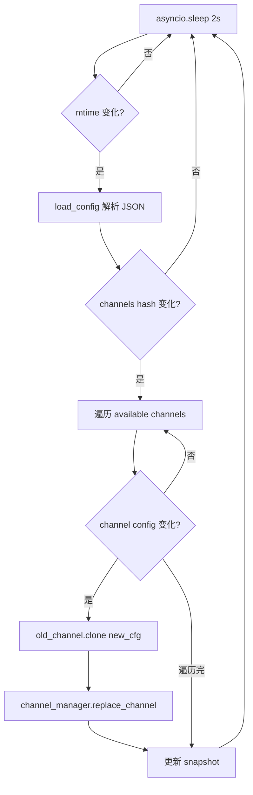
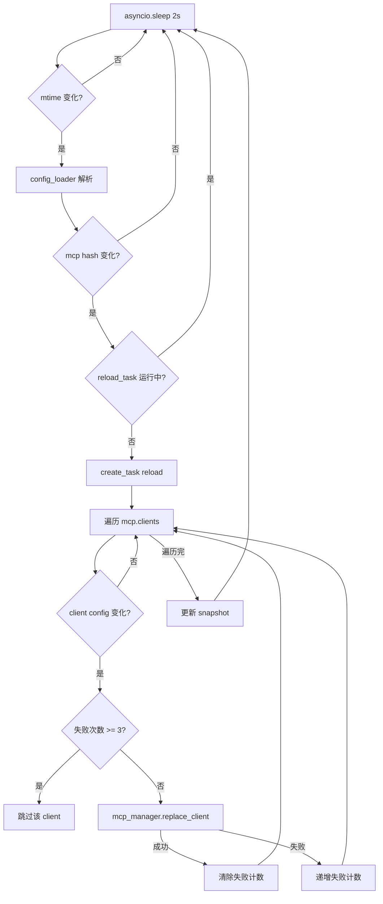
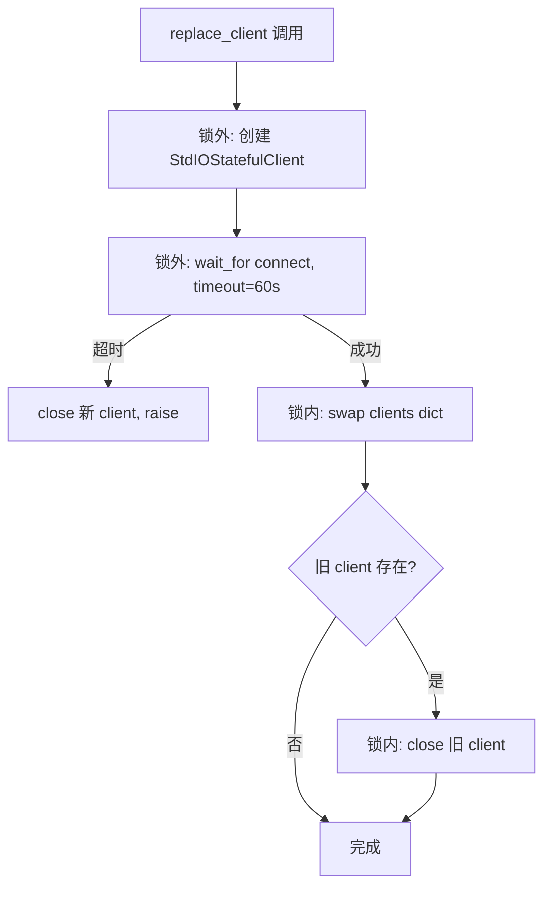

# PD-488.01 CoPaw — 双 Watcher 轮询差异热重载

> 文档编号：PD-488.01
> 来源：CoPaw `src/copaw/config/watcher.py` `src/copaw/app/mcp/watcher.py`
> GitHub：https://github.com/agentscope-ai/CoPaw.git
> 问题域：PD-488 配置热重载 Configuration Hot Reload
> 状态：可复用方案

---

## 第 1 章 问题与动机

### 1.1 核心问题

多渠道 AI Agent 应用（如同时接入 Discord、飞书、钉钉、iMessage 等）在运行时需要频繁调整配置：新增渠道、修改 Bot Token、启用/禁用 MCP 工具客户端等。传统做法是修改 `config.json` 后重启整个进程，但这会导致：

- 所有渠道的 WebSocket/长连接断开，用户侧感知到服务中断
- MCP 工具客户端（如 Tavily 搜索）的 stdio 子进程被杀死后重建耗时
- 正在处理的 Agent 请求被中断，丢失上下文
- 多人协作场景下，一个渠道的配置变更影响所有渠道

核心需求：**修改 config.json 后，仅重载变更的组件，其他组件零中断继续运行**。

### 1.2 CoPaw 的解法概述

CoPaw 采用**双 Watcher 独立轮询**架构，将 Channel 热重载和 MCP 热重载解耦为两个独立的异步轮询器：

1. **ConfigWatcher**（`src/copaw/config/watcher.py:22`）— 监听 `config.json` 的 `channels` 段，逐渠道 diff 后仅重载变更的 Channel
2. **MCPConfigWatcher**（`src/copaw/app/mcp/watcher.py:26`）— 监听 `config.json` 的 `mcp` 段，逐客户端 diff 后仅重载变更的 MCP 客户端
3. **两层快速拒绝**：先 mtime 检测文件是否被修改，再 hash 检测目标配置段是否真正变化，避免无效解析
4. **connect-then-swap 模式**：新组件在锁外完成连接/启动，仅在 swap 瞬间持锁，最小化不可用窗口
5. **per-client 失败追踪**：MCPConfigWatcher 为每个客户端独立计数失败次数，达到上限后跳过，配置变更时自动重置

### 1.3 设计思想

| 设计原则 | 具体实现 | 理由 | 替代方案 |
|----------|----------|------|----------|
| 关注点分离 | Channel 和 MCP 各自独立 Watcher | 两类组件生命周期不同（Channel 有 WebSocket，MCP 有 stdio 子进程），独立管理降低耦合 | 单一 Watcher 统一管理所有组件 |
| 两层快速拒绝 | mtime → hash → diff | mtime 是 O(1) 系统调用，hash 避免 JSON 解析，逐层过滤减少无效工作 | inotify/FSEvents 文件系统事件 |
| 锁外预热 | 新 Channel/Client 在锁外 start/connect，锁内仅 swap+stop | 连接可能耗时数秒（如 DingTalk stream），锁外预热避免阻塞其他操作 | 锁内完成全部操作 |
| 失败隔离 | per-client 失败计数 + hash 绑定 | 一个 MCP 客户端连接失败不影响其他客户端，配置修改后自动重置计数 | 全局重试计数器 |
| 快照对比 | Pydantic model_dump → JSON 字符串 hash | 利用 Pydantic 的序列化保证字段顺序一致，hash 比较 O(1) | deepdiff 库逐字段对比 |

---

## 第 2 章 源码实现分析

### 2.1 架构概览

CoPaw 的配置热重载由两个独立的 Watcher 和两个 Manager 组成，在 FastAPI lifespan 中启动：

```
┌─────────────────────────────────────────────────────────────┐
│                    FastAPI Lifespan                          │
│                  (_app.py:49-138)                            │
│                                                             │
│  ┌──────────────┐          ┌───────────────────┐            │
│  │ ConfigWatcher │          │ MCPConfigWatcher  │            │
│  │ (poll=2s)     │          │ (poll=2s)          │           │
│  │ config/       │          │ app/mcp/           │           │
│  │ watcher.py    │          │ watcher.py         │           │
│  └──────┬───────┘          └────────┬──────────┘            │
│         │                           │                        │
│    channels diff               mcp.clients diff              │
│         │                           │                        │
│  ┌──────▼───────┐          ┌────────▼──────────┐            │
│  │ChannelManager│          │ MCPClientManager   │            │
│  │ replace_      │          │ replace_client()   │           │
│  │ channel()     │          │ remove_client()    │           │
│  └──────────────┘          └───────────────────┘            │
│                                                             │
│  共享: config.json (单文件, Pydantic Config 模型)             │
└─────────────────────────────────────────────────────────────┘
```

两个 Watcher 读同一个 `config.json`，但各自只关心自己的配置段（`channels` vs `mcp`），互不干扰。

### 2.2 核心实现

#### 2.2.1 ConfigWatcher — Channel 热重载



对应源码 `src/copaw/config/watcher.py:95-178`：

```python
async def _check(self) -> None:
    # 1) Check mtime
    try:
        mtime = self._config_path.stat().st_mtime
    except FileNotFoundError:
        return
    if mtime == self._last_mtime:
        return
    self._last_mtime = mtime

    # 2) Load new config; quick-reject if channels section unchanged
    try:
        config = load_config(self._config_path)
    except Exception:
        logger.exception("ConfigWatcher: failed to parse config.json")
        return

    new_hash = self._channels_hash(config.channels)
    if new_hash == self._last_channels_hash:
        return  # Only non-channel fields changed

    # 3) Diff per-channel and reload changed ones
    new_channels = config.channels
    old_channels = self._last_channels

    for name in get_available_channels():
        new_ch = getattr(new_channels, name, None)
        old_ch = getattr(old_channels, name, None) if old_channels else None
        # ... model_dump 对比 ...
        if new_dump is not None and new_dump == old_dump:
            continue

        old_channel = await self._channel_manager.get_channel(name)
        new_channel = old_channel.clone(new_ch)
        await self._channel_manager.replace_channel(new_channel)

    # 4) Update snapshot
    self._last_channels = new_channels.model_copy(deep=True)
    self._last_channels_hash = self._channels_hash(new_channels)
```

关键设计点：
- `_channels_hash`（`watcher.py:83-85`）使用 `hash(str(channels.model_dump(mode="json")))` 做快速变更检测
- `clone()`（`base.py:694-705`）通过 `from_config()` 工厂方法创建新实例，保留 `_process` 和 `_on_reply_sent` 回调
- 失败时保留旧 snapshot（`watcher.py:174`），下次配置变更时自动重试

#### 2.2.2 MCPConfigWatcher — MCP 客户端热重载



对应源码 `src/copaw/app/mcp/watcher.py:151-190`：

```python
async def _check(self) -> None:
    # 1) Check mtime if config path is provided
    if self._config_path:
        try:
            mtime = self._config_path.stat().st_mtime
        except FileNotFoundError:
            return
        if mtime == self._last_mtime:
            return
        self._last_mtime = mtime

    # 2) Load new config; quick-reject if MCP section unchanged
    try:
        new_mcp = self._load_mcp_config()
    except Exception:
        return

    new_hash = self._mcp_hash(new_mcp)
    if new_hash == self._last_mcp_hash:
        return

    # 3) Check if previous reload is still running
    if self._reload_task and not self._reload_task.done():
        return  # Skip, previous reload still in progress

    # 4) Trigger non-blocking reload in background task
    self._reload_task = asyncio.create_task(
        self._reload_changed_clients_wrapper(new_mcp),
        name="mcp_reload_task",
    )
```

#### 2.2.3 MCPClientManager — connect-then-swap 模式



对应源码 `src/copaw/app/mcp/manager.py:75-134`：

```python
async def replace_client(
    self, key: str, client_config: "MCPClientConfig", timeout: float = 60.0,
) -> None:
    # 1. Create and connect new client outside lock (may be slow)
    new_client = StdIOStatefulClient(
        name=client_config.name,
        command=client_config.command,
        args=client_config.args,
        env=client_config.env,
    )
    try:
        await asyncio.wait_for(new_client.connect(), timeout=timeout)
    except (asyncio.TimeoutError, Exception) as e:
        try:
            await new_client.close()
        except Exception:
            pass
        raise

    # 2. Swap and close old client inside lock
    async with self._lock:
        old_client = self._clients.get(key)
        self._clients[key] = new_client
        if old_client is not None:
            try:
                await old_client.close()
            except Exception as e:
                logger.warning(f"Error closing old MCP client '{key}': {e}")
```

### 2.3 实现细节

**Lifespan 启动顺序**（`_app.py:49-114`）：

1. `runner.start()` — Agent 推理引擎
2. `MCPClientManager.init_from_config()` — MCP 客户端初始化
3. `ChannelManager.from_config()` + `start_all()` — 渠道启动
4. `ConfigWatcher.start()` — Channel 热重载 Watcher
5. `MCPConfigWatcher.start()` — MCP 热重载 Watcher

**关闭顺序**（`_app.py:119-138`）：watchers → cron → channels → mcp → runner，确保 Watcher 先停止避免关闭期间触发重载。

**Channel clone 机制**（`base.py:694-705`）：`BaseChannel.clone()` 调用子类的 `from_config()` 工厂方法，传入当前实例的 `_process`（Agent 处理函数）和 `_on_reply_sent` 回调，确保新 Channel 实例继承运行时上下文。

**ChannelManager.replace_channel 的锁外预热**（`manager.py:363-426`）：
- 锁外：为新 Channel 设置 queue 和 enqueue 回调，调用 `start()`（可能涉及 WebSocket 连接）
- 锁内：swap 列表中的 Channel 引用，stop 旧 Channel
- 如果 start 失败，立即 stop 并 raise，不影响旧 Channel

**per-client 失败追踪**（`mcp/watcher.py:262-318`）：
- `_client_failures` 字典记录 `{client_key: (retry_count, last_config_hash)}`
- 同一配置 hash 下失败 3 次后跳过该客户端
- 用户修改配置（hash 变化）时自动重置计数，允许重新尝试
- 成功重载后清除失败记录

---

## 第 3 章 迁移指南

### 3.1 迁移清单

**阶段 1：基础设施（配置模型 + 加载器）**

- [ ] 定义 Pydantic 配置模型，确保 `model_dump(mode="json")` 输出稳定
- [ ] 实现 `load_config()` 函数，从 JSON 文件加载并验证配置
- [ ] 确保配置模型支持 `model_copy(deep=True)` 用于快照

**阶段 2：Manager 层（组件生命周期管理）**

- [ ] 为每类可热重载组件实现 Manager，提供 `replace_xxx()` 和 `remove_xxx()` 方法
- [ ] Manager 内部使用 `asyncio.Lock` 保护组件字典
- [ ] `replace` 方法遵循 connect-then-swap：锁外连接新组件，锁内 swap+关闭旧组件

**阶段 3：Watcher 层（变更检测 + 差异重载）**

- [ ] 实现 Watcher 类，包含 mtime 检测 → hash 快速拒绝 → 逐组件 diff 三层过滤
- [ ] Watcher 通过 `asyncio.create_task` 启动轮询循环
- [ ] 可选：为长耗时重载操作使用后台 task，避免阻塞轮询

**阶段 4：集成（Lifespan 注册）**

- [ ] 在应用 lifespan 中按顺序启动 Manager → Watcher
- [ ] 关闭时先停 Watcher 再停 Manager，避免关闭期间触发重载

### 3.2 适配代码模板

以下是一个通用的配置热重载框架，可直接复用：

```python
"""Generic config hot-reload framework inspired by CoPaw."""

from __future__ import annotations

import asyncio
import logging
from pathlib import Path
from typing import Callable, Dict, Generic, Optional, TypeVar

from pydantic import BaseModel

logger = logging.getLogger(__name__)

T = TypeVar("T")  # Component type
C = TypeVar("C", bound=BaseModel)  # Config type


class ComponentManager(Generic[T]):
    """Manages hot-reloadable components with connect-then-swap pattern."""

    def __init__(self) -> None:
        self._components: Dict[str, T] = {}
        self._lock = asyncio.Lock()

    async def replace(
        self,
        key: str,
        factory: Callable[[], T],
        starter: Callable[[T], asyncio.coroutine],
        stopper: Callable[[T], asyncio.coroutine],
        timeout: float = 60.0,
    ) -> None:
        # 1. Create + start outside lock
        new_comp = factory()
        try:
            await asyncio.wait_for(starter(new_comp), timeout=timeout)
        except Exception:
            try:
                await stopper(new_comp)
            except Exception:
                pass
            raise

        # 2. Swap + stop old inside lock
        async with self._lock:
            old_comp = self._components.get(key)
            self._components[key] = new_comp
        if old_comp is not None:
            try:
                await stopper(old_comp)
            except Exception:
                logger.warning(f"Failed to stop old component '{key}'")

    async def remove(self, key: str, stopper: Callable) -> None:
        async with self._lock:
            old = self._components.pop(key, None)
        if old is not None:
            await stopper(old)

    async def get_all(self) -> list:
        async with self._lock:
            return list(self._components.values())


class ConfigSectionWatcher(Generic[C]):
    """Watch a specific section of a JSON config file for changes."""

    def __init__(
        self,
        config_path: Path,
        section_loader: Callable[[], C],
        on_change: Callable[[C, Optional[C]], asyncio.coroutine],
        poll_interval: float = 2.0,
    ):
        self._config_path = config_path
        self._section_loader = section_loader
        self._on_change = on_change
        self._poll_interval = poll_interval
        self._task: Optional[asyncio.Task] = None
        self._last_mtime: float = 0.0
        self._last_hash: Optional[int] = None
        self._last_snapshot: Optional[C] = None

    async def start(self) -> None:
        self._snapshot()
        self._task = asyncio.create_task(self._poll_loop())

    async def stop(self) -> None:
        if self._task:
            self._task.cancel()
            try:
                await self._task
            except asyncio.CancelledError:
                pass

    def _snapshot(self) -> None:
        try:
            self._last_mtime = self._config_path.stat().st_mtime
        except FileNotFoundError:
            self._last_mtime = 0.0
        try:
            section = self._section_loader()
            self._last_snapshot = section.model_copy(deep=True)
            self._last_hash = hash(str(section.model_dump(mode="json")))
        except Exception:
            pass

    async def _poll_loop(self) -> None:
        while True:
            try:
                await asyncio.sleep(self._poll_interval)
                await self._check()
            except asyncio.CancelledError:
                raise
            except Exception:
                logger.exception("Config watcher poll failed")

    async def _check(self) -> None:
        # Layer 1: mtime
        try:
            mtime = self._config_path.stat().st_mtime
        except FileNotFoundError:
            return
        if mtime == self._last_mtime:
            return
        self._last_mtime = mtime

        # Layer 2: hash
        try:
            new_section = self._section_loader()
        except Exception:
            return
        new_hash = hash(str(new_section.model_dump(mode="json")))
        if new_hash == self._last_hash:
            return

        # Layer 3: trigger change handler
        old_snapshot = self._last_snapshot
        await self._on_change(new_section, old_snapshot)
        self._last_snapshot = new_section.model_copy(deep=True)
        self._last_hash = new_hash
```

### 3.3 适用场景

| 场景 | 适用度 | 说明 |
|------|--------|------|
| 多渠道 Bot 运行时切换 | ⭐⭐⭐ | 完美匹配：逐渠道 diff + clone 替换 |
| MCP/工具客户端动态管理 | ⭐⭐⭐ | 完美匹配：per-client 独立重载 + 失败隔离 |
| 微服务配置中心集成 | ⭐⭐ | 需将轮询改为 watch/webhook 回调 |
| 高频配置变更（<1s） | ⭐ | 轮询间隔 2s 有延迟，需改用 inotify/FSEvents |
| 分布式多实例同步 | ⭐ | 仅支持单文件本地轮询，需额外分布式协调 |

---

## 第 4 章 测试用例

```python
"""Tests for CoPaw-style config hot-reload pattern."""

import asyncio
import json
import tempfile
from pathlib import Path
from unittest.mock import AsyncMock, MagicMock, patch

import pytest
from pydantic import BaseModel, Field
from typing import Dict


# --- Test config models ---
class ClientConfig(BaseModel):
    name: str
    enabled: bool = True
    command: str = "echo"
    args: list = Field(default_factory=list)

class SectionConfig(BaseModel):
    clients: Dict[str, ClientConfig] = Field(default_factory=dict)


class TestMtimeDetection:
    """Test Layer 1: mtime-based file change detection."""

    def test_no_change_when_mtime_same(self, tmp_path):
        config_file = tmp_path / "config.json"
        config_file.write_text('{"clients": {}}')
        mtime = config_file.stat().st_mtime
        # Same mtime → no reload triggered
        assert config_file.stat().st_mtime == mtime

    def test_mtime_changes_on_write(self, tmp_path):
        import time
        config_file = tmp_path / "config.json"
        config_file.write_text('{"clients": {}}')
        mtime1 = config_file.stat().st_mtime
        time.sleep(0.05)
        config_file.write_text('{"clients": {"a": {"name": "a", "command": "x"}}}')
        mtime2 = config_file.stat().st_mtime
        assert mtime2 > mtime1

    def test_missing_file_returns_zero(self, tmp_path):
        missing = tmp_path / "nonexistent.json"
        with pytest.raises(FileNotFoundError):
            missing.stat()


class TestHashQuickReject:
    """Test Layer 2: hash-based quick rejection."""

    def test_same_config_same_hash(self):
        cfg1 = SectionConfig(clients={"a": ClientConfig(name="a")})
        cfg2 = SectionConfig(clients={"a": ClientConfig(name="a")})
        h1 = hash(str(cfg1.model_dump(mode="json")))
        h2 = hash(str(cfg2.model_dump(mode="json")))
        assert h1 == h2

    def test_different_config_different_hash(self):
        cfg1 = SectionConfig(clients={"a": ClientConfig(name="a")})
        cfg2 = SectionConfig(clients={"a": ClientConfig(name="b")})
        h1 = hash(str(cfg1.model_dump(mode="json")))
        h2 = hash(str(cfg2.model_dump(mode="json")))
        assert h1 != h2

    def test_non_target_section_change_rejected(self):
        """Changes outside target section should not trigger reload."""
        cfg1 = SectionConfig(clients={"a": ClientConfig(name="a")})
        cfg2 = SectionConfig(clients={"a": ClientConfig(name="a")})
        # Even if other fields in root config change, section hash stays same
        assert hash(str(cfg1.model_dump(mode="json"))) == hash(str(cfg2.model_dump(mode="json")))


class TestPerClientDiff:
    """Test Layer 3: per-component diff and selective reload."""

    def test_only_changed_client_reloaded(self):
        old = {"a": ClientConfig(name="a", command="old"), "b": ClientConfig(name="b")}
        new = {"a": ClientConfig(name="a", command="new"), "b": ClientConfig(name="b")}
        changed = [k for k in new if old.get(k) != new[k]]
        assert changed == ["a"]

    def test_new_client_detected(self):
        old = {"a": ClientConfig(name="a")}
        new = {"a": ClientConfig(name="a"), "b": ClientConfig(name="b")}
        added = [k for k in new if k not in old]
        assert added == ["b"]

    def test_removed_client_detected(self):
        old = {"a": ClientConfig(name="a"), "b": ClientConfig(name="b")}
        new = {"a": ClientConfig(name="a")}
        removed = [k for k in old if k not in new]
        assert removed == ["b"]


class TestFailureTracking:
    """Test per-client failure tracking (MCPConfigWatcher pattern)."""

    def test_failure_count_increments(self):
        failures: Dict[str, tuple] = {}
        key, config_hash = "client_a", 12345
        # First failure
        failures[key] = (1, config_hash)
        assert failures[key][0] == 1
        # Second failure (same hash)
        old_count, old_hash = failures[key]
        new_count = old_count + 1 if old_hash == config_hash else 1
        failures[key] = (new_count, config_hash)
        assert failures[key][0] == 2

    def test_config_change_resets_count(self):
        failures = {"client_a": (3, 12345)}
        new_hash = 99999  # Config changed
        old_count, old_hash = failures["client_a"]
        new_count = old_count + 1 if old_hash == new_hash else 1
        failures["client_a"] = (new_count, new_hash)
        assert failures["client_a"][0] == 1  # Reset to 1

    def test_skip_after_max_retries(self):
        max_retries = 3
        failures = {"client_a": (3, 12345)}
        key, config_hash = "client_a", 12345
        retry_count, last_hash = failures[key]
        should_skip = last_hash == config_hash and retry_count >= max_retries
        assert should_skip is True


class TestConnectThenSwap:
    """Test connect-then-swap pattern for minimal downtime."""

    @pytest.mark.asyncio
    async def test_old_client_closed_after_swap(self):
        old_client = AsyncMock()
        new_client = AsyncMock()
        clients = {"key": old_client}
        lock = asyncio.Lock()

        # Simulate connect-then-swap
        await new_client.connect()
        async with lock:
            old = clients.get("key")
            clients["key"] = new_client
        if old:
            await old.close()

        new_client.connect.assert_awaited_once()
        old_client.close.assert_awaited_once()
        assert clients["key"] is new_client

    @pytest.mark.asyncio
    async def test_failed_connect_keeps_old(self):
        old_client = AsyncMock()
        new_client = AsyncMock()
        new_client.connect.side_effect = ConnectionError("refused")
        clients = {"key": old_client}

        with pytest.raises(ConnectionError):
            await new_client.connect()
        # Old client should remain
        assert clients["key"] is old_client
```

---

## 第 5 章 跨域关联

| 关联域 | 关系类型 | 说明 |
|--------|----------|------|
| PD-03 容错与重试 | 协同 | MCPConfigWatcher 的 per-client 失败追踪（`_client_failures` + `_max_retries=3`）是容错模式在配置热重载场景的具体应用。失败计数绑定 config hash，配置变更自动重置 |
| PD-04 工具系统 | 依赖 | MCP 热重载直接管理工具客户端的生命周期。`MCPClientManager.replace_client()` 负责 StdIO 子进程的连接/替换/关闭，是工具系统动态管理的基础设施 |
| PD-10 中间件管道 | 协同 | ConfigWatcher 和 MCPConfigWatcher 可视为两条独立的"配置变更处理管道"，各自包含 detect → filter → diff → reload 四个阶段 |
| PD-11 可观测性 | 协同 | 两个 Watcher 通过 `logging` 模块输出详细的变更检测、重载成功/失败日志，是运行时可观测性的重要数据源 |

---

## 第 6 章 来源文件索引

| 文件 | 行范围 | 关键实现 |
|------|--------|----------|
| `src/copaw/config/watcher.py` | L22-L178 | ConfigWatcher 完整实现：mtime 检测、hash 快速拒绝、逐渠道 diff、clone+replace |
| `src/copaw/app/mcp/watcher.py` | L26-L334 | MCPConfigWatcher 完整实现：mtime+hash 双层过滤、后台 reload task、per-client 失败追踪 |
| `src/copaw/config/config.py` | L61-L199 | Pydantic 配置模型：ChannelConfig（extra="allow"）、MCPConfig、MCPClientConfig、根 Config |
| `src/copaw/app/mcp/manager.py` | L22-L194 | MCPClientManager：asyncio.Lock 保护、connect-then-swap 替换、60s 超时、close_all 清理 |
| `src/copaw/app/channels/manager.py` | L113-L426 | ChannelManager：replace_channel 锁外预热模式、queue+consumer 架构 |
| `src/copaw/app/channels/base.py` | L694-L705 | BaseChannel.clone()：通过 from_config 工厂方法创建新实例，保留 process 和回调 |
| `src/copaw/config/utils.py` | L22-L37 | load_config()：JSON 加载 + Pydantic model_validate + 向后兼容处理 |
| `src/copaw/app/_app.py` | L49-L138 | FastAPI lifespan：双 Watcher 启动/关闭顺序编排 |

---

## 第 7 章 横向对比维度

> **重要：** 本章用于自动填充 Butcher Wiki 的横向对比表。

```json comparison_data
{
  "project": "CoPaw",
  "dimensions": {
    "变更检测": "mtime 轮询 2s + Pydantic model_dump hash 双层过滤",
    "差异粒度": "逐组件 diff：Channel 按 name 遍历，MCP 按 client key 遍历",
    "替换策略": "connect-then-swap：锁外预热新组件，锁内原子替换+关闭旧组件",
    "失败处理": "per-client 失败计数绑定 config hash，3 次后跳过，配置变更自动重置",
    "Watcher 架构": "双 Watcher 独立轮询：ConfigWatcher 管 Channel，MCPConfigWatcher 管 MCP",
    "重载并发控制": "MCPConfigWatcher 用 background task 非阻塞重载，同时防止重叠执行"
  }
}
```

### 域元数据补充

```json domain_metadata
{
  "solution_summary": "CoPaw 用双 Watcher 独立轮询 config.json，mtime+hash 双层过滤后逐组件 diff，通过 connect-then-swap 模式实现 Channel 和 MCP 客户端的零中断热重载",
  "description": "双 Watcher 解耦不同组件类型的热重载生命周期",
  "sub_problems": [
    "重载期间的并发控制（防止重叠 reload task）",
    "组件 clone 与运行时上下文继承"
  ],
  "best_practices": [
    "connect-then-swap：锁外预热新组件，锁内原子替换，最小化不可用窗口",
    "per-client 失败计数绑定 config hash，配置变更自动重置重试"
  ]
}
```
