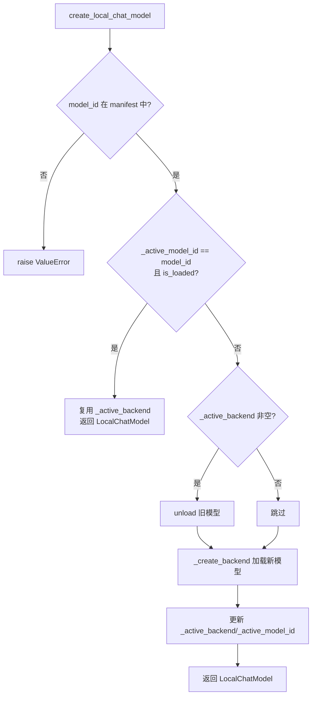
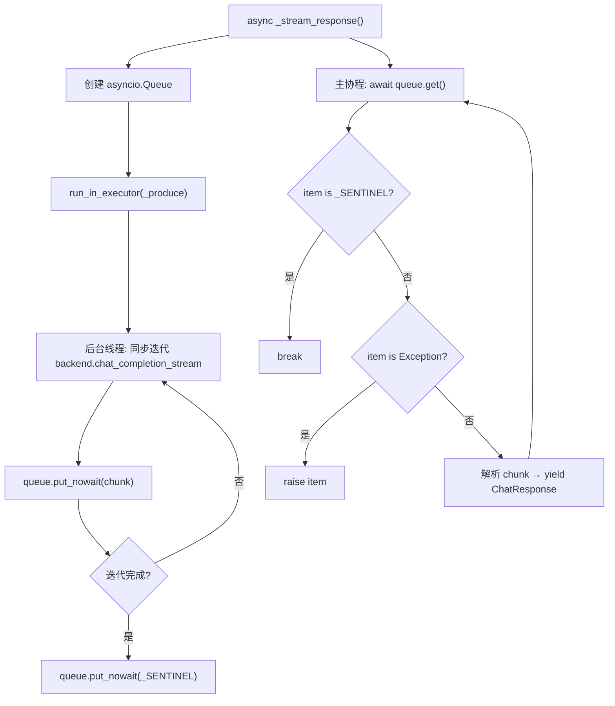

# PD-489.01 CoPaw — 单例工厂双后端本地推理

> 文档编号：PD-489.01
> 来源：CoPaw `src/copaw/local_models/`
> GitHub：https://github.com/agentscope-ai/CoPaw.git
> 问题域：PD-489 本地模型推理 Local Model Inference
> 状态：可复用方案

---

## 第 1 章 问题与动机

### 1.1 核心问题

Agent 应用需要在本地运行 LLM 推理时，面临三个工程难题：

1. **多后端碎片化**：llama.cpp（GGUF 格式）和 MLX（Apple Silicon safetensors）的 API 完全不同，上层调用代码无法统一
2. **资源管理失控**：LLM 模型动辄占用数 GB VRAM/RAM，重复加载同一模型浪费资源，切换模型时不释放旧模型导致 OOM
3. **同步/异步鸿沟**：本地推理库（llama-cpp-python、mlx-lm）都是同步阻塞的，但 Agent 框架（agentscope）需要 async 接口

### 1.2 CoPaw 的解法概述

CoPaw 通过四层架构解决上述问题：

1. **抽象后端接口** (`backends/base.py:12-63`)：`LocalBackend` ABC 定义 OpenAI 兼容的 chat completion 接口，所有后端实现统一的 `chat_completion` / `chat_completion_stream` / `unload` / `is_loaded` 四方法协议
2. **单例工厂** (`factory.py:17-19`)：模块级全局锁 + 全局状态变量，同一时刻只有一个模型加载在内存中，相同模型复用、不同模型先卸后装
3. **异步桥接** (`chat_model.py:79-80`)：`LocalChatModel` 用 `asyncio.Queue` + 后台线程将同步流式迭代器包装为 async generator
4. **标签解析降级** (`chat_model.py:178-190`)：当后端不提供结构化 `reasoning_content` 或 `tool_calls` 时，自动从文本中解析 `<think>` 和 `<tool_call>` 标签

### 1.3 设计思想

| 设计原则 | 具体实现 | 理由 | 替代方案 |
|----------|----------|------|----------|
| 策略模式 | `LocalBackend` ABC + 两个具体后端 | 新增后端只需实现 4 个方法，不改上层代码 | if-else 分支判断后端类型 |
| 单例资源管控 | 模块级 `_active_backend` + `_lock` | 本地推理 GPU 资源有限，同时只能加载一个模型 | 多实例 + LRU 缓存（内存不可控） |
| 延迟导入 | `_create_backend` 中 `from .backends.xxx import` | llama-cpp-python 和 mlx-lm 是可选依赖，不安装不报错 | 顶层 import + try/except（启动时就报错） |
| OpenAI 兼容协议 | 后端返回 `{"choices": [...], "usage": {...}}` | 上层解析逻辑统一，与云端 API 响应格式一致 | 自定义响应格式（需要额外适配层） |
| 标签降级解析 | `tag_parser.py` 解析 `<think>` / `<tool_call>` | 本地小模型不一定支持结构化输出，但可以输出标签文本 | 强制要求模型支持 function calling |

---

## 第 2 章 源码实现分析

### 2.1 架构概览

CoPaw 本地推理模块的整体架构：

```
┌─────────────────────────────────────────────────────────┐
│                   Agent / 上层调用                        │
│                                                         │
│  create_local_chat_model("qwen3-8b-gguf")               │
└──────────────────────┬──────────────────────────────────┘
                       │
┌──────────────────────▼──────────────────────────────────┐
│              factory.py (单例工厂)                        │
│  _lock / _active_backend / _active_model_id              │
│  ┌─ 同模型? → 复用 _active_backend                       │
│  └─ 不同?   → unload() 旧 → _create_backend() 新        │
└──────────────────────┬──────────────────────────────────┘
                       │
┌──────────────────────▼──────────────────────────────────┐
│           chat_model.py (LocalChatModel)                 │
│  ChatModelBase 实现 → async __call__                     │
│  ┌─ stream=True  → _stream_response (Queue+Thread)      │
│  └─ stream=False → run_in_executor                       │
│  + tag_parser 降级解析 <think> / <tool_call>              │
└──────────────────────┬──────────────────────────────────┘
                       │
┌──────────────────────▼──────────────────────────────────┐
│            backends/base.py (LocalBackend ABC)            │
│  chat_completion | chat_completion_stream | unload        │
├─────────────────────┬───────────────────────────────────┤
│  LlamaCppBackend    │  MlxBackend                        │
│  llama-cpp-python   │  mlx-lm (Apple Silicon)            │
│  GGUF 单文件        │  safetensors 目录                   │
│  n_ctx / n_gpu_layers│  max_tokens / sampler              │
└─────────────────────┴───────────────────────────────────┘
                       │
┌──────────────────────▼──────────────────────────────────┐
│           manager.py + schema.py (模型管理)               │
│  manifest.json 注册表 / HuggingFace / ModelScope 下载     │
│  auto_select_file (优先 Q4_K_M) / validate_mlx_directory  │
└─────────────────────────────────────────────────────────┘
```

### 2.2 核心实现

#### 2.2.1 单例工厂：线程安全的模型加载/复用/切换



对应源码 `factory.py:42-107`：

```python
def create_local_chat_model(
    model_id: str,
    stream: bool = True,
    backend_kwargs: Optional[dict[str, Any]] = None,
    generate_kwargs: Optional[dict[str, Any]] = None,
) -> LocalChatModel:
    global _active_backend, _active_model_id

    info = get_local_model(model_id)
    if info is None:
        raise ValueError(
            f"Local model '{model_id}' not found. "
            "Download it first with 'copaw models download'.",
        )

    with _lock:
        # Reuse if same model already loaded
        if (
            _active_model_id == model_id
            and _active_backend is not None
            and _active_backend.is_loaded
        ):
            logger.debug("Reusing already-loaded model: %s", model_id)
            return LocalChatModel(
                model_name=model_id,
                backend=_active_backend,
                stream=stream,
                generate_kwargs=generate_kwargs,
            )

        # Unload previous model
        if _active_backend is not None:
            logger.info("Unloading previous model: %s", _active_model_id)
            _active_backend.unload()

        # Load new model
        backend = _create_backend(info, backend_kwargs or {})
        _active_backend = backend
        _active_model_id = model_id

    return LocalChatModel(
        model_name=model_id,
        backend=backend,
        stream=stream,
        generate_kwargs=generate_kwargs,
    )
```

关键设计点：
- `_lock` 是模块级 `threading.Lock()`（`factory.py:17`），保证多线程安全
- 复用判断三重条件：model_id 相同 + backend 非空 + `is_loaded` 为 True（`factory.py:79-83`）
- `_create_backend` 使用延迟导入（`factory.py:115-122`），避免未安装的可选依赖报错

#### 2.2.2 异步流式桥接：Queue + 后台线程



对应源码 `chat_model.py:96-127`：

```python
async def _stream_response(
    self,
    messages: list[dict],
    tools: list[dict] | None,
    tool_choice: str | None,
    start_datetime: datetime,
    **kwargs: Any,
) -> AsyncGenerator[ChatResponse, None]:
    loop = asyncio.get_running_loop()
    queue: asyncio.Queue = asyncio.Queue()
    _SENTINEL = object()

    def _produce() -> None:
        try:
            for chunk in self._backend.chat_completion_stream(
                messages=messages,
                tools=tools,
                tool_choice=tool_choice,
                **kwargs,
            ):
                loop.call_soon_threadsafe(queue.put_nowait, chunk)
        except Exception as exc:
            loop.call_soon_threadsafe(queue.put_nowait, exc)
        finally:
            loop.call_soon_threadsafe(queue.put_nowait, _SENTINEL)

    loop.run_in_executor(None, _produce)
```

关键设计点：
- `_SENTINEL = object()` 作为流结束标记（`chat_model.py:111`），比 `None` 更安全
- 异常通过 Queue 传递到主协程再 raise（`chat_model.py:123`），不会丢失错误
- `loop.call_soon_threadsafe` 确保跨线程安全地向 Queue 投递（`chat_model.py:121`）

### 2.3 实现细节

#### 后端差异化处理

两个后端在实现上有显著差异，但对外暴露统一接口：

| 维度 | LlamaCppBackend | MlxBackend |
|------|----------------|------------|
| 模型格式 | 单个 GGUF 文件 | safetensors 目录 |
| 加载方式 | `Llama(model_path=...)` | `mlx_lm.load(model_dir)` |
| 流式输出 | `create_chat_completion(stream=True)` 原生支持 | `mlx_lm.stream_generate()` 手动组装 chunk |
| 结构化输出 | `response_format={"type":"json_object","schema":...}` | prompt 追加 JSON schema 指令 |
| 工具调用 | 原生 `tools` 参数 | 依赖 tokenizer `has_tool_calling` 属性 |
| 采样参数 | 直接传递 kwargs | 需要 `make_sampler()` 构建采样器 |
| 默认上下文 | `n_ctx=32768` | `max_tokens=2048` |

#### 消息规范化

两个后端都需要将 agentscope 的 block-list 格式消息转为纯字符串（`llamacpp_backend.py:16-42`、`mlx_backend.py:17-36`）。llama.cpp 后端额外处理了 `tool_calls` 为 `None` 的情况（Jinja 模板会崩溃）。

#### 模型下载与注册

`manager.py` 的 `LocalModelManager` 支持从 HuggingFace 和 ModelScope 两个源下载：
- GGUF 模型：`hf_hub_download` 下载单文件，优先选择 Q4_K_M 量化（`manager.py:258-259`）
- MLX 模型：`snapshot_download` 下载整个仓库，并验证 config.json + safetensors 完整性（`manager.py:280-299`）
- 所有模型注册到 `~/.copaw/models/manifest.json`（`manager.py:22`）


---

## 第 3 章 迁移指南

### 3.1 迁移清单

**阶段 1：后端抽象层（必须）**

- [ ] 定义 `LocalBackend` ABC，包含 `chat_completion` / `chat_completion_stream` / `unload` / `is_loaded` 四个抽象方法
- [ ] 约定返回格式为 OpenAI 兼容 dict（`{"choices": [...], "usage": {...}}`）
- [ ] 实现至少一个具体后端（推荐先做 llama.cpp）

**阶段 2：单例工厂（推荐）**

- [ ] 实现模块级单例工厂，用 `threading.Lock` 保护全局状态
- [ ] 实现"同模型复用、异模型先卸后装"逻辑
- [ ] 添加 `unload_active_model()` 供外部主动释放资源

**阶段 3：异步桥接（按需）**

- [ ] 如果你的框架是 async 的，实现 Queue + 后台线程的流式桥接
- [ ] 非流式调用用 `run_in_executor` 包装即可

**阶段 4：标签降级解析（可选）**

- [ ] 如果需要支持不提供结构化输出的本地模型，实现 `<think>` / `<tool_call>` 标签解析
- [ ] 优先使用后端原生结构化输出，标签解析作为 fallback

### 3.2 适配代码模板

以下是一个最小可运行的后端抽象 + 单例工厂实现：

```python
"""Minimal local model inference with singleton factory."""

import threading
from abc import ABC, abstractmethod
from typing import Any, Iterator, Optional

# ── 后端抽象 ──

class LocalBackend(ABC):
    """统一的本地推理后端接口，返回 OpenAI 兼容格式。"""

    @abstractmethod
    def __init__(self, model_path: str, **kwargs: Any) -> None: ...

    @abstractmethod
    def chat_completion(self, messages: list[dict], **kwargs: Any) -> dict: ...

    @abstractmethod
    def chat_completion_stream(self, messages: list[dict], **kwargs: Any) -> Iterator[dict]: ...

    @abstractmethod
    def unload(self) -> None: ...

    @property
    @abstractmethod
    def is_loaded(self) -> bool: ...


class LlamaCppBackend(LocalBackend):
    """llama-cpp-python 后端实现。"""

    def __init__(self, model_path: str, n_ctx: int = 32768, n_gpu_layers: int = -1, **kwargs):
        from llama_cpp import Llama
        self._llm = Llama(model_path=model_path, n_ctx=n_ctx, n_gpu_layers=n_gpu_layers, **kwargs)

    def chat_completion(self, messages: list[dict], **kwargs) -> dict:
        return self._llm.create_chat_completion(messages=messages, stream=False, **kwargs)

    def chat_completion_stream(self, messages: list[dict], **kwargs) -> Iterator[dict]:
        yield from self._llm.create_chat_completion(messages=messages, stream=True, **kwargs)

    def unload(self) -> None:
        if self._llm:
            del self._llm
            self._llm = None

    @property
    def is_loaded(self) -> bool:
        return self._llm is not None


# ── 单例工厂 ──

_lock = threading.Lock()
_active_backend: Optional[LocalBackend] = None
_active_model_id: Optional[str] = None

BACKEND_REGISTRY: dict[str, type[LocalBackend]] = {
    "llamacpp": LlamaCppBackend,
    # "mlx": MlxBackend,  # 按需添加
}

def get_or_create_backend(
    model_id: str,
    model_path: str,
    backend_type: str = "llamacpp",
    **kwargs,
) -> LocalBackend:
    """单例模式获取后端：同模型复用，异模型先卸后装。"""
    global _active_backend, _active_model_id

    with _lock:
        if _active_model_id == model_id and _active_backend and _active_backend.is_loaded:
            return _active_backend

        if _active_backend is not None:
            _active_backend.unload()

        cls = BACKEND_REGISTRY[backend_type]
        _active_backend = cls(model_path=model_path, **kwargs)
        _active_model_id = model_id

    return _active_backend

def unload_active() -> None:
    """主动释放当前加载的模型。"""
    global _active_backend, _active_model_id
    with _lock:
        if _active_backend:
            _active_backend.unload()
            _active_backend = None
            _active_model_id = None
```

### 3.3 适用场景

| 场景 | 适用度 | 说明 |
|------|--------|------|
| 桌面 Agent 应用（单用户） | ⭐⭐⭐ | 单例模式完美匹配，同时只需一个模型 |
| Apple Silicon 本地推理 | ⭐⭐⭐ | MLX 后端专为 M 系列芯片优化 |
| 离线/隐私敏感场景 | ⭐⭐⭐ | 完全本地推理，无需网络 |
| 多模型并发服务 | ⭐ | 单例模式限制同时只有一个模型，不适合多租户 |
| 高吞吐量推理服务 | ⭐ | 本地推理吞吐有限，应考虑 vLLM/TGI 等专用方案 |

---

## 第 4 章 测试用例

```python
"""Tests for local model inference singleton factory and backend abstraction."""

import threading
from unittest.mock import MagicMock, patch
import pytest


# ── Mock Backend for Testing ──

class MockBackend:
    """模拟 LocalBackend 用于测试。"""

    def __init__(self, model_path: str, **kwargs):
        self.model_path = model_path
        self._loaded = True
        self.kwargs = kwargs

    def chat_completion(self, messages, **kwargs):
        return {
            "choices": [{"message": {"role": "assistant", "content": "mock response"}}],
            "usage": {"prompt_tokens": 10, "completion_tokens": 5},
        }

    def chat_completion_stream(self, messages, **kwargs):
        for token in ["hello", " world"]:
            yield {
                "choices": [{"delta": {"content": token}}],
            }

    def unload(self):
        self._loaded = False

    @property
    def is_loaded(self):
        return self._loaded


class TestSingletonFactory:
    """测试单例工厂的复用/切换/卸载逻辑。"""

    def setup_method(self):
        """每个测试前重置全局状态。"""
        import copaw.local_models.factory as f
        f._active_backend = None
        f._active_model_id = None

    def test_reuse_same_model(self):
        """同一 model_id 应复用已加载的 backend。"""
        backend = MockBackend("/path/to/model.gguf")
        import copaw.local_models.factory as f
        f._active_backend = backend
        f._active_model_id = "test-model"

        result = f.get_active_local_model()
        assert result is not None
        assert result[0] == "test-model"
        assert result[1] is backend

    def test_unload_releases_resources(self):
        """unload_active_model 应释放 backend 并清空全局状态。"""
        backend = MockBackend("/path/to/model.gguf")
        import copaw.local_models.factory as f
        f._active_backend = backend
        f._active_model_id = "test-model"

        f.unload_active_model()

        assert f._active_backend is None
        assert f._active_model_id is None
        assert not backend.is_loaded

    def test_switch_model_unloads_previous(self):
        """切换模型时应先卸载旧模型。"""
        old_backend = MockBackend("/path/to/old.gguf")
        import copaw.local_models.factory as f
        f._active_backend = old_backend
        f._active_model_id = "old-model"

        # 模拟切换：手动卸载旧的
        f.unload_active_model()
        assert not old_backend.is_loaded

    def test_thread_safety(self):
        """多线程并发访问不应导致竞态条件。"""
        import copaw.local_models.factory as f
        results = []

        def access_factory():
            result = f.get_active_local_model()
            results.append(result)

        threads = [threading.Thread(target=access_factory) for _ in range(10)]
        for t in threads:
            t.start()
        for t in threads:
            t.join()

        # 所有线程都应安全返回（None 因为没有加载模型）
        assert len(results) == 10
        assert all(r is None for r in results)


class TestBackendAbstraction:
    """测试后端抽象接口的一致性。"""

    def test_chat_completion_returns_openai_format(self):
        """chat_completion 应返回 OpenAI 兼容格式。"""
        backend = MockBackend("/path/to/model.gguf")
        result = backend.chat_completion([{"role": "user", "content": "hi"}])

        assert "choices" in result
        assert "usage" in result
        assert result["choices"][0]["message"]["role"] == "assistant"

    def test_stream_yields_chunks(self):
        """chat_completion_stream 应 yield chunk dicts。"""
        backend = MockBackend("/path/to/model.gguf")
        chunks = list(backend.chat_completion_stream([{"role": "user", "content": "hi"}]))

        assert len(chunks) == 2
        assert chunks[0]["choices"][0]["delta"]["content"] == "hello"

    def test_unload_marks_not_loaded(self):
        """unload 后 is_loaded 应返回 False。"""
        backend = MockBackend("/path/to/model.gguf")
        assert backend.is_loaded
        backend.unload()
        assert not backend.is_loaded


class TestMessageNormalization:
    """测试消息格式规范化。"""

    def test_list_content_to_string(self):
        """block-list 格式的 content 应被转为纯字符串。"""
        from copaw.local_models.backends.llamacpp_backend import _normalize_messages

        messages = [{"role": "user", "content": [{"type": "text", "text": "hello"}]}]
        result = _normalize_messages(messages)
        assert result[0]["content"] == "hello"

    def test_none_content_to_empty_string(self):
        """None content 应被转为空字符串（llama.cpp 后端）。"""
        from copaw.local_models.backends.llamacpp_backend import _normalize_messages

        messages = [{"role": "assistant", "content": None}]
        result = _normalize_messages(messages)
        assert result[0]["content"] == ""

    def test_empty_tool_calls_removed(self):
        """空的 tool_calls 应被移除（避免 Jinja 崩溃）。"""
        from copaw.local_models.backends.llamacpp_backend import _normalize_messages

        messages = [{"role": "assistant", "content": "ok", "tool_calls": None}]
        result = _normalize_messages(messages)
        assert "tool_calls" not in result[0]
```


---

## 第 5 章 跨域关联

| 关联域 | 关系类型 | 说明 |
|--------|----------|------|
| PD-04 工具系统 | 协同 | `LocalChatModel` 的 `tag_parser` 从文本中解析 `<tool_call>` 标签，是本地模型支持 function calling 的关键桥梁。工具系统的设计直接影响标签解析的格式约定 |
| PD-01 上下文管理 | 依赖 | llama.cpp 后端的 `n_ctx=32768` 和 MLX 后端的 `max_tokens=2048` 直接限制了上下文窗口大小。上下文压缩策略需要感知本地模型的窗口限制 |
| PD-03 容错与重试 | 协同 | 单例工厂的 `unload` + 重新加载机制可作为模型推理失败时的恢复手段。`_stream_response` 中的异常通过 Queue 传递，上层可据此触发重试 |
| PD-10 中间件管道 | 协同 | `LocalChatModel` 实现了 agentscope 的 `ChatModelBase` 接口，可以无缝接入中间件管道。消息规范化（`_normalize_messages`）本身就是一种前置中间件 |
| PD-12 推理增强 | 协同 | `<think>` 标签解析（`tag_parser.py`）让本地模型也能输出结构化的推理过程，与 reasoning enhancement 域直接相关 |

---

## 第 6 章 来源文件索引

| 文件 | 行范围 | 关键实现 |
|------|--------|----------|
| `src/copaw/local_models/backends/base.py` | L12-L63 | `LocalBackend` 抽象基类，定义四方法协议 |
| `src/copaw/local_models/factory.py` | L17-L19 | 模块级全局锁和单例状态变量 |
| `src/copaw/local_models/factory.py` | L42-L107 | `create_local_chat_model` 单例工厂核心逻辑 |
| `src/copaw/local_models/factory.py` | L110-L124 | `_create_backend` 延迟导入后端实现 |
| `src/copaw/local_models/chat_model.py` | L39-L57 | `LocalChatModel` 类定义和初始化 |
| `src/copaw/local_models/chat_model.py` | L58-L94 | `__call__` 异步入口，分流 stream/non-stream |
| `src/copaw/local_models/chat_model.py` | L96-L127 | `_stream_response` Queue+Thread 异步桥接 |
| `src/copaw/local_models/chat_model.py` | L178-L190 | `<think>` 标签降级解析逻辑 |
| `src/copaw/local_models/chat_model.py` | L199-L227 | `<tool_call>` 标签降级解析逻辑 |
| `src/copaw/local_models/backends/llamacpp_backend.py` | L45-L84 | `LlamaCppBackend.__init__` 模型加载 |
| `src/copaw/local_models/backends/llamacpp_backend.py` | L86-L111 | `chat_completion` 非流式推理 |
| `src/copaw/local_models/backends/llamacpp_backend.py` | L16-L42 | `_normalize_messages` 消息规范化 |
| `src/copaw/local_models/backends/mlx_backend.py` | L52-L77 | `MlxBackend.__init__` MLX 模型加载 |
| `src/copaw/local_models/backends/mlx_backend.py` | L79-L91 | `_build_prompt` chat template 应用 |
| `src/copaw/local_models/backends/mlx_backend.py` | L170-L218 | `chat_completion_stream` MLX 流式输出 |
| `src/copaw/local_models/schema.py` | L12-L14 | `BackendType` 枚举（LLAMACPP/MLX） |
| `src/copaw/local_models/schema.py` | L22-L41 | `LocalModelInfo` 模型元数据 Pydantic 模型 |
| `src/copaw/local_models/manager.py` | L94-L122 | `download_model_sync` 双源下载入口 |
| `src/copaw/local_models/manager.py` | L242-L277 | `_auto_select_file` 自动选择量化文件 |
| `src/copaw/local_models/manager.py` | L279-L299 | `_validate_mlx_directory` MLX 完整性校验 |

---

## 第 7 章 横向对比维度

```json comparison_data
{
  "project": "CoPaw",
  "dimensions": {
    "后端抽象": "LocalBackend ABC 四方法协议，返回 OpenAI 兼容 dict",
    "资源管理": "模块级单例工厂 + threading.Lock，同时只加载一个模型",
    "流式支持": "asyncio.Queue + 后台线程桥接同步迭代器为 async generator",
    "模型格式": "GGUF（llama.cpp）+ safetensors 目录（MLX）双格式",
    "降级策略": "tag_parser 从文本解析 <think>/<tool_call> 标签作为结构化输出 fallback",
    "模型下载": "HuggingFace + ModelScope 双源，manifest.json 注册表，自动选择 Q4_K_M 量化"
  }
}
```

### 域元数据补充

```json domain_metadata
{
  "solution_summary": "CoPaw 用 LocalBackend ABC + 模块级单例工厂管理 llama.cpp/MLX 双后端，asyncio.Queue 桥接同步推理为异步流式输出，tag_parser 降级解析本地模型的 think/tool_call 标签",
  "description": "本地推理需要解决同步/异步桥接和非结构化输出的降级解析问题",
  "sub_problems": [
    "同步推理库到异步框架的流式桥接",
    "本地模型非结构化输出的标签降级解析",
    "多下载源（HuggingFace/ModelScope）模型获取与注册",
    "消息格式规范化（block-list 到纯字符串）"
  ],
  "best_practices": [
    "用 asyncio.Queue + 后台线程将同步流式迭代器包装为 async generator",
    "延迟导入可选后端依赖，未安装时不影响其他功能",
    "消息规范化作为后端前置处理，防止 Jinja 模板崩溃",
    "优先使用后端原生结构化输出，标签解析仅作 fallback"
  ]
}
```

