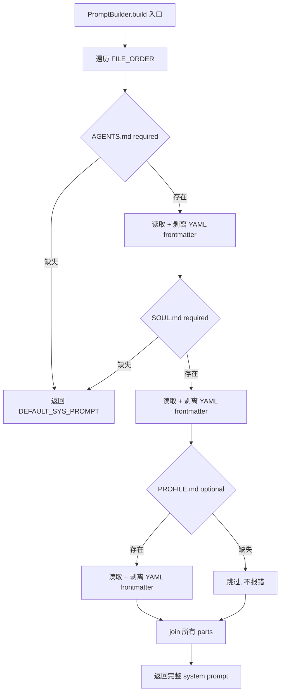
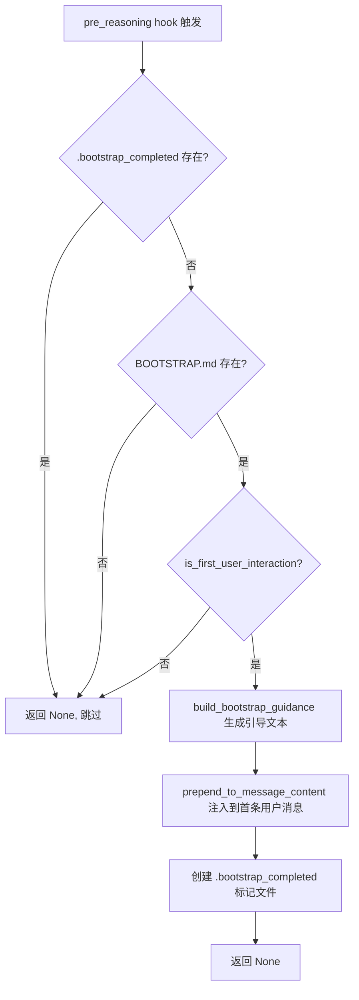

# PD-490.01 CoPaw — 三层 Markdown 声明式提示词构建与 Bootstrap 引导

> 文档编号：PD-490.01
> 来源：CoPaw `src/copaw/agents/prompt.py` `src/copaw/agents/hooks/bootstrap.py`
> GitHub：https://github.com/agentscope-ai/CoPaw.git
> 问题域：PD-490 系统提示词工程 Prompt Engineering System
> 状态：可复用方案

---

## 第 1 章 问题与动机（≥ 30 行）

### 1.1 核心问题

Agent 系统的系统提示词（system prompt）通常面临三个工程难题：

1. **硬编码耦合** — 提示词直接写在代码中，修改需要重新部署，非技术用户无法调整
2. **关注点混杂** — 行为规则、人格定义、用户偏好混在一起，难以独立维护
3. **首次引导缺失** — 新用户首次使用时缺乏身份建立流程，Agent 无法个性化

CoPaw 的核心洞察是：**提示词应该像配置文件一样管理，而不是像代码一样编写**。通过将提示词拆分为多个 Markdown 文件，每个文件承担独立职责，实现声明式的提示词管理。

### 1.2 CoPaw 的解法概述

CoPaw 通过 `PromptBuilder` 类实现了一套完整的声明式提示词管理方案：

1. **三层 Markdown 分离** — `AGENTS.md`（行为规则）+ `SOUL.md`（人格灵魂）+ `PROFILE.md`（身份与用户画像），各司其职（`src/copaw/agents/prompt.py:26-30`）
2. **YAML frontmatter 元数据** — 每个 Markdown 文件头部包含 `summary` 和 `read_when` 元数据，PromptBuilder 在加载时自动剥离（`src/copaw/agents/prompt.py:74-77`）
3. **首次引导流程** — `BootstrapHook` 检测 `BOOTSTRAP.md` 存在且为首次交互时，自动注入引导指令到用户消息前（`src/copaw/agents/hooks/bootstrap.py:57-93`）
4. **运行时热重建** — `rebuild_sys_prompt()` 在每次会话恢复时重新读取磁盘文件，确保提示词始终反映最新编辑（`src/copaw/agents/react_agent.py:246-260`）
5. **多语言模板** — `md_files/en/` 和 `md_files/zh/` 提供中英双语模板，`copaw init` 时按配置语言复制到工作目录（`src/copaw/agents/utils/setup_utils.py:30-38`）

### 1.3 设计思想

| 设计原则 | 具体实现 | 理由 | 替代方案 |
|----------|----------|------|----------|
| 声明式优于命令式 | Markdown 文件定义提示词，代码只负责组装 | 非技术用户可直接编辑 .md 文件调整 Agent 行为 | 代码内硬编码 / JSON 配置 |
| 关注点分离 | AGENTS.md（行为）/ SOUL.md（人格）/ PROFILE.md（身份） | 修改人格不影响行为规则，修改用户画像不影响灵魂 | 单文件 system prompt |
| 渐进式初始化 | BOOTSTRAP.md 引导 → 生成 PROFILE.md → 删除 BOOTSTRAP.md | 首次使用时建立个性化关系，之后不再干扰 | 固定默认人格 / 手动配置 |
| 运行时一致性 | 每次 query 前 rebuild_sys_prompt() | 用户在会话间编辑 .md 文件后立即生效 | 仅启动时加载一次 |
| 优雅降级 | required/optional 文件区分 + DEFAULT_SYS_PROMPT 兜底 | PROFILE.md 缺失不影响运行，核心文件缺失回退默认 | 启动失败 / 异常中断 |

---

## 第 2 章 源码实现分析（≥ 60 行，核心章节）

### 2.1 架构概览

CoPaw 的提示词系统由四个核心组件构成：

```
┌─────────────────────────────────────────────────────────┐
│                    ~/.copaw/ (WORKING_DIR)               │
│  ┌──────────┐  ┌──────────┐  ┌──────────┐  ┌─────────┐ │
│  │AGENTS.md │  │ SOUL.md  │  │PROFILE.md│  │BOOTSTRAP│ │
│  │(required)│  │(required)│  │(optional)│  │.md(临时) │ │
│  └────┬─────┘  └────┬─────┘  └────┬─────┘  └────┬────┘ │
│       │              │              │              │      │
└───────┼──────────────┼──────────────┼──────────────┼──────┘
        │              │              │              │
        ▼              ▼              ▼              ▼
  ┌─────────────────────────┐  ┌──────────────────────────┐
  │     PromptBuilder       │  │     BootstrapHook         │
  │  _load_file() × 3      │  │  pre_reasoning hook       │
  │  strip YAML frontmatter │  │  检测首次交互 + 注入引导  │
  │  join → system prompt   │  │  完成后写 .bootstrap_done │
  └────────────┬────────────┘  └────────────┬─────────────┘
               │                             │
               ▼                             ▼
  ┌──────────────────────────────────────────────────────┐
  │              CoPawAgent.__init__()                    │
  │  _build_sys_prompt() → PromptBuilder.build()         │
  │  _register_hooks() → BootstrapHook                   │
  │  rebuild_sys_prompt() → 每次 query 前热重建          │
  └──────────────────────────────────────────────────────┘
```

### 2.2 核心实现

#### 2.2.1 PromptBuilder — 三层文件有序组装



对应源码 `src/copaw/agents/prompt.py:22-134`：

```python
class PromptConfig:
    """Configuration for system prompt building."""
    # Define file loading order: (filename, required)
    FILE_ORDER = [
        ("AGENTS.md", True),
        ("SOUL.md", True),
        ("PROFILE.md", False),
    ]

class PromptBuilder:
    """Builder for constructing system prompts from markdown files."""

    def __init__(self, working_dir: Path):
        self.working_dir = working_dir
        self.prompt_parts = []
        self.loaded_count = 0

    def _load_file(self, filename: str, required: bool) -> bool:
        file_path = self.working_dir / filename
        if not file_path.exists():
            if required:
                logger.warning("%s not found in working directory", filename)
                return False
            else:
                return True  # Not an error for optional files

        content = file_path.read_text(encoding="utf-8").strip()
        # Remove YAML frontmatter if present
        if content.startswith("---"):
            parts = content.split("---", 2)
            if len(parts) >= 3:
                content = parts[2].strip()

        if content:
            if self.prompt_parts:
                self.prompt_parts.append("")
            self.prompt_parts.append(f"# {filename}")
            self.prompt_parts.append("")
            self.prompt_parts.append(content)
            self.loaded_count += 1
        return True

    def build(self) -> str:
        for filename, required in PromptConfig.FILE_ORDER:
            if not self._load_file(filename, required):
                return DEFAULT_SYS_PROMPT
        if not self.prompt_parts:
            return DEFAULT_SYS_PROMPT
        return "\n\n".join(self.prompt_parts)
```

关键设计点：
- `FILE_ORDER` 定义加载顺序和必要性，AGENTS.md 和 SOUL.md 为必需，PROFILE.md 为可选（`prompt.py:26-30`）
- YAML frontmatter 通过 `---` 分割剥离，只保留正文内容（`prompt.py:74-77`）
- 每个文件内容前自动添加 `# filename` 作为 section header（`prompt.py:83`）
- 任何 required 文件加载失败立即回退 `DEFAULT_SYS_PROMPT`（`prompt.py:118-119`）

#### 2.2.2 BootstrapHook — 首次引导注入



对应源码 `src/copaw/agents/hooks/bootstrap.py:42-103`：

```python
class BootstrapHook:
    async def __call__(self, agent, kwargs):
        bootstrap_path = self.working_dir / "BOOTSTRAP.md"
        bootstrap_completed_flag = self.working_dir / ".bootstrap_completed"

        # 三重守卫：已完成 / 无引导文件 / 非首次交互
        if bootstrap_completed_flag.exists():
            return None
        if not bootstrap_path.exists():
            return None
        messages = await agent.memory.get_memory()
        if not is_first_user_interaction(messages):
            return None

        # 生成引导文本并注入
        bootstrap_guidance = build_bootstrap_guidance(self.language)
        system_prompt_count = sum(1 for msg in messages if msg.role == "system")
        for msg in messages[system_prompt_count:]:
            if msg.role == "user":
                prepend_to_message_content(msg, bootstrap_guidance)
                break

        # 写入完成标记，防止重复触发
        bootstrap_completed_flag.touch()
        return None
```

关键设计点：
- 三重守卫确保引导只触发一次：`.bootstrap_completed` 文件标记 → `BOOTSTRAP.md` 存在检查 → 首次交互判断（`bootstrap.py:63-71`）
- 引导文本通过 `prepend_to_message_content` 注入到用户消息前，而非修改 system prompt（`bootstrap.py:87`）
- 完成后创建 `.bootstrap_completed` 标记文件，跨会话持久化（`bootstrap.py:93`）

### 2.3 实现细节

#### 运行时热重建机制

`rebuild_sys_prompt()` 在 `AgentRunner.query_handler` 中每次 `load_session_state` 后调用（`src/copaw/app/runner/runner.py:135-138`）：

```python
# runner.py:135-138
# Rebuild system prompt so it always reflects the latest
# AGENTS.md / SOUL.md / PROFILE.md, not the stale one saved
# in the session state.
agent.rebuild_sys_prompt()
```

`rebuild_sys_prompt` 的实现（`src/copaw/agents/react_agent.py:246-260`）：

```python
def rebuild_sys_prompt(self) -> None:
    self._sys_prompt = self._build_sys_prompt()
    for msg, _marks in self.memory.content:
        if msg.role == "system":
            msg.content = self.sys_prompt
        break
```

这确保了：即使 session state 中保存了旧的 system prompt，每次 query 都会从磁盘重新读取最新的 .md 文件内容。

#### 多语言模板安装

`copy_md_files()` 在 `copaw init` 时将语言对应的模板复制到工作目录（`src/copaw/agents/utils/setup_utils.py:14-72`）：

```
src/copaw/agents/md_files/
├── en/
│   ├── AGENTS.md      # 英文行为规则模板
│   ├── SOUL.md        # 英文人格模板
│   └── BOOTSTRAP.md   # 英文引导模板
└── zh/
    ├── AGENTS.md      # 中文行为规则模板
    ├── SOUL.md        # 中文人格模板
    └── BOOTSTRAP.md   # 中文引导模板
```

配置中 `agents.language` 字段控制语言选择，`agents.installed_md_files_language` 记录已安装语言，语言切换时自动重新复制（`src/copaw/cli/init_cmd.py:293-327`）。

#### 首次交互判断

`is_first_user_interaction()` 通过统计非 system 消息中的 user/assistant 消息数判断（`src/copaw/agents/utils/message_processing.py:271-291`）：

```python
def is_first_user_interaction(messages: list) -> bool:
    system_prompt_count = sum(1 for msg in messages if msg.role == "system")
    non_system_messages = messages[system_prompt_count:]
    user_msg_count = sum(1 for msg in non_system_messages if msg.role == "user")
    assistant_msg_count = sum(1 for msg in non_system_messages if msg.role == "assistant")
    return user_msg_count == 1 and assistant_msg_count == 0
```

---

## 第 3 章 迁移指南（≥ 40 行）

### 3.1 迁移清单

**阶段 1：基础设施（必需）**

- [ ] 创建工作目录结构 `~/.your-agent/`
- [ ] 编写 `AGENTS.md` — 定义 Agent 行为规则、工具使用规范、安全边界
- [ ] 编写 `SOUL.md` — 定义 Agent 人格、核心准则、风格
- [ ] 实现 `PromptBuilder` — 按序加载 .md 文件，剥离 YAML frontmatter，拼接为 system prompt

**阶段 2：个性化引导（推荐）**

- [ ] 编写 `BOOTSTRAP.md` — 首次引导脚本，引导用户建立 Agent 身份
- [ ] 实现 `BootstrapHook` — pre_reasoning 钩子，检测首次交互并注入引导
- [ ] 创建 `PROFILE.md` 模板 — 引导完成后由 Agent 自动填写

**阶段 3：运行时增强（可选）**

- [ ] 实现 `rebuild_sys_prompt()` — 每次 query 前从磁盘重新加载
- [ ] 多语言模板支持 — `md_files/{lang}/` 目录结构
- [ ] `copaw init` 式初始化命令 — 自动复制模板到工作目录

### 3.2 适配代码模板

以下是一个可直接复用的最小化 PromptBuilder 实现：

```python
from pathlib import Path
from typing import Optional

DEFAULT_PROMPT = "You are a helpful assistant."

# 文件加载顺序：(文件名, 是否必需)
PROMPT_FILES = [
    ("AGENTS.md", True),
    ("SOUL.md", True),
    ("PROFILE.md", False),
]


class PromptBuilder:
    """从工作目录的 Markdown 文件构建 system prompt。"""

    def __init__(self, working_dir: str | Path):
        self.working_dir = Path(working_dir)

    def _strip_frontmatter(self, content: str) -> str:
        """剥离 YAML frontmatter（--- 包裹的头部）。"""
        if content.startswith("---"):
            parts = content.split("---", 2)
            if len(parts) >= 3:
                return parts[2].strip()
        return content

    def _load_file(self, filename: str, required: bool) -> Optional[str]:
        """加载单个 Markdown 文件，返回处理后的内容。"""
        path = self.working_dir / filename
        if not path.exists():
            if required:
                return None  # 必需文件缺失，触发降级
            return ""  # 可选文件缺失，跳过
        content = path.read_text(encoding="utf-8").strip()
        content = self._strip_frontmatter(content)
        if not content:
            return ""
        return f"# {filename}\n\n{content}"

    def build(self) -> str:
        """构建完整的 system prompt。"""
        parts = []
        for filename, required in PROMPT_FILES:
            result = self._load_file(filename, required)
            if result is None:
                return DEFAULT_PROMPT  # 必需文件缺失，降级
            if result:
                parts.append(result)
        return "\n\n".join(parts) if parts else DEFAULT_PROMPT


class BootstrapHook:
    """首次交互引导钩子。"""

    def __init__(self, working_dir: str | Path, language: str = "zh"):
        self.working_dir = Path(working_dir)
        self.language = language
        self._done_flag = self.working_dir / ".bootstrap_completed"

    def should_trigger(self, is_first_interaction: bool) -> bool:
        """判断是否应触发引导。"""
        if self._done_flag.exists():
            return False
        if not (self.working_dir / "BOOTSTRAP.md").exists():
            return False
        return is_first_interaction

    def get_guidance(self) -> str:
        """获取引导文本。"""
        return (
            "# 引导模式已激活\n\n"
            "工作目录中存在 BOOTSTRAP.md，请引导用户完成首次设置。\n"
            "1. 阅读 BOOTSTRAP.md 并执行引导流程\n"
            "2. 创建 PROFILE.md 记录用户偏好\n"
            "3. 完成后删除 BOOTSTRAP.md\n\n"
            "用户的原始消息：\n"
        )

    def mark_completed(self) -> None:
        """标记引导完成。"""
        self._done_flag.touch()
```

### 3.3 适用场景

| 场景 | 适用度 | 说明 |
|------|--------|------|
| 个人 AI 助手（CoPaw 类） | ⭐⭐⭐ | 完美匹配：用户需要个性化 Agent，提示词需要持续演化 |
| 企业内部 Agent 平台 | ⭐⭐⭐ | 运维人员通过编辑 .md 文件调整 Agent 行为，无需改代码 |
| 多租户 SaaS Agent | ⭐⭐ | 每个租户独立工作目录，但需要额外的权限隔离 |
| 一次性脚本 Agent | ⭐ | 过度设计，直接硬编码 prompt 更简单 |
| 需要版本控制的 Agent | ⭐⭐⭐ | .md 文件天然支持 Git 版本控制和 diff |

---

## 第 4 章 测试用例（≥ 20 行）

```python
import pytest
from pathlib import Path
from unittest.mock import MagicMock, AsyncMock, patch


class TestPromptBuilder:
    """测试 PromptBuilder 三层文件加载。"""

    def setup_method(self):
        self.tmp_dir = Path("/tmp/test_prompt_builder")
        self.tmp_dir.mkdir(exist_ok=True)

    def teardown_method(self):
        import shutil
        shutil.rmtree(self.tmp_dir, ignore_errors=True)

    def test_full_three_files(self):
        """三个文件都存在时，按序拼接。"""
        (self.tmp_dir / "AGENTS.md").write_text("## Rules\nBe helpful.")
        (self.tmp_dir / "SOUL.md").write_text("## Soul\nBe genuine.")
        (self.tmp_dir / "PROFILE.md").write_text("## Profile\nName: Friday")

        from copaw.agents.prompt import PromptBuilder
        builder = PromptBuilder(self.tmp_dir)
        result = builder.build()

        assert "# AGENTS.md" in result
        assert "# SOUL.md" in result
        assert "# PROFILE.md" in result
        assert result.index("AGENTS.md") < result.index("SOUL.md")
        assert result.index("SOUL.md") < result.index("PROFILE.md")

    def test_optional_profile_missing(self):
        """PROFILE.md 缺失时正常运行。"""
        (self.tmp_dir / "AGENTS.md").write_text("Rules here")
        (self.tmp_dir / "SOUL.md").write_text("Soul here")

        from copaw.agents.prompt import PromptBuilder
        builder = PromptBuilder(self.tmp_dir)
        result = builder.build()

        assert "AGENTS.md" in result
        assert "SOUL.md" in result
        assert "PROFILE.md" not in result

    def test_required_agents_missing_fallback(self):
        """AGENTS.md 缺失时回退默认 prompt。"""
        (self.tmp_dir / "SOUL.md").write_text("Soul here")

        from copaw.agents.prompt import PromptBuilder, DEFAULT_SYS_PROMPT
        builder = PromptBuilder(self.tmp_dir)
        result = builder.build()

        assert result == DEFAULT_SYS_PROMPT

    def test_yaml_frontmatter_stripped(self):
        """YAML frontmatter 被正确剥离。"""
        content = '---\nsummary: "test"\nread_when:\n  - always\n---\n\n## Real Content\nHello'
        (self.tmp_dir / "AGENTS.md").write_text(content)
        (self.tmp_dir / "SOUL.md").write_text("Soul")

        from copaw.agents.prompt import PromptBuilder
        builder = PromptBuilder(self.tmp_dir)
        result = builder.build()

        assert "summary" not in result
        assert "read_when" not in result
        assert "Real Content" in result


class TestBootstrapHook:
    """测试 BootstrapHook 首次引导逻辑。"""

    def setup_method(self):
        self.tmp_dir = Path("/tmp/test_bootstrap")
        self.tmp_dir.mkdir(exist_ok=True)

    def teardown_method(self):
        import shutil
        shutil.rmtree(self.tmp_dir, ignore_errors=True)

    @pytest.mark.asyncio
    async def test_skip_when_completed_flag_exists(self):
        """已完成标记存在时跳过。"""
        (self.tmp_dir / "BOOTSTRAP.md").write_text("Guide")
        (self.tmp_dir / ".bootstrap_completed").touch()

        from copaw.agents.hooks.bootstrap import BootstrapHook
        hook = BootstrapHook(working_dir=self.tmp_dir)
        agent = MagicMock()
        result = await hook(agent, {})
        assert result is None

    @pytest.mark.asyncio
    async def test_skip_when_no_bootstrap_file(self):
        """无 BOOTSTRAP.md 时跳过。"""
        from copaw.agents.hooks.bootstrap import BootstrapHook
        hook = BootstrapHook(working_dir=self.tmp_dir)
        agent = MagicMock()
        result = await hook(agent, {})
        assert result is None

    @pytest.mark.asyncio
    async def test_creates_completion_flag(self):
        """引导完成后创建标记文件。"""
        (self.tmp_dir / "BOOTSTRAP.md").write_text("Guide")

        from copaw.agents.hooks.bootstrap import BootstrapHook
        hook = BootstrapHook(working_dir=self.tmp_dir)

        # Mock agent with first user interaction
        mock_msg = MagicMock(role="user", content="Hello")
        sys_msg = MagicMock(role="system", content="sys")
        agent = MagicMock()
        agent.memory.get_memory = AsyncMock(return_value=[sys_msg, mock_msg])

        await hook(agent, {})
        assert (self.tmp_dir / ".bootstrap_completed").exists()
```

---

## 第 5 章 跨域关联

| 关联域 | 关系类型 | 说明 |
|--------|----------|------|
| PD-01 上下文管理 | 协同 | system prompt 占用上下文窗口，三层文件的总长度需要纳入上下文预算管理 |
| PD-06 记忆持久化 | 依赖 | PROFILE.md 和 MEMORY.md 是 Agent 的持久化记忆载体，提示词系统依赖这些文件的持续更新 |
| PD-09 Human-in-the-Loop | 协同 | BOOTSTRAP.md 引导流程本质上是一次结构化的 Human-in-the-Loop 交互 |
| PD-10 中间件管道 | 依赖 | BootstrapHook 通过 AgentScope 的 `register_instance_hook("pre_reasoning")` 注册为中间件 |
| PD-458 i18n 本地化 | 协同 | 多语言模板（en/zh）通过 `copy_md_files(language)` 实现提示词的国际化 |

---

## 第 6 章 来源文件索引

| 文件 | 行范围 | 关键实现 |
|------|--------|----------|
| `src/copaw/agents/prompt.py` | L22-L134 | PromptConfig + PromptBuilder 核心类，三层文件加载与 YAML frontmatter 剥离 |
| `src/copaw/agents/prompt.py` | L137-L220 | `build_system_prompt_from_working_dir()` 入口函数 + `build_bootstrap_guidance()` 双语引导文本 |
| `src/copaw/agents/hooks/bootstrap.py` | L20-L103 | BootstrapHook 类，三重守卫 + 引导注入 + 完成标记 |
| `src/copaw/agents/react_agent.py` | L60-L131 | CoPawAgent.__init__()，调用 `_build_sys_prompt()` 和 `_register_hooks()` |
| `src/copaw/agents/react_agent.py` | L246-L260 | `rebuild_sys_prompt()` 运行时热重建 |
| `src/copaw/app/runner/runner.py` | L129-L138 | `query_handler` 中 `load_session_state` 后调用 `rebuild_sys_prompt()` |
| `src/copaw/agents/utils/setup_utils.py` | L14-L72 | `copy_md_files()` 多语言模板复制 |
| `src/copaw/agents/utils/message_processing.py` | L271-L313 | `is_first_user_interaction()` + `prepend_to_message_content()` |
| `src/copaw/agents/md_files/en/AGENTS.md` | 全文 | 英文行为规则模板（138 行） |
| `src/copaw/agents/md_files/en/SOUL.md` | 全文 | 英文人格模板（41 行） |
| `src/copaw/agents/md_files/en/BOOTSTRAP.md` | 全文 | 英文首次引导模板（48 行） |
| `src/copaw/agents/md_files/zh/` | 全文 | 中文对应模板 |
| `src/copaw/constant.py` | L5-L9 | WORKING_DIR 定义（`~/.copaw`） |
| `src/copaw/config/config.py` | L122-L136 | AgentsConfig.language 和 installed_md_files_language 字段 |
| `src/copaw/cli/init_cmd.py` | L289-L327 | `init_cmd` 中 MD 文件语言检测与复制逻辑 |

---

## 第 7 章 横向对比维度

```json comparison_data
{
  "project": "CoPaw",
  "dimensions": {
    "提示词结构": "AGENTS.md/SOUL.md/PROFILE.md 三层 Markdown 文件分离关注点",
    "元数据支持": "YAML frontmatter（summary + read_when），加载时自动剥离",
    "动态更新": "rebuild_sys_prompt() 每次 query 前从磁盘热重建",
    "引导机制": "BootstrapHook + BOOTSTRAP.md 首次交互引导，完成后自删除",
    "多语言支持": "md_files/en/ + md_files/zh/ 双语模板，copaw init 按配置复制",
    "降级策略": "required/optional 文件区分，核心缺失回退 DEFAULT_SYS_PROMPT"
  }
}
```

### 域元数据补充

```json domain_metadata
{
  "solution_summary": "CoPaw 用 PromptBuilder 从 AGENTS.md/SOUL.md/PROFILE.md 三层 Markdown 有序组装 system prompt，支持 YAML frontmatter 剥离、BootstrapHook 首次引导注入、rebuild_sys_prompt 运行时热重建",
  "description": "提示词的声明式文件管理、首次引导仪式与运行时热重建",
  "sub_problems": [
    "提示词文件缺失时的优雅降级策略",
    "跨会话提示词一致性保证（session state vs 磁盘文件）",
    "引导完成状态的持久化标记"
  ],
  "best_practices": [
    "用 .bootstrap_completed 标记文件防止引导重复触发",
    "每次 query 前 rebuild 确保提示词反映磁盘最新编辑",
    "required/optional 区分文件必要性实现优雅降级"
  ]
}
```
