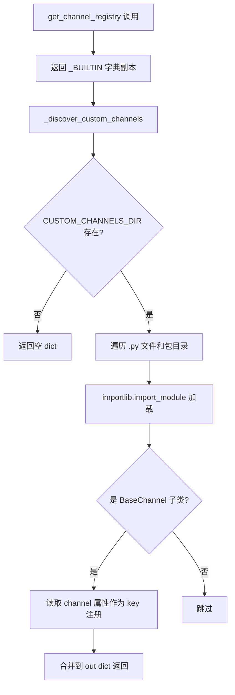
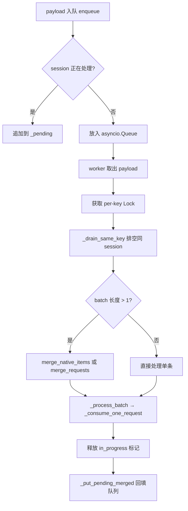

# PD-491.01 CoPaw — 六渠道统一接入与插件动态发现

> 文档编号：PD-491.01
> 来源：CoPaw `src/copaw/app/channels/`
> GitHub：https://github.com/agentscope-ai/CoPaw.git
> 问题域：PD-491 多渠道消息路由 Multi-Channel Message Routing
> 状态：可复用方案

---

## 第 1 章 问题与动机

### 1.1 核心问题

Agent 应用需要同时接入多个即时通讯平台（DingTalk、Feishu、Discord、QQ、iMessage、Console），每个平台的消息格式、认证方式、发送协议完全不同。如果为每个渠道写独立的消息处理逻辑，会导致：

- **重复代码**：每个渠道都要实现消息接收→Agent 处理→回复发送的完整流程
- **耦合严重**：Agent 核心逻辑与渠道协议绑定，新增渠道需要修改核心代码
- **并发问题**：同一用户在同一渠道快速发送多条消息时，需要去重合并而非逐条处理
- **运维困难**：渠道配置变更（如更换 Token）需要重启整个服务

### 1.2 CoPaw 的解法概述

CoPaw 设计了一套三层架构来解决多渠道路由问题：

1. **BaseChannel 抽象基类** (`src/copaw/app/channels/base.py:68`)：定义统一的渠道协议——接收原生消息、转换为 AgentRequest、调用 Agent 处理、发送回复。每个渠道只需实现 `build_agent_request_from_native()`、`send()`、`start()`、`stop()` 四个核心方法
2. **Registry 注册表** (`src/copaw/app/channels/registry.py:24-76`)：内置 6 个渠道 + `custom_channels/` 目录动态发现自定义渠道插件，通过 `importlib` 扫描加载 BaseChannel 子类
3. **ChannelManager 队列管理器** (`src/copaw/app/channels/manager.py:113`)：为每个渠道创建独立的 asyncio.Queue，启动 4 个 worker 并行消费，支持同 session 消息去重合并（drain + merge）和热替换渠道实例
4. **ConfigWatcher 热重载** (`src/copaw/config/watcher.py:22`)：轮询 config.json 的 mtime，diff 渠道配置变更，调用 `replace_channel()` 实现零停机渠道替换
5. **MessageRenderer 可插拔渲染** (`src/copaw/app/channels/renderer.py:75`)：将 Agent 输出的 Message 统一转换为 Content Parts（Text/Image/Video/Audio/File），渠道只需处理标准化的内容类型

### 1.3 设计思想

| 设计原则 | 具体实现 | 理由 | 替代方案 |
|----------|----------|------|----------|
| 协议统一 | BaseChannel 定义 `_consume_one_request` → `_process` → `send_content_parts` 标准流程 | 所有渠道共享同一处理管道，新渠道只需实现 4 个方法 | 每个渠道独立实现完整流程（代码重复） |
| 注册表模式 | `_BUILTIN` 字典 + `_discover_custom_channels()` 动态扫描 | 内置渠道零配置可用，自定义渠道即放即用 | 硬编码 if-else 分支（不可扩展） |
| 队列隔离 | 每渠道独立 Queue + 4 worker，per-key Lock 保证同 session 串行 | 不同渠道互不阻塞，同 session 消息有序处理 | 全局单队列（渠道间互相阻塞） |
| 去重合并 | `_drain_same_key` + `merge_native_items` / `merge_requests` | 用户快速连发图片+文字时合并为一次 Agent 调用 | 逐条处理（浪费 Token，回复碎片化） |
| 热替换 | `replace_channel()` 先启动新实例再锁内交换 | 零停机更新渠道配置（如更换 DingTalk Token） | 重启整个服务（中断所有渠道） |

---

## 第 2 章 源码实现分析

### 2.1 架构概览

```
┌─────────────────────────────────────────────────────────────────┐
│                        ChannelManager                           │
│  ┌──────────┐  ┌──────────┐  ┌──────────┐  ┌──────────┐       │
│  │ DingTalk  │  │  Feishu  │  │ Discord  │  │  Console │  ...  │
│  │  Queue    │  │  Queue   │  │  Queue   │  │  Queue   │       │
│  │ [w0..w3]  │  │ [w0..w3] │  │ [w0..w3] │  │ [w0..w3] │       │
│  └────┬─────┘  └────┬─────┘  └────┬─────┘  └────┬─────┘       │
│       │              │              │              │             │
│       ▼              ▼              ▼              ▼             │
│  ┌─────────────────────────────────────────────────────────┐   │
│  │              BaseChannel._consume_one_request            │   │
│  │  payload → _payload_to_request → _apply_no_text_debounce │   │
│  │  → _process(AgentRequest) → send_content_parts           │   │
│  └─────────────────────────────────────────────────────────┘   │
│                              │                                   │
│                              ▼                                   │
│                    MessageRenderer                                │
│              Message → [TextContent, ImageContent, ...]          │
└─────────────────────────────────────────────────────────────────┘
         ▲                                          │
         │ enqueue(channel_id, payload)             │ send(to_handle, text)
         │ (thread-safe via call_soon_threadsafe)   ▼
   ┌─────────────┐                          ┌──────────────┐
   │ DingTalk SDK │                          │ Platform API │
   │ Feishu SDK   │                          │ (各平台发送)  │
   │ Discord.py   │                          └──────────────┘
   └─────────────┘

   ┌──────────────────────────────────────────────┐
   │              Registry                         │
   │  _BUILTIN: {dingtalk, feishu, discord, ...}  │
   │  + _discover_custom_channels()               │
   │    (scan custom_channels/ dir via importlib)  │
   └──────────────────────────────────────────────┘

   ┌──────────────────────────────────────────────┐
   │           ConfigWatcher                       │
   │  poll config.json mtime → diff channels      │
   │  → replace_channel(new) 热替换               │
   └──────────────────────────────────────────────┘
```

### 2.2 核心实现

#### 2.2.1 注册表：内置 + 插件动态发现



对应源码 `src/copaw/app/channels/registry.py:24-76`：

```python
_BUILTIN: dict[str, type[BaseChannel]] = {
    "imessage": IMessageChannel,
    "discord": DiscordChannel,
    "dingtalk": DingTalkChannel,
    "feishu": FeishuChannel,
    "qq": QQChannel,
    "console": ConsoleChannel,
}

def _discover_custom_channels() -> dict[str, type[BaseChannel]]:
    """Load channel classes from CUSTOM_CHANNELS_DIR."""
    out: dict[str, type[BaseChannel]] = {}
    if not CUSTOM_CHANNELS_DIR.is_dir():
        return out
    dir_str = str(CUSTOM_CHANNELS_DIR)
    if dir_str not in sys.path:
        sys.path.insert(0, dir_str)
    for path in sorted(CUSTOM_CHANNELS_DIR.iterdir()):
        if path.suffix == ".py" and path.stem != "__init__":
            name = path.stem
        elif path.is_dir() and (path / "__init__.py").exists():
            name = path.name
        else:
            continue
        try:
            mod = importlib.import_module(name)
        except Exception:
            logger.exception("failed to load custom channel: %s", name)
            continue
        for obj in vars(mod).values():
            if (
                isinstance(obj, type)
                and issubclass(obj, BaseChannel)
                and obj is not BaseChannel
            ):
                key = getattr(obj, "channel", None)
                if key:
                    out[key] = obj
    return out

def get_channel_registry() -> dict[str, type[BaseChannel]]:
    out = dict(_BUILTIN)
    out.update(_discover_custom_channels())
    return out
```

#### 2.2.2 ChannelManager 队列消费与去重合并



对应源码 `src/copaw/app/channels/manager.py:41-61` (`_drain_same_key`)：

```python
def _drain_same_key(
    q: asyncio.Queue,
    ch: BaseChannel,
    key: str,
    first_payload: Any,
) -> List[Any]:
    """Drain queue of payloads with same debounce key; return batch."""
    batch = [first_payload]
    put_back: List[Any] = []
    while True:
        try:
            p = q.get_nowait()
        except asyncio.QueueEmpty:
            break
        if ch.get_debounce_key(p) == key:
            batch.append(p)
        else:
            put_back.append(p)
    for p in put_back:
        q.put_nowait(p)
    return batch
```

对应源码 `src/copaw/app/channels/manager.py:260-301` (`_consume_channel_loop`)：

```python
async def _consume_channel_loop(self, channel_id: str, worker_index: int) -> None:
    q = self._queues.get(channel_id)
    if not q:
        return
    while True:
        try:
            payload = await q.get()
            ch = await self.get_channel(channel_id)
            if not ch:
                continue
            key = ch.get_debounce_key(payload)
            key_lock = self._key_locks.setdefault(
                (channel_id, key), asyncio.Lock(),
            )
            async with key_lock:
                self._in_progress.add((channel_id, key))
                batch = _drain_same_key(q, ch, key, payload)
            try:
                await _process_batch(ch, batch)
            finally:
                self._in_progress.discard((channel_id, key))
                pending = self._pending.pop((channel_id, key), [])
                _put_pending_merged(ch, q, pending)
        except asyncio.CancelledError:
            break
        except Exception:
            logger.exception("channel consume_one failed: channel=%s worker=%s",
                             channel_id, worker_index)
```

### 2.3 实现细节

#### 线程安全入队

DingTalk SDK 的回调运行在独立线程中，`enqueue()` 通过 `loop.call_soon_threadsafe()` 将 payload 安全地投递到 asyncio 事件循环（`manager.py:242-258`）。DingTalkChannelHandler 的 `_emit_native_threadsafe` 方法（`dingtalk/handler.py:55-60`）同样使用此机制。

#### 消息去重的两层设计

1. **队列层去重**（ChannelManager）：`_drain_same_key` 在 worker 取出消息后，立即排空队列中同 debounce_key 的所有消息，合并为一个 batch 处理。`_in_progress` + `_pending` 机制确保处理期间新到达的同 session 消息不会被另一个 worker 抢走，而是暂存后回填
2. **内容层去重**（BaseChannel）：`_apply_no_text_debounce`（`base.py:217-238`）缓冲无文本的消息（如单独发送的图片），等到文本消息到达时合并发送，避免 Agent 收到空文本请求

#### 热替换流程

`replace_channel()`（`manager.py:363-426`）采用"先启动后交换"策略：
1. 确保新渠道有队列和 enqueue 回调
2. 在锁外启动新渠道（可能耗时，如 DingTalk Stream 连接）
3. 在锁内原子交换渠道实例 + 停止旧渠道

ConfigWatcher（`watcher.py:87-178`）每 2 秒轮询 config.json 的 mtime，通过 hash 快速判断渠道配置是否变更，仅重载变更的渠道。

#### 环境变量过滤

`COPAW_ENABLED_CHANNELS` 环境变量（`constant.py:71-83`）可限制启用的渠道子集，生产环境可精确控制只加载需要的渠道。


---

## 第 3 章 迁移指南

### 3.1 迁移清单

**阶段 1：基础框架（必须）**

- [ ] 定义 `BaseChannel` 抽象基类，包含 `channel` 类属性、`start()`/`stop()`/`send()` 抽象方法
- [ ] 实现 `build_agent_request_from_native()` 协议：原生消息 → 统一请求格式
- [ ] 实现 `_consume_one_request()` 标准处理流程：转换 → 去重 → 处理 → 发送
- [ ] 创建 `ChannelManager`：per-channel Queue + N worker 消费循环

**阶段 2：注册表与插件（推荐）**

- [ ] 实现 `_BUILTIN` 内置渠道字典
- [ ] 实现 `_discover_custom_channels()` 动态扫描目录加载插件
- [ ] 添加 `COPAW_ENABLED_CHANNELS` 环境变量过滤

**阶段 3：高级特性（可选）**

- [ ] 实现 `_drain_same_key` + `merge_native_items` 消息去重合并
- [ ] 实现 `_in_progress` / `_pending` 处理中消息暂存机制
- [ ] 实现 `replace_channel()` 热替换
- [ ] 实现 `ConfigWatcher` 配置文件轮询 + diff 重载
- [ ] 实现 `MessageRenderer` 可插拔渲染器

### 3.2 适配代码模板

以下是一个可直接运行的最小多渠道路由框架：

```python
"""Minimal multi-channel routing framework inspired by CoPaw."""
from __future__ import annotations

import asyncio
import importlib
import logging
import sys
from abc import ABC
from pathlib import Path
from typing import Any, Callable, Dict, List, Optional, Set, Tuple

logger = logging.getLogger(__name__)

# ---------- Base Channel ----------

class BaseChannel(ABC):
    """Abstract channel: subclass sets `channel` and implements core methods."""
    channel: str = ""
    uses_manager_queue: bool = True

    def __init__(self, process: Callable):
        self._process = process
        self._enqueue: Optional[Callable[[Any], None]] = None

    def set_enqueue(self, cb: Optional[Callable[[Any], None]]) -> None:
        self._enqueue = cb

    def get_debounce_key(self, payload: Any) -> str:
        if isinstance(payload, dict):
            return payload.get("session_id") or payload.get("sender_id") or ""
        return getattr(payload, "session_id", "") or ""

    def merge_payloads(self, items: List[Any]) -> Any:
        """Merge multiple payloads into one. Override for channel-specific merge."""
        if len(items) == 1:
            return items[0]
        # Default: concatenate text fields
        texts = []
        for it in items:
            if isinstance(it, dict):
                texts.append(it.get("text", ""))
        first = items[0] if isinstance(items[0], dict) else {}
        return {**first, "text": "\n".join(t for t in texts if t)}

    async def start(self) -> None:
        raise NotImplementedError

    async def stop(self) -> None:
        raise NotImplementedError

    async def consume(self, payload: Any) -> None:
        """Process one payload through the agent pipeline."""
        response = await self._process(payload)
        to_handle = payload.get("sender_id", "") if isinstance(payload, dict) else ""
        await self.send(to_handle, response)

    async def send(self, to_handle: str, text: str, meta: Optional[Dict] = None) -> None:
        raise NotImplementedError


# ---------- Registry ----------

CUSTOM_CHANNELS_DIR = Path("./custom_channels")

def discover_channels(builtin: Dict[str, type]) -> Dict[str, type]:
    """Merge built-in channels with dynamically discovered plugins."""
    out = dict(builtin)
    if not CUSTOM_CHANNELS_DIR.is_dir():
        return out
    dir_str = str(CUSTOM_CHANNELS_DIR)
    if dir_str not in sys.path:
        sys.path.insert(0, dir_str)
    for path in sorted(CUSTOM_CHANNELS_DIR.iterdir()):
        if path.suffix == ".py" and path.stem != "__init__":
            name = path.stem
        elif path.is_dir() and (path / "__init__.py").exists():
            name = path.name
        else:
            continue
        try:
            mod = importlib.import_module(name)
        except Exception:
            logger.exception("Failed to load custom channel: %s", name)
            continue
        for obj in vars(mod).values():
            if isinstance(obj, type) and issubclass(obj, BaseChannel) and obj is not BaseChannel:
                key = getattr(obj, "channel", None)
                if key:
                    out[key] = obj
    return out


# ---------- Channel Manager ----------

QUEUE_MAXSIZE = 1000
WORKERS_PER_CHANNEL = 4

def _drain_same_key(q: asyncio.Queue, ch: BaseChannel, key: str, first: Any) -> List[Any]:
    batch = [first]
    put_back = []
    while True:
        try:
            p = q.get_nowait()
        except asyncio.QueueEmpty:
            break
        if ch.get_debounce_key(p) == key:
            batch.append(p)
        else:
            put_back.append(p)
    for p in put_back:
        q.put_nowait(p)
    return batch


class ChannelManager:
    def __init__(self, channels: List[BaseChannel]):
        self.channels = channels
        self._queues: Dict[str, asyncio.Queue] = {}
        self._tasks: List[asyncio.Task] = []
        self._in_progress: Set[Tuple[str, str]] = set()
        self._pending: Dict[Tuple[str, str], List[Any]] = {}
        self._key_locks: Dict[Tuple[str, str], asyncio.Lock] = {}
        self._loop: Optional[asyncio.AbstractEventLoop] = None

    def enqueue(self, channel_id: str, payload: Any) -> None:
        if self._loop:
            self._loop.call_soon_threadsafe(self._enqueue_one, channel_id, payload)

    def _enqueue_one(self, channel_id: str, payload: Any) -> None:
        q = self._queues.get(channel_id)
        if not q:
            return
        ch = next((c for c in self.channels if c.channel == channel_id), None)
        if not ch:
            q.put_nowait(payload)
            return
        key = ch.get_debounce_key(payload)
        if (channel_id, key) in self._in_progress:
            self._pending.setdefault((channel_id, key), []).append(payload)
            return
        q.put_nowait(payload)

    async def _worker(self, channel_id: str, idx: int) -> None:
        q = self._queues[channel_id]
        while True:
            try:
                payload = await q.get()
                ch = next((c for c in self.channels if c.channel == channel_id), None)
                if not ch:
                    continue
                key = ch.get_debounce_key(payload)
                lock = self._key_locks.setdefault((channel_id, key), asyncio.Lock())
                async with lock:
                    self._in_progress.add((channel_id, key))
                    batch = _drain_same_key(q, ch, key, payload)
                try:
                    merged = ch.merge_payloads(batch) if len(batch) > 1 else batch[0]
                    await ch.consume(merged)
                finally:
                    self._in_progress.discard((channel_id, key))
                    pending = self._pending.pop((channel_id, key), [])
                    if pending:
                        merged_p = ch.merge_payloads(pending) if len(pending) > 1 else pending[0]
                        q.put_nowait(merged_p)
            except asyncio.CancelledError:
                break
            except Exception:
                logger.exception("Worker %s/%d failed", channel_id, idx)

    async def start_all(self) -> None:
        self._loop = asyncio.get_running_loop()
        for ch in self.channels:
            if ch.uses_manager_queue:
                self._queues[ch.channel] = asyncio.Queue(maxsize=QUEUE_MAXSIZE)
                ch.set_enqueue(lambda p, cid=ch.channel: self.enqueue(cid, p))
        for ch in self.channels:
            if ch.channel in self._queues:
                for w in range(WORKERS_PER_CHANNEL):
                    self._tasks.append(asyncio.create_task(self._worker(ch.channel, w)))
        for ch in self.channels:
            await ch.start()

    async def stop_all(self) -> None:
        for t in self._tasks:
            t.cancel()
        await asyncio.gather(*self._tasks, return_exceptions=True)
        self._tasks.clear()
        self._queues.clear()
        for ch in reversed(self.channels):
            await ch.stop()
```

### 3.3 适用场景

| 场景 | 适用度 | 说明 |
|------|--------|------|
| 多 IM 平台 Agent Bot | ⭐⭐⭐ | 核心场景：同时接入 DingTalk/Feishu/Discord 等 |
| 单渠道但需要插件扩展 | ⭐⭐ | 注册表模式支持未来扩展，但单渠道时略显过度 |
| 高并发消息处理 | ⭐⭐⭐ | per-channel Queue + 多 worker + 去重合并有效降低 Agent 调用次数 |
| 需要零停机配置更新 | ⭐⭐⭐ | ConfigWatcher + replace_channel 实现热重载 |
| 嵌入式/资源受限环境 | ⭐ | 多 worker + 多队列有一定内存开销 |

---

## 第 4 章 测试用例

```python
"""Tests for multi-channel routing framework (CoPaw-inspired)."""
import asyncio
import pytest
from unittest.mock import AsyncMock, MagicMock


class MockChannel:
    """Minimal channel for testing."""
    channel = "test"
    uses_manager_queue = True

    def __init__(self):
        self._enqueue = None
        self.consumed = []
        self.started = False
        self.stopped = False

    def set_enqueue(self, cb):
        self._enqueue = cb

    def get_debounce_key(self, payload):
        return payload.get("session_id", "default")

    def merge_payloads(self, items):
        texts = [it.get("text", "") for it in items if isinstance(it, dict)]
        return {**items[0], "text": "\n".join(texts)}

    async def consume(self, payload):
        self.consumed.append(payload)

    async def start(self):
        self.started = True

    async def stop(self):
        self.stopped = True


class TestDrainSameKey:
    """Test _drain_same_key batch extraction."""

    def test_drains_matching_keys(self):
        q = asyncio.Queue()
        ch = MockChannel()
        q.put_nowait({"session_id": "s1", "text": "b"})
        q.put_nowait({"session_id": "s2", "text": "c"})
        q.put_nowait({"session_id": "s1", "text": "d"})

        first = {"session_id": "s1", "text": "a"}
        batch = []
        batch.append(first)
        put_back = []
        while True:
            try:
                p = q.get_nowait()
            except asyncio.QueueEmpty:
                break
            if ch.get_debounce_key(p) == "s1":
                batch.append(p)
            else:
                put_back.append(p)
        for p in put_back:
            q.put_nowait(p)

        assert len(batch) == 3  # a, b, d
        assert q.qsize() == 1  # s2 put back
        remaining = q.get_nowait()
        assert remaining["session_id"] == "s2"

    def test_empty_queue_returns_single(self):
        q = asyncio.Queue()
        first = {"session_id": "s1", "text": "only"}
        batch = [first]
        # No more items in queue
        assert len(batch) == 1


class TestMergePayloads:
    """Test payload merging logic."""

    def test_merge_concatenates_text(self):
        ch = MockChannel()
        items = [
            {"session_id": "s1", "text": "hello"},
            {"session_id": "s1", "text": "world"},
        ]
        merged = ch.merge_payloads(items)
        assert merged["text"] == "hello\nworld"
        assert merged["session_id"] == "s1"

    def test_single_item_no_merge(self):
        ch = MockChannel()
        items = [{"session_id": "s1", "text": "solo"}]
        # Single item should be returned as-is by manager logic
        assert items[0]["text"] == "solo"


class TestChannelManagerLifecycle:
    """Test manager start/stop and enqueue."""

    @pytest.mark.asyncio
    async def test_start_stop(self):
        ch = MockChannel()
        # Simulate manager behavior
        ch.started = False
        await ch.start()
        assert ch.started is True
        await ch.stop()
        assert ch.stopped is True

    @pytest.mark.asyncio
    async def test_enqueue_and_consume(self):
        ch = MockChannel()
        q = asyncio.Queue(maxsize=1000)
        q.put_nowait({"session_id": "s1", "text": "hi"})
        payload = await asyncio.wait_for(q.get(), timeout=1.0)
        await ch.consume(payload)
        assert len(ch.consumed) == 1
        assert ch.consumed[0]["text"] == "hi"


class TestHotReplace:
    """Test channel hot-replacement pattern."""

    @pytest.mark.asyncio
    async def test_replace_swaps_instance(self):
        old_ch = MockChannel()
        old_ch.channel = "test"
        new_ch = MockChannel()
        new_ch.channel = "test"

        channels = [old_ch]
        # Simulate replace: start new, swap, stop old
        await new_ch.start()
        assert new_ch.started
        for i, c in enumerate(channels):
            if c.channel == new_ch.channel:
                channels[i] = new_ch
                break
        await old_ch.stop()
        assert old_ch.stopped
        assert channels[0] is new_ch


class TestRegistryDiscovery:
    """Test registry pattern."""

    def test_builtin_registry(self):
        builtin = {"console": MockChannel, "discord": MockChannel}
        # discover_channels with no custom dir returns builtin
        registry = dict(builtin)
        assert "console" in registry
        assert "discord" in registry
        assert len(registry) == 2

    def test_env_filter(self):
        all_keys = ("console", "discord", "dingtalk", "feishu")
        enabled = "console,discord"
        filtered = tuple(
            k for k in all_keys
            if k in [c.strip() for c in enabled.split(",")]
        )
        assert filtered == ("console", "discord")
```


---

## 第 5 章 跨域关联

| 关联域 | 关系类型 | 说明 |
|--------|----------|------|
| PD-04 工具系统 | 协同 | 渠道的 `_process` 回调最终调用 Agent 工具系统；渠道层负责消息格式转换，工具层负责能力执行 |
| PD-10 中间件管道 | 协同 | BaseChannel 的 `_consume_one_request` → `_before_consume_process` → `_run_process_loop` 本身就是一个微型管道，可与中间件系统对接 |
| PD-03 容错与重试 | 依赖 | `_consume_channel_loop` 的 try/except 捕获异常后仅记录日志继续循环，依赖上层容错机制处理 Agent 调用失败 |
| PD-06 记忆持久化 | 协同 | 渠道通过 `session_id` 标识会话，记忆系统按 session_id 存取上下文，两者通过 AgentRequest.session_id 关联 |
| PD-09 Human-in-the-Loop | 协同 | 渠道是 HITL 的物理载体——用户通过渠道发送审批/拒绝指令，渠道负责将这些指令路由到正确的 Agent 会话 |
| PD-488 配置热重载 | 依赖 | ConfigWatcher 是 PD-488 的具体实现之一，渠道热替换依赖配置变更检测机制 |
| PD-485 多渠道消息系统 | 同域 | PD-491 是 PD-485 的子域，聚焦于消息路由层面；PD-485 覆盖更广的渠道接入与生命周期管理 |

---

## 第 6 章 来源文件索引

| 文件 | 行范围 | 关键实现 |
|------|--------|----------|
| `src/copaw/app/channels/base.py` | L68-L759 | BaseChannel 抽象基类：统一消费协议、去重、渲染、发送 |
| `src/copaw/app/channels/registry.py` | L24-L76 | 注册表：_BUILTIN 字典 + _discover_custom_channels 动态扫描 |
| `src/copaw/app/channels/manager.py` | L41-L61 | _drain_same_key：同 session 消息批量排空 |
| `src/copaw/app/channels/manager.py` | L113-L455 | ChannelManager：队列管理、worker 消费、热替换、事件发送 |
| `src/copaw/app/channels/manager.py` | L260-L301 | _consume_channel_loop：per-key Lock + in_progress + pending |
| `src/copaw/app/channels/manager.py` | L363-L426 | replace_channel：先启动后交换的热替换策略 |
| `src/copaw/config/watcher.py` | L22-L178 | ConfigWatcher：mtime 轮询 + hash diff + 按渠道重载 |
| `src/copaw/app/channels/renderer.py` | L75-L338 | MessageRenderer：Message → Content Parts 可插拔渲染 |
| `src/copaw/app/channels/schema.py` | L1-L67 | ChannelAddress 路由地址 + ChannelMessageConverter 协议 |
| `src/copaw/constant.py` | L71-L83 | get_available_channels：环境变量过滤可用渠道 |
| `src/copaw/cli/channels_cmd.py` | L50-L133 | CHANNEL_TEMPLATE：自定义渠道脚手架模板 |
| `src/copaw/app/channels/dingtalk/handler.py` | L38-L60 | DingTalkChannelHandler：线程安全入队 |
| `src/copaw/app/channels/__init__.py` | L1-L13 | 懒加载 ChannelManager 避免 CLI 拉入重依赖 |

---

## 第 7 章 横向对比维度

> **重要：** 本章用于自动填充 Butcher Wiki 的横向对比表。

```json comparison_data
{
  "project": "CoPaw",
  "dimensions": {
    "渠道注册方式": "内置字典 + importlib 动态扫描 custom_channels/ 目录",
    "消息队列模型": "per-channel asyncio.Queue + 4 worker 并行消费",
    "去重合并策略": "drain_same_key 批量排空 + in_progress/pending 双层暂存",
    "热替换机制": "ConfigWatcher mtime 轮询 + replace_channel 先启后换",
    "渠道数量": "6 内置 (DingTalk/Feishu/Discord/QQ/iMessage/Console) + 插件",
    "线程安全": "call_soon_threadsafe 跨线程入队",
    "渲染适配": "MessageRenderer + RenderStyle 可插拔渲染器"
  }
}
```

### 域元数据补充

```json domain_metadata
{
  "solution_summary": "CoPaw 用 BaseChannel 抽象基类 + Registry 动态发现 + ChannelManager per-channel Queue 四 worker 并行消费，实现六渠道统一接入与消息去重合并",
  "description": "多渠道消息路由需要解决线程安全入队、同 session 消息去重合并、渠道热替换等并发问题",
  "sub_problems": [
    "线程安全的跨线程消息入队",
    "处理中消息的暂存与回填",
    "渠道懒加载避免 CLI 拉入重依赖"
  ],
  "best_practices": [
    "per-channel 独立队列 + 多 worker 避免渠道间互相阻塞",
    "先启动新渠道再锁内交换实现零停机热替换",
    "环境变量过滤可用渠道子集控制生产部署范围"
  ]
}
```

