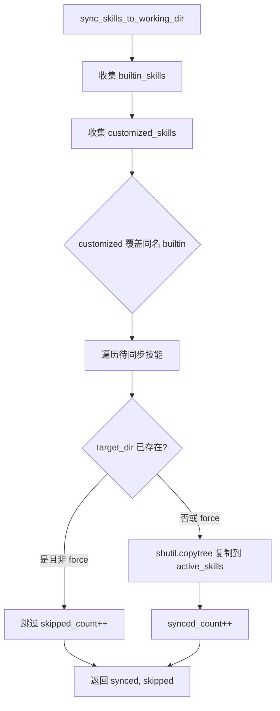
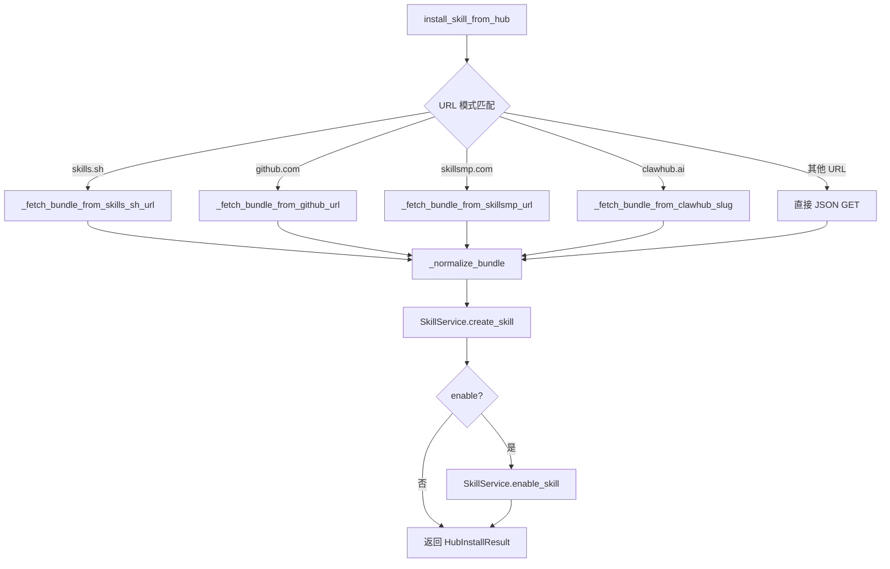

# PD-492.01 CoPaw — 四源技能市场与三级目录热安装

> 文档编号：PD-492.01
> 来源：CoPaw `src/copaw/agents/skills_manager.py` `src/copaw/agents/skills_hub.py`
> GitHub：https://github.com/agentscope-ai/CoPaw.git
> 问题域：PD-492 技能插件系统 Skill Plugin System
> 状态：可复用方案

---

## 第 1 章 问题与动机

### 1.1 核心问题

Agent 系统需要一种可扩展的能力机制，让用户和社区能够为 Agent 添加新功能而不修改核心代码。这涉及几个关键挑战：

1. **技能包格式标准化** — 如何定义一个技能的结构，使其可被 Agent 自动发现和加载？
2. **多源安装** — 技能可能来自内置、用户自定义、社区 Hub、GitHub 仓库等不同来源，如何统一安装流程？
3. **启用/禁用管理** — 如何在不删除技能的情况下控制哪些技能对 Agent 可用？
4. **安全边界** — 外部技能可能包含恶意内容，如何在安装和加载时做好防护？

### 1.2 CoPaw 的解法概述

CoPaw 实现了一套完整的技能生态系统，核心设计包括：

1. **三级目录架构** — `builtin_skills`（代码内置）→ `customized_skills`（用户自定义/Hub 导入）→ `active_skills`（运行时激活），通过 `sync_skills_to_working_dir` 单向同步（`skills_manager.py:129-204`）
2. **SKILL.md + YAML Front Matter 标准** — 每个技能以目录为单位，必须包含带 `name` 和 `description` 字段的 SKILL.md，可选 `references/` 和 `scripts/` 子目录（`skills_manager.py:16-48`）
3. **四源 Hub 安装** — SkillsHub 支持从 ClawHub、skills.sh、GitHub、SkillsMP 四个来源安装技能，通过 URL 模式自动识别来源（`skills_hub.py:1080-1153`）
4. **SkillService 静态服务类** — 提供 create/enable/disable/delete/sync 完整 CRUD 操作，所有方法为 `@staticmethod`，无状态设计（`skills_manager.py:465-886`）
5. **指数退避重试** — Hub HTTP 请求支持可配置的重试次数、超时、退避基数和上限，通过环境变量控制（`skills_hub.py:52-88`）

### 1.3 设计思想

| 设计原则 | 具体实现 | 理由 | 替代方案 |
|----------|----------|------|----------|
| 三级目录分离 | builtin → customized → active 三层目录 | 内置技能不可变，用户修改隔离，运行时只看 active | 单目录 + 元数据标记 |
| 文件系统即数据库 | 技能以目录结构存储，SKILL.md 为入口 | 无需额外数据库，git 友好，人类可读 | SQLite/JSON 注册表 |
| URL 模式匹配分发 | 根据 URL 域名自动路由到对应安装器 | 用户只需提供 URL，无需指定来源类型 | 显式 --source 参数 |
| 无状态服务 | SkillService 全部 @staticmethod | 无需实例化，任何地方可调用 | 单例模式 |
| 环境变量驱动配置 | HTTP 超时/重试/退避均通过 env var 控制 | 容器化部署友好，无需修改代码 | 配置文件 |

---

## 第 2 章 源码实现分析

### 2.1 架构概览

CoPaw 的技能系统由三个核心模块组成：

```
┌─────────────────────────────────────────────────────────────────┐
│                        CoPawAgent                               │
│  react_agent.py:153-176  _register_skills(toolkit)              │
│    ↓ ensure_skills_initialized()                                │
│    ↓ list_available_skills() → active_skills 目录扫描            │
│    ↓ toolkit.register_agent_skill(skill_dir)                    │
└──────────────────────────┬──────────────────────────────────────┘
                           │
          ┌────────────────┼────────────────┐
          ▼                ▼                ▼
┌─────────────────┐ ┌──────────────┐ ┌──────────────────┐
│  skills_manager  │ │  skills_hub   │ │  skills router   │
│  SkillService    │ │  四源安装器    │ │  FastAPI REST    │
│  三级目录同步     │ │  HTTP 重试    │ │  CRUD 端点       │
│  CRUD 操作       │ │  Bundle 解析  │ │  Hub 搜索/安装   │
└─────────────────┘ └──────────────┘ └──────────────────┘
          │                │
          ▼                ▼
┌─────────────────────────────────────────┐
│           文件系统 (~/.copaw/)            │
│  ├── active_skills/    ← Agent 运行时读取 │
│  ├── customized_skills/ ← 用户/Hub 导入   │
│  └── (builtin: 代码内 agents/skills/)     │
└─────────────────────────────────────────┘
```

### 2.2 核心实现

#### 2.2.1 三级目录同步机制



对应源码 `src/copaw/agents/skills_manager.py:129-204`：

```python
def sync_skills_to_working_dir(
    skill_names: list[str] | None = None,
    force: bool = False,
) -> tuple[int, int]:
    builtin_skills = get_builtin_skills_dir()
    customized_skills = get_customized_skills_dir()
    active_skills = get_active_skills_dir()

    active_skills.mkdir(parents=True, exist_ok=True)

    # Collect skills from both sources (customized overwrites builtin)
    skills_to_sync = _collect_skills_from_dir(builtin_skills)
    # Customized skills override builtin with same name
    skills_to_sync.update(_collect_skills_from_dir(customized_skills))

    # Filter by skill_names if specified
    if skill_names is not None:
        skills_to_sync = {
            name: path
            for name, path in skills_to_sync.items()
            if name in skill_names
        }

    synced_count = 0
    skipped_count = 0

    for skill_name, skill_dir in skills_to_sync.items():
        target_dir = active_skills / skill_name
        if target_dir.exists() and not force:
            skipped_count += 1
            continue
        try:
            if target_dir.exists():
                shutil.rmtree(target_dir)
            shutil.copytree(skill_dir, target_dir)
            synced_count += 1
        except Exception as e:
            logger.error("Failed to sync skill '%s': %s", skill_name, e)

    return synced_count, skipped_count
```

关键设计：customized 通过 `dict.update()` 覆盖同名 builtin，实现用户定制优先级。反向同步 `sync_skills_from_active_to_customized`（`skills_manager.py:251-308`）使用 `filecmp.dircmp` 递归比较，仅同步与 builtin 不同的技能，避免将未修改的内置技能写入 customized 目录。

#### 2.2.2 四源 Hub 安装路由



对应源码 `src/copaw/agents/skills_hub.py:1080-1153`：

```python
def install_skill_from_hub(
    *,
    bundle_url: str,
    version: str = "",
    enable: bool = True,
    overwrite: bool = False,
) -> HubInstallResult:
    source_url = bundle_url
    data: Any

    if not bundle_url or not _is_http_url(bundle_url):
        raise ValueError("bundle_url must be a valid http(s) URL")

    skills_spec = _extract_skills_sh_spec(bundle_url)
    if skills_spec is not None:
        data, source_url = _fetch_bundle_from_skills_sh_url(
            bundle_url, requested_version=version)
    else:
        github_spec = _extract_github_spec(bundle_url)
        if github_spec is not None:
            data, source_url = _fetch_bundle_from_github_url(
                bundle_url, requested_version=version)
        else:
            skillsmp_slug = _extract_skillsmp_slug(bundle_url)
            if skillsmp_slug:
                data, source_url = _fetch_bundle_from_skillsmp_url(
                    bundle_url, requested_version=version)
            else:
                clawhub_slug = _resolve_clawhub_slug(bundle_url)
                if clawhub_slug:
                    data, source_url = _fetch_bundle_from_clawhub_slug(
                        clawhub_slug, version)
                else:
                    data = _http_json_get(bundle_url)

    name, content, references, scripts, extra_files = _normalize_bundle(data)
    created = SkillService.create_skill(
        name=name, content=content, overwrite=overwrite,
        references=references, scripts=scripts, extra_files=extra_files)
    if not created:
        raise RuntimeError(f"Failed to create skill '{name}'.")

    enabled = False
    if enable:
        enabled = SkillService.enable_skill(name, force=True)
    return HubInstallResult(name=name, enabled=enabled, source_url=source_url)
```

### 2.3 实现细节

#### SKILL.md YAML Front Matter 验证

技能创建时通过 `python-frontmatter` 库解析 SKILL.md，强制要求 `name` 和 `description` 字段（`skills_manager.py:570-593`）。示例格式：

```yaml
---
name: himalaya
description: "CLI to manage emails via IMAP/SMTP."
homepage: https://github.com/pimalaya/himalaya
metadata:
  openclaw:
    emoji: "📧"
    requires: { bins: ["himalaya"] }
---
```

#### 递归目录树构建

`_build_directory_tree`（`skills_manager.py:74-108`）递归扫描技能目录，生成嵌套字典表示文件树。反向操作 `_create_files_from_tree`（`skills_manager.py:417-462`）从字典创建文件系统结构，支持 `None`（空文件）、`str`（有内容文件）、`dict`（子目录）三种值类型。

#### GitHub 仓库技能发现

skills.sh 和 GitHub URL 安装器使用两阶段发现策略（`skills_hub.py:776-877`）：
1. **直接路径探测** — 尝试 `skills/<name>/SKILL.md`、`<name>/SKILL.md`、`SKILL.md` 三个候选路径
2. **模糊匹配回退** — 若直接路径全部 404，通过 `git/trees/{ref}?recursive=1` 获取完整文件树，用 `_normalize_skill_key` 做模糊匹配

#### 路径遍历防护

`load_skill_file`（`skills_manager.py:766-885`）和 `_safe_path_parts`（`skills_hub.py:248-257`）均实现了路径遍历攻击防护：拒绝 `..`、绝对路径、反斜杠，仅允许 `references/` 和 `scripts/` 前缀。

#### HTTP 指数退避重试

`_http_get`（`skills_hub.py:127-219`）实现了完整的重试机制：
- 可重试状态码集合：`{408, 409, 425, 429, 500, 502, 503, 504}`
- 退避公式：`min(cap, base * 2^(attempt-1))`，默认 base=0.8s，cap=6s
- GitHub 403 rate limit 特殊处理：检测响应体中的 "rate limit" 关键词，抛出明确错误提示设置 GITHUB_TOKEN
- 所有参数通过环境变量可配置：`COPAW_SKILLS_HUB_HTTP_TIMEOUT`、`COPAW_SKILLS_HUB_HTTP_RETRIES` 等

---

## 第 3 章 迁移指南

### 3.1 迁移清单

**阶段 1：技能包格式定义**
- [ ] 定义技能目录结构：`<skill_name>/SKILL.md` + 可选 `references/` + `scripts/`
- [ ] 选择元数据格式：YAML Front Matter（推荐）或独立 manifest.json
- [ ] 实现 `_build_directory_tree` 和 `_create_files_from_tree` 双向转换
- [ ] 实现 SKILL.md 解析和验证（必填字段检查）

**阶段 2：三级目录管理**
- [ ] 定义三级目录路径常量：builtin / customized / active
- [ ] 实现 `sync_skills_to_working_dir`（builtin+customized → active）
- [ ] 实现 `sync_skills_from_active_to_customized`（反向同步用户修改）
- [ ] 实现 `_is_directory_same` 递归目录比较（避免无变更同步）
- [ ] 实现 SkillService CRUD：create / enable / disable / delete / list

**阶段 3：Hub 安装器**
- [ ] 实现 `_http_get` 带重试和指数退避
- [ ] 实现 URL 模式匹配分发（按需选择支持的来源）
- [ ] 实现 `_normalize_bundle` 统一不同来源的数据格式
- [ ] 实现路径遍历防护（`_safe_path_parts`）

**阶段 4：集成层**
- [ ] Agent 初始化时调用 `ensure_skills_initialized` + `list_available_skills`
- [ ] 遍历 active_skills 注册到 Toolkit
- [ ] 提供 CLI 命令（list / config）和 REST API 端点

### 3.2 适配代码模板

以下是一个精简的三级目录技能管理器，可直接复用：

```python
"""Minimal skill manager with three-tier directory sync."""
from __future__ import annotations

import shutil
from dataclasses import dataclass, field
from pathlib import Path
from typing import Any

import frontmatter


@dataclass
class SkillInfo:
    name: str
    content: str
    source: str  # "builtin" | "customized" | "active"
    path: str
    references: dict[str, Any] = field(default_factory=dict)
    scripts: dict[str, Any] = field(default_factory=dict)


class SkillManager:
    """Three-tier skill directory manager."""

    def __init__(
        self,
        builtin_dir: Path,
        customized_dir: Path,
        active_dir: Path,
    ):
        self.builtin_dir = builtin_dir
        self.customized_dir = customized_dir
        self.active_dir = active_dir

    def _collect_skills(self, directory: Path) -> dict[str, Path]:
        skills: dict[str, Path] = {}
        if directory.exists():
            for d in directory.iterdir():
                if d.is_dir() and (d / "SKILL.md").exists():
                    skills[d.name] = d
        return skills

    def sync_to_active(
        self,
        names: list[str] | None = None,
        force: bool = False,
    ) -> tuple[int, int]:
        self.active_dir.mkdir(parents=True, exist_ok=True)
        pool = self._collect_skills(self.builtin_dir)
        pool.update(self._collect_skills(self.customized_dir))
        if names is not None:
            pool = {k: v for k, v in pool.items() if k in names}

        synced = skipped = 0
        for name, src in pool.items():
            dst = self.active_dir / name
            if dst.exists() and not force:
                skipped += 1
                continue
            if dst.exists():
                shutil.rmtree(dst)
            shutil.copytree(src, dst)
            synced += 1
        return synced, skipped

    def list_active(self) -> list[str]:
        if not self.active_dir.exists():
            return []
        return [
            d.name
            for d in self.active_dir.iterdir()
            if d.is_dir() and (d / "SKILL.md").exists()
        ]

    def create_skill(
        self,
        name: str,
        content: str,
        overwrite: bool = False,
    ) -> bool:
        post = frontmatter.loads(content)
        if not post.get("name") or not post.get("description"):
            return False
        skill_dir = self.customized_dir / name
        if skill_dir.exists() and not overwrite:
            return False
        if skill_dir.exists():
            shutil.rmtree(skill_dir)
        skill_dir.mkdir(parents=True, exist_ok=True)
        (skill_dir / "SKILL.md").write_text(content, encoding="utf-8")
        return True

    def enable_skill(self, name: str, force: bool = False) -> bool:
        self.sync_to_active(names=[name], force=force)
        return (self.active_dir / name).exists()

    def disable_skill(self, name: str) -> bool:
        target = self.active_dir / name
        if not target.exists():
            return False
        shutil.rmtree(target)
        return True
```

### 3.3 适用场景

| 场景 | 适用度 | 说明 |
|------|--------|------|
| CLI Agent 工具扩展 | ⭐⭐⭐ | 完美匹配：SKILL.md 作为 prompt 注入，references 作为上下文 |
| LLM 应用插件市场 | ⭐⭐⭐ | 四源安装器可直接复用，Hub 搜索 + 一键安装 |
| 多租户 Agent 平台 | ⭐⭐ | 需要增加租户隔离层，当前设计为单用户 |
| 嵌入式设备 Agent | ⭐ | 文件系统操作较重，需改为内存/数据库方案 |

---

## 第 4 章 测试用例

```python
"""Tests for CoPaw skill plugin system core functionality."""
import tempfile
from pathlib import Path

import pytest


class TestSkillManager:
    """Test three-tier directory sync and CRUD operations."""

    @pytest.fixture
    def skill_dirs(self, tmp_path: Path):
        builtin = tmp_path / "builtin_skills"
        customized = tmp_path / "customized_skills"
        active = tmp_path / "active_skills"
        builtin.mkdir()
        customized.mkdir()
        active.mkdir()
        return builtin, customized, active

    @pytest.fixture
    def sample_skill_md(self) -> str:
        return (
            "---\n"
            "name: test-skill\n"
            "description: A test skill\n"
            "---\n"
            "# Test Skill\n\nDoes testing things.\n"
        )

    def _create_skill_dir(
        self, base: Path, name: str, content: str
    ) -> Path:
        skill_dir = base / name
        skill_dir.mkdir(parents=True, exist_ok=True)
        (skill_dir / "SKILL.md").write_text(content, encoding="utf-8")
        return skill_dir

    def test_collect_skills_requires_skill_md(self, skill_dirs):
        """Directories without SKILL.md are not recognized as skills."""
        builtin, _, _ = skill_dirs
        (builtin / "no-skill-md").mkdir()
        (builtin / "no-skill-md" / "README.md").write_text("not a skill")
        from copaw.agents.skills_manager import _collect_skills_from_dir
        assert _collect_skills_from_dir(builtin) == {}

    def test_sync_builtin_to_active(
        self, skill_dirs, sample_skill_md
    ):
        """Builtin skills sync to active_skills directory."""
        builtin, customized, active = skill_dirs
        self._create_skill_dir(builtin, "email", sample_skill_md)

        from copaw.agents.skills_manager import sync_skills_to_working_dir
        # Monkey-patch directory getters for test isolation
        import copaw.agents.skills_manager as sm
        orig_b, orig_c, orig_a = (
            sm.get_builtin_skills_dir,
            sm.get_customized_skills_dir,
            sm.get_active_skills_dir,
        )
        sm.get_builtin_skills_dir = lambda: builtin
        sm.get_customized_skills_dir = lambda: customized
        sm.get_active_skills_dir = lambda: active
        try:
            synced, skipped = sync_skills_to_working_dir()
            assert synced == 1
            assert skipped == 0
            assert (active / "email" / "SKILL.md").exists()
        finally:
            sm.get_builtin_skills_dir = orig_b
            sm.get_customized_skills_dir = orig_c
            sm.get_active_skills_dir = orig_a

    def test_customized_overrides_builtin(
        self, skill_dirs, sample_skill_md
    ):
        """Customized skill with same name overrides builtin."""
        builtin, customized, active = skill_dirs
        self._create_skill_dir(builtin, "email", sample_skill_md)
        custom_content = sample_skill_md.replace("A test skill", "Custom version")
        self._create_skill_dir(customized, "email", custom_content)

        import copaw.agents.skills_manager as sm
        orig_b, orig_c, orig_a = (
            sm.get_builtin_skills_dir,
            sm.get_customized_skills_dir,
            sm.get_active_skills_dir,
        )
        sm.get_builtin_skills_dir = lambda: builtin
        sm.get_customized_skills_dir = lambda: customized
        sm.get_active_skills_dir = lambda: active
        try:
            synced, _ = sync_skills_to_working_dir(force=True)
            assert synced == 1
            content = (active / "email" / "SKILL.md").read_text()
            assert "Custom version" in content
        finally:
            sm.get_builtin_skills_dir = orig_b
            sm.get_customized_skills_dir = orig_c
            sm.get_active_skills_dir = orig_a

    def test_disable_removes_from_active(
        self, skill_dirs, sample_skill_md
    ):
        """Disabling a skill removes it from active but not customized."""
        _, customized, active = skill_dirs
        self._create_skill_dir(active, "email", sample_skill_md)
        self._create_skill_dir(customized, "email", sample_skill_md)

        import copaw.agents.skills_manager as sm
        orig = sm.get_active_skills_dir
        sm.get_active_skills_dir = lambda: active
        try:
            result = sm.SkillService.disable_skill("email")
            assert result is True
            assert not (active / "email").exists()
            assert (customized / "email" / "SKILL.md").exists()
        finally:
            sm.get_active_skills_dir = orig

    def test_create_skill_validates_frontmatter(self, skill_dirs):
        """Creating a skill without name/description in frontmatter fails."""
        _, customized, _ = skill_dirs
        import copaw.agents.skills_manager as sm
        orig = sm.get_customized_skills_dir
        sm.get_customized_skills_dir = lambda: customized
        try:
            result = sm.SkillService.create_skill(
                name="bad-skill",
                content="# No frontmatter\nJust markdown.",
            )
            assert result is False
        finally:
            sm.get_customized_skills_dir = orig


class TestSkillsHub:
    """Test URL pattern matching and bundle normalization."""

    def test_extract_skills_sh_spec(self):
        from copaw.agents.skills_hub import _extract_skills_sh_spec
        result = _extract_skills_sh_spec(
            "https://skills.sh/owner/repo/my-skill"
        )
        assert result == ("owner", "repo", "my-skill")

    def test_extract_skills_sh_spec_invalid(self):
        from copaw.agents.skills_hub import _extract_skills_sh_spec
        assert _extract_skills_sh_spec("https://example.com/foo") is None

    def test_extract_github_spec(self):
        from copaw.agents.skills_hub import _extract_github_spec
        result = _extract_github_spec(
            "https://github.com/owner/repo/tree/main/skills/email"
        )
        assert result == ("owner", "repo", "main", "skills/email")

    def test_safe_path_parts_blocks_traversal(self):
        from copaw.agents.skills_hub import _safe_path_parts
        assert _safe_path_parts("../etc/passwd") is None
        assert _safe_path_parts("/absolute/path") is None
        assert _safe_path_parts("references/doc.md") == [
            "references", "doc.md"
        ]

    def test_normalize_bundle_extracts_content(self):
        from copaw.agents.skills_hub import _normalize_bundle
        data = {
            "name": "test",
            "files": {
                "SKILL.md": "---\nname: test\ndescription: t\n---\n# Test",
                "references/doc.md": "hello",
            },
        }
        name, content, refs, scripts, extra = _normalize_bundle(data)
        assert name == "test"
        assert "# Test" in content
        assert "doc.md" in refs
```

---

## 第 5 章 跨域关联

| 关联域 | 关系类型 | 说明 |
|--------|----------|------|
| PD-04 工具系统 | 强依赖 | 技能最终通过 `toolkit.register_agent_skill(skill_dir)` 注册为工具，技能系统是工具系统的上层抽象 |
| PD-03 容错与重试 | 协同 | Hub 安装器的 `_http_get` 实现了指数退避重试，与 PD-03 的容错模式一致 |
| PD-10 中间件管道 | 协同 | 技能加载发生在 Agent 初始化管道中（`_register_skills` 在 `__init__` 中调用），可视为初始化中间件 |
| PD-09 Human-in-the-Loop | 协同 | CLI `skills config` 命令提供交互式多选界面，用户手动选择启用/禁用技能 |
| PD-06 记忆持久化 | 弱关联 | 技能目录持久化在 `~/.copaw/` 下，与记忆系统共享同一工作目录 |
| PD-486 技能市场 | 强关联 | PD-486 聚焦市场发现（搜索/浏览），PD-492 聚焦安装/管理生命周期，两者互补 |

---

## 第 6 章 来源文件索引

| 文件 | 行范围 | 关键实现 |
|------|--------|----------|
| `src/copaw/agents/skills_manager.py` | L16-L48 | SkillInfo 数据模型定义 |
| `src/copaw/agents/skills_manager.py` | L74-L108 | `_build_directory_tree` 递归目录树构建 |
| `src/copaw/agents/skills_manager.py` | L111-L127 | `_collect_skills_from_dir` 技能发现（SKILL.md 检测） |
| `src/copaw/agents/skills_manager.py` | L129-L204 | `sync_skills_to_working_dir` 三级目录正向同步 |
| `src/copaw/agents/skills_manager.py` | L251-L308 | `sync_skills_from_active_to_customized` 反向同步 |
| `src/copaw/agents/skills_manager.py` | L417-L462 | `_create_files_from_tree` 从字典创建文件系统 |
| `src/copaw/agents/skills_manager.py` | L465-L886 | SkillService 完整 CRUD 服务类 |
| `src/copaw/agents/skills_manager.py` | L570-L593 | YAML Front Matter 验证逻辑 |
| `src/copaw/agents/skills_manager.py` | L766-L885 | `load_skill_file` 带路径遍历防护的文件加载 |
| `src/copaw/agents/skills_hub.py` | L40-L49 | 可重试 HTTP 状态码集合 |
| `src/copaw/agents/skills_hub.py` | L52-L88 | 环境变量驱动的 HTTP 配置（超时/重试/退避） |
| `src/copaw/agents/skills_hub.py` | L127-L219 | `_http_get` 带指数退避的 HTTP 客户端 |
| `src/copaw/agents/skills_hub.py` | L248-L257 | `_safe_path_parts` 路径遍历防护 |
| `src/copaw/agents/skills_hub.py` | L425-L486 | `_normalize_bundle` 多格式 Bundle 统一解析 |
| `src/copaw/agents/skills_hub.py` | L510-L563 | `_extract_github_spec` GitHub URL 解析 |
| `src/copaw/agents/skills_hub.py` | L643-L675 | `_github_list_skill_md_roots` 仓库级 SKILL.md 发现 |
| `src/copaw/agents/skills_hub.py` | L776-L877 | `_fetch_bundle_from_skills_sh_url` 两阶段技能发现 |
| `src/copaw/agents/skills_hub.py` | L1080-L1153 | `install_skill_from_hub` 四源路由入口 |
| `src/copaw/agents/react_agent.py` | L153-L176 | `_register_skills` Agent 启动时技能注册 |
| `src/copaw/app/routers/skills.py` | L55-L216 | FastAPI REST 端点（CRUD + Hub 搜索/安装） |
| `src/copaw/cli/skills_cmd.py` | L12-L98 | `configure_skills_interactive` 交互式多选配置 |
| `src/copaw/cli/init_cmd.py` | L242-L277 | `copaw init` 中的技能初始化流程 |
| `src/copaw/constant.py` | L34-L37 | ACTIVE_SKILLS_DIR / CUSTOMIZED_SKILLS_DIR 常量 |

---

## 第 7 章 横向对比维度

```json comparison_data
{
  "project": "CoPaw",
  "dimensions": {
    "技能包格式": "SKILL.md YAML Front Matter + references/ + scripts/ 三件套",
    "安装来源": "四源：ClawHub API + skills.sh + GitHub + SkillsMP，URL 自动识别",
    "启用禁用机制": "三级目录：builtin → customized → active，copytree 同步",
    "版本控制": "Hub 版本号 + GitHub branch/tag，安装时指定 version 参数",
    "安全防护": "路径遍历拦截 + Front Matter 必填验证 + 文件数上限 200",
    "CLI 交互": "Click 多选 checkbox + Rich Panel，支持 --defaults 非交互模式"
  }
}
```

### 域元数据补充

```json domain_metadata
{
  "solution_summary": "CoPaw 用三级目录（builtin→customized→active）+ 四源 Hub 安装器（ClawHub/skills.sh/GitHub/SkillsMP URL 自动路由）实现完整技能生命周期管理",
  "description": "技能从发现、安装、启用到运行时注册的全链路管理",
  "sub_problems": [
    "技能反向同步（active→customized 变更回写）",
    "GitHub 仓库级 SKILL.md 模糊发现",
    "Hub HTTP 指数退避与 rate limit 处理"
  ],
  "best_practices": [
    "customized 通过 dict.update 覆盖同名 builtin 实现优先级",
    "filecmp.dircmp 递归比较避免无变更反向同步",
    "URL 域名模式匹配自动路由到对应安装器"
  ]
}
```
