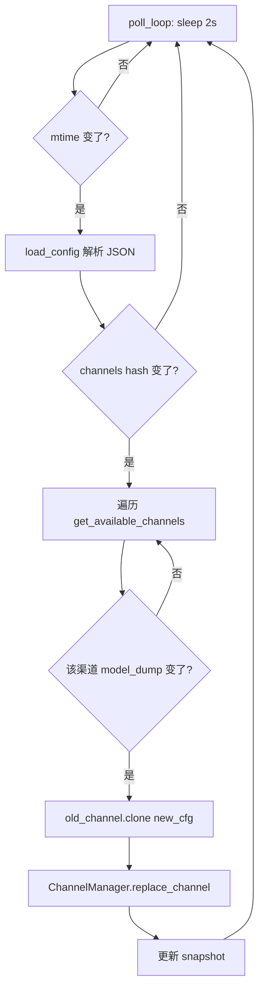
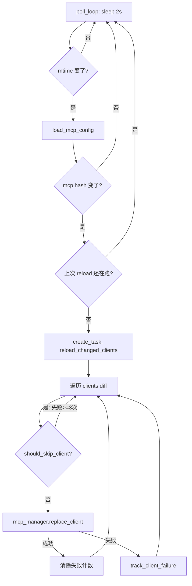
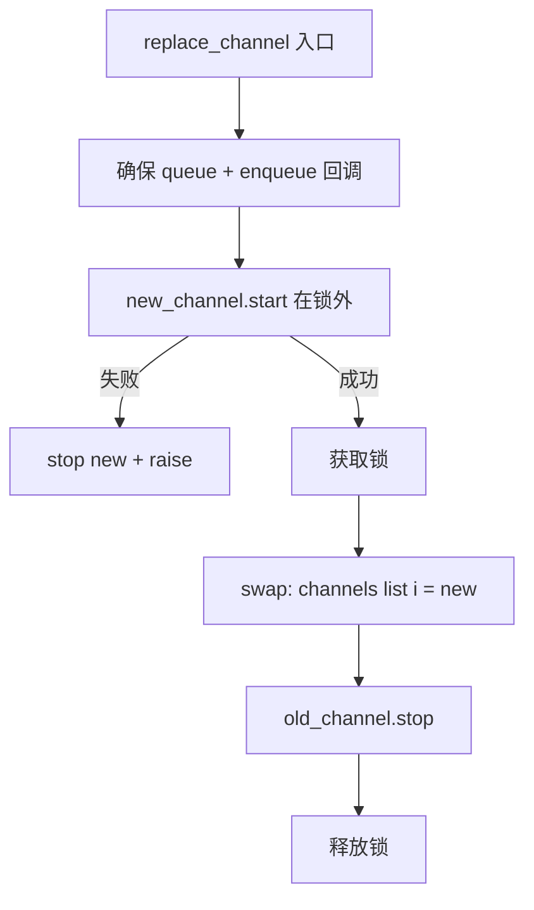

# PD-493.01 CoPaw — 双 Watcher 轮询差异热重载

> 文档编号：PD-493.01
> 来源：CoPaw `src/copaw/config/watcher.py` `src/copaw/app/mcp/watcher.py`
> GitHub：https://github.com/agentscope-ai/CoPaw.git
> 问题域：PD-493 配置热重载 Config Hot Reload
> 状态：可复用方案

---

## 第 1 章 问题与动机

### 1.1 核心问题

长时间运行的 Agent 服务（如聊天机器人、MCP 工具网关）在运行期间需要修改配置——新增渠道、更换 API Key、启用/禁用 MCP 工具——但重启服务意味着中断所有在线会话。配置热重载解决的核心矛盾是：**运行时可变性 vs 服务连续性**。

具体子问题包括：
1. 如何检测配置文件变更而不引入重量级文件系统监听依赖（如 inotify/fsevents）？
2. 如何精确识别"哪些组件的配置变了"，避免全量重载导致的服务抖动？
3. 组件级热替换时，如何保证旧组件优雅关闭、新组件原子切入？
4. MCP 客户端连接可能耗时较长（进程启动 + 握手），如何避免阻塞轮询循环？
5. 重载失败时如何防止无限重试耗尽资源？

### 1.2 CoPaw 的解法概述

CoPaw 采用**双层独立 Watcher** 架构，将渠道配置和 MCP 配置的热重载完全解耦：

1. **ConfigWatcher**（`src/copaw/config/watcher.py:22`）— 监控 `config.json` 中的 `channels` 段，mtime + hash 双重检测，逐渠道 diff 后调用 `ChannelManager.replace_channel()` 原子替换
2. **MCPConfigWatcher**（`src/copaw/app/mcp/watcher.py:26`）— 独立监控 `mcp` 段，后台 Task 非阻塞重载，per-client 失败计数器 + 最大重试限制
3. **Pydantic model_dump + hash** 作为快速变更检测手段，避免逐字段比较
4. **clone() 模式**（`src/copaw/app/channels/base.py:694`）— 旧渠道实例克隆出新实例，保留 process handler 和回调引用
5. **先启后停**的替换顺序——新组件 start 成功后才 stop 旧组件，保证零中断

### 1.3 设计思想

| 设计原则 | 具体实现 | 理由 | 替代方案 |
|----------|----------|------|----------|
| 轻量检测 | mtime 轮询 + str(model_dump) hash | 无需 watchdog/inotify 依赖，跨平台一致 | fsevents/inotify（平台绑定） |
| 关注点分离 | ConfigWatcher 与 MCPConfigWatcher 独立运行 | 渠道和 MCP 生命周期不同，解耦降低复杂度 | 单一 Watcher 统管所有配置段 |
| 最小重载 | 逐渠道/逐客户端 diff，只重载变更项 | 避免全量重载导致所有连接断开 | 全量 reload（简单但破坏性大） |
| 先启后停 | replace_channel 先 start 新渠道再 stop 旧渠道 | 保证服务连续性，新渠道失败时旧渠道仍在 | 先停后启（有服务中断窗口） |
| 有限重试 | per-client 失败计数器，3 次后放弃直到配置变更 | 防止坏配置无限重试耗尽日志和 CPU | 无限重试 / 指数退避 |

---

## 第 2 章 源码实现分析

### 2.1 架构概览

CoPaw 的配置热重载由两个独立的 asyncio Task 驱动，在 FastAPI lifespan 中启动：

```
┌─────────────────────────────────────────────────────────┐
│                    FastAPI Lifespan                       │
│                                                          │
│  ┌──────────────┐          ┌───────────────────┐        │
│  │ ConfigWatcher │          │ MCPConfigWatcher   │        │
│  │ (asyncio.Task)│          │ (asyncio.Task)     │        │
│  └──────┬───────┘          └────────┬──────────┘        │
│         │ poll 2s                    │ poll 2s            │
│         ▼                            ▼                    │
│  ┌──────────────┐          ┌───────────────────┐        │
│  │ config.json   │          │ config.json        │        │
│  │ .channels     │          │ .mcp               │        │
│  └──────┬───────┘          └────────┬──────────┘        │
│         │ diff                       │ diff               │
│         ▼                            ▼                    │
│  ┌──────────────┐          ┌───────────────────┐        │
│  │ChannelManager│          │ MCPClientManager   │        │
│  │.replace_     │          │ .replace_client()  │        │
│  │ channel()    │          │ .remove_client()   │        │
│  └──────────────┘          └───────────────────┘        │
│                                                          │
│  替换流程：clone(new_cfg) → start(new) → swap → stop(old)│
└─────────────────────────────────────────────────────────┘
```

启动入口在 `src/copaw/app/_app.py:89-105`：

```python
# _app.py:89-105
config_watcher = ConfigWatcher(channel_manager=channel_manager)
await config_watcher.start()

mcp_watcher = MCPConfigWatcher(
    mcp_manager=mcp_manager,
    config_loader=load_config,
    config_path=get_config_path(),
)
await mcp_watcher.start()
```

关闭顺序严格遵循"先 watcher 后组件"（`_app.py:120-138`），确保不会在关闭过程中触发新的重载。

### 2.2 核心实现

#### 2.2.1 ConfigWatcher — mtime + hash 双重检测与逐渠道 diff



对应源码 `src/copaw/config/watcher.py:82-178`：

```python
# watcher.py:82-86 — 快速 hash：将 Pydantic model 序列化为 JSON 字符串再取 hash
@staticmethod
def _channels_hash(channels: ChannelConfig) -> int:
    """Fast hash of channels section for quick change detection."""
    return hash(str(channels.model_dump(mode="json")))

# watcher.py:95-178 — 核心检测与重载逻辑
async def _check(self) -> None:
    # 1) mtime 快速排除
    try:
        mtime = self._config_path.stat().st_mtime
    except FileNotFoundError:
        return
    if mtime == self._last_mtime:
        return
    self._last_mtime = mtime

    # 2) 解析配置，hash 快速排除非 channels 变更
    config = load_config(self._config_path)
    new_hash = self._channels_hash(config.channels)
    if new_hash == self._last_channels_hash:
        return  # 只有 last_dispatch 等非渠道字段变了

    # 3) 逐渠道 diff：比较 model_dump 输出
    for name in get_available_channels():
        new_dump = new_ch.model_dump(mode="json")
        old_dump = old_ch.model_dump(mode="json")
        if new_dump == old_dump:
            continue
        # 4) clone + replace
        old_channel = await self._channel_manager.get_channel(name)
        new_channel = old_channel.clone(new_ch)
        await self._channel_manager.replace_channel(new_channel)
```

三层过滤漏斗：mtime → section hash → per-channel dump 比较，逐层缩小重载范围。

#### 2.2.2 MCPConfigWatcher — 非阻塞重载与失败追踪



对应源码 `src/copaw/app/mcp/watcher.py:151-318`：

```python
# watcher.py:151-189 — 检测变更并启动非阻塞重载
async def _check(self) -> None:
    # mtime + hash 双重检测（同 ConfigWatcher）
    if mtime == self._last_mtime:
        return
    new_hash = self._mcp_hash(new_mcp)
    if new_hash == self._last_mcp_hash:
        return

    # 关键：如果上次重载还在进行，跳过本轮
    if self._reload_task and not self._reload_task.done():
        return

    # 非阻塞：在后台 Task 中执行重载
    self._reload_task = asyncio.create_task(
        self._reload_changed_clients_wrapper(new_mcp),
        name="mcp_reload_task",
    )

# watcher.py:262-318 — per-client 重载与失败追踪
async def _reload_single_client(self, key: str, new_cfg) -> None:
    client_hash = hash(str(new_cfg.model_dump(mode="json")))
    if self._should_skip_client(key, client_hash):
        return  # 同一配置已失败 >= 3 次，跳过
    try:
        await self._mcp_manager.replace_client(key, new_cfg)
        self._client_failures.pop(key, None)  # 成功则清除计数
    except Exception:
        self._track_client_failure(key, client_hash)

def _should_skip_client(self, key: str, client_hash: int) -> bool:
    if key in self._client_failures:
        retry_count, last_hash = self._client_failures[key]
        # 同一配置失败 >= max_retries 次则跳过
        # 配置变更（hash 不同）会重置计数
        if last_hash == client_hash and retry_count >= self._max_retries:
            return True
    return False
```

### 2.3 实现细节

#### ChannelManager.replace_channel — 先启后停原子替换

`src/copaw/app/channels/manager.py:363-426` 实现了关键的替换协议：



1. **锁外启动**：新渠道的 `start()` 可能耗时（如 DingTalk 需要建立 WebSocket 流），在锁外执行避免阻塞其他操作
2. **原子交换**：在 `asyncio.Lock` 内完成 list 替换 + 旧渠道 stop，保证消费者看到的始终是完整状态
3. **失败回滚**：如果新渠道 start 失败，立即 stop 并 raise，旧渠道不受影响

#### BaseChannel.clone — 保留运行时引用的实例克隆

`src/copaw/app/channels/base.py:694-704`：

```python
def clone(self, config) -> "BaseChannel":
    return self.__class__.from_config(
        process=self._process,
        config=config,
        on_reply_sent=self._on_reply_sent,
        show_tool_details=getattr(self, "_show_tool_details", True),
    )
```

clone 模式确保新渠道实例继承旧实例的 `process` handler（AgentRunner 的流式查询入口）和 `on_reply_sent` 回调，只替换配置部分。

#### MCPClientManager.replace_client — 带超时的连接替换

`src/copaw/app/mcp/manager.py:75-134`：

```python
async def replace_client(self, key, client_config, timeout=60.0):
    # 1. 锁外连接新客户端（带 60s 超时）
    new_client = StdIOStatefulClient(...)
    await asyncio.wait_for(new_client.connect(), timeout=timeout)
    # 2. 锁内交换 + 关闭旧客户端
    async with self._lock:
        old_client = self._clients.get(key)
        self._clients[key] = new_client
        if old_client:
            await old_client.close()
```

与 ChannelManager 相同的"锁外连接、锁内交换"模式，加上 `asyncio.wait_for` 超时保护防止 MCP 进程启动卡死。

---

## 第 3 章 迁移指南

### 3.1 迁移清单

**阶段 1：基础设施（配置模型 + 加载器）**

- [ ] 定义 Pydantic 配置模型，确保所有可热重载段都有 `model_dump(mode="json")` 支持
- [ ] 实现 `load_config(path)` 函数，返回完整配置对象
- [ ] 确保配置文件路径可注入（测试时用临时文件）

**阶段 2：Watcher 核心**

- [ ] 实现 `BaseConfigWatcher` 抽象类，包含 mtime + hash 双重检测
- [ ] 为每个需要热重载的配置段实现具体 Watcher
- [ ] 在应用 lifespan 中启动 Watcher，关闭时先停 Watcher 再停组件

**阶段 3：组件替换协议**

- [ ] 组件 Manager 实现 `replace_xxx()` 方法，遵循"锁外启动、锁内交换、交换后停旧"
- [ ] 组件实现 `clone(new_config)` 方法，保留运行时引用
- [ ] 添加失败追踪（per-component 计数器 + 最大重试）

**阶段 4：可观测性**

- [ ] 每次重载记录 INFO 日志（变更了什么、是否成功）
- [ ] 失败达到上限时记录 WARNING

### 3.2 适配代码模板

以下是一个可直接复用的通用 ConfigWatcher 基类：

```python
"""通用配置热重载 Watcher — 从 CoPaw 提炼的可复用模板。"""

import asyncio
import logging
from pathlib import Path
from typing import Any, Callable, Dict, Optional, Tuple

from pydantic import BaseModel

logger = logging.getLogger(__name__)


class SectionWatcher:
    """监控配置文件中某个段的变更，触发回调。

    特性：
    - mtime + hash 双重检测
    - per-item diff，只回调变更项
    - per-item 失败追踪，max_retries 后放弃
    """

    def __init__(
        self,
        config_path: Path,
        config_loader: Callable[[], BaseModel],
        section_getter: Callable[[BaseModel], Any],
        item_lister: Callable[[Any], Dict[str, Any]],
        on_item_changed: Callable[[str, Any, Any], Any],  # async
        on_item_removed: Callable[[str], Any],  # async
        poll_interval: float = 2.0,
        max_retries: int = 3,
    ):
        self._config_path = config_path
        self._config_loader = config_loader
        self._section_getter = section_getter
        self._item_lister = item_lister
        self._on_item_changed = on_item_changed
        self._on_item_removed = on_item_removed
        self._poll_interval = poll_interval
        self._max_retries = max_retries

        self._task: Optional[asyncio.Task] = None
        self._last_mtime: float = 0.0
        self._last_hash: Optional[int] = None
        self._last_items: Dict[str, int] = {}  # key -> item_hash
        self._failures: Dict[str, Tuple[int, int]] = {}  # key -> (count, hash)

    async def start(self) -> None:
        self._snapshot()
        self._task = asyncio.create_task(self._poll_loop())

    async def stop(self) -> None:
        if self._task:
            self._task.cancel()
            try:
                await self._task
            except asyncio.CancelledError:
                pass

    def _snapshot(self) -> None:
        try:
            self._last_mtime = self._config_path.stat().st_mtime
        except FileNotFoundError:
            self._last_mtime = 0.0
        try:
            section = self._section_getter(self._config_loader())
            self._last_hash = self._section_hash(section)
            self._last_items = {
                k: hash(str(v)) for k, v in self._item_lister(section).items()
            }
        except Exception:
            logger.exception("SectionWatcher: failed initial snapshot")

    @staticmethod
    def _section_hash(section: Any) -> int:
        if hasattr(section, "model_dump"):
            return hash(str(section.model_dump(mode="json")))
        return hash(str(section))

    async def _poll_loop(self) -> None:
        while True:
            try:
                await asyncio.sleep(self._poll_interval)
                await self._check()
            except Exception:
                logger.exception("SectionWatcher: poll failed")

    async def _check(self) -> None:
        try:
            mtime = self._config_path.stat().st_mtime
        except FileNotFoundError:
            return
        if mtime == self._last_mtime:
            return
        self._last_mtime = mtime

        try:
            config = self._config_loader()
            section = self._section_getter(config)
        except Exception:
            return

        new_hash = self._section_hash(section)
        if new_hash == self._last_hash:
            return

        new_items = self._item_lister(section)
        # Changed or new items
        for key, val in new_items.items():
            item_hash = hash(str(val))
            if item_hash == self._last_items.get(key):
                continue
            if self._should_skip(key, item_hash):
                continue
            try:
                await self._on_item_changed(key, val, self._last_items.get(key))
                self._failures.pop(key, None)
            except Exception:
                self._track_failure(key, item_hash)

        # Removed items
        for key in set(self._last_items) - set(hash(str(v)) for v in new_items):
            pass  # simplified; real impl checks key membership
        for key in set(self._last_items) - set(new_items):
            try:
                await self._on_item_removed(key)
            except Exception:
                logger.warning(f"Failed to remove {key}")

        self._last_hash = new_hash
        self._last_items = {k: hash(str(v)) for k, v in new_items.items()}

    def _should_skip(self, key: str, item_hash: int) -> bool:
        if key in self._failures:
            count, last_hash = self._failures[key]
            if last_hash == item_hash and count >= self._max_retries:
                return True
        return False

    def _track_failure(self, key: str, item_hash: int) -> None:
        if key in self._failures:
            old_count, old_hash = self._failures[key]
            count = old_count + 1 if old_hash == item_hash else 1
        else:
            count = 1
        self._failures[key] = (count, item_hash)
        if count >= self._max_retries:
            logger.warning(f"SectionWatcher: {key} failed {count} times, giving up")
```

### 3.3 适用场景

| 场景 | 适用度 | 说明 |
|------|--------|------|
| 多渠道聊天机器人 | ⭐⭐⭐ | 完美匹配：逐渠道 diff + clone 替换 |
| MCP/工具网关 | ⭐⭐⭐ | 完美匹配：per-client 重载 + 失败追踪 |
| 微服务配置中心 | ⭐⭐ | 可用但不如 etcd/consul watch 原生 |
| 高频变更场景（<1s） | ⭐ | 轮询间隔 2s 不够快，需 inotify/fsevents |
| 分布式多实例 | ⭐ | 仅监控本地文件，不支持远程配置同步 |

---

## 第 4 章 测试用例

```python
"""Tests for config hot-reload watcher — based on CoPaw's real signatures."""

import asyncio
import json
import tempfile
from pathlib import Path
from unittest.mock import AsyncMock, MagicMock, patch

import pytest
from pydantic import BaseModel


# --- Minimal stubs mirroring CoPaw's config structure ---

class StubChannelConfig(BaseModel):
    enabled: bool = False
    bot_token: str = ""

class StubChannelsConfig(BaseModel):
    discord: StubChannelConfig = StubChannelConfig()

class StubConfig(BaseModel):
    channels: StubChannelsConfig = StubChannelsConfig()


class TestConfigWatcherMtimeDetection:
    """Test mtime-based change detection (watcher.py:95-103)."""

    @pytest.mark.asyncio
    async def test_no_reload_when_mtime_unchanged(self, tmp_path):
        config_file = tmp_path / "config.json"
        config_file.write_text(json.dumps({"channels": {"discord": {"enabled": True}}}))

        manager = AsyncMock()
        # Simulate: snapshot taken, then _check called without file change
        from copaw.config.watcher import ConfigWatcher
        watcher = ConfigWatcher(channel_manager=manager, config_path=config_file)
        watcher._snapshot()
        await watcher._check()
        manager.get_channel.assert_not_called()

    @pytest.mark.asyncio
    async def test_reload_triggered_on_mtime_change(self, tmp_path):
        config_file = tmp_path / "config.json"
        config_file.write_text(json.dumps({"channels": {"discord": {"enabled": False}}}))

        manager = AsyncMock()
        from copaw.config.watcher import ConfigWatcher
        watcher = ConfigWatcher(channel_manager=manager, config_path=config_file)
        watcher._snapshot()

        # Modify config
        import time; time.sleep(0.05)
        config_file.write_text(json.dumps({"channels": {"discord": {"enabled": True, "bot_token": "new"}}}))

        await watcher._check()
        # Should attempt to get and replace the changed channel
        manager.get_channel.assert_called()


class TestMCPConfigWatcherFailureTracking:
    """Test per-client failure tracking (mcp/watcher.py:284-318)."""

    def test_should_skip_after_max_retries(self):
        from copaw.app.mcp.watcher import MCPConfigWatcher
        watcher = MCPConfigWatcher(
            mcp_manager=AsyncMock(),
            config_loader=lambda: StubConfig(),
        )
        watcher._max_retries = 3
        client_hash = 12345

        # Simulate 3 failures with same config hash
        for _ in range(3):
            watcher._track_client_failure("test_client", client_hash)

        assert watcher._should_skip_client("test_client", client_hash) is True

    def test_retry_resets_on_config_change(self):
        from copaw.app.mcp.watcher import MCPConfigWatcher
        watcher = MCPConfigWatcher(
            mcp_manager=AsyncMock(),
            config_loader=lambda: StubConfig(),
        )
        watcher._max_retries = 3

        # Fail 3 times with hash A
        for _ in range(3):
            watcher._track_client_failure("client", 111)
        assert watcher._should_skip_client("client", 111) is True

        # New config (different hash) resets counter
        watcher._track_client_failure("client", 222)
        assert watcher._should_skip_client("client", 222) is False

    def test_skip_does_not_affect_other_clients(self):
        from copaw.app.mcp.watcher import MCPConfigWatcher
        watcher = MCPConfigWatcher(
            mcp_manager=AsyncMock(),
            config_loader=lambda: StubConfig(),
        )
        watcher._max_retries = 2
        for _ in range(2):
            watcher._track_client_failure("bad_client", 999)

        assert watcher._should_skip_client("bad_client", 999) is True
        assert watcher._should_skip_client("good_client", 999) is False


class TestReplaceChannelAtomicity:
    """Test ChannelManager.replace_channel flow (manager.py:363-426)."""

    @pytest.mark.asyncio
    async def test_old_channel_stopped_after_new_starts(self):
        """Verify start-before-stop ordering."""
        call_order = []
        old_ch = AsyncMock()
        old_ch.channel = "discord"
        old_ch.stop = AsyncMock(side_effect=lambda: call_order.append("stop_old"))

        new_ch = AsyncMock()
        new_ch.channel = "discord"
        new_ch.start = AsyncMock(side_effect=lambda: call_order.append("start_new"))
        new_ch.uses_manager_queue = True

        from copaw.app.channels.manager import ChannelManager
        mgr = ChannelManager(channels=[old_ch])
        mgr._loop = asyncio.get_running_loop()
        mgr._queues["discord"] = asyncio.Queue()

        await mgr.replace_channel(new_ch)
        assert call_order == ["start_new", "stop_old"]
```

---

## 第 5 章 跨域关联

| 关联域 | 关系类型 | 说明 |
|--------|----------|------|
| PD-04 工具系统 | 协同 | MCPConfigWatcher 的热重载直接服务于 MCP 工具的动态增删，工具系统的 `replace_client` 是热重载的执行终端 |
| PD-10 中间件管道 | 协同 | ConfigWatcher 可视为一种系统级中间件——拦截配置变更事件，触发组件生命周期管理 |
| PD-03 容错与重试 | 依赖 | MCPConfigWatcher 的 per-client 失败追踪（`_client_failures` + `_max_retries`）是容错模式在配置重载场景的具体应用 |
| PD-11 可观测性 | 协同 | 每次重载的成功/失败日志是运维可观测性的重要信号源，可扩展为 metrics 上报 |
| PD-485 多渠道消息 | 依赖 | ConfigWatcher 的渠道热替换直接操作 ChannelManager，是多渠道架构的运维支撑 |
| PD-488 配置热重载 | 同域 | PD-488 与 PD-493 分析的是同一项目（CoPaw）的同一特性，PD-493 为更新版本的深度分析 |

---

## 第 6 章 来源文件索引

| 文件 | 行范围 | 关键实现 |
|------|--------|----------|
| `src/copaw/config/watcher.py` | L1-179 | ConfigWatcher 完整实现：mtime + hash 检测、逐渠道 diff、clone + replace |
| `src/copaw/app/mcp/watcher.py` | L1-334 | MCPConfigWatcher 完整实现：非阻塞重载、per-client 失败追踪 |
| `src/copaw/config/config.py` | L1-199 | Pydantic 配置模型：Config、ChannelConfig、MCPConfig、MCPClientConfig |
| `src/copaw/config/utils.py` | L22-37 | load_config：JSON 解析 + Pydantic model_validate |
| `src/copaw/app/channels/manager.py` | L363-426 | ChannelManager.replace_channel：先启后停原子替换 |
| `src/copaw/app/channels/base.py` | L694-704 | BaseChannel.clone：保留 process/callback 的实例克隆 |
| `src/copaw/app/mcp/manager.py` | L75-134 | MCPClientManager.replace_client：带超时的锁外连接 + 锁内交换 |
| `src/copaw/app/_app.py` | L89-138 | FastAPI lifespan：双 Watcher 启动/关闭编排 |

---

## 第 7 章 横向对比维度

> **重要：** 本章用于自动填充 Butcher Wiki 的横向对比表。

```json comparison_data
{
  "project": "CoPaw",
  "dimensions": {
    "变更检测": "mtime 轮询 + str(model_dump) hash 双重过滤",
    "差异粒度": "三层漏斗：mtime → section hash → per-item model_dump 比较",
    "重载策略": "双独立 Watcher：渠道同步替换 + MCP 后台 Task 非阻塞重载",
    "替换协议": "先启后停：锁外 start 新组件 → 锁内 swap → stop 旧组件",
    "失败处理": "per-client 失败计数器，同配置 3 次后放弃，配置变更重置计数",
    "生命周期管理": "FastAPI lifespan 编排：先停 Watcher 再停组件，防止关闭期重载"
  }
}
```

### 域元数据补充

```json domain_metadata
{
  "solution_summary": "CoPaw 用双独立 Watcher（ConfigWatcher + MCPConfigWatcher）分别轮询渠道和 MCP 配置，mtime + hash 三层漏斗过滤，先启后停原子替换，per-client 失败计数器限制重试",
  "description": "配置热重载需要处理多组件独立生命周期与替换时序保证",
  "sub_problems": [
    "非阻塞重载（长连接组件的后台 Task 替换）",
    "关闭期重载防护（先停 Watcher 再停组件）"
  ],
  "best_practices": [
    "先启后停替换：新组件 start 成功后再 stop 旧组件，保证零中断",
    "per-client 失败计数器：同配置超限放弃，配置变更自动重置"
  ]
}
```
