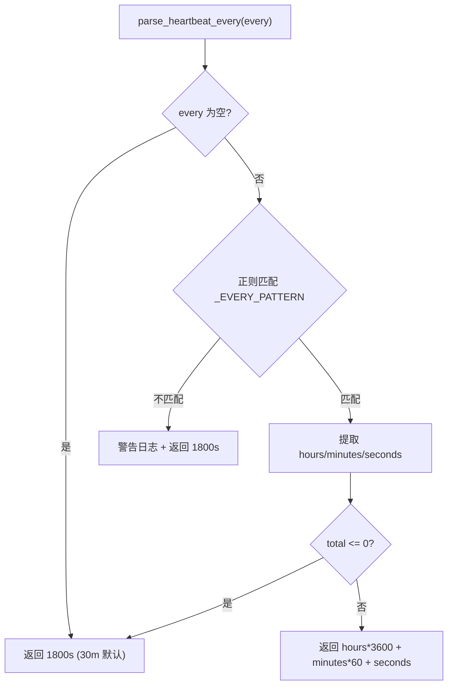
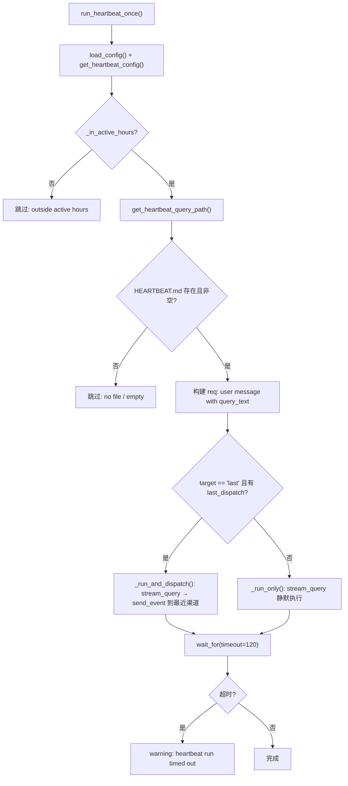

# PD-494.01 CoPaw — APScheduler 异步 Cron 调度与双轨心跳执行

> 文档编号：PD-494.01
> 来源：CoPaw `src/copaw/app/crons/`
> GitHub：https://github.com/agentscope-ai/CoPaw.git
> 问题域：PD-494 定时心跳任务 Scheduled Heartbeat
> 状态：可复用方案

---

## 第 1 章 问题与动机

### 1.1 核心问题

Agent 系统需要一种"自主唤醒"机制——在没有用户输入的情况下，Agent 能按预设间隔自动执行任务并将结果分发到正确的渠道。这涉及三个子问题：

1. **调度可靠性**：如何在异步 Python 应用中实现精确的定时触发，支持 cron 表达式和简单间隔两种模式？
2. **活跃时间窗口**：如何避免在用户不活跃时段（如凌晨）执行无意义的心跳，浪费 LLM 调用成本？
3. **结果分发路由**：心跳执行结果应该发送到哪里？如何自动追踪用户最近活跃的渠道？

CoPaw 的心跳系统不仅解决了定时调度问题，还实现了"文件驱动查询 + 活跃窗口过滤 + 最近渠道分发"的完整闭环。

### 1.2 CoPaw 的解法概述

1. **CronManager 统一调度器**：基于 APScheduler AsyncIOScheduler，管理所有 cron 任务和内置心跳任务，支持 CRUD + pause/resume（`src/copaw/app/crons/manager.py:32-53`）
2. **HEARTBEAT.md 文件驱动**：心跳查询内容从 `~/.copaw/HEARTBEAT.md` 文件读取，用户可自定义查询内容（`src/copaw/app/crons/heartbeat.py:91-96`）
3. **人性化间隔解析**：支持 `30m`、`1h`、`2h30m` 等自然语言间隔格式，正则解析为秒数（`src/copaw/app/crons/heartbeat.py:25-46`）
4. **活跃时间窗口**：通过 `active_hours` 配置（默认 08:00-22:00）控制心跳仅在用户活跃时段执行（`src/copaw/app/crons/heartbeat.py:49-73`）
5. **双轨执行路径**：心跳结果可分发到最近活跃渠道（target=last）或仅静默执行（target=main），通过 `last_dispatch` 配置自动追踪（`src/copaw/app/crons/heartbeat.py:113-142`）

### 1.3 设计思想

| 设计原则 | 具体实现 | 理由 | 替代方案 |
|----------|----------|------|----------|
| 文件驱动查询 | HEARTBEAT.md 作为查询内容源 | 用户可直接编辑 Markdown 文件自定义心跳行为，无需改代码 | 数据库存储查询模板 |
| 配置与调度分离 | HeartbeatConfig (Pydantic) + CronManager (APScheduler) | 配置变更不需要重启调度器，职责清晰 | 单体配置类 |
| 双轨分发 | target=last 追踪最近渠道 / target=main 静默执行 | 心跳结果自动送达用户最常用的渠道，无需手动指定 | 固定渠道配置 |
| 并发保护 | asyncio.Semaphore per-job + asyncio.Lock 全局 | 防止同一任务重叠执行，同时保护调度器状态一致性 | 无并发控制 |
| 超时兜底 | asyncio.wait_for(timeout=120) | 防止 LLM 调用挂起导致心跳任务永不结束 | 无超时保护 |

---

## 第 2 章 源码实现分析

### 2.1 架构概览

CoPaw 的定时心跳系统由 6 个核心模块组成，分为调度层、执行层、持久层三层架构：

```
┌─────────────────────────────────────────────────────────┐
│                    FastAPI Router (api.py)               │
│              GET/POST/PUT/DELETE /cron/jobs              │
└──────────────────────┬──────────────────────────────────┘
                       │ Depends(get_cron_manager)
┌──────────────────────▼──────────────────────────────────┐
│                  CronManager (manager.py)                │
│  ┌─────────────────┐  ┌──────────────────────────────┐  │
│  │ AsyncIOScheduler│  │ _heartbeat_callback()        │  │
│  │ (APScheduler)   │  │ → run_heartbeat_once()       │  │
│  │                 │  │                              │  │
│  │ IntervalTrigger │  │ _scheduled_callback(job_id)  │  │
│  │ CronTrigger     │  │ → _execute_once(job)         │  │
│  └─────────────────┘  └──────────────────────────────┘  │
│  ┌─────────────────┐  ┌──────────────────────────────┐  │
│  │ _states: Dict   │  │ _rt: Dict[str, _Runtime]     │  │
│  │ (job states)    │  │ (per-job Semaphore)          │  │
│  └─────────────────┘  └──────────────────────────────┘  │
└──────────┬──────────────────────┬───────────────────────┘
           │                      │
┌──────────▼──────────┐ ┌────────▼────────────────────────┐
│ heartbeat.py        │ │ CronExecutor (executor.py)      │
│ parse_heartbeat_    │ │ execute(job) → text / agent      │
│ _in_active_hours()  │ │ stream_query + send_event       │
│ run_heartbeat_once()│ │ wait_for(timeout)               │
└─────────────────────┘ └─────────────────────────────────┘
           │                      │
┌──────────▼──────────────────────▼───────────────────────┐
│              BaseJobRepository (repo/base.py)           │
│              JsonJobRepository (repo/json_repo.py)      │
│              jobs.json — atomic write via tmp+replace    │
└─────────────────────────────────────────────────────────┘
```

### 2.2 核心实现

#### 2.2.1 心跳间隔解析器



对应源码 `src/copaw/app/crons/heartbeat.py:25-46`：

```python
# Pattern for "30m", "1h", "2h30m", "90s"
_EVERY_PATTERN = re.compile(
    r"^(?:(?P<hours>\d+)h)?(?:(?P<minutes>\d+)m)?(?:(?P<seconds>\d+)s)?$",
    re.IGNORECASE,
)

def parse_heartbeat_every(every: str) -> int:
    """Parse interval string (e.g. '30m', '1h') to total seconds."""
    every = (every or "").strip()
    if not every:
        return 30 * 60  # default 30 min
    m = _EVERY_PATTERN.match(every)
    if not m:
        logger.warning("heartbeat every=%r invalid, using 30m", every)
        return 30 * 60
    hours = int(m.group("hours") or 0)
    minutes = int(m.group("minutes") or 0)
    seconds = int(m.group("seconds") or 0)
    total = hours * 3600 + minutes * 60 + seconds
    if total <= 0:
        return 30 * 60
    return total
```

#### 2.2.2 心跳执行主流程



对应源码 `src/copaw/app/crons/heartbeat.py:76-142`：

```python
async def run_heartbeat_once(
    *,
    runner: Any,
    channel_manager: Any,
) -> None:
    config = load_config()
    hb = get_heartbeat_config()
    if not _in_active_hours(hb.active_hours):
        logger.debug("heartbeat skipped: outside active hours")
        return

    path = get_heartbeat_query_path()
    if not path.is_file():
        logger.debug("heartbeat skipped: no file at %s", path)
        return

    query_text = path.read_text(encoding="utf-8").strip()
    if not query_text:
        logger.debug("heartbeat skipped: empty query file")
        return

    req: Dict[str, Any] = {
        "input": [{"role": "user", "content": [{"type": "text", "text": query_text}]}],
        "session_id": "main",
        "user_id": "main",
    }

    target = (hb.target or "").strip().lower()
    if target == HEARTBEAT_TARGET_LAST and config.last_dispatch:
        ld = config.last_dispatch
        if ld.channel and (ld.user_id or ld.session_id):
            async def _run_and_dispatch() -> None:
                async for event in runner.stream_query(req):
                    await channel_manager.send_event(
                        channel=ld.channel, user_id=ld.user_id,
                        session_id=ld.session_id, event=event, meta={},
                    )
            try:
                await asyncio.wait_for(_run_and_dispatch(), timeout=120)
            except asyncio.TimeoutError:
                logger.warning("heartbeat run timed out")
            return

    async def _run_only() -> None:
        async for _ in runner.stream_query(req):
            pass
    try:
        await asyncio.wait_for(_run_only(), timeout=120)
    except asyncio.TimeoutError:
        logger.warning("heartbeat run timed out")
```

### 2.3 实现细节

#### CronManager 启动与心跳注册

CronManager 在 `start()` 中完成两件事：加载持久化的 cron 任务 + 注册内置心跳任务（`src/copaw/app/crons/manager.py:55-75`）。心跳使用 `IntervalTrigger`，普通 cron 任务使用 `CronTrigger`，两种触发器共存于同一个 `AsyncIOScheduler` 实例。

#### Per-Job 并发信号量

每个 cron 任务有独立的 `asyncio.Semaphore(max_concurrency)`（`src/copaw/app/crons/manager.py:172-174`），默认 `max_concurrency=1`，确保同一任务不会重叠执行。这通过 `_Runtime` dataclass 管理（`src/copaw/app/crons/manager.py:28-29`）。

#### 活跃时间窗口跨午夜处理

`_in_active_hours()` 支持跨午夜时间窗口（如 22:00-06:00），通过 `start_t <= end_t` 判断是否跨午夜，跨午夜时使用 `now >= start_t or now <= end_t` 逻辑（`src/copaw/app/crons/heartbeat.py:71-73`）。

#### 错误推送到前端

任务失败时，`_task_done_cb` 将错误信息推送到 `console_push_store`，前端可通过轮询获取错误通知（`src/copaw/app/crons/manager.py:146-167`）。

#### 原子写入持久化

`JsonJobRepository` 使用 tmp 文件 + `replace()` 实现原子写入，避免写入中断导致 jobs.json 损坏（`src/copaw/app/crons/repo/json_repo.py:33-43`）。


---

## 第 3 章 迁移指南

### 3.1 迁移清单

**阶段 1：基础调度（1 个文件）**
- [ ] 安装 `apscheduler>=3.10`（AsyncIOScheduler 需要 3.x）
- [ ] 创建 `HeartbeatConfig` Pydantic 模型（every、target、active_hours）
- [ ] 实现 `parse_heartbeat_every()` 间隔解析器
- [ ] 创建 `HEARTBEAT.md` 查询文件

**阶段 2：调度管理器（2 个文件）**
- [ ] 实现 `CronManager`：AsyncIOScheduler + IntervalTrigger 注册心跳
- [ ] 实现 `CronExecutor`：text/agent 双模式执行
- [ ] 添加 per-job Semaphore 并发保护

**阶段 3：持久化与 API（2 个文件）**
- [ ] 实现 `BaseJobRepository` + `JsonJobRepository`（原子写入）
- [ ] 添加 FastAPI CRUD 路由（/cron/jobs）

**阶段 4：高级特性**
- [ ] 实现 `_in_active_hours()` 活跃窗口过滤（含跨午夜）
- [ ] 实现 `last_dispatch` 追踪与双轨分发
- [ ] 添加 `console_push_store` 错误推送

### 3.2 适配代码模板

以下是一个可直接运行的最小心跳调度器：

```python
"""Minimal heartbeat scheduler — 可直接复用的代码模板"""
import asyncio
import re
import logging
from datetime import datetime, time
from pathlib import Path
from typing import Any, Optional

from apscheduler.schedulers.asyncio import AsyncIOScheduler
from apscheduler.triggers.interval import IntervalTrigger
from pydantic import BaseModel, Field

logger = logging.getLogger(__name__)

# ---- 配置模型 ----

class ActiveHoursConfig(BaseModel):
    start: str = "08:00"
    end: str = "22:00"

class HeartbeatConfig(BaseModel):
    every: str = "30m"
    target: str = "main"  # "main" | "last"
    active_hours: Optional[ActiveHoursConfig] = None

# ---- 间隔解析 ----

_EVERY_RE = re.compile(
    r"^(?:(?P<hours>\d+)h)?(?:(?P<minutes>\d+)m)?(?:(?P<seconds>\d+)s)?$",
    re.IGNORECASE,
)

def parse_interval(every: str) -> int:
    """Parse '30m', '1h', '2h30m' → seconds. Default 1800."""
    m = _EVERY_RE.match((every or "").strip())
    if not m:
        return 1800
    total = int(m.group("hours") or 0) * 3600 \
          + int(m.group("minutes") or 0) * 60 \
          + int(m.group("seconds") or 0)
    return total if total > 0 else 1800

def in_active_hours(cfg: Optional[ActiveHoursConfig]) -> bool:
    """Check if current time is within active window."""
    if not cfg:
        return True
    try:
        sh, sm = map(int, cfg.start.split(":"))
        eh, em = map(int, cfg.end.split(":"))
    except (ValueError, AttributeError):
        return True
    start_t, end_t, now = time(sh, sm), time(eh, em), datetime.now().time()
    if start_t <= end_t:
        return start_t <= now <= end_t
    return now >= start_t or now <= end_t  # 跨午夜

# ---- 心跳调度器 ----

class HeartbeatScheduler:
    def __init__(
        self,
        config: HeartbeatConfig,
        query_path: Path,
        run_fn: Any,  # async callable: query_text → result
        timezone: str = "UTC",
    ):
        self._config = config
        self._query_path = query_path
        self._run_fn = run_fn
        self._scheduler = AsyncIOScheduler(timezone=timezone)

    async def start(self) -> None:
        interval = parse_interval(self._config.every)
        self._scheduler.add_job(
            self._tick,
            trigger=IntervalTrigger(seconds=interval),
            id="_heartbeat",
            replace_existing=True,
        )
        self._scheduler.start()

    async def stop(self) -> None:
        self._scheduler.shutdown(wait=False)

    async def _tick(self) -> None:
        if not in_active_hours(self._config.active_hours):
            return
        if not self._query_path.is_file():
            return
        query = self._query_path.read_text(encoding="utf-8").strip()
        if not query:
            return
        try:
            await asyncio.wait_for(self._run_fn(query), timeout=120)
        except asyncio.TimeoutError:
            logger.warning("heartbeat timed out")
        except Exception:
            logger.exception("heartbeat failed")
```

### 3.3 适用场景

| 场景 | 适用度 | 说明 |
|------|--------|------|
| Agent 定时自主查询 | ⭐⭐⭐ | 核心场景：Agent 按间隔读取 Markdown 文件执行查询 |
| 多渠道消息 Bot 心跳 | ⭐⭐⭐ | 支持 Discord/飞书/钉钉等多渠道分发 |
| 定时报告生成 | ⭐⭐ | 可用 cron 表达式配置每日/每周报告 |
| 高频监控（<1min） | ⭐ | APScheduler 适合分钟级，秒级建议用专用监控系统 |
| 分布式多实例调度 | ⭐ | 单机 JSON 持久化，多实例需换 Redis/DB 后端 |

---

## 第 4 章 测试用例

```python
"""Tests for CoPaw heartbeat scheduling system."""
import asyncio
import pytest
from datetime import time
from pathlib import Path
from unittest.mock import AsyncMock, patch, MagicMock

# ---- parse_heartbeat_every ----

class TestParseHeartbeatEvery:
    def test_30m(self):
        from copaw.app.crons.heartbeat import parse_heartbeat_every
        assert parse_heartbeat_every("30m") == 1800

    def test_1h(self):
        from copaw.app.crons.heartbeat import parse_heartbeat_every
        assert parse_heartbeat_every("1h") == 3600

    def test_2h30m(self):
        from copaw.app.crons.heartbeat import parse_heartbeat_every
        assert parse_heartbeat_every("2h30m") == 9000

    def test_90s(self):
        from copaw.app.crons.heartbeat import parse_heartbeat_every
        assert parse_heartbeat_every("90s") == 90

    def test_empty_returns_default(self):
        from copaw.app.crons.heartbeat import parse_heartbeat_every
        assert parse_heartbeat_every("") == 1800

    def test_invalid_returns_default(self):
        from copaw.app.crons.heartbeat import parse_heartbeat_every
        assert parse_heartbeat_every("abc") == 1800

    def test_zero_returns_default(self):
        from copaw.app.crons.heartbeat import parse_heartbeat_every
        assert parse_heartbeat_every("0m") == 1800

# ---- _in_active_hours ----

class TestInActiveHours:
    def test_no_config_returns_true(self):
        from copaw.app.crons.heartbeat import _in_active_hours
        assert _in_active_hours(None) is True

    @patch("copaw.app.crons.heartbeat.datetime")
    def test_within_window(self, mock_dt):
        from copaw.app.crons.heartbeat import _in_active_hours
        mock_dt.now.return_value.time.return_value = time(12, 0)
        cfg = MagicMock(start="08:00", end="22:00")
        assert _in_active_hours(cfg) is True

    @patch("copaw.app.crons.heartbeat.datetime")
    def test_outside_window(self, mock_dt):
        from copaw.app.crons.heartbeat import _in_active_hours
        mock_dt.now.return_value.time.return_value = time(3, 0)
        cfg = MagicMock(start="08:00", end="22:00")
        assert _in_active_hours(cfg) is False

    @patch("copaw.app.crons.heartbeat.datetime")
    def test_cross_midnight_inside(self, mock_dt):
        from copaw.app.crons.heartbeat import _in_active_hours
        mock_dt.now.return_value.time.return_value = time(23, 0)
        cfg = MagicMock(start="22:00", end="06:00")
        assert _in_active_hours(cfg) is True

# ---- run_heartbeat_once ----

class TestRunHeartbeatOnce:
    @pytest.mark.asyncio
    async def test_skips_outside_active_hours(self):
        from copaw.app.crons.heartbeat import run_heartbeat_once
        runner = AsyncMock()
        channel_manager = AsyncMock()
        with patch("copaw.app.crons.heartbeat._in_active_hours", return_value=False):
            with patch("copaw.app.crons.heartbeat.load_config"):
                with patch("copaw.app.crons.heartbeat.get_heartbeat_config"):
                    await run_heartbeat_once(
                        runner=runner, channel_manager=channel_manager,
                    )
        runner.stream_query.assert_not_called()

    @pytest.mark.asyncio
    async def test_skips_missing_file(self, tmp_path):
        from copaw.app.crons.heartbeat import run_heartbeat_once
        runner = AsyncMock()
        channel_manager = AsyncMock()
        with patch("copaw.app.crons.heartbeat._in_active_hours", return_value=True):
            with patch("copaw.app.crons.heartbeat.load_config"):
                with patch("copaw.app.crons.heartbeat.get_heartbeat_config"):
                    with patch(
                        "copaw.app.crons.heartbeat.get_heartbeat_query_path",
                        return_value=tmp_path / "nonexistent.md",
                    ):
                        await run_heartbeat_once(
                            runner=runner, channel_manager=channel_manager,
                        )
        runner.stream_query.assert_not_called()

# ---- CronJobSpec validation ----

class TestCronJobSpec:
    def test_cron_5_fields_valid(self):
        from copaw.app.crons.models import ScheduleSpec
        spec = ScheduleSpec(cron="*/5 * * * *")
        assert spec.cron == "*/5 * * * *"

    def test_cron_4_fields_normalized(self):
        from copaw.app.crons.models import ScheduleSpec
        spec = ScheduleSpec(cron="8 * * *")
        assert spec.cron == "0 8 * * *"

    def test_cron_6_fields_rejected(self):
        from copaw.app.crons.models import ScheduleSpec
        with pytest.raises(ValueError, match="5 fields"):
            ScheduleSpec(cron="0 */5 * * * *")
```


---

## 第 5 章 跨域关联

| 关联域 | 关系类型 | 说明 |
|--------|----------|------|
| PD-487 定时任务系统 | 协同 | PD-487 关注 APScheduler 异步 Cron 调度的通用架构，PD-494 聚焦心跳这一特殊定时任务的完整闭环（文件驱动 + 活跃窗口 + 渠道分发） |
| PD-485 多渠道消息 | 依赖 | 心跳结果分发依赖 ChannelManager 的 `send_event()` 接口，target=last 模式依赖 `last_dispatch` 渠道追踪 |
| PD-488 配置热重载 | 协同 | HeartbeatConfig 通过 `load_config()` 每次执行时重新读取，配合 ConfigWatcher 可实现间隔/窗口的热变更 |
| PD-03 容错与重试 | 协同 | 心跳使用 `asyncio.wait_for(timeout=120)` 超时保护 + broad-except 兜底，CronManager 的 `_task_done_cb` 将错误推送到前端 |
| PD-493 配置热重载 | 协同 | 心跳配置（every、active_hours、target）存储在 config.json 中，ConfigWatcher 变更时可动态生效 |

---

## 第 6 章 来源文件索引

| 文件 | 行范围 | 关键实现 |
|------|--------|----------|
| `src/copaw/app/crons/heartbeat.py` | L1-143 | 心跳核心：间隔解析、活跃窗口、双轨执行 |
| `src/copaw/app/crons/manager.py` | L1-274 | CronManager：APScheduler 调度 + 心跳注册 + 并发保护 |
| `src/copaw/app/crons/executor.py` | L1-76 | CronExecutor：text/agent 双模式执行 + 超时 |
| `src/copaw/app/crons/models.py` | L1-132 | Pydantic 模型：CronJobSpec、ScheduleSpec、JobRuntimeSpec |
| `src/copaw/app/crons/api.py` | L1-112 | FastAPI CRUD 路由：/cron/jobs |
| `src/copaw/app/crons/repo/base.py` | L1-54 | 抽象仓库：BaseJobRepository |
| `src/copaw/app/crons/repo/json_repo.py` | L1-44 | JSON 持久化：原子 tmp+replace 写入 |
| `src/copaw/config/config.py` | L79-97 | HeartbeatConfig + ActiveHoursConfig 定义 |
| `src/copaw/config/utils.py` | L17-58 | get_heartbeat_query_path + get_heartbeat_config |
| `src/copaw/constant.py` | L17-20 | HEARTBEAT_FILE / DEFAULT_EVERY / DEFAULT_TARGET 常量 |
| `src/copaw/app/console_push_store.py` | L1-75 | 内存消息队列：错误推送到前端 |

---

## 第 7 章 横向对比维度

```json comparison_data
{
  "project": "CoPaw",
  "dimensions": {
    "调度引擎": "APScheduler AsyncIOScheduler，IntervalTrigger + CronTrigger 双触发器共存",
    "间隔配置": "人性化字符串解析（30m/1h/2h30m），正则提取 h/m/s 三段",
    "活跃窗口": "ActiveHoursConfig 08:00-22:00 默认窗口，支持跨午夜判断",
    "查询驱动": "HEARTBEAT.md 文件驱动，用户直接编辑 Markdown 自定义查询内容",
    "结果分发": "双轨路径：target=last 追踪最近活跃渠道 / target=main 静默执行",
    "并发控制": "per-job asyncio.Semaphore(max_concurrency) + 全局 asyncio.Lock",
    "持久化": "JsonJobRepository 原子写入（tmp+replace），单机 JSON 文件",
    "超时保护": "asyncio.wait_for(timeout=120) 硬超时 + misfire_grace_seconds 容错"
  }
}
```

### 域元数据补充

```json domain_metadata
{
  "solution_summary": "CoPaw 用 APScheduler AsyncIOScheduler + HEARTBEAT.md 文件驱动实现双轨心跳：IntervalTrigger 定时触发 → 活跃窗口过滤 → Markdown 查询读取 → target=last 自动追踪最近渠道分发",
  "description": "定时心跳不仅是调度问题，更是查询内容管理与结果路由的闭环设计",
  "sub_problems": [
    "跨午夜活跃窗口的时间比较逻辑",
    "心跳与通用 cron 任务的触发器共存管理",
    "任务失败时的前端错误推送机制"
  ],
  "best_practices": [
    "per-job Semaphore 防止同一任务重叠执行",
    "asyncio.wait_for 硬超时兜底防止 LLM 调用挂起",
    "last_dispatch 自动追踪最近活跃渠道，无需手动配置分发目标"
  ]
}
```

