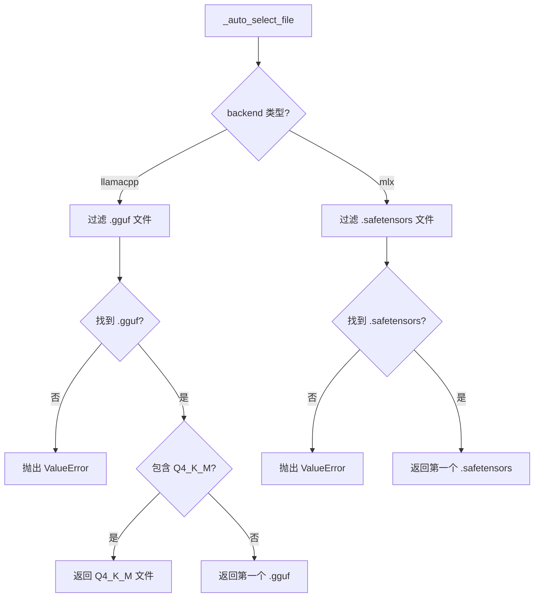
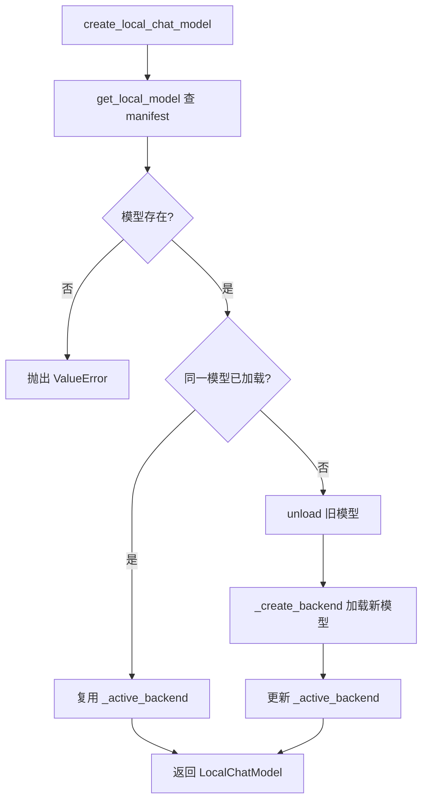

# PD-495.01 CoPaw — 单例工厂双后端本地模型全生命周期管理

> 文档编号：PD-495.01
> 来源：CoPaw `src/copaw/local_models/`
> GitHub：https://github.com/agentscope-ai/CoPaw.git
> 问题域：PD-495 本地模型管理 Local Model Management
> 状态：可复用方案

---

## 第 1 章 问题与动机

### 1.1 核心问题

Agent 系统依赖 LLM 推理能力，但云端 API 存在成本高、延迟不可控、隐私泄露等问题。本地模型推理是解决这些问题的关键路径，但引入了新的工程挑战：

1. **模型获取**：模型文件散布在 HuggingFace、ModelScope 等多个平台，格式各异（GGUF 单文件 vs safetensors 目录），用户需要手动选择合适的量化版本
2. **推理后端碎片化**：llama.cpp 适合通用 CPU/GPU 推理，MLX 专为 Apple Silicon 优化，两者 API 完全不同
3. **模型生命周期**：下载、注册、加载、卸载、删除的全流程管理，需要避免内存泄漏和重复加载
4. **与 Agent 框架集成**：本地模型需要伪装成与云端 API 相同的接口，让上层 Agent 无感切换

### 1.2 CoPaw 的解法概述

CoPaw 构建了一套完整的本地模型管理子系统（`src/copaw/local_models/`），核心设计：

1. **双源下载 + 智能文件选择**：支持 HuggingFace 和 ModelScope 两个源，自动从 repo 文件列表中选择 Q4_K_M 量化的 GGUF 文件（`manager.py:243-277`）
2. **manifest.json 注册表**：所有已下载模型通过 Pydantic 模型持久化到 JSON 清单，支持按后端过滤查询（`manager.py:30-49`）
3. **策略模式双后端**：`LocalBackend` 抽象基类定义统一接口，`LlamaCppBackend` 和 `MlxBackend` 各自实现，输出 OpenAI 兼容格式（`backends/base.py:12-63`）
4. **单例工厂 + 热切换**：全局只保持一个活跃后端实例，切换模型时自动卸载旧模型释放资源（`factory.py:17-19, 77-100`）
5. **tag_parser 兼容层**：解析本地模型输出中的 `<think>` 和 `<tool_call>` 标签，桥接到 agentscope 的 ThinkingBlock/ToolUseBlock（`tag_parser.py`）

### 1.3 设计思想

| 设计原则 | 具体实现 | 理由 | 替代方案 |
|----------|----------|------|----------|
| 策略模式 | `LocalBackend` ABC + 两个具体后端 | 新增后端只需实现 4 个方法，不改动上层代码 | if-else 分支（不可扩展） |
| 单例工厂 | `factory.py` 全局 `_active_backend` + threading.Lock | 本地模型占用大量 VRAM/RAM，同时只能加载一个 | 多实例池（内存不够） |
| 注册表模式 | `manifest.json` + Pydantic 校验 | 持久化模型元数据，重启后不丢失 | 扫描文件系统（慢且不可靠） |
| 延迟导入 | `from huggingface_hub import ...` 在方法内部 | 可选依赖不强制安装，通过 extras 按需引入 | 顶层导入（缺依赖直接崩溃） |
| OpenAI 兼容输出 | 后端返回 `{"choices": [...], "usage": {...}}` | 上层 Agent 无需区分本地/远程模型 | 自定义格式（需要适配层） |

---

## 第 2 章 源码实现分析

### 2.1 架构概览

CoPaw 的本地模型子系统由 6 个模块组成，形成清晰的分层架构：

```
┌─────────────────────────────────────────────────────────┐
│                   Agent Layer                            │
│  model_factory.py → create_model_and_formatter()        │
├─────────────────────────────────────────────────────────┤
│                  Adapter Layer                           │
│  chat_model.py → LocalChatModel(ChatModelBase)          │
│  tag_parser.py → <think>/<tool_call> 标签解析            │
├─────────────────────────────────────────────────────────┤
│                  Factory Layer                           │
│  factory.py → 单例工厂 + 热切换                          │
├─────────────────────────────────────────────────────────┤
│                  Backend Layer                           │
│  backends/base.py → LocalBackend ABC                    │
│  backends/llamacpp_backend.py → LlamaCppBackend         │
│  backends/mlx_backend.py → MlxBackend                   │
├─────────────────────────────────────────────────────────┤
│                  Management Layer                        │
│  manager.py → 下载 / 注册 / 删除                         │
│  schema.py → Pydantic 数据模型                           │
├─────────────────────────────────────────────────────────┤
│                  Storage Layer                           │
│  ~/.copaw/models/manifest.json                          │
│  ~/.copaw/models/<repo--name>/model.gguf                │
└─────────────────────────────────────────────────────────┘
```

### 2.2 核心实现

#### 2.2.1 智能文件自动选择



对应源码 `src/copaw/local_models/manager.py:242-277`：

```python
@staticmethod
def _auto_select_file(
    files: list[str],
    backend: BackendType,
) -> str:
    """Auto-select a model file from the repo file list."""
    if backend == BackendType.LLAMACPP:
        gguf_files = [f for f in files if f.endswith(".gguf")]
        if not gguf_files:
            raise ValueError(
                "No .gguf files found in this repository. "
                "This repo may not provide GGUF-format models. "
                "Please specify the filename explicitly or choose "
                "a GGUF-compatible repository.",
            )
        # Prefer Q4_K_M quantization as a sensible default
        return next(
            (f for f in gguf_files if "Q4_K_M" in f),
            gguf_files[0],
        )
    elif backend == BackendType.MLX:
        st_files = [f for f in files if f.endswith(".safetensors")]
        if not st_files:
            raise ValueError(
                "No .safetensors files found in this repository. "
                "This repo may not be an MLX-compatible model. ",
            )
        return st_files[0]
```

Q4_K_M 是 GGUF 量化中质量与体积的最佳平衡点，CoPaw 将其作为默认选择，用户无需了解量化细节。

#### 2.2.2 单例工厂与热切换



对应源码 `src/copaw/local_models/factory.py:42-107`：

```python
_lock = threading.Lock()
_active_backend: Optional[LocalBackend] = None
_active_model_id: Optional[str] = None

def create_local_chat_model(
    model_id: str,
    stream: bool = True,
    backend_kwargs: Optional[dict[str, Any]] = None,
    generate_kwargs: Optional[dict[str, Any]] = None,
) -> LocalChatModel:
    global _active_backend, _active_model_id
    info = get_local_model(model_id)
    if info is None:
        raise ValueError(f"Local model '{model_id}' not found.")

    with _lock:
        # Reuse if same model already loaded
        if (
            _active_model_id == model_id
            and _active_backend is not None
            and _active_backend.is_loaded
        ):
            return LocalChatModel(
                model_name=model_id, backend=_active_backend,
                stream=stream, generate_kwargs=generate_kwargs,
            )
        # Unload previous model
        if _active_backend is not None:
            _active_backend.unload()
        # Load new model
        backend = _create_backend(info, backend_kwargs or {})
        _active_backend = backend
        _active_model_id = model_id

    return LocalChatModel(
        model_name=model_id, backend=backend,
        stream=stream, generate_kwargs=generate_kwargs,
    )
```

关键设计：`threading.Lock` 保证并发安全，`_active_backend` 全局单例避免多模型同时占用内存。切换模型时先 `unload()` 释放资源再加载新模型。

### 2.3 实现细节

#### 后端抽象与 OpenAI 兼容输出

`LocalBackend` 抽象基类（`backends/base.py:12-63`）定义了 4 个核心方法：

- `__init__(model_path, **kwargs)` — 加载模型到内存
- `chat_completion(messages, tools, ...)` → `dict` — 非流式推理，返回 OpenAI 格式
- `chat_completion_stream(messages, tools, ...)` → `Iterator[dict]` — 流式推理
- `unload()` — 释放 VRAM/RAM
- `is_loaded` — 属性，检查模型是否就绪

MLX 后端（`backends/mlx_backend.py:52-230`）的特殊处理：
- MLX 模型是目录结构（safetensors + config.json），需要 `_resolve_model_dir()` 从文件路径推导目录
- 下载后通过 `_validate_mlx_directory()` 校验完整性（检查 config.json 和 .safetensors 文件存在）
- 采样参数需要转换：OpenAI 的 `temperature` 映射为 mlx-lm 的 `temp`

#### tag_parser 兼容层

本地模型（如 Qwen3-Instruct）在文本中嵌入 `<think>...</think>` 和 `<tool_call>...</tool_call>` 标签。`tag_parser.py` 通过正则提取这些标签，转换为 agentscope 的结构化 Block：

- `extract_thinking_from_text()` — 提取推理内容，支持流式场景下的未闭合标签检测（`has_open_tag`）
- `parse_tool_calls_from_text()` — 解析 JSON 格式的工具调用，生成 `ParsedToolCall` 对象

#### 异步桥接

`LocalChatModel`（`chat_model.py:39-361`）继承 agentscope 的 `ChatModelBase`，将同步后端包装为异步接口：
- 非流式：`loop.run_in_executor(None, lambda: backend.chat_completion(...))`
- 流式：后台线程驱动同步迭代器，通过 `asyncio.Queue` 桥接到 `async generator`

#### Provider 集成

`providers/registry.py:68-84` 将 llamacpp 和 mlx 注册为内置 Provider（`is_local=True`），`sync_local_models()` 从 manifest 同步模型列表到 Provider 的 models 字段，使本地模型出现在 `copaw models list` 和 `copaw models set-llm` 的选择列表中。

`agents/model_factory.py:206-214` 在检测到 `llm_cfg.is_local` 时，调用 `create_local_chat_model()` 而非创建远程 OpenAI 客户端，实现透明切换。

---

## 第 3 章 迁移指南

### 3.1 迁移清单

**阶段 1：数据模型与存储（1 个文件）**
- [ ] 定义 `BackendType` 枚举（支持的推理后端）
- [ ] 定义 `DownloadSource` 枚举（模型下载源）
- [ ] 定义 `LocalModelInfo` Pydantic 模型（模型元数据）
- [ ] 定义 `LocalModelsManifest` Pydantic 模型（清单容器）
- [ ] 实现 `_load_manifest()` / `_save_manifest()` JSON 持久化

**阶段 2：后端抽象（3 个文件）**
- [ ] 定义 `LocalBackend` ABC（chat_completion / chat_completion_stream / unload / is_loaded）
- [ ] 实现 `LlamaCppBackend`（llama-cpp-python 包装）
- [ ] 实现 `MlxBackend`（mlx-lm 包装，仅 Apple Silicon）
- [ ] 确保两个后端输出 OpenAI 兼容格式

**阶段 3：下载管理器（1 个文件）**
- [ ] 实现 `_auto_select_file()` 智能文件选择
- [ ] 实现 `_download_from_huggingface()` 和 `_download_from_modelscope()`
- [ ] 实现 `_register_model()` 注册到 manifest
- [ ] 实现 `delete_local_model()` 删除文件 + 清理空目录

**阶段 4：单例工厂（1 个文件）**
- [ ] 实现 `create_local_chat_model()` 带线程锁的单例工厂
- [ ] 实现 `unload_active_model()` 和 `get_active_local_model()`

**阶段 5：集成层（按需）**
- [ ] 适配到你的 Agent 框架的 ChatModel 接口
- [ ] 如果本地模型输出含特殊标签，实现 tag_parser

### 3.2 适配代码模板

以下是一个可直接运行的最小化本地模型管理器，提取了 CoPaw 的核心模式：

```python
"""Minimal local model manager — extracted from CoPaw pattern."""
from __future__ import annotations

import json
import threading
from abc import ABC, abstractmethod
from enum import Enum
from pathlib import Path
from typing import Any, Iterator, Optional

from pydantic import BaseModel, Field


# ── Schema ──────────────────────────────────────────────
class BackendType(str, Enum):
    LLAMACPP = "llamacpp"
    MLX = "mlx"

class LocalModelInfo(BaseModel):
    id: str
    repo_id: str
    filename: str
    backend: BackendType
    file_size: int = 0
    local_path: str = ""
    display_name: str = ""

class Manifest(BaseModel):
    models: dict[str, LocalModelInfo] = Field(default_factory=dict)


# ── Storage ─────────────────────────────────────────────
MODELS_DIR = Path("~/.myapp/models").expanduser()
MANIFEST_PATH = MODELS_DIR / "manifest.json"

def load_manifest() -> Manifest:
    if MANIFEST_PATH.is_file():
        try:
            return Manifest.model_validate(
                json.loads(MANIFEST_PATH.read_text("utf-8"))
            )
        except (json.JSONDecodeError, ValueError):
            pass
    return Manifest()

def save_manifest(m: Manifest) -> None:
    MODELS_DIR.mkdir(parents=True, exist_ok=True)
    MANIFEST_PATH.write_text(
        json.dumps(m.model_dump(mode="json"), indent=2, ensure_ascii=False),
        encoding="utf-8",
    )


# ── Backend ABC ─────────────────────────────────────────
class LocalBackend(ABC):
    @abstractmethod
    def chat_completion(self, messages: list[dict], **kw) -> dict: ...
    @abstractmethod
    def chat_completion_stream(self, messages: list[dict], **kw) -> Iterator[dict]: ...
    @abstractmethod
    def unload(self) -> None: ...
    @property
    @abstractmethod
    def is_loaded(self) -> bool: ...


# ── Singleton Factory ───────────────────────────────────
_lock = threading.Lock()
_active: Optional[tuple[str, LocalBackend]] = None

def get_or_load_backend(model_id: str) -> LocalBackend:
    global _active
    with _lock:
        if _active and _active[0] == model_id and _active[1].is_loaded:
            return _active[1]
        if _active:
            _active[1].unload()
        info = load_manifest().models.get(model_id)
        if not info:
            raise ValueError(f"Model '{model_id}' not in manifest")
        backend = _create_backend(info)
        _active = (model_id, backend)
        return backend

def _create_backend(info: LocalModelInfo) -> LocalBackend:
    if info.backend == BackendType.LLAMACPP:
        from llama_cpp import Llama
        # ... instantiate LlamaCppBackend
        raise NotImplementedError("Implement your LlamaCppBackend here")
    elif info.backend == BackendType.MLX:
        raise NotImplementedError("Implement your MlxBackend here")
    raise ValueError(f"Unknown backend: {info.backend}")


# ── Download + Register ─────────────────────────────────
def download_and_register(
    repo_id: str,
    backend: BackendType = BackendType.LLAMACPP,
) -> LocalModelInfo:
    from huggingface_hub import hf_hub_download, list_repo_files

    files = list(list_repo_files(repo_id))
    # Auto-select Q4_K_M GGUF
    gguf_files = [f for f in files if f.endswith(".gguf")]
    filename = next((f for f in gguf_files if "Q4_K_M" in f), gguf_files[0])

    local_dir = MODELS_DIR / repo_id.replace("/", "--")
    path = hf_hub_download(repo_id=repo_id, filename=filename, local_dir=str(local_dir))

    info = LocalModelInfo(
        id=f"{repo_id}/{filename}",
        repo_id=repo_id,
        filename=filename,
        backend=backend,
        file_size=Path(path).stat().st_size,
        local_path=str(Path(path).resolve()),
        display_name=f"{repo_id.split('/')[-1]} ({filename})",
    )
    manifest = load_manifest()
    manifest.models[info.id] = info
    save_manifest(manifest)
    return info
```

### 3.3 适用场景

| 场景 | 适用度 | 说明 |
|------|--------|------|
| 桌面 Agent 应用（隐私优先） | ⭐⭐⭐ | 完全离线推理，数据不出本机 |
| Apple Silicon 开发机 | ⭐⭐⭐ | MLX 后端充分利用统一内存架构 |
| 边缘设备 / IoT Agent | ⭐⭐ | 需要裁剪依赖，但核心模式可复用 |
| 高并发服务端 | ⭐ | 单例模式限制并发，需改为模型池 |
| 多模态模型管理 | ⭐⭐ | 架构可扩展，但当前只支持文本模型 |

---

## 第 4 章 测试用例

```python
"""Tests for local model management — based on CoPaw's real interfaces."""
import json
import threading
from pathlib import Path
from unittest.mock import MagicMock, patch

import pytest

from local_model_manager import (
    BackendType,
    LocalModelInfo,
    Manifest,
    load_manifest,
    save_manifest,
    get_or_load_backend,
    download_and_register,
)


class TestManifestPersistence:
    """Test manifest.json load/save cycle."""

    def test_save_and_load_roundtrip(self, tmp_path, monkeypatch):
        monkeypatch.setattr("local_model_manager.MODELS_DIR", tmp_path)
        monkeypatch.setattr(
            "local_model_manager.MANIFEST_PATH", tmp_path / "manifest.json"
        )
        info = LocalModelInfo(
            id="org/model/file.gguf",
            repo_id="org/model",
            filename="file.gguf",
            backend=BackendType.LLAMACPP,
            file_size=4_000_000_000,
            local_path="/tmp/models/file.gguf",
        )
        m = Manifest(models={info.id: info})
        save_manifest(m)
        loaded = load_manifest()
        assert loaded.models[info.id].file_size == 4_000_000_000
        assert loaded.models[info.id].backend == BackendType.LLAMACPP

    def test_corrupted_manifest_returns_empty(self, tmp_path, monkeypatch):
        monkeypatch.setattr("local_model_manager.MODELS_DIR", tmp_path)
        manifest_path = tmp_path / "manifest.json"
        monkeypatch.setattr("local_model_manager.MANIFEST_PATH", manifest_path)
        manifest_path.write_text("{invalid json", encoding="utf-8")
        loaded = load_manifest()
        assert loaded.models == {}


class TestAutoSelectFile:
    """Test GGUF Q4_K_M preference logic."""

    def test_prefers_q4_k_m(self):
        from local_model_manager import BackendType
        # Simulate CoPaw's _auto_select_file logic
        files = [
            "model-Q2_K.gguf",
            "model-Q4_K_M.gguf",
            "model-Q8_0.gguf",
        ]
        gguf_files = [f for f in files if f.endswith(".gguf")]
        selected = next((f for f in gguf_files if "Q4_K_M" in f), gguf_files[0])
        assert selected == "model-Q4_K_M.gguf"

    def test_fallback_to_first_gguf(self):
        files = ["model-Q2_K.gguf", "model-Q8_0.gguf"]
        gguf_files = [f for f in files if f.endswith(".gguf")]
        selected = next((f for f in gguf_files if "Q4_K_M" in f), gguf_files[0])
        assert selected == "model-Q2_K.gguf"

    def test_no_gguf_raises(self):
        files = ["README.md", "config.json"]
        gguf_files = [f for f in files if f.endswith(".gguf")]
        assert len(gguf_files) == 0  # Would raise ValueError in CoPaw


class TestSingletonFactory:
    """Test singleton pattern and hot-swap behavior."""

    def test_reuse_same_model(self, tmp_path, monkeypatch):
        """Same model_id should return same backend instance."""
        mock_backend = MagicMock()
        mock_backend.is_loaded = True

        monkeypatch.setattr("local_model_manager._active", ("model-a", mock_backend))
        monkeypatch.setattr("local_model_manager._lock", threading.Lock())

        result = get_or_load_backend("model-a")
        assert result is mock_backend
        mock_backend.unload.assert_not_called()

    def test_swap_unloads_previous(self, tmp_path, monkeypatch):
        """Switching model should unload the previous one."""
        old_backend = MagicMock()
        old_backend.is_loaded = True

        info = LocalModelInfo(
            id="new-model", repo_id="org/new", filename="new.gguf",
            backend=BackendType.LLAMACPP, local_path="/tmp/new.gguf",
        )
        manifest = Manifest(models={info.id: info})

        monkeypatch.setattr("local_model_manager._active", ("old-model", old_backend))
        monkeypatch.setattr("local_model_manager._lock", threading.Lock())
        monkeypatch.setattr("local_model_manager.load_manifest", lambda: manifest)
        monkeypatch.setattr(
            "local_model_manager._create_backend",
            lambda info: MagicMock(is_loaded=True),
        )

        get_or_load_backend("new-model")
        old_backend.unload.assert_called_once()


class TestMLXValidation:
    """Test MLX directory validation logic from CoPaw."""

    def test_valid_mlx_directory(self, tmp_path):
        (tmp_path / "config.json").write_text("{}")
        (tmp_path / "model.safetensors").write_bytes(b"\x00" * 100)
        # Should not raise
        required = ["config.json"]
        missing = [f for f in required if not (tmp_path / f).is_file()]
        assert missing == []
        st_files = list(tmp_path.glob("*.safetensors"))
        assert len(st_files) == 1

    def test_missing_config_json(self, tmp_path):
        (tmp_path / "model.safetensors").write_bytes(b"\x00" * 100)
        required = ["config.json"]
        missing = [f for f in required if not (tmp_path / f).is_file()]
        assert "config.json" in missing
```

---

## 第 5 章 跨域关联

| 关联域 | 关系类型 | 说明 |
|--------|----------|------|
| PD-04 工具系统 | 协同 | 本地模型需要支持 tool_calls，tag_parser 将文本中的 `<tool_call>` 标签转换为结构化工具调用，与工具系统对接 |
| PD-489 本地模型推理 | 依赖 | PD-495 管理模型的下载和注册，PD-489 的推理后端（llama.cpp/MLX）是 PD-495 的下游消费者 |
| PD-12 推理增强 | 协同 | tag_parser 提取 `<think>` 标签实现 Chain-of-Thought 推理，本地模型的推理增强依赖正确的标签解析 |
| PD-06 记忆持久化 | 类比 | manifest.json 的持久化模式（Pydantic → JSON → 文件）与记忆系统的持久化方案高度相似 |
| PD-03 容错与重试 | 协同 | MLX 目录校验（`_validate_mlx_directory`）是下载容错的一部分，检测不完整下载并提示重试 |
| PD-10 中间件管道 | 协同 | `LocalChatModel` 通过 `_normalize_messages()` 预处理消息格式，类似中间件管道的消息转换层 |

---

## 第 6 章 来源文件索引

| 文件 | 行范围 | 关键实现 |
|------|--------|----------|
| `src/copaw/local_models/schema.py` | L1-59 | BackendType/DownloadSource 枚举、LocalModelInfo/DownloadProgress/LocalModelsManifest 数据模型 |
| `src/copaw/local_models/manager.py` | L1-351 | LocalModelManager 下载管理器、manifest 持久化、_auto_select_file 智能选择 |
| `src/copaw/local_models/factory.py` | L1-125 | 单例工厂 create_local_chat_model、线程锁热切换、_create_backend 后端分发 |
| `src/copaw/local_models/backends/base.py` | L1-63 | LocalBackend 抽象基类（4 个抽象方法 + 1 个属性） |
| `src/copaw/local_models/backends/llamacpp_backend.py` | L1-140 | LlamaCppBackend 实现、_normalize_messages 消息预处理、structured output 支持 |
| `src/copaw/local_models/backends/mlx_backend.py` | L1-231 | MlxBackend 实现、_resolve_model_dir 路径推导、采样参数映射、stream_generate 包装 |
| `src/copaw/local_models/chat_model.py` | L1-362 | LocalChatModel(ChatModelBase) 适配器、异步桥接、tag_parser 集成 |
| `src/copaw/local_models/tag_parser.py` | L1-230 | `<think>`/`<tool_call>` 标签正则解析、流式未闭合标签检测 |
| `src/copaw/local_models/__init__.py` | L1-35 | 公共 API 导出 |
| `src/copaw/constant.py` | L47 | MODELS_DIR 定义（`~/.copaw/models`） |
| `src/copaw/providers/registry.py` | L68-84, L218-238 | PROVIDER_LLAMACPP/MLX 定义、sync_local_models() 同步 |
| `src/copaw/agents/model_factory.py` | L160-214 | create_model_and_formatter() 本地/远程模型透明切换 |
| `src/copaw/cli/providers_cmd.py` | L515-665 | CLI 命令：download / local / remove-local |
| `src/copaw/app/routers/local_models.py` | L1-284 | FastAPI 路由：异步下载任务、取消、状态查询 |

---

## 第 7 章 横向对比维度

```json comparison_data
{
  "project": "CoPaw",
  "dimensions": {
    "下载源": "HuggingFace + ModelScope 双源，延迟导入按需安装",
    "量化选择": "自动优先 Q4_K_M，fallback 到第一个 GGUF 文件",
    "后端架构": "LocalBackend ABC 策略模式，llamacpp + MLX 双后端",
    "模型注册": "manifest.json + Pydantic 校验，支持按后端过滤",
    "资源管理": "threading.Lock 单例工厂，切换时自动 unload 释放 VRAM",
    "框架集成": "ChatModelBase 适配器 + tag_parser 标签解析桥接 agentscope",
    "API 暴露": "CLI(Click) + FastAPI 异步下载任务 + 取消支持"
  }
}
```

### 域元数据补充

```json domain_metadata
{
  "solution_summary": "CoPaw 用 LocalBackend ABC 策略模式 + threading.Lock 单例工厂实现 llamacpp/MLX 双后端本地模型管理，manifest.json 注册表持久化，tag_parser 桥接 agentscope 框架",
  "description": "本地模型从下载到推理的全生命周期管理，含后端抽象、单例加载和框架适配",
  "sub_problems": [
    "同步后端到异步框架的桥接（线程池 + asyncio.Queue）",
    "本地模型输出标签解析（<think>/<tool_call>）",
    "MLX 目录结构完整性校验",
    "Provider 系统与本地模型清单的双向同步"
  ],
  "best_practices": [
    "单例工厂 + threading.Lock 保证同时只加载一个模型避免 OOM",
    "延迟导入可选依赖（huggingface_hub/modelscope/llama_cpp/mlx_lm）通过 pip extras 按需安装",
    "后端输出统一为 OpenAI 兼容格式实现上层无感切换"
  ]
}
```
