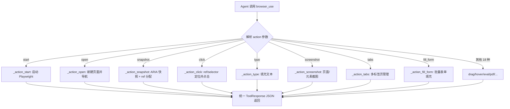
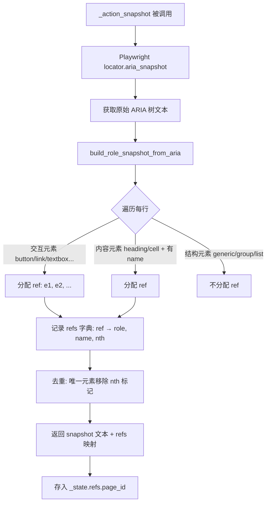
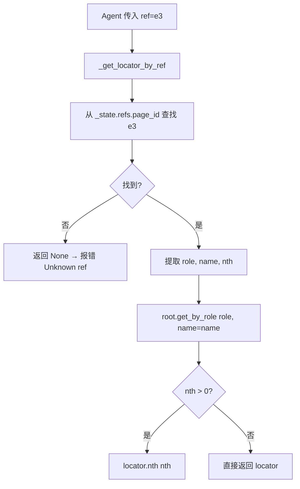

# PD-496.01 CoPaw — Playwright 单工具多动作浏览器自动化与 ARIA ref 定位

> 文档编号：PD-496.01
> 来源：CoPaw `src/copaw/agents/tools/browser_control.py`
> GitHub：https://github.com/agentscope-ai/CoPaw.git
> 问题域：PD-496 浏览器自动化 Browser Automation
> 状态：可复用方案

---

## 第 1 章 问题与动机

### 1.1 核心问题

Agent 需要与 Web 页面交互——打开 URL、点击按钮、填写表单、截图、提取页面结构——但浏览器操作种类繁多（导航、点击、输入、截图、拖拽、文件上传、对话框处理等），如果为每种操作注册一个独立工具，会导致：

1. **工具爆炸**：LLM 的工具列表膨胀到 30+ 条，增加 token 消耗和选择困难
2. **状态割裂**：多个工具之间需要共享浏览器实例、页面引用、元素定位信息，跨工具状态同步复杂
3. **元素定位脆弱**：CSS 选择器在页面结构变化后容易失效，Agent 需要一种更稳定的定位方式

CoPaw 的解法是：**一个 `browser_use` 工具 + `action` 参数统一 26 种浏览器操作**，配合 **ARIA snapshot ref 定位系统**实现稳定的元素寻址。

### 1.2 CoPaw 的解法概述

1. **单一入口函数** `browser_use(action, ...)`：26 种 action（start/stop/open/click/type/snapshot/screenshot/drag/hover/fill_form/tabs 等）通过一个函数分发，LLM 只需记住一个工具名（`browser_control.py:80-122`）
2. **进程全局状态字典** `_state`：维护 playwright 实例、browser context、多页面映射、每页面的 ref 表、console 日志、网络请求等，所有 action 共享同一状态（`browser_control.py:28-42`）
3. **ARIA snapshot ref 定位**：通过 Playwright 的 `aria_snapshot()` 获取页面无障碍树，解析后为每个可交互元素分配 `e1, e2, ...` 编号，Agent 用 `ref="e3"` 定位元素，比 CSS 选择器更稳定（`browser_snapshot.py:185-248`）
4. **多标签页管理**：`page_id` 参数 + 单调递增计数器，支持同时操作多个页面，关闭后 ID 不复用（`browser_control.py:475-479`）
5. **headless/headed 模式热切换**：`action=start` 时传 `headed=True` 可启动可见浏览器窗口，已有 headless 实例会自动关闭重启（`browser_control.py:522-593`）

### 1.3 设计思想

| 设计原则 | 具体实现 | 理由 | 替代方案 |
|----------|----------|------|----------|
| 单工具统一入口 | `browser_use(action=...)` 分发 26 种操作 | 减少 LLM 工具列表膨胀，降低选择复杂度 | 每种操作一个工具函数（工具爆炸） |
| 进程全局单例状态 | `_state` 字典持有 playwright/browser/context/pages | 所有 action 共享浏览器实例，无需跨工具传递句柄 | 每次调用创建新浏览器（资源浪费） |
| ARIA 语义定位 | `build_role_snapshot_from_aria()` 解析无障碍树，分配 ref 编号 | 比 CSS 选择器更稳定，不依赖 DOM 结构 | XPath / CSS 选择器（脆弱） |
| 单调递增 page_id | `page_counter` 只增不减，关闭页面后 ID 不复用 | 避免 Agent 引用已关闭页面的 ID 导致混淆 | 复用 ID（可能引用到错误页面） |
| 事件监听自动挂载 | `_attach_page_listeners` 自动注册 console/request/dialog/filechooser | Agent 无需手动设置监听，随时可查询日志和处理弹窗 | 按需注册（容易遗漏） |

---

## 第 2 章 源码实现分析

### 2.1 架构概览

CoPaw 的浏览器自动化由三个文件组成，形成清晰的分层：

```
┌─────────────────────────────────────────────────────────┐
│                    CoPawAgent                           │
│  react_agent.py:146  toolkit.register(browser_use)      │
└──────────────────────┬──────────────────────────────────┘
                       │ 调用
┌──────────────────────▼──────────────────────────────────┐
│              browser_control.py                          │
│  browser_use(action, ...) → 26 种 _action_xxx 函数      │
│  _state: 进程全局浏览器状态字典                           │
│  _get_locator_by_ref(): ref → Playwright locator        │
└──────────────────────┬──────────────────────────────────┘
                       │ 依赖
┌──────────────────────▼──────────────────────────────────┐
│              browser_snapshot.py                          │
│  build_role_snapshot_from_aria(): ARIA 树 → ref 映射表   │
│  INTERACTIVE_ROLES / CONTENT_ROLES / STRUCTURAL_ROLES   │
└─────────────────────────────────────────────────────────┘

┌─────────────────────────────────────────────────────────┐
│              desktop_screenshot.py                        │
│  desktop_screenshot(): 全屏/窗口截图（mss / screencapture）│
│  独立于浏览器，用于桌面级截图                              │
└─────────────────────────────────────────────────────────┘
```

### 2.2 核心实现

#### 2.2.1 单工具 Action 分发器



对应源码 `browser_control.py:80-393`：

```python
async def browser_use(
    action: str,
    url: str = "",
    page_id: str = "default",
    selector: str = "",
    text: str = "",
    ref: str = "",
    headed: bool = False,
    # ... 30+ 参数，每种 action 使用其中一部分
) -> ToolResponse:
    action = (action or "").strip().lower()
    if not action:
        return _tool_response(json.dumps({"ok": False, "error": "action required"}))

    # page_id 默认解析：优先使用 current_page_id
    page_id = (page_id or "default").strip() or "default"
    current = _state.get("current_page_id")
    pages = _state.get("pages") or {}
    if page_id == "default" and current and current in pages:
        page_id = current

    try:
        if action == "start":
            return await _action_start(headed=headed)
        if action == "open":
            return await _action_open(url, page_id)
        if action == "snapshot":
            return await _action_snapshot(page_id, snapshot_filename, frame_selector)
        if action == "click":
            return await _action_click(page_id, selector, ref, element, wait,
                                       double_click, button, modifiers_json, frame_selector)
        # ... 22 more action branches
        return _tool_response(json.dumps({"ok": False, "error": f"Unknown action: {action}"}))
    except Exception as e:
        return _tool_response(json.dumps({"ok": False, "error": str(e)}))
```

#### 2.2.2 ARIA Snapshot Ref 定位系统



对应源码 `browser_snapshot.py:185-248`：

```python
def build_role_snapshot_from_aria(
    aria_snapshot: str,
    *,
    interactive: bool = False,
    compact: bool = False,
    max_depth: int | None = None,
) -> tuple[str, dict[str, dict]]:
    """Build snapshot + refs from Playwright locator.aria_snapshot() output."""
    options = {"interactive": interactive, "compact": compact, "maxDepth": max_depth}
    lines = aria_snapshot.split("\n")
    refs: dict[str, dict] = {}
    tracker = _create_tracker()
    counter = [0]

    def next_ref() -> str:
        counter[0] += 1
        return f"e{counter[0]}"

    # 交互模式：只保留可交互元素（button, link, textbox 等）
    if options.get("interactive"):
        result_lines = []
        for line in lines:
            # ... 解析 role, name, 分配 ref
            role = role_raw.lower()
            if role not in INTERACTIVE_ROLES:
                continue
            ref = next_ref()
            refs[ref] = {"role": role, "name": name, "nth": nth}
            enhanced = f"- {role_raw} \"{name}\" [ref={ref}]"
            result_lines.append(enhanced)
        _remove_nth_from_non_duplicates(refs, tracker)
        return "\n".join(result_lines), refs

    # 完整模式：保留所有元素，为交互+内容元素分配 ref
    result_lines = []
    for line in lines:
        processed = _process_line(line, refs, options, tracker, next_ref)
        if processed is not None:
            result_lines.append(processed)
    _remove_nth_from_non_duplicates(refs, tracker)
    tree = "\n".join(result_lines)
    snapshot = _compact_tree(tree) if options.get("compact") else tree
    return snapshot, refs
```

#### 2.2.3 Ref 到 Locator 的解析



对应源码 `browser_control.py:413-431`：

```python
def _get_locator_by_ref(page, page_id: str, ref: str, frame_selector: str = ""):
    """Resolve snapshot ref to locator; frame_selector for iframe."""
    refs = _get_refs(page_id)
    info = refs.get(ref)
    if not info:
        return None
    role = info.get("role", "generic")
    name = info.get("name")
    nth = info.get("nth", 0)
    root = _get_root(page, page_id, frame_selector)
    locator = root.get_by_role(role, name=name or None)
    if nth is not None and nth > 0:
        locator = locator.nth(nth)
    return locator
```

### 2.3 实现细节

#### 进程全局状态字典

`_state` 是模块级字典，维护整个浏览器生命周期的所有状态（`browser_control.py:28-42`）：

```python
_state: dict[str, Any] = {
    "playwright": None,        # Playwright 实例
    "browser": None,           # Browser 实例
    "context": None,           # BrowserContext（共享 cookies/storage）
    "pages": {},               # page_id → Page 对象
    "refs": {},                # page_id → {ref → {role, name, nth}}
    "refs_frame": {},          # page_id → 最近 snapshot 的 frame_selector
    "console_logs": {},        # page_id → [{level, text}]
    "network_requests": {},    # page_id → [{url, method, status}]
    "pending_dialogs": {},     # page_id → [Dialog]
    "pending_file_choosers": {},  # page_id → [FileChooser]
    "headless": True,          # 当前模式
    "current_page_id": None,   # 当前活跃页面
    "page_counter": 0,         # 单调递增页面计数器
}
```

#### 事件自动监听

每个新页面创建时，`_attach_page_listeners`（`browser_control.py:434-472`）自动挂载四类事件监听器：

- **console**：捕获所有 console.log/warn/error，存入 `console_logs[page_id]`
- **request/response**：记录网络请求 URL、方法、状态码，存入 `network_requests[page_id]`
- **dialog**：捕获 alert/confirm/prompt 弹窗，存入 `pending_dialogs[page_id]`
- **filechooser**：捕获文件选择器，存入 `pending_file_choosers[page_id]`

#### 多标签页自动注册

`_attach_context_listeners`（`browser_control.py:482-501`）监听 BrowserContext 的 `page` 事件，当页面通过 `target=_blank` 或 `window.open()` 打开新标签时，自动分配 page_id 并注册监听器。

#### fill_form 批量表单填充

`_action_fill_form`（`browser_control.py:1438-1499`）接受 JSON 数组格式的字段列表，根据字段类型（textbox/checkbox/radio/combobox/slider）自动选择不同的 Playwright 操作：

- textbox → `locator.fill(value)`
- checkbox → `locator.set_checked(bool)`
- radio → `locator.set_checked(True)`
- combobox → `locator.select_option(label=value)`
- slider → `locator.fill(str(value))`

#### 桌面截图独立工具

`desktop_screenshot`（`desktop_screenshot.py:101-143`）是独立于浏览器的全屏截图工具，支持：
- 跨平台：Windows/Linux/macOS 统一使用 `mss` 库
- macOS 窗口截图：`capture_window=True` 时调用系统 `screencapture -w`
- 自动路径生成：未指定路径时生成 `/tmp/desktop_screenshot_{timestamp}.png`

---

## 第 3 章 迁移指南

### 3.1 迁移清单

**阶段 1：核心框架（必须）**

- [ ] 安装 Playwright：`pip install playwright && python -m playwright install`
- [ ] 创建 `browser_state.py`：定义进程全局 `_state` 字典
- [ ] 创建 `browser_snapshot.py`：移植 ARIA snapshot 解析和 ref 分配逻辑
- [ ] 创建 `browser_tool.py`：实现 `browser_use(action, ...)` 入口函数
- [ ] 实现基础 action：start, stop, open, snapshot, click, type, screenshot

**阶段 2：高级功能（按需）**

- [ ] 多标签页管理：tabs action（list/new/close/select）
- [ ] 表单批量填充：fill_form action + 字段类型分发
- [ ] 拖拽操作：drag action（start_ref/end_ref）
- [ ] 对话框处理：handle_dialog action + pending_dialogs 队列
- [ ] 文件上传：file_upload action + pending_file_choosers 队列
- [ ] JS 执行：eval/evaluate/run_code action
- [ ] 网络请求监控：network_requests action
- [ ] PDF 导出：pdf action

**阶段 3：集成（按需）**

- [ ] 注册到你的 Agent 工具系统（如 LangChain Tool、AgentScope Toolkit 等）
- [ ] 添加桌面截图工具（独立于浏览器）
- [ ] 添加 headed 模式切换的 Skill 文档

### 3.2 适配代码模板

以下是一个可直接运行的最小化实现，包含核心的单工具分发 + ARIA ref 定位：

```python
"""Minimal browser automation tool with action-based API and ARIA ref targeting."""

import asyncio
import json
import re
from typing import Any

# --- ARIA Snapshot Ref System ---

INTERACTIVE_ROLES = frozenset({
    "button", "link", "textbox", "checkbox", "radio",
    "combobox", "listbox", "menuitem", "option",
    "searchbox", "slider", "switch", "tab",
})

def build_refs_from_aria(aria_text: str) -> tuple[str, dict[str, dict]]:
    """Parse Playwright aria_snapshot output, assign ref IDs to interactive elements."""
    refs: dict[str, dict] = {}
    counter = [0]
    result_lines = []

    for line in aria_text.split("\n"):
        m = re.match(r'^(\s*-\s*)(\w+)(?:\s+"([^"]*)")?(.*)$', line)
        if not m:
            result_lines.append(line)
            continue
        prefix, role_raw, name, suffix = m.groups()
        role = role_raw.lower()
        if role not in INTERACTIVE_ROLES:
            result_lines.append(line)
            continue
        counter[0] += 1
        ref = f"e{counter[0]}"
        refs[ref] = {"role": role, "name": name}
        enhanced = f"{prefix}{role_raw}"
        if name:
            enhanced += f' "{name}"'
        enhanced += f" [ref={ref}]"
        result_lines.append(enhanced)

    return "\n".join(result_lines), refs

# --- Browser State (process-global singleton) ---

_state: dict[str, Any] = {
    "playwright": None, "browser": None, "context": None,
    "pages": {}, "refs": {}, "current_page_id": None,
    "headless": True, "page_counter": 0,
}

# --- Core Actions ---

async def _ensure_browser():
    if _state["browser"] is not None:
        return True
    from playwright.async_api import async_playwright
    pw = await async_playwright().start()
    browser = await pw.chromium.launch(headless=_state["headless"])
    context = await browser.new_context()
    _state.update(playwright=pw, browser=browser, context=context)
    return True

async def browser_use(action: str, **kwargs) -> dict:
    """Single-entry browser tool with action-based dispatch."""
    action = (action or "").strip().lower()

    if action == "start":
        _state["headless"] = not kwargs.get("headed", False)
        await _ensure_browser()
        return {"ok": True, "message": "Browser started"}

    if action == "stop":
        if _state["browser"]:
            await _state["browser"].close()
            await _state["playwright"].stop()
            _state.update(playwright=None, browser=None, context=None)
            _state["pages"].clear()
            _state["refs"].clear()
        return {"ok": True, "message": "Browser stopped"}

    if action == "open":
        await _ensure_browser()
        page = await _state["context"].new_page()
        _state["page_counter"] += 1
        pid = f"page_{_state['page_counter']}"
        await page.goto(kwargs["url"])
        _state["pages"][pid] = page
        _state["current_page_id"] = pid
        return {"ok": True, "page_id": pid}

    if action == "snapshot":
        pid = kwargs.get("page_id") or _state["current_page_id"]
        page = _state["pages"][pid]
        raw = await page.locator(":root").aria_snapshot()
        snapshot, refs = build_refs_from_aria(str(raw))
        _state["refs"][pid] = refs
        return {"ok": True, "snapshot": snapshot, "refs": list(refs.keys())}

    if action == "click":
        pid = kwargs.get("page_id") or _state["current_page_id"]
        page = _state["pages"][pid]
        ref = kwargs.get("ref", "")
        if ref:
            info = _state["refs"][pid][ref]
            locator = page.get_by_role(info["role"], name=info.get("name"))
            await locator.click()
        else:
            await page.locator(kwargs["selector"]).first.click()
        return {"ok": True, "message": f"Clicked {ref or kwargs.get('selector')}"}

    if action == "type":
        pid = kwargs.get("page_id") or _state["current_page_id"]
        page = _state["pages"][pid]
        ref = kwargs.get("ref", "")
        if ref:
            info = _state["refs"][pid][ref]
            locator = page.get_by_role(info["role"], name=info.get("name"))
            await locator.fill(kwargs.get("text", ""))
        else:
            await page.locator(kwargs["selector"]).first.fill(kwargs.get("text", ""))
        return {"ok": True}

    return {"ok": False, "error": f"Unknown action: {action}"}
```

### 3.3 适用场景

| 场景 | 适用度 | 说明 |
|------|--------|------|
| Agent 自主网页浏览与信息提取 | ⭐⭐⭐ | 核心场景：open → snapshot → 提取内容 |
| Agent 自动填写表单/提交数据 | ⭐⭐⭐ | fill_form + ref 定位，批量填充 |
| 网页 E2E 测试自动化 | ⭐⭐ | 可用但缺少断言框架，需自行扩展 |
| 需要人工介入的登录/验证码 | ⭐⭐⭐ | headed 模式让用户看到浏览器，手动完成验证 |
| 多页面并行爬取 | ⭐⭐ | 支持多标签页但共享单一 browser context |
| 桌面应用自动化 | ⭐ | desktop_screenshot 仅截图，无桌面元素操作能力 |

---

## 第 4 章 测试用例

```python
"""Tests for CoPaw browser automation — ARIA ref system and action dispatch."""

import pytest
from copaw.agents.tools.browser_snapshot import (
    build_role_snapshot_from_aria,
    INTERACTIVE_ROLES,
    CONTENT_ROLES,
    STRUCTURAL_ROLES,
)


class TestBuildRoleSnapshotFromAria:
    """Test ARIA snapshot parsing and ref assignment."""

    SAMPLE_ARIA = (
        '- navigation "Main":\n'
        '  - link "Home"\n'
        '  - link "About"\n'
        '- main:\n'
        '  - heading "Welcome"\n'
        '  - textbox "Search"\n'
        '  - button "Submit"\n'
        '  - generic:\n'
        '    - link "Learn more"\n'
    )

    def test_interactive_elements_get_refs(self):
        """Interactive elements (link, textbox, button) should get ref IDs."""
        snapshot, refs = build_role_snapshot_from_aria(self.SAMPLE_ARIA)
        # link "Home", link "About", textbox "Search", button "Submit", link "Learn more"
        assert len(refs) >= 5
        roles = {info["role"] for info in refs.values()}
        assert "link" in roles
        assert "textbox" in roles
        assert "button" in roles

    def test_refs_are_sequential(self):
        """Refs should be e1, e2, e3, ... in order."""
        _, refs = build_role_snapshot_from_aria(self.SAMPLE_ARIA)
        ref_keys = list(refs.keys())
        for i, key in enumerate(ref_keys, 1):
            assert key == f"e{i}", f"Expected e{i}, got {key}"

    def test_content_elements_with_name_get_refs(self):
        """Content elements (heading) with a name should get refs."""
        _, refs = build_role_snapshot_from_aria(self.SAMPLE_ARIA)
        heading_refs = [r for r, info in refs.items() if info["role"] == "heading"]
        assert len(heading_refs) >= 1

    def test_structural_elements_no_refs(self):
        """Structural elements (generic, main, navigation) should NOT get refs."""
        _, refs = build_role_snapshot_from_aria(self.SAMPLE_ARIA)
        for info in refs.values():
            assert info["role"] not in STRUCTURAL_ROLES

    def test_interactive_mode_filters(self):
        """interactive=True should only return interactive elements."""
        snapshot, refs = build_role_snapshot_from_aria(
            self.SAMPLE_ARIA, interactive=True
        )
        for info in refs.values():
            assert info["role"] in INTERACTIVE_ROLES

    def test_compact_mode_removes_empty_structural(self):
        """compact=True should remove structural nodes without ref descendants."""
        aria = "- generic:\n  - generic:\n    - text 'hello'\n"
        snapshot, refs = build_role_snapshot_from_aria(aria, compact=True)
        assert "generic" not in snapshot or len(refs) == 0

    def test_max_depth_limits_parsing(self):
        """max_depth should limit how deep the parser goes."""
        deep_aria = (
            "- main:\n"
            "  - group:\n"
            "    - group:\n"
            "      - button \"Deep\"\n"
        )
        _, refs_shallow = build_role_snapshot_from_aria(deep_aria, max_depth=1)
        _, refs_deep = build_role_snapshot_from_aria(deep_aria, max_depth=10)
        assert len(refs_shallow) <= len(refs_deep)

    def test_duplicate_elements_get_nth(self):
        """Duplicate role+name combos should get nth index for disambiguation."""
        aria = '- button "Save"\n- button "Save"\n- button "Cancel"\n'
        _, refs = build_role_snapshot_from_aria(aria)
        save_refs = [r for r, info in refs.items()
                     if info["role"] == "button" and info.get("name") == "Save"]
        assert len(save_refs) == 2
        # Second "Save" should have nth=1
        second_info = refs[save_refs[1]]
        assert second_info.get("nth", 0) > 0

    def test_empty_input(self):
        """Empty ARIA input should return empty snapshot."""
        snapshot, refs = build_role_snapshot_from_aria("")
        assert len(refs) == 0


class TestBrowserUseActionDispatch:
    """Test browser_use action routing (unit-level, no real browser)."""

    def test_unknown_action_returns_error(self):
        """Unknown action should return ok=False with error message."""
        import json
        from copaw.agents.tools.browser_control import browser_use
        import asyncio

        result = asyncio.get_event_loop().run_until_complete(
            browser_use(action="nonexistent_action")
        )
        text = result.content[0].text
        data = json.loads(text)
        assert data["ok"] is False
        assert "Unknown action" in data["error"]

    def test_empty_action_returns_error(self):
        """Empty action should return ok=False."""
        import json
        from copaw.agents.tools.browser_control import browser_use
        import asyncio

        result = asyncio.get_event_loop().run_until_complete(
            browser_use(action="")
        )
        text = result.content[0].text
        data = json.loads(text)
        assert data["ok"] is False
        assert "action required" in data["error"]
```

---

## 第 5 章 跨域关联

| 关联域 | 关系类型 | 说明 |
|--------|----------|------|
| PD-04 工具系统 | 依赖 | `browser_use` 通过 AgentScope `Toolkit.register_tool_function()` 注册为 Agent 工具，工具系统的注册机制直接影响浏览器工具的可用性（`react_agent.py:146`） |
| PD-01 上下文管理 | 协同 | ARIA snapshot 输出可能很长，需要上下文窗口管理策略配合；CoPaw 的 `compact` 和 `interactive` 模式可压缩 snapshot 体积 |
| PD-06 记忆持久化 | 协同 | 浏览器提取的页面内容可存入记忆系统供后续查询；CoPaw 的 `memory_search` 工具与 `browser_use` 并列注册 |
| PD-09 Human-in-the-Loop | 协同 | `headed=True` 模式让用户看到真实浏览器窗口，支持人工介入验证码、登录等场景（`browser_visible` skill） |
| PD-10 中间件管道 | 协同 | 浏览器工具的 console_logs 和 network_requests 监听可作为可观测性管道的数据源 |
| PD-03 容错与重试 | 协同 | 每个 action 都有 try/except 包裹，返回统一的 `{"ok": false, "error": ...}` JSON，Agent 可据此决定重试策略 |

---

## 第 6 章 来源文件索引

| 文件 | 行范围 | 关键实现 |
|------|--------|----------|
| `src/copaw/agents/tools/browser_control.py` | L28-42 | `_state` 进程全局浏览器状态字典 |
| `src/copaw/agents/tools/browser_control.py` | L80-393 | `browser_use()` 主入口函数 + 26 种 action 分发 |
| `src/copaw/agents/tools/browser_control.py` | L413-431 | `_get_locator_by_ref()` ref → Playwright locator 解析 |
| `src/copaw/agents/tools/browser_control.py` | L434-472 | `_attach_page_listeners()` 四类事件自动监听 |
| `src/copaw/agents/tools/browser_control.py` | L475-479 | `_next_page_id()` 单调递增页面 ID 生成 |
| `src/copaw/agents/tools/browser_control.py` | L482-501 | `_attach_context_listeners()` 新标签页自动注册 |
| `src/copaw/agents/tools/browser_control.py` | L522-593 | `_action_start()` headless/headed 模式启动与热切换 |
| `src/copaw/agents/tools/browser_control.py` | L1094-1142 | `_action_snapshot()` ARIA 快照获取与 ref 存储 |
| `src/copaw/agents/tools/browser_control.py` | L1438-1499 | `_action_fill_form()` 批量表单填充 + 字段类型分发 |
| `src/copaw/agents/tools/browser_control.py` | L1867-1957 | `_action_tabs()` 多标签页管理（list/new/close/select） |
| `src/copaw/agents/tools/browser_snapshot.py` | L7-65 | ARIA 角色分类：INTERACTIVE / CONTENT / STRUCTURAL |
| `src/copaw/agents/tools/browser_snapshot.py` | L73-98 | `_create_tracker()` 重复元素追踪器 |
| `src/copaw/agents/tools/browser_snapshot.py` | L135-182 | `_process_line()` 单行 ARIA 解析 + ref 分配 |
| `src/copaw/agents/tools/browser_snapshot.py` | L185-248 | `build_role_snapshot_from_aria()` 主解析函数 |
| `src/copaw/agents/tools/desktop_screenshot.py` | L49-66 | `_capture_mss()` 跨平台全屏截图 |
| `src/copaw/agents/tools/desktop_screenshot.py` | L69-98 | `_capture_macos_screencapture()` macOS 窗口截图 |
| `src/copaw/agents/tools/desktop_screenshot.py` | L101-143 | `desktop_screenshot()` 主入口函数 |
| `src/copaw/agents/tools/__init__.py` | L20-21 | 工具导出：browser_use + desktop_screenshot |
| `src/copaw/agents/react_agent.py` | L27-36 | CoPawAgent 导入 browser_use 和 desktop_screenshot |
| `src/copaw/agents/react_agent.py` | L133-151 | `_create_toolkit()` 注册 browser_use 为 Agent 工具 |
| `src/copaw/agents/skills/browser_visible/SKILL.md` | L1-52 | headed 模式使用指南 Skill 文档 |
| `src/copaw/agents/skills/news/SKILL.md` | L1-51 | 新闻采集 Skill：browser_use 实际使用示例 |

---

## 第 7 章 横向对比维度

> **重要：** 本章用于自动填充 Butcher Wiki 的横向对比表。

```json comparison_data
{
  "project": "CoPaw",
  "dimensions": {
    "工具 API 模式": "单一 browser_use 函数 + action 参数分发 26 种操作",
    "元素定位方式": "ARIA snapshot ref 编号（e1/e2/...），基于无障碍角色语义定位",
    "多标签页管理": "page_id 参数 + 单调递增计数器，关闭后 ID 不复用",
    "模式切换": "headless 默认，headed=True 热切换（自动关闭重启）",
    "事件捕获": "自动挂载 console/request/dialog/filechooser 四类监听器",
    "表单处理": "fill_form action 按字段类型（textbox/checkbox/radio/combobox/slider）分发",
    "桌面截图": "独立 desktop_screenshot 工具，mss 跨平台 + macOS screencapture"
  }
}
```

### 域元数据补充

```json domain_metadata
{
  "solution_summary": "CoPaw 用单一 browser_use 函数 + action 参数统一 26 种 Playwright 操作，配合 ARIA snapshot ref 编号实现语义级元素定位",
  "description": "Agent 驱动的浏览器自动化需要解决工具数量膨胀与元素定位稳定性的平衡",
  "sub_problems": [
    "事件自动捕获与异步弹窗队列管理",
    "批量表单填充的字段类型分发",
    "iframe 嵌套页面的 frame_selector 穿透"
  ],
  "best_practices": [
    "进程全局单例状态字典共享浏览器实例避免跨工具传递句柄",
    "单调递增 page_id 防止关闭后 ID 复用导致引用混淆",
    "ARIA 角色三分类（交互/内容/结构）控制 ref 分配粒度"
  ]
}
```
