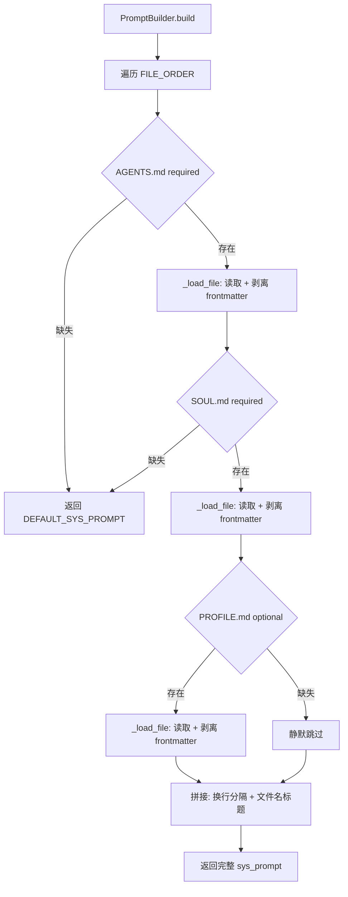
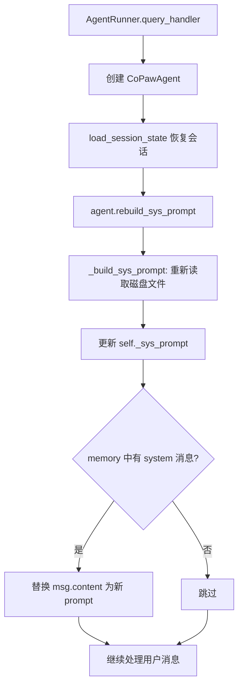
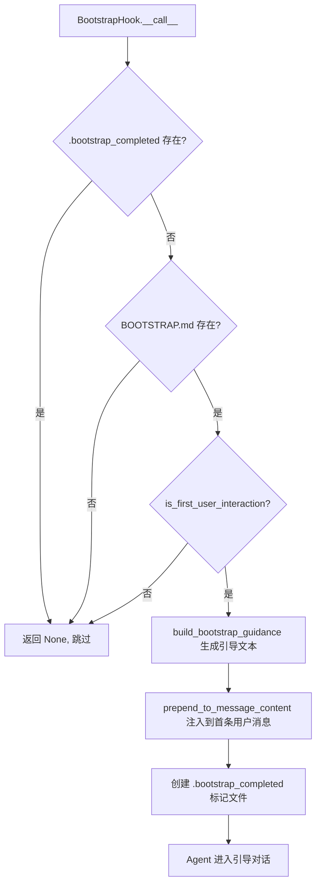

# PD-497.01 CoPaw — 三层 Markdown 声明式 Prompt 构建与 Bootstrap 引导

> 文档编号：PD-497.01
> 来源：CoPaw `src/copaw/agents/prompt.py`
> GitHub：https://github.com/agentscope-ai/CoPaw.git
> 问题域：PD-497 Markdown 驱动的 Prompt 工程
> 状态：可复用方案

---

## 第 1 章 问题与动机

### 1.1 核心问题

Agent 的 system prompt 通常是一段硬编码的长字符串，嵌在代码里。这带来三个痛点：

1. **不可编辑性** — 用户无法在不修改代码的情况下调整 Agent 的行为规则、人格特质或工作流程
2. **关注点耦合** — 行为规则（AGENTS.md）、人格灵魂（SOUL.md）、用户画像（PROFILE.md）混在一起，改一处容易误伤另一处
3. **会话陈旧** — 从持久化会话恢复后，system prompt 仍是旧版本，用户在磁盘上的修改不会生效
4. **冷启动缺失** — 新用户首次使用时没有引导流程，Agent 不知道自己是谁、用户是谁

CoPaw 的解法是把 system prompt 完全外置为 Markdown 文件，按职责分层，运行时动态加载和刷新。

### 1.2 CoPaw 的解法概述

1. **三文件分层** — `AGENTS.md`（行为规则，required）→ `SOUL.md`（人格灵魂，required）→ `PROFILE.md`（用户画像，optional），按固定顺序加载拼接（`prompt.py:26-30`）
2. **YAML frontmatter 剥离** — 每个 Markdown 文件可包含 YAML 头部元数据（summary、read_when），加载时自动剥离，只保留正文内容（`prompt.py:74-77`）
3. **PromptBuilder 模式** — Builder 模式逐文件加载，required 文件缺失则 fallback 到默认 prompt，optional 文件缺失静默跳过（`prompt.py:33-134`）
4. **rebuild_sys_prompt 实时刷新** — 每次 query 处理前，从磁盘重新读取 Markdown 文件重建 system prompt，确保用户的最新编辑立即生效（`react_agent.py:246-260`，`runner.py:135-138`）
5. **Bootstrap 引导流程** — 首次交互时检测 `BOOTSTRAP.md` 存在，通过 pre_reasoning hook 注入引导指令，完成后自删除并写入 `.bootstrap_completed` 标记（`hooks/bootstrap.py:20-103`）

### 1.3 设计思想

| 设计原则 | 具体实现 | 理由 | 替代方案 |
|----------|----------|------|----------|
| 声明式配置 | Markdown 文件定义 prompt，非代码 | 用户可用任何编辑器修改 Agent 行为 | 环境变量 / JSON 配置（不适合长文本） |
| 关注点分离 | AGENTS / SOUL / PROFILE 三层 | 行为规则、人格、用户画像独立演化 | 单文件 system prompt（改动互相干扰） |
| 运行时一致性 | rebuild_sys_prompt 每次 query 前刷新 | 磁盘修改即时生效，无需重启 | 启动时加载一次（会话中修改不生效） |
| 优雅降级 | required 缺失 fallback 默认 prompt | 即使配置不完整也能启动 | 启动时报错退出（用户体验差） |
| 自毁式引导 | BOOTSTRAP.md 完成后自删除 | 引导是一次性的，不应污染后续交互 | 数据库标记（增加外部依赖） |

---

## 第 2 章 源码实现分析

### 2.1 架构概览

CoPaw 的 Markdown 驱动 Prompt 系统由四个核心组件构成：

```
┌─────────────────────────────────────────────────────────┐
│                    ~/.copaw/ (WORKING_DIR)               │
│  ┌──────────┐  ┌──────────┐  ┌───────────┐  ┌────────┐ │
│  │AGENTS.md │  │ SOUL.md  │  │PROFILE.md │  │BOOT-   │ │
│  │(required)│  │(required)│  │(optional) │  │STRAP.md│ │
│  └────┬─────┘  └────┬─────┘  └─────┬─────┘  └───┬────┘ │
│       │              │              │             │      │
└───────┼──────────────┼──────────────┼─────────────┼──────┘
        │              │              │             │
        ▼              ▼              ▼             ▼
  ┌─────────────────────────────┐  ┌──────────────────────┐
  │      PromptBuilder          │  │   BootstrapHook      │
  │  _load_file() × 3          │  │  pre_reasoning hook   │
  │  YAML frontmatter 剥离     │  │  首次交互检测         │
  │  → build() → sys_prompt    │  │  → 注入引导指令       │
  └──────────┬──────────────────┘  └──────────┬───────────┘
             │                                │
             ▼                                ▼
  ┌─────────────────────────────────────────────────────┐
  │              CoPawAgent (ReActAgent)                 │
  │  _build_sys_prompt() → env_context + prompt         │
  │  rebuild_sys_prompt() → 每次 query 前刷新           │
  └─────────────────────────────────────────────────────┘
```

### 2.2 核心实现

#### 2.2.1 PromptConfig 与文件加载顺序



对应源码 `src/copaw/agents/prompt.py:22-134`：

```python
class PromptConfig:
    """Configuration for system prompt building."""
    # Define file loading order: (filename, required)
    FILE_ORDER = [
        ("AGENTS.md", True),
        ("SOUL.md", True),
        ("PROFILE.md", False),
    ]

class PromptBuilder:
    """Builder for constructing system prompts from markdown files."""
    def __init__(self, working_dir: Path):
        self.working_dir = working_dir
        self.prompt_parts = []
        self.loaded_count = 0

    def _load_file(self, filename: str, required: bool) -> bool:
        file_path = self.working_dir / filename
        if not file_path.exists():
            if required:
                logger.warning("%s not found in working directory (%s)", filename, self.working_dir)
                return False
            else:
                return True  # Not an error for optional files
        try:
            content = file_path.read_text(encoding="utf-8").strip()
            # Remove YAML frontmatter if present
            if content.startswith("---"):
                parts = content.split("---", 2)
                if len(parts) >= 3:
                    content = parts[2].strip()
            if content:
                if self.prompt_parts:
                    self.prompt_parts.append("")
                self.prompt_parts.append(f"# {filename}")
                self.prompt_parts.append("")
                self.prompt_parts.append(content)
                self.loaded_count += 1
            return True
        except Exception as e:
            if required:
                logger.error("Failed to read required file %s: %s", filename, e)
                return False
            return True

    def build(self) -> str:
        for filename, required in PromptConfig.FILE_ORDER:
            if not self._load_file(filename, required):
                return DEFAULT_SYS_PROMPT
        if not self.prompt_parts:
            return DEFAULT_SYS_PROMPT
        return "\n\n".join(self.prompt_parts)
```

#### 2.2.2 rebuild_sys_prompt 运行时刷新



对应源码 `src/copaw/agents/react_agent.py:246-260`：

```python
def rebuild_sys_prompt(self) -> None:
    """Rebuild and replace the system prompt.

    Useful after load_session_state to ensure the prompt reflects
    the latest AGENTS.md / SOUL.md / PROFILE.md on disk.

    Updates both self._sys_prompt and the first system-role
    message stored in self.memory.content (if one exists).
    """
    self._sys_prompt = self._build_sys_prompt()
    for msg, _marks in self.memory.content:
        if msg.role == "system":
            msg.content = self.sys_prompt
        break
```

调用点在 `src/copaw/app/runner/runner.py:135-138`：

```python
# Rebuild system prompt so it always reflects the latest
# AGENTS.md / SOUL.md / PROFILE.md, not the stale one saved
# in the session state.
agent.rebuild_sys_prompt()
```

### 2.3 实现细节

#### Bootstrap 引导流程

BootstrapHook 是一个 `pre_reasoning` 钩子，在 Agent 推理前执行。它实现了一个完整的首次交互引导协议：



对应源码 `src/copaw/agents/hooks/bootstrap.py:42-103`：

```python
async def __call__(self, agent, kwargs):
    try:
        bootstrap_path = self.working_dir / "BOOTSTRAP.md"
        bootstrap_completed_flag = self.working_dir / ".bootstrap_completed"

        if bootstrap_completed_flag.exists():
            return None
        if not bootstrap_path.exists():
            return None

        messages = await agent.memory.get_memory()
        if not is_first_user_interaction(messages):
            return None

        bootstrap_guidance = build_bootstrap_guidance(self.language)
        # Skip system messages, find first user message
        system_prompt_count = sum(1 for msg in messages if msg.role == "system")
        for msg in messages[system_prompt_count:]:
            if msg.role == "user":
                prepend_to_message_content(msg, bootstrap_guidance)
                break
        # Create completion flag
        bootstrap_completed_flag.touch()
    except Exception as e:
        logger.error("Failed to process bootstrap: %s", e, exc_info=True)
    return None
```

#### AgentMdManager 文件管理

`AgentMdManager`（`src/copaw/agents/memory/agent_md_manager.py:10-128`）提供了对 working_dir 和 memory 子目录下 Markdown 文件的 CRUD 操作，是 Agent 在运行时读写自身配置文件的基础设施：

- `list_working_mds()` — 列出工作目录下所有 `.md` 文件及元数据（大小、创建/修改时间）
- `read_working_md(name)` / `write_working_md(name, content)` — 读写工作目录 Markdown
- `read_memory_md(name)` / `write_memory_md(name, content)` — 读写 memory 子目录 Markdown
- 自动补全 `.md` 扩展名，全局单例 `AGENT_MD_MANAGER = AgentMdManager(working_dir=WORKING_DIR)`

#### YAML Frontmatter 剥离策略

CoPaw 的 Markdown 文件使用 YAML frontmatter 存储元数据（如 `summary`、`read_when`），但这些元数据不应进入 system prompt。剥离逻辑简洁高效（`prompt.py:74-77`）：

```python
if content.startswith("---"):
    parts = content.split("---", 2)
    if len(parts) >= 3:
        content = parts[2].strip()
```

这种基于 `---` 分隔符的简单 split 策略避免了引入 YAML 解析库依赖，但要求 frontmatter 格式严格（必须以 `---` 开头和结尾）。

#### 三层 Markdown 的职责划分

| 文件 | 职责 | 修改频率 | 修改者 |
|------|------|----------|--------|
| `AGENTS.md` | 行为规则、工作流、记忆策略、安全边界 | 低（项目级） | 开发者 / Agent 自身 |
| `SOUL.md` | 人格特质、核心价值观、交互风格 | 极低（身份级） | 用户 + Agent 协商 |
| `PROFILE.md` | 用户画像、偏好、时区、称呼 | 高（会话级） | Agent 自动更新 |


---

## 第 3 章 迁移指南

### 3.1 迁移清单

**阶段 1：基础 Prompt 外置（1 个文件即可启动）**

- [ ] 创建 `~/.your-agent/` 工作目录
- [ ] 编写 `AGENTS.md`（行为规则）
- [ ] 实现 `PromptBuilder`：按顺序读取 Markdown → 剥离 frontmatter → 拼接
- [ ] 在 Agent 初始化时调用 `build()` 获取 system prompt

**阶段 2：三层分离**

- [ ] 拆分 `SOUL.md`（人格）和 `PROFILE.md`（用户画像）
- [ ] 配置 `FILE_ORDER` 定义加载顺序和 required/optional 属性
- [ ] 实现 fallback 逻辑：required 缺失 → 默认 prompt

**阶段 3：运行时刷新**

- [ ] 实现 `rebuild_sys_prompt()`：重新读取磁盘文件 + 替换 memory 中的 system 消息
- [ ] 在每次 query 处理前调用（session 恢复后尤其重要）

**阶段 4：Bootstrap 引导**

- [ ] 编写 `BOOTSTRAP.md` 引导脚本
- [ ] 实现 `BootstrapHook`：检测首次交互 → 注入引导 → 写入完成标记
- [ ] 支持多语言引导（zh/en）

### 3.2 适配代码模板

以下是一个可直接复用的最小实现，不依赖 CoPaw 或 AgentScope：

```python
"""Markdown-driven system prompt builder — portable template."""
from pathlib import Path
from typing import Optional


DEFAULT_PROMPT = "You are a helpful assistant."

# Loading order: (filename, required)
FILE_ORDER = [
    ("AGENTS.md", True),
    ("SOUL.md", True),
    ("PROFILE.md", False),
]


def strip_yaml_frontmatter(content: str) -> str:
    """Remove YAML frontmatter (--- ... ---) from markdown content."""
    if content.startswith("---"):
        parts = content.split("---", 2)
        if len(parts) >= 3:
            return parts[2].strip()
    return content


def build_system_prompt(
    working_dir: str | Path,
    env_context: Optional[str] = None,
) -> str:
    """Build system prompt from markdown files in working_dir.

    Args:
        working_dir: Directory containing AGENTS.md, SOUL.md, PROFILE.md
        env_context: Optional context to prepend (session info, etc.)

    Returns:
        Assembled system prompt string
    """
    working_dir = Path(working_dir)
    parts: list[str] = []

    for filename, required in FILE_ORDER:
        path = working_dir / filename
        if not path.exists():
            if required:
                return DEFAULT_PROMPT
            continue

        content = strip_yaml_frontmatter(path.read_text(encoding="utf-8").strip())
        if content:
            if parts:
                parts.append("")
            parts.append(f"# {filename}")
            parts.append("")
            parts.append(content)

    if not parts:
        return DEFAULT_PROMPT

    prompt = "\n\n".join(parts)
    if env_context:
        prompt = env_context + "\n\n" + prompt
    return prompt


def rebuild_system_prompt_in_memory(agent, working_dir: str | Path) -> None:
    """Refresh system prompt from disk and update in-memory messages.

    Call this after restoring session state to pick up user edits.
    """
    new_prompt = build_system_prompt(working_dir)
    agent.system_prompt = new_prompt
    # Update the first system message in conversation history
    for msg in agent.messages:
        if msg.get("role") == "system":
            msg["content"] = new_prompt
            break
```

### 3.3 适用场景

| 场景 | 适用度 | 说明 |
|------|--------|------|
| 个人 AI 助手（可定制人格） | ⭐⭐⭐ | 核心场景：用户通过编辑 Markdown 定义 Agent 行为 |
| 多租户 Agent 平台 | ⭐⭐⭐ | 每个用户独立 working_dir，互不干扰 |
| 开发者工具 Agent（如 Claude Code） | ⭐⭐ | AGENTS.md 定义工作流规则，但可能需要更复杂的 prompt 模板 |
| 一次性脚本 Agent | ⭐ | 过度设计，硬编码 prompt 更简单 |
| 需要动态变量插值的 prompt | ⭐ | CoPaw 方案不支持模板变量，需额外扩展 |

---

## 第 4 章 测试用例

```python
"""Tests for Markdown-driven prompt building — based on CoPaw's PromptBuilder."""
import tempfile
from pathlib import Path

import pytest


# Import the portable template from 3.2 (or CoPaw's actual module)
from prompt_builder import (
    build_system_prompt,
    strip_yaml_frontmatter,
    DEFAULT_PROMPT,
)


class TestStripYamlFrontmatter:
    """Test YAML frontmatter stripping."""

    def test_strip_standard_frontmatter(self):
        content = '---\nsummary: "test"\n---\n\n## Hello\nWorld'
        assert strip_yaml_frontmatter(content) == "## Hello\nWorld"

    def test_no_frontmatter(self):
        content = "## Hello\nWorld"
        assert strip_yaml_frontmatter(content) == "## Hello\nWorld"

    def test_incomplete_frontmatter(self):
        """Only one --- should not strip anything."""
        content = "---\nsummary: test\n\n## Hello"
        assert strip_yaml_frontmatter(content) == content

    def test_empty_frontmatter(self):
        content = "---\n---\n\nBody text"
        assert strip_yaml_frontmatter(content) == "Body text"


class TestBuildSystemPrompt:
    """Test system prompt building from markdown files."""

    def _create_working_dir(self, files: dict[str, str]) -> Path:
        """Create a temp working dir with given files."""
        tmp = Path(tempfile.mkdtemp())
        for name, content in files.items():
            (tmp / name).write_text(content, encoding="utf-8")
        return tmp

    def test_full_three_files(self):
        wd = self._create_working_dir({
            "AGENTS.md": "## Rules\nBe helpful",
            "SOUL.md": "## Soul\nBe kind",
            "PROFILE.md": "## Profile\nUser: Alice",
        })
        prompt = build_system_prompt(wd)
        assert "# AGENTS.md" in prompt
        assert "# SOUL.md" in prompt
        assert "# PROFILE.md" in prompt
        assert "Be helpful" in prompt
        assert "Be kind" in prompt
        assert "User: Alice" in prompt

    def test_optional_profile_missing(self):
        wd = self._create_working_dir({
            "AGENTS.md": "Rules here",
            "SOUL.md": "Soul here",
        })
        prompt = build_system_prompt(wd)
        assert "Rules here" in prompt
        assert "Soul here" in prompt
        assert "PROFILE.md" not in prompt

    def test_required_agents_missing_fallback(self):
        wd = self._create_working_dir({"SOUL.md": "Soul here"})
        prompt = build_system_prompt(wd)
        assert prompt == DEFAULT_PROMPT

    def test_required_soul_missing_fallback(self):
        wd = self._create_working_dir({"AGENTS.md": "Rules here"})
        prompt = build_system_prompt(wd)
        assert prompt == DEFAULT_PROMPT

    def test_frontmatter_stripped(self):
        wd = self._create_working_dir({
            "AGENTS.md": '---\nsummary: "test"\n---\n\n## Rules\nContent',
            "SOUL.md": "Soul content",
        })
        prompt = build_system_prompt(wd)
        assert "summary" not in prompt
        assert "Content" in prompt

    def test_env_context_prepended(self):
        wd = self._create_working_dir({
            "AGENTS.md": "Rules",
            "SOUL.md": "Soul",
        })
        prompt = build_system_prompt(wd, env_context="Session: abc-123")
        assert prompt.startswith("Session: abc-123")

    def test_empty_working_dir_fallback(self):
        wd = Path(tempfile.mkdtemp())
        prompt = build_system_prompt(wd)
        assert prompt == DEFAULT_PROMPT
```


---

## 第 5 章 跨域关联

| 关联域 | 关系类型 | 说明 |
|--------|----------|------|
| PD-01 上下文管理 | 协同 | system prompt 占用 context window 的固定部分，三层文件的总长度直接影响可用上下文空间 |
| PD-06 记忆持久化 | 依赖 | PROFILE.md 由 Agent 在会话中自动更新（记录用户偏好），AgentMdManager 提供读写接口 |
| PD-09 Human-in-the-Loop | 协同 | Bootstrap 引导流程本质是一次结构化的 HITL 交互，用户参与定义 Agent 身份 |
| PD-10 中间件管道 | 依赖 | BootstrapHook 通过 pre_reasoning 钩子注入，依赖 Agent 的 hook 管道机制 |
| PD-490 Prompt 工程系统 | 协同 | 同属 Prompt 工程域，CoPaw 侧重声明式文件驱动，其他方案可能侧重模板变量插值 |

---

## 第 6 章 来源文件索引

| 文件 | 行范围 | 关键实现 |
|------|--------|----------|
| `src/copaw/agents/prompt.py` | L22-L30 | PromptConfig.FILE_ORDER 定义三文件加载顺序 |
| `src/copaw/agents/prompt.py` | L33-L134 | PromptBuilder 类：_load_file + build 方法 |
| `src/copaw/agents/prompt.py` | L74-L77 | YAML frontmatter 剥离逻辑 |
| `src/copaw/agents/prompt.py` | L137-L161 | build_system_prompt_from_working_dir 入口函数 |
| `src/copaw/agents/prompt.py` | L164-L210 | build_bootstrap_guidance 双语引导文本 |
| `src/copaw/agents/react_agent.py` | L98-L99 | _build_sys_prompt 调用点 |
| `src/copaw/agents/react_agent.py` | L246-L260 | rebuild_sys_prompt 运行时刷新 |
| `src/copaw/agents/hooks/bootstrap.py` | L20-L103 | BootstrapHook 首次交互引导 |
| `src/copaw/agents/utils/message_processing.py` | L271-L291 | is_first_user_interaction 判断逻辑 |
| `src/copaw/agents/utils/message_processing.py` | L294-L313 | prepend_to_message_content 消息注入 |
| `src/copaw/agents/memory/agent_md_manager.py` | L10-L128 | AgentMdManager Markdown 文件 CRUD |
| `src/copaw/app/runner/runner.py` | L129-L138 | load_session_state → rebuild_sys_prompt 调用链 |
| `src/copaw/constant.py` | L5-L9 | WORKING_DIR 定义（~/.copaw） |
| `src/copaw/agents/md_files/en/AGENTS.md` | 全文 | AGENTS.md 模板：记忆策略、安全规则、心跳机制 |
| `src/copaw/agents/md_files/en/SOUL.md` | 全文 | SOUL.md 模板：核心价值观、人格特质 |
| `src/copaw/agents/md_files/en/BOOTSTRAP.md` | 全文 | BOOTSTRAP.md 模板：首次交互引导脚本 |

---

## 第 7 章 横向对比维度

```json comparison_data
{
  "project": "CoPaw",
  "dimensions": {
    "Prompt 来源": "三层 Markdown 文件（AGENTS.md → SOUL.md → PROFILE.md）按序加载",
    "元数据处理": "YAML frontmatter 自动剥离，split('---', 2) 轻量实现",
    "运行时刷新": "rebuild_sys_prompt 每次 query 前从磁盘重读，替换 memory 中 system 消息",
    "冷启动引导": "BOOTSTRAP.md + pre_reasoning hook + .bootstrap_completed 标记文件",
    "降级策略": "required 文件缺失 fallback 默认 prompt，optional 缺失静默跳过",
    "文件管理": "AgentMdManager 单例提供 working_dir + memory 子目录双层 CRUD"
  }
}
```

### 域元数据补充

```json domain_metadata
{
  "solution_summary": "CoPaw 用 PromptBuilder 按 AGENTS.md → SOUL.md → PROFILE.md 顺序加载拼接，YAML frontmatter 自动剥离，rebuild_sys_prompt 每次 query 前从磁盘刷新，BootstrapHook 实现首次交互自毁式引导",
  "description": "声明式 Markdown 文件作为 system prompt 的唯一真相源，支持运行时热刷新",
  "sub_problems": [
    "会话恢复后 prompt 陈旧问题",
    "首次交互的自毁式引导协议",
    "Markdown 文件的双层目录管理（working + memory）"
  ],
  "best_practices": [
    "rebuild_sys_prompt 在 session 恢复后立即调用确保一致性",
    "BootstrapHook 用 .bootstrap_completed 标记文件防止重复触发",
    "required/optional 属性控制文件缺失时的降级行为"
  ]
}
```

