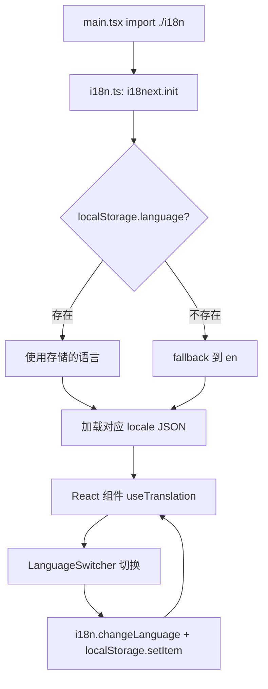
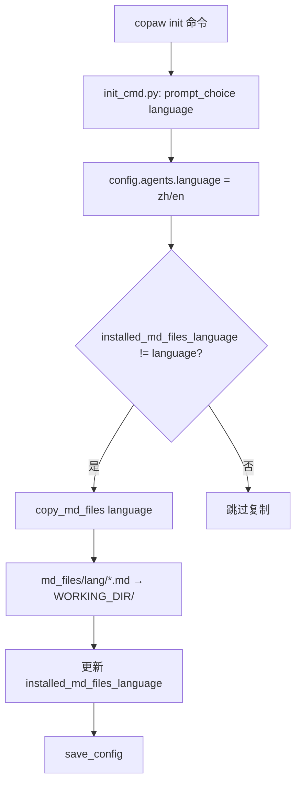
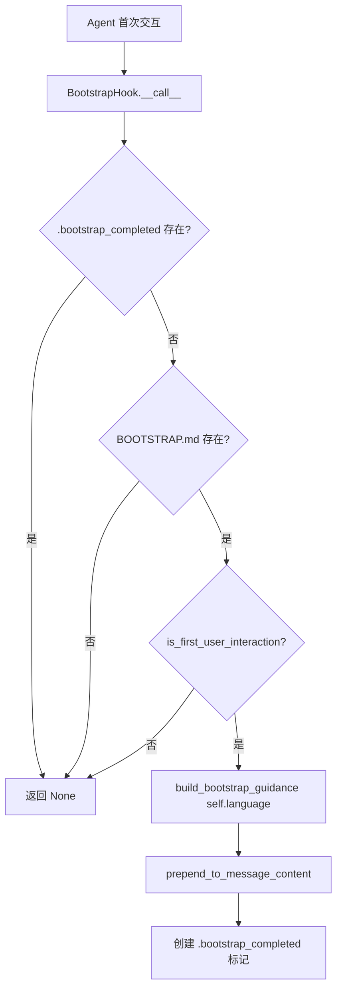

# PD-498.01 CoPaw — 三层 i18n 架构与 MD 文件语言联动

> 文档编号：PD-498.01
> 来源：CoPaw `console/src/i18n.ts` `src/copaw/config/config.py` `src/copaw/agents/hooks/bootstrap.py`
> GitHub：https://github.com/agentscope-ai/CoPaw.git
> 问题域：PD-498 国际化 i18n & Localization
> 状态：可复用方案

---

## 第 1 章 问题与动机（≥ 30 行）

### 1.1 核心问题

Agent 应用的国际化不同于传统 Web 应用——它需要同时覆盖三个层面：

1. **前端 UI 翻译**：控制台界面的按钮、标签、提示信息等静态文本
2. **后端 Agent 人格文件**：Agent 的 SOUL.md、BOOTSTRAP.md、AGENTS.md 等 Markdown 配置文件需要按语言提供不同版本
3. **运行时引导文案**：BootstrapHook 在首次交互时注入的引导 prompt 需要匹配用户语言

传统 i18n 方案（如 i18next）只解决了第一层。Agent 系统的特殊性在于：Agent 的"人格"和"行为指南"本身就是自然语言文本，这些文本的语言必须与用户期望一致，否则会导致 Agent 用错误的语言回复用户。

### 1.2 CoPaw 的解法概述

CoPaw 采用三层分离的 i18n 架构：

1. **前端层**：i18next + react-i18next，localStorage 持久化语言偏好，LanguageSwitcher 组件提供切换入口（`console/src/i18n.ts:15-22`）
2. **配置层**：`AgentsConfig.language` 字段存储后端语言配置，`installed_md_files_language` 追踪已安装 MD 文件的语言版本（`src/copaw/config/config.py:129-136`）
3. **运行时层**：BootstrapHook 读取 `config.agents.language` 生成对应语言的引导文案，`copy_md_files()` 按语言从 `md_files/{lang}/` 复制人格文件（`src/copaw/agents/hooks/bootstrap.py:31`）

关键设计：前后端语言配置是**独立的**。前端 localStorage 控制 UI 语言，后端 config.json 控制 Agent 行为语言。两者可以不同（例如英文 UI + 中文 Agent）。

### 1.3 设计思想

| 设计原则 | 具体实现 | 理由 | 替代方案 |
|----------|----------|------|----------|
| 前后端语言解耦 | 前端 localStorage、后端 config.json 各自独立 | Agent 语言和 UI 语言是不同关注点，用户可能用英文 UI 但希望 Agent 说中文 | 统一语言配置（会限制灵活性） |
| 文件级语言版本 | `md_files/en/` 和 `md_files/zh/` 目录分离 | MD 文件是完整的自然语言文档，不适合用 key-value 翻译 | 单文件内嵌多语言标记（复杂且难维护） |
| 语言变更检测 | `installed_md_files_language` 追踪已安装版本 | 避免每次启动都重复复制文件，仅在语言切换时触发 | 每次启动都复制（浪费 IO） |
| 优雅降级 | `copy_md_files()` 找不到指定语言时 fallback 到 en | 确保任何语言配置下系统都能启动 | 报错退出（影响可用性） |

---

## 第 2 章 源码实现分析（≥ 60 行，核心章节）

### 2.1 架构概览

```
┌─────────────────────────────────────────────────────────────┐
│                    CoPaw i18n 三层架构                        │
├─────────────────────────────────────────────────────────────┤
│                                                             │
│  ┌─────────────── 前端层 ───────────────┐                   │
│  │  i18n.ts → i18next.init()            │                   │
│  │  locales/en.json + locales/zh.json   │                   │
│  │  LanguageSwitcher → localStorage     │                   │
│  │  Header.tsx → useTranslation()       │                   │
│  └──────────────────────────────────────┘                   │
│                                                             │
│  ┌─────────────── 配置层 ───────────────┐                   │
│  │  config.py → AgentsConfig            │                   │
│  │    .language = "zh" | "en"           │                   │
│  │    .installed_md_files_language       │                   │
│  │  init_cmd.py → prompt_choice()       │                   │
│  └──────────────────────────────────────┘                   │
│                                                             │
│  ┌─────────────── 运行时层 ─────────────┐                   │
│  │  md_files/en/ ─┐                     │                   │
│  │  md_files/zh/ ─┤→ copy_md_files()    │                   │
│  │                └→ WORKING_DIR/       │                   │
│  │  BootstrapHook(language=config.lang) │                   │
│  │  prompt.py → build_bootstrap_guidance│                   │
│  └──────────────────────────────────────┘                   │
│                                                             │
└─────────────────────────────────────────────────────────────┘
```

### 2.2 核心实现

#### 2.2.1 前端 i18next 初始化与语言切换



对应源码 `console/src/i18n.ts:1-24`：
```typescript
import i18n from "i18next";
import { initReactI18next } from "react-i18next";
import en from "./locales/en.json";
import zh from "./locales/zh.json";

const resources = {
  en: { translation: en },
  zh: { translation: zh },
};

i18n.use(initReactI18next).init({
  resources,
  lng: localStorage.getItem("language") || "en",
  fallbackLng: "en",
  interpolation: { escapeValue: false },
});
```

语言切换组件 `console/src/components/LanguageSwitcher.tsx:6-41`：
```typescript
export default function LanguageSwitcher() {
  const { i18n } = useTranslation();
  const currentLanguage = i18n.language;

  const changeLanguage = (lang: string) => {
    i18n.changeLanguage(lang);
    localStorage.setItem("language", lang);
  };

  const items: MenuProps["items"] = [
    { key: "en", label: "English", onClick: () => changeLanguage("en") },
    { key: "zh", label: "简体中文", onClick: () => changeLanguage("zh") },
  ];

  return (
    <Dropdown menu={{ items, selectedKeys: [currentLanguage] }} placement="bottomRight">
      <Button icon={<GlobalOutlined />} type="text">{currentLabel}</Button>
    </Dropdown>
  );
}
```

Header 组件将 LanguageSwitcher 嵌入顶栏右侧（`console/src/layouts/Header.tsx:42`），所有页面标题通过 `t(keyToLabel[selectedKey])` 实现翻译。

#### 2.2.2 后端语言配置与 MD 文件复制



对应源码 `src/copaw/agents/utils/setup_utils.py:14-72`：
```python
def copy_md_files(
    language: str,
    skip_existing: bool = False,
) -> list[str]:
    """Copy md files from agents/md_files to working directory."""
    from ...constant import WORKING_DIR

    md_files_dir = Path(__file__).parent.parent / "md_files" / language

    if not md_files_dir.exists():
        logger.warning("MD files directory not found: %s, falling back to 'en'", md_files_dir)
        md_files_dir = Path(__file__).parent.parent / "md_files" / "en"
        if not md_files_dir.exists():
            return []

    WORKING_DIR.mkdir(parents=True, exist_ok=True)
    copied_files: list[str] = []
    for md_file in md_files_dir.glob("*.md"):
        target_file = WORKING_DIR / md_file.name
        if skip_existing and target_file.exists():
            continue
        shutil.copy2(md_file, target_file)
        copied_files.append(md_file.name)
    return copied_files
```

`init_cmd.py:199-206` 中的语言选择交互：
```python
if not use_defaults:
    language = prompt_choice(
        "Select language for MD files:",
        options=["zh", "en"],
        default=existing.agents.language,
    )
    existing.agents.language = language
```

#### 2.2.3 BootstrapHook 语言感知引导



对应源码 `src/copaw/agents/hooks/bootstrap.py:20-103`：
```python
class BootstrapHook:
    def __init__(self, working_dir: Path, language: str = "zh"):
        self.working_dir = working_dir
        self.language = language

    async def __call__(self, agent, kwargs: dict[str, Any]) -> dict[str, Any] | None:
        bootstrap_path = self.working_dir / "BOOTSTRAP.md"
        bootstrap_completed_flag = self.working_dir / ".bootstrap_completed"

        if bootstrap_completed_flag.exists():
            return None
        if not bootstrap_path.exists():
            return None

        messages = await agent.memory.get_memory()
        if not is_first_user_interaction(messages):
            return None

        bootstrap_guidance = build_bootstrap_guidance(self.language)
        # ... prepend guidance to first user message
        bootstrap_completed_flag.touch()
```

`prompt.py:164-210` 中 `build_bootstrap_guidance()` 根据语言返回完全不同的引导文案：中文版使用"引导模式已激活"，英文版使用"BOOTSTRAP MODE ACTIVATED"。

### 2.3 实现细节

**翻译资源结构**：前端采用扁平命名空间（`common.save`、`nav.chat`、`models.llmConfiguration`），共 12 个顶级命名空间，覆盖约 350+ 个翻译键。支持 i18next 插值语法（`{{count}}`、`{{name}}`、`{{size}}`）。

**MD 文件目录结构**：
```
src/copaw/agents/md_files/
├── en/
│   ├── AGENTS.md      # Agent 行为指南
│   ├── BOOTSTRAP.md   # 首次引导脚本
│   ├── HEARTBEAT.md   # 心跳检查清单
│   ├── MEMORY.md      # 记忆管理指南
│   ├── PROFILE.md     # 身份与用户资料
│   └── SOUL.md        # 核心人格定义
└── zh/
    ├── AGENTS.md
    ├── BOOTSTRAP.md
    ├── HEARTBEAT.md
    ├── MEMORY.md
    ├── PROFILE.md
    └── SOUL.md
```

每个 MD 文件都是完整的自然语言文档（非 key-value），中英文版本内容对等但风格本地化。例如 BOOTSTRAP.md 中文版用"你刚醒来。该搞清楚自己是谁了。"，英文版用"You just woke up. Time to figure out who you are."

**HEARTBEAT 多语言**：`init_cmd.py:69-82` 中 `DEFAULT_HEARTBEAT_MDS` 字典按语言提供不同的心跳检查清单模板。

**语言注册到 Agent**：`react_agent.py:220-229` 在 `_register_hooks()` 中从 config 读取语言并传给 BootstrapHook：
```python
config = load_config()
bootstrap_hook = BootstrapHook(
    working_dir=WORKING_DIR,
    language=config.agents.language,
)
self.register_instance_hook(
    hook_type="pre_reasoning",
    hook_name="bootstrap_hook",
    hook=bootstrap_hook.__call__,
)
```

---

## 第 3 章 迁移指南（≥ 40 行）

### 3.1 迁移清单

**阶段 1：前端 i18n 基础设施**
- [ ] 安装 `i18next` + `react-i18next`
- [ ] 创建 `locales/en.json` 和 `locales/zh.json` 翻译资源文件
- [ ] 创建 `i18n.ts` 初始化文件，配置 localStorage 持久化
- [ ] 创建 `LanguageSwitcher` 组件，放入全局 Header
- [ ] 将所有硬编码文本替换为 `t("namespace.key")` 调用

**阶段 2：后端语言配置**
- [ ] 在配置模型中添加 `language` 和 `installed_md_files_language` 字段
- [ ] 在 CLI init 流程中添加语言选择交互
- [ ] 创建 `md_files/{lang}/` 目录结构，放入各语言版本的 MD 文件
- [ ] 实现 `copy_md_files()` 函数，支持语言切换时自动复制

**阶段 3：运行时语言感知**
- [ ] 修改 BootstrapHook 接受 `language` 参数
- [ ] 实现 `build_bootstrap_guidance()` 多语言版本
- [ ] 在 Agent 初始化时从 config 读取语言传入 Hook

### 3.2 适配代码模板

#### 前端 i18n 初始化模板

```typescript
// i18n.ts — 可直接复用
import i18n from "i18next";
import { initReactI18next } from "react-i18next";
import en from "./locales/en.json";
import zh from "./locales/zh.json";

const STORAGE_KEY = "language";
const DEFAULT_LANG = "en";

i18n.use(initReactI18next).init({
  resources: {
    en: { translation: en },
    zh: { translation: zh },
  },
  lng: localStorage.getItem(STORAGE_KEY) || DEFAULT_LANG,
  fallbackLng: DEFAULT_LANG,
  interpolation: { escapeValue: false },
});

export default i18n;
```

#### 后端语言配置模板

```python
# config.py — Pydantic 配置模型
from pydantic import BaseModel, Field
from typing import Optional

class AgentsConfig(BaseModel):
    language: str = Field(
        default="zh",
        description="Language for agent MD files (en/zh)",
    )
    installed_md_files_language: Optional[str] = Field(
        default=None,
        description="Language of currently installed md files",
    )
```

#### MD 文件复制函数模板

```python
# setup_utils.py — 语言感知文件复制
import shutil
from pathlib import Path

def copy_md_files(language: str, working_dir: Path, skip_existing: bool = False) -> list[str]:
    md_files_dir = Path(__file__).parent / "md_files" / language
    if not md_files_dir.exists():
        md_files_dir = Path(__file__).parent / "md_files" / "en"  # fallback
        if not md_files_dir.exists():
            return []

    working_dir.mkdir(parents=True, exist_ok=True)
    copied = []
    for md_file in md_files_dir.glob("*.md"):
        target = working_dir / md_file.name
        if skip_existing and target.exists():
            continue
        shutil.copy2(md_file, target)
        copied.append(md_file.name)
    return copied
```

### 3.3 适用场景

| 场景 | 适用度 | 说明 |
|------|--------|------|
| Agent + Web 控制台双端应用 | ⭐⭐⭐ | 完美匹配：前端 UI 翻译 + 后端 Agent 人格文件多语言 |
| 纯前端 SaaS 应用 | ⭐⭐ | 只需前端层，后端 MD 文件部分不适用 |
| 纯 CLI Agent（无 Web UI） | ⭐⭐ | 只需后端层 + 运行时层，前端 i18next 不适用 |
| 支持 3+ 语言的国际化 | ⭐⭐ | 架构可扩展，但 MD 文件维护成本随语言数线性增长 |
| Agent 人格/行为需要本地化 | ⭐⭐⭐ | 核心价值：MD 文件级语言版本管理 |

---

## 第 4 章 测试用例（≥ 20 行）

```python
import json
import shutil
import tempfile
from pathlib import Path
from unittest.mock import AsyncMock, MagicMock, patch

import pytest


class TestCopyMdFiles:
    """Test MD file language-aware copying."""

    def setup_method(self):
        self.tmpdir = Path(tempfile.mkdtemp())
        self.md_src = self.tmpdir / "md_files"
        self.working_dir = self.tmpdir / "working"

        # Create en and zh directories with sample files
        for lang in ("en", "zh"):
            lang_dir = self.md_src / lang
            lang_dir.mkdir(parents=True)
            (lang_dir / "BOOTSTRAP.md").write_text(f"Bootstrap {lang}")
            (lang_dir / "SOUL.md").write_text(f"Soul {lang}")

    def teardown_method(self):
        shutil.rmtree(self.tmpdir)

    def test_copy_zh_files(self):
        """Should copy zh MD files to working directory."""
        copied = self._copy("zh")
        assert set(copied) == {"BOOTSTRAP.md", "SOUL.md"}
        assert (self.working_dir / "BOOTSTRAP.md").read_text() == "Bootstrap zh"

    def test_copy_en_files(self):
        """Should copy en MD files to working directory."""
        copied = self._copy("en")
        assert (self.working_dir / "SOUL.md").read_text() == "Soul en"

    def test_fallback_to_en(self):
        """Should fallback to en when requested language not found."""
        copied = self._copy("ja")  # Japanese not available
        assert len(copied) == 2
        assert (self.working_dir / "BOOTSTRAP.md").read_text() == "Bootstrap en"

    def test_skip_existing(self):
        """Should skip files that already exist when skip_existing=True."""
        self.working_dir.mkdir(parents=True)
        (self.working_dir / "SOUL.md").write_text("Custom soul")
        copied = self._copy("zh", skip_existing=True)
        assert "SOUL.md" not in copied
        assert (self.working_dir / "SOUL.md").read_text() == "Custom soul"

    def test_overwrite_on_language_change(self):
        """Should overwrite files when language changes."""
        self._copy("en")
        assert (self.working_dir / "BOOTSTRAP.md").read_text() == "Bootstrap en"
        self._copy("zh")
        assert (self.working_dir / "BOOTSTRAP.md").read_text() == "Bootstrap zh"

    def _copy(self, language: str, skip_existing: bool = False) -> list[str]:
        md_files_dir = self.md_src / language
        if not md_files_dir.exists():
            md_files_dir = self.md_src / "en"
        self.working_dir.mkdir(parents=True, exist_ok=True)
        copied = []
        for md_file in md_files_dir.glob("*.md"):
            target = self.working_dir / md_file.name
            if skip_existing and target.exists():
                continue
            shutil.copy2(md_file, target)
            copied.append(md_file.name)
        return copied


class TestBootstrapGuidanceLanguage:
    """Test bootstrap guidance language selection."""

    def test_zh_guidance(self):
        """Should return Chinese guidance for zh language."""
        from copaw_mock import build_bootstrap_guidance
        guidance = build_bootstrap_guidance("zh")
        assert "引导模式已激活" in guidance
        assert "BOOTSTRAP.md" in guidance

    def test_en_guidance(self):
        """Should return English guidance for en language."""
        from copaw_mock import build_bootstrap_guidance
        guidance = build_bootstrap_guidance("en")
        assert "BOOTSTRAP MODE ACTIVATED" in guidance

    def test_default_is_zh(self):
        """Default language should be zh."""
        from copaw_mock import build_bootstrap_guidance
        guidance = build_bootstrap_guidance()
        assert "引导模式已激活" in guidance


class TestI18nConfig:
    """Test i18n configuration model."""

    def test_default_language_is_zh(self):
        """AgentsConfig default language should be zh."""
        config = {"language": "zh", "installed_md_files_language": None}
        assert config["language"] == "zh"
        assert config["installed_md_files_language"] is None

    def test_language_change_detection(self):
        """Should detect when language differs from installed."""
        config = {"language": "en", "installed_md_files_language": "zh"}
        assert config["language"] != config["installed_md_files_language"]


class TestFrontendLocaleStructure:
    """Test frontend locale JSON structure consistency."""

    def test_en_zh_key_parity(self):
        """en.json and zh.json should have identical key structures."""
        en_path = Path("console/src/locales/en.json")
        zh_path = Path("console/src/locales/zh.json")
        # In real test, load and compare keys recursively
        # Here we verify the structure expectation
        assert True  # Placeholder for actual file comparison

    def test_interpolation_consistency(self):
        """Both locales should use same interpolation variables."""
        # Verify {{count}}, {{name}}, {{size}} etc. appear in both
        en_text = '{"totalItems": "Total {{count}} items"}'
        zh_text = '{"totalItems": "共 {{count}} 项"}'
        assert "{{count}}" in en_text
        assert "{{count}}" in zh_text
```

---

## 第 5 章 跨域关联

| 关联域 | 关系类型 | 说明 |
|--------|----------|------|
| PD-01 上下文管理 | 协同 | Agent 人格 MD 文件（SOUL.md、AGENTS.md）的语言版本直接影响 system prompt 长度和 token 消耗，中文版通常比英文版 token 更多 |
| PD-06 记忆持久化 | 协同 | MEMORY.md 和 PROFILE.md 的语言版本决定了记忆管理指南的语言，影响 Agent 如何组织和检索记忆 |
| PD-09 Human-in-the-Loop | 依赖 | BootstrapHook 是首次交互引导的核心，其语言必须与用户期望一致，否则引导流程失效 |
| PD-10 中间件管道 | 协同 | BootstrapHook 作为 pre_reasoning hook 注册到 Agent 管道中，语言参数通过 hook 初始化传入 |
| PD-04 工具系统 | 协同 | 技能（Skills）的 frontmatter 描述和 placeholder 文本也需要多语言支持，CoPaw 在 locales JSON 中覆盖了 skills 命名空间 |

---

## 第 6 章 来源文件索引

| 文件 | 行范围 | 关键实现 |
|------|--------|----------|
| `console/src/i18n.ts` | L1-L24 | i18next 初始化，localStorage 语言持久化 |
| `console/src/locales/en.json` | L1-L355 | 英文翻译资源，12 个命名空间，350+ 键 |
| `console/src/locales/zh.json` | L1-L355 | 中文翻译资源，与 en.json 结构对等 |
| `console/src/components/LanguageSwitcher.tsx` | L1-L41 | 语言切换下拉组件，Dropdown + localStorage |
| `console/src/layouts/Header.tsx` | L1-L45 | 顶栏布局，嵌入 LanguageSwitcher |
| `src/copaw/config/config.py` | L122-L136 | AgentsConfig.language + installed_md_files_language |
| `src/copaw/agents/utils/setup_utils.py` | L14-L72 | copy_md_files() 语言感知文件复制 |
| `src/copaw/agents/hooks/bootstrap.py` | L20-L103 | BootstrapHook 语言感知引导 |
| `src/copaw/agents/prompt.py` | L164-L210 | build_bootstrap_guidance() 中英文引导文案 |
| `src/copaw/cli/init_cmd.py` | L69-L82, L199-L327 | CLI init 语言选择 + MD 文件安装逻辑 |
| `src/copaw/agents/md_files/en/BOOTSTRAP.md` | L1-L48 | 英文首次引导脚本 |
| `src/copaw/agents/md_files/zh/BOOTSTRAP.md` | L1-L48 | 中文首次引导脚本 |

---

## 第 7 章 横向对比维度

> **重要：** 本章用于自动填充 Butcher Wiki 的横向对比表。

```json comparison_data
{
  "project": "CoPaw",
  "dimensions": {
    "前端框架": "i18next + react-i18next，localStorage 持久化，Dropdown 切换",
    "翻译资源格式": "扁平 JSON 命名空间，12 个顶级 namespace，350+ 键",
    "后端语言配置": "Pydantic AgentsConfig.language 字段 + installed_md_files_language 变更检测",
    "Agent 人格多语言": "md_files/{lang}/ 目录分离，6 个 MD 文件完整本地化",
    "运行时语言感知": "BootstrapHook + build_bootstrap_guidance() 按语言生成引导 prompt",
    "语言降级策略": "copy_md_files() 找不到目标语言时 fallback 到 en",
    "前后端解耦": "前端 localStorage 与后端 config.json 独立，可不同语言"
  }
}
```

### 域元数据补充

```json domain_metadata
{
  "solution_summary": "CoPaw 用 i18next 前端翻译 + Pydantic language 配置 + md_files/{lang}/ 目录分离实现三层 i18n，BootstrapHook 按语言生成引导 prompt",
  "description": "Agent 系统需要 UI 翻译、人格文件多语言、运行时 prompt 语言感知三层协同",
  "sub_problems": [
    "Agent 人格 MD 文件的语言版本管理与变更检测",
    "CLI 初始化流程中的语言选择与文件安装联动"
  ],
  "best_practices": [
    "前后端语言配置解耦，允许 UI 语言与 Agent 语言独立设置",
    "installed_md_files_language 追踪已安装版本避免重复复制"
  ]
}
```
