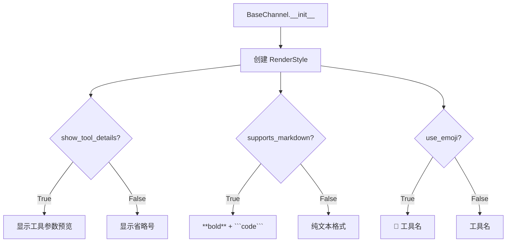
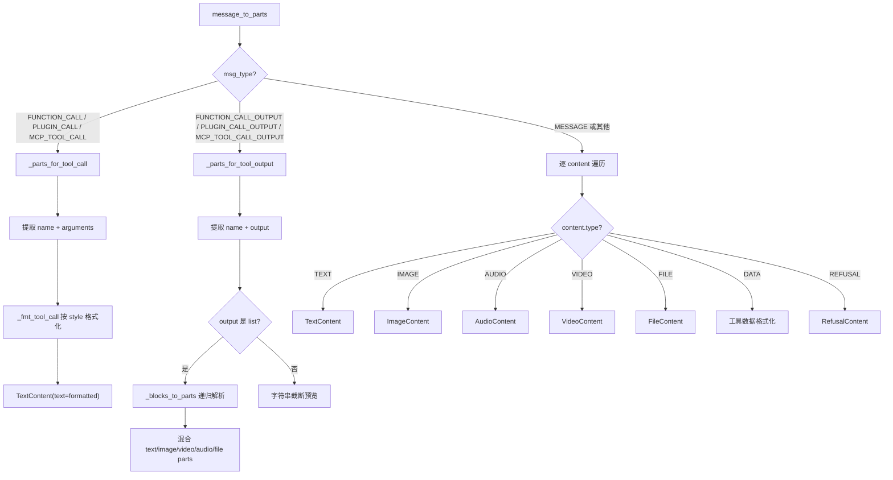
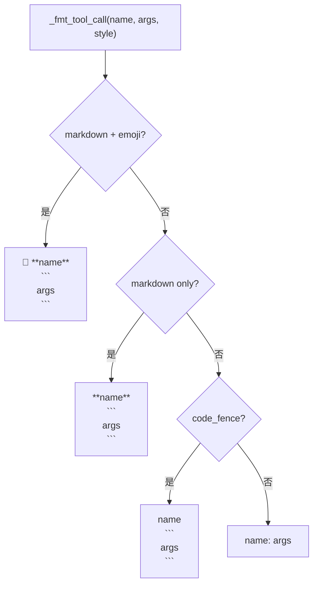

# PD-499.01 CoPaw — RenderStyle 声明式渠道适配与 ContentParts 统一渲染

> 文档编号：PD-499.01
> 来源：CoPaw `src/copaw/app/channels/renderer.py`
> GitHub：https://github.com/agentscope-ai/CoPaw.git
> 问题域：PD-499 消息渲染适配 Message Rendering Adapter
> 状态：可复用方案

---

## 第 1 章 问题与动机

### 1.1 核心问题

多渠道 Agent 系统面临一个根本矛盾：Agent 的输出是统一的结构化消息（工具调用、多媒体、文本混合），但每个渠道（Discord、钉钉、飞书、iMessage、QQ、控制台）对消息格式的支持能力截然不同：

- Discord 支持完整 Markdown + emoji + 代码块 + 文件附件
- 钉钉的 Markdown 渲染有诸多怪癖（缩进代码块渲染错误、列表项需要额外空行）
- iMessage 不支持 Markdown，只能发纯文本 + 图片
- 控制台需要 ANSI 颜色码而非 Markdown

如果每个渠道各自实现消息格式化逻辑，会导致：
1. 格式化代码散落在 6+ 个渠道实现中，难以维护
2. 新增渠道时需要从零实现所有消息类型的格式化
3. 工具调用结果、多媒体内容的渲染逻辑重复

### 1.2 CoPaw 的解法概述

CoPaw 采用 **声明式能力 + 统一渲染器** 的两层架构：

1. **RenderStyle 声明渠道能力**：每个渠道通过 4 个布尔标志声明自己支持什么（`renderer.py:38-44`）
2. **MessageRenderer 统一渲染**：一个渲染器根据 RenderStyle 将 Agent 消息转换为 `ContentParts` 列表（`renderer.py:75-338`）
3. **BaseChannel 桥接**：基类持有 renderer 实例，子类通过替换 `_render_style` 定制行为（`base.py:90-91`）
4. **send_content_parts 分发**：基类提供默认的文本+媒体合并发送，子类可覆写实现渠道原生发送（`base.py:605-656`）
5. **渠道级后处理**：如钉钉的 `normalize_dingtalk_markdown` 处理平台特有的 Markdown 怪癖（`dingtalk/markdown.py:96-110`）

### 1.3 设计思想

| 设计原则 | 具体实现 | 理由 | 替代方案 |
|----------|----------|------|----------|
| 声明式能力配置 | RenderStyle dataclass 4 个布尔字段 | 新渠道只需声明能力，无需改渲染逻辑 | 每个渠道写独立 formatter（代码膨胀） |
| 单一渲染器 | MessageRenderer 处理所有消息类型 | 格式化逻辑集中，一处修改全局生效 | 策略模式多个 Renderer 子类（过度设计） |
| ContentParts 中间表示 | Union[TextContent, ImageContent, ...] 列表 | 解耦渲染与发送，渠道只关心如何发送 parts | 直接输出字符串（丢失多媒体结构） |
| 渐进式覆写 | 子类可覆写 send_content_parts / send_media | 简单渠道用默认实现，复杂渠道精细控制 | 模板方法强制所有渠道实现所有钩子 |
| 平台怪癖隔离 | dingtalk/markdown.py 独立模块 | 平台特有修复不污染通用渲染器 | 在 renderer 中加 if/else 分支 |

---

## 第 2 章 源码实现分析

### 2.1 架构概览

CoPaw 的消息渲染适配采用三层架构：声明层（RenderStyle）→ 渲染层（MessageRenderer）→ 发送层（BaseChannel + 子类）。

```
┌─────────────────────────────────────────────────────────────────┐
│                     Agent Engine Output                         │
│  Event(object="message", status=Completed, content=[...])      │
└──────────────────────────┬──────────────────────────────────────┘
                           │
                           ▼
┌──────────────────────────────────────────────────────────────────┐
│  BaseChannel._message_to_content_parts(message)                  │
│  → delegates to self._renderer.message_to_parts(message)         │
│                                                                  │
│  ┌────────────────────────────────────────────────────────────┐  │
│  │  MessageRenderer (renderer.py)                             │  │
│  │  ┌──────────────┐                                          │  │
│  │  │ RenderStyle  │  supports_markdown: bool                 │  │
│  │  │ (声明层)      │  supports_code_fence: bool               │  │
│  │  │              │  use_emoji: bool                          │  │
│  │  │              │  show_tool_details: bool                  │  │
│  │  └──────┬───────┘                                          │  │
│  │         │ 驱动                                              │  │
│  │         ▼                                                   │  │
│  │  ┌──────────────────────────────────────────────────────┐  │  │
│  │  │ message_to_parts(message) → List[ContentPart]        │  │  │
│  │  │  ├─ FUNCTION_CALL → _parts_for_tool_call()           │  │  │
│  │  │  ├─ FUNCTION_CALL_OUTPUT → _parts_for_tool_output()  │  │  │
│  │  │  └─ MESSAGE → 逐 content 类型映射                     │  │  │
│  │  └──────────────────────────────────────────────────────┘  │  │
│  └────────────────────────────────────────────────────────────┘  │
│                           │                                      │
│                           ▼ List[ContentPart]                    │
│  ┌────────────────────────────────────────────────────────────┐  │
│  │  send_content_parts(to_handle, parts, meta)                │  │
│  │  ├─ 默认: 合并 text → send() + send_media()               │  │
│  │  ├─ DingTalk: webhook 发送 + 媒体上传                      │  │
│  │  ├─ Feishu: receive_id 路由 + 图片/文件 API               │  │
│  │  └─ Console: ANSI 彩色打印                                 │  │
│  └────────────────────────────────────────────────────────────┘  │
└──────────────────────────────────────────────────────────────────┘
```

### 2.2 核心实现

#### 2.2.1 RenderStyle 声明式能力配置



对应源码 `src/copaw/app/channels/renderer.py:37-44`：

```python
@dataclass
class RenderStyle:
    """Channel capabilities for rendering (no hardcoded markdown/emoji)."""
    show_tool_details: bool = True
    supports_markdown: bool = True
    supports_code_fence: bool = True
    use_emoji: bool = True
```

BaseChannel 在构造时根据 `show_tool_details` 参数创建 RenderStyle 并注入 MessageRenderer（`base.py:90-91`）：

```python
self._render_style = RenderStyle(show_tool_details=show_tool_details)
self._renderer = MessageRenderer(self._render_style)
```

#### 2.2.2 MessageRenderer 消息类型分发



对应源码 `src/copaw/app/channels/renderer.py:84-305`，核心分发逻辑：

```python
def message_to_parts(self, message: Any) -> List[_OutgoingPart]:
    msg_type = getattr(message, "type", None)
    content = getattr(message, "content", None) or []
    s = self.style

    if msg_type in (
        MessageType.FUNCTION_CALL,
        MessageType.PLUGIN_CALL,
        MessageType.MCP_TOOL_CALL,
    ):
        parts = _parts_for_tool_call(content)
        if not parts:
            parts = [TextContent(text=f"[{msg_type}]")]
        return parts

    if msg_type in (
        MessageType.FUNCTION_CALL_OUTPUT,
        MessageType.PLUGIN_CALL_OUTPUT,
        MessageType.MCP_TOOL_CALL_OUTPUT,
    ):
        parts = _parts_for_tool_output(content)
        if not parts:
            parts = [TextContent(text=f"[{msg_type}]")]
        return parts

    # 普通消息：逐 content 类型映射
    result: List[_OutgoingPart] = []
    for c in content:
        ctype = getattr(c, "type", None)
        if ctype == ContentType.TEXT and getattr(c, "text", None):
            result.append(TextContent(text=c.text))
        elif ctype == ContentType.IMAGE and getattr(c, "image_url", None):
            result.append(ImageContent(image_url=c.image_url))
        # ... 其他类型映射
    return result
```

#### 2.2.3 工具调用格式化的 Style 驱动



对应源码 `src/copaw/app/channels/renderer.py:47-58`：

```python
def _fmt_tool_call(
    name: str,
    args_preview: str,
    style: RenderStyle,
) -> str:
    if style.supports_markdown and style.use_emoji:
        return f"🔧 **{name}**\n```\n{args_preview}\n```"
    if style.supports_markdown:
        return f"**{name}**\n```\n{args_preview}\n```"
    if style.supports_code_fence:
        return f"{name}\n```\n{args_preview}\n```"
    return f"{name}: {args_preview}"
```

### 2.3 实现细节

#### 多媒体内容的双源解析

工具输出中的多媒体内容支持两种来源格式（`renderer.py:126-154`）：

- **URL 引用**：`source.type == "url"` → 直接使用 `source.url`
- **Base64 内联**：`source.type == "base64"` → 构造 `data:mime;base64,...` URI

这使得 Agent 工具无论返回 URL 还是 base64 数据，渲染器都能统一处理。

#### 文本截断策略

渲染器对工具参数和输出实施分级截断（`renderer.py:106-111, 204-209`）：

- 工具参数（arguments）：截断到 200 字符
- 工具输出（output）：截断到 500 字符
- 当 `show_tool_details=False` 时：统一显示 `"..."`

#### 渠道级后处理：钉钉 Markdown 修复

钉钉的 Markdown 渲染器有已知怪癖，CoPaw 通过独立模块 `dingtalk/markdown.py` 处理（`markdown.py:96-110`）：

1. `ensure_list_spacing`：在编号列表项前插入空行（钉钉会把列表项合并到上一段）
2. `dedent_code_blocks`：移除代码块前的缩进（钉钉渲染缩进代码块会出错）
3. `format_code_blocks`：可选地给代码行加前缀标记

```python
def normalize_dingtalk_markdown(
    text: str,
    code_prefix: str | None = None,
) -> str:
    text = ensure_list_spacing(text)
    text = dedent_code_blocks(text)
    if code_prefix is not None:
        text = format_code_blocks(text, prefix=code_prefix)
    return text
```

#### send_content_parts 的渐进式覆写

BaseChannel 提供默认的 `send_content_parts` 实现（`base.py:605-656`）：合并所有文本 parts 为一条消息，媒体 parts 以 `[Image: url]` 形式追加。子类按需覆写：

- **DingTalk**（`dingtalk/channel.py:949`）：通过 sessionWebhook 发送文本，媒体通过上传 API 单独发送
- **Feishu**（`feishu/channel.py:1376`）：通过 receive_id 路由，图片和文件走飞书专用 API
- **Console**（`console/channel.py:290`）：ANSI 彩色打印 + push_store 持久化

---

## 第 3 章 迁移指南

### 3.1 迁移清单

**阶段 1：定义内容类型（1 个文件）**

- [ ] 定义 `ContentPart` 联合类型（TextContent, ImageContent, VideoContent, AudioContent, FileContent）
- [ ] 每种类型用 dataclass 或 Pydantic model，包含 `type` 字段用于分发

**阶段 2：实现渲染层（2 个文件）**

- [ ] 创建 `RenderStyle` dataclass，声明渠道能力标志
- [ ] 创建 `MessageRenderer` 类，实现 `message_to_parts(message) -> List[ContentPart]`
- [ ] 为每种消息类型（普通消息、工具调用、工具输出）实现转换逻辑
- [ ] 实现 `parts_to_text(parts) -> str` 用于纯文本降级

**阶段 3：集成到渠道基类（1 个文件）**

- [ ] 在 BaseChannel 构造函数中创建 RenderStyle + MessageRenderer
- [ ] 实现 `_message_to_content_parts` 委托给 renderer
- [ ] 实现默认 `send_content_parts`：文本合并 + 媒体降级
- [ ] 提供 `send_media` 钩子供子类覆写

**阶段 4：渠道适配（每渠道 1 个文件）**

- [ ] 每个渠道子类设置合适的 RenderStyle
- [ ] 需要原生发送的渠道覆写 `send_content_parts`
- [ ] 有平台怪癖的渠道添加独立后处理模块

### 3.2 适配代码模板

```python
from dataclasses import dataclass
from typing import Any, List, Union
from enum import Enum


class ContentType(str, Enum):
    TEXT = "text"
    IMAGE = "image"
    VIDEO = "video"
    AUDIO = "audio"
    FILE = "file"
    REFUSAL = "refusal"


@dataclass
class TextContent:
    type: ContentType = ContentType.TEXT
    text: str = ""


@dataclass
class ImageContent:
    type: ContentType = ContentType.IMAGE
    image_url: str = ""


@dataclass
class VideoContent:
    type: ContentType = ContentType.VIDEO
    video_url: str = ""


@dataclass
class AudioContent:
    type: ContentType = ContentType.AUDIO
    data: str = ""
    format: str | None = None


@dataclass
class FileContent:
    type: ContentType = ContentType.FILE
    file_url: str | None = None
    filename: str | None = None


@dataclass
class RefusalContent:
    type: ContentType = ContentType.REFUSAL
    refusal: str = ""


OutgoingPart = Union[
    TextContent, ImageContent, VideoContent,
    AudioContent, FileContent, RefusalContent,
]


@dataclass
class RenderStyle:
    """声明渠道的渲染能力。"""
    show_tool_details: bool = True
    supports_markdown: bool = True
    supports_code_fence: bool = True
    use_emoji: bool = True


class MessageRenderer:
    """将 Agent 消息转换为可发送的 ContentParts。"""

    def __init__(self, style: RenderStyle | None = None):
        self.style = style or RenderStyle()

    def format_tool_call(self, name: str, args_preview: str) -> str:
        s = self.style
        if s.supports_markdown and s.use_emoji:
            return f"🔧 **{name}**\n```\n{args_preview}\n```"
        if s.supports_markdown:
            return f"**{name}**\n```\n{args_preview}\n```"
        if s.supports_code_fence:
            return f"{name}\n```\n{args_preview}\n```"
        return f"{name}: {args_preview}"

    def message_to_parts(self, message: Any) -> List[OutgoingPart]:
        """核心方法：将消息转换为 ContentParts 列表。"""
        msg_type = getattr(message, "type", None)
        content = getattr(message, "content", None) or []

        # 按消息类型分发（工具调用、工具输出、普通消息）
        # 参考 CoPaw renderer.py:233-305 的分发逻辑
        result: List[OutgoingPart] = []
        for c in content:
            ctype = getattr(c, "type", None)
            if ctype == ContentType.TEXT:
                result.append(TextContent(text=getattr(c, "text", "")))
            elif ctype == ContentType.IMAGE:
                result.append(ImageContent(image_url=getattr(c, "image_url", "")))
            # ... 其他类型
        return result

    def parts_to_text(self, parts: List[OutgoingPart], prefix: str = "") -> str:
        """将 parts 合并为纯文本（用于不支持富媒体的渠道）。"""
        texts = []
        for p in parts:
            if isinstance(p, TextContent) and p.text:
                texts.append(p.text)
            elif isinstance(p, RefusalContent) and p.refusal:
                texts.append(p.refusal)
        body = "\n".join(texts)
        if prefix and body:
            body = prefix + body
        # 媒体降级为文本标记
        for p in parts:
            if isinstance(p, ImageContent) and p.image_url:
                body += f"\n[Image: {p.image_url}]"
            elif isinstance(p, VideoContent) and p.video_url:
                body += f"\n[Video: {p.video_url}]"
            elif isinstance(p, FileContent) and p.file_url:
                body += f"\n[File: {p.file_url}]"
            elif isinstance(p, AudioContent) and p.data:
                body += "\n[Audio]"
        return body.strip()


class BaseChannel:
    """渠道基类：持有 renderer，提供默认发送逻辑。"""

    def __init__(self, show_tool_details: bool = True):
        self._render_style = RenderStyle(show_tool_details=show_tool_details)
        self._renderer = MessageRenderer(self._render_style)

    def _message_to_content_parts(self, message: Any) -> List[OutgoingPart]:
        return self._renderer.message_to_parts(message)

    async def send_message_content(self, to_handle: str, message: Any, meta: dict | None = None):
        parts = self._message_to_content_parts(message)
        if parts:
            await self.send_content_parts(to_handle, parts, meta)

    async def send_content_parts(self, to_handle: str, parts: List[OutgoingPart], meta: dict | None = None):
        """默认实现：合并文本 + 媒体降级。子类可覆写。"""
        body = self._renderer.parts_to_text(parts, prefix=(meta or {}).get("bot_prefix", ""))
        if body.strip():
            await self.send(to_handle, body.strip(), meta)
        for p in parts:
            if isinstance(p, (ImageContent, VideoContent, AudioContent, FileContent)):
                await self.send_media(to_handle, p, meta)

    async def send(self, to_handle: str, text: str, meta: dict | None = None):
        raise NotImplementedError

    async def send_media(self, to_handle: str, part: OutgoingPart, meta: dict | None = None):
        """默认 no-op，子类覆写以发送真实附件。"""
        pass
```

### 3.3 适用场景

| 场景 | 适用度 | 说明 |
|------|--------|------|
| 多渠道 Bot（3+ 渠道） | ⭐⭐⭐ | 核心场景，渠道越多收益越大 |
| Agent 工具调用展示 | ⭐⭐⭐ | 工具调用格式化是最复杂的部分，统一处理价值高 |
| 单渠道 Bot | ⭐⭐ | 仍有价值（解耦渲染与发送），但收益有限 |
| 纯 API 服务（无渠道） | ⭐ | 不需要渲染适配，直接返回结构化数据 |

---

## 第 4 章 测试用例

```python
import pytest
from dataclasses import dataclass
from typing import Any, List


# ── 测试 RenderStyle 驱动的格式化 ──────────────────────────

class TestRenderStyleFormatting:
    """测试 RenderStyle 4 种能力组合对工具调用格式化的影响。"""

    def test_full_markdown_emoji(self):
        """markdown + emoji + code_fence 全开。"""
        style = RenderStyle(
            supports_markdown=True,
            supports_code_fence=True,
            use_emoji=True,
        )
        renderer = MessageRenderer(style)
        result = renderer.format_tool_call("search", '{"query": "test"}')
        assert "🔧" in result
        assert "**search**" in result
        assert "```" in result

    def test_markdown_no_emoji(self):
        """markdown 开，emoji 关。"""
        style = RenderStyle(
            supports_markdown=True,
            supports_code_fence=True,
            use_emoji=False,
        )
        renderer = MessageRenderer(style)
        result = renderer.format_tool_call("search", '{"query": "test"}')
        assert "🔧" not in result
        assert "**search**" in result

    def test_code_fence_only(self):
        """只支持 code_fence，不支持 markdown。"""
        style = RenderStyle(
            supports_markdown=False,
            supports_code_fence=True,
            use_emoji=False,
        )
        renderer = MessageRenderer(style)
        result = renderer.format_tool_call("search", '{"query": "test"}')
        assert "**" not in result
        assert "```" in result
        assert result.startswith("search")

    def test_plain_text_fallback(self):
        """全部关闭，降级为纯文本。"""
        style = RenderStyle(
            supports_markdown=False,
            supports_code_fence=False,
            use_emoji=False,
        )
        renderer = MessageRenderer(style)
        result = renderer.format_tool_call("search", '{"query": "test"}')
        assert result == 'search: {"query": "test"}'


# ── 测试 ContentParts 转换 ──────────────────────────────────

class TestMessageToPartsConversion:
    """测试消息到 ContentParts 的转换。"""

    def test_text_content_passthrough(self):
        """纯文本消息直接映射为 TextContent。"""
        renderer = MessageRenderer()
        msg = _make_message(
            content=[_make_content(type="text", text="hello")]
        )
        parts = renderer.message_to_parts(msg)
        assert len(parts) == 1
        assert isinstance(parts[0], TextContent)
        assert parts[0].text == "hello"

    def test_image_content_mapping(self):
        """图片消息映射为 ImageContent。"""
        renderer = MessageRenderer()
        msg = _make_message(
            content=[_make_content(type="image", image_url="https://example.com/img.png")]
        )
        parts = renderer.message_to_parts(msg)
        assert len(parts) == 1
        assert isinstance(parts[0], ImageContent)

    def test_empty_message_fallback(self):
        """空消息返回类型标记。"""
        renderer = MessageRenderer()
        msg = _make_message(type="custom_type", content=[])
        parts = renderer.message_to_parts(msg)
        assert len(parts) == 1
        assert "custom_type" in parts[0].text


# ── 测试 parts_to_text 降级 ─────────────────────────────────

class TestPartsToTextDegradation:
    """测试 ContentParts 到纯文本的降级。"""

    def test_text_merge(self):
        """多个文本 parts 合并为换行分隔。"""
        renderer = MessageRenderer()
        parts = [TextContent(text="line1"), TextContent(text="line2")]
        result = renderer.parts_to_text(parts)
        assert result == "line1\nline2"

    def test_media_fallback_markers(self):
        """媒体 parts 降级为 [Type: url] 标记。"""
        renderer = MessageRenderer()
        parts = [
            TextContent(text="see image:"),
            ImageContent(image_url="https://example.com/img.png"),
        ]
        result = renderer.parts_to_text(parts)
        assert "[Image: https://example.com/img.png]" in result

    def test_prefix_prepend(self):
        """prefix 参数正确前置。"""
        renderer = MessageRenderer()
        parts = [TextContent(text="hello")]
        result = renderer.parts_to_text(parts, prefix="[BOT] ")
        assert result.startswith("[BOT] hello")


# ── 测试辅助 ────────────────────────────────────────────────

@dataclass
class _MockContent:
    type: str = ""
    text: str | None = None
    image_url: str | None = None
    refusal: str | None = None

def _make_content(**kwargs) -> _MockContent:
    return _MockContent(**kwargs)

@dataclass
class _MockMessage:
    type: str | None = None
    content: list | None = None

def _make_message(**kwargs) -> _MockMessage:
    return _MockMessage(**kwargs)
```

---

## 第 5 章 跨域关联

| 关联域 | 关系类型 | 说明 |
|--------|----------|------|
| PD-04 工具系统 | 依赖 | 渲染器需要理解工具调用/输出的消息类型（FUNCTION_CALL, MCP_TOOL_CALL 等），工具系统的消息格式直接影响渲染逻辑 |
| PD-10 中间件管道 | 协同 | MessageRenderer 可以作为中间件管道的一环，在消息发送前统一处理格式转换 |
| PD-09 Human-in-the-Loop | 协同 | 渠道的消息接收（build_agent_request_from_native）和发送（send_content_parts）是 HITL 交互的基础设施 |
| PD-11 可观测性 | 协同 | BaseChannel 在 send_content_parts 中记录 debug 日志（body_len, preview），为消息发送提供可观测性 |
| PD-485 多渠道消息 | 依赖 | 消息渲染适配是多渠道消息系统的核心子系统，ChannelManager + Registry 负责渠道生命周期，Renderer 负责内容格式化 |

---

## 第 6 章 来源文件索引

| 文件 | 行范围 | 关键实现 |
|------|--------|----------|
| `src/copaw/app/channels/renderer.py` | L1-339 | RenderStyle 声明 + MessageRenderer 全部渲染逻辑 |
| `src/copaw/app/channels/renderer.py` | L37-44 | RenderStyle dataclass 定义（4 个能力标志） |
| `src/copaw/app/channels/renderer.py` | L47-58 | _fmt_tool_call 按 style 格式化工具调用 |
| `src/copaw/app/channels/renderer.py` | L75-305 | MessageRenderer.message_to_parts 核心分发 |
| `src/copaw/app/channels/renderer.py` | L116-157 | _blocks_to_parts 多媒体内容递归解析 |
| `src/copaw/app/channels/renderer.py` | L307-338 | parts_to_text 纯文本降级 |
| `src/copaw/app/channels/base.py` | L58-65 | OutgoingContentPart 联合类型定义 |
| `src/copaw/app/channels/base.py` | L68-91 | BaseChannel 构造：创建 RenderStyle + MessageRenderer |
| `src/copaw/app/channels/base.py` | L568-577 | _message_to_content_parts 委托给 renderer |
| `src/copaw/app/channels/base.py` | L579-603 | send_message_content 渲染 + 发送流程 |
| `src/copaw/app/channels/base.py` | L605-656 | send_content_parts 默认实现（文本合并 + 媒体降级） |
| `src/copaw/app/channels/base.py` | L658-669 | send_media 钩子（默认 no-op） |
| `src/copaw/app/channels/schema.py` | L1-67 | ChannelType 定义 + ChannelMessageConverter 协议 |
| `src/copaw/app/channels/schema.py` | L31-38 | BUILTIN_CHANNEL_TYPES 6 种内置渠道 |
| `src/copaw/app/channels/schema.py` | L47-66 | ChannelMessageConverter Protocol（双向转换协议） |
| `src/copaw/app/channels/registry.py` | L24-31 | _BUILTIN 渠道注册表（6 种内置渠道） |
| `src/copaw/app/channels/registry.py` | L34-66 | _discover_custom_channels 插件渠道动态发现 |
| `src/copaw/app/channels/dingtalk/markdown.py` | L96-110 | normalize_dingtalk_markdown 平台怪癖修复 |
| `src/copaw/app/channels/dingtalk/channel.py` | L65-116 | DingTalkChannel 构造（继承 BaseChannel） |
| `src/copaw/app/channels/dingtalk/channel.py` | L949 | DingTalkChannel.send_content_parts 覆写 |
| `src/copaw/app/channels/console/channel.py` | L49-67 | ConsoleChannel 构造 |
| `src/copaw/app/channels/console/channel.py` | L173-174 | ConsoleChannel 使用 _message_to_content_parts |
| `src/copaw/app/channels/console/channel.py` | L290-304 | ConsoleChannel.send_content_parts 覆写 |
| `src/copaw/app/channels/feishu/channel.py` | L1376 | FeishuChannel.send_content_parts 覆写 |
| `src/copaw/app/channels/discord_/channel.py` | L27-53 | DiscordChannel 构造（继承 BaseChannel） |

---

## 第 7 章 横向对比维度

> **重要：** 本章用于自动填充 Butcher Wiki 的横向对比表。

```json comparison_data
{
  "project": "CoPaw",
  "dimensions": {
    "能力声明方式": "RenderStyle dataclass 4 布尔标志声明渠道能力",
    "渲染架构": "单 MessageRenderer + Style 驱动，BaseChannel 委托",
    "内容中间表示": "Union[TextContent, ImageContent, ...] 6 类型联合",
    "工具调用格式化": "4 级降级：markdown+emoji → markdown → code_fence → 纯文本",
    "多媒体处理": "URL/Base64 双源解析，send_media 钩子渐进覆写",
    "平台怪癖隔离": "独立模块处理（如 dingtalk/markdown.py 3 步修复）",
    "渠道扩展方式": "继承 BaseChannel + 覆写 send_content_parts/send_media"
  }
}
```

### 域元数据补充

```json domain_metadata
{
  "solution_summary": "CoPaw 用 RenderStyle 4 标志声明渠道能力 + 单 MessageRenderer 统一渲染 6 种内容类型，通过 send_content_parts 渐进覆写实现 6 渠道适配",
  "description": "Agent 输出到渠道可发送格式的结构化转换与能力适配",
  "sub_problems": [
    "工具参数/输出的分级截断策略（200/500 字符阈值）",
    "Base64 内联数据与 URL 引用的统一处理",
    "平台 Markdown 渲染怪癖的隔离修复"
  ],
  "best_practices": [
    "用独立模块隔离平台特有的 Markdown 修复逻辑",
    "send_media 钩子默认 no-op，子类按需覆写发送真实附件",
    "工具调用格式化按能力标志 4 级降级，避免 if/else 渠道分支"
  ]
}
```
