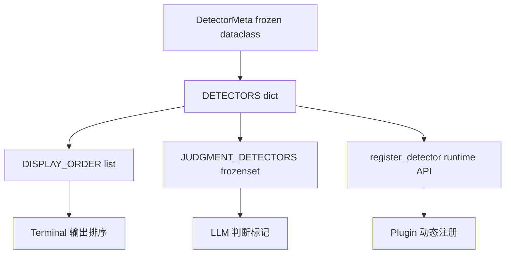
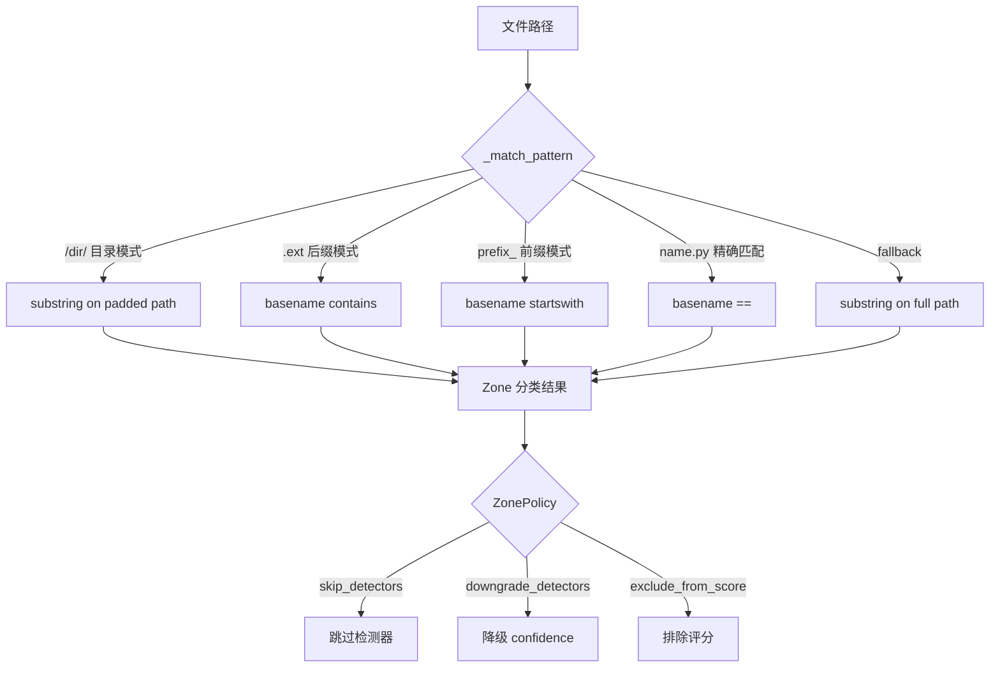
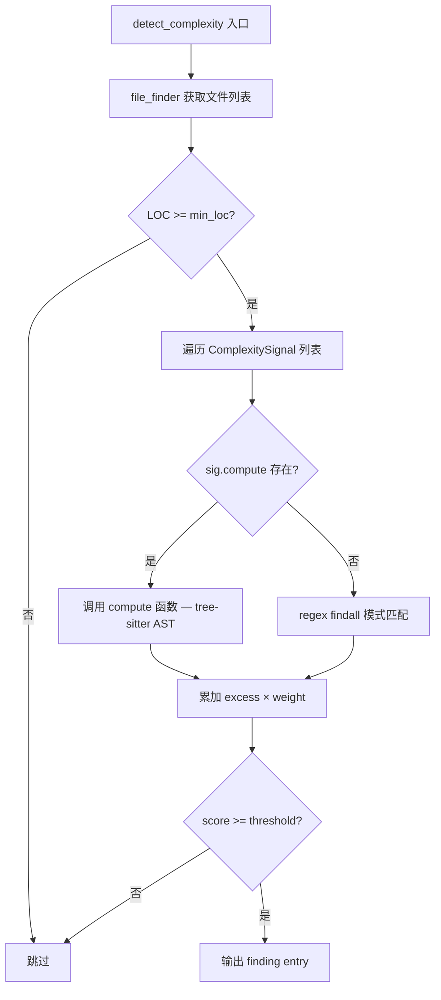

# PD-500.01 Desloppify — tree-sitter 多检测器静态分析引擎

> 文档编号：PD-500.01
> 来源：Desloppify `desloppify/engine/detectors/`, `desloppify/core/registry.py`
> GitHub：https://github.com/peteromallet/desloppify.git
> 问题域：PD-500 静态代码分析 Static Code Analysis
> 状态：可复用方案

---

## 第 1 章 问题与动机

### 1.1 核心问题

静态代码分析工具面临三大工程挑战：

1. **多语言覆盖**：项目常混合 Python/TypeScript/Go/Rust 等多种语言，传统 linter 各管一摊，缺乏统一的检测框架
2. **误报噪声**：测试文件、生成代码、vendor 依赖中的 findings 淹没真正的生产代码问题，开发者疲于甄别
3. **优先级混乱**：所有 findings 平铺展示，开发者无法区分"一键修复的 unused import"和"需要架构判断的 god class 拆分"

Desloppify 的核心洞察是：静态分析不只是"找问题"，更是"分类 + 过滤 + 排优先级"。

### 1.2 Desloppify 的解法概述

1. **29+ 检测器注册表**：`core/registry.py:59` 定义了统一的 `DetectorMeta` 元数据，每个检测器声明 action_type（auto_fix/refactor/reorganize/manual_fix）和 needs_judgment 标志
2. **tree-sitter AST 统一抽象**：`languages/_framework/treesitter/_specs.py` 为 27 种语言定义 S-expression 查询，实现跨语言的函数/类/导入提取
3. **Zone-aware 过滤**：`engine/policy/zones.py:25-33` 将文件分为 6 个 zone（production/test/config/generated/script/vendor），每个 zone 有独立的检测策略
4. **T1-T4 四级分类**：`core/enums.py:41-45` 定义 Tier 枚举（AUTO_FIX → QUICK_FIX → JUDGMENT → MAJOR_REFACTOR），驱动修复优先级
5. **Union-Find 聚类**：`engine/detectors/dupes.py:13-37` 用并查集将 N² 对重复函数聚合为 cluster，避免信息爆炸

### 1.3 设计思想

| 设计原则 | 具体实现 | 理由 | 替代方案 |
|----------|----------|------|----------|
| 单一注册表 | `DetectorMeta` frozen dataclass + `DETECTORS` dict | 所有检测器元数据集中管理，避免散落各处 | 每个检测器自描述（分散，难以全局排序） |
| 语言无关检测器 | `engine/detectors/` 只依赖 `FunctionInfo`/`ClassInfo` | 检测算法与语言解析解耦，新增语言只需写 extractor | 每种语言重写检测逻辑（代码膨胀） |
| Zone 策略矩阵 | `ZonePolicy` 的 skip/downgrade/exclude_from_score | 不同文件类型需要不同检测粒度 | 全局开关（要么全扫要么全跳） |
| 聚类而非配对 | Union-Find 将 duplicate pairs 聚合为 clusters | N 个相似函数只产生 1 条 finding | 输出 N²/2 对（信息过载） |
| 渐进式剪枝 | `real_quick_ratio → quick_ratio → ratio` 三级过滤 | 避免对所有函数对做完整 SequenceMatcher | 暴力 O(N²) 全量比较（性能灾难） |

---

## 第 2 章 源码实现分析

### 2.1 架构概览

Desloppify 的检测引擎采用三层架构：语言层提取 AST 信息，引擎层运行语言无关检测器，策略层过滤和评分。

```
┌─────────────────────────────────────────────────────────────┐
│                    ScanOrchestrator                          │
│  scan_orchestrator.py:25 — generate → merge → noise_snapshot │
└──────────────────────┬──────────────────────────────────────┘
                       │
        ┌──────────────┼──────────────┐
        ▼              ▼              ▼
┌──────────────┐ ┌──────────┐ ┌────────────┐
│ LangRun      │ │ Registry │ │ ZonePolicy │
│ runtime.py   │ │ 29+ dets │ │ 6 zones    │
│ 27 languages │ │ 4 tiers  │ │ skip/down  │
└──────┬───────┘ └────┬─────┘ └─────┬──────┘
       │              │             │
       ▼              ▼             ▼
┌──────────────────────────────────────────┐
│         Language-Agnostic Detectors       │
│  complexity │ dupes │ naming │ graph │ …  │
│  ↑ FunctionInfo/ClassInfo from tree-sitter│
└──────────────────────────────────────────┘
       ▲
       │ S-expression queries
┌──────┴───────────────────────────────────┐
│         tree-sitter Framework             │
│  _specs.py: 27 language specs             │
│  _normalize.py: AST-aware body stripping  │
│  _extractors.py: function/class extraction │
│  _cache.py: scan-scoped parse cache       │
└──────────────────────────────────────────┘
```

### 2.2 核心实现

#### 2.2.1 检测器注册表 — 单一事实源



对应源码 `desloppify/core/registry.py:46-57`：

```python
@dataclass(frozen=True)
class DetectorMeta:
    name: str
    display: str  # Human-readable for terminal display
    dimension: str  # Scoring dimension name
    action_type: str  # "auto_fix" | "refactor" | "reorganize" | "manual_fix"
    guidance: str  # Narrative coaching text
    fixers: tuple[str, ...] = ()
    tool: str = ""  # "move" or empty
    structural: bool = False  # Merges under "structural" in display
    needs_judgment: bool = False  # Findings need LLM design judgment
```

每个检测器通过 `action_type` 声明修复难度，通过 `needs_judgment` 标记是否需要 LLM 辅助决策。`register_detector()` (`registry.py:337`) 支持运行时动态注册，使插件系统可以扩展检测器集合。

#### 2.2.2 Zone 分类与策略过滤



对应源码 `desloppify/engine/policy/zones.py:60-91`：

```python
def _match_pattern(rel_path: str, pattern: str) -> bool:
    basename = os.path.basename(rel_path)
    # Directory pattern: "/dir/" → substring on padded path
    if pattern.startswith("/") and pattern.endswith("/"):
        return pattern in ("/" + rel_path + "/")
    # Suffix/extension pattern: starts with "." → contains on basename
    if pattern.startswith("."):
        return pattern in basename
    # Prefix pattern: ends with "_" → basename starts-with
    if pattern.endswith("_"):
        return basename.startswith(pattern)
    # Suffix pattern: starts with "_" → basename ends-with
    if pattern.startswith("_"):
        return basename.endswith(pattern)
    # Exact basename match
    if "/" not in pattern and "." in pattern:
        ext = pattern.rsplit(".", 1)[-1]
        if ext and len(ext) <= 5 and ext.isalnum():
            return basename == pattern
    # Fallback: substring on full path
    return pattern in rel_path
```

`FileZoneMap` (`zones.py:124-186`) 在扫描开始时一次性构建，缓存所有文件的 zone 分类结果，后续检测器通过 `should_skip_finding()` 和 `filter_entries()` 快速查询。

#### 2.2.3 复杂度信号检测 — 双轨模式



对应源码 `desloppify/engine/detectors/complexity.py:14-90`：

```python
def detect_complexity(
    path: Path, signals, file_finder, threshold: int = 15, min_loc: int = 50
) -> tuple[list[dict], int]:
    files = file_finder(path)
    entries = []
    for filepath in files:
        p = resolve_scan_file(filepath, scan_root=path)
        content = p.read_text()
        lines = content.splitlines()
        loc = len(lines)
        if loc < min_loc:
            continue
        file_signals = []
        score = 0
        for sig in signals:
            if sig.compute:
                # tree-sitter compute 函数，可选接收 _filepath 参数
                accepts_filepath = "_filepath" in inspect.signature(sig.compute).parameters
                if accepts_filepath:
                    result = sig.compute(content, lines, _filepath=filepath)
                else:
                    result = sig.compute(content, lines)
                if result:
                    count, label = result
                    file_signals.append(label)
                    excess = max(0, count - sig.threshold) if sig.threshold else count
                    score += excess * sig.weight
            elif sig.pattern:
                count = len(re.findall(sig.pattern, content, re.MULTILINE))
                if count > sig.threshold:
                    file_signals.append(f"{count} {sig.name}")
                    score += (count - sig.threshold) * sig.weight
```

`ComplexitySignal` (`base.py:44-55`) 支持两种检测模式：`pattern`（正则）和 `compute`（自定义函数，通常基于 tree-sitter AST）。每种语言在自己的 `detectors/complexity.py` 中定义信号列表。

### 2.3 实现细节

#### 重复检测的三级剪枝策略

`dupes.py` 的近似重复检测面临 O(N²) 复杂度挑战。Desloppify 用三级剪枝大幅减少实际比较次数：

1. **LOC 排序 + 1.5x 窗口** (`dupes.py:101-124`)：按函数行数排序，只比较行数差在 1.5 倍以内的函数对
2. **最大可能比率预计算** (`dupes.py:131-139`)：`max_possible = 2*min(len_a, len_b)/(len_a+len_b)`，低于阈值直接跳过
3. **SequenceMatcher 渐进式** (`dupes.py:148-154`)：`real_quick_ratio() → quick_ratio() → ratio()`，每级过滤掉大量候选

#### tree-sitter AST 归一化

`_normalize.py:60-87` 实现了 AST 感知的函数体归一化：

1. 收集函数 AST 节点内所有 comment 节点的字节范围
2. 用空格替换 comment 字节（保持行号不变）
3. 过滤空行和匹配 log 模式的行
4. 输出归一化文本用于 hash 比较和 difflib 相似度计算

这确保了注释和日志语句的差异不会影响重复检测的准确性。

#### 安全检测的五规则扫描器

`security/scanner.py:16-30` 对每行源码执行 5 类安全检查：

- `_secret_format_entries`：硬编码密钥格式（JWT、AWS key 等正则匹配）
- `_secret_name_entries`：变量名含 secret/password/token 且赋值非占位符
- `_insecure_random_entries`：安全上下文中使用非密码学随机数
- `_weak_crypto_entries`：弱加密算法（MD5、SHA1、SSLv3 等）
- `_sensitive_log_entries`：日志中包含敏感数据

每条规则通过 `SecurityRule` dataclass (`security/rules.py:36-43`) 声明 check_id、severity、confidence 和 remediation 建议。

---

## 第 3 章 迁移指南

### 3.1 迁移清单

**阶段 1：基础框架（检测器注册 + Zone 分类）**

- [ ] 定义 `DetectorMeta` dataclass，包含 name/display/dimension/action_type/guidance 字段
- [ ] 创建 `DETECTORS` 注册表 dict，按 action_type 分组
- [ ] 实现 `Zone` 枚举（至少 production/test/vendor 三类）
- [ ] 实现 `ZoneRule` 模式匹配（目录/后缀/前缀/精确匹配）
- [ ] 构建 `FileZoneMap` 缓存，扫描开始时一次性分类

**阶段 2：核心检测器**

- [ ] 实现 `ComplexitySignal` 双轨检测（regex + compute 函数）
- [ ] 实现 `detect_duplicates` 含 Union-Find 聚类
- [ ] 实现 `detect_cycles` 含 Tarjan SCC 算法
- [ ] 实现 `detect_orphaned_files` 含动态导入排除
- [ ] 实现 `detect_naming_inconsistencies` 含多约定分类

**阶段 3：tree-sitter 集成**

- [ ] 定义 `TreeSitterLangSpec` 含 S-expression 查询
- [ ] 实现 `normalize_body` AST 感知归一化
- [ ] 为目标语言编写 function/class/import 查询
- [ ] 实现 parse cache 避免重复解析

### 3.2 适配代码模板

#### 最小可用检测器注册表

```python
from __future__ import annotations
from dataclasses import dataclass

@dataclass(frozen=True)
class DetectorMeta:
    name: str
    display: str
    action_type: str  # "auto_fix" | "refactor" | "reorganize" | "manual_fix"
    guidance: str
    needs_judgment: bool = False

DETECTORS: dict[str, DetectorMeta] = {}
_DISPLAY_ORDER: list[str] = []

def register_detector(meta: DetectorMeta) -> None:
    """运行时注册检测器，支持插件扩展。"""
    DETECTORS[meta.name] = meta
    if meta.name not in _DISPLAY_ORDER:
        _DISPLAY_ORDER.append(meta.name)

# 注册内置检测器
register_detector(DetectorMeta("unused", "unused", "auto_fix", "remove unused imports"))
register_detector(DetectorMeta("complexity", "complexity", "refactor", "decompose complex files", needs_judgment=True))
register_detector(DetectorMeta("dupes", "dupes", "refactor", "extract shared utility", needs_judgment=True))
```

#### 最小可用 Zone 分类器

```python
from enum import Enum
from dataclasses import dataclass

class Zone(str, Enum):
    PRODUCTION = "production"
    TEST = "test"
    VENDOR = "vendor"

EXCLUDED_ZONES = {Zone.TEST, Zone.VENDOR}

@dataclass
class ZoneRule:
    zone: Zone
    patterns: list[str]

DEFAULT_RULES = [
    ZoneRule(Zone.VENDOR, ["/vendor/", "/node_modules/", "/third_party/"]),
    ZoneRule(Zone.TEST, ["/tests/", "/test/", ".test.", ".spec.", "_test.py"]),
]

def classify_file(rel_path: str, rules: list[ZoneRule]) -> Zone:
    """首条匹配规则获胜。"""
    import os
    basename = os.path.basename(rel_path)
    for rule in rules:
        for pattern in rule.patterns:
            if pattern.startswith("/") and pattern.endswith("/"):
                if pattern in ("/" + rel_path + "/"):
                    return rule.zone
            elif pattern.startswith("."):
                if pattern in basename:
                    return rule.zone
            elif pattern in rel_path:
                return rule.zone
    return Zone.PRODUCTION
```

#### 最小可用 Union-Find 重复聚类

```python
def build_clusters(pairs: list[tuple[int, int, float]], n: int) -> list[list[int]]:
    """Union-Find 聚类：将 pairwise matches 聚合为 clusters。"""
    parent = list(range(n))

    def find(x):
        while parent[x] != x:
            parent[x] = parent[parent[x]]  # 路径压缩
            x = parent[x]
        return x

    def union(a, b):
        ra, rb = find(a), find(b)
        if ra != rb:
            parent[ra] = rb

    for i, j, _ in pairs:
        union(i, j)

    clusters: dict[int, list[int]] = {}
    for i in range(n):
        r = find(i)
        clusters.setdefault(r, []).append(i)
    return [c for c in clusters.values() if len(c) >= 2]
```

### 3.3 适用场景

| 场景 | 适用度 | 说明 |
|------|--------|------|
| 多语言 monorepo 代码质量扫描 | ⭐⭐⭐ | tree-sitter 27 语言覆盖 + Zone 过滤是核心优势 |
| CI/CD 集成的增量检测 | ⭐⭐⭐ | Tier 分类天然适合 gate 策略（T1 阻断，T3/T4 建议） |
| 单语言小项目 lint | ⭐⭐ | 架构偏重，不如专用 linter（ESLint/Ruff）轻量 |
| 安全审计 | ⭐⭐ | 安全检测器覆盖基础场景，但不替代 Semgrep/CodeQL |
| 技术债务量化 | ⭐⭐⭐ | 评分系统 + Zone 排除 + Tier 分类提供可量化指标 |

---

## 第 4 章 测试用例

```python
import pytest
from dataclasses import dataclass
from pathlib import Path
from unittest.mock import MagicMock


# ── 测试 Zone 分类 ──────────────────────────────────────────

class TestZoneClassification:
    """基于 zones.py:60-91 的 _match_pattern 逻辑。"""

    def test_directory_pattern_matches(self):
        """"/tests/" 模式匹配包含该目录的路径。"""
        from desloppify.engine.policy.zones import _match_pattern
        assert _match_pattern("src/tests/test_foo.py", "/tests/") is True
        assert _match_pattern("src/main.py", "/tests/") is False

    def test_suffix_pattern_matches(self):
        """.test. 模式匹配 basename 中包含该后缀的文件。"""
        from desloppify.engine.policy.zones import _match_pattern
        assert _match_pattern("src/foo.test.ts", ".test.") is True
        assert _match_pattern("src/foo.ts", ".test.") is False

    def test_prefix_pattern_matches(self):
        """test_ 前缀模式匹配 basename 以此开头的文件。"""
        from desloppify.engine.policy.zones import _match_pattern
        assert _match_pattern("src/test_foo.py", "test_") is True
        assert _match_pattern("src/foo_test.py", "test_") is False

    def test_exact_basename_match(self):
        """conftest.py 精确匹配 basename。"""
        from desloppify.engine.policy.zones import _match_pattern
        assert _match_pattern("tests/conftest.py", "conftest.py") is True
        assert _match_pattern("tests/my_conftest.py", "conftest.py") is False

    def test_zone_policy_skips_detectors(self):
        """VENDOR zone 跳过所有检测器。"""
        from desloppify.engine.policy.zones import Zone, ZONE_POLICIES
        vendor_policy = ZONE_POLICIES[Zone.VENDOR]
        assert len(vendor_policy.skip_detectors) > 0
        assert vendor_policy.exclude_from_score is True


# ── 测试 Union-Find 聚类 ────────────────────────────────────

class TestDuplicateClustering:
    """基于 dupes.py:13-37 的 _build_clusters 逻辑。"""

    def test_exact_duplicates_form_cluster(self):
        from desloppify.engine.detectors.dupes import _build_clusters
        pairs = [(0, 1, 1.0, "exact"), (1, 2, 1.0, "exact")]
        clusters = _build_clusters(pairs, 3)
        assert len(clusters) == 1
        assert sorted(clusters[0]) == [0, 1, 2]

    def test_disjoint_pairs_form_separate_clusters(self):
        from desloppify.engine.detectors.dupes import _build_clusters
        pairs = [(0, 1, 0.95, "near"), (2, 3, 0.92, "near")]
        clusters = _build_clusters(pairs, 4)
        assert len(clusters) == 2

    def test_no_pairs_no_clusters(self):
        from desloppify.engine.detectors.dupes import _build_clusters
        clusters = _build_clusters([], 5)
        assert clusters == []


# ── 测试 Tier 枚举 ──────────────────────────────────────────

class TestTierClassification:
    """基于 enums.py:41-45 的 Tier 定义。"""

    def test_tier_ordering(self):
        from desloppify.core.enums import Tier
        assert Tier.AUTO_FIX < Tier.QUICK_FIX < Tier.JUDGMENT < Tier.MAJOR_REFACTOR

    def test_tier_values(self):
        from desloppify.core.enums import Tier
        assert Tier.AUTO_FIX == 1
        assert Tier.MAJOR_REFACTOR == 4


# ── 测试 God Class 检测 ─────────────────────────────────────

class TestGodClassDetection:
    """基于 gods.py:4-25 的 detect_gods 逻辑。"""

    def test_god_class_needs_min_reasons(self):
        from desloppify.engine.detectors.gods import detect_gods
        from desloppify.engine.detectors.base import ClassInfo, GodRule

        cls = ClassInfo(name="BigClass", file="big.py", line=1, loc=500,
                        methods=[], metrics={"method_count": 30, "loc": 500})
        rules = [
            GodRule("methods", ">20 methods", lambda c: c.metrics.get("method_count", 0), 20),
            GodRule("loc", ">300 LOC", lambda c: c.loc, 300),
        ]
        entries, total = detect_gods([cls], rules, min_reasons=2)
        assert len(entries) == 1
        assert entries[0]["name"] == "BigClass"

    def test_below_threshold_not_flagged(self):
        from desloppify.engine.detectors.gods import detect_gods
        from desloppify.engine.detectors.base import ClassInfo, GodRule

        cls = ClassInfo(name="SmallClass", file="small.py", line=1, loc=50, methods=[])
        rules = [
            GodRule("methods", ">20 methods", lambda c: len(c.methods), 20),
            GodRule("loc", ">300 LOC", lambda c: c.loc, 300),
        ]
        entries, total = detect_gods([cls], rules, min_reasons=2)
        assert len(entries) == 0
```

---

## 第 5 章 跨域关联

| 关联域 | 关系类型 | 说明 |
|--------|----------|------|
| PD-04 工具系统 | 协同 | 检测器注册表模式（`DetectorMeta` + `register_detector`）与工具注册模式高度相似，都是 frozen dataclass + dict + 运行时扩展 |
| PD-07 质量检查 | 依赖 | 静态分析是质量检查的前置步骤；Desloppify 的 `review` 和 `subjective_review` 检测器直接对接 LLM 质量评估 |
| PD-10 中间件管道 | 协同 | Zone 策略过滤（skip/downgrade/exclude）本质上是检测管道的中间件层，可与 PD-10 的管道模式互补 |
| PD-11 可观测性 | 协同 | 检测器的 `dimension` 字段和评分系统为可观测性提供结构化指标数据 |
| PD-01 上下文管理 | 互补 | tree-sitter AST 解析提供精确的代码结构信息，可作为上下文压缩的输入（只保留函数签名而非全文） |

---

## 第 6 章 来源文件索引

| 文件 | 行范围 | 关键实现 |
|------|--------|----------|
| `desloppify/core/registry.py` | L46-57 | `DetectorMeta` frozen dataclass 定义 |
| `desloppify/core/registry.py` | L59-321 | `DETECTORS` 注册表（29+ 检测器元数据） |
| `desloppify/core/registry.py` | L337-347 | `register_detector()` 运行时注册 API |
| `desloppify/core/enums.py` | L41-45 | `Tier` 四级枚举（AUTO_FIX → MAJOR_REFACTOR） |
| `desloppify/engine/policy/zones.py` | L25-33 | `Zone` 六类枚举 |
| `desloppify/engine/policy/zones.py` | L44-57 | `ZoneRule` 模式匹配规则 |
| `desloppify/engine/policy/zones.py` | L60-91 | `_match_pattern()` 五种模式匹配策略 |
| `desloppify/engine/policy/zones.py` | L104-121 | `classify_file()` 首条匹配获胜 |
| `desloppify/engine/policy/zones.py` | L124-186 | `FileZoneMap` 缓存分类器 |
| `desloppify/engine/policy/zones.py` | L192-229 | `ZonePolicy` 策略矩阵 |
| `desloppify/engine/detectors/base.py` | L10-22 | `FunctionInfo` 跨语言函数信息 |
| `desloppify/engine/detectors/base.py` | L26-40 | `ClassInfo` 跨语言类信息 |
| `desloppify/engine/detectors/base.py` | L44-55 | `ComplexitySignal` 双轨信号定义 |
| `desloppify/engine/detectors/base.py` | L58-69 | `GodRule` 规则定义 |
| `desloppify/engine/detectors/complexity.py` | L14-90 | `detect_complexity()` 双轨检测主函数 |
| `desloppify/engine/detectors/dupes.py` | L13-37 | `_build_clusters()` Union-Find 聚类 |
| `desloppify/engine/detectors/dupes.py` | L68-89 | `_collect_exact_duplicate_pairs()` 精确匹配 |
| `desloppify/engine/detectors/dupes.py` | L92-177 | `_collect_near_duplicate_pairs()` 三级剪枝近似匹配 |
| `desloppify/engine/detectors/dupes.py` | L234-266 | `detect_duplicates()` 主入口 |
| `desloppify/engine/detectors/graph.py` | L57-137 | `detect_cycles()` 迭代式 Tarjan SCC |
| `desloppify/engine/detectors/naming.py` | L9-25 | `_classify_convention()` 五种命名约定分类 |
| `desloppify/engine/detectors/naming.py` | L28-86 | `detect_naming_inconsistencies()` 少数派检测 |
| `desloppify/engine/detectors/orphaned.py` | L47-100 | `detect_orphaned_files()` 零导入文件检测 |
| `desloppify/engine/detectors/gods.py` | L4-25 | `detect_gods()` 规则驱动 god class 检测 |
| `desloppify/engine/detectors/security/detector.py` | L17-60 | `detect_security_issues()` 跨语言安全扫描入口 |
| `desloppify/engine/detectors/security/scanner.py` | L16-30 | `_scan_line_for_security_entries()` 五规则行扫描 |
| `desloppify/engine/detectors/security/rules.py` | L36-43 | `SecurityRule` 规则元数据 |
| `desloppify/languages/_framework/treesitter/_specs.py` | L38-767 | 27 种语言的 `TreeSitterLangSpec` 定义 |
| `desloppify/languages/_framework/treesitter/_normalize.py` | L60-87 | `normalize_body()` AST 感知归一化 |
| `desloppify/app/commands/scan/scan_orchestrator.py` | L25-75 | `ScanOrchestrator` 扫描生命周期编排 |

---

## 第 7 章 横向对比维度

```json comparison_data
{
  "project": "Desloppify",
  "dimensions": {
    "检测器架构": "29+ 检测器统一注册表，frozen dataclass 元数据 + 运行时插件扩展",
    "AST 解析": "tree-sitter 27 语言 S-expression 查询，scan-scoped parse cache",
    "误报过滤": "6-zone 策略矩阵（skip/downgrade/exclude_from_score），首条规则匹配",
    "优先级分类": "T1-T4 四级 Tier + action_type 四类修复难度 + needs_judgment LLM 标记",
    "重复检测": "Union-Find 聚类 + SequenceMatcher 三级剪枝（LOC 窗口/最大比率/渐进式）",
    "安全检测": "五规则行扫描器（secret format/name/random/crypto/log），SecurityRule dataclass"
  }
}
```

### 域元数据补充

```json domain_metadata
{
  "solution_summary": "Desloppify 用 tree-sitter 27 语言 AST 提取 + 29 检测器统一注册表 + 6-zone 策略矩阵实现跨语言静态分析，按 T1-T4 四级分类 findings 并用 Union-Find 聚类重复函数",
  "description": "跨语言 AST 统一抽象与 zone 策略驱动的检测器编排框架",
  "sub_problems": [
    "God class/component detection via multi-rule threshold",
    "Orphaned file detection with dynamic import awareness",
    "Cross-language security pattern scanning",
    "Single-use abstraction inlining candidates",
    "Architectural coupling and boundary violation detection"
  ],
  "best_practices": [
    "Union-Find clustering to reduce N² duplicate pairs to cluster-level findings",
    "Three-level pruning (LOC window + max ratio + progressive SequenceMatcher) for near-duplicate detection",
    "Frozen dataclass detector registry with runtime plugin extension",
    "AST-aware body normalization stripping comments and logs before hash comparison",
    "Five-pattern zone rule matching (directory/suffix/prefix/exact/substring)"
  ]
}
```
