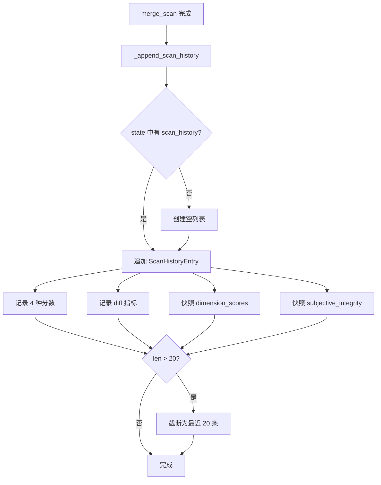
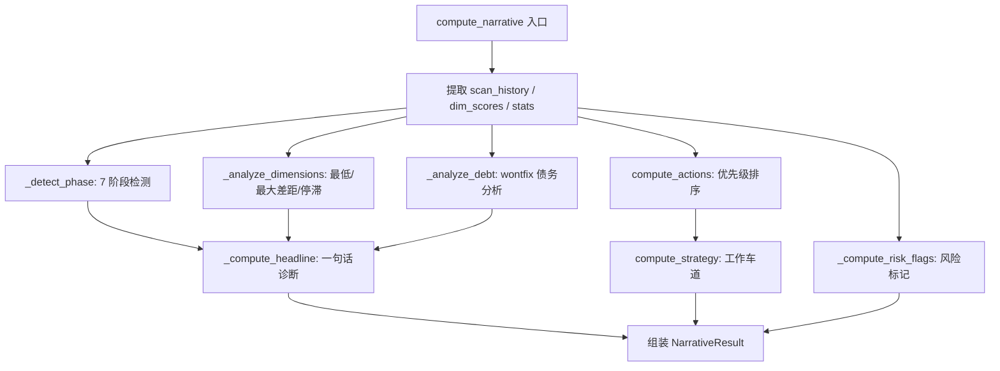
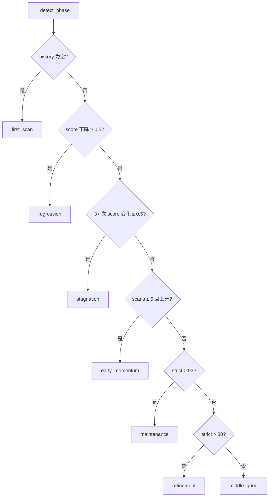

# PD-11.500 Desloppify — 多维度代码健康可观测性与叙事诊断系统

> 文档编号：PD-11.500
> 来源：Desloppify `desloppify/intelligence/narrative/core.py`, `desloppify/engine/_state/schema.py`, `desloppify/app/output/scorecard.py`
> GitHub：https://github.com/peteromallet/desloppify.git
> 问题域：PD-11 可观测性 Observability & Cost Tracking
> 状态：可复用方案

---

## 第 1 章 问题与动机

### 1.1 核心问题

代码质量的可观测性面临三个层次的挑战：

1. **指标碎片化**：静态分析工具输出大量 findings，但缺乏按维度聚合的全局视图。开发者看到 200 个 lint 警告，却不知道哪个维度（安全、重复、测试覆盖）最需要关注。
2. **趋势不可见**：单次扫描只是快照，无法回答"代码质量在变好还是变差"。没有 scan_history 就无法检测回归、停滞或突破。
3. **行动不可导**：即使有了指标和趋势，开发者仍然需要"下一步做什么"的具体指引。传统工具只报告问题，不提供优先级排序和行动建议。

Desloppify 的可观测性系统不是传统的 APM/日志追踪，而是面向**代码健康**的结构化诊断：将静态分析结果转化为多维度评分、时间序列趋势、阶段检测、风险标记和可执行的行动建议。

### 1.2 Desloppify 的解法概述

1. **四层评分体系**：overall/objective/strict/verified_strict 四种评分模式，从宽松到严格逐层递进，每层都按维度（File health、Code quality、Security 等）分解 (`schema.py:150-153`)
2. **scan_history 时间序列**：每次扫描追加一条 `ScanHistoryEntry`，记录 4 种分数 + diff 指标 + 维度快照，滚动保留最近 20 条 (`merge_history.py:87-131`)
3. **Narrative 叙事引擎**：`compute_narrative()` 从 state 数据计算结构化诊断——phase/headline/risk_flags/actions/strategy，输出 `NarrativeResult` TypedDict (`core.py:315-391`)
4. **Scorecard 可视化徽章**：PIL 渲染 PNG 图片，左侧显示总分，右侧显示维度表格，2x 缩放适配 Retina 屏幕 (`scorecard.py:43-126`)
5. **反作弊完整性检查**：`SubjectiveIntegrity` 检测主观评分是否聚集在目标分数附近，防止 gaming (`schema.py:115-122`)

### 1.3 设计思想

| 设计原则 | 具体实现 | 理由 | 替代方案 |
|----------|----------|------|----------|
| 四模式评分分离 | overall/objective/strict/verified_strict | 不同场景需要不同严格度：CI 用 strict，日常用 overall | 单一评分（丢失 wontfix 债务信息） |
| 滚动窗口历史 | scan_history 保留最近 20 条 | 足够检测趋势，不会无限膨胀 | 全量保留（state.json 膨胀） |
| 叙事而非数据 | NarrativeResult 输出 phase/headline/why_now | 开发者需要"故事"而非原始数字 | 纯 JSON 指标（需人工解读） |
| 维度级粒度 | dimension_scores 按 File health/Security 等分解 | 定位具体改进方向 | 仅总分（无法定位瓶颈） |
| 反作弊机制 | SubjectiveIntegrity 检测分数聚集 | 主观评分容易被 gaming | 无校验（分数失真） |

---

## 第 2 章 源码实现分析

### 2.1 架构概览

Desloppify 的可观测性系统由四个核心模块组成：

```
┌─────────────────────────────────────────────────────────────────┐
│                        State Layer                              │
│  StateModel (schema.py)                                         │
│  ├── findings: dict[str, Finding]     # 所有发现                │
│  ├── dimension_scores: dict           # 维度评分                │
│  ├── scan_history: list[ScanHistoryEntry]  # 时间序列           │
│  ├── stats: StateStats                # 聚合统计                │
│  └── subjective_integrity: SubjectiveIntegrity  # 反作弊        │
├─────────────────────────────────────────────────────────────────┤
│                     Scoring Layer                                │
│  _update_objective_health() → compute_dimension_scores_by_mode()│
│  ├── 30+ detectors → N dimensions                               │
│  ├── 3 scoring modes: lenient / strict / verified_strict        │
│  └── tier weights: T1=5, T2=4, T3=2, T4=1                      │
├─────────────────────────────────────────────────────────────────┤
│                    Narrative Layer                                │
│  compute_narrative(state) → NarrativeResult                      │
│  ├── _detect_phase()      → 7 phases                            │
│  ├── _compute_headline()  → one-liner                           │
│  ├── _analyze_dimensions()→ lowest/gap/stagnant                 │
│  ├── compute_actions()    → prioritized fix list                │
│  ├── _compute_risk_flags()→ severity-ordered warnings           │
│  └── compute_strategy()   → work lanes + fixer leverage         │
├─────────────────────────────────────────────────────────────────┤
│                   Visualization Layer                             │
│  generate_scorecard(state) → PNG badge                           │
│  ├── Left panel: title + score + project name                   │
│  ├── Right panel: 2-column dimension table                      │
│  └── Theme: warm palette + 2x retina scale                      │
└─────────────────────────────────────────────────────────────────┘
```

### 2.2 核心实现

#### 2.2.1 scan_history 时间序列记录



对应源码 `desloppify/engine/_state/merge_history.py:87-131`：

```python
def _append_scan_history(
    state: StateModel,
    *,
    now: str,
    lang: str | None,
    new_count: int,
    auto_resolved: int,
    ignored_count: int,
    raw_findings: int,
    suppressed_pct: float,
    ignore_pattern_count: int,
) -> None:
    history = state.setdefault("scan_history", [])
    history.append(
        {
            "timestamp": now,
            "lang": lang,
            "strict_score": state.get("strict_score"),
            "verified_strict_score": state.get("verified_strict_score"),
            "objective_score": state.get("objective_score"),
            "overall_score": state.get("overall_score"),
            "open": state["stats"]["open"],
            "diff_new": new_count,
            "diff_resolved": auto_resolved,
            "ignored": ignored_count,
            "raw_findings": raw_findings,
            "suppressed_pct": suppressed_pct,
            "ignore_patterns": ignore_pattern_count,
            "subjective_integrity": _subjective_integrity_snapshot(
                state.get("subjective_integrity")
            ),
            "score_confidence": _score_confidence_snapshot(
                state.get("score_confidence")
            ),
            "dimension_scores": {
                name: {"score": ds["score"], "strict": ds.get("strict", ds["score"])}
                for name, ds in state.get("dimension_scores", {}).items()
            }
            if state.get("dimension_scores")
            else None,
        }
    )
    if len(history) > 20:
        state["scan_history"] = history[-20:]
```

关键设计：每条 `ScanHistoryEntry` 同时记录 4 种分数（strict/verified_strict/objective/overall）和维度级快照，使得趋势分析可以在维度粒度上进行。滚动窗口 20 条防止 state.json 膨胀。

#### 2.2.2 Narrative 叙事引擎



对应源码 `desloppify/intelligence/narrative/core.py:315-391`：

```python
def compute_narrative(
    state: StateModel,
    context: NarrativeContext | None = None,
) -> NarrativeResult:
    """Compute structured narrative context from state data."""
    resolved_context = context or NarrativeContext()
    diff = resolved_context.diff
    lang = resolved_context.lang
    config = resolved_context.config
    plan = resolved_context.plan

    raw_history = state.get("scan_history", [])
    history = _history_for_lang(raw_history, lang)
    dim_scores = state.get("dimension_scores", {})
    strict_score, overall_score = _score_snapshot(state)
    findings = _scoped_findings(state)

    by_detector = _count_open_by_detector(findings)
    phase = _detect_phase(history, strict_score)
    dimensions = _analyze_dimensions(dim_scores, history, state)
    debt = _analyze_debt(dim_scores, findings, history)
    milestone = _detect_milestone(state, None, history)
    actions = [dict(action) for action in compute_actions(action_context)]
    strategy = compute_strategy(findings, by_detector, actions, phase, lang)
    risk_flags = _compute_risk_flags(state, debt)
    headline = _compute_headline(phase, dimensions, debt, milestone, ...)

    return {
        "phase": phase,
        "headline": headline,
        "dimensions": dimensions,
        "actions": actions,
        "strategy": strategy,
        "risk_flags": risk_flags,
        "strict_target": strict_target,
        ...
    }
```

#### 2.2.3 Phase 阶段检测



对应源码 `desloppify/intelligence/narrative/phase.py:10-50`：

```python
def _detect_phase(history: list[dict], strict_score: float | None) -> str:
    if not history:
        return "first_scan"
    if len(history) == 1:
        return "first_scan"
    # Check regression: strict dropped from previous scan
    prev = _history_strict(history[-2])
    curr = _history_strict(history[-1])
    if prev is not None and curr is not None and curr < prev - 0.5:
        return "regression"
    # Check stagnation: strict unchanged ±0.5 for 3+ scans
    if len(history) >= 3:
        recent = [_history_strict(h) for h in history[-3:]]
        if all(r is not None for r in recent):
            spread = max(recent) - min(recent)
            if spread <= 0.5:
                return "stagnation"
    # Early momentum: scans 2-5 with score rising
    if len(history) <= 5:
        first = _history_strict(history[0])
        last = _history_strict(history[-1])
        if first is not None and last is not None and last > first:
            return "early_momentum"
    if strict_score is not None:
        if strict_score > 93:
            return "maintenance"
        if strict_score > 80:
            return "refinement"
    return "middle_grind"
```

### 2.3 实现细节

**DimensionScore 数据结构** (`schema.py:87-93`)：每个维度包含 score（宽松）、strict（严格）、checks（检查数）、issues（问题数）、tier（优先级层）、detectors（检测器详情）。这种结构使得维度级分析可以同时展示宽松和严格视角。

**Risk Flags 风险标记** (`core.py:245-286`)：从两个信号源生成风险标记——ignore suppression（忽略模式隐藏了过多 findings）和 wontfix gap（宽松/严格分数差距过大）。标记按 severity 排序（critical > high > medium > low > info），确保最严重的问题最先展示。

**Scorecard 可视化** (`scorecard.py:43-126`)：使用 PIL 延迟导入（`importlib.import_module("PIL.Image")`），避免在不需要图片生成时加载重依赖。渲染采用 2x 缩放（`SCALE = 2`），输出 landscape 布局的 PNG，左侧面板显示总分和项目名，右侧面板显示 2 列维度表格。颜色编码：deep sage (≥90)、olive green (70-90)、yellow-green (<70)。

**Headline 生成** (`headline.py:8-157`)：根据 phase 生成不同风格的一句话诊断。regression 阶段安抚开发者（"this is normal after structural changes"），stagnation 阶段指出突破方向，maintenance 阶段提醒关注回归。安全 findings 始终作为前缀优先展示。

---

## 第 3 章 迁移指南

### 3.1 迁移清单

**阶段 1：状态模型与评分基础**
- [ ] 定义 `Finding` TypedDict（id/detector/file/tier/confidence/summary/status）
- [ ] 定义 `DimensionScore` TypedDict（score/strict/checks/issues/tier/detectors）
- [ ] 定义 `ScanHistoryEntry` TypedDict（timestamp/scores/diff metrics/dimension snapshot）
- [ ] 实现 `StateModel` 中心状态结构，包含 findings/dimension_scores/scan_history/stats
- [ ] 实现 `empty_state()` 和 `ensure_state_defaults()` 防御性初始化

**阶段 2：维度评分引擎**
- [ ] 定义 detector → dimension 映射策略（30+ detectors → N dimensions）
- [ ] 实现三模式评分：lenient（wontfix 不扣分）、strict（wontfix 扣分）、verified_strict（仅计入扫描验证的修复）
- [ ] 实现 tier 加权聚合（T1=5, T2=4, T3=2, T4=1）
- [ ] 实现 `compute_score_impact()` 估算修复某个 detector 的分数提升

**阶段 3：scan_history 时间序列**
- [ ] 在每次扫描后调用 `_append_scan_history()` 追加记录
- [ ] 实现滚动窗口截断（保留最近 N 条，推荐 20）
- [ ] 记录维度级快照（每个维度的 score + strict）

**阶段 4：Narrative 叙事引擎**
- [ ] 实现 `_detect_phase()` 阶段检测（7 阶段）
- [ ] 实现 `_compute_headline()` 一句话诊断
- [ ] 实现 `_analyze_dimensions()` 维度分析（最低/最大差距/停滞）
- [ ] 实现 `_compute_risk_flags()` 风险标记
- [ ] 实现 `compute_actions()` 行动优先级排序

**阶段 5：可视化输出**
- [ ] 实现 scorecard PNG 生成（PIL/Pillow）
- [ ] 实现 badge 路径配置（CLI args → config → env → default）

### 3.2 适配代码模板

以下是一个可直接运行的简化版维度评分 + 阶段检测系统：

```python
"""Minimal dimension scoring + phase detection system."""
from __future__ import annotations
from dataclasses import dataclass, field
from typing import TypedDict, Literal
from datetime import datetime, UTC

# --- State Types ---

class DimensionScore(TypedDict, total=False):
    score: float      # lenient score (wontfix not penalized)
    strict: float     # strict score (wontfix penalized)
    checks: int
    issues: int
    tier: int          # 1=critical, 2=high, 3=medium, 4=low

class ScanHistoryEntry(TypedDict, total=False):
    timestamp: str
    strict_score: float | None
    overall_score: float | None
    open: int
    diff_new: int
    diff_resolved: int
    dimension_scores: dict[str, dict[str, float]] | None

TIER_WEIGHTS = {1: 5, 2: 4, 3: 2, 4: 1}

def compute_aggregate_score(
    dim_scores: dict[str, DimensionScore],
    mode: Literal["lenient", "strict"] = "strict",
) -> float:
    """Weighted aggregate of dimension scores."""
    w_sum, w_total = 0.0, 0.0
    for ds in dim_scores.values():
        tier = ds.get("tier", 3)
        w = TIER_WEIGHTS.get(tier, 2)
        score = ds.get("strict" if mode == "strict" else "score", 0.0)
        w_sum += score * w
        w_total += w
    return round(w_sum / w_total, 1) if w_total > 0 else 0.0

# --- Phase Detection ---

def detect_phase(history: list[ScanHistoryEntry], strict_score: float | None) -> str:
    """Detect project health phase from scan history trajectory."""
    if len(history) <= 1:
        return "first_scan"
    prev = history[-2].get("strict_score")
    curr = history[-1].get("strict_score")
    if prev is not None and curr is not None and curr < prev - 0.5:
        return "regression"
    if len(history) >= 3:
        recent = [h.get("strict_score") for h in history[-3:]]
        if all(r is not None for r in recent):
            if max(recent) - min(recent) <= 0.5:
                return "stagnation"
    if len(history) <= 5:
        first = history[0].get("strict_score")
        last = history[-1].get("strict_score")
        if first is not None and last is not None and last > first:
            return "early_momentum"
    if strict_score is not None:
        if strict_score > 93:
            return "maintenance"
        if strict_score > 80:
            return "refinement"
    return "middle_grind"

# --- Scan History ---

def append_scan_history(
    history: list[ScanHistoryEntry],
    dim_scores: dict[str, DimensionScore],
    stats: dict,
    new_count: int = 0,
    resolved_count: int = 0,
    max_entries: int = 20,
) -> None:
    """Append a scan history entry with dimension snapshot."""
    strict = compute_aggregate_score(dim_scores, "strict")
    overall = compute_aggregate_score(dim_scores, "lenient")
    history.append({
        "timestamp": datetime.now(UTC).isoformat(timespec="seconds"),
        "strict_score": strict,
        "overall_score": overall,
        "open": stats.get("open", 0),
        "diff_new": new_count,
        "diff_resolved": resolved_count,
        "dimension_scores": {
            name: {"score": ds["score"], "strict": ds.get("strict", ds["score"])}
            for name, ds in dim_scores.items()
        },
    })
    if len(history) > max_entries:
        del history[:-max_entries]
```

### 3.3 适用场景

| 场景 | 适用度 | 说明 |
|------|--------|------|
| 代码质量 CI 门控 | ⭐⭐⭐ | strict_score 作为 CI 阈值，scan_history 追踪趋势 |
| Agent 输出质量监控 | ⭐⭐⭐ | 将 findings 替换为 Agent 输出的质量检查项 |
| 技术债务管理 | ⭐⭐⭐ | wontfix 债务分析 + 维度级停滞检测 |
| 团队代码健康仪表盘 | ⭐⭐ | scorecard PNG 可嵌入 README/Slack |
| LLM 调用成本追踪 | ⭐ | 需要将 dimension 替换为 cost 维度，架构可复用但语义不同 |

---

## 第 4 章 测试用例

```python
"""Tests for dimension scoring, phase detection, and scan history."""
import pytest
from datetime import datetime, UTC


# --- Test DimensionScore aggregation ---

class TestAggregateScore:
    def test_single_dimension(self):
        dim_scores = {
            "file_health": {"score": 85.0, "strict": 80.0, "checks": 10, "issues": 2, "tier": 1}
        }
        assert compute_aggregate_score(dim_scores, "strict") == 80.0
        assert compute_aggregate_score(dim_scores, "lenient") == 85.0

    def test_tier_weighting(self):
        dim_scores = {
            "security": {"score": 100.0, "strict": 100.0, "tier": 1},  # weight 5
            "duplication": {"score": 50.0, "strict": 50.0, "tier": 3},  # weight 2
        }
        # (100*5 + 50*2) / (5+2) = 600/7 ≈ 85.7
        result = compute_aggregate_score(dim_scores, "strict")
        assert 85.5 <= result <= 86.0

    def test_empty_dimensions(self):
        assert compute_aggregate_score({}, "strict") == 0.0

    def test_wontfix_gap(self):
        """Lenient and strict should differ when wontfix findings exist."""
        dim_scores = {
            "code_quality": {"score": 90.0, "strict": 75.0, "tier": 2}
        }
        assert compute_aggregate_score(dim_scores, "lenient") == 90.0
        assert compute_aggregate_score(dim_scores, "strict") == 75.0


# --- Test Phase Detection ---

class TestPhaseDetection:
    def test_first_scan(self):
        assert detect_phase([], None) == "first_scan"
        assert detect_phase([{"strict_score": 50.0}], 50.0) == "first_scan"

    def test_regression(self):
        history = [
            {"strict_score": 85.0},
            {"strict_score": 83.0},  # dropped > 0.5
        ]
        assert detect_phase(history, 83.0) == "regression"

    def test_stagnation(self):
        history = [
            {"strict_score": 75.0},
            {"strict_score": 75.2},
            {"strict_score": 75.1},
        ]
        assert detect_phase(history, 75.1) == "stagnation"

    def test_early_momentum(self):
        history = [
            {"strict_score": 60.0},
            {"strict_score": 65.0},
            {"strict_score": 70.0},
        ]
        assert detect_phase(history, 70.0) == "early_momentum"

    def test_maintenance(self):
        history = [
            {"strict_score": 80.0},
            {"strict_score": 85.0},
            {"strict_score": 90.0},
            {"strict_score": 93.0},
            {"strict_score": 94.0},
            {"strict_score": 95.0},
        ]
        assert detect_phase(history, 95.0) == "maintenance"

    def test_middle_grind(self):
        history = [
            {"strict_score": 60.0},
            {"strict_score": 62.0},
            {"strict_score": 63.0},
            {"strict_score": 64.0},
            {"strict_score": 65.0},
            {"strict_score": 66.0},
        ]
        assert detect_phase(history, 66.0) == "middle_grind"


# --- Test Scan History ---

class TestScanHistory:
    def test_append_and_truncate(self):
        history = []
        dim_scores = {"file_health": {"score": 80.0, "strict": 75.0, "tier": 1}}
        for i in range(25):
            append_scan_history(history, dim_scores, {"open": 10 - i})
        assert len(history) == 20  # truncated to max_entries

    def test_dimension_snapshot(self):
        history = []
        dim_scores = {
            "security": {"score": 100.0, "strict": 95.0, "tier": 1},
            "duplication": {"score": 70.0, "strict": 60.0, "tier": 3},
        }
        append_scan_history(history, dim_scores, {"open": 5})
        entry = history[0]
        assert entry["dimension_scores"]["security"]["score"] == 100.0
        assert entry["dimension_scores"]["security"]["strict"] == 95.0

    def test_scores_recorded(self):
        history = []
        dim_scores = {"code_quality": {"score": 88.0, "strict": 82.0, "tier": 2}}
        append_scan_history(history, dim_scores, {"open": 3}, new_count=2, resolved_count=1)
        entry = history[0]
        assert entry["strict_score"] == 82.0
        assert entry["diff_new"] == 2
        assert entry["diff_resolved"] == 1
```

---

## 第 5 章 跨域关联

| 关联域 | 关系类型 | 说明 |
|--------|----------|------|
| PD-07 质量检查 | 强协同 | Desloppify 的 30+ detectors 是质量检查的具体实现，dimension_scores 是检查结果的聚合视图。Narrative 的 actions 列表直接驱动质量改进行动 |
| PD-01 上下文管理 | 协同 | scan_history 的滚动窗口（20 条）是一种上下文管理策略——保留足够的历史用于趋势分析，同时控制 state.json 大小 |
| PD-10 中间件管道 | 协同 | Narrative 引擎的 compute_narrative() 本身是一个管道：phase → dimensions → debt → headline → actions → strategy → risk_flags，每步依赖前步输出 |
| PD-09 Human-in-the-Loop | 协同 | headline 和 primary_action 是面向人类的诊断输出，why_now 解释为什么现在应该执行建议的操作，reminders 提供上下文提醒 |
| PD-12 推理增强 | 弱协同 | 阶段检测（7 phases）和维度分析（lowest/gap/stagnant）是一种基于规则的推理，不依赖 LLM 但可以作为 LLM 推理的输入上下文 |

---

## 第 6 章 来源文件索引

| 文件 | 行范围 | 关键实现 |
|------|--------|----------|
| `desloppify/intelligence/narrative/core.py` | L315-L391 | `compute_narrative()` 叙事引擎入口，组装 NarrativeResult |
| `desloppify/intelligence/narrative/core.py` | L245-L286 | `_compute_risk_flags()` 风险标记生成 |
| `desloppify/intelligence/narrative/core.py` | L111-L138 | `_count_open_by_detector()` 按检测器统计 open findings |
| `desloppify/intelligence/narrative/types.py` | L140-L157 | `NarrativeResult` TypedDict 定义 |
| `desloppify/intelligence/narrative/types.py` | L49-L61 | `DimensionEntry` TypedDict 定义 |
| `desloppify/intelligence/narrative/phase.py` | L10-L50 | `_detect_phase()` 7 阶段检测 |
| `desloppify/intelligence/narrative/phase.py` | L53-L90 | `_detect_milestone()` 里程碑检测 |
| `desloppify/intelligence/narrative/headline.py` | L8-L157 | `_compute_headline()` 一句话诊断生成 |
| `desloppify/intelligence/narrative/dimensions.py` | L15-L25 | `_analyze_dimensions()` 维度分析入口 |
| `desloppify/intelligence/narrative/dimensions.py` | L28-L59 | `_lowest_dimensions()` 最低维度识别 |
| `desloppify/intelligence/narrative/dimensions.py` | L92-L109 | `_stagnant_dimensions()` 停滞维度检测 |
| `desloppify/intelligence/narrative/dimensions.py` | L166-L217 | `_analyze_debt()` wontfix 债务分析 |
| `desloppify/engine/_state/schema.py` | L45-L66 | `Finding` TypedDict 核心数据结构 |
| `desloppify/engine/_state/schema.py` | L87-L93 | `DimensionScore` TypedDict |
| `desloppify/engine/_state/schema.py` | L96-L113 | `ScanHistoryEntry` TypedDict |
| `desloppify/engine/_state/schema.py` | L145-L161 | `StateModel` TypedDict 中心状态 |
| `desloppify/engine/_state/merge_history.py` | L87-L131 | `_append_scan_history()` 时间序列记录 |
| `desloppify/engine/_state/merge_history.py` | L52-L66 | `_subjective_integrity_snapshot()` 反作弊快照 |
| `desloppify/app/output/scorecard.py` | L43-L126 | `generate_scorecard()` PNG 徽章生成 |
| `desloppify/app/output/scorecard.py` | L129-L158 | `get_badge_config()` 三层配置解析 |
| `desloppify/app/output/scorecard_parts/theme.py` | L16-L34 | `score_color()` 分数颜色编码 |
| `desloppify/app/output/scorecard_parts/theme.py` | L100-L109 | 调色板常量定义 |
| `desloppify/engine/planning/scorecard_projection.py` | L70-L122 | `scorecard_subjective_entries()` 主观维度投影 |

---

## 第 7 章 横向对比维度

```json comparison_data
{
  "project": "Desloppify",
  "dimensions": {
    "追踪方式": "四层评分时间序列（overall/objective/strict/verified_strict）+ 维度级快照",
    "数据粒度": "维度级：每个维度独立 score/strict/checks/issues/tier/detectors",
    "持久化": "state.json 单文件，scan_history 滚动窗口 20 条",
    "可视化": "PIL 渲染 landscape PNG scorecard，2x Retina 缩放，三色分级",
    "评估指标设计": "30+ detectors → N dimensions，tier 加权聚合，lenient/strict 双轨",
    "评估门控": "strict_score 目标值（默认 95），gap/state/warning 结构化输出",
    "去重决策透明": "wontfix 债务分析：overall_gap/worst_dimension/trend 三维度量化",
    "日志格式": "NarrativeResult TypedDict：phase/headline/risk_flags/actions 结构化诊断",
    "代码膨胀度量": "dimension_scores 按 File health/Code quality/Duplication 等维度追踪",
    "错误驱动发现": "7 阶段检测（regression/stagnation/early_momentum 等）驱动行动建议",
    "安全审计": "security findings 作为 headline 前缀优先展示，独立于其他维度",
    "版本追踪": "scan_count + tool_hash 记录扫描工具版本变化",
    "指标采集": "每次 scan 后 _append_scan_history 自动采集 4 种分数 + diff 指标",
    "反作弊完整性": "SubjectiveIntegrity 检测主观评分聚集，自动 reset 可疑维度"
  }
}
```

### 域元数据补充

```json domain_metadata
{
  "solution_summary": "Desloppify 用四层评分体系（overall/objective/strict/verified_strict）+ 7 阶段叙事引擎 + PIL scorecard 徽章实现代码健康可观测性",
  "description": "面向代码质量的结构化诊断：将静态分析结果转化为阶段检测、风险标记和可执行行动建议",
  "sub_problems": [
    "四模式评分分离：lenient/strict/verified_strict 各有不同 wontfix 处理策略，需明确语义",
    "维度停滞检测：3+ 次扫描分数变化 ≤ 0.5 时识别停滞并建议切换维度",
    "主观评分反作弊：检测评分聚集在目标分数附近的 gaming 行为并自动 reset",
    "Headline 阶段适配：不同 phase 需要不同语气（regression 安抚、stagnation 激励、maintenance 警惕）",
    "Scorecard PIL 延迟导入：图片生成依赖 Pillow 但大多数 CLI 命令不需要，需 deferred import"
  ],
  "best_practices": [
    "scan_history 滚动窗口 20 条：足够检测趋势（regression 需 2 条、stagnation 需 3 条），不会膨胀 state 文件",
    "维度级快照写入 scan_history：每条记录包含所有维度的 score+strict，支持维度粒度的趋势分析",
    "NarrativeResult 输出 why_now 字段：不仅告诉用户做什么，还解释为什么现在做",
    "Risk flags 按 severity 排序输出：critical > high > medium > low > info，确保最严重问题最先展示"
  ]
}
```
