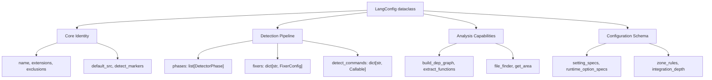
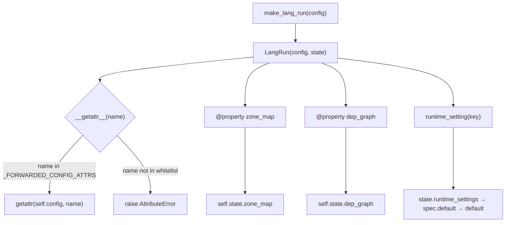
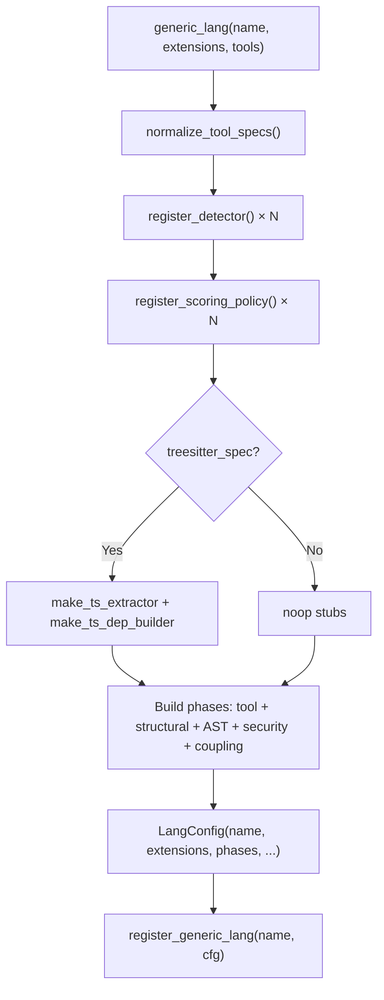

# PD-501.01 Desloppify — 双层插件注册与 LangConfig/LangRun 分离架构

> 文档编号：PD-501.01
> 来源：Desloppify `desloppify/languages/_framework/`
> GitHub：https://github.com/peteromallet/desloppify.git
> 问题域：PD-501 多语言插件架构 Multi-Language Plugin Architecture
> 状态：可复用方案

---

## 第 1 章 问题与动机

### 1.1 核心问题

静态代码分析工具需要支持多种编程语言，每种语言有不同的 linter、AST 解析器、修复工具和检测规则。核心挑战在于：

1. **插件一致性**：27 种语言插件必须遵循统一接口，否则管道无法统一调度
2. **配置与状态分离**：语言配置（扩展名、检测阶段、修复器）是不可变的，但每次扫描的运行时状态（zone map、依赖图、覆盖率）是临时的
3. **接入成本**：新增一种语言不应该需要修改框架代码，也不应该需要实现完整的检测管道
4. **渐进增强**：同一个插件在有/无 tree-sitter 支持时应自动获得不同级别的分析能力
5. **容错隔离**：单个插件加载失败不应阻塞其他语言的正常工作

### 1.2 Desloppify 的解法概述

Desloppify 设计了一个双层插件系统，核心思路是"配置即插件"：

1. **LangConfig 不可变配置** (`base/types.py:130`)：一个 40+ 字段的 dataclass，定义语言的全部静态属性——扩展名、检测阶段、修复器、阈值、zone 规则等
2. **LangRun 运行时门面** (`runtime.py:161`)：包装 LangConfig + 临时状态 LangRuntimeState，通过 `__getattr__` 显式转发配置属性，通过 property 暴露可变状态
3. **双层注册机制**：`@register_lang` 装饰器用于完整插件（6 个必需文件 + 3 个必需目录），`register_generic_lang` 用于轻量插件（单文件 `generic_lang()` 调用）
4. **generic_lang() 工厂** (`generic.py:124`)：仅需 name + extensions + tool specs 即可生成完整 LangConfig，自动组装检测阶段、注册 detector 和 scoring policy
5. **三层验证**：结构验证（目录布局）→ 契约验证（字段类型和约束）→ 运行时验证（tool spec 规范化）

### 1.3 设计思想

| 设计原则 | 具体实现 | 理由 | 替代方案 |
|----------|----------|------|----------|
| 不可变配置 + 可变状态 | LangConfig frozen fields + LangRun.state | 配置注册一次复用多次，状态每次扫描重建 | 单一可变对象（状态泄漏风险） |
| 显式属性转发 | `_FORWARDED_CONFIG_ATTRS` 白名单 | 防止意外访问未定义属性，新字段必须 opt-in | `__getattr__` 全转发（隐式耦合） |
| 双层插件分级 | full（class-based）vs shallow（generic_lang） | 深度集成语言需要自定义检测器，轻量语言只需 tool specs | 统一接口（过度工程或能力不足） |
| 工厂模式组装 | generic_lang() 自动注册 detector + scoring + phases | 消除重复的样板代码，28 行即可接入新语言 | 手动组装（每种语言重复 100+ 行） |
| 失败隔离 | discovery.py 捕获 6 类异常，记录但不中断 | 单个插件的 ImportError 不影响其他 26 种语言 | 全部加载或全部失败（脆弱） |

---

## 第 2 章 源码实现分析

### 2.1 架构概览

```
┌─────────────────────────────────────────────────────────────────┐
│                     Plugin Discovery Layer                       │
│  discovery.py: load_all() → import plugin_*.py + packages + user │
└──────────────────────────┬──────────────────────────────────────┘
                           │ triggers @register_lang / generic_lang()
┌──────────────────────────▼──────────────────────────────────────┐
│                     Validation Layer                              │
│  structure_validation.py  →  contract_validation.py               │
│  (目录布局检查)              (字段类型+约束检查)                    │
└──────────────────────────┬──────────────────────────────────────┘
                           │ validated LangConfig
┌──────────────────────────▼──────────────────────────────────────┐
│                     Registry Layer                                │
│  registry_state.py: _registry dict[str, LangConfig]              │
│  register() / get() / all_items() / is_registered()              │
└──────────────────────────┬──────────────────────────────────────┘
                           │ make_lang_run(config)
┌──────────────────────────▼──────────────────────────────────────┐
│                     Runtime Layer                                 │
│  LangRun(config=LangConfig, state=LangRuntimeState)              │
│  __getattr__ → _FORWARDED_CONFIG_ATTRS (白名单转发)               │
│  property → state.zone_map / dep_graph / complexity_map          │
└──────────────────────────┬──────────────────────────────────────┘
                           │ phases[i].run(path, lang_run)
┌──────────────────────────▼──────────────────────────────────────┐
│                     Execution Layer                               │
│  DetectorPhase.run() → findings + counts                         │
│  FixerConfig.fix() → FixResult                                   │
└─────────────────────────────────────────────────────────────────┘
```

### 2.2 核心实现

#### 2.2.1 LangConfig — 不可变配置核心



对应源码 `desloppify/languages/_framework/base/types.py:130-209`：

```python
@dataclass
class LangConfig:
    """Language configuration — everything the pipeline needs to scan a codebase."""

    name: str
    extensions: list[str]
    exclusions: list[str]
    default_src: str  # relative to PROJECT_ROOT

    # Dep graph builder (language-specific import parsing)
    build_dep_graph: DepGraphBuilder

    # Entry points (not orphaned even with 0 importers)
    entry_patterns: list[str]
    barrel_names: set[str]

    # Detector phases (ordered)
    phases: list[DetectorPhase] = field(default_factory=list)

    # Fixer registry
    fixers: dict[str, FixerConfig] = field(default_factory=dict)

    # Language-specific persisted settings and per-run runtime options.
    setting_specs: dict[str, LangValueSpec] = field(default_factory=dict)
    runtime_option_specs: dict[str, LangValueSpec] = field(default_factory=dict)

    # Integration depth: "full" | "standard" | "shallow" | "minimal"
    integration_depth: str = "full"
```

LangConfig 通过 `normalize_settings()` 和 `normalize_runtime_options()` 方法（`types.py:267-293`）提供类型安全的配置值强制转换，支持 bool/int/float/str/list/dict 六种类型。

#### 2.2.2 LangRun — 运行时门面与显式转发



对应源码 `desloppify/languages/_framework/runtime.py:160-261`：

```python
@dataclass
class LangRun:
    """Runtime facade over an immutable LangConfig."""

    config: LangConfig
    state: LangRuntimeState = field(default_factory=LangRuntimeState)

    @property
    def zone_map(self) -> FileZoneMap | None:
        return self.state.zone_map

    @zone_map.setter
    def zone_map(self, value: FileZoneMap | None) -> None:
        self.state.zone_map = value

    def __getattr__(self, name: str):
        if name in _FORWARDED_CONFIG_ATTRS:
            return getattr(self.config, name)
        raise AttributeError(
            f"{self.__class__.__name__!s} has no attribute {name!r}; "
            "access runtime state via explicit LangRun properties"
        )
```

`_FORWARDED_CONFIG_ATTRS`（`runtime.py:78-121`）是一个 frozenset，包含 40+ 个显式允许转发的属性名。新增 LangConfig 字段时必须手动加入此白名单，这是有意为之的 opt-in 设计。

#### 2.2.3 generic_lang() 工厂 — 28 行接入新语言



对应源码 `desloppify/languages/_framework/generic.py:124-285`：

```python
def generic_lang(
    name: str,
    extensions: list[str],
    tools: list[dict[str, Any]],
    *,
    exclude: list[str] | None = None,
    depth: str = "shallow",
    detect_markers: list[str] | None = None,
    default_src: str = ".",
    treesitter_spec=None,
    zone_rules: list[ZoneRule] | None = None,
    test_coverage_module: object | None = None,
) -> LangConfig:
    tool_specs = normalize_tool_specs(tools, supported_formats=set(_PARSERS))

    # Register each tool as a detector + scoring policy
    fixers: dict[str, FixerConfig] = {}
    for tool in tool_specs:
        has_fixer = tool.get("fix_cmd") is not None
        register_detector(DetectorMeta(
            name=tool["id"],
            display=tool["label"],
            dimension="Code quality",
            action_type="auto_fix" if has_fixer else "manual_fix",
        ))
        register_scoring_policy(DetectorScoringPolicy(
            detector=tool["id"],
            dimension="Code quality",
            tier=tool["tier"],
            file_based=True,
        ))
```

### 2.3 实现细节

#### 三层验证管道

插件加载时经过三层验证，任一层失败都会阻止注册：

1. **结构验证** (`structure_validation.py:10-32`)：检查完整插件的目录布局——6 个必需文件（commands.py, extractors.py, phases.py, move.py, review.py, test_coverage.py）和 3 个必需目录（detectors/, fixers/, tests/）
2. **契约验证** (`contract_validation.py:113-132`)：检查 LangConfig 实例的 7 个维度——核心身份、阶段列表、检测命令、修复器、设置规范、运行时选项规范、zone 规则
3. **Tool Spec 规范化** (`tool_spec.py:19-73`)：验证每个工具的 label/cmd/fmt/id/tier/fix_cmd 字段类型和范围

#### 插件发现机制

`discovery.py:47-108` 的 `load_all()` 按三个来源发现插件：

1. `plugin_*.py` 单文件插件（命名约定）
2. `desloppify/languages/*/` 包插件（目录约定）
3. `.desloppify/plugins/*.py` 用户自定义插件（项目级扩展）

关键设计：捕获 6 类异常（`ImportError, SyntaxError, ValueError, TypeError, RuntimeError, OSError`），记录到 `registry_state._load_errors` 但不中断发现流程。

#### 渐进增强：tree-sitter 集成

`generic.py:187-201` 展示了渐进增强的核心逻辑：

```python
if treesitter_spec is not None:
    from desloppify.languages._framework.treesitter import is_available
    if is_available():
        has_treesitter = True
        extract_fn = make_ts_extractor(treesitter_spec, file_finder)
        if treesitter_spec.import_query and treesitter_spec.resolve_import:
            dep_graph_fn = make_ts_dep_builder(treesitter_spec, file_finder)
```

当 tree-sitter 可用时，插件自动获得：函数提取（重复检测）、AST 复杂度分析、导入分析（耦合/孤儿/循环检测）、未使用导入检测。integration_depth 从 "shallow" 自动升级为 "standard"。

---

## 第 3 章 迁移指南

### 3.1 迁移清单

**阶段 1：核心类型定义**
- [ ] 定义 `PluginConfig` 不可变 dataclass（对应 LangConfig），包含 name、extensions、phases、fixers 等核心字段
- [ ] 定义 `PluginRun` 运行时门面（对应 LangRun），包装 config + ephemeral state
- [ ] 定义 `PluginRuntimeState` 临时状态容器（对应 LangRuntimeState）
- [ ] 实现 `_FORWARDED_CONFIG_ATTRS` 白名单转发机制

**阶段 2：注册与验证**
- [ ] 实现 `registry_state` 模块：全局 `_registry` dict + load guard
- [ ] 实现 `@register_plugin(name)` 装饰器（对应 `@register_lang`）
- [ ] 实现契约验证函数 `validate_plugin_contract()`
- [ ] 实现结构验证函数 `validate_plugin_structure()`（如需完整插件）

**阶段 3：工厂与发现**
- [ ] 实现 `generic_plugin()` 工厂函数（对应 `generic_lang()`）
- [ ] 实现 `ToolSpec` TypedDict + `normalize_tool_specs()` 验证
- [ ] 实现 `discovery.load_all()` 三源发现机制
- [ ] 实现 `make_plugin_run()` 运行时构建函数

### 3.2 适配代码模板

以下模板可直接复用，实现一个最小化的双层插件系统：

```python
"""Minimal two-tier plugin system inspired by Desloppify."""
from __future__ import annotations

import copy
import importlib
import logging
from collections.abc import Callable
from dataclasses import dataclass, field
from pathlib import Path
from typing import Any

logger = logging.getLogger(__name__)

# ── Registry ──────────────────────────────────────────────

_registry: dict[str, PluginConfig] = {}
_load_attempted = False
_load_errors: dict[str, BaseException] = {}


def register(name: str, cfg: PluginConfig) -> None:
    _registry[name] = cfg


def get_plugin(name: str) -> PluginConfig | None:
    return _registry.get(name)


# ── Core Types ────────────────────────────────────────────

@dataclass
class Phase:
    label: str
    run: Callable[[Path, PluginRun], tuple[list[dict], dict[str, int]]]


@dataclass
class PluginConfig:
    """Immutable plugin configuration — registered once, reused across runs."""
    name: str
    extensions: list[str]
    phases: list[Phase] = field(default_factory=list)
    integration_depth: str = "full"  # full | standard | shallow


@dataclass
class PluginRuntimeState:
    """Ephemeral per-run state."""
    context: dict[str, Any] = field(default_factory=dict)
    coverage: dict[str, Any] = field(default_factory=dict)


_FORWARDED = frozenset({"name", "extensions", "phases", "integration_depth"})


@dataclass
class PluginRun:
    """Runtime facade: immutable config + mutable state."""
    config: PluginConfig
    state: PluginRuntimeState = field(default_factory=PluginRuntimeState)

    @property
    def context(self) -> dict[str, Any]:
        return self.state.context

    @context.setter
    def context(self, value: dict[str, Any]) -> None:
        self.state.context = value

    def __getattr__(self, name: str):
        if name in _FORWARDED:
            return getattr(self.config, name)
        raise AttributeError(f"PluginRun has no attribute {name!r}")


def make_plugin_run(cfg: PluginConfig) -> PluginRun:
    return PluginRun(config=cfg)


# ── Validation ────────────────────────────────────────────

def validate_contract(name: str, cfg: PluginConfig) -> None:
    errors = []
    if cfg.name != name:
        errors.append(f"name mismatch: expected '{name}', got '{cfg.name}'")
    if not cfg.extensions:
        errors.append("extensions must be non-empty")
    if not cfg.phases:
        errors.append("phases must be non-empty")
    for i, p in enumerate(cfg.phases):
        if not callable(p.run):
            errors.append(f"phase[{i}].run must be callable")
    if errors:
        raise ValueError(f"Plugin '{name}' contract errors:\n" +
                         "\n".join(f"  - {e}" for e in errors))


# ── Decorator Registration ────────────────────────────────

def register_plugin(name: str):
    def decorator(cls):
        cfg = cls() if isinstance(cls, type) else cls
        validate_contract(name, cfg)
        register(name, cfg)
        return cls
    return decorator


# ── Generic Factory ───────────────────────────────────────

def generic_plugin(name: str, extensions: list[str],
                   tools: list[dict[str, str]]) -> PluginConfig:
    """Build and register a plugin from tool specs (no class needed)."""
    phases = []
    for tool in tools:
        def make_phase(t=tool):
            def run(path, plugin_run):
                # Run external tool, parse output
                import subprocess
                result = subprocess.run(
                    t["cmd"], shell=True, cwd=str(path),
                    capture_output=True, text=True, timeout=120
                )
                return [], {}  # parse result.stdout here
            return Phase(label=t["label"], run=run)
        phases.append(make_phase())

    cfg = PluginConfig(name=name, extensions=extensions,
                       phases=phases, integration_depth="shallow")
    validate_contract(name, cfg)
    register(name, cfg)
    return cfg


# ── Discovery ─────────────────────────────────────────────

_IMPORT_ERRORS = (ImportError, SyntaxError, ValueError, TypeError, RuntimeError)

def load_all(plugin_dir: Path, base_package: str) -> None:
    global _load_attempted, _load_errors
    if _load_attempted:
        return
    failures: dict[str, BaseException] = {}
    for d in sorted(plugin_dir.iterdir()):
        if d.is_dir() and (d / "__init__.py").exists() and not d.name.startswith("_"):
            try:
                importlib.import_module(f".{d.name}", base_package)
            except _IMPORT_ERRORS as ex:
                logger.warning("Plugin %s failed: %s", d.name, ex)
                failures[d.name] = ex
    _load_attempted = True
    _load_errors = failures
```

### 3.3 适用场景

| 场景 | 适用度 | 说明 |
|------|--------|------|
| 多语言代码分析工具 | ⭐⭐⭐ | 直接适用，Desloppify 的原始场景 |
| 多格式文档处理管道 | ⭐⭐⭐ | Config 定义格式特征，Phase 定义处理步骤 |
| 多数据源 ETL 框架 | ⭐⭐ | 每个数据源一个插件，generic_plugin 快速接入 |
| Agent 工具系统 | ⭐⭐ | 工具注册 + 验证 + 运行时状态分离 |
| 单一功能的简单插件 | ⭐ | 过度工程，直接用策略模式即可 |

---

## 第 4 章 测试用例

```python
"""Tests for the two-tier plugin system — based on Desloppify's actual patterns."""
import pytest
from pathlib import Path
from dataclasses import dataclass, field
from typing import Any


# ── Test: LangConfig immutability and normalization ──

class TestLangConfigNormalization:
    """Based on desloppify/languages/_framework/base/types.py:267-293."""

    def test_normalize_settings_coerces_bool(self):
        """Bool coercion from string values."""
        from desloppify.languages._framework.base.types import LangConfig, LangValueSpec
        cfg = LangConfig(
            name="test", extensions=[".test"], exclusions=[], default_src=".",
            build_dep_graph=lambda p: {}, entry_patterns=[], barrel_names=set(),
            setting_specs={"strict": LangValueSpec(type=bool, default=False)},
            file_finder=lambda p: [], extract_functions=lambda p: [],
            zone_rules=[],
        )
        result = cfg.normalize_settings({"strict": "true"})
        assert result["strict"] is True

    def test_normalize_settings_fallback_on_none(self):
        from desloppify.languages._framework.base.types import LangConfig, LangValueSpec
        cfg = LangConfig(
            name="test", extensions=[".test"], exclusions=[], default_src=".",
            build_dep_graph=lambda p: {}, entry_patterns=[], barrel_names=set(),
            setting_specs={"threshold": LangValueSpec(type=int, default=10)},
            file_finder=lambda p: [], extract_functions=lambda p: [],
            zone_rules=[],
        )
        result = cfg.normalize_settings({"threshold": None})
        assert result["threshold"] == 10


# ── Test: Contract validation ──

class TestContractValidation:
    """Based on desloppify/languages/_framework/contract_validation.py:113-132."""

    def test_rejects_empty_extensions(self):
        from desloppify.languages._framework.base.types import LangConfig
        from desloppify.languages._framework.contract_validation import validate_lang_contract
        cfg = LangConfig(
            name="bad", extensions=[], exclusions=[], default_src=".",
            build_dep_graph=lambda p: {}, entry_patterns=[], barrel_names=set(),
            file_finder=lambda p: [], extract_functions=lambda p: [],
            zone_rules=[],
        )
        with pytest.raises(ValueError, match="extensions must be non-empty"):
            validate_lang_contract("bad", cfg)

    def test_rejects_name_mismatch(self):
        from desloppify.languages._framework.base.types import LangConfig
        from desloppify.languages._framework.contract_validation import validate_lang_contract
        cfg = LangConfig(
            name="wrong", extensions=[".x"], exclusions=[], default_src=".",
            build_dep_graph=lambda p: {}, entry_patterns=[], barrel_names=set(),
            file_finder=lambda p: [], extract_functions=lambda p: [],
            zone_rules=[],
        )
        with pytest.raises(ValueError, match="name mismatch"):
            validate_lang_contract("expected", cfg)


# ── Test: Registry state ──

class TestRegistryState:
    """Based on desloppify/languages/_framework/registry_state.py."""

    def test_register_and_get(self):
        from desloppify.languages._framework import registry_state
        sentinel = object()
        registry_state.register("__test__", sentinel)
        assert registry_state.get("__test__") is sentinel
        registry_state.remove("__test__")

    def test_get_returns_none_for_unknown(self):
        from desloppify.languages._framework import registry_state
        assert registry_state.get("__nonexistent__") is None


# ── Test: LangRun forwarding ──

class TestLangRunForwarding:
    """Based on desloppify/languages/_framework/runtime.py:255-261."""

    def test_forwards_config_attrs(self):
        from desloppify.languages._framework.base.types import LangConfig
        from desloppify.languages._framework.runtime import LangRun
        cfg = LangConfig(
            name="test", extensions=[".t"], exclusions=[], default_src=".",
            build_dep_graph=lambda p: {}, entry_patterns=[], barrel_names=set(),
            file_finder=lambda p: [], extract_functions=lambda p: [],
            zone_rules=[],
        )
        run = LangRun(config=cfg)
        assert run.name == "test"
        assert run.extensions == [".t"]

    def test_rejects_unknown_attrs(self):
        from desloppify.languages._framework.base.types import LangConfig
        from desloppify.languages._framework.runtime import LangRun
        cfg = LangConfig(
            name="test", extensions=[".t"], exclusions=[], default_src=".",
            build_dep_graph=lambda p: {}, entry_patterns=[], barrel_names=set(),
            file_finder=lambda p: [], extract_functions=lambda p: [],
            zone_rules=[],
        )
        run = LangRun(config=cfg)
        with pytest.raises(AttributeError, match="has no attribute"):
            _ = run.nonexistent_field


# ── Test: Tool spec normalization ──

class TestToolSpecNormalization:
    """Based on desloppify/languages/_framework/generic_parts/tool_spec.py:19-73."""

    def test_rejects_invalid_tier(self):
        from desloppify.languages._framework.generic_parts.tool_spec import normalize_tool_specs
        with pytest.raises(ValueError, match="tier must be in range"):
            normalize_tool_specs(
                [{"label": "x", "cmd": "x", "fmt": "json", "id": "x", "tier": 5}],
                supported_formats={"json"},
            )

    def test_normalizes_valid_spec(self):
        from desloppify.languages._framework.generic_parts.tool_spec import normalize_tool_specs
        result = normalize_tool_specs(
            [{"label": "lint", "cmd": "lint .", "fmt": "json", "id": "linter", "tier": 2}],
            supported_formats={"json"},
        )
        assert len(result) == 1
        assert result[0]["id"] == "linter"
```

---

## 第 5 章 跨域关联

| 关联域 | 关系类型 | 说明 |
|--------|----------|------|
| PD-04 工具系统 | 协同 | generic_lang() 的 tool specs 本质上是工具注册系统，每个 tool 自动注册为 detector + scoring policy |
| PD-10 中间件管道 | 协同 | DetectorPhase 列表构成有序管道，phases 按顺序执行，后续阶段可依赖前序阶段的 state |
| PD-03 容错与重试 | 依赖 | discovery.py 的 6 类异常捕获 + _record_tool_failure_coverage 实现了插件级和工具级的容错 |
| PD-07 质量检查 | 协同 | DetectorCoverageStatus 和 ScanCoverageRecord 提供检测覆盖率元数据，支撑质量评估 |
| PD-11 可观测性 | 协同 | capability_report() 提供插件能力自省，integration_depth 标记分析深度级别 |

---

## 第 6 章 来源文件索引

| 文件 | 行范围 | 关键实现 |
|------|--------|----------|
| `desloppify/languages/_framework/base/types.py` | L130-L349 | LangConfig 不可变配置 dataclass（40+ 字段） |
| `desloppify/languages/_framework/runtime.py` | L26-L41 | LangRuntimeState 临时状态容器 |
| `desloppify/languages/_framework/runtime.py` | L160-L300 | LangRun 运行时门面 + __getattr__ 白名单转发 |
| `desloppify/languages/_framework/runtime.py` | L78-L121 | _FORWARDED_CONFIG_ATTRS 显式转发白名单 |
| `desloppify/languages/_framework/runtime.py` | L329-L348 | make_lang_run() 运行时构建工厂 |
| `desloppify/languages/__init__.py` | L30-L48 | @register_lang 装饰器 + 验证链 |
| `desloppify/languages/__init__.py` | L51-L54 | register_generic_lang() 轻量注册 |
| `desloppify/languages/_framework/generic.py` | L124-L285 | generic_lang() 工厂：tool specs → 完整 LangConfig |
| `desloppify/languages/_framework/contract_validation.py` | L113-L132 | validate_lang_contract() 7 维契约验证 |
| `desloppify/languages/_framework/structure_validation.py` | L10-L32 | validate_lang_structure() 目录布局验证 |
| `desloppify/languages/_framework/registry_state.py` | L26-L93 | 全局注册表 + load guard + 错误收集 |
| `desloppify/languages/_framework/discovery.py` | L47-L108 | load_all() 三源插件发现 |
| `desloppify/languages/_framework/generic_parts/tool_spec.py` | L8-L73 | ToolSpec TypedDict + normalize_tool_specs() |
| `desloppify/languages/_framework/generic_parts/tool_factories.py` | L60-L96 | make_tool_phase() 检测阶段工厂 |
| `desloppify/languages/_framework/generic_parts/tool_factories.py` | L113-L158 | make_generic_fixer() 修复器工厂 |
| `desloppify/languages/rust/__init__.py` | L1-L31 | Rust 轻量插件示例（28 行完整接入） |

---

## 第 7 章 横向对比维度

```json comparison_data
{
  "project": "Desloppify",
  "dimensions": {
    "插件注册方式": "@register_lang 装饰器 + register_generic_lang 双轨注册",
    "配置与状态分离": "LangConfig 不可变 + LangRun 门面 + LangRuntimeState 临时状态",
    "工厂模式": "generic_lang() 从 tool specs 自动组装完整 LangConfig",
    "验证机制": "三层验证：结构(目录) → 契约(字段) → 规范化(tool spec)",
    "渐进增强": "tree-sitter 可用时自动升级 integration_depth 和分析能力",
    "插件发现": "三源发现：plugin_*.py + packages + .desloppify/plugins/",
    "容错隔离": "6 类异常捕获 + 错误记录不中断 + 覆盖率降级标记"
  }
}
```

### 域元数据补充

```json domain_metadata
{
  "solution_summary": "Desloppify 通过 LangConfig/LangRun 不可变配置与运行时状态分离、@register_lang 装饰器双轨注册、generic_lang() 工厂从 tool specs 自动组装插件，三层验证确保 27 种语言插件的一致性",
  "description": "插件系统中不可变配置与临时运行时状态的架构分离模式",
  "sub_problems": [
    "Plugin discovery across multiple sources (packages, files, user plugins)",
    "Progressive capability enhancement based on optional dependencies",
    "Explicit attribute forwarding whitelist for runtime facade"
  ],
  "best_practices": [
    "Three-layer validation pipeline: structure → contract → spec normalization",
    "Graceful degradation with error collection during plugin discovery",
    "Capability introspection via integration_depth and capability_report"
  ]
}
```
