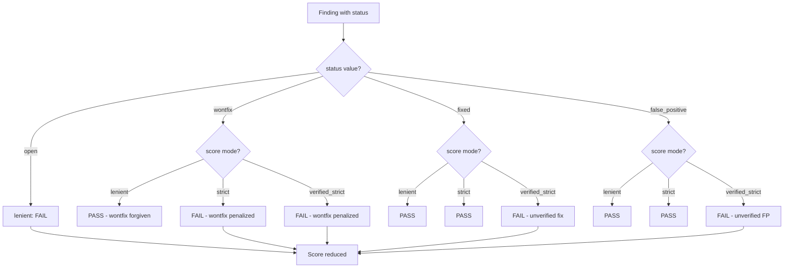
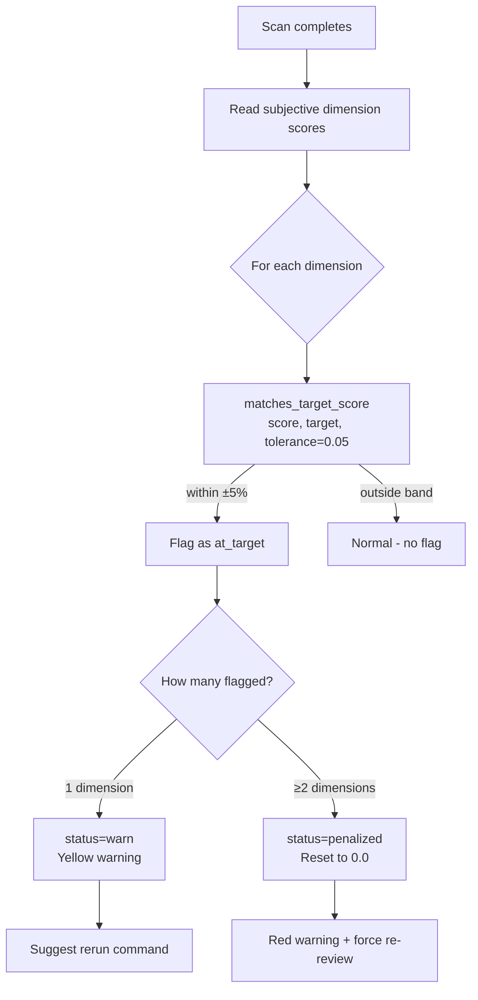
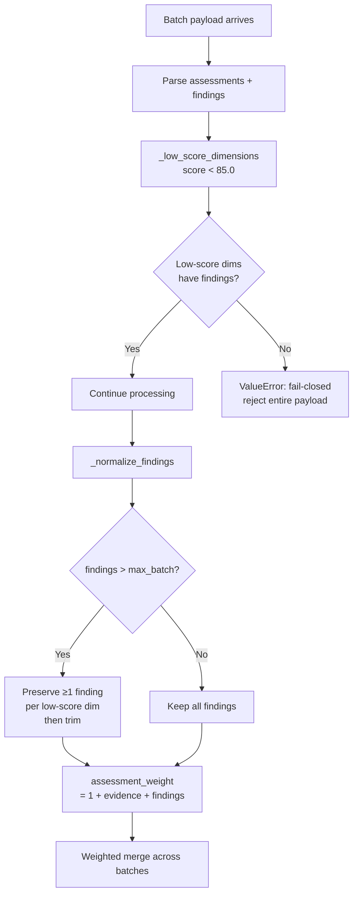

# PD-502.01 Desloppify — 多层 Anti-Gaming 评分完整性防护

> 文档编号：PD-502.01
> 来源：Desloppify `desloppify/intelligence/integrity.py`, `desloppify/engine/_scoring/policy/core.py`, `desloppify/app/commands/review/batch_core.py`
> GitHub：https://github.com/peteromallet/desloppify.git
> 问题域：PD-502 Anti-Gaming 评分完整性 Anti-Gaming Score Integrity
> 状态：可复用方案

---

## 第 1 章 问题与动机

### 1.1 核心问题

当代码质量评分系统引入 LLM 主观评审（subjective review）时，评审者（人类或 AI agent）可能有意或无意地"对齐"目标分数——即让评分恰好落在目标阈值上，而非基于真实代码质量给出独立判断。这种 gaming 行为会导致：

1. **分数膨胀**：主观维度分数虚高，掩盖真实代码问题
2. **证据缺失**：高分维度缺少"为什么不能更高"的解释，低分维度缺少具体 findings
3. **wontfix 逃避**：将问题标记为 wontfix 来规避 strict 评分惩罚
4. **未验证修复**：声称已修复但未经扫描验证的 findings 被计入分数
5. **评审偏见**：评审者看到当前总分后，潜意识调整评分以匹配预期

这些问题在自动化评审管道中尤为严重——LLM agent 天然倾向于"讨好"目标值。

### 1.2 Desloppify 的解法概述

Desloppify 设计了五层递进的 anti-gaming 防护体系：

1. **Target Score Proximity Detection** — `matches_target_score()` 函数检测主观分数是否在目标值 ±5% 容差带内（`desloppify/engine/_scoring/policy/core.py:194-207`），触发 warn → penalized 两级响应
2. **三模式评分通道** — lenient/strict/verified_strict 三种 `ScoreMode`（`core.py:11-12`），strict 将 wontfix 计为失败，verified_strict 仅计入扫描验证的修复
3. **低分证据强制** — 分数低于 85.0 阈值的维度必须包含至少一条 finding（`batch_core.py:291-310`），否则 fail-closed 拒绝整个 payload
4. **盲审会话隔离** — 通过 SHA-256 packet hash 验证盲审 provenance（`import_helpers.py:159-237`），确保评审者无法感知当前总分
5. **Evidence-Weighted Assessment Merging** — 批次合并时按证据数量加权（`batch_core.py:424-442`），而非按原始分数加权，防止空洞高分稀释有证据的低分

### 1.3 设计思想

| 设计原则 | 具体实现 | 理由 | 替代方案 |
|----------|----------|------|----------|
| Fail-closed 默认拒绝 | 低分无 finding → ValueError 拒绝整个 payload | 宁可拒绝合法评审也不放过无证据低分 | Fail-open 接受但标记警告 |
| 多通道评分分离 | lenient/strict/verified_strict 三通道并行计算 | 不同信任级别的消费者看到不同分数 | 单一分数 + 手动调整 |
| 容差带检测而非精确匹配 | ±5% tolerance band（`SUBJECTIVE_TARGET_MATCH_TOLERANCE = 0.05`） | 精确匹配太容易绕过，容差带捕获"接近目标"的模式 | 精确匹配 / 统计异常检测 |
| 密码学 provenance 验证 | SHA-256 hash 绑定盲审 packet 到导入 payload | 防止评审者事后篡改 packet 内容 | 时间戳 / 签名 |
| 证据驱动权重 | `weight = 1 + note_evidence + finding_count` | 有证据的评审获得更高合并权重 | 等权平均 / 分数加权 |

---

## 第 2 章 源码实现分析

### 2.1 架构概览

Desloppify 的 anti-gaming 体系分布在四个层次，从评分引擎到导入管道形成完整防护链：

```
┌─────────────────────────────────────────────────────────────────┐
│                    Anti-Gaming 防护架构                          │
├─────────────────────────────────────────────────────────────────┤
│                                                                 │
│  Layer 1: Scoring Policy (engine/_scoring/policy/core.py)       │
│  ┌──────────────┐  ┌──────────────┐  ┌───────────────────┐     │
│  │   lenient     │  │   strict     │  │  verified_strict  │     │
│  │ open=failure  │  │ open+wontfix │  │ open+wontfix+     │     │
│  │              │  │  =failure    │  │ fixed+false_pos   │     │
│  └──────────────┘  └──────────────┘  └───────────────────┘     │
│         ↓                  ↓                   ↓                │
│  Layer 2: Integrity Detection (intelligence/integrity.py)       │
│  ┌──────────────────────────────────────────────────────┐       │
│  │  matches_target_score(score, target, tolerance=0.05) │       │
│  │  → warn (1 match) → penalized (≥2 matches → reset 0)│       │
│  └──────────────────────────────────────────────────────┘       │
│         ↓                                                       │
│  Layer 3: Batch Validation (review/batch_core.py)               │
│  ┌──────────────────────────────────────────────────────┐       │
│  │  _enforce_low_score_findings() → ValueError if miss  │       │
│  │  _normalize_findings() → preserve low-score dims     │       │
│  │  assessment_weight() → evidence-driven merge weight  │       │
│  └──────────────────────────────────────────────────────┘       │
│         ↓                                                       │
│  Layer 4: Import Trust Gating (review/import_helpers.py)        │
│  ┌──────────────────────────────────────────────────────┐       │
│  │  _assessment_provenance_status() → SHA-256 verify    │       │
│  │  blind=true + runner ∈ {codex,claude} required       │       │
│  │  findings_only fallback for untrusted sources        │       │
│  └──────────────────────────────────────────────────────┘       │
│                                                                 │
└─────────────────────────────────────────────────────────────────┘
```

### 2.2 核心实现

#### 2.2.1 三模式评分通道与 Wontfix 惩罚



对应源码 `desloppify/engine/_scoring/policy/core.py:11-12, 183-191`：

```python
ScoreMode = Literal["lenient", "strict", "verified_strict"]
SCORING_MODES: tuple[ScoreMode, ...] = ("lenient", "strict", "verified_strict")

FAILURE_STATUSES_BY_MODE: dict[ScoreMode, frozenset[str]] = {
    "lenient": frozenset({"open"}),
    "strict": frozenset({"open", "wontfix"}),
    "verified_strict": frozenset({"open", "wontfix", "fixed", "false_positive"}),
}
```

这三个通道在 `compute_score_bundle()` 中并行计算（`results/core.py:303-336`），产出 `ScoreBundle` 包含 `overall_score`、`strict_score`、`verified_strict_score` 三个独立分数。`verified_strict` 是最严格的通道——只有经过扫描验证确认已修复的 finding 才不计为失败，这意味着仅仅声称"已修复"或"误报"都不够。

#### 2.2.2 Target Score Proximity Detection



对应源码 `desloppify/engine/_scoring/policy/core.py:189-207`：

```python
# Tolerance for treating a subjective score as "on target" in integrity checks.
# Scores within this band of the target are flagged as potential gaming.
SUBJECTIVE_TARGET_MATCH_TOLERANCE = 0.05

def matches_target_score(
    score: object,
    target: object,
    *,
    tolerance: float = SUBJECTIVE_TARGET_MATCH_TOLERANCE,
) -> bool:
    """Return True when score is within tolerance of target."""
    try:
        score_value = float(score)
        target_value = float(target)
        tolerance_value = max(0.0, float(tolerance))
    except (TypeError, ValueError):
        return False
    return abs(score_value - target_value) <= tolerance_value
```

该检测在 `scan_reporting_subjective.py:147-213` 的 `subjective_integrity_followup()` 中被调用，产出三级状态：`at_target`（检测到匹配）→ `warn`（持续匹配）→ `penalized`（重置为 0.0）。

#### 2.2.3 低分证据强制与 Evidence-Weighted Merging



对应源码 `desloppify/app/commands/review/batch_core.py:282-310`：

```python
def _low_score_dimensions(assessments: dict[str, float]) -> set[str]:
    """Return assessed dimensions requiring explicit defect findings."""
    return {
        dim
        for dim, score in assessments.items()
        if score < LOW_SCORE_FINDING_THRESHOLD  # 85.0
    }

def _enforce_low_score_findings(
    *,
    assessments: dict[str, float],
    findings: list[NormalizedBatchFinding],
) -> None:
    """Fail closed when low scores do not report explicit findings."""
    required_dims = _low_score_dimensions(assessments)
    if not required_dims:
        return
    finding_dims = {finding.dimension.strip() for finding in findings}
    missing = sorted(dim for dim in required_dims if dim not in finding_dims)
    if not missing:
        return
    joined = ", ".join(missing)
    raise ValueError(
        "low-score dimensions must include at least one explicit finding: "
        f"{joined} (threshold {LOW_SCORE_FINDING_THRESHOLD:.1f})"
    )
```

Evidence-weighted merging 在 `batch_core.py:424-442`：

```python
def assessment_weight(
    *,
    dimension: str,
    findings: list[dict[str, Any]],
    dimension_notes: dict[str, dict[str, Any]],
) -> float:
    """Evidence-weighted assessment score weight with a neutral floor.

    Weighting is evidence-based and score-independent: the raw score does not
    influence how much weight a batch contributes during merge.
    """
    note = dimension_notes.get(dimension, {})
    note_evidence = len(note.get("evidence", [])) if isinstance(note, dict) else 0
    finding_count = sum(
        1 for finding in findings
        if str(finding.get("dimension", "")).strip() == dimension
    )
    return float(1 + note_evidence + finding_count)
```

关键设计：权重公式 `1 + evidence_count + finding_count` 完全不依赖分数本身。一个给出 60 分但附带 5 条证据的批次，权重为 7.0；一个给出 95 分但无证据的批次，权重仅为 1.0。这从根本上防止了"空洞高分"稀释有实质内容的评审。

### 2.3 实现细节

#### 盲审 Provenance 验证链

`import_helpers.py:159-237` 实现了完整的 provenance 信任链验证：

1. `kind` 必须为 `"blind_review_batch_import"`
2. `blind` 必须为 `True`
3. `runner` 必须在 `{"codex", "claude"}` 白名单中
4. `packet_sha256` 必须是合法的 64 字符十六进制 SHA-256 hash
5. 本地 packet 文件必须存在且 hash 匹配

任何一步失败都返回 `trusted=False`，导致评分降级为 `findings_only` 模式（仅导入 findings，丢弃 assessments）。

#### Finding Pressure 评分调整

`batch_scoring.py:66-146` 的 `DimensionMergeScorer` 在合并批次分数时施加 finding pressure：

- 每个 finding 的 severity = `confidence_weight × impact_scope_weight × fix_scope_weight`
- 总 penalty = `min(24.0, pressure × 2.2 + (count-1) × 0.8)`
- 最终分数 = `0.7 × weighted_mean + 0.3 × floor - penalty`，并受 cap 限制

这确保即使多个批次给出高分，只要存在高严重度 findings，最终分数仍会被拉低。

#### 高分缺失问题说明检测

`feedback_contract.py:6-7` 定义了双向约束：
- 分数 < 85.0 → 必须有 finding（低分证据强制）
- 分数 > 85.0 → 必须有 `issues_preventing_higher_score` 说明（高分理由强制）

这形成了一个"无死角"的证据要求：无论分数高低，评审者都必须提供实质性解释。


---

## 第 3 章 迁移指南

### 3.1 迁移清单

**阶段 1：评分通道分离（1-2 天）**
- [ ] 定义 `ScoreMode` 枚举和 `FAILURE_STATUSES_BY_MODE` 映射
- [ ] 修改评分引擎支持按 mode 过滤 finding status
- [ ] 在 ScoreBundle 中输出 lenient/strict/verified_strict 三个分数
- [ ] UI 展示三通道分数（默认显示 strict）

**阶段 2：低分证据强制（0.5 天）**
- [ ] 定义 `LOW_SCORE_FINDING_THRESHOLD`（建议 85.0）
- [ ] 在 payload 验证层添加 `_enforce_low_score_findings()` 检查
- [ ] 在 finding 裁剪逻辑中优先保留低分维度的 findings

**阶段 3：Target Proximity Detection（0.5 天）**
- [ ] 实现 `matches_target_score()` 容差带检测
- [ ] 在 scan 报告中集成 integrity followup（warn/penalized 两级）
- [ ] penalized 状态下重置匹配维度分数为 0.0

**阶段 4：盲审 Provenance（1 天）**
- [ ] 定义 provenance 数据模型（kind, blind, runner, packet_sha256）
- [ ] 实现 SHA-256 packet hash 验证
- [ ] 实现 assessment import policy 信任分级（trusted_internal / attested_external / manual_override / findings_only）

**阶段 5：Evidence-Weighted Merging（0.5 天）**
- [ ] 实现 `assessment_weight()` 函数（1 + evidence + findings）
- [ ] 在批次合并中使用证据权重替代等权平均

### 3.2 适配代码模板

以下是可直接复用的 anti-gaming 核心模块模板：

```python
"""Anti-gaming score integrity module."""
from __future__ import annotations
from dataclasses import dataclass
from typing import Literal

# --- Layer 1: Multi-mode scoring ---
ScoreMode = Literal["lenient", "strict", "verified_strict"]

FAILURE_STATUSES: dict[ScoreMode, frozenset[str]] = {
    "lenient": frozenset({"open"}),
    "strict": frozenset({"open", "wontfix"}),
    "verified_strict": frozenset({"open", "wontfix", "fixed", "false_positive"}),
}

# --- Layer 2: Target proximity detection ---
TARGET_MATCH_TOLERANCE = 0.05  # ±5%

def matches_target(score: float, target: float, tolerance: float = TARGET_MATCH_TOLERANCE) -> bool:
    """Detect if score suspiciously matches target within tolerance band."""
    return abs(score - target) <= max(0.0, tolerance)

def detect_gaming(
    dim_scores: dict[str, float],
    target: float,
) -> tuple[list[str], str]:
    """Return (matched_dims, status) where status is 'ok'|'warn'|'penalized'."""
    matched = [dim for dim, score in dim_scores.items() if matches_target(score, target)]
    if len(matched) >= 2:
        return matched, "penalized"
    elif len(matched) == 1:
        return matched, "warn"
    return [], "ok"

# --- Layer 3: Low-score evidence enforcement ---
LOW_SCORE_THRESHOLD = 85.0

def enforce_low_score_findings(
    assessments: dict[str, float],
    finding_dims: set[str],
    threshold: float = LOW_SCORE_THRESHOLD,
) -> list[str]:
    """Return dimensions below threshold missing findings. Raise or reject if non-empty."""
    required = {dim for dim, score in assessments.items() if score < threshold}
    return sorted(required - finding_dims)

# --- Layer 4: Evidence-weighted merge ---
def evidence_weight(
    evidence_count: int,
    finding_count: int,
) -> float:
    """Score-independent weight: more evidence = more influence in merge."""
    return float(1 + evidence_count + finding_count)

@dataclass(frozen=True)
class MergedScore:
    weighted_mean: float
    floor: float
    penalty: float
    final: float

def merge_dimension_scores(
    batches: list[tuple[float, float]],  # (score, weight) pairs
    finding_pressure: float = 0.0,
    finding_count: int = 0,
    max_penalty: float = 24.0,
    pressure_multiplier: float = 2.2,
) -> MergedScore:
    """Pressure-adjusted weighted merge across review batches."""
    if not batches:
        return MergedScore(100.0, 100.0, 0.0, 100.0)
    numerator = sum(s * w for s, w in batches)
    denominator = sum(w for _, w in batches)
    weighted_mean = numerator / max(denominator, 1.0)
    floor = min(s for s, _ in batches)
    blended = 0.7 * weighted_mean + 0.3 * floor
    penalty = min(max_penalty, finding_pressure * pressure_multiplier + max(finding_count - 1, 0) * 0.8)
    final = round(max(0.0, min(100.0, blended - penalty)), 1)
    return MergedScore(weighted_mean, floor, penalty, final)
```

### 3.3 适用场景

| 场景 | 适用度 | 说明 |
|------|--------|------|
| LLM 自动代码评审系统 | ⭐⭐⭐ | 核心场景，LLM 天然倾向对齐目标值 |
| 多人代码评审平台 | ⭐⭐⭐ | 防止评审者互相参考分数 |
| CI/CD 质量门禁 | ⭐⭐ | strict/verified_strict 通道适合门禁 |
| 单人项目自评 | ⭐ | 自评场景 gaming 动机较弱 |
| 学术论文评审系统 | ⭐⭐⭐ | 盲审 + 证据强制直接适用 |

---

## 第 4 章 测试用例

```python
"""Tests for anti-gaming score integrity mechanisms."""
import pytest
from typing import Literal

# --- Test matches_target_score ---

class TestTargetProximityDetection:
    def test_exact_match_detected(self):
        """Score exactly at target should be flagged."""
        assert matches_target(95.0, 95.0) is True

    def test_within_tolerance_detected(self):
        """Score within ±5% band should be flagged."""
        assert matches_target(95.04, 95.0) is True
        assert matches_target(94.96, 95.0) is True

    def test_outside_tolerance_not_detected(self):
        """Score outside band should not be flagged."""
        assert matches_target(94.9, 95.0) is False
        assert matches_target(95.1, 95.0) is False

    def test_type_coercion_safety(self):
        """Non-numeric inputs should return False, not raise."""
        # Original uses object types with try/except
        from desloppify.engine._scoring.policy.core import matches_target_score
        assert matches_target_score("not_a_number", 95.0) is False
        assert matches_target_score(None, 95.0) is False

# --- Test gaming detection escalation ---

class TestGamingDetection:
    def test_no_match_ok(self):
        dims = {"elegance": 88.0, "contracts": 92.0}
        matched, status = detect_gaming(dims, target=95.0)
        assert status == "ok"
        assert matched == []

    def test_single_match_warn(self):
        dims = {"elegance": 95.0, "contracts": 88.0}
        matched, status = detect_gaming(dims, target=95.0)
        assert status == "warn"
        assert matched == ["elegance"]

    def test_multiple_match_penalized(self):
        dims = {"elegance": 95.0, "contracts": 95.02, "clarity": 80.0}
        matched, status = detect_gaming(dims, target=95.0)
        assert status == "penalized"
        assert len(matched) == 2

# --- Test low-score evidence enforcement ---

class TestLowScoreEnforcement:
    def test_low_score_with_finding_passes(self):
        missing = enforce_low_score_findings(
            {"elegance": 70.0, "contracts": 90.0},
            finding_dims={"elegance"},
        )
        assert missing == []

    def test_low_score_without_finding_fails(self):
        missing = enforce_low_score_findings(
            {"elegance": 70.0, "contracts": 60.0},
            finding_dims={"elegance"},
        )
        assert missing == ["contracts"]

    def test_all_above_threshold_passes(self):
        missing = enforce_low_score_findings(
            {"elegance": 90.0, "contracts": 95.0},
            finding_dims=set(),
        )
        assert missing == []

# --- Test evidence-weighted merging ---

class TestEvidenceWeightedMerge:
    def test_evidence_rich_batch_dominates(self):
        """Batch with more evidence should have more influence."""
        result = merge_dimension_scores([
            (60.0, evidence_weight(5, 2)),  # weight=8, rich evidence
            (95.0, evidence_weight(0, 0)),  # weight=1, no evidence
        ])
        # Weighted mean should be closer to 60 than 95
        assert result.final < 70.0

    def test_finding_pressure_reduces_score(self):
        result_no_pressure = merge_dimension_scores([(90.0, 1.0)])
        result_with_pressure = merge_dimension_scores(
            [(90.0, 1.0)], finding_pressure=3.0, finding_count=2
        )
        assert result_with_pressure.final < result_no_pressure.final

    def test_penalty_capped(self):
        """Penalty should not exceed max_penalty."""
        result = merge_dimension_scores(
            [(90.0, 1.0)],
            finding_pressure=100.0,
            finding_count=50,
            max_penalty=24.0,
        )
        assert result.penalty == 24.0

# --- Test three-mode scoring ---

class TestThreeModeScoringChannel:
    def test_wontfix_passes_lenient(self):
        assert "wontfix" not in FAILURE_STATUSES["lenient"]

    def test_wontfix_fails_strict(self):
        assert "wontfix" in FAILURE_STATUSES["strict"]

    def test_fixed_fails_verified_strict(self):
        assert "fixed" in FAILURE_STATUSES["verified_strict"]

    def test_false_positive_fails_verified_strict(self):
        assert "false_positive" in FAILURE_STATUSES["verified_strict"]
```


---

## 第 5 章 跨域关联

| 关联域 | 关系类型 | 说明 |
|--------|----------|------|
| PD-07 质量检查 | 强依赖 | Anti-gaming 是质量检查的元层——确保质量检查本身不被 gaming。Desloppify 的 `feedback_contract.py` 定义了评审质量的双向约束（低分要 finding，高分要 issues_note） |
| PD-505 LLM 主观评审 | 协同 | Anti-gaming 机制专门针对 LLM 主观评审场景设计。`subjective_review` detector 和 `subjective_assessment` 维度是 gaming 检测的主要对象 |
| PD-503 AI Agent 引导 | 协同 | 盲审 provenance 验证确保 AI agent 在评审时不受当前分数影响。`_BLIND_PROVENANCE_KIND` 和 runner 白名单约束了 agent 的执行环境 |
| PD-504 工作队列优先级 | 依赖 | `_normalize_findings()` 中低分维度 findings 的优先保留逻辑（`batch_core.py:255-279`）影响了修复工作队列的优先级排序 |
| PD-11 可观测性 | 协同 | `_compute_batch_quality()` 输出 `dimension_coverage`、`evidence_density`、`high_score_missing_issue_note` 等质量指标，为评审过程提供可观测性 |

---

## 第 6 章 来源文件索引

| 文件 | 行范围 | 关键实现 |
|------|--------|----------|
| `desloppify/engine/_scoring/policy/core.py` | L11-12 | `ScoreMode` 类型定义和 `SCORING_MODES` 元组 |
| `desloppify/engine/_scoring/policy/core.py` | L183-191 | `FAILURE_STATUSES_BY_MODE` 三模式失败状态映射 |
| `desloppify/engine/_scoring/policy/core.py` | L189-207 | `SUBJECTIVE_TARGET_MATCH_TOLERANCE` 和 `matches_target_score()` |
| `desloppify/intelligence/integrity.py` | L51-56 | `is_subjective_review_open()` 开放评审检测 |
| `desloppify/intelligence/integrity.py` | L59-70 | `is_holistic_subjective_finding()` 全局评审识别 |
| `desloppify/intelligence/integrity.py` | L73-92 | `subjective_review_open_breakdown()` 评审状态分解 |
| `desloppify/intelligence/integrity.py` | L95-115 | `unassessed_subjective_dimensions()` 未评估维度检测 |
| `desloppify/intelligence/review/feedback_contract.py` | L5-11 | `LOW_SCORE_FINDING_THRESHOLD`(85.0) 和 `HIGH_SCORE_ISSUES_NOTE_THRESHOLD`(85.0) |
| `desloppify/intelligence/review/feedback_contract.py` | L35-60 | `global_prompt_contract()` 评审合约注入 |
| `desloppify/app/commands/review/batch_core.py` | L282-310 | `_low_score_dimensions()` 和 `_enforce_low_score_findings()` |
| `desloppify/app/commands/review/batch_core.py` | L184-279 | `_normalize_findings()` 含低分维度优先保留 |
| `desloppify/app/commands/review/batch_core.py` | L424-442 | `assessment_weight()` 证据驱动权重 |
| `desloppify/app/commands/review/batch_core.py` | L651-731 | `merge_batch_results()` 批次合并主函数 |
| `desloppify/app/commands/review/batch_scoring.py` | L66-146 | `DimensionMergeScorer` 含 finding pressure 和 score cap |
| `desloppify/app/commands/review/import_helpers.py` | L32-45 | 盲审常量：`_BLIND_PROVENANCE_KIND`、runner 白名单、attestation 短语 |
| `desloppify/app/commands/review/import_helpers.py` | L159-237 | `_assessment_provenance_status()` SHA-256 provenance 验证 |
| `desloppify/app/commands/review/import_helpers.py` | L337-453 | `_apply_assessment_import_policy()` 四级信任分级 |
| `desloppify/app/commands/review/assessment_integrity.py` | L6-34 | `subjective_at_target_dimensions()` 目标匹配维度检测 |
| `desloppify/app/commands/scan/scan_reporting_subjective.py` | L147-213 | `subjective_integrity_followup()` 三级状态机 |
| `desloppify/app/commands/scan/scan_reporting_subjective.py` | L216-270 | `subjective_integrity_notice_lines()` 用户警告渲染 |
| `desloppify/engine/_scoring/results/core.py` | L303-336 | `compute_score_bundle()` 三通道并行计算 |
| `desloppify/engine/_scoring/detection.py` | L82-131 | `_file_based_failures_by_mode()` 按模式累积失败 |
| `desloppify/intelligence/review/importing/contracts.py` | L57-166 | `validate_review_finding_payload()` 严格 schema 验证 |

---

## 第 7 章 横向对比维度

```json comparison_data
{
  "project": "Desloppify",
  "dimensions": {
    "检测机制": "容差带 proximity detection（±5%），warn→penalized 两级响应",
    "评分通道": "lenient/strict/verified_strict 三模式并行，wontfix 和未验证修复分级惩罚",
    "证据要求": "双向强制：低分(<85)要 finding，高分(>85)要 issues_note，fail-closed 拒绝",
    "盲审隔离": "SHA-256 packet hash + runner 白名单 + attestation 短语验证的四层 provenance 信任链",
    "合并策略": "Evidence-weighted merge（1+evidence+findings），finding pressure 施加 penalty 和 cap",
    "惩罚机制": "penalized 状态重置匹配维度为 0.0，强制 re-review"
  }
}
```

### 域元数据补充

```json domain_metadata
{
  "solution_summary": "Desloppify 用 ±5% 容差带检测 + 三模式评分通道 + SHA-256 盲审 provenance + evidence-weighted merge 构建五层 anti-gaming 防护",
  "description": "评分系统中防止 LLM 和人类评审者通过对齐目标值、隐藏证据、逃避修复等方式 gaming 分数的工程机制",
  "sub_problems": [
    "High-score missing justification detection",
    "Unverified fix status exploitation",
    "Evidence-free score inflation in batch merging",
    "Provenance chain tampering for assessment trust escalation"
  ],
  "best_practices": [
    "Score-independent evidence weighting (1+evidence+findings) prevents hollow high scores from diluting substantive reviews",
    "Three-mode scoring channels (lenient/strict/verified_strict) serve different trust levels without score manipulation",
    "Bidirectional evidence mandate: low scores need findings, high scores need issue explanations",
    "Two-stage gaming response: single match warns, multiple matches reset to zero"
  ]
}
```

