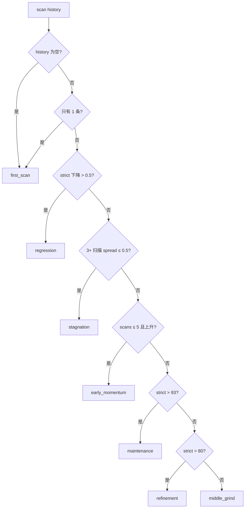
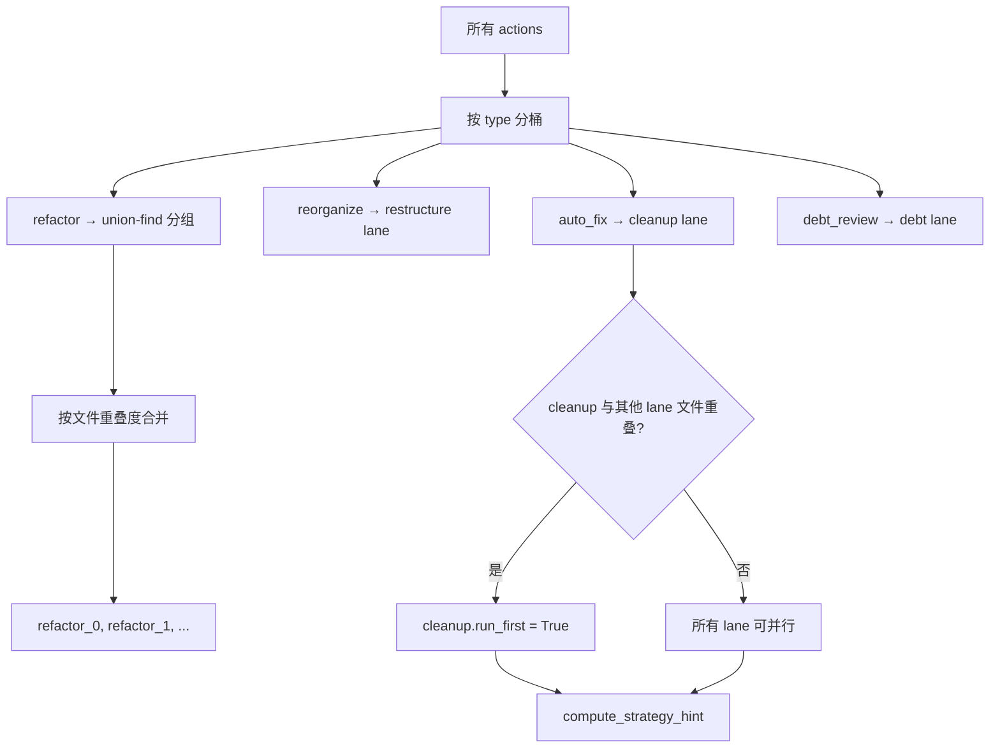
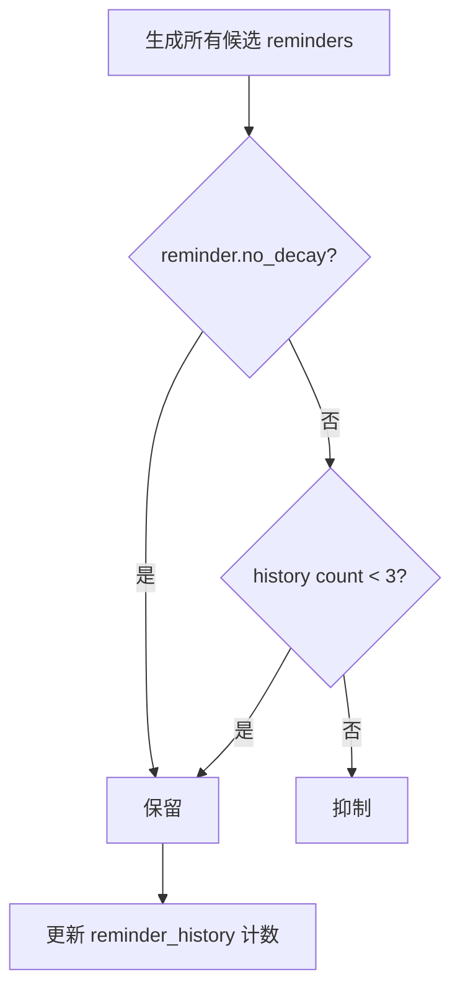

# PD-503.01 Desloppify — Narrative 驱动四阶段 Agent 引导与多 IDE 技能文档

> 文档编号：PD-503.01
> 来源：Desloppify `desloppify/intelligence/narrative/` + `desloppify/core/skill_docs.py`
> GitHub：https://github.com/peteromallet/desloppify.git
> 问题域：PD-503 AI Agent 引导系统 (AI Agent Guidance System)
> 状态：可复用方案

---

## 第 1 章 问题与动机（≥ 30 行）

### 1.1 核心问题

AI Agent（如 Claude Code、Cursor、Copilot）在执行代码质量修复任务时面临三个关键挑战：

1. **缺乏上下文感知的行动优先级**：Agent 不知道当前项目处于什么阶段（首次扫描？回归？停滞？），无法判断应该先做什么
2. **修复策略缺乏全局最优排序**：Agent 逐个处理 finding 时缺少"先自动修复再手动重构"的全局视角，也不知道哪些修复可以并行
3. **多 IDE 适配成本高**：每种 AI IDE 有不同的 skill doc 格式和安装路径，手动维护 7 种格式极易过时

Desloppify 的 narrative 系统是一个完整的 Agent 引导引擎：它不是简单地列出 findings，而是计算出结构化的"叙事"——包含阶段判断、策略建议、优先级排序、风险标记和上下文提醒——让 Agent 像有经验的工程师一样工作。

### 1.2 Desloppify 的解法概述

1. **六阶段生命周期检测**（`phase.py:10-50`）：基于 scan history 轨迹自动判断 `first_scan → early_momentum → middle_grind → refinement → maintenance`，以及异常态 `regression` 和 `stagnation`
2. **策略引擎计算并行工作车道**（`strategy_engine.py:183-252`）：用 union-find 算法按文件重叠度将 actions 分组为独立 lanes，判断是否可并行执行
3. **影响力驱动的 action 排序**（`action_engine.py:241-256`）：按 `type_order × impact` 双维度排序，auto_fix 优先于 manual_fix
4. **15+ 种上下文感知提醒**（`reminders.py:478-518`）：带衰减机制的提醒系统，避免重复唠叨
5. **7 种 AI IDE 技能文档适配**（`skill_docs.py:32-41`）：Claude/OpenCode/Codex/Cursor/Copilot/Windsurf/Gemini，版本化管理 + 自动更新

### 1.3 设计思想

| 设计原则 | 具体实现 | 理由 | 替代方案 |
|----------|----------|------|----------|
| 阶段感知引导 | 6 种 phase 各有不同 headline/strategy | Agent 在不同阶段需要不同的行动框架 | 固定优先级列表（无上下文） |
| 影响力排序 | `compute_score_impact()` 估算每个 action 对总分的贡献 | 让 Agent 总是做 ROI 最高的事 | 按 finding 数量排序 |
| 并行车道 | union-find 按文件重叠分组 | 不重叠的修复可以安全并行 | 串行执行所有修复 |
| 提醒衰减 | `_REMINDER_DECAY_THRESHOLD=3` 后自动抑制 | 避免 Agent 被重复提醒淹没 | 每次都显示所有提醒 |
| 多 IDE 适配 | overlay 模式 + section marker | 共享文件（AGENTS.md）不覆盖其他内容 | 每个 IDE 完全独立文件 |

---

## 第 2 章 源码实现分析（≥ 60 行，核心章节）

### 2.1 架构概览

Desloppify 的 narrative 系统是一个纯函数式计算管道，输入 `StateModel`，输出 `NarrativeResult`：

```
┌─────────────────────────────────────────────────────────────────┐
│                    compute_narrative(state)                       │
│                         core.py:315                              │
├─────────┬──────────┬───────────┬──────────┬──────────┬──────────┤
│ phase   │ actions  │ strategy  │ headline │ reminders│ risk_flags│
│ detect  │ compute  │ compute   │ compute  │ compute  │ compute  │
│ (phase  │ (action  │ (strategy │ (headline│ (remind  │ (core    │
│  .py)   │  _engine │  _engine  │  .py)    │  ers.py) │  .py)    │
│         │  .py)    │  .py)     │          │          │          │
├─────────┴──────────┴───────────┴──────────┴──────────┴──────────┤
│                     NarrativeResult (TypedDict)                  │
│  phase | headline | actions | strategy | tools | debt |          │
│  milestone | primary_action | why_now | verification_step |      │
│  risk_flags | strict_target | reminders | reminder_history       │
└─────────────────────────────────────────────────────────────────┘
```

12 个模块文件，职责清晰分离：
- `core.py` — 编排入口，组装所有子计算结果
- `phase.py` — 阶段检测 + 里程碑识别
- `action_engine.py` — action 计算 + 优先级排序
- `strategy_engine.py` — 并行车道 + 策略提示
- `reminders.py` — 上下文提醒 + 衰减
- `headline.py` — 终端显示的一句话摘要
- `dimensions.py` — 维度分析 + 债务计算
- `types.py` — 全部 TypedDict 定义
- `action_models.py` — Action/Tool 数据模型
- `action_tools.py` — 工具清单构建
- `_constants.py` — 共享常量 + detector 级联

### 2.2 核心实现

#### 2.2.1 六阶段生命周期检测



对应源码 `desloppify/intelligence/narrative/phase.py:10-50`：

```python
def _detect_phase(history: list[dict], strict_score: float | None) -> str:
    """Detect project phase from scan history trajectory."""
    if not history:
        return "first_scan"
    if len(history) == 1:
        return "first_scan"

    strict = strict_score
    if strict is None:
        strict = _history_strict(history[-1])

    # Check regression: strict dropped from previous scan
    prev = _history_strict(history[-2])
    curr = _history_strict(history[-1])
    if prev is not None and curr is not None and curr < prev - 0.5:
        return "regression"

    # Check stagnation: strict unchanged ±0.5 for 3+ scans
    if len(history) >= 3:
        recent = [_history_strict(h) for h in history[-3:]]
        if all(r is not None for r in recent):
            spread = max(recent) - min(recent)
            if spread <= 0.5:
                return "stagnation"

    # Early momentum: scans 2-5 with score rising
    if len(history) <= 5:
        first = _history_strict(history[0])
        last = _history_strict(history[-1])
        if first is not None and last is not None and last > first:
            return "early_momentum"

    if strict is not None:
        if strict > 93:
            return "maintenance"
        if strict > 80:
            return "refinement"

    return "middle_grind"
```

关键设计：regression 检测优先于 stagnation（先检测异常再检测停滞），early_momentum 在阈值判断之前（让早期项目获得激励性框架）。

#### 2.2.2 策略引擎：union-find 并行车道



对应源码 `desloppify/intelligence/narrative/strategy_engine.py:92-125`：

```python
def _group_by_file_overlap(
    action_files: list[tuple[dict[str, Any], set[str]]],
) -> list[list[tuple[dict[str, Any], set[str]]]]:
    """Group actions whose file sets overlap using union-find."""
    item_count = len(action_files)
    if item_count == 0:
        return []

    parent = list(range(item_count))

    def find(index: int) -> int:
        while parent[index] != index:
            parent[index] = parent[parent[index]]
            index = parent[index]
        return index

    def union(left: int, right: int) -> None:
        left_root, right_root = find(left), find(right)
        if left_root != right_root:
            parent[left_root] = right_root

    for left in range(item_count):
        for right in range(left + 1, item_count):
            if action_files[left][1] & action_files[right][1]:
                union(left, right)

    grouped_indices: dict[int, list[int]] = {}
    for index in range(item_count):
        grouped_indices.setdefault(find(index), []).append(index)

    return [
        [action_files[index] for index in indices]
        for indices in grouped_indices.values()
    ]
```

union-find 带路径压缩（`parent[index] = parent[parent[index]]`），O(n²) 比较文件集合交集。当 ≥2 个 significant lane 存在时，`can_parallelize=True`，策略提示会告知 Agent 可以并行工作。

#### 2.2.3 影响力驱动的 Action 排序

`action_engine.py:241-256` 的排序逻辑：

```python
def _assign_priorities(actions: list[ActionItem]) -> list[ActionItem]:
    type_order = {
        "issue_queue": 0, "auto_fix": 1, "reorganize": 2,
        "refactor": 3, "manual_fix": 4, "debt_review": 5,
    }
    actions.sort(
        key=lambda action: (type_order.get(action["type"], 9), -action.get("impact", 0))
    )
    for index, action in enumerate(actions, start=1):
        action["priority"] = index
    return actions
```

### 2.3 实现细节

#### 提醒衰减机制

`reminders.py:460-475` 实现了基于历史计数的衰减：



15 种提醒类型按优先级分 3 层：high（rescan_needed, review_findings_pending）、medium（wontfix_growing, stagnant_nudge）、low（badge_recommendation, feedback_nudge）。`report_scores` 设置 `no_decay=True` 永不衰减。

#### 多 IDE 技能文档系统

`skill_docs.py:32-41` 定义了 7 种 IDE 的安装目标：

| IDE | 目标文件 | 模式 |
|-----|----------|------|
| Claude | `.claude/skills/desloppify/SKILL.md` | dedicated（整文件覆盖） |
| OpenCode | `.opencode/skills/desloppify/SKILL.md` | dedicated |
| Codex | `AGENTS.md` | shared（section 替换） |
| Cursor | `.cursor/rules/desloppify.md` | dedicated |
| Copilot | `.github/copilot-instructions.md` | shared |
| Windsurf | `AGENTS.md` | shared |
| Gemini | `AGENTS.md` | shared |

版本化通过 HTML 注释 `<!-- desloppify-skill-version: N -->` 实现，`find_installed_skill()` 扫描所有可能路径检测已安装版本，`check_skill_version()` 在每次 scan 时提醒过时。


---

## 第 3 章 迁移指南（≥ 40 行）

### 3.1 迁移清单

**阶段 1：核心 Narrative 引擎（最小可用）**

- [ ] 定义 `Phase` 枚举：`first_scan | early_momentum | middle_grind | refinement | maintenance | regression | stagnation`
- [ ] 实现 `detect_phase(history, current_score)` — 基于历史轨迹判断阶段
- [ ] 定义 `ActionItem` TypedDict：`type | detector | count | description | command | impact | priority`
- [ ] 实现 `compute_actions(context)` — 按 type_order × impact 排序
- [ ] 实现 `compute_narrative(state)` — 编排入口，返回 `NarrativeResult`

**阶段 2：策略引擎（并行优化）**

- [ ] 实现 `open_files_by_detector(findings)` — 按 detector 收集文件集合
- [ ] 实现 `_group_by_file_overlap(action_files)` — union-find 分组
- [ ] 实现 `compute_lanes(actions, files_by_detector)` — 分配工作车道
- [ ] 实现 `compute_strategy_hint(fixer_leverage, lanes, can_parallelize, phase)` — 生成策略文本

**阶段 3：提醒系统（Agent 体验优化）**

- [ ] 定义 `_REMINDER_METADATA` 优先级/严重度映射
- [ ] 实现各类提醒生成器（auto_fixer, rescan, badge, stagnation 等）
- [ ] 实现 `_apply_decay(reminders, history)` — 衰减抑制
- [ ] 实现 `_decorate_reminder_metadata(reminders)` — 排序装饰

**阶段 4：多 IDE 技能文档（可选）**

- [ ] 定义 `SKILL_TARGETS` 映射表
- [ ] 实现 `find_installed_skill()` — 扫描检测已安装版本
- [ ] 实现 `update_installed_skill(interface)` — 下载 + 安装/更新
- [ ] 实现 section marker 替换逻辑（shared 文件模式）

### 3.2 适配代码模板

以下是一个可直接运行的最小 Narrative 引擎实现：

```python
"""Minimal narrative engine — portable from Desloppify."""
from __future__ import annotations
from dataclasses import dataclass
from typing import Any, TypedDict

class ActionItem(TypedDict, total=False):
    priority: int
    type: str  # auto_fix | manual_fix | reorganize | refactor | debt_review
    detector: str | None
    count: int
    description: str
    command: str
    impact: float

class NarrativeResult(TypedDict):
    phase: str
    headline: str | None
    actions: list[ActionItem]
    strategy_hint: str
    can_parallelize: bool

_TYPE_ORDER = {"auto_fix": 1, "reorganize": 2, "refactor": 3, "manual_fix": 4, "debt_review": 5}

def detect_phase(history: list[dict], strict_score: float | None) -> str:
    if len(history) <= 1:
        return "first_scan"
    prev = history[-2].get("strict_score")
    curr = history[-1].get("strict_score")
    if prev is not None and curr is not None and curr < prev - 0.5:
        return "regression"
    if len(history) >= 3:
        recent = [h.get("strict_score") for h in history[-3:]]
        if all(r is not None for r in recent) and max(recent) - min(recent) <= 0.5:
            return "stagnation"
    if strict_score is not None and strict_score > 93:
        return "maintenance"
    return "middle_grind"

def assign_priorities(actions: list[ActionItem]) -> list[ActionItem]:
    actions.sort(key=lambda a: (_TYPE_ORDER.get(a["type"], 9), -a.get("impact", 0)))
    for i, action in enumerate(actions, 1):
        action["priority"] = i
    return actions

def group_by_file_overlap(items: list[tuple[dict, set[str]]]) -> list[list[tuple[dict, set[str]]]]:
    """Union-find grouping by file overlap."""
    n = len(items)
    parent = list(range(n))
    def find(x):
        while parent[x] != x:
            parent[x] = parent[parent[x]]
            x = parent[x]
        return x
    for i in range(n):
        for j in range(i + 1, n):
            if items[i][1] & items[j][1]:
                ri, rj = find(i), find(j)
                if ri != rj:
                    parent[ri] = rj
    groups: dict[int, list[int]] = {}
    for i in range(n):
        groups.setdefault(find(i), []).append(i)
    return [[items[i] for i in idxs] for idxs in groups.values()]

def compute_narrative(state: dict) -> NarrativeResult:
    history = state.get("scan_history", [])
    strict = state.get("strict_score")
    phase = detect_phase(history, strict)
    actions = assign_priorities(state.get("raw_actions", []))
    n_lanes = len(group_by_file_overlap(
        [(a, set(a.get("files", []))) for a in actions if a.get("type") != "auto_fix"]
    ))
    can_par = n_lanes >= 2
    hint = f"{n_lanes} independent lanes, safe to parallelize." if can_par else "Work in priority order."
    return {
        "phase": phase,
        "headline": f"Phase: {phase}, {len(actions)} actions queued.",
        "actions": actions,
        "strategy_hint": hint,
        "can_parallelize": can_par,
    }
```

### 3.3 适用场景

| 场景 | 适用度 | 说明 |
|------|--------|------|
| AI Agent 代码质量修复 | ⭐⭐⭐ | 核心场景，narrative 直接驱动 Agent 行为 |
| CI/CD 质量门禁 | ⭐⭐⭐ | phase 检测 + strict_target 可作为 gate 条件 |
| 多 IDE 工具分发 | ⭐⭐⭐ | skill_docs 的 overlay 模式直接可用 |
| 人类开发者 dashboard | ⭐⭐ | headline + risk_flags 适合展示，但 actions 偏 Agent 导向 |
| 实时协作编辑 | ⭐ | narrative 是批量计算，不适合实时增量更新 |

---

## 第 4 章 测试用例（≥ 20 行）

```python
import pytest

class TestPhaseDetection:
    def test_first_scan_empty_history(self):
        assert detect_phase([], None) == "first_scan"

    def test_first_scan_single_entry(self):
        assert detect_phase([{"strict_score": 50}], 50) == "first_scan"

    def test_regression_detected(self):
        history = [{"strict_score": 80}, {"strict_score": 78}]
        assert detect_phase(history, 78) == "regression"

    def test_regression_not_triggered_small_drop(self):
        history = [{"strict_score": 80}, {"strict_score": 79.8}]
        assert detect_phase(history, 79.8) != "regression"

    def test_stagnation_three_scans(self):
        history = [{"strict_score": 75}, {"strict_score": 75.2}, {"strict_score": 75.1}]
        assert detect_phase(history, 75.1) == "stagnation"

    def test_maintenance_high_score(self):
        history = [{"strict_score": 90}, {"strict_score": 94}]
        assert detect_phase(history, 94) == "maintenance"

class TestUnionFindGrouping:
    def test_no_overlap_separate_groups(self):
        items = [
            ({"name": "a"}, {"file1.py"}),
            ({"name": "b"}, {"file2.py"}),
        ]
        groups = group_by_file_overlap(items)
        assert len(groups) == 2

    def test_overlap_merged(self):
        items = [
            ({"name": "a"}, {"file1.py", "file2.py"}),
            ({"name": "b"}, {"file2.py", "file3.py"}),
        ]
        groups = group_by_file_overlap(items)
        assert len(groups) == 1

    def test_transitive_overlap(self):
        items = [
            ({"name": "a"}, {"f1.py"}),
            ({"name": "b"}, {"f1.py", "f2.py"}),
            ({"name": "c"}, {"f2.py"}),
        ]
        groups = group_by_file_overlap(items)
        assert len(groups) == 1

class TestActionPriority:
    def test_auto_fix_before_manual(self):
        actions = [
            {"type": "manual_fix", "impact": 5.0},
            {"type": "auto_fix", "impact": 3.0},
        ]
        result = assign_priorities(actions)
        assert result[0]["type"] == "auto_fix"
        assert result[0]["priority"] == 1

    def test_same_type_sorted_by_impact(self):
        actions = [
            {"type": "refactor", "impact": 2.0},
            {"type": "refactor", "impact": 8.0},
        ]
        result = assign_priorities(actions)
        assert result[0]["impact"] == 8.0

class TestReminderDecay:
    def test_reminder_suppressed_after_threshold(self):
        reminders = [{"type": "badge_recommendation", "message": "test"}]
        history = {"badge_recommendation": 3}
        from desloppify.intelligence.narrative.reminders import _apply_decay
        filtered, _ = _apply_decay(reminders, history)
        assert len(filtered) == 0

    def test_no_decay_reminder_always_shown(self):
        reminders = [{"type": "report_scores", "message": "test", "no_decay": True}]
        history = {"report_scores": 100}
        from desloppify.intelligence.narrative.reminders import _apply_decay
        filtered, _ = _apply_decay(reminders, history)
        assert len(filtered) == 1
```


---

## 第 5 章 跨域关联

| 关联域 | 关系类型 | 说明 |
|--------|----------|------|
| PD-01 上下文管理 | 协同 | narrative 的 headline/reminders 是 Agent 上下文的一部分，需要控制输出长度避免占用过多 context window |
| PD-04 工具系统 | 依赖 | action_engine 依赖 `DETECTOR_TOOLS` 注册表来生成 auto_fix/reorganize/refactor actions，工具系统的注册机制直接影响 narrative 输出 |
| PD-07 质量检查 | 协同 | narrative 的 phase 检测和 strict_target 本质上是质量门禁的一种形式，milestone 检测（crossed 90%）是质量检查的正向反馈 |
| PD-10 中间件管道 | 协同 | narrative 的 compute_narrative() 本身是一个管道式计算（phase → actions → strategy → headline → reminders），可以用中间件模式扩展 |
| PD-11 可观测性 | 依赖 | narrative 消费 scan_history、dimension_scores、stats 等可观测性数据来做阶段判断和趋势分析 |

---

## 第 6 章 来源文件索引

| 文件 | 行范围 | 关键实现 |
|------|--------|----------|
| `desloppify/intelligence/narrative/core.py` | L315-L391 | `compute_narrative()` 编排入口，组装 14 个子计算结果 |
| `desloppify/intelligence/narrative/phase.py` | L10-L50 | `_detect_phase()` 六阶段生命周期检测 |
| `desloppify/intelligence/narrative/phase.py` | L53-L90 | `_detect_milestone()` 里程碑识别（crossed 90%、T1 cleared 等） |
| `desloppify/intelligence/narrative/strategy_engine.py` | L92-L125 | `_group_by_file_overlap()` union-find 并行分组 |
| `desloppify/intelligence/narrative/strategy_engine.py` | L183-L252 | `compute_lanes()` 工作车道分配 |
| `desloppify/intelligence/narrative/strategy_engine.py` | L261-L296 | `compute_strategy_hint()` 策略文本生成 |
| `desloppify/intelligence/narrative/strategy_engine.py` | L31-L68 | `compute_fixer_leverage()` 自动修复覆盖率估算 |
| `desloppify/intelligence/narrative/action_engine.py` | L241-L256 | `_assign_priorities()` 双维度排序 |
| `desloppify/intelligence/narrative/action_engine.py` | L306-L319 | `compute_actions()` action 计算入口 |
| `desloppify/intelligence/narrative/action_engine.py` | L91-L144 | `_append_auto_fix_actions()` 自动修复 action 生成 |
| `desloppify/intelligence/narrative/reminders.py` | L460-L475 | `_apply_decay()` 提醒衰减机制 |
| `desloppify/intelligence/narrative/reminders.py` | L478-L518 | `_compute_reminders()` 15 种提醒编排 |
| `desloppify/intelligence/narrative/reminders.py` | L402-L423 | `_REMINDER_METADATA` 优先级/严重度映射表 |
| `desloppify/intelligence/narrative/headline.py` | L8-L157 | `_compute_headline()` 阶段感知的一句话摘要 |
| `desloppify/intelligence/narrative/dimensions.py` | L15-L25 | `_analyze_dimensions()` 维度分析入口 |
| `desloppify/intelligence/narrative/dimensions.py` | L166-L217 | `_analyze_debt()` wontfix 债务分析 |
| `desloppify/intelligence/narrative/types.py` | L140-L158 | `NarrativeResult` 完整输出类型定义 |
| `desloppify/intelligence/narrative/action_models.py` | L20-L32 | `ActionItem` TypedDict 定义 |
| `desloppify/intelligence/narrative/action_tools.py` | L56-L79 | `compute_tools()` 工具清单构建 |
| `desloppify/intelligence/narrative/_constants.py` | L30-L36 | `STRUCTURAL_MERGE` + `_DETECTOR_CASCADE` 级联定义 |
| `desloppify/core/skill_docs.py` | L32-L41 | `SKILL_TARGETS` 7 种 IDE 安装目标映射 |
| `desloppify/core/skill_docs.py` | L54-L77 | `find_installed_skill()` 版本检测 |
| `desloppify/app/commands/update_skill.py` | L86-L127 | `update_installed_skill()` 下载 + 安装逻辑 |

---

## 第 7 章 横向对比维度

```json comparison_data
{
  "project": "Desloppify",
  "dimensions": {
    "引导架构": "Narrative 纯函数管道：state → phase/actions/strategy/reminders 一次计算",
    "阶段检测": "6 阶段生命周期（first_scan → maintenance + regression/stagnation）基于 strict_score 轨迹",
    "策略计算": "union-find 按文件重叠分组为并行 lanes，fixer_leverage 估算自动修复覆盖率",
    "Action 排序": "type_order × impact 双维度排序，auto_fix 优先于 manual_fix",
    "提醒系统": "15 种上下文提醒 + 3 级优先级 + 计数衰减（threshold=3）+ no_decay 豁免",
    "多 IDE 适配": "7 种 IDE skill doc（Claude/Cursor/Codex/Copilot/Windsurf/Gemini/OpenCode）+ 版本化 + overlay 模式",
    "风险标记": "ignore_suppression + wontfix_gap 双维度风险检测，按 severity 排序"
  }
}
```

### 域元数据补充

```json domain_metadata
{
  "solution_summary": "Desloppify 用纯函数 Narrative 管道（phase→actions→strategy→reminders）为 Agent 生成结构化行动指引，union-find 计算并行修复车道，15 种衰减提醒避免信息过载，7 种 IDE skill doc 版本化适配",
  "description": "为 AI Agent 生成阶段感知的结构化行动叙事，包含优先级排序、并行策略和上下文提醒",
  "sub_problems": [
    "Fixer leverage estimation for auto-fix coverage",
    "Reminder decay to prevent Agent information overload",
    "Headline generation adapting to project lifecycle phase",
    "Wontfix debt trend analysis and stale decision detection"
  ],
  "best_practices": [
    "Union-find grouping by file overlap for parallel lane detection",
    "Phase-aware strategy hints with regression/stagnation special handling",
    "Dedicated vs shared file modes for multi-IDE skill doc installation"
  ]
}
```

<!-- desloppify-end -->
