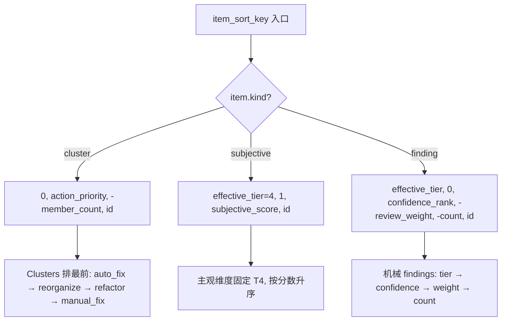
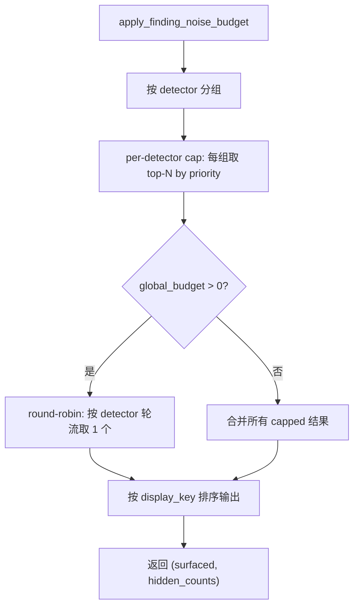
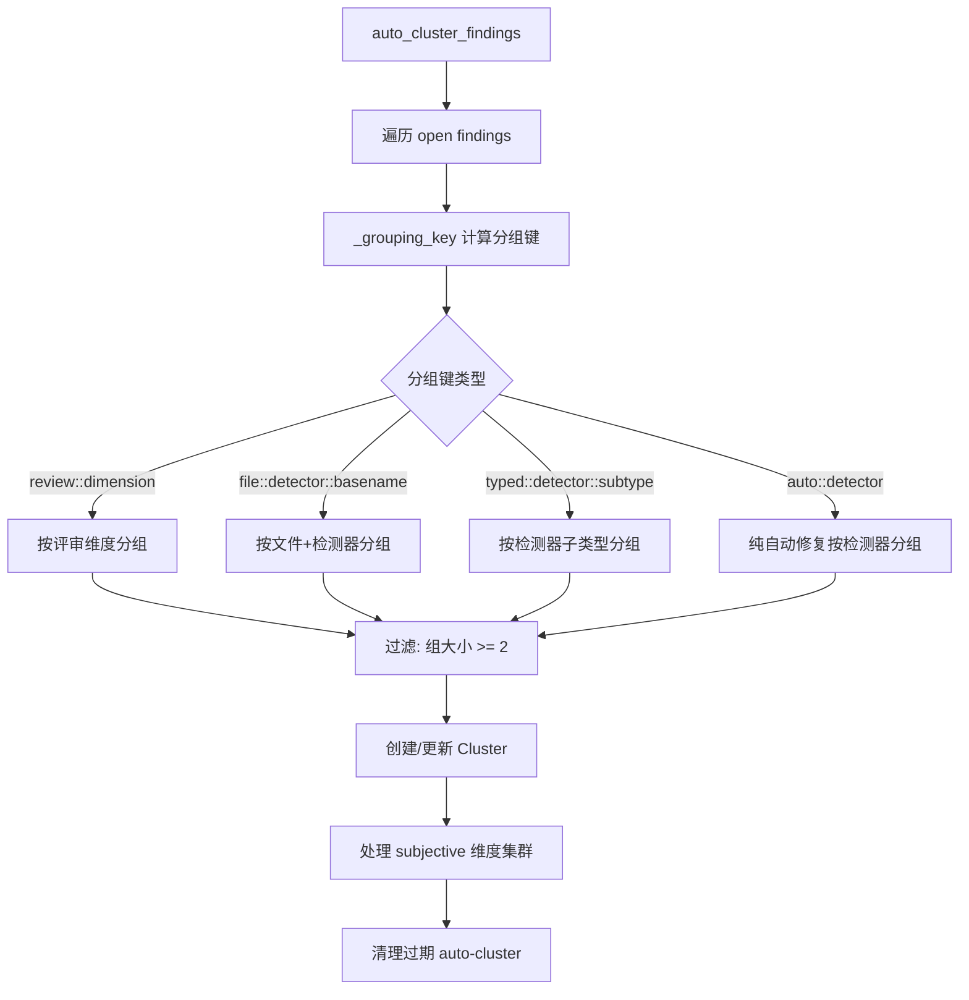

# PD-504.01 Desloppify — 多维排序工作队列与自动聚类计划系统

> 文档编号：PD-504.01
> 来源：Desloppify `desloppify/engine/_work_queue/`, `desloppify/engine/_plan/`
> GitHub：https://github.com/peteromallet/desloppify.git
> 问题域：PD-504 工作队列与优先级排序 Work Queue & Prioritization
> 状态：可复用方案

---

## 第 1 章 问题与动机

### 1.1 核心问题

代码质量工具扫描后往往产生数十甚至数百条 findings（发现），直接全量展示会导致两个问题：

1. **信息过载**：Agent 或人类面对 200+ findings 无法判断从哪里开始，决策瘫痪
2. **优先级缺失**：不同 findings 的影响力差异巨大（T1 安全漏洞 vs T4 主观风格），平铺展示浪费注意力
3. **关联性丢失**：同一 detector 的多个 findings 本质上是同一类问题，逐个处理效率低下
4. **计划僵化**：传统 TODO 列表无法表达 skip/defer/focus/move 等灵活的工作流操作

Desloppify 的工作队列系统正是为了解决这些问题：将扫描结果转化为一个有优先级、可操作、可调整的工作计划。

### 1.2 Desloppify 的解法概述

1. **四层 Tier 排序**：findings 按 tier(1-4) → confidence(high/medium/low) → count → id 多维排序，确保最高影响力的问题排在最前（`_work_queue/ranking.py:86-118`）
2. **双层噪声预算**：per-detector budget + global round-robin budget 两层过滤，防止单个 detector 霸占输出（`_state/noise.py:112-198`）
3. **自动聚类**：`auto_cluster_findings` 按 detector/subtype/file 维度自动将相关 findings 分组为 cluster，减少认知负担（`_plan/auto_cluster.py:223-470`）
4. **Living Plan 系统**：支持 focus/skip/defer/move/describe/annotate 六种操作，plan 是活的、可持续调整的（`_plan/operations.py:1-453`）
5. **Cluster 折叠**：work queue 输出时将 auto-cluster 成员折叠为单个 meta-item，进一步降低信息密度（`_work_queue/core.py:172-251`）

### 1.3 设计思想

| 设计原则 | 具体实现 | 理由 | 替代方案 |
|----------|----------|------|----------|
| 多维排序优于单维 | tier → confidence → review_weight → count → id 五级排序键 | 单维排序无法区分同 tier 内的优先级差异 | 单一 score 加权（丢失可解释性） |
| 噪声预算双层控制 | per-detector cap + global round-robin | 单层 cap 无法防止 detector 数量爆炸 | 全局 top-N（不公平，大 detector 霸占） |
| 自动聚类 + 手动覆盖 | auto/ 前缀自动集群 + user_modified 标记保护 | 自动化减少手动工作，但保留人类控制权 | 纯手动分组（太慢）或纯自动（不灵活） |
| Plan 与 State 分离 | PlanModel 独立于 StateModel，通过 reconcile 同步 | Plan 是用户意图，State 是客观事实，混合会导致冲突 | 单一数据模型（plan 操作会污染扫描状态） |
| 主观维度降级 | subjective findings 强制 T4，不与机械 T1-T3 竞争 | 主观评估不应阻塞客观可修复的问题 | 混合排序（主观高分可能排在安全漏洞前面） |

---

## 第 2 章 源码实现分析

### 2.1 架构概览

Desloppify 的工作队列系统由三个核心子系统组成：

```
┌─────────────────────────────────────────────────────────────────┐
│                     build_work_queue()                          │
│                   (core.py — 统一入口)                           │
├─────────────┬──────────────────┬────────────────────────────────┤
│  Ranking    │   Noise Budget   │        Plan Integration        │
│  (排序引擎)  │   (噪声控制)      │        (计划系统)               │
├─────────────┼──────────────────┼────────────────────────────────┤
│ ranking.py  │   noise.py       │  operations.py                 │
│ • item_sort │ • per-detector   │  • move/skip/focus/describe    │
│   _key()    │   budget cap     │  auto_cluster.py               │
│ • tier →    │ • global round-  │  • _grouping_key()             │
│   conf →    │   robin budget   │  • auto_cluster_findings()     │
│   weight →  │ • priority-based │  reconcile.py                  │
│   count     │   selection      │  • supersede stale findings    │
│ helpers.py  │                  │  schema.py                     │
│ • scope     │                  │  • PlanModel / Cluster /       │
│   matching  │                  │    SkipEntry TypedDicts         │
│ • subjective│                  │  stale_dimensions.py           │
│   items     │                  │  • unscored/stale sync         │
└─────────────┴──────────────────┴────────────────────────────────┘
```

数据流：

```
State (findings) ──→ build_finding_items() ──→ item_sort_key() 排序
                                                      │
                                              ┌───────▼────────┐
                                              │ _apply_plan_   │
                                              │ order()        │
                                              │ (queue_order   │
                                              │  + skipped)    │
                                              └───────┬────────┘
                                                      │
                                              ┌───────▼────────┐
                                              │ _collapse_     │
                                              │ clusters()     │
                                              │ (auto-cluster  │
                                              │  → meta-item)  │
                                              └───────┬────────┘
                                                      │
                                              ┌───────▼────────┐
                                              │ tier filter +  │
                                              │ count limit    │
                                              └───────┬────────┘
                                                      ▼
                                              WorkQueueResult
```

### 2.2 核心实现

#### 2.2.1 多维排序引擎



对应源码 `desloppify/engine/_work_queue/ranking.py:86-118`：

```python
_CLUSTER_ACTION_PRIORITY = {"auto_fix": 0, "reorganize": 1, "refactor": 2, "manual_fix": 3}

def item_sort_key(item: dict) -> tuple:
    if item.get("kind") == "cluster":
        action_pri = _CLUSTER_ACTION_PRIORITY.get(
            item.get("action_type", "manual_fix"), 3
        )
        return (
            0,  # All clusters before all individual findings
            action_pri,
            -int(item.get("member_count", 0)),
            item.get("id", ""),
        )

    if item.get("kind") == "subjective_dimension" or item.get("is_subjective"):
        return (
            int(item.get("effective_tier", 4)),
            1,  # Subjective items sort after mechanical items within T4.
            subjective_score_value(item),
            item.get("id", ""),
        )

    detail = detail_dict(item)
    review_weight = float(item.get("review_weight", 0.0) or 0.0)
    return (
        int(item.get("effective_tier", item.get("tier", 3))),
        0,
        CONFIDENCE_ORDER.get(item.get("confidence", "low"), 9),
        -review_weight,
        -int(detail.get("count", 0) or 0),
        item.get("id", ""),
    )
```

排序键设计的精妙之处：
- **tuple 比较**：Python tuple 天然支持多级排序，无需自定义 comparator
- **cluster 优先**：第一位固定为 0，确保 cluster meta-item 永远排在散装 findings 前面
- **主观降级**：`effective_tier` 强制为 4，且第二位为 1（机械 findings 为 0），双重保证主观不抢占

#### 2.2.2 双层噪声预算



对应源码 `desloppify/engine/_state/noise.py:129-166`：

```python
def _round_robin_global_budget(
    capped_by_detector: dict[str, list[dict]], global_budget: int
) -> tuple[list[dict], dict[str, int]]:
    surfaced: list[dict] = []
    hidden_after_global: dict[str, int] = {}

    detector_order = sorted(
        capped_by_detector.keys(),
        key=lambda detector: (
            _finding_priority_key(capped_by_detector[detector][0])
            if capped_by_detector[detector]
            else (9, 9, ""),
            detector,
        ),
    )
    consumed: dict[str, int] = {detector: 0 for detector in detector_order}

    while len(surfaced) < global_budget:
        progressed = False
        for detector in detector_order:
            idx = consumed[detector]
            detector_items = capped_by_detector[detector]
            if idx >= len(detector_items):
                continue
            surfaced.append(detector_items[idx])
            consumed[detector] = idx + 1
            progressed = True
            if len(surfaced) >= global_budget:
                break
        if not progressed:
            break

    for detector, detector_items in capped_by_detector.items():
        dropped = len(detector_items) - consumed.get(detector, 0)
        if dropped > 0:
            hidden_after_global[detector] = dropped

    return surfaced, hidden_after_global
```

Round-robin 的关键设计：
- **公平性**：每轮每个 detector 只取 1 个，防止大 detector 霸占全局预算
- **优先级保留**：detector 内部已按 `_finding_priority_key` 排序，round-robin 取的是每个 detector 最重要的
- **detector 排序**：detector 本身也按其最高优先级 finding 排序，确保高影响 detector 先被轮到

#### 2.2.3 自动聚类算法



对应源码 `desloppify/engine/_plan/auto_cluster.py:53-92`（分组键计算）：

```python
def _grouping_key(finding: dict, meta: DetectorMeta | None) -> str | None:
    detector = finding.get("detector", "")

    if meta is None:
        return f"detector::{detector}"

    # Review findings → group by dimension
    if detector in ("review", "subjective_review"):
        detail = finding.get("detail") or {}
        dimension = detail.get("dimension", "")
        if dimension:
            return f"review::{dimension}"
        return f"detector::{detector}"

    # Per-file detectors (structural, responsibility_cohesion)
    if meta.needs_judgment and detector in (
        "structural", "responsibility_cohesion",
    ):
        file = finding.get("file", "")
        if file:
            basename = os.path.basename(file)
            return f"file::{detector}::{basename}"

    # Needs-judgment detectors — group by subtype when available
    if meta.needs_judgment:
        subtype = _extract_subtype(finding)
        if subtype:
            return f"typed::{detector}::{subtype}"

    # Pure auto-fix (no judgment needed) → all findings by detector
    if meta.action_type == "auto_fix" and not meta.needs_judgment:
        return f"auto::{detector}"

    return f"detector::{detector}"
```

分组键的层次设计：
- **review findings** 按评审维度聚合（如 "abstraction_fitness" 维度的所有 findings 归为一组）
- **结构性 findings** 按文件聚合（同一个大文件的多个结构问题归为一组）
- **需判断的 findings** 按子类型聚合（如 dict_keys detector 的 phantom_read 子类型）
- **纯自动修复** 按 detector 聚合（如所有 unused imports 归为一组）

### 2.3 实现细节

#### Plan 操作系统

`operations.py` 实现了完整的 plan 操作集，核心操作包括：

- **move_items** (`operations.py:95-123`)：支持 top/bottom/before/after/up/down 六种位置指定，通过 `_resolve_position` 统一解析
- **skip_items** (`operations.py:130-159`)：三种 skip 类型 — temporary（可自动恢复）、permanent（需 attestation）、false_positive
- **set_focus** (`operations.py:378-383`)：设置 active_cluster，后续 build_work_queue 自动过滤到该 cluster 的成员
- **resurface_stale_skips** (`operations.py:186-209`)：基于 scan_count 的自动恢复机制，temporary skip 在 N 次扫描后自动回到队列

#### Cluster 折叠机制

`_collapse_clusters` (`core.py:172-251`) 将 auto-cluster 的成员替换为单个 meta-item：

- 单成员 cluster 不折叠（保持为独立 finding）
- meta-item 的 `action_type` 从 cluster action 推导（`desloppify fix` → auto_fix，`desloppify move` → reorganize）
- meta-item 包含 `members` 列表，支持展开查看

#### Plan-State 协调

`reconcile_plan_after_scan` (`reconcile.py:124-176`) 在每次扫描后同步 plan 与 state：

- 检测 plan 中引用但 state 中已消失的 findings，移入 `superseded` 记录
- 自动恢复过期的 temporary skips
- 清理超过 90 天的 superseded 记录

---

## 第 3 章 迁移指南

### 3.1 迁移清单

**阶段 1：基础排序引擎**
- [ ] 定义 finding 数据结构（至少包含 id, tier, confidence, detector, file, status）
- [ ] 实现 `item_sort_key` 多维排序函数（tuple-based）
- [ ] 实现 `build_finding_items` 从 state 构建排序后的 item 列表

**阶段 2：噪声预算**
- [ ] 实现 per-detector budget cap（`_cap_detector_groups`）
- [ ] 实现 global round-robin budget（`_round_robin_global_budget`）
- [ ] 添加配置解析（`resolve_finding_noise_settings`）

**阶段 3：自动聚类**
- [ ] 定义 Cluster TypedDict（name, finding_ids, auto, cluster_key, action）
- [ ] 实现 `_grouping_key` 分组键计算
- [ ] 实现 `auto_cluster_findings` 主算法
- [ ] 实现 cluster 折叠（`_collapse_clusters`）

**阶段 4：Plan 操作**
- [ ] 定义 PlanModel TypedDict（queue_order, skipped, clusters, overrides）
- [ ] 实现 move/skip/unskip/focus/describe/annotate 操作
- [ ] 实现 plan-state reconciliation

### 3.2 适配代码模板

以下是一个可直接运行的最小工作队列实现：

```python
"""Minimal work queue with multi-dimensional ranking and noise budget."""
from __future__ import annotations
from dataclasses import dataclass
from collections import defaultdict
from typing import TypedDict

# --- Tier/Confidence constants ---
CONFIDENCE_ORDER = {"high": 0, "medium": 1, "low": 2}

class Finding(TypedDict):
    id: str
    tier: int          # 1-4, lower = more critical
    confidence: str    # "high" | "medium" | "low"
    detector: str
    file: str
    status: str        # "open" | "fixed" | "skipped"
    summary: str

# --- Multi-dimensional sort key (mirrors Desloppify ranking.py) ---
def item_sort_key(finding: Finding) -> tuple:
    return (
        finding.get("tier", 3),
        CONFIDENCE_ORDER.get(finding.get("confidence", "low"), 9),
        finding.get("id", ""),
    )

# --- Noise budget (mirrors Desloppify noise.py) ---
def apply_noise_budget(
    findings: list[Finding],
    per_detector_budget: int = 10,
    global_budget: int = 0,
) -> tuple[list[Finding], dict[str, int]]:
    """Cap findings per detector, then apply global round-robin."""
    # Group by detector
    grouped: dict[str, list[Finding]] = defaultdict(list)
    for f in findings:
        grouped[f["detector"]].append(f)

    # Per-detector cap
    capped: dict[str, list[Finding]] = {}
    hidden: dict[str, int] = {}
    for det, items in grouped.items():
        items.sort(key=item_sort_key)
        if per_detector_budget > 0:
            capped[det] = items[:per_detector_budget]
            overflow = len(items) - per_detector_budget
            if overflow > 0:
                hidden[det] = overflow
        else:
            capped[det] = items

    # Global round-robin
    if global_budget > 0:
        surfaced: list[Finding] = []
        det_order = sorted(capped.keys())
        consumed = {d: 0 for d in det_order}
        while len(surfaced) < global_budget:
            progressed = False
            for det in det_order:
                idx = consumed[det]
                if idx < len(capped[det]):
                    surfaced.append(capped[det][idx])
                    consumed[det] += 1
                    progressed = True
                    if len(surfaced) >= global_budget:
                        break
            if not progressed:
                break
        for det, items in capped.items():
            dropped = len(items) - consumed.get(det, 0)
            if dropped > 0:
                hidden[det] = hidden.get(det, 0) + dropped
        return surfaced, hidden

    all_items = [f for items in capped.values() for f in items]
    all_items.sort(key=item_sort_key)
    return all_items, hidden

# --- Auto-clustering (simplified from Desloppify auto_cluster.py) ---
@dataclass
class Cluster:
    name: str
    finding_ids: list[str]
    description: str = ""
    auto: bool = True

def auto_cluster(findings: list[Finding], min_size: int = 2) -> list[Cluster]:
    """Group findings by detector into clusters."""
    groups: dict[str, list[str]] = defaultdict(list)
    for f in findings:
        if f["status"] == "open":
            groups[f["detector"]].append(f["id"])

    clusters = []
    for detector, ids in groups.items():
        if len(ids) >= min_size:
            clusters.append(Cluster(
                name=f"auto/{detector}",
                finding_ids=ids,
                description=f"Fix {len(ids)} {detector} issues",
            ))
    return clusters
```

### 3.3 适用场景

| 场景 | 适用度 | 说明 |
|------|--------|------|
| 代码质量工具（linter/scanner） | ⭐⭐⭐ | 核心场景，findings 天然有 tier/confidence/detector 维度 |
| Agent 任务调度 | ⭐⭐⭐ | 多维排序 + 噪声预算可直接用于 Agent 工作项排序 |
| Bug tracker 优先级排序 | ⭐⭐ | 需要适配 tier/confidence 到 severity/priority 映射 |
| 搜索结果排序 | ⭐ | 噪声预算的 round-robin 思路可借鉴，但排序维度差异大 |
| 日志告警聚合 | ⭐⭐⭐ | auto-cluster 的分组键设计非常适合告警去重和聚合 |

---

## 第 4 章 测试用例

```python
"""Tests for work queue ranking, noise budget, and auto-clustering."""
import pytest
from collections import defaultdict


# --- Test fixtures ---

def make_finding(
    id: str, tier: int = 2, confidence: str = "medium",
    detector: str = "unused", file: str = "app.py", status: str = "open",
) -> dict:
    return {
        "id": id, "tier": tier, "confidence": confidence,
        "detector": detector, "file": file, "status": status,
        "summary": f"Finding {id}",
    }


# --- Ranking tests ---

class TestItemSortKey:
    def test_tier_ordering(self):
        """T1 findings sort before T3."""
        t1 = make_finding("a", tier=1)
        t3 = make_finding("b", tier=3)
        items = sorted([t3, t1], key=lambda f: (f["tier"], f["id"]))
        assert items[0]["id"] == "a"

    def test_confidence_within_tier(self):
        """High confidence sorts before low within same tier."""
        CONFIDENCE_ORDER = {"high": 0, "medium": 1, "low": 2}
        high = make_finding("a", tier=2, confidence="high")
        low = make_finding("b", tier=2, confidence="low")
        items = sorted(
            [low, high],
            key=lambda f: (f["tier"], CONFIDENCE_ORDER[f["confidence"]], f["id"]),
        )
        assert items[0]["id"] == "a"

    def test_subjective_forced_t4(self):
        """Subjective findings are always effective tier 4."""
        subjective = make_finding("s", tier=1, detector="subjective_assessment")
        effective_tier = 4 if subjective["detector"] == "subjective_assessment" else subjective["tier"]
        assert effective_tier == 4


# --- Noise budget tests ---

class TestNoiseBudget:
    def test_per_detector_cap(self):
        """Per-detector budget caps each detector independently."""
        findings = [make_finding(f"f{i}", detector="unused") for i in range(20)]
        findings += [make_finding(f"g{i}", detector="smells") for i in range(5)]

        grouped = defaultdict(list)
        for f in findings:
            grouped[f["detector"]].append(f)

        budget = 10
        capped = {det: items[:budget] for det, items in grouped.items()}
        assert len(capped["unused"]) == 10
        assert len(capped["smells"]) == 5

    def test_round_robin_fairness(self):
        """Global round-robin gives each detector fair representation."""
        det_a = [make_finding(f"a{i}", detector="det_a") for i in range(10)]
        det_b = [make_finding(f"b{i}", detector="det_b") for i in range(10)]
        all_findings = {"det_a": det_a, "det_b": det_b}

        surfaced = []
        consumed = {"det_a": 0, "det_b": 0}
        global_budget = 6
        det_order = sorted(all_findings.keys())

        while len(surfaced) < global_budget:
            for det in det_order:
                idx = consumed[det]
                if idx < len(all_findings[det]):
                    surfaced.append(all_findings[det][idx])
                    consumed[det] += 1
                    if len(surfaced) >= global_budget:
                        break

        # Each detector should get 3 items (6 / 2 detectors)
        a_count = sum(1 for f in surfaced if f["detector"] == "det_a")
        b_count = sum(1 for f in surfaced if f["detector"] == "det_b")
        assert a_count == 3
        assert b_count == 3

    def test_zero_budget_returns_all(self):
        """Budget of 0 means no cap."""
        findings = [make_finding(f"f{i}") for i in range(50)]
        # budget <= 0 means no filtering
        assert len(findings) == 50


# --- Auto-clustering tests ---

class TestAutoCluster:
    def test_groups_by_detector(self):
        """Findings from same detector are grouped together."""
        findings = [
            make_finding("a1", detector="unused"),
            make_finding("a2", detector="unused"),
            make_finding("b1", detector="smells"),
        ]
        groups = defaultdict(list)
        for f in findings:
            if f["status"] == "open":
                groups[f["detector"]].append(f["id"])

        # unused has 2 members (>= min_size=2), smells has 1
        assert len(groups["unused"]) == 2
        assert len(groups["smells"]) == 1

    def test_singleton_not_clustered(self):
        """Groups with < min_size are not turned into clusters."""
        groups = {"unused": ["a1", "a2"], "smells": ["b1"]}
        min_size = 2
        clusters = {k: v for k, v in groups.items() if len(v) >= min_size}
        assert "unused" in clusters
        assert "smells" not in clusters

    def test_user_modified_preserved(self):
        """User-modified clusters are not overwritten by auto-clustering."""
        cluster = {"name": "auto/unused", "finding_ids": ["a1"], "user_modified": True, "auto": True}
        # When user_modified=True, new findings are merged in, not replaced
        new_ids = ["a2"]
        existing_ids = set(cluster["finding_ids"])
        merged = [fid for fid in new_ids if fid not in existing_ids]
        cluster["finding_ids"].extend(merged)
        assert cluster["finding_ids"] == ["a1", "a2"]
```

---

## 第 5 章 跨域关联

| 关联域 | 关系类型 | 说明 |
|--------|----------|------|
| PD-01 上下文管理 | 协同 | 噪声预算直接控制输出给 Agent 的信息量，是上下文窗口管理的前置过滤器 |
| PD-07 质量检查 | 依赖 | 工作队列的输入来自质量检查（detectors）的扫描结果，tier/confidence 由 detector 赋值 |
| PD-09 Human-in-the-Loop | 协同 | Plan 的 skip/focus/move 操作本质上是 HITL 交互，用户通过 plan 操作表达意图 |
| PD-10 中间件管道 | 协同 | 噪声预算的双层过滤（per-detector → global round-robin）是一种管道模式 |
| PD-11 可观测性 | 协同 | WorkQueueResult 返回 tier_counts、hidden_counts 等元数据，支持队列状态可视化 |

---

## 第 6 章 来源文件索引

| 文件 | 行范围 | 关键实现 |
|------|--------|----------|
| `desloppify/engine/_work_queue/core.py` | L1-374 | `build_work_queue` 统一入口、`_apply_plan_order` 计划排序、`_collapse_clusters` 折叠 |
| `desloppify/engine/_work_queue/ranking.py` | L1-222 | `item_sort_key` 多维排序、`build_finding_items` 构建、`tier_counts` 统计 |
| `desloppify/engine/_work_queue/helpers.py` | L1-311 | `scope_matches` 范围过滤、`build_subjective_items` 主观维度、`primary_command_for_finding` |
| `desloppify/engine/_state/noise.py` | L1-199 | `apply_finding_noise_budget` 双层噪声预算、`_round_robin_global_budget` |
| `desloppify/engine/_plan/auto_cluster.py` | L1-477 | `auto_cluster_findings` 自动聚类、`_grouping_key` 分组键 |
| `desloppify/engine/_plan/operations.py` | L1-454 | `move_items`/`skip_items`/`set_focus`/`create_cluster` 等 plan 操作 |
| `desloppify/engine/_plan/schema.py` | L1-176 | `PlanModel`/`Cluster`/`SkipEntry` TypedDict 定义、`ensure_plan_defaults` 迁移 |
| `desloppify/engine/_plan/reconcile.py` | L1-183 | `reconcile_plan_after_scan` plan-state 协调、superseded 记录管理 |
| `desloppify/engine/_plan/stale_dimensions.py` | L1-196 | `sync_unscored_dimensions`/`sync_stale_dimensions` 主观维度队列同步 |
| `desloppify/core/registry.py` | L47-57 | `DetectorMeta` dataclass 定义（name, action_type, needs_judgment, fixers） |

---

## 第 7 章 横向对比维度

```json comparison_data
{
  "project": "Desloppify",
  "dimensions": {
    "排序策略": "四层 Tier + confidence + review_weight + count 多维 tuple 排序",
    "噪声控制": "per-detector cap + global round-robin 双层预算",
    "聚类机制": "detector/subtype/file 三维分组键自动聚类 + cluster 折叠",
    "计划操作": "move/skip/focus/describe/annotate/reset 六种 plan 操作",
    "状态协调": "reconcile 自动检测消失 findings + 90 天 superseded TTL 清理",
    "主观降级": "subjective findings 强制 T4 + 二级排序位降级，不与机械 findings 竞争"
  }
}
```

### 域元数据补充

```json domain_metadata
{
  "solution_summary": "Desloppify 用 tier/confidence/weight 多维 tuple 排序 + per-detector/global round-robin 双层噪声预算 + detector/subtype/file 三维自动聚类构建智能工作队列",
  "description": "将扫描结果转化为可操作的优先级工作计划，支持动态调整和信息密度控制",
  "sub_problems": [
    "Plan-State reconciliation after scan churn",
    "Cluster collapse for reduced cognitive load",
    "Subjective vs mechanical finding segregation",
    "Stale skip auto-resurfacing by scan count"
  ],
  "best_practices": [
    "Tuple-based multi-key sort for explainable ranking",
    "User-modified flag to protect manual cluster edits from auto-regeneration",
    "Superseded record with TTL for graceful finding lifecycle"
  ]
}
```
