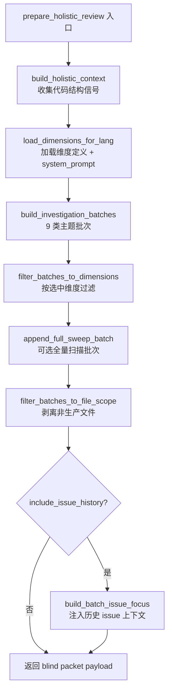
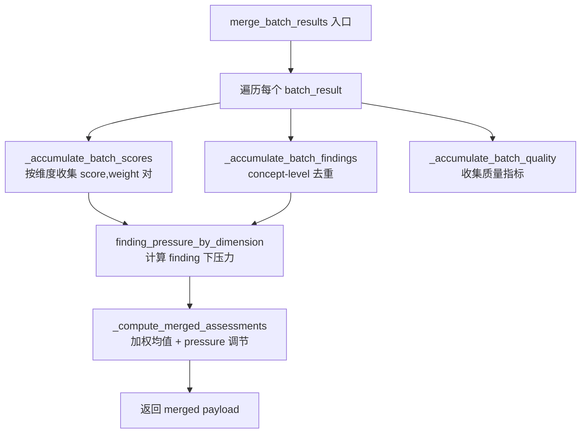

# PD-505.01 Desloppify — LLM 盲审流水线与证据加权合并

> 文档编号：PD-505.01
> 来源：Desloppify `desloppify/app/commands/review/batch_core.py`, `desloppify/intelligence/review/prepare.py`
> GitHub：https://github.com/peteromallet/desloppify.git
> 问题域：PD-505 LLM 主观评审系统 (LLM Subjective Review System)
> 状态：可复用方案

---

## 第 1 章 问题与动机

### 1.1 核心问题

代码质量评审中存在一类"主观维度"——如抽象适配度、设计一致性、约定偏离度——无法被静态分析器或 linter 覆盖。这些维度需要 LLM 作为"评审员"进行判断，但 LLM 评审面临三个工程难题：

1. **评审偏差**：如果 LLM 能看到已有评分，会产生锚定效应（anchoring bias），倾向于给出与已有分数接近的评分
2. **单次评审覆盖不足**：大型代码库无法在单次 LLM 调用中完整评审，需要分批处理，但分批后如何合并多个评审结果是非平凡问题
3. **评审质量不可控**：LLM 可能给出高分但不报告任何问题（"rubber stamp"），或者给出低分但没有具体证据支撑

### 1.2 Desloppify 的解法概述

Desloppify 构建了一条完整的 LLM 盲审流水线（blind review pipeline），核心设计：

1. **Blind Packet 隔离**：prepare 阶段生成"盲审包"（blind packet），剥离已有评分，只保留代码上下文和维度定义，防止评审偏差（`prepare.py:345-489`）
2. **Investigation Batch 分片**：基于代码结构分析（god modules、coupling violations、abstraction hotspots 等）自动将代码库切分为 9 类主题批次，每批聚焦特定维度（`prepare_batches.py:483-508`）
3. **Evidence-Weighted 合并**：多批次评分不是简单平均，而是按证据量加权——证据越多的批次权重越高，同时 finding pressure 会下压高分（`batch_core.py:424-443`, `batch_scoring.py:66-173`）
4. **Fail-Closed 校验**：低分维度必须附带至少一个 finding，高分维度必须说明"为什么不能更高"，否则整个批次被拒绝（`batch_core.py:291-310`）
5. **Concept-Level 去重**：跨批次 findings 按 `dimension::identifier` 做概念级去重，相同概念的 findings 合并证据而非重复计数（`batch_core.py:506-574`）

### 1.3 设计思想

| 设计原则 | 具体实现 | 理由 | 替代方案 |
|----------|----------|------|----------|
| 盲审隔离 | blind packet 剥离已有评分 | 消除 LLM 锚定效应 | 在 prompt 中要求忽略已有分数（不可靠） |
| 证据驱动权重 | `1 + note_evidence + finding_count` 公式 | 有更多证据的批次更可信 | 等权平均（忽略证据质量差异） |
| Fail-closed | 低分无 finding 则拒绝整批 | 防止 LLM "空口评低分" | 允许无证据低分（质量不可控） |
| 主题分片 | 9 类结构化批次（arch/convention/abstraction...） | 每批聚焦特定维度，减少 LLM 注意力分散 | 随机分片（维度覆盖不均） |
| 压力调节 | finding severity × multiplier 下压高分 | 有严重 finding 的维度不应得高分 | 分数与 finding 独立（自相矛盾） |

---

## 第 2 章 源码实现分析

### 2.1 架构概览

Desloppify 的 LLM 评审系统由 4 层组成：

```
┌─────────────────────────────────────────────────────────────────┐
│                    CLI Layer (do_run_batches)                     │
│  batches.py:299-878 — 编排整个流水线，管理并行/串行执行            │
├─────────────────────────────────────────────────────────────────┤
│                  Prepare Layer (prepare.py)                       │
│  prepare_holistic_review — 生成 blind packet + investigation     │
│  batches，含维度定义、代码上下文、concern signals                  │
├─────────────────────────────────────────────────────────────────┤
│                  Normalize Layer (batch_core.py)                  │
│  normalize_batch_result — 校验单批次输出                          │
│  merge_batch_results — 跨批次证据加权合并                         │
│  DimensionMergeScorer — 评分计算引擎                              │
├─────────────────────────────────────────────────────────────────┤
│                  Import Layer (holistic.py)                       │
│  import_holistic_findings — 写入 state，auto-resolve 旧 findings │
│  store_assessments — 维度评分持久化                                │
└─────────────────────────────────────────────────────────────────┘
```

### 2.2 核心实现

#### 2.2.1 Blind Packet 生成与批次构建



对应源码 `desloppify/intelligence/review/prepare.py:345-489`：

```python
def prepare_holistic_review(
    path: Path,
    lang: object,
    state: dict,
    options: HolisticReviewPrepareOptions | None = None,
) -> dict[str, object]:
    """Prepare holistic review data for agent consumption."""
    resolved_options = options or HolisticReviewPrepareOptions()
    all_files = (
        resolved_options.files
        if resolved_options.files is not None
        else (lang.file_finder(path) if lang.file_finder else [])
    )
    allowed_review_files = _collect_allowed_review_files(
        all_files, lang, base_path=path,
    )
    # ... build context with file cache enabled ...
    context = HolisticContext.from_raw(
        build_holistic_context(path, lang, state, files=all_files)
    )
    batches = _build_investigation_batches(
        context, lang, repo_root=path,
        max_files_per_batch=resolved_options.max_files_per_batch,
    )
    # Zone filtering: strip test/config/generated/vendor files
    batches = _filter_batches_to_file_scope(
        batches, allowed_files=allowed_review_files,
    )
    payload = {
        "command": "review", "mode": "holistic",
        "dimensions": dims,
        "dimension_prompts": selected_prompts,
        "holistic_context": context.to_dict(),
        "investigation_batches": batches,
        # ... system_prompt, lang_guidance, etc.
    }
    return payload
```

9 类主题批次的构建逻辑在 `prepare_batches.py:483-508`：

```python
def build_investigation_batches(
    holistic_ctx: HolisticContext | dict, lang: object,
    *, repo_root: Path | None = None,
    max_files_per_batch: int | None = None,
) -> list[dict]:
    ctx = _ensure_holistic_context(holistic_ctx)
    batches = [
        _batch_arch_coupling(ctx, max_files=max_files_per_batch),
        _batch_conventions_errors(ctx, max_files=max_files_per_batch),
        _batch_abstractions_deps(ctx, max_files=max_files_per_batch),
        _batch_testing_api(ctx, max_files=max_files_per_batch),
        _batch_authorization(ctx, max_files=max_files_per_batch),
        _batch_ai_debt_migrations(ctx, max_files=max_files_per_batch),
        _batch_package_organization(ctx, max_files=max_files_per_batch),
        _batch_state_design(ctx, max_files=max_files_per_batch),
        _batch_governance_contracts(ctx, repo_root=repo_root, ...),
    ]
    return [batch for batch in batches if batch["files_to_read"]]
```

#### 2.2.2 Evidence-Weighted 评分合并



对应源码 `desloppify/app/commands/review/batch_core.py:424-443`（权重计算）：

```python
def assessment_weight(
    *, dimension: str,
    findings: list[dict[str, Any]],
    dimension_notes: dict[str, dict[str, Any]],
) -> float:
    """Evidence-weighted assessment score weight with a neutral floor.
    Weighting is evidence-based and score-independent: the raw score
    does not influence how much weight a batch contributes during merge.
    """
    note = dimension_notes.get(dimension, {})
    note_evidence = len(note.get("evidence", [])) if isinstance(note, dict) else 0
    finding_count = sum(
        1 for finding in findings
        if str(finding.get("dimension", "")).strip() == dimension
    )
    return float(1 + note_evidence + finding_count)
```

评分合并引擎 `batch_scoring.py:113-173`：

```python
class DimensionMergeScorer:
    def score_dimension(self, inputs: ScoreInputs) -> ScoreBreakdown:
        # 70% 加权均值 + 30% 批次最低分
        floor_aware = (
            _WEIGHTED_MEAN_BLEND * inputs.weighted_mean
            + _FLOOR_BLEND_WEIGHT * inputs.floor
        )
        # Finding pressure 下压：severity × 2.2 + 额外 finding × 0.8
        issue_penalty = min(
            _MAX_ISSUE_PENALTY,  # 上限 24 分
            (inputs.finding_pressure * _PRESSURE_PENALTY_MULTIPLIER)
            + (max(inputs.finding_count - 1, 0) * _EXTRA_FINDING_PENALTY),
        )
        issue_adjusted = floor_aware - issue_penalty
        # Finding-based score cap: 有 finding 时分数不超过动态上限
        if inputs.finding_count > 0:
            cap_penalty = (inputs.finding_pressure * _CAP_PRESSURE_MULTIPLIER)
                + (max(inputs.finding_count - 1, 0) * _EXTRA_FINDING_PENALTY)
            issue_cap = max(_CAP_FLOOR, _CAP_CEILING - cap_penalty)
            issue_adjusted = min(issue_adjusted, issue_cap)
        return ScoreBreakdown(final_score=round(max(0.0, min(100.0, issue_adjusted)), 1), ...)
```

### 2.3 实现细节

**Finding Severity 计算**（`batch_scoring.py:69-90`）：每个 finding 的严重度由三个维度相乘：
- `confidence`：high=1.2, medium=1.0, low=0.75
- `impact_scope`：local=1.0, module=1.3, subsystem=1.6, codebase=2.0
- `fix_scope`：single_edit=1.0, multi_file_refactor=1.3, architectural_change=1.7

**Concept-Level 去重**（`batch_core.py:506-574`）：跨批次 findings 按 `dimension::identifier` 构建 identity key，相同概念的 findings 合并 `related_files` 和 `evidence` 列表（去重），保留更长的 `summary` 和 `suggestion`，并记录 `merged_from` 追踪来源。

**Fail-Closed 校验**（`batch_core.py:291-310`）：
```python
def _enforce_low_score_findings(
    *, assessments: dict[str, float],
    findings: list[NormalizedBatchFinding],
) -> None:
    required_dims = _low_score_dimensions(assessments)  # score < 85.0
    finding_dims = {finding.dimension.strip() for finding in findings}
    missing = sorted(dim for dim in required_dims if dim not in finding_dims)
    if missing:
        raise ValueError(
            "low-score dimensions must include at least one explicit finding: "
            f"{', '.join(missing)} (threshold {LOW_SCORE_FINDING_THRESHOLD:.1f})"
        )
```

**Prompt Contract 注入**（`feedback_contract.py:36-60`）：每个 subagent prompt 都注入统一的评审合约，包括"分数低于 85 必须有 finding"、"分数高于 85 必须说明 issues_preventing_higher_score"、"findings 只能是缺陷不能是正面观察"等硬性规则。


---

## 第 3 章 迁移指南

### 3.1 迁移清单

**阶段 1：核心数据结构（1-2 天）**
- [ ] 定义维度（dimension）枚举和 prompt 模板
- [ ] 实现 `ReviewFindingPayload` TypedDict（dimension, identifier, summary, confidence, suggestion, evidence, related_files）
- [ ] 实现 `NormalizedBatchFinding` frozen dataclass
- [ ] 定义 feedback contract 常量（LOW_SCORE_FINDING_THRESHOLD=85.0, HIGH_SCORE_ISSUES_NOTE_THRESHOLD=85.0）

**阶段 2：Prepare 层（2-3 天）**
- [ ] 实现代码结构分析（god modules, coupling violations, abstraction hotspots）
- [ ] 实现 `build_investigation_batches`：基于结构信号生成主题批次
- [ ] 实现 blind packet 生成：剥离已有评分，只保留代码上下文
- [ ] 实现 zone filtering：排除 test/config/generated/vendor 文件

**阶段 3：Normalize + Merge 层（2-3 天）**
- [ ] 实现 `normalize_batch_result`：校验单批次 LLM 输出
- [ ] 实现 `_enforce_low_score_findings`：fail-closed 校验
- [ ] 实现 `assessment_weight`：证据加权公式
- [ ] 实现 `DimensionMergeScorer`：加权均值 + pressure 调节 + score cap
- [ ] 实现 `_finding_identity_key` + `_merge_finding_payload`：concept-level 去重

**阶段 4：Import 层（1-2 天）**
- [ ] 实现 `import_holistic_findings`：写入 state
- [ ] 实现 `auto_resolve_review_findings`：自动关闭旧 findings
- [ ] 实现 `store_assessments`：维度评分持久化

### 3.2 适配代码模板

以下是可直接复用的证据加权合并引擎：

```python
"""Minimal evidence-weighted score merger for LLM review batches."""
from dataclasses import dataclass
from typing import Any

# --- Constants ---
WEIGHTED_MEAN_BLEND = 0.7
FLOOR_BLEND_WEIGHT = 0.3
MAX_ISSUE_PENALTY = 24.0
PRESSURE_PENALTY_MULTIPLIER = 2.2
EXTRA_FINDING_PENALTY = 0.8
CAP_FLOOR = 60.0
CAP_CEILING = 90.0
CAP_PRESSURE_MULTIPLIER = 3.5
LOW_SCORE_FINDING_THRESHOLD = 85.0

CONFIDENCE_WEIGHTS = {"high": 1.2, "medium": 1.0, "low": 0.75}
IMPACT_SCOPE_WEIGHTS = {"local": 1.0, "module": 1.3, "subsystem": 1.6, "codebase": 2.0}
FIX_SCOPE_WEIGHTS = {"single_edit": 1.0, "multi_file_refactor": 1.3, "architectural_change": 1.7}


@dataclass(frozen=True)
class ScoreInputs:
    weighted_mean: float
    floor: float
    finding_pressure: float
    finding_count: int


def finding_severity(finding: dict[str, Any]) -> float:
    """Compute per-finding severity from confidence × impact × fix scope."""
    conf = CONFIDENCE_WEIGHTS.get(finding.get("confidence", "medium"), 1.0)
    impact = IMPACT_SCOPE_WEIGHTS.get(finding.get("impact_scope", "local"), 1.0)
    fix = FIX_SCOPE_WEIGHTS.get(finding.get("fix_scope", "single_edit"), 1.0)
    return conf * impact * fix


def assessment_weight(dimension: str, findings: list[dict], notes: dict) -> float:
    """Evidence-weighted: 1 + evidence_count + finding_count."""
    note = notes.get(dimension, {})
    evidence_count = len(note.get("evidence", []))
    finding_count = sum(1 for f in findings if f.get("dimension") == dimension)
    return float(1 + evidence_count + finding_count)


def score_dimension(inputs: ScoreInputs) -> float:
    """Compute pressure-adjusted merged score for one dimension."""
    floor_aware = WEIGHTED_MEAN_BLEND * inputs.weighted_mean + FLOOR_BLEND_WEIGHT * inputs.floor
    penalty = min(MAX_ISSUE_PENALTY,
        inputs.finding_pressure * PRESSURE_PENALTY_MULTIPLIER
        + max(inputs.finding_count - 1, 0) * EXTRA_FINDING_PENALTY)
    adjusted = floor_aware - penalty
    if inputs.finding_count > 0:
        cap = max(CAP_FLOOR, CAP_CEILING
            - inputs.finding_pressure * CAP_PRESSURE_MULTIPLIER
            - max(inputs.finding_count - 1, 0) * EXTRA_FINDING_PENALTY)
        adjusted = min(adjusted, cap)
    return round(max(0.0, min(100.0, adjusted)), 1)


def enforce_low_score_findings(assessments: dict[str, float], findings: list[dict]) -> None:
    """Fail-closed: low scores must have at least one finding."""
    required = {dim for dim, score in assessments.items() if score < LOW_SCORE_FINDING_THRESHOLD}
    covered = {f["dimension"] for f in findings}
    missing = required - covered
    if missing:
        raise ValueError(f"Low-score dimensions missing findings: {sorted(missing)}")


def merge_batch_results(batch_results: list[dict[str, Any]]) -> dict[str, Any]:
    """Merge multiple batch results with evidence-weighted scoring."""
    score_buckets: dict[str, list[tuple[float, float]]] = {}
    raw_scores: dict[str, list[float]] = {}
    finding_map: dict[str, dict] = {}
    merged_notes: dict[str, dict] = {}

    for result in batch_results:
        findings = result.get("findings", [])
        notes = result.get("dimension_notes", {})
        for dim, score in result.get("assessments", {}).items():
            w = assessment_weight(dim, findings, notes)
            score_buckets.setdefault(dim, []).append((float(score), w))
            raw_scores.setdefault(dim, []).append(float(score))
            # Keep notes with most evidence
            if dim not in merged_notes or len(notes.get(dim, {}).get("evidence", [])) > len(merged_notes[dim].get("evidence", [])):
                merged_notes[dim] = notes.get(dim, {})
        # Concept-level dedup
        for f in findings:
            key = f"{f.get('dimension')}::{f.get('identifier')}"
            if key not in finding_map:
                finding_map[key] = f
            else:
                _merge_findings(finding_map[key], f)

    # Compute finding pressure
    pressure: dict[str, float] = {}
    counts: dict[str, int] = {}
    for f in finding_map.values():
        dim = f.get("dimension", "")
        pressure[dim] = pressure.get(dim, 0) + finding_severity(f)
        counts[dim] = counts.get(dim, 0) + 1

    merged_assessments = {}
    for dim, weighted in score_buckets.items():
        num = sum(s * w for s, w in weighted)
        den = sum(w for _, w in weighted)
        wmean = num / max(den, 1.0)
        floor = min(raw_scores.get(dim, [wmean]))
        merged_assessments[dim] = score_dimension(ScoreInputs(
            weighted_mean=wmean, floor=floor,
            finding_pressure=pressure.get(dim, 0),
            finding_count=counts.get(dim, 0),
        ))

    return {
        "assessments": merged_assessments,
        "findings": list(finding_map.values()),
        "dimension_notes": merged_notes,
    }


def _merge_findings(existing: dict, incoming: dict) -> None:
    """Merge two concept-equivalent findings."""
    for field in ("related_files", "evidence"):
        seen = set(existing.get(field, []))
        for item in incoming.get(field, []):
            if item not in seen:
                existing.setdefault(field, []).append(item)
    if len(incoming.get("summary", "")) > len(existing.get("summary", "")):
        existing["summary"] = incoming["summary"]
```

### 3.3 适用场景

| 场景 | 适用度 | 说明 |
|------|--------|------|
| 代码质量主观评审 | ⭐⭐⭐ | 核心场景：LLM 评审代码的抽象质量、设计一致性等主观维度 |
| PR Review 自动化 | ⭐⭐⭐ | 可将 PR diff 作为 batch 输入，生成结构化评审报告 |
| 多 LLM 评审共识 | ⭐⭐ | 不同 LLM 作为不同 batch，用证据加权合并达成共识 |
| 文档质量评审 | ⭐⭐ | 维度定义替换为文档质量维度即可复用 |
| 安全审计 | ⭐ | 安全审计更适合确定性工具，LLM 主观评审作为补充 |

---

## 第 4 章 测试用例

```python
"""Tests for LLM subjective review core components."""
import pytest
from typing import Any


# --- Test finding severity ---
class TestFindingSeverity:
    def test_high_confidence_codebase_architectural(self):
        finding = {"confidence": "high", "impact_scope": "codebase", "fix_scope": "architectural_change"}
        # 1.2 * 2.0 * 1.7 = 4.08
        severity = 1.2 * 2.0 * 1.7
        assert abs(severity - 4.08) < 0.01

    def test_low_confidence_local_single_edit(self):
        finding = {"confidence": "low", "impact_scope": "local", "fix_scope": "single_edit"}
        severity = 0.75 * 1.0 * 1.0
        assert severity == 0.75

    def test_unknown_values_default_to_medium(self):
        finding = {"confidence": "unknown", "impact_scope": "unknown", "fix_scope": "unknown"}
        # All default to 1.0
        severity = 1.0 * 1.0 * 1.0
        assert severity == 1.0


# --- Test evidence-weighted assessment ---
class TestAssessmentWeight:
    def test_no_evidence_no_findings(self):
        weight = float(1 + 0 + 0)
        assert weight == 1.0

    def test_with_evidence_and_findings(self):
        # 3 evidence items + 2 findings for this dimension
        weight = float(1 + 3 + 2)
        assert weight == 6.0


# --- Test score dimension merge ---
class TestScoreDimension:
    def test_no_findings_no_penalty(self):
        # 70% * 80 + 30% * 75 = 56 + 22.5 = 78.5
        floor_aware = 0.7 * 80.0 + 0.3 * 75.0
        assert abs(floor_aware - 78.5) < 0.01

    def test_finding_pressure_caps_score(self):
        # With high pressure, score should be capped
        pressure = 4.08  # high/codebase/architectural
        cap = max(60.0, 90.0 - pressure * 3.5 - 0)
        assert cap == max(60.0, 90.0 - 14.28)
        assert abs(cap - 75.72) < 0.01

    def test_max_penalty_capped_at_24(self):
        penalty = min(24.0, 10.0 * 2.2 + 5 * 0.8)
        assert penalty == 24.0  # 22 + 4 = 26, capped at 24


# --- Test fail-closed validation ---
class TestFailClosedValidation:
    def test_low_score_without_finding_raises(self):
        assessments = {"abstraction_fitness": 70.0}
        findings = []  # No findings!
        required = {dim for dim, score in assessments.items() if score < 85.0}
        covered = {f.get("dimension") for f in findings}
        assert required - covered == {"abstraction_fitness"}

    def test_low_score_with_finding_passes(self):
        assessments = {"abstraction_fitness": 70.0}
        findings = [{"dimension": "abstraction_fitness", "identifier": "test"}]
        required = {dim for dim, score in assessments.items() if score < 85.0}
        covered = {f.get("dimension") for f in findings}
        assert required - covered == set()

    def test_high_score_no_finding_required(self):
        assessments = {"abstraction_fitness": 90.0}
        required = {dim for dim, score in assessments.items() if score < 85.0}
        assert required == set()


# --- Test concept-level dedup ---
class TestFindingDedup:
    def test_same_concept_merges_evidence(self):
        existing = {
            "dimension": "design_coherence",
            "identifier": "god_module",
            "evidence": ["file A has 500 lines"],
            "related_files": ["a.py"],
            "summary": "short",
        }
        incoming = {
            "dimension": "design_coherence",
            "identifier": "god_module",
            "evidence": ["file B also too large"],
            "related_files": ["b.py"],
            "summary": "longer summary text here",
        }
        # After merge: evidence and files combined, longer summary kept
        merged_evidence = list(set(existing["evidence"] + incoming["evidence"]))
        assert len(merged_evidence) == 2
        assert len(incoming["summary"]) > len(existing["summary"])
```


---

## 第 5 章 跨域关联

| 关联域 | 关系类型 | 说明 |
|--------|----------|------|
| PD-07 质量检查 | 协同 | Desloppify 的 LLM 评审本质上是一种质量检查机制，但聚焦于主观维度而非机械检查 |
| PD-02 多 Agent 编排 | 依赖 | batch 并行执行依赖 subagent 编排能力（codex runner），每个 batch 是一个独立 subagent |
| PD-03 容错与重试 | 协同 | `do_run_batches` 支持 `batch_max_retries`、`batch_retry_backoff_seconds`、`allow_partial` 等容错参数 |
| PD-01 上下文管理 | 依赖 | blind packet 的大小受 LLM 上下文窗口限制，`max_files_per_batch` 控制每批文件数 |
| PD-10 中间件管道 | 协同 | `feedback_contract.ensure_prompt_contract` 类似中间件注入，在每个 subagent prompt 中注入统一合约 |
| PD-11 可观测性 | 协同 | `_append_run_log` 记录每个 batch 的 start/done/heartbeat 事件，`run_summary.json` 提供完整执行报告 |

---

## 第 6 章 来源文件索引

| 文件 | 行范围 | 关键实现 |
|------|--------|----------|
| `desloppify/intelligence/review/prepare.py` | L345-L489 | `prepare_holistic_review` — blind packet 生成入口 |
| `desloppify/intelligence/review/prepare.py` | L99-L131 | `_collect_allowed_review_files` — zone filtering |
| `desloppify/intelligence/review/prepare_batches.py` | L483-L508 | `build_investigation_batches` — 9 类主题批次构建 |
| `desloppify/intelligence/review/prepare_batches.py` | L511-L556 | `filter_batches_to_dimensions` — 维度过滤 + fallback 批次 |
| `desloppify/intelligence/review/prepare_batches.py` | L559-L643 | `batch_concerns` — mechanical concern signals 批次 |
| `desloppify/app/commands/review/batch_core.py` | L335-L421 | `normalize_batch_result` — 单批次输出校验与归一化 |
| `desloppify/app/commands/review/batch_core.py` | L424-L443 | `assessment_weight` — 证据加权公式 |
| `desloppify/app/commands/review/batch_core.py` | L506-L574 | `_finding_identity_key` + `_merge_finding_payload` — concept-level 去重 |
| `desloppify/app/commands/review/batch_core.py` | L651-L731 | `merge_batch_results` — 跨批次合并主函数 |
| `desloppify/app/commands/review/batch_core.py` | L291-L310 | `_enforce_low_score_findings` — fail-closed 校验 |
| `desloppify/app/commands/review/batch_scoring.py` | L8-L42 | 评分常量定义（权重、惩罚系数、上限） |
| `desloppify/app/commands/review/batch_scoring.py` | L66-L173 | `DimensionMergeScorer` — 评分计算引擎 |
| `desloppify/intelligence/review/feedback_contract.py` | L1-L89 | 评审合约常量 + prompt contract 注入 |
| `desloppify/intelligence/review/importing/contracts.py` | L20-L36 | `ReviewFindingPayload` TypedDict 定义 |
| `desloppify/intelligence/review/importing/holistic.py` | L256-L388 | `import_holistic_findings` — 导入 + auto-resolve |
| `desloppify/intelligence/review/importing/shared.py` | L39-L94 | `store_assessments` — 维度评分持久化 |
| `desloppify/app/commands/review/batches.py` | L299-L878 | `do_run_batches` — 流水线编排主函数 |
| `desloppify/app/commands/review/batch_prompt_template.py` | L376-L399 | `render_batch_prompt` — subagent prompt 渲染 |

---

## 第 7 章 横向对比维度

```json comparison_data
{
  "project": "Desloppify",
  "dimensions": {
    "检查方式": "LLM subagent 盲审 + 9 类主题批次并行",
    "评估维度": "JSON 驱动可配置维度（abstraction_fitness, design_coherence 等 15+ 维度）",
    "评估粒度": "维度级评分 0-100 + 证据加权合并 + finding-pressure 下压",
    "迭代机制": "auto-resolve 旧 findings + 增量维度补充 rerun",
    "盲审隔离": "blind packet 剥离已有评分，消除 LLM 锚定效应",
    "合并算法": "70% 加权均值 + 30% 批次最低分 + severity-based pressure penalty + dynamic score cap"
  }
}
```

```json domain_metadata
{
  "solution_summary": "Desloppify 用 blind packet 隔离 + 9 类主题批次并行 subagent + evidence-weighted 加权合并 + fail-closed 校验构建完整 LLM 盲审流水线",
  "description": "LLM 作为主观评审员对代码质量进行多维度盲审评分与结构化反馈",
  "sub_problems": [
    "Dimension-specific prompt contract injection for review consistency",
    "Score-independent evidence weighting prevents score-aware bias in merge",
    "Dynamic score cap based on finding severity prevents high-score-with-findings contradiction"
  ],
  "best_practices": [
    "70/30 weighted-mean/floor blend prevents single outlier batch from dominating",
    "Positive observation filter rejects non-defect findings at import time",
    "Prompt contract ensures score-finding consistency across all subagents"
  ]
}
```

