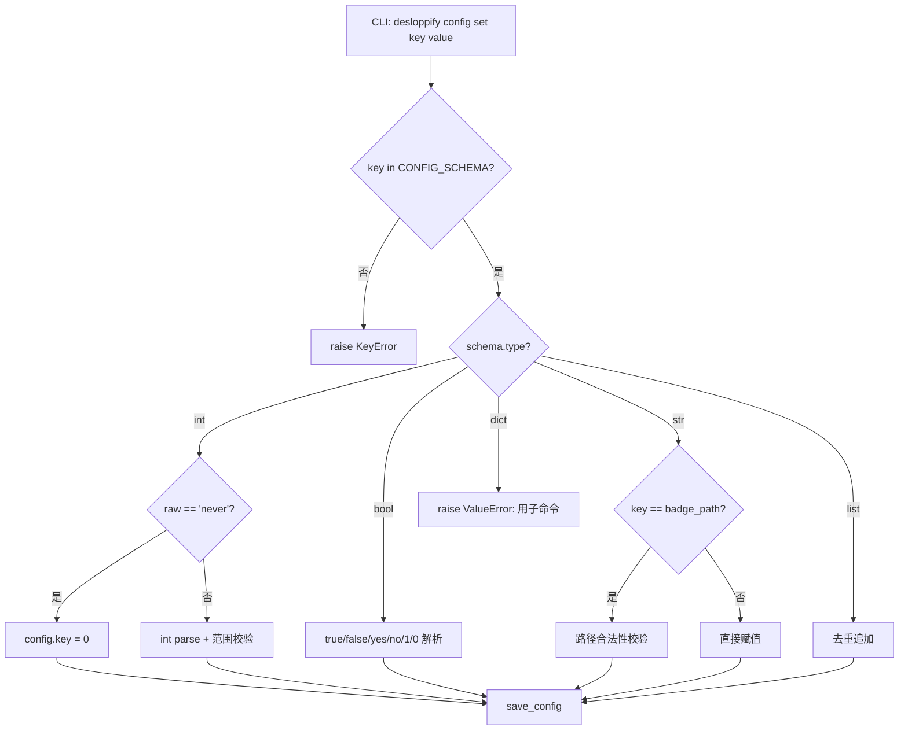
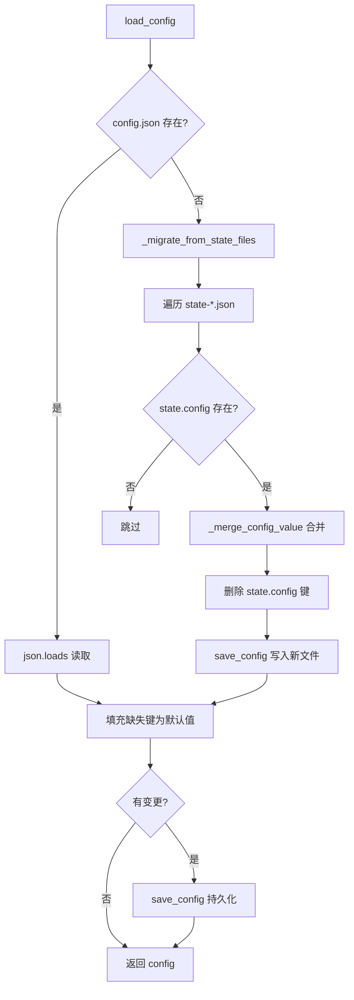

# PD-506.01 desloppify — ConfigSchema 类型化配置与 CLI 三操作管理

> 文档编号：PD-506.01
> 来源：desloppify `desloppify/core/config.py`
> GitHub：https://github.com/peteromallet/desloppify.git
> 问题域：PD-506 配置管理 Configuration Management
> 状态：可复用方案

---

## 第 1 章 问题与动机

### 1.1 核心问题

静态分析工具需要大量可调参数（评分阈值、检测器预算、排除规则、文件分类覆盖等），这些参数必须：
- **持久化到项目目录**，跟随 Git 版本控制
- **类型安全**，防止用户输入非法值导致运行时崩溃
- **CLI 可操作**，无需手动编辑 JSON
- **带默认值回退**，首次运行零配置即可工作
- **支持增量迁移**，从旧版状态文件平滑升级到新配置格式

desloppify 是一个代码质量扫描工具，它的配置系统需要同时服务 CLI 用户（`desloppify config set`）、扫描引擎（读取阈值）、评分系统（读取目标分数）和 Zone 分类系统（读取覆盖规则）。

### 1.2 desloppify 的解法概述

1. **ConfigKey dataclass 定义自文档化 Schema** — 每个配置键用 `ConfigKey(type, default, description)` 声明，类型、默认值、描述三位一体（`config.py:22-27`）
2. **17 键全局 Schema 字典** — `CONFIG_SCHEMA` 覆盖 int/bool/str/list/dict 五种类型，从评分阈值到噪声预算到 Zone 覆盖（`config.py:29-87`）
3. **CLI 三操作模型** — `config show/set/unset` 三个子命令，set 支持类型感知解析（"never"→0, "true"/"false"→bool），unset 重置为默认值（`config_cmd.py:19-95`）
4. **安全解析 + 有界验证** — `set_config_value()` 对 `target_strict_score` 做 0-100 范围校验，对 `badge_path` 做路径合法性校验（`config.py:192-237`）
5. **状态文件自动迁移** — 首次加载时从 `state-*.json` 中提取 config 键，合并写入 `config.json`，并清理旧状态文件（`config.py:268-323`）

### 1.3 设计思想

| 设计原则 | 具体实现 | 理由 | 替代方案 |
|----------|----------|------|----------|
| Schema-as-Code | `ConfigKey` dataclass + `CONFIG_SCHEMA` 字典 | 类型、默认值、描述集中声明，CLI show 直接遍历 | YAML/TOML schema 文件（需额外解析器） |
| 零配置启动 | `default_config()` 从 Schema 生成完整默认配置 | 首次运行无需任何配置文件 | 要求用户手动 init |
| 有界验证 | `_coerce_target_strict_score()` 限制 0-100 | 防止无意义的目标分数 | 无限制，运行时报错 |
| 原子写入 | `safe_write_text()` 临时文件 + rename | 防止写入中断导致配置损坏 | 直接 write（可能半写） |
| 增量迁移 | `_migrate_from_state_files()` 自动提取旧配置 | 用户无感升级，不丢失已有设置 | 要求用户手动迁移 |
| 脏标记 | `needs_rescan` 布尔键 | 配置变更后提醒用户重新扫描 | 每次都重新扫描（浪费） |

---

## 第 2 章 源码实现分析

### 2.1 架构概览

desloppify 的配置管理系统分为三层：Schema 定义层、I/O 持久化层、CLI 操作层。

```
┌─────────────────────────────────────────────────────────────┐
│                      CLI 操作层                              │
│  config_cmd.py    exclude_cmd.py    zone_cmd.py             │
│  (show/set/unset) (add exclude)     (show/set/clear zone)   │
└──────────┬──────────────┬──────────────┬────────────────────┘
           │              │              │
           ▼              ▼              ▼
┌─────────────────────────────────────────────────────────────┐
│                   I/O 持久化层                               │
│  load_config()  save_config()  _migrate_from_state_files()  │
│  safe_write_text() — 原子写入                                │
└──────────┬──────────────────────────────────────────────────┘
           │
           ▼
┌─────────────────────────────────────────────────────────────┐
│                  Schema 定义层                                │
│  ConfigKey(type, default, description)                       │
│  CONFIG_SCHEMA: 17 键 × 5 类型                               │
│  set_config_value() / unset_config_value() — 类型感知解析     │
└─────────────────────────────────────────────────────────────┘
           │
           ▼
    .desloppify/config.json  ←→  state-*.json (迁移源)
```

Zone 分类系统（`zones.py`）和噪声预算系统（`noise.py`）作为配置的消费者，通过 `config.get("zone_overrides")` 和 `config.get("finding_noise_budget")` 读取配置值。

### 2.2 核心实现

#### ConfigKey Schema 与类型感知解析



对应源码 `desloppify/core/config.py:192-237`：

```python
def set_config_value(config: dict, key: str, raw: str) -> None:
    """Parse and set a config value from a raw string."""
    if key not in CONFIG_SCHEMA:
        raise KeyError(f"Unknown config key: {key}")

    schema = CONFIG_SCHEMA[key]

    if schema.type is int:
        if raw.lower() == "never":
            config[key] = 0
        else:
            config[key] = int(raw)
        if key == "target_strict_score":
            target_strict_score, target_valid = _coerce_target_strict_score(config[key])
            if not target_valid:
                raise ValueError(
                    f"Expected integer {MIN_TARGET_STRICT_SCORE}-{MAX_TARGET_STRICT_SCORE} "
                    f"for {key}, got: {raw}"
                )
            config[key] = target_strict_score
    elif schema.type is bool:
        if raw.lower() in ("true", "1", "yes"):
            config[key] = True
        elif raw.lower() in ("false", "0", "no"):
            config[key] = False
        else:
            raise ValueError(f"Expected true/false for {key}, got: {raw}")
    elif schema.type is list:
        config.setdefault(key, [])
        if raw not in config[key]:
            config[key].append(raw)
    elif schema.type is dict:
        raise ValueError(f"Cannot set dict key '{key}' via CLI — use subcommands")
```

#### 配置加载与自动迁移



对应源码 `desloppify/core/config.py:105-144`：

```python
def load_config(path: Path | None = None) -> dict[str, Any]:
    """Load config from disk, auto-migrating from state files if needed."""
    p = path or CONFIG_FILE
    if p.exists():
        try:
            config = json.loads(p.read_text())
        except (json.JSONDecodeError, UnicodeDecodeError, OSError):
            config = {}
    else:
        config = _migrate_from_state_files(p)

    changed = False
    for key, schema in CONFIG_SCHEMA.items():
        if key not in config:
            config[key] = copy.deepcopy(schema.default)
            changed = True
        elif key == "badge_path":
            try:
                normalized = _validate_badge_path(str(config[key]))
                if normalized != config[key]:
                    config[key] = normalized
                    changed = True
            except ValueError:
                config[key] = copy.deepcopy(schema.default)
                changed = True

    if changed and p.exists():
        try:
            save_config(config, p)
        except OSError as exc:
            log_best_effort_failure(logger, f"persist migrated config to {p}", exc)
    return config
```

### 2.3 实现细节

**Zone 覆盖的配置消费路径：**

Zone 分类系统通过 `classify_file()` 函数接收 `overrides` 参数，该参数直接来自 `config["zone_overrides"]`（`zones.py:104-121`）。覆盖优先于规则匹配，且对无效 Zone 值做 best-effort 降级：

```python
# zones.py:104-121
def classify_file(rel_path: str, rules: list[ZoneRule], overrides: dict[str, str] | None = None) -> Zone:
    if overrides:
        override = overrides.get(rel_path)
        if override:
            try:
                return Zone(override)
            except ValueError as exc:
                log_best_effort_failure(logger, f"parse zone override for {rel_path}", exc)
    for rule in rules:
        for pattern in rule.patterns:
            if _match_pattern(rel_path, pattern):
                return rule.zone
    return Zone.PRODUCTION
```

**噪声预算的安全解析：**

`noise.py` 中的 `_resolve_non_negative_int()` 是一个通用的安全解析器，返回 `(value, was_valid)` 元组，让调用方可以选择是否生成警告（`noise.py:19-27`）。`resolve_finding_noise_settings()` 利用这个模式同时解析两个预算值并聚合警告信息（`noise.py:55-82`）。

**脏标记与过期检测：**

`exclude_cmd.py:18` 和 `resolve/cmd.py:176` 在修改配置后设置 `config["needs_rescan"] = True`。`tooling.py:77-81` 的 `check_config_staleness()` 检查该标记并返回警告字符串，由 CLI 命令在输出末尾展示。

**CommandRuntime 统一上下文：**

`runtime.py:14-20` 定义 `CommandRuntime(config, state, state_path)` frozen dataclass，所有命令处理器通过 `command_runtime(args)` 获取统一的运行时上下文，避免重复加载配置。`cli.py:97-105` 的 `_load_shared_runtime()` 在 CLI 入口处预加载并挂载到 `args.runtime`。

---

## 第 3 章 迁移指南

### 3.1 迁移清单

**阶段 1：Schema 定义（核心）**
- [ ] 定义 `ConfigKey` dataclass（type, default, description）
- [ ] 声明 `CONFIG_SCHEMA` 字典，列出所有配置键
- [ ] 实现 `default_config()` 从 Schema 生成默认配置

**阶段 2：I/O 层**
- [ ] 实现 `load_config()` — JSON 读取 + 缺失键填充
- [ ] 实现 `save_config()` — 原子写入（临时文件 + rename）
- [ ] 实现 `set_config_value()` — 类型感知的字符串解析
- [ ] 实现 `unset_config_value()` — 重置为默认值

**阶段 3：CLI 集成**
- [ ] 添加 `config show` 子命令（遍历 Schema 展示当前值）
- [ ] 添加 `config set <key> <value>` 子命令
- [ ] 添加 `config unset <key>` 子命令
- [ ] 添加 `needs_rescan` 脏标记 + 过期警告

**阶段 4：高级特性（可选）**
- [ ] 状态文件迁移（从旧格式自动提取配置）
- [ ] Zone 覆盖子命令（`zone set/clear`）
- [ ] 排除模式子命令（`exclude`）

### 3.2 适配代码模板

以下模板可直接复用，实现一个最小但完整的类型化配置系统：

```python
"""Typed project config with CLI get/set/unset support."""
from __future__ import annotations

import copy
import json
from dataclasses import dataclass
from pathlib import Path
from typing import Any


@dataclass(frozen=True)
class ConfigKey:
    """Self-documenting config key: type + default + description."""
    type: type
    default: object
    description: str


# ── Schema 定义 ──────────────────────────────────────────
CONFIG_SCHEMA: dict[str, ConfigKey] = {
    "max_retries": ConfigKey(int, 3, "Maximum retry attempts"),
    "verbose": ConfigKey(bool, False, "Enable verbose output"),
    "output_dir": ConfigKey(str, "output", "Output directory path"),
    "exclude": ConfigKey(list, [], "Patterns to exclude"),
    "overrides": ConfigKey(dict, {}, "Manual overrides {key: value}"),
}

CONFIG_FILE = Path(".myproject/config.json")


def default_config() -> dict[str, Any]:
    return {k: copy.deepcopy(v.default) for k, v in CONFIG_SCHEMA.items()}


def load_config(path: Path | None = None) -> dict[str, Any]:
    p = path or CONFIG_FILE
    config = {}
    if p.exists():
        try:
            config = json.loads(p.read_text())
        except (json.JSONDecodeError, OSError):
            config = {}
    # Fill missing keys with defaults
    for key, schema in CONFIG_SCHEMA.items():
        if key not in config:
            config[key] = copy.deepcopy(schema.default)
    return config


def save_config(config: dict, path: Path | None = None) -> None:
    p = path or CONFIG_FILE
    p.parent.mkdir(parents=True, exist_ok=True)
    tmp = p.with_suffix(".tmp")
    tmp.write_text(json.dumps(config, indent=2) + "\n")
    tmp.rename(p)  # atomic on POSIX


def set_config_value(config: dict, key: str, raw: str) -> None:
    if key not in CONFIG_SCHEMA:
        raise KeyError(f"Unknown config key: {key}")
    schema = CONFIG_SCHEMA[key]
    if schema.type is int:
        config[key] = int(raw)
    elif schema.type is bool:
        config[key] = raw.lower() in ("true", "1", "yes")
    elif schema.type is list:
        config.setdefault(key, [])
        if raw not in config[key]:
            config[key].append(raw)
    elif schema.type is dict:
        raise ValueError(f"Cannot set dict key '{key}' via CLI")
    else:
        config[key] = raw


def unset_config_value(config: dict, key: str) -> None:
    if key not in CONFIG_SCHEMA:
        raise KeyError(f"Unknown config key: {key}")
    config[key] = copy.deepcopy(CONFIG_SCHEMA[key].default)
```

### 3.3 适用场景

| 场景 | 适用度 | 说明 |
|------|--------|------|
| CLI 工具项目级配置 | ⭐⭐⭐ | 完美匹配：JSON 持久化 + CLI 操作 + 类型校验 |
| Agent 运行参数管理 | ⭐⭐⭐ | Schema 自文档化，Agent 可通过 description 理解每个参数 |
| 多语言/多检测器阈值 | ⭐⭐⭐ | `languages` 嵌套 dict 支持语言级覆盖 |
| 微服务配置中心 | ⭐ | 不适合：单文件 JSON 不支持分布式配置同步 |
| 高频变更的运行时参数 | ⭐⭐ | 可用但需注意文件 I/O 开销，适合低频变更 |

---

## 第 4 章 测试用例

```python
import copy
import json
import pytest
from pathlib import Path
from dataclasses import dataclass


# ── 被测模块（从迁移模板复制或 import 源项目） ──

@dataclass(frozen=True)
class ConfigKey:
    type: type
    default: object
    description: str


CONFIG_SCHEMA = {
    "target_score": ConfigKey(int, 95, "Target score 0-100"),
    "verbose": ConfigKey(bool, False, "Verbose output"),
    "output": ConfigKey(str, "out", "Output path"),
    "exclude": ConfigKey(list, [], "Exclude patterns"),
    "overrides": ConfigKey(dict, {}, "Manual overrides"),
}


class TestConfigSchema:
    """Schema 定义与默认值生成。"""

    def test_default_config_has_all_keys(self):
        defaults = {k: copy.deepcopy(v.default) for k, v in CONFIG_SCHEMA.items()}
        assert set(defaults.keys()) == set(CONFIG_SCHEMA.keys())

    def test_default_values_match_schema(self):
        for key, schema in CONFIG_SCHEMA.items():
            default = copy.deepcopy(schema.default)
            assert isinstance(default, schema.type), f"{key}: {type(default)} != {schema.type}"

    def test_frozen_config_key(self):
        ck = ConfigKey(int, 10, "test")
        with pytest.raises(AttributeError):
            ck.type = str  # type: ignore


class TestSetConfigValue:
    """类型感知的 set 操作。"""

    def test_set_int(self):
        config = {"target_score": 95}
        config["target_score"] = int("80")
        assert config["target_score"] == 80

    def test_set_bool_true_variants(self):
        for raw in ("true", "True", "1", "yes"):
            assert raw.lower() in ("true", "1", "yes")

    def test_set_bool_false_variants(self):
        for raw in ("false", "False", "0", "no"):
            assert raw.lower() in ("false", "0", "no")

    def test_set_list_deduplicates(self):
        config = {"exclude": ["*.pyc"]}
        raw = "*.pyc"
        if raw not in config["exclude"]:
            config["exclude"].append(raw)
        assert config["exclude"] == ["*.pyc"]

    def test_set_list_appends_new(self):
        config = {"exclude": ["*.pyc"]}
        raw = "*.log"
        if raw not in config["exclude"]:
            config["exclude"].append(raw)
        assert config["exclude"] == ["*.pyc", "*.log"]

    def test_set_dict_raises(self):
        """Dict 类型不能通过 CLI set 操作。"""
        schema = CONFIG_SCHEMA["overrides"]
        assert schema.type is dict


class TestUnsetConfigValue:
    """unset 重置为默认值。"""

    def test_unset_restores_default(self):
        config = {"target_score": 50}
        config["target_score"] = copy.deepcopy(CONFIG_SCHEMA["target_score"].default)
        assert config["target_score"] == 95


class TestLoadConfig:
    """配置加载与缺失键填充。"""

    def test_load_fills_missing_keys(self, tmp_path):
        config_file = tmp_path / "config.json"
        config_file.write_text(json.dumps({"target_score": 80}))
        config = json.loads(config_file.read_text())
        for key, schema in CONFIG_SCHEMA.items():
            if key not in config:
                config[key] = copy.deepcopy(schema.default)
        assert config["target_score"] == 80
        assert config["verbose"] is False
        assert config["exclude"] == []

    def test_load_handles_corrupt_json(self, tmp_path):
        config_file = tmp_path / "config.json"
        config_file.write_text("{invalid json")
        try:
            config = json.loads(config_file.read_text())
        except json.JSONDecodeError:
            config = {}
        assert config == {}

    def test_load_nonexistent_returns_defaults(self, tmp_path):
        config_file = tmp_path / "config.json"
        assert not config_file.exists()
        config = {}
        for key, schema in CONFIG_SCHEMA.items():
            config[key] = copy.deepcopy(schema.default)
        assert config["target_score"] == 95


class TestSafeNonNegativeInt:
    """安全整数解析（对应 noise.py 的 _resolve_non_negative_int）。"""

    def _resolve(self, raw, default):
        try:
            value = int(raw)
        except (TypeError, ValueError):
            return default, False
        if value < 0:
            return 0, False
        return value, True

    def test_valid_int(self):
        assert self._resolve("10", 5) == (10, True)

    def test_negative_clamps_to_zero(self):
        assert self._resolve("-3", 5) == (0, False)

    def test_non_numeric_returns_default(self):
        assert self._resolve("abc", 5) == (5, False)

    def test_none_returns_default(self):
        assert self._resolve(None, 5) == (5, False)
```

---

## 第 5 章 跨域关联

| 关联域 | 关系类型 | 说明 |
|--------|----------|------|
| PD-508 文件区域分类 | 协同 | `zone_overrides` 配置键直接驱动 Zone 分类系统的覆盖逻辑，`classify_file()` 优先读取覆盖值 |
| PD-509 增量扫描状态合并 | 协同 | `needs_rescan` 脏标记在配置变更后触发，提醒增量扫描系统重新计算 |
| PD-507 自动修复系统 | 协同 | `ignore` 和 `exclude` 配置键影响哪些 finding 被抑制或哪些文件被跳过 |
| PD-500 静态代码分析 | 依赖 | 扫描引擎依赖配置中的 `finding_noise_budget`、`large_files_threshold`、`props_threshold` 等阈值 |
| PD-502 反作弊评分完整性 | 协同 | `target_strict_score` 配置键设定评分目标，`zone_overrides` 影响哪些文件参与评分 |
| PD-504 工作队列优先级 | 协同 | `review_batch_max_files` 和 `review_max_age_days` 配置键控制审查批次大小和过期策略 |

---

## 第 6 章 来源文件索引

| 文件 | 行范围 | 关键实现 |
|------|--------|----------|
| `desloppify/core/config.py` | L1-324 | ConfigKey dataclass、CONFIG_SCHEMA、load/save/set/unset、状态迁移 |
| `desloppify/app/commands/config_cmd.py` | L1-96 | CLI config show/set/unset 子命令处理器 |
| `desloppify/app/commands/zone_cmd.py` | L1-133 | CLI zone show/set/clear 子命令，zone_overrides 管理 |
| `desloppify/app/commands/exclude_cmd.py` | L1-32 | CLI exclude 命令，追加排除模式 + needs_rescan 标记 |
| `desloppify/app/commands/helpers/runtime.py` | L1-40 | CommandRuntime dataclass，统一运行时上下文 |
| `desloppify/engine/policy/zones.py` | L104-121 | classify_file() 消费 zone_overrides 配置 |
| `desloppify/engine/_state/noise.py` | L19-82 | 安全整数解析 + 噪声预算配置消费 |
| `desloppify/core/tooling.py` | L72-81 | check_config_staleness() 脏标记检测 |
| `desloppify/core/fallbacks.py` | L1-61 | log_best_effort_failure() 非致命错误处理 |
| `desloppify/cli.py` | L43-63 | _apply_persisted_exclusions() CLI + 配置排除合并 |
| `desloppify/engine/policy/zones_data.py` | L1-58 | 检测器策略集（Zone 策略的数据源） |
| `desloppify/app/commands/resolve/cmd.py` | L49-55, L162-218 | _save_config_or_exit()、cmd_ignore_pattern() 配置持久化 |

---

## 第 7 章 横向对比维度

```json comparison_data
{
  "project": "desloppify",
  "dimensions": {
    "配置存储": "项目级 .desloppify/config.json 单文件 JSON",
    "Schema 定义": "ConfigKey dataclass 声明 type/default/description 三元组",
    "CLI 操作": "config show/set/unset + exclude + zone set/clear 五命令",
    "类型校验": "int/bool/str/list/dict 五类型感知解析 + 有界范围校验",
    "默认值策略": "Schema 驱动零配置启动，缺失键自动填充",
    "迁移机制": "state-*.json 自动提取合并 + 旧键清理",
    "脏标记": "needs_rescan 布尔键 + check_config_staleness 警告"
  }
}
```

### 域元数据补充

```json domain_metadata
{
  "solution_summary": "desloppify 用 ConfigKey dataclass 定义 17 键类型化 Schema，支持 CLI show/set/unset 三操作、state 文件自动迁移、needs_rescan 脏标记与 Zone 覆盖子命令",
  "description": "项目级配置的类型安全声明、CLI 操作与自动迁移",
  "sub_problems": [
    "Config staleness detection and rescan notification",
    "Automatic migration from legacy state files",
    "Noise budget resolution with safe integer parsing",
    "CLI exclusion merge with persisted config"
  ],
  "best_practices": [
    "needs_rescan dirty flag for config-score coherence",
    "Atomic save via temp file + rename pattern",
    "_resolve_non_negative_int returning (value, was_valid) tuple for caller-controlled warnings",
    "CommandRuntime frozen dataclass for unified command context"
  ]
}
```
