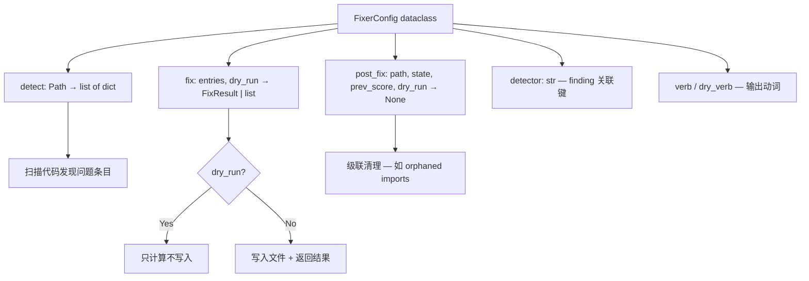
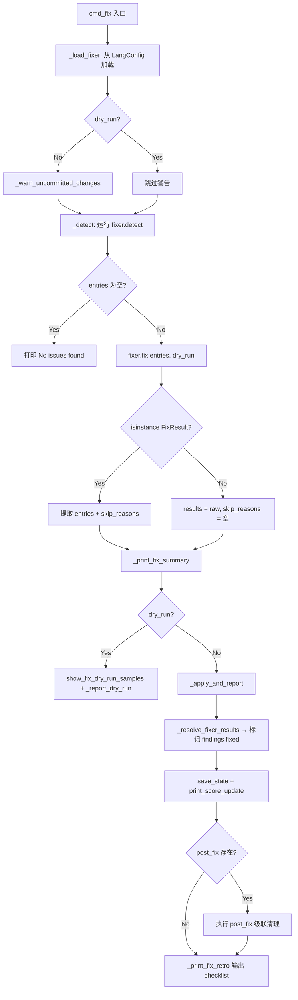
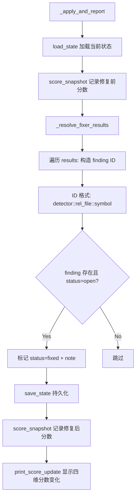

# PD-507.01 Desloppify — FixerConfig 三阶段自动修复与级联清理管道

> 文档编号：PD-507.01
> 来源：Desloppify `desloppify/app/commands/fix/`, `desloppify/languages/_framework/base/types.py`
> GitHub：https://github.com/peteromallet/desloppify.git
> 问题域：PD-507 自动修复系统 Auto-Fix System
> 状态：可复用方案

---

## 第 1 章 问题与动机

### 1.1 核心问题

代码质量工具通常只做"检测"——告诉你哪里有问题，但修复仍需人工逐个处理。当一个中大型 TypeScript 项目积累了数百个 unused imports、unused vars、debug logs 等机械性问题时，手动修复既耗时又容易遗漏。更棘手的是：

1. **修复的连锁反应**：删除 debug logs 后可能产生空的 if/else 块、orphaned 变量声明、无用 imports——需要级联清理
2. **安全性**：自动修改代码必须可预览（dry-run）、可回滚（git checkpoint 提醒）、可审计（skip reasons 追踪）
3. **状态联动**：修复后需要自动更新 findings 状态并重算质量分数，否则扫描结果与实际代码不一致

### 1.2 Desloppify 的解法概述

Desloppify 设计了一套 **detect → fix → post-fix** 三阶段管道，核心抽象是 `FixerConfig` dataclass：

1. **FixerConfig 注册表**：每个语言插件（如 TypeScript）在 `LangConfig.fixers` 字典中注册多个 fixer，每个 fixer 是一个 `FixerConfig` 实例，包含 detect/fix/post_fix 三个 callable（`types.py:98-108`）
2. **Dry-run 双轨执行**：所有 fixer 的 `fix()` 函数接受 `dry_run` 参数，dry-run 模式下只计算变更不写入文件，并展示 before→after 样本（`cmd.py:42-54`）
3. **状态自动解析**：修复完成后 `_resolve_fixer_results()` 遍历结果，将 state 中对应 findings 标记为 `fixed`，触发分数重算（`apply_flow.py:172-186`）
4. **级联清理**：`post_fix` 钩子支持修复后的连锁清理，如删除 debug logs 后自动运行 unused-imports fixer 清理 orphaned imports（`apply_flow.py:216-258`）
5. **Skip reasons 追踪**：无法安全修复的条目（rest element、array destructuring、side-effect calls）被分类记录，输出详细的 retro 报告（`apply_flow.py:262-312`）

### 1.3 设计思想

| 设计原则 | 具体实现 | 理由 | 替代方案 |
|----------|----------|------|----------|
| 关注点分离 | FixerConfig 将 detect/fix/post_fix 拆为三个独立 callable | 检测逻辑可复用于扫描阶段，修复逻辑独立演进 | 单一 fix() 函数包含所有逻辑 |
| 安全优先 | dry-run 默认可用 + git uncommitted 警告 + skip reasons | 自动修改代码风险高，必须可预览可回滚 | 直接修改无预览 |
| 语言插件化 | fixers 注册在 LangConfig 中，按语言隔离 | 不同语言的修复逻辑差异大（TS destructuring vs Python import） | 全局统一 fixer 列表 |
| 级联感知 | post_fix 钩子 + _COMMAND_POST_FIX 注册表 | 修复 A 可能产生问题 B，需要自动链式处理 | 要求用户手动多次运行 |
| 状态闭环 | fix 后自动 resolve findings + 重算 score | 保证 state 与代码一致，用户立即看到分数变化 | 要求用户手动 re-scan |

---

## 第 2 章 源码实现分析

### 2.1 架构概览

Desloppify 的自动修复系统由四层组成：

```
┌─────────────────────────────────────────────────────────┐
│                    CLI Layer (cmd.py)                     │
│  cmd_fix() → 解析参数 → 加载 fixer → 分发 dry/apply     │
├─────────────────────────────────────────────────────────┤
│               Pipeline Layer (apply_flow.py)             │
│  _detect() → fix() → _apply_and_report()                │
│  _resolve_fixer_results() → score_snapshot()             │
│  _cascade_unused_import_cleanup() (post_fix)             │
├─────────────────────────────────────────────────────────┤
│              Registry Layer (options.py + LangConfig)     │
│  _load_fixer() → lang.fixers[name] → FixerConfig        │
│  _COMMAND_POST_FIX → 动态注入 post_fix 钩子              │
├─────────────────────────────────────────────────────────┤
│           Fixer Implementations (fixers/*.py)            │
│  fix_unused_imports / fix_unused_vars / fix_debug_logs   │
│  fix_unused_params / fix_dead_useeffect                  │
│  apply_fixer() → _process_fixer_file() → safe_write     │
└─────────────────────────────────────────────────────────┘
```

### 2.2 核心实现

#### FixerConfig 数据契约



对应源码 `desloppify/languages/_framework/base/types.py:97-108`：

```python
@dataclass
class FixerConfig:
    """Configuration for an auto-fixer."""
    label: str
    detect: Callable[[Path], list[dict]]
    fix: Callable[..., FixResult | list[dict]]
    detector: str  # finding detector name (for state resolution)
    verb: str = "Fixed"
    dry_verb: str = "Would fix"
    post_fix: Callable[..., None] | None = None
```

`FixResult` 携带修复结果和跳过原因（`types.py:41-45`）：

```python
@dataclass
class FixResult:
    """Return type for fixer wrappers that need to carry metadata."""
    entries: list[dict]
    skip_reasons: dict[str, int] = field(default_factory=dict)
```

#### 三阶段执行管道



对应源码 `desloppify/app/commands/fix/cmd.py:23-70`：

```python
def cmd_fix(args: argparse.Namespace) -> None:
    """Auto-fix mechanical issues."""
    fixer_name = args.fixer
    if fixer_name == "review":
        _cmd_fix_review(args)
        return

    dry_run = getattr(args, "dry_run", False)
    path = Path(args.path)
    lang, fixer = _load_fixer(args, fixer_name)

    if not dry_run:
        _warn_uncommitted_changes()
    entries = _detect(fixer, path)
    if not entries:
        print(colorize(f"No {fixer.label} found.", "green"))
        return

    raw = fixer.fix(entries, dry_run=dry_run)
    if isinstance(raw, FixResult):
        results = raw.entries
        skip_reasons = raw.skip_reasons
    else:
        results = raw
        skip_reasons = {}
    total_items = sum(len(r["removed"]) for r in results)
    total_lines = sum(r.get("lines_removed", 0) for r in results)
    _print_fix_summary(fixer, results, total_items, total_lines, dry_run)

    if dry_run and results:
        show_fix_dry_run_samples(entries, results)

    if not dry_run:
        _apply_and_report(args, path, fixer, fixer_name, entries,
                          results, total_items, lang, skip_reasons)
    else:
        _report_dry_run(args, fixer_name, entries, results, total_items)
```

#### 状态解析与分数重算



对应源码 `desloppify/app/commands/fix/apply_flow.py:172-186`：

```python
def _resolve_fixer_results(
    state: dict, results: list[dict], detector: str, fixer_name: str
) -> list[str]:
    resolved_ids = []
    for r in results:
        rfile = rel(r["file"])
        for sym in r["removed"]:
            fid = f"{detector}::{rfile}::{sym}"
            if fid in state["findings"] and state["findings"][fid]["status"] == "open":
                state["findings"][fid]["status"] = "fixed"
                state["findings"][fid]["note"] = (
                    f"auto-fixed by desloppify fix {fixer_name}"
                )
                resolved_ids.append(fid)
    return resolved_ids
```

### 2.3 实现细节

#### Fixer 注册表（语言插件级）

TypeScript 语言插件在 `__init__.py:167-213` 中注册 6 个 fixer：

| Fixer 名 | 检测函数 | 修复函数 | detector 关联 |
|-----------|----------|----------|---------------|
| `unused-imports` | `_det_unused("imports")` | `fix_unused_imports` | `unused` |
| `debug-logs` | `_det_logs` | `_fix_logs` | `logs` |
| `unused-vars` | `_det_unused("vars")` | `_fix_vars` | `unused` |
| `unused-params` | `_det_unused("vars")` | `fix_unused_params` | `unused` |
| `dead-useeffect` | `_det_smell("dead_useeffect")` | `fix_dead_useeffect` | `smells` |
| `empty-if-chain` | `_det_smell("empty_if_chain")` | `fix_empty_if_chain` | `smells` |

#### 级联清理机制

`_cascade_unused_import_cleanup` 是 `post_fix` 钩子的典型实现（`apply_flow.py:216-258`）。当 `debug-logs` 或 `dead-useeffect` fixer 运行后，删除的代码可能导致某些 import 变成 unused，此钩子自动检测并清理：

```python
def _cascade_unused_import_cleanup(
    path: Path, state: dict, _prev_score: float,
    dry_run: bool, *, lang: LangRun | None = None,
) -> None:
    if not lang or "unused-imports" not in getattr(lang, "fixers", {}):
        return
    fixer = lang.fixers["unused-imports"]
    entries = fixer.detect(path)
    if not entries:
        return
    raw = fixer.fix(entries, dry_run=dry_run)
    results = raw.entries if isinstance(raw, FixResult) else raw
    resolved = _resolve_fixer_results(
        state, results, fixer.detector, "cascade-unused-imports"
    )
```

通过 `_COMMAND_POST_FIX` 字典动态注入（`apply_flow.py:259-260`）：

```python
_COMMAND_POST_FIX["debug-logs"] = _cascade_unused_import_cleanup
_COMMAND_POST_FIX["dead-useeffect"] = _cascade_unused_import_cleanup
```

#### apply_fixer 文件写入管道

所有 fixer 共享 `apply_fixer()` 模板（`fixer_io.py:27-57`），实现文件分组 → 读取 → transform → diff → 写入的标准流程：

```python
def apply_fixer(entries, transform_fn, *, dry_run=False, file_key="file"):
    by_file = _group_entries(entries, file_key)
    results = []
    for filepath, file_entries in sorted(by_file.items()):
        changed = _process_fixer_file(filepath, file_entries,
                                       transform_fn=transform_fn, dry_run=dry_run)
        if changed is not None:
            results.append(changed)
    return results
```

`_process_fixer_file` 在 dry-run 时跳过写入但仍计算 diff（`fixer_io.py:60-84`）。

#### Skip Reasons 分类体系

`vars.py` 中的 `_handle_unused_entry()` 对每个条目进行精确分类（`vars.py:47-84`），返回 `_EntryAction` NamedTuple 包含 `skip_reason`：

- `rest_element`：destructuring 含 `...rest`，删除会改变 rest 内容
- `array_destructuring`：数组解构是位置性的，不能安全删除
- `function_param`：函数参数需要用 `unused-params` fixer 处理
- `standalone_var_with_call`：变量赋值含函数调用，可能有副作用
- `out_of_range`：行号超出文件范围（可能是 stale 数据）


---

## 第 3 章 迁移指南

### 3.1 迁移清单

**阶段 1：核心抽象（1 天）**
- [ ] 定义 `FixerConfig` dataclass（detect/fix/post_fix 三个 callable）
- [ ] 定义 `FixResult` dataclass（entries + skip_reasons）
- [ ] 实现 `apply_fixer()` 文件写入管道（分组 → 读取 → transform → diff → 写入）

**阶段 2：命令层（0.5 天）**
- [ ] 实现 `cmd_fix()` CLI 入口（参数解析 → fixer 加载 → dry/apply 分发）
- [ ] 实现 `_load_fixer()` 从语言配置加载 fixer
- [ ] 实现 dry-run 样本展示（before→after 对比）

**阶段 3：状态联动（0.5 天）**
- [ ] 实现 `_resolve_fixer_results()` 将修复结果映射到 findings 状态
- [ ] 实现分数快照对比（修复前后 score delta）
- [ ] 实现 post-fix checklist 输出

**阶段 4：级联与扩展（按需）**
- [ ] 实现 `_COMMAND_POST_FIX` 注册表 + 级联清理钩子
- [ ] 为目标语言实现具体 fixer（unused-imports、unused-vars 等）
- [ ] 实现 `make_generic_fixer()` 工厂（基于外部工具的通用 fixer）

### 3.2 适配代码模板

以下是一个可直接运行的最小 FixerConfig 系统实现：

```python
from __future__ import annotations
from dataclasses import dataclass, field
from collections.abc import Callable
from pathlib import Path
from typing import Any


@dataclass
class FixResult:
    """修复结果，携带条目和跳过原因。"""
    entries: list[dict]
    skip_reasons: dict[str, int] = field(default_factory=dict)


@dataclass
class FixerConfig:
    """自动修复器配置。"""
    label: str
    detect: Callable[[Path], list[dict]]
    fix: Callable[..., FixResult | list[dict]]
    detector: str
    verb: str = "Fixed"
    dry_verb: str = "Would fix"
    post_fix: Callable[..., None] | None = None


def apply_fixer(
    entries: list[dict],
    transform_fn: Callable,
    *,
    dry_run: bool = False,
) -> list[dict]:
    """文件分组写入管道。"""
    by_file: dict[str, list[dict]] = {}
    for e in entries:
        by_file.setdefault(e["file"], []).append(e)

    results = []
    for filepath, file_entries in sorted(by_file.items()):
        path = Path(filepath)
        original = path.read_text()
        lines = original.splitlines(keepends=True)

        new_lines, removed_names = transform_fn(lines, file_entries)
        new_content = "".join(new_lines)

        if new_content == original:
            continue

        if not dry_run:
            path.write_text(new_content)

        lines_removed = len(original.splitlines()) - len(new_content.splitlines())
        results.append({
            "file": filepath,
            "removed": removed_names,
            "lines_removed": lines_removed,
        })
    return results


def resolve_fixer_results(
    state: dict,
    results: list[dict],
    detector: str,
    fixer_name: str,
) -> list[str]:
    """将修复结果映射到 findings 状态。"""
    resolved_ids = []
    for r in results:
        for sym in r["removed"]:
            fid = f"{detector}::{r['file']}::{sym}"
            findings = state.get("findings", {})
            if fid in findings and findings[fid]["status"] == "open":
                findings[fid]["status"] = "fixed"
                findings[fid]["note"] = f"auto-fixed by {fixer_name}"
                resolved_ids.append(fid)
    return resolved_ids


def run_fix(
    fixer: FixerConfig,
    path: Path,
    state: dict,
    *,
    dry_run: bool = False,
) -> dict[str, Any]:
    """执行完整的 detect → fix → resolve 管道。"""
    entries = fixer.detect(path)
    if not entries:
        return {"fixed": 0, "resolved": 0}

    raw = fixer.fix(entries, dry_run=dry_run)
    if isinstance(raw, FixResult):
        results, skip_reasons = raw.entries, raw.skip_reasons
    else:
        results, skip_reasons = raw, {}

    total_items = sum(len(r.get("removed", [])) for r in results)

    resolved_ids = []
    if not dry_run:
        resolved_ids = resolve_fixer_results(
            state, results, fixer.detector, fixer.label
        )
        if fixer.post_fix:
            fixer.post_fix(path, state, 0, dry_run)

    return {
        "fixed": total_items,
        "resolved": len(resolved_ids),
        "skip_reasons": skip_reasons,
        "dry_run": dry_run,
    }
```

### 3.3 适用场景

| 场景 | 适用度 | 说明 |
|------|--------|------|
| 代码质量工具（linter 自动修复） | ⭐⭐⭐ | 核心场景，detect→fix→report 三阶段完美匹配 |
| CI/CD 自动清理管道 | ⭐⭐⭐ | dry-run 模式可用于 PR check，apply 模式用于自动修复 |
| IDE 插件 quick-fix | ⭐⭐ | FixerConfig 抽象可复用，但需适配 IDE 的增量更新模型 |
| 大规模代码迁移（codemod） | ⭐⭐ | 级联清理机制有价值，但 codemod 通常需要 AST 级别的精度 |
| 单文件小修复 | ⭐ | 过度设计，直接用 sed/awk 更简单 |

---

## 第 4 章 测试用例

```python
import pytest
from pathlib import Path
from dataclasses import dataclass, field
from typing import Any
from collections.abc import Callable


# --- 复用第 3 章的核心类型 ---

@dataclass
class FixResult:
    entries: list[dict]
    skip_reasons: dict[str, int] = field(default_factory=dict)


@dataclass
class FixerConfig:
    label: str
    detect: Callable[[Path], list[dict]]
    fix: Callable[..., FixResult | list[dict]]
    detector: str
    verb: str = "Fixed"
    dry_verb: str = "Would fix"
    post_fix: Callable[..., None] | None = None


# --- 测试用例 ---

class TestFixerConfig:
    """FixerConfig 数据契约测试。"""

    def test_fixer_config_creation(self):
        fc = FixerConfig(
            label="unused imports",
            detect=lambda p: [{"file": "a.ts", "name": "foo", "line": 1}],
            fix=lambda entries, dry_run=False: FixResult(entries=[]),
            detector="unused",
        )
        assert fc.label == "unused imports"
        assert fc.verb == "Fixed"
        assert fc.dry_verb == "Would fix"
        assert fc.post_fix is None

    def test_fix_result_with_skip_reasons(self):
        result = FixResult(
            entries=[{"file": "a.ts", "removed": ["foo"]}],
            skip_reasons={"rest_element": 2, "array_destructuring": 1},
        )
        assert len(result.entries) == 1
        assert result.skip_reasons["rest_element"] == 2


class TestResolveFixerResults:
    """状态解析测试。"""

    def test_resolve_marks_open_findings_as_fixed(self):
        state = {
            "findings": {
                "unused::src/a.ts::foo": {"status": "open", "note": ""},
                "unused::src/a.ts::bar": {"status": "open", "note": ""},
                "unused::src/b.ts::baz": {"status": "resolved", "note": ""},
            }
        }
        results = [
            {"file": "src/a.ts", "removed": ["foo", "bar"]},
        ]
        # 模拟 resolve_fixer_results
        resolved = []
        for r in results:
            for sym in r["removed"]:
                fid = f"unused::{r['file']}::{sym}"
                if fid in state["findings"] and state["findings"][fid]["status"] == "open":
                    state["findings"][fid]["status"] = "fixed"
                    resolved.append(fid)

        assert len(resolved) == 2
        assert state["findings"]["unused::src/a.ts::foo"]["status"] == "fixed"
        assert state["findings"]["unused::src/b.ts::baz"]["status"] == "resolved"

    def test_resolve_ignores_non_open_findings(self):
        state = {
            "findings": {
                "unused::src/a.ts::foo": {"status": "dismissed", "note": ""},
            }
        }
        results = [{"file": "src/a.ts", "removed": ["foo"]}]
        resolved = []
        for r in results:
            for sym in r["removed"]:
                fid = f"unused::{r['file']}::{sym}"
                if fid in state["findings"] and state["findings"][fid]["status"] == "open":
                    resolved.append(fid)
        assert len(resolved) == 0


class TestDryRunBehavior:
    """Dry-run 模式测试。"""

    def test_dry_run_does_not_write_files(self, tmp_path):
        test_file = tmp_path / "test.ts"
        test_file.write_text("import { foo } from './bar';\n")
        original = test_file.read_text()

        def detect(path):
            return [{"file": str(test_file), "name": "foo", "line": 1}]

        def fix(entries, dry_run=False):
            if dry_run:
                return FixResult(entries=[{"file": entries[0]["file"], "removed": ["foo"], "lines_removed": 1}])
            return FixResult(entries=[])

        fixer = FixerConfig("unused imports", detect, fix, "unused")
        result = fixer.fix(detect(tmp_path), dry_run=True)

        assert test_file.read_text() == original
        assert len(result.entries) == 1


class TestCascadeCleanup:
    """级联清理测试。"""

    def test_post_fix_hook_is_called(self):
        post_fix_called = []

        def mock_post_fix(path, state, prev_score, dry_run, **kwargs):
            post_fix_called.append(True)

        fixer = FixerConfig(
            label="debug logs",
            detect=lambda p: [],
            fix=lambda e, dry_run=False: [],
            detector="logs",
            post_fix=mock_post_fix,
        )
        assert fixer.post_fix is not None
        fixer.post_fix(Path("."), {}, 0, False)
        assert len(post_fix_called) == 1
```


---

## 第 5 章 跨域关联

| 关联域 | 关系类型 | 说明 |
|--------|----------|------|
| PD-500 静态代码分析 | 依赖 | FixerConfig.detect 复用 PD-500 的检测器输出（unused detector、logs detector、smells detector），检测与修复共享同一数据源 |
| PD-508 文件区域分类 | 协同 | Zone 分类（TEST/CONFIG/GENERATED）影响 fixer 的作用范围——生成文件和测试文件通常跳过修复 |
| PD-509 增量扫描状态合并 | 协同 | fix 后 `_resolve_fixer_results()` 直接修改 state.findings，与增量扫描的状态合并机制共享同一 state 模型 |
| PD-502 反作弊分数完整性 | 依赖 | 修复后自动重算 score（overall/objective/strict/verified 四维），依赖 PD-502 的分数计算引擎 |
| PD-505 LLM 主观评审 | 协同 | `fix review` 子命令准备结构化评审数据，供 LLM 进行主观维度评估，是自动修复的补充路径 |
| PD-506 配置管理 | 依赖 | fixer 注册在 LangConfig 中，语言检测和配置加载依赖 PD-506 的配置管理系统 |

---

## 第 6 章 来源文件索引

| 文件 | 行范围 | 关键实现 |
|------|--------|----------|
| `desloppify/languages/_framework/base/types.py` | L41-L45 | FixResult dataclass 定义 |
| `desloppify/languages/_framework/base/types.py` | L97-L108 | FixerConfig dataclass 定义 |
| `desloppify/languages/_framework/base/types.py` | L129-L149 | LangConfig.fixers 注册表字段 |
| `desloppify/app/commands/fix/cmd.py` | L23-L70 | cmd_fix() CLI 入口，三阶段分发 |
| `desloppify/app/commands/fix/apply_flow.py` | L29-L39 | _detect() 检测阶段 |
| `desloppify/app/commands/fix/apply_flow.py` | L67-L127 | _apply_and_report() 应用+报告阶段 |
| `desloppify/app/commands/fix/apply_flow.py` | L130-L169 | _report_dry_run() dry-run 报告 |
| `desloppify/app/commands/fix/apply_flow.py` | L172-L186 | _resolve_fixer_results() 状态解析 |
| `desloppify/app/commands/fix/apply_flow.py` | L216-L258 | _cascade_unused_import_cleanup() 级联清理 |
| `desloppify/app/commands/fix/apply_flow.py` | L259-L260 | _COMMAND_POST_FIX 注册 |
| `desloppify/app/commands/fix/apply_flow.py` | L262-L312 | Skip reason 标签 + retro checklist |
| `desloppify/app/commands/fix/options.py` | L13-L33 | _load_fixer() + _COMMAND_POST_FIX 字典 |
| `desloppify/languages/typescript/__init__.py` | L167-L213 | _get_ts_fixers() TypeScript fixer 注册表 |
| `desloppify/languages/typescript/fixers/imports.py` | L10-L34 | fix_unused_imports() 实现 |
| `desloppify/languages/typescript/fixers/vars.py` | L97-L124 | fix_unused_vars() + skip_reasons |
| `desloppify/languages/typescript/fixers/logs.py` | L107-L152 | fix_debug_logs() + 死变量检测 + 空块清理 |
| `desloppify/languages/typescript/fixers/params.py` | L8-L19 | fix_unused_params() 前缀重命名 |
| `desloppify/languages/typescript/fixers/fixer_io.py` | L27-L57 | apply_fixer() 文件写入管道模板 |
| `desloppify/languages/_framework/generic_parts/tool_factories.py` | L113-L158 | make_generic_fixer() 外部工具 fixer 工厂 |
| `desloppify/app/commands/helpers/score_update.py` | L10-L56 | print_score_update() 四维分数展示 |
| `desloppify/app/commands/_show_terminal.py` | L12-L21 | show_fix_dry_run_samples() dry-run 样本展示 |

---

## 第 7 章 横向对比维度

```json comparison_data
{
  "project": "Desloppify",
  "dimensions": {
    "修复器注册": "LangConfig.fixers 字典，按语言插件隔离，6 个 TS fixer",
    "检测修复分离": "FixerConfig 三字段：detect/fix/post_fix 独立 callable",
    "预览机制": "dry-run 参数贯穿全链路 + before→after 随机样本展示",
    "状态联动": "fix 后自动 resolve findings + 四维 score 重算 + delta 展示",
    "级联清理": "_COMMAND_POST_FIX 注册表 + post_fix 钩子自动链式清理",
    "跳过追踪": "FixResult.skip_reasons 分类统计 + retro checklist 输出",
    "通用工厂": "make_generic_fixer() 基于外部工具命令的通用 fixer 生成"
  }
}
```

### 域元数据补充

```json domain_metadata
{
  "solution_summary": "Desloppify 用 FixerConfig(detect/fix/post_fix) 三阶段管道 + _COMMAND_POST_FIX 级联钩子实现 6 类 TS 自动修复，修复后自动 resolve findings 并重算四维分数",
  "description": "自动修复需要级联清理、跳过原因追踪和状态闭环反馈",
  "sub_problems": [
    "Cascade cleanup after primary fix (orphaned imports/empty blocks)",
    "Skip reason classification and audit trail",
    "Generic fixer factory for external tool integration"
  ],
  "best_practices": [
    "Post-fix hook registry enables automatic cascade cleanup chains",
    "FixResult carries skip_reasons for transparent audit of unfixable items",
    "Git uncommitted changes warning before destructive auto-fix"
  ]
}
```

