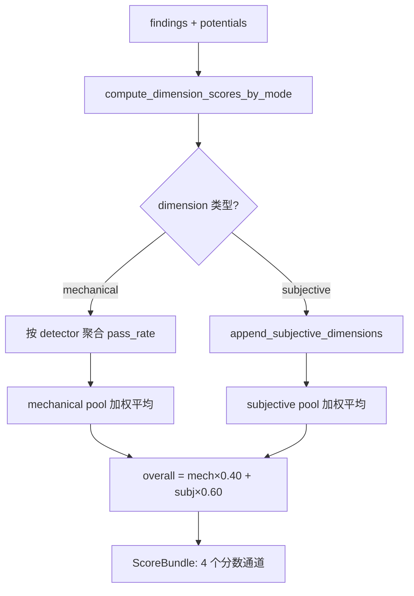
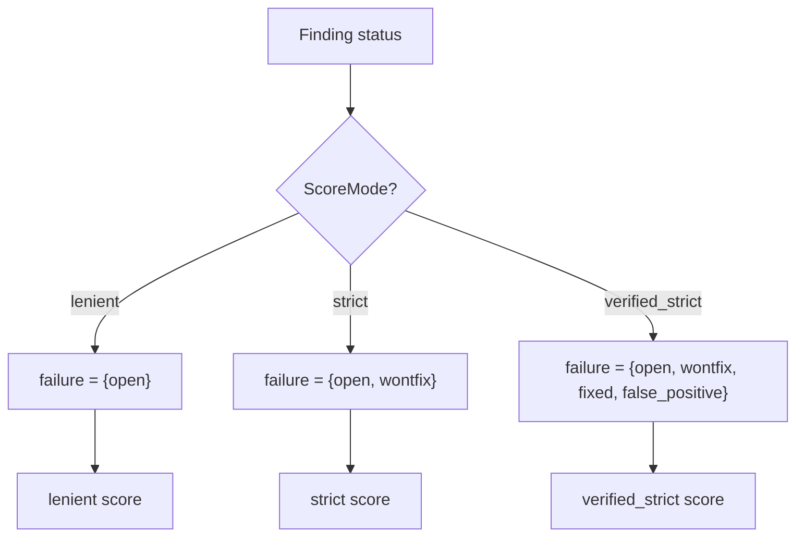
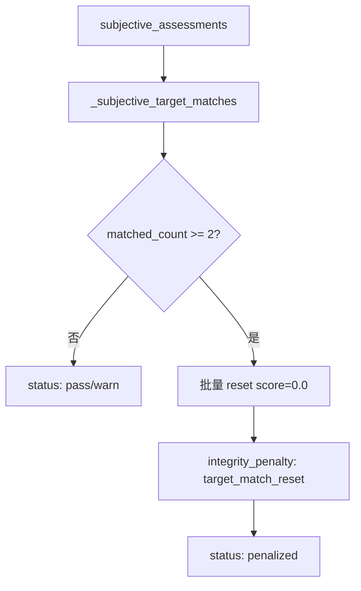

# PD-07.507 Desloppify — 双池加权评分与 anti-gaming 完整性防护

> 文档编号：PD-07.507
> 来源：Desloppify `desloppify/engine/_scoring/`, `desloppify/intelligence/integrity.py`
> GitHub：https://github.com/peteromallet/desloppify.git
> 问题域：PD-07 质量检查 Output Quality Assurance
> 状态：可复用方案

---

## 第 1 章 问题与动机

### 1.1 核心问题

代码质量评估面临两个根本矛盾：

1. **机械检测 vs 主观判断**：dead code、cyclomatic complexity、duplication 等可以用 AST/正则精确检测，但 naming quality、abstraction fitness、design coherence 等需要 LLM 主观评审。两类信号的量纲不同、可信度不同，如何统一为一个可比较的分数？

2. **评分可信度 vs 评分可操纵性**：LLM 评审容易被"刷分"——如果目标分数已知，LLM 可能生成恰好达标的分数。如何在保持评分透明的同时防止 gaming？

Desloppify 的核心创新是将这两个矛盾分别用**双池加权评分**和 **anti-gaming integrity 机制**解决。

### 1.2 Desloppify 的解法概述

1. **双池评分架构**：mechanical pool（40%）和 subjective pool（60%）独立计算加权平均，再按固定比例混合为 overall score（`desloppify/engine/_scoring/policy/core.py:148-149`）
2. **三模式评分**：lenient / strict / verified_strict 三种模式对 finding 状态的容忍度递减，同一套 findings 产出三个分数通道（`desloppify/engine/_scoring/policy/core.py:183-187`）
3. **Zone 分类系统**：文件按 production/test/config/generated/vendor/script 分区，非生产区 findings 排除出评分（`desloppify/engine/policy/zones.py:37`）
4. **Concern 桥接机制**：mechanical findings 聚合后生成 Concern 对象，作为 LLM 主观评审的输入，形成"机械→主观"的单向数据流（`desloppify/engine/concerns.py:22-31`）
5. **Anti-gaming integrity**：检测 subjective scores 是否聚集在目标分数附近，超过阈值则批量重置为 0 分（`desloppify/engine/_state/scoring.py:88-121`）

### 1.3 设计思想

| 设计原则 | 具体实现 | 理由 | 替代方案 |
|----------|----------|------|----------|
| 双池隔离 | mechanical 40% + subjective 60% 固定比例 | 防止机械检测淹没主观信号，也防止 LLM 评分独大 | 单一加权平均（无法区分信号来源） |
| 三模式并行 | lenient/strict/verified_strict 同时计算 | 不同场景需要不同严格度，CI 用 strict，审计用 verified_strict | 单一模式 + 手动调参 |
| Zone 排除 | test/config/generated/vendor 不计入分数 | 测试代码的 code smell 不应拉低生产代码评分 | 全局统一评分（噪声大） |
| Concern 桥接 | mechanical → Concern → LLM review | 给 LLM 提供结构化上下文而非原始 findings | 直接把 findings 喂给 LLM（信息过载） |
| Anti-gaming | target_match_reset 批量惩罚 | 多个维度同时命中目标分数是统计异常，大概率是 gaming | 信任 LLM 输出（容易被操纵） |

---

## 第 2 章 源码实现分析

### 2.1 架构概览

Desloppify 的评分系统是一个分层管道，从底层 detector 到顶层 overall score：

```
┌─────────────────────────────────────────────────────────────────┐
│                        Overall Score                            │
│         mechanical_avg × 0.40 + subjective_avg × 0.60          │
├──────────────────────────┬──────────────────────────────────────┤
│   Mechanical Pool (40%)  │       Subjective Pool (60%)          │
│  ┌──────────────────┐    │  ┌────────────────────────────────┐  │
│  │ File health ×2.0 │    │  │ High elegance ×22.0            │  │
│  │ Code quality ×1.0│    │  │ Mid elegance ×22.0             │  │
│  │ Duplication ×1.0 │    │  │ Low elegance ×12.0             │  │
│  │ Test health ×1.0 │    │  │ Contracts ×12.0                │  │
│  │ Security ×1.0    │    │  │ Type safety ×12.0              │  │
│  └──────────────────┘    │  │ Abstraction fit ×8.0           │  │
│                          │  │ Logic clarity ×6.0             │  │
│  每个维度内多个 detector  │  │ Structure nav ×5.0             │  │
│  按 pass_rate 聚合       │  │ Error consistency ×3.0         │  │
│                          │  │ Naming quality ×2.0            │  │
│                          │  │ AI generated debt ×1.0         │  │
│                          │  │ Design coherence ×10.0         │  │
│                          │  └────────────────────────────────┘  │
├──────────────────────────┴──────────────────────────────────────┤
│  Zone Filter: production only → test/config/generated excluded  │
├─────────────────────────────────────────────────────────────────┤
│  Anti-gaming: target_match_reset if ≥2 dims within ±5% target  │
└─────────────────────────────────────────────────────────────────┘
```

### 2.2 核心实现

#### 2.2.1 双池加权评分引擎



对应源码 `desloppify/engine/_scoring/results/core.py:161-289`：

```python
def compute_health_breakdown(
    dimension_scores: dict, *, score_key: str = "score"
) -> dict[str, object]:
    """Budget-weighted blend of mechanical and subjective dimension scores."""
    # ... 遍历所有维度，按 pool 分类
    for name, data in dimension_scores.items():
        score = float(data.get(score_key, data.get("score", 0.0)))
        is_subjective = "subjective_assessment" in data.get("detectors", {})
        if is_subjective:
            configured = max(0.0, _subjective_dimension_weight(name, data))
            effective = configured
            subj_sum += score * effective
            subj_weight += effective
            # ...
            continue
        # mechanical: 应用 sample_factor 阻尼
        checks = float(data.get("checks", 0) or 0)
        sample_factor = min(1.0, checks / MIN_SAMPLE) if checks > 0 else 0.0
        configured = max(0.0, _mechanical_dimension_weight(name))
        effective = configured * sample_factor
        mech_sum += score * effective
        mech_weight += effective
    # 最终混合
    if subj_avg is None:
        overall_score = round(mech_avg, 1)
    elif mech_weight == 0:
        overall_score = round(subj_avg, 1)
    else:
        overall_score = round(
            mech_avg * MECHANICAL_WEIGHT_FRACTION + subj_avg * SUBJECTIVE_WEIGHT_FRACTION, 1
        )
```

关键设计点：
- `MIN_SAMPLE = 200`（`policy/core.py:137`）：mechanical 维度的 checks 数低于 200 时，权重按比例衰减（`sample_factor`），防止小样本维度摆动整体分数
- `SUBJECTIVE_WEIGHT_FRACTION = 0.60`（`policy/core.py:148`）：subjective 占 60%，体现"代码质量的核心是设计判断而非机械指标"的哲学

#### 2.2.2 三模式评分与 finding 状态



对应源码 `desloppify/engine/_scoring/policy/core.py:183-187`：

```python
FAILURE_STATUSES_BY_MODE: dict[ScoreMode, frozenset[str]] = {
    "lenient": frozenset({"open"}),
    "strict": frozenset({"open", "wontfix"}),
    "verified_strict": frozenset({"open", "wontfix", "fixed", "false_positive"}),
}
```

三模式的语义：
- **lenient**：只有 open 的 finding 算失败，适合日常开发
- **strict**：wontfix 也算失败，防止"标记为 wontfix 来刷分"
- **verified_strict**：连 fixed 和 false_positive 都算失败，只有经过验证删除的 finding 才不扣分

#### 2.2.3 Anti-gaming integrity 机制



对应源码 `desloppify/engine/_state/scoring.py:88-121`：

```python
def _apply_subjective_integrity_policy(
    subjective_assessments: dict,
    *,
    target: float,
) -> tuple[dict, dict[str, object]]:
    """Apply anti-gaming penalties for subjective scores clustered on the target."""
    normalized_target = max(0.0, min(100.0, float(target)))
    matched_dimensions = _subjective_target_matches(
        subjective_assessments, target=normalized_target,
    )
    # ...
    if len(matched_dimensions) < _SUBJECTIVE_TARGET_RESET_THRESHOLD:  # threshold = 2
        meta["status"] = "warn" if matched_dimensions else "pass"
        return subjective_assessments, meta
    # 超过阈值：批量重置
    adjusted = deepcopy(subjective_assessments)
    for dimension in matched_dimensions:
        payload = adjusted.get(dimension)
        if isinstance(payload, dict):
            payload["score"] = 0.0
            payload["integrity_penalty"] = "target_match_reset"
```

`matches_target_score` 使用 ±5% 容差（`SUBJECTIVE_TARGET_MATCH_TOLERANCE = 0.05`，`policy/core.py:191`）。当 ≥2 个维度的分数落在目标 ±5% 范围内，所有命中维度被重置为 0 分。这是一个**统计异常检测**：真实评审不太可能让多个独立维度恰好命中同一个目标值。

### 2.3 实现细节

#### Zone 分类与评分排除

文件分区系统（`desloppify/engine/policy/zones.py:25-33`）将每个文件分类为 6 个 zone 之一。Zone 分类通过 `FileZoneMap` 缓存（每次 scan 构建一次），分类规则支持目录模式、后缀模式、前缀模式和精确匹配。

每个 zone 有独立的 `ZonePolicy`（`zones.py:193-229`），控制：
- `skip_detectors`：该 zone 完全跳过的 detector
- `downgrade_detectors`：降级为 low confidence 的 detector
- `exclude_from_score`：是否排除出评分

#### Concern 桥接：mechanical → subjective

`desloppify/engine/concerns.py` 实现了三个 concern generator：

1. **_file_concerns**（L307-361）：单文件内 2+ judgment detector 或 1 个 detector 有 elevated signals（monster function ≥300 LOC、nesting ≥6、params ≥8）
2. **_cross_file_patterns**（L364-430）：3+ 文件共享相同 detector 组合 → systemic pattern
3. **_systemic_smell_patterns**（L433-488）：同一 smell_id 出现在 5+ 文件 → systemic smell

每个 Concern 包含 `fingerprint`（SHA256 前 16 位）用于 dismissal 追踪，`source_findings` 用于检测 dismissal 是否过期。

#### DimensionMergeScorer：批量评审分数合并

`desloppify/app/commands/review/batch_scoring.py:66-173` 实现了 holistic review 的分数合并逻辑：

- **finding_severity**：基于 confidence × impact_scope × fix_scope 三维权重（`batch_scoring.py:69-90`）
- **score_dimension**：floor-aware blending（70% weighted_mean + 30% floor）+ issue_penalty + issue_cap（`batch_scoring.py:113-146`）
- `_MAX_ISSUE_PENALTY = 24.0`：单维度最大扣分上限
- `_CAP_FLOOR = 60.0`：有 findings 时分数下限 60
- `_CAP_CEILING = 90.0`：有 findings 时分数上限 90

#### Detector 注册与运行时扩展

`desloppify/core/registry.py` 是 detector 的单一真相源。每个 `DetectorMeta` 包含：
- `action_type`：auto_fix / reorganize / refactor / manual_fix
- `needs_judgment`：是否需要 LLM 设计判断
- `fixers`：关联的自动修复器
- `tool`：关联的工具命令（如 "move"）

`register_detector()` 支持运行时注册新 detector（插件机制），注册后自动重建 `JUDGMENT_DETECTORS` frozenset。


---

## 第 3 章 迁移指南

### 3.1 迁移清单

**阶段 1：双池评分框架**
- [ ] 定义 mechanical dimensions（从现有 linter/detector 映射）
- [ ] 定义 subjective dimensions（从 LLM 评审维度映射）
- [ ] 实现 `compute_health_breakdown()` 双池加权逻辑
- [ ] 配置 `MECHANICAL_WEIGHT_FRACTION` 和 `SUBJECTIVE_WEIGHT_FRACTION`

**阶段 2：三模式评分**
- [ ] 定义 finding 状态机（open → fixed / wontfix / false_positive）
- [ ] 实现 `FAILURE_STATUSES_BY_MODE` 三模式映射
- [ ] 在 CI 中使用 strict 模式，开发中使用 lenient 模式

**阶段 3：Zone 分类**
- [ ] 实现 `FileZoneMap` 文件分区缓存
- [ ] 定义 zone rules（目录模式、后缀模式等）
- [ ] 实现 `ZonePolicy` 控制每个 zone 的 detector 行为

**阶段 4：Anti-gaming integrity**
- [ ] 实现 `matches_target_score()` 容差匹配
- [ ] 实现 `_apply_subjective_integrity_policy()` 批量重置
- [ ] 配置 `_SUBJECTIVE_TARGET_RESET_THRESHOLD`（建议 ≥2）

### 3.2 适配代码模板

#### 双池加权评分器

```python
from dataclasses import dataclass
from typing import Literal

ScoreMode = Literal["lenient", "strict", "verified_strict"]

MECHANICAL_WEIGHT = 0.40
SUBJECTIVE_WEIGHT = 0.60
MIN_SAMPLE = 200  # 小样本阻尼阈值

FAILURE_STATUSES: dict[ScoreMode, frozenset[str]] = {
    "lenient": frozenset({"open"}),
    "strict": frozenset({"open", "wontfix"}),
    "verified_strict": frozenset({"open", "wontfix", "fixed", "false_positive"}),
}


@dataclass(frozen=True)
class DimensionScore:
    name: str
    score: float  # 0-100
    weight: float
    checks: int
    is_subjective: bool


def compute_overall_score(dimensions: list[DimensionScore]) -> float:
    """Dual-pool weighted scoring with sample dampening."""
    mech_sum = mech_weight = subj_sum = subj_weight = 0.0

    for dim in dimensions:
        if dim.is_subjective:
            subj_sum += dim.score * dim.weight
            subj_weight += dim.weight
        else:
            sample_factor = min(1.0, dim.checks / MIN_SAMPLE) if dim.checks > 0 else 0.0
            effective = dim.weight * sample_factor
            mech_sum += dim.score * effective
            mech_weight += effective

    mech_avg = (mech_sum / mech_weight) if mech_weight > 0 else 100.0
    subj_avg = (subj_sum / subj_weight) if subj_weight > 0 else None

    if subj_avg is None:
        return round(mech_avg, 1)
    if mech_weight == 0:
        return round(subj_avg, 1)
    return round(mech_avg * MECHANICAL_WEIGHT + subj_avg * SUBJECTIVE_WEIGHT, 1)
```

#### Anti-gaming integrity checker

```python
TARGET_MATCH_TOLERANCE = 0.05  # ±5%
GAMING_THRESHOLD = 2  # ≥2 个维度命中则判定为 gaming


def matches_target(score: float, target: float, tolerance: float = TARGET_MATCH_TOLERANCE) -> bool:
    return abs(score - target) <= tolerance


def apply_integrity_policy(
    assessments: dict[str, float],
    target: float,
) -> tuple[dict[str, float], dict]:
    """Detect and penalize score gaming."""
    matched = [dim for dim, score in assessments.items() if matches_target(score, target)]
    meta = {"status": "pass", "matched_count": len(matched), "matched_dimensions": matched}

    if len(matched) < GAMING_THRESHOLD:
        meta["status"] = "warn" if matched else "pass"
        return assessments, meta

    # 批量重置
    adjusted = dict(assessments)
    for dim in matched:
        adjusted[dim] = 0.0
    meta["status"] = "penalized"
    meta["reset_dimensions"] = matched
    return adjusted, meta
```

### 3.3 适用场景

| 场景 | 适用度 | 说明 |
|------|--------|------|
| 代码质量评分系统 | ⭐⭐⭐ | 核心场景，mechanical + subjective 双池架构直接适用 |
| CI/CD 质量门禁 | ⭐⭐⭐ | 三模式评分天然适配不同环境的严格度需求 |
| LLM 评审结果聚合 | ⭐⭐⭐ | DimensionMergeScorer 的 pressure-adjusted 合并逻辑可复用 |
| 内容质量评分 | ⭐⭐ | 双池架构可迁移，但 detector 需要重新定义 |
| 考试/作业评分 | ⭐⭐ | anti-gaming 机制有价值，但 zone 分类不适用 |
| 单一维度评分 | ⭐ | 过度设计，简单场景不需要双池 |

---

## 第 4 章 测试用例

```python
import pytest
from copy import deepcopy


# ── 双池评分测试 ──────────────────────────────────────────

class TestDualPoolScoring:
    """Tests for the dual-pool weighted scoring system."""

    def test_mechanical_only_score(self):
        """When no subjective dimensions exist, mechanical pool is 100%."""
        dims = [
            DimensionScore("Code quality", 80.0, 1.0, 500, False),
            DimensionScore("Security", 90.0, 1.0, 300, False),
        ]
        score = compute_overall_score(dims)
        assert score == 85.0  # (80*1 + 90*1) / 2

    def test_dual_pool_blending(self):
        """Mechanical 40% + subjective 60% blending."""
        dims = [
            DimensionScore("Code quality", 100.0, 1.0, 500, False),
            DimensionScore("High elegance", 50.0, 22.0, 0, True),
        ]
        score = compute_overall_score(dims)
        # mech_avg=100, subj_avg=50 → 100*0.4 + 50*0.6 = 70.0
        assert score == 70.0

    def test_sample_dampening(self):
        """Low check count dampens mechanical dimension weight."""
        dims = [
            DimensionScore("Code quality", 50.0, 1.0, 100, False),  # 100/200 = 0.5 factor
            DimensionScore("Security", 100.0, 1.0, 200, False),     # 200/200 = 1.0 factor
        ]
        score = compute_overall_score(dims)
        # effective: CQ=0.5, Sec=1.0 → (50*0.5 + 100*1.0) / 1.5 = 83.3
        assert abs(score - 83.3) < 0.1


# ── Anti-gaming 测试 ──────────────────────────────────────

class TestAntiGaming:
    """Tests for the anti-gaming integrity mechanism."""

    def test_no_gaming_detected(self):
        """Scores not near target → pass."""
        assessments = {"elegance": 75.0, "clarity": 82.0}
        adjusted, meta = apply_integrity_policy(assessments, target=90.0)
        assert meta["status"] == "pass"
        assert adjusted == assessments

    def test_single_match_warns(self):
        """One dimension near target → warn but no reset."""
        assessments = {"elegance": 90.0, "clarity": 75.0}
        adjusted, meta = apply_integrity_policy(assessments, target=90.0)
        assert meta["status"] == "warn"
        assert adjusted["elegance"] == 90.0  # not reset

    def test_gaming_detected_resets(self):
        """Two+ dimensions near target → penalized, scores reset to 0."""
        assessments = {"elegance": 90.02, "clarity": 89.97, "naming": 75.0}
        adjusted, meta = apply_integrity_policy(assessments, target=90.0)
        assert meta["status"] == "penalized"
        assert adjusted["elegance"] == 0.0
        assert adjusted["clarity"] == 0.0
        assert adjusted["naming"] == 75.0  # unaffected


# ── 三模式评分测试 ────────────────────────────────────────

class TestScoringModes:
    """Tests for lenient/strict/verified_strict mode behavior."""

    def test_lenient_ignores_wontfix(self):
        assert "wontfix" not in FAILURE_STATUSES["lenient"]

    def test_strict_includes_wontfix(self):
        assert "wontfix" in FAILURE_STATUSES["strict"]

    def test_verified_strict_includes_all(self):
        vs = FAILURE_STATUSES["verified_strict"]
        assert "open" in vs and "wontfix" in vs and "fixed" in vs and "false_positive" in vs
```


---

## 第 5 章 跨域关联

| 关联域 | 关系类型 | 说明 |
|--------|----------|------|
| PD-04 工具系统 | 依赖 | detector 注册机制（`core/registry.py`）是工具系统的一部分，评分依赖 detector 输出 |
| PD-10 中间件管道 | 协同 | Concern 生成器是一种管道模式，mechanical findings → Concern → LLM review 形成数据流 |
| PD-11 可观测性 | 协同 | `compute_health_breakdown()` 输出的 entries 包含 pool_share、overall_contribution 等透明度指标 |
| PD-08 搜索与检索 | 协同 | Zone 分类系统影响文件发现和检索范围，非生产文件被排除出评分 |
| PD-03 容错与重试 | 依赖 | `score_confidence` 机制（`_state/scoring.py:161-271`）在 detector 覆盖不完整时降级分数置信度 |
| PD-06 记忆持久化 | 协同 | Concern dismissal 通过 `concern_dismissals` 持久化到 state，跨 scan 保持 |

---

## 第 6 章 来源文件索引

| 文件 | 行范围 | 关键实现 |
|------|--------|----------|
| `desloppify/engine/_scoring/policy/core.py` | L1-266 | 评分策略核心：Dimension、DetectorScoringPolicy、三模式定义、双池权重常量 |
| `desloppify/engine/_scoring/results/core.py` | L1-414 | 评分聚合引擎：compute_health_breakdown、compute_score_bundle、ScoreBundle |
| `desloppify/engine/_scoring/detection.py` | L1-201 | 单 detector 评分：pass_rate 计算、file-based cap、zone 过滤 |
| `desloppify/engine/_scoring/subjective/core.py` | L1-255 | 主观维度注入：append_subjective_dimensions、assessment 驱动评分 |
| `desloppify/engine/_state/scoring.py` | L88-121 | Anti-gaming integrity：_apply_subjective_integrity_policy |
| `desloppify/engine/policy/zones.py` | L1-276 | Zone 分类系统：FileZoneMap、ZonePolicy、classify_file |
| `desloppify/engine/concerns.py` | L1-539 | Concern 桥接：三个 generator、fingerprint dismissal |
| `desloppify/core/registry.py` | L1-396 | Detector 注册表：DetectorMeta、JUDGMENT_DETECTORS、运行时注册 |
| `desloppify/intelligence/integrity.py` | L1-115 | 轻量 integrity helpers：subjective_review_open_breakdown |
| `desloppify/app/commands/review/batch_scoring.py` | L1-177 | 批量评审分数合并：DimensionMergeScorer、pressure-adjusted scoring |
| `desloppify/intelligence/review/dimensions/metadata.py` | L1-282 | 主观维度元数据：display_name、weight、reset_on_scan |
| `desloppify/scoring.py` | L1-83 | 评分系统 facade：统一导出所有评分 API |

---

## 第 7 章 横向对比维度

```json comparison_data
{
  "project": "Desloppify",
  "dimensions": {
    "检查方式": "双池架构：mechanical detector（AST/正则）+ subjective LLM 评审，60/40 加权混合",
    "评估维度": "5 mechanical + 12 subjective 共 17 维度，每维度独立加权",
    "评估粒度": "文件级 finding → 维度级 pass_rate → 池级加权平均 → overall score",
    "迭代机制": "无自动迭代，依赖 scan→review→import 手动循环",
    "反馈机制": "Concern 桥接：mechanical findings 聚合为结构化 Concern 供 LLM 评审",
    "自动修复": "4 级 action_type：auto_fix/reorganize/refactor/manual_fix，部分 detector 有 fixer",
    "覆盖范围": "25+ detector 覆盖 dead code/complexity/duplication/naming/security/coupling 等",
    "安全防护": "anti-gaming integrity：≥2 维度命中目标 ±5% 则批量重置为 0 分",
    "配置驱动": "DetectorScoringPolicy 数据驱动，register_scoring_policy 运行时扩展",
    "降级路径": "score_confidence 机制：detector 覆盖不完整时标记 reduced 并降低置信度",
    "评估模型隔离": "review findings 排除出 detection scoring pipeline，仅通过 assessment 影响分数",
    "决策归一化": "三模式 lenient/strict/verified_strict 对 finding 状态容忍度递减",
    "错误归因": "Zone 分类排除 test/config/generated/vendor，防止非生产代码污染评分",
    "阶段拆分防截断": "DimensionMergeScorer 分阶段合并：weighted_mean → floor_aware → issue_penalty → cap",
    "双重token约束": "无 token 约束，评分在本地完成不调用 LLM",
    "约束类型丰富度": "confidence×impact_scope×fix_scope 三维 severity 权重"
  }
}
```

### 域元数据补充

```json domain_metadata
{
  "solution_summary": "Desloppify 用 mechanical(40%)+subjective(60%) 双池加权评分 + anti-gaming integrity 批量重置机制，结合 Zone 文件分区和三模式评分（lenient/strict/verified_strict）实现代码质量评估",
  "description": "机械检测与 LLM 主观评审的量纲统一与防操纵问题",
  "sub_problems": [
    "小样本阻尼：低 check 数维度权重按比例衰减防止摆动整体分数",
    "Concern 桥接：mechanical findings 聚合为结构化 Concern 供 LLM 评审",
    "Zone 分区评分排除：非生产文件（test/config/generated/vendor）排除出评分",
    "Dismissal 过期检测：Concern fingerprint 关联 source_findings 变更时自动失效",
    "Systemic pattern 检测：3+ 文件共享相同 detector 组合时升级为架构级 concern",
    "Finding pressure 合并：severity 三维权重（confidence×impact×fix_scope）驱动分数下压"
  ],
  "best_practices": [
    "双池隔离优于单一加权：mechanical 和 subjective 信号量纲不同，混合前必须分池归一化",
    "三模式并行计算：同一 findings 同时产出 lenient/strict/verified_strict 三个分数，适配不同场景",
    "Anti-gaming 用统计异常检测：多维度同时命中目标值是统计异常，比信任 LLM 输出更可靠",
    "Zone 分类一次构建多次查询：FileZoneMap 缓存避免重复分类开销",
    "Concern 是 ephemeral 的：每次从 state 重新计算，不持久化，只有 LLM 确认后才变成 Finding"
  ]
}
```

