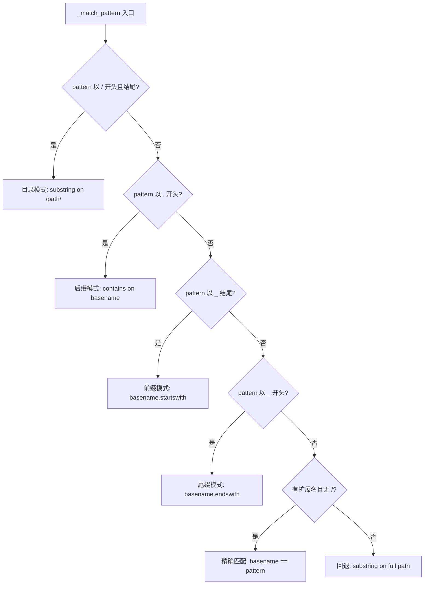
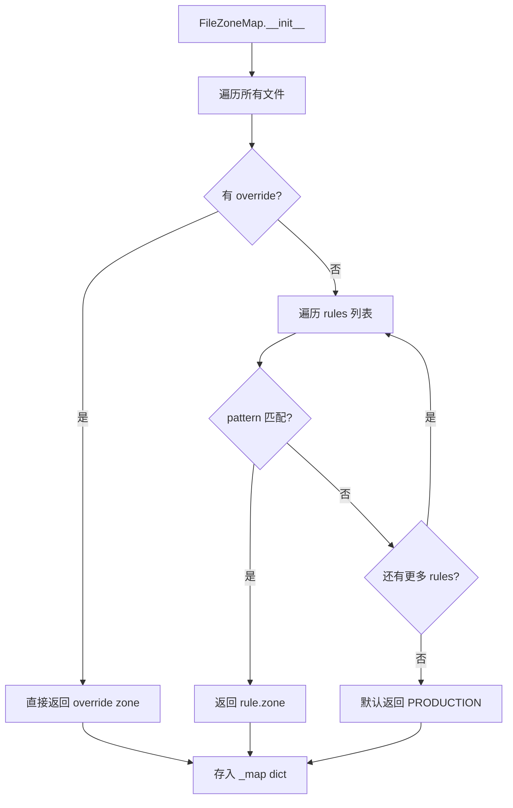

# PD-508.01 Desloppify — 六区域路径模式分类与 Zone-aware 检测策略

> 文档编号：PD-508.01
> 来源：Desloppify `desloppify/engine/policy/zones.py`
> GitHub：https://github.com/peteromallet/desloppify.git
> 问题域：PD-508 文件区域分类 File Zone Classification
> 状态：可复用方案

---

## 第 1 章 问题与动机（≥ 30 行）

### 1.1 核心问题

静态分析工具对整个代码库一视同仁地运行检测器，会产生大量误报：测试文件中的"重复代码"是合理的 fixture 复用，配置文件中的"代码异味"是框架要求的声明式写法，vendor 目录中的问题根本不应该出现在报告里。更严重的是，这些非生产代码的 finding 会污染健康评分，让团队无法准确判断生产代码的真实质量。

核心矛盾：**检测器需要知道文件的"意图"才能做出正确的判断**，但文件系统本身不携带意图信息。

### 1.2 Desloppify 的解法概述

Desloppify 设计了一套完整的 Zone 分类系统，将每个文件归入六种区域之一，然后让 zone 元数据贯穿整个分析管线：

1. **六区域枚举** — `Zone(str, Enum)` 定义 production/test/config/generated/script/vendor 六种文件意图（`zones.py:25-33`）
2. **三层模式匹配** — `ZoneRule` + `_match_pattern()` 支持目录模式（`/dir/`）、后缀模式（`.ext`）、前缀模式（`prefix_`）、精确匹配和子串回退五种匹配方式（`zones.py:44-91`）
3. **语言级规则扩展** — 每种语言定义自己的 `ZONE_RULES` 并与 `COMMON_ZONE_RULES` 合并，Python 有迁移/protobuf/conftest 等规则（`python/__init__.py:75-92`），TypeScript 有 `.d.ts`/`__tests__`/config 等规则（`typescript/__init__.py:103-124`）
4. **Zone-aware 检测策略** — `ZonePolicy` 为每个区域定义 skip_detectors（完全跳过）、downgrade_detectors（降级置信度）和 exclude_from_score（排除评分）三种策略（`zones.py:192-229`）
5. **全管线元数据流** — zone 信息从分类阶段流入 finding 标记（`scan.py:97-114`）、检测器过滤（`shared_phases.py:57-79`）、评分排除（`_scoring/policy/core.py:29`）和 review 选择（`selection.py`）

### 1.3 设计思想

| 设计原则 | 具体实现 | 理由 | 替代方案 |
|----------|----------|------|----------|
| First-match-wins 确定性 | 规则列表有序，第一个匹配即返回 | 避免多规则冲突导致不确定行为 | 优先级权重系统（更复杂） |
| 路径即意图 | 纯路径模式匹配，不读文件内容 | O(1) 分类，无 I/O 开销 | AST 分析文件内容（慢且脆弱） |
| 语言可扩展 | 每种语言定义自己的 ZoneRule 列表 | Python 的 `_pb2.py` 和 TS 的 `.d.ts` 需要不同规则 | 全局统一规则（无法覆盖语言特性） |
| 策略与分类分离 | Zone 枚举和 ZonePolicy 是独立的数据结构 | 可以独立修改检测策略而不影响分类逻辑 | 在分类函数中硬编码策略 |
| 手动 override 优先 | `classify_file()` 先查 overrides 再走规则 | 用户可以修正误分类而不改代码 | 只支持规则，不支持例外 |

---

## 第 2 章 源码实现分析（≥ 60 行，核心章节）

### 2.1 架构概览

Desloppify 的 Zone 系统是一个三层架构：分类层（Zone + ZoneRule）、策略层（ZonePolicy）、消费层（各检测器和评分引擎）。

```
┌─────────────────────────────────────────────────────────────────┐
│                     config.json                                  │
│                  zone_overrides: {path: zone}                    │
└──────────────────────┬──────────────────────────────────────────┘
                       ↓
┌──────────────────────┴──────────────────────────────────────────┐
│  Classification Layer                                            │
│  ┌──────────┐   ┌──────────────┐   ┌────────────────────────┐  │
│  │ Zone Enum │   │ ZoneRule[]   │   │ _match_pattern()       │  │
│  │ 6 values  │   │ lang-specific│   │ 5 pattern types        │  │
│  └──────────┘   └──────────────┘   └────────────────────────┘  │
│                       ↓                                          │
│              classify_file() → FileZoneMap (cached)              │
└──────────────────────┬──────────────────────────────────────────┘
                       ↓
┌──────────────────────┴──────────────────────────────────────────┐
│  Policy Layer                                                    │
│  ┌──────────────────────────────────────────────────────────┐   │
│  │ ZONE_POLICIES: {Zone → ZonePolicy}                       │   │
│  │   skip_detectors / downgrade_detectors / exclude_from_score │ │
│  └──────────────────────────────────────────────────────────┘   │
│  ┌──────────────────────────────────────────────────────────┐   │
│  │ zones_data.py: SKIP_ALL / TEST_SKIP / CONFIG_SKIP / ...  │   │
│  └──────────────────────────────────────────────────────────┘   │
└──────────────────────┬──────────────────────────────────────────┘
                       ↓
┌──────────────────────┴──────────────────────────────────────────┐
│  Consumer Layer                                                  │
│  ┌────────────┐ ┌──────────────┐ ┌───────────┐ ┌────────────┐  │
│  │ phase_dupes│ │phase_security│ │ scoring   │ │ review     │  │
│  │ filter by  │ │ zone_map     │ │ excluded  │ │ selection  │  │
│  │ EXCLUDED   │ │ passed in    │ │ _zones    │ │ filter     │  │
│  └────────────┘ └──────────────┘ └───────────┘ └────────────┘  │
└─────────────────────────────────────────────────────────────────┘
```

### 2.2 核心实现

#### 2.2.1 五种模式匹配引擎



对应源码 `desloppify/engine/policy/zones.py:60-91`：

```python
def _match_pattern(rel_path: str, pattern: str) -> bool:
    basename = os.path.basename(rel_path)

    # Directory pattern: "/dir/" → substring on padded path
    if pattern.startswith("/") and pattern.endswith("/"):
        return pattern in ("/" + rel_path + "/")

    # Suffix/extension pattern: starts with "." → contains on basename
    if pattern.startswith("."):
        return pattern in basename

    # Prefix pattern: ends with "_" → basename starts-with
    if pattern.endswith("_"):
        return basename.startswith(pattern)

    # Suffix pattern: starts with "_" → basename ends-with (_test.py, _pb2.py)
    if pattern.startswith("_"):
        return basename.endswith(pattern)

    # Exact basename: has a proper file extension, no "/" → exact match
    if "/" not in pattern and "." in pattern:
        ext = pattern.rsplit(".", 1)[-1]
        if ext and len(ext) <= 5 and ext.isalnum():
            return basename == pattern

    # Fallback: substring on full path
    return pattern in rel_path
```

关键设计：模式类型由 pattern 字符串的形状自动推断（首尾字符），无需额外的 type 字段。这让规则定义极其简洁——`"/tests/"` 自动识别为目录模式，`".d.ts"` 自动识别为后缀模式。

#### 2.2.2 FileZoneMap 缓存分类器



对应源码 `desloppify/engine/policy/zones.py:104-121` 和 `zones.py:124-187`：

```python
def classify_file(
    rel_path: str, rules: list[ZoneRule], overrides: dict[str, str] | None = None
) -> Zone:
    """Classify a file by its relative path. Overrides take priority."""
    if overrides:
        override = overrides.get(rel_path)
        if override:
            try:
                return Zone(override)
            except ValueError as exc:
                log_best_effort_failure(
                    logger, f"parse zone override for {rel_path}", exc
                )
    for rule in rules:
        for pattern in rule.patterns:
            if _match_pattern(rel_path, pattern):
                return rule.zone
    return Zone.PRODUCTION

class FileZoneMap:
    """Cached zone classification for a set of files."""
    def __init__(self, files, rules, rel_fn=None, overrides=None):
        self._map: dict[str, Zone] = {}
        for f in files:
            rp = rel_fn(f) if rel_fn else f
            self._map[f] = classify_file(rp, rules, overrides)

    def get(self, path: str) -> Zone:
        return self._map.get(path, Zone.PRODUCTION)

    def exclude(self, files: list[str], *zones: Zone) -> list[str]:
        zone_set = set(zones)
        return [f for f in files if self._map.get(f, Zone.PRODUCTION) not in zone_set]
```

`FileZoneMap` 在扫描开始时一次性构建（`scan.py:48-55`），后续所有检测器通过 `lang.zone_map` 引用同一个实例，避免重复分类。

### 2.3 实现细节

#### Zone 策略矩阵

每个 zone 有独立的检测策略，定义在 `zones.py:206-229`：

| Zone | exclude_from_score | skip_detectors 数量 | downgrade_detectors |
|------|-------------------|---------------------|---------------------|
| PRODUCTION | ✗ | 0 | — |
| TEST | ✓ | 10 (TEST_SKIP) | smells, structural → low |
| CONFIG | ✓ | 11 (CONFIG_SKIP) | — |
| GENERATED | ✓ | 26 (SKIP_ALL) | — |
| VENDOR | ✓ | 26 (SKIP_ALL) | — |
| SCRIPT | ✗ | 4 (SCRIPT_SKIP) | structural → low |

注意 SCRIPT 区域不排除评分——脚本代码仍然计入健康分，只是跳过 coupling/single_use/orphaned/facade 这些对脚本不适用的检测器。

#### Zone 信息流入 Finding

`scan.py:97-114` 中的 `_stamp_finding_context()` 将 zone 值写入每个 finding：

```python
def _stamp_finding_context(findings: list[Finding], lang: LangRun) -> None:
    for finding in findings:
        finding["lang"] = lang.name
        if lang.zone_map is None:
            continue
        zone = lang.zone_map.get(finding.get("file", ""))
        finding["zone"] = zone.value  # 写入 zone 字符串值
        policy = zone_policies.get(zone)
        if policy and finding.get("detector") in policy.downgrade_detectors:
            finding["confidence"] = "low"  # 降级置信度
```

#### 检测器级过滤

`shared_phases.py:57-79` 中 `phase_dupes` 在 O(n²) 比较前先过滤非生产文件：

```python
def phase_dupes(path, lang):
    functions = lang.extract_functions(path)
    if lang.zone_map is not None:
        functions = [
            f for f in functions
            if lang.zone_map.get(getattr(f, "file", "")) not in EXCLUDED_ZONES
        ]
    entries, total_functions = detect_duplicates(functions)
    ...
```

#### 评分层排除

`_scoring/policy/core.py:23-29` 中 `DetectorScoringPolicy` 默认排除非生产 zone：

```python
@dataclass(frozen=True)
class DetectorScoringPolicy:
    detector: str
    dimension: str | None
    tier: int | None
    excluded_zones: frozenset[str] = frozenset(EXCLUDED_ZONE_VALUES)
```

---

## 第 3 章 迁移指南（≥ 40 行）

### 3.1 迁移清单

**阶段 1：核心分类系统（1 个文件）**
- [ ] 定义 Zone 枚举（根据项目需要增减区域）
- [ ] 实现 `_match_pattern()` 五种模式匹配
- [ ] 实现 `ZoneRule` 数据类和 `classify_file()` 函数
- [ ] 实现 `FileZoneMap` 缓存分类器

**阶段 2：语言规则扩展（每种语言 1 个规则列表）**
- [ ] 定义通用规则 `COMMON_ZONE_RULES`
- [ ] 为每种语言定义 `LANG_ZONE_RULES`（合并通用规则）
- [ ] 确保规则顺序正确（更具体的规则在前）

**阶段 3：策略层（1 个文件）**
- [ ] 定义 `ZonePolicy` 数据类
- [ ] 为每个 zone 配置 skip/downgrade/exclude 策略
- [ ] 将检测器跳过集合提取到独立数据文件

**阶段 4：管线集成**
- [ ] 在扫描入口构建 `FileZoneMap`（一次性）
- [ ] 在 finding 生成后 stamp zone 值
- [ ] 在各检测器中调用 `filter_entries()` / `should_skip_finding()`
- [ ] 在评分引擎中排除非生产 zone 的 finding

**阶段 5：用户 Override**
- [ ] 在配置文件中添加 `zone_overrides` 字段
- [ ] 实现 CLI 命令 `zone show/set/clear`

### 3.2 适配代码模板

以下是一个可直接复用的最小 Zone 分类系统：

```python
"""Minimal zone classification system — portable template."""

from __future__ import annotations

import os
from dataclasses import dataclass, field
from enum import Enum
from typing import Callable


class Zone(str, Enum):
    PRODUCTION = "production"
    TEST = "test"
    CONFIG = "config"
    GENERATED = "generated"
    VENDOR = "vendor"


EXCLUDED_ZONES = {Zone.TEST, Zone.CONFIG, Zone.GENERATED, Zone.VENDOR}


@dataclass
class ZoneRule:
    zone: Zone
    patterns: list[str]


def _match_pattern(rel_path: str, pattern: str) -> bool:
    basename = os.path.basename(rel_path)
    if pattern.startswith("/") and pattern.endswith("/"):
        return pattern in ("/" + rel_path + "/")
    if pattern.startswith("."):
        return pattern in basename
    if pattern.endswith("_"):
        return basename.startswith(pattern)
    if pattern.startswith("_"):
        return basename.endswith(pattern)
    if "/" not in pattern and "." in pattern:
        ext = pattern.rsplit(".", 1)[-1]
        if ext and len(ext) <= 5 and ext.isalnum():
            return basename == pattern
    return pattern in rel_path


def classify_file(
    rel_path: str,
    rules: list[ZoneRule],
    overrides: dict[str, str] | None = None,
) -> Zone:
    if overrides and (ov := overrides.get(rel_path)):
        try:
            return Zone(ov)
        except ValueError:
            pass
    for rule in rules:
        for pattern in rule.patterns:
            if _match_pattern(rel_path, pattern):
                return rule.zone
    return Zone.PRODUCTION


@dataclass
class ZonePolicy:
    skip_detectors: set[str] = field(default_factory=set)
    downgrade_detectors: set[str] = field(default_factory=set)
    exclude_from_score: bool = False


class FileZoneMap:
    def __init__(
        self,
        files: list[str],
        rules: list[ZoneRule],
        rel_fn: Callable[[str], str] | None = None,
        overrides: dict[str, str] | None = None,
    ):
        self._map: dict[str, Zone] = {}
        for f in files:
            rp = rel_fn(f) if rel_fn else f
            self._map[f] = classify_file(rp, rules, overrides)

    def get(self, path: str) -> Zone:
        return self._map.get(path, Zone.PRODUCTION)

    def is_excluded(self, path: str) -> bool:
        return self.get(path) in EXCLUDED_ZONES


# Usage:
# rules = [
#     ZoneRule(Zone.TEST, ["/tests/", "test_", "_test.py"]),
#     ZoneRule(Zone.CONFIG, ["config.py", "settings.py"]),
#     ZoneRule(Zone.VENDOR, ["/vendor/", "/third_party/"]),
# ]
# zone_map = FileZoneMap(all_files, rules)
# production_files = [f for f in all_files if not zone_map.is_excluded(f)]
```

### 3.3 适用场景

| 场景 | 适用度 | 说明 |
|------|--------|------|
| 静态分析工具 | ⭐⭐⭐ | 核心场景：减少误报，精确评分 |
| CI/CD 质量门禁 | ⭐⭐⭐ | 只对生产代码执行严格检查 |
| 代码审查工具 | ⭐⭐ | 根据 zone 调整审查维度和严格度 |
| 代码搜索/索引 | ⭐⭐ | 按 zone 过滤搜索结果，优先展示生产代码 |
| 依赖分析 | ⭐ | zone 信息可辅助判断依赖方向是否合理 |

---

## 第 4 章 测试用例（≥ 20 行）

```python
import pytest
from zones import Zone, ZoneRule, FileZoneMap, classify_file, _match_pattern


class TestMatchPattern:
    """Test the five pattern matching modes."""

    def test_directory_pattern(self):
        assert _match_pattern("src/tests/test_foo.py", "/tests/") is True
        assert _match_pattern("src/main.py", "/tests/") is False

    def test_suffix_pattern(self):
        assert _match_pattern("types/index.d.ts", ".d.ts") is True
        assert _match_pattern("src/utils.ts", ".d.ts") is False

    def test_prefix_pattern(self):
        assert _match_pattern("tests/test_auth.py", "test_") is True
        assert _match_pattern("src/auth.py", "test_") is False

    def test_tail_suffix_pattern(self):
        assert _match_pattern("proto/message_pb2.py", "_pb2.py") is True
        assert _match_pattern("src/handler.py", "_pb2.py") is False

    def test_exact_basename_match(self):
        assert _match_pattern("src/config.py", "config.py") is True
        assert _match_pattern("src/my_config.py", "config.py") is False

    def test_fallback_substring(self):
        assert _match_pattern("vite.config.ts", "vite.config") is True
        assert _match_pattern("src/app.ts", "vite.config") is False


class TestClassifyFile:
    """Test classification with overrides and rule ordering."""

    RULES = [
        ZoneRule(Zone.TEST, ["/tests/", "test_"]),
        ZoneRule(Zone.CONFIG, ["config.py"]),
        ZoneRule(Zone.VENDOR, ["/vendor/"]),
    ]

    def test_first_match_wins(self):
        # /tests/ matches before test_ — both point to TEST, but order matters
        assert classify_file("tests/test_foo.py", self.RULES) == Zone.TEST

    def test_default_production(self):
        assert classify_file("src/main.py", self.RULES) == Zone.PRODUCTION

    def test_override_takes_priority(self):
        overrides = {"src/main.py": "test"}
        assert classify_file("src/main.py", self.RULES, overrides) == Zone.TEST

    def test_invalid_override_falls_through(self):
        overrides = {"src/main.py": "invalid_zone"}
        assert classify_file("src/main.py", self.RULES, overrides) == Zone.PRODUCTION


class TestFileZoneMap:
    """Test cached zone map behavior."""

    def test_counts(self):
        files = ["src/app.py", "tests/test_app.py", "vendor/lib.py"]
        rules = [
            ZoneRule(Zone.TEST, ["/tests/"]),
            ZoneRule(Zone.VENDOR, ["/vendor/"]),
        ]
        zm = FileZoneMap(files, rules)
        counts = zm.counts()
        assert counts["production"] == 1
        assert counts["test"] == 1
        assert counts["vendor"] == 1

    def test_exclude_filters_zones(self):
        files = ["src/app.py", "tests/test_app.py"]
        rules = [ZoneRule(Zone.TEST, ["/tests/"])]
        zm = FileZoneMap(files, rules)
        result = zm.exclude(files, Zone.TEST)
        assert result == ["src/app.py"]

    def test_unknown_file_defaults_production(self):
        zm = FileZoneMap([], [])
        assert zm.get("unknown.py") == Zone.PRODUCTION
```

---

## 第 5 章 跨域关联

| 关联域 | 关系类型 | 说明 |
|--------|----------|------|
| PD-500 静态代码分析 | 依赖 | Zone 分类是静态分析的前置步骤，决定哪些检测器对哪些文件运行 |
| PD-507 自动修复系统 | 协同 | Zone 信息帮助 auto-fix 决定修复优先级（生产代码优先） |
| PD-502 反作弊评分完整性 | 协同 | Zone 排除机制防止通过添加大量测试/配置文件来人为提高评分 |
| PD-509 增量扫描状态合并 | 依赖 | 增量扫描需要 zone_map 来正确合并新旧 finding 的 zone 标记 |
| PD-506 配置管理 | 依赖 | zone_overrides 存储在配置系统中，配置变更触发 rescan |
| PD-505 LLM 主观评审 | 协同 | Holistic review 选择文件时排除非生产 zone，避免浪费 LLM token |

---

## 第 6 章 来源文件索引

| 文件 | 行范围 | 关键实现 |
|------|--------|----------|
| `desloppify/engine/policy/zones.py` | L1-L276 | Zone 枚举、ZoneRule、FileZoneMap、ZonePolicy、classify_file、辅助函数 |
| `desloppify/engine/policy/zones_data.py` | L1-L58 | SKIP_ALL_DETECTORS、TEST/CONFIG/SCRIPT_SKIP_DETECTORS |
| `desloppify/core/config.py` | L53-L55 | zone_overrides 配置键定义 |
| `desloppify/engine/planning/scan.py` | L48-L55 | _build_zone_map() 构建入口 |
| `desloppify/engine/planning/scan.py` | L97-L114 | _stamp_finding_context() zone 标记 |
| `desloppify/languages/python/__init__.py` | L75-L92 | PY_ZONE_RULES 语言级规则 |
| `desloppify/languages/typescript/__init__.py` | L103-L124 | TS_ZONE_RULES 语言级规则 |
| `desloppify/languages/_framework/base/shared_phases.py` | L31-L36 | zone 相关导入 |
| `desloppify/languages/_framework/base/shared_phases.py` | L57-L79 | phase_dupes zone 过滤 |
| `desloppify/engine/_scoring/policy/core.py` | L9-L33 | DetectorScoringPolicy.excluded_zones |
| `desloppify/engine/detectors/security/filters.py` | L11-L24 | _should_scan_file / _is_test_file |
| `desloppify/app/commands/zone_cmd.py` | L1-L133 | CLI zone show/set/clear 命令 |

---

## 第 7 章 横向对比维度

```json comparison_data
{
  "project": "Desloppify",
  "dimensions": {
    "分类粒度": "六区域枚举（production/test/config/generated/script/vendor）",
    "匹配机制": "五种路径模式自动推断（目录/后缀/前缀/精确/子串），first-match-wins",
    "策略分离": "ZonePolicy 三维策略（skip/downgrade/exclude）独立于分类逻辑",
    "语言扩展": "每种语言定义 ZONE_RULES 列表，与 COMMON_ZONE_RULES 合并",
    "管线集成": "zone 元数据贯穿 finding 标记、检测器过滤、评分排除、review 选择全链路",
    "用户干预": "config.json zone_overrides + CLI zone set/clear 手动修正"
  }
}
```

### 域元数据补充

```json domain_metadata
{
  "solution_summary": "Desloppify 用五种路径模式自动推断 + ZonePolicy 三维策略矩阵，将文件分为六区域并贯穿检测-评分-审查全管线",
  "description": "基于路径形状自动推断模式类型，实现零配置的确定性文件意图分类",
  "sub_problems": [
    "Zone-aware confidence downgrade for non-critical zones",
    "Language-specific zone rule composition and ordering",
    "Zone statistics reporting and CLI introspection"
  ],
  "best_practices": [
    "Pattern type auto-detection from string shape eliminates explicit type field",
    "FileZoneMap built once per scan, shared across all detectors via lang runtime",
    "SCRIPT zone scored but with reduced detector set, unlike fully excluded zones"
  ]
}
```
