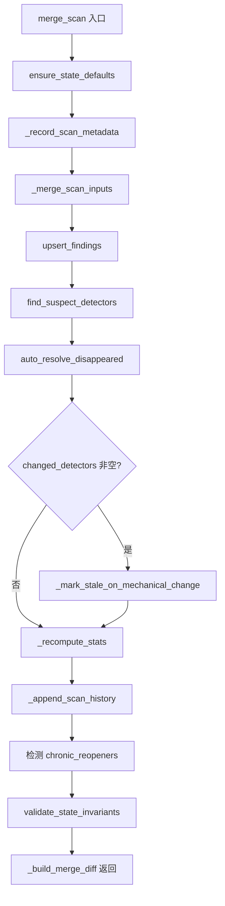
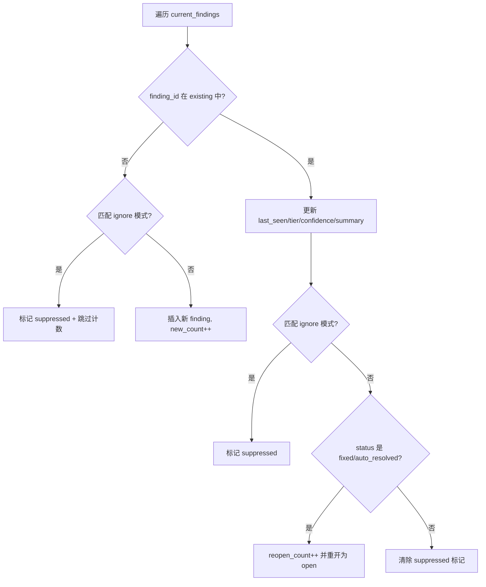
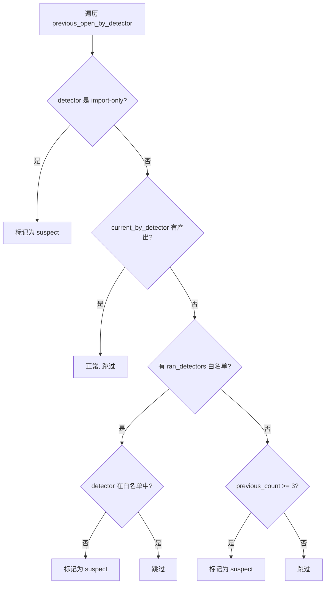

# PD-509.01 Desloppify — 增量扫描状态合并与多维联动

> 文档编号：PD-509.01
> 来源：Desloppify `desloppify/engine/_state/merge.py`
> GitHub：https://github.com/peteromallet/desloppify.git
> 问题域：PD-509 增量扫描与状态合并 Incremental Scan & State Merge
> 状态：可复用方案

---

## 第 1 章 问题与动机

### 1.1 核心问题

代码质量扫描工具每次运行都会产生一批 findings（问题发现）。当扫描是增量的——只扫描部分文件、部分语言、或部分检测器——如何将新结果与已有状态正确合并，是一个被低估但极其关键的工程问题。

具体挑战包括：

1. **Finding 生命周期追踪**：同一个 finding 跨多次扫描出现时，需要保留 `first_seen` 不变、更新 `last_seen`，而不是每次创建新记录
2. **消失问题的自动关闭**：上次扫描存在但本次消失的 finding，可能是被修复了，也可能是检测器没跑——需要区分这两种情况
3. **异常检测器识别**：如果某个检测器之前有 3+ 个 open findings 但本次产出为 0，很可能是检测器没运行而非全部修复
4. **Mechanical→Subjective 联动**：机械检测结果变化时，依赖这些结果的人工评审需要标记为过期
5. **扫描历史与趋势**：每次合并后记录快照，支持分数趋势分析和回归检测

### 1.2 Desloppify 的解法概述

Desloppify 通过 `merge_scan()` 函数（`merge.py:108`）实现了一个 7 阶段增量合并管线：

1. **状态默认值保障** — `ensure_state_defaults()` 确保旧版状态文件兼容（`schema.py:219`）
2. **元数据记录** — 记录扫描时间戳、工具哈希、语言覆盖度（`merge_history.py:9-24`）
3. **Finding Upsert** — 新增插入、已有更新 `last_seen`、已关闭的重新打开并计数（`merge_findings.py:117-204`）
4. **异常检测器识别** — 通过 `find_suspect_detectors()` 防止误关闭（`merge_findings.py:9-46`）
5. **自动关闭消失问题** — `auto_resolve_disappeared()` 带语言/路径/排除三重过滤（`merge_findings.py:49-114`）
6. **Mechanical→Subjective 联动** — `_mark_stale_on_mechanical_change()` 标记过期评审（`merge.py:55-89`）
7. **历史快照追加** — 记录分数、diff 统计、完整性元数据到 `scan_history`（`merge_history.py:87-131`）

### 1.3 设计思想

| 设计原则 | 具体实现 | 理由 | 替代方案 |
|----------|----------|------|----------|
| 防御性合并 | `find_suspect_detectors()` 检测未运行的检测器，跳过其 findings 的自动关闭 | 增量扫描可能只运行部分检测器，盲目关闭会丢失真实问题 | 全量扫描（成本高）或手动标记哪些检测器运行了 |
| 幂等 Upsert | 同 ID finding 只更新 `last_seen`/`tier`/`confidence`/`summary`，不重复创建 | 保留 `first_seen` 时间线，支持问题年龄分析 | 每次全量替换（丢失历史） |
| 跨层联动 | `_DETECTOR_SUBJECTIVE_DIMENSIONS` 映射表驱动 mechanical→subjective 过期标记 | 机械检测变化意味着人工评审可能过时，需要提醒重新评估 | 人工手动检查（容易遗漏） |
| 原子持久化 | `save_state()` 先 `shutil.copy2` 备份再 `safe_write_text` 写入 | 防止写入中断导致状态文件损坏 | 数据库事务（对 JSON 文件过重） |
| 有界历史 | `scan_history` 最多保留 20 条（`merge_history.py:130-131`） | 防止状态文件无限膨胀，20 条足够趋势分析 | 无限保留（文件膨胀）或外部时序数据库 |

---

## 第 2 章 源码实现分析

### 2.1 架构概览

Desloppify 的增量合并系统由 4 个模块组成，职责清晰分离：

```
┌─────────────────────────────────────────────────────────────────┐
│                     merge_scan() 主入口                         │
│                     merge.py:108-217                            │
├─────────────┬──────────────────┬────────────────────────────────┤
│  merge_     │  merge_          │  scoring.py                    │
│  findings.py│  history.py      │  _recompute_stats()            │
│             │                  │                                │
│ • upsert    │ • record_meta    │ • _count_findings()            │
│ • auto_     │ • merge_inputs   │ • _update_objective_health()   │
│   resolve   │ • append_history │ • suppression_metrics()        │
│ • suspect   │ • build_diff     │                                │
│   detectors │                  │                                │
├─────────────┴──────────────────┴────────────────────────────────┤
│  schema.py — StateModel / Finding TypedDict + 校验              │
├─────────────────────────────────────────────────────────────────┤
│  persistence.py — load_state() / save_state() 原子读写          │
├─────────────────────────────────────────────────────────────────┤
│  filtering.py — 路径作用域 + ignore 模式匹配                    │
└─────────────────────────────────────────────────────────────────┘
```

### 2.2 核心实现

#### 2.2.1 merge_scan 主流程



对应源码 `desloppify/engine/_state/merge.py:108-217`：

```python
def merge_scan(
    state: StateModel,
    current_findings: list[dict],
    options: MergeScanOptions | None = None,
) -> ScanDiff:
    """Merge a fresh scan into existing state and return a diff summary."""
    ensure_state_defaults(state)
    resolved_options = options or MergeScanOptions()
    now = utc_now()

    _record_scan_metadata(state, now, lang=resolved_options.lang,
                          include_slow=resolved_options.include_slow,
                          scan_path=resolved_options.scan_path)
    _merge_scan_inputs(state, lang=resolved_options.lang,
                       potentials=resolved_options.potentials,
                       merge_potentials=resolved_options.merge_potentials,
                       codebase_metrics=resolved_options.codebase_metrics)

    existing = state["findings"]
    ignore_patterns = (resolved_options.ignore
                       if resolved_options.ignore is not None
                       else state.get("config", {}).get("ignore", []))

    current_ids, new_count, reopened_count, current_by_detector, ignored_count, upsert_changed = (
        upsert_findings(existing, current_findings, ignore_patterns, now,
                        lang=resolved_options.lang))

    suspect_detectors = find_suspect_detectors(
        existing, current_by_detector, resolved_options.force_resolve,
        set(resolved_options.potentials.keys()) if resolved_options.potentials else None)

    auto_resolved, skipped_other_lang, skipped_out_of_scope, resolve_changed = (
        auto_resolve_disappeared(existing, current_ids, suspect_detectors, now,
                                 lang=resolved_options.lang,
                                 scan_path=resolved_options.scan_path,
                                 exclude=resolved_options.exclude))

    changed_detectors = upsert_changed | resolve_changed
    if changed_detectors:
        _mark_stale_on_mechanical_change(state, changed_detectors=changed_detectors, now=now)

    _recompute_stats(state, scan_path=resolved_options.scan_path,
                     subjective_integrity_target=resolved_options.subjective_integrity_target)
    _append_scan_history(state, now=now, lang=resolved_options.lang,
                         new_count=new_count, auto_resolved=auto_resolved,
                         ignored_count=ignored_count, raw_findings=len(current_findings),
                         suppressed_pct=_compute_suppression(len(current_findings), ignored_count),
                         ignore_pattern_count=len(ignore_patterns))

    chronic_reopeners = [f for f in existing.values()
                         if f.get("reopen_count", 0) >= 2 and f["status"] == "open"]
    validate_state_invariants(state)
    return _build_merge_diff(...)
```

#### 2.2.2 Finding Upsert 与重开计数



对应源码 `desloppify/engine/_state/merge_findings.py:117-204`：

```python
def upsert_findings(
    existing: dict, current_findings: list[dict],
    ignore: list[str], now: str, *, lang: str | None,
) -> tuple[set[str], int, int, dict[str, int], int, set[str]]:
    current_ids: set[str] = set()
    new_count = reopened_count = ignored_count = 0
    by_detector: dict[str, int] = {}
    changed_detectors: set[str] = set()

    for finding in current_findings:
        finding_id = finding["id"]
        detector = finding.get("detector", "unknown")
        current_ids.add(finding_id)
        by_detector[detector] = by_detector.get(detector, 0) + 1
        matched_ignore = matched_ignore_pattern(finding_id, finding["file"], ignore)
        if matched_ignore:
            ignored_count += 1

        if finding_id not in existing:
            existing[finding_id] = dict(finding)
            if matched_ignore:
                existing[finding_id]["suppressed"] = True
                existing[finding_id]["suppressed_at"] = now
                existing[finding_id]["suppression_pattern"] = matched_ignore
                continue
            new_count += 1
            changed_detectors.add(detector)
            continue

        previous = existing[finding_id]
        previous.update(last_seen=now, tier=finding["tier"],
                        confidence=finding["confidence"],
                        summary=finding["summary"],
                        detail=finding.get("detail", {}))

        if previous["status"] in ("fixed", "auto_resolved"):
            if (detector == "subjective_review"
                and previous["status"] == "auto_resolved"
                and (previous.get("resolution_attestation") or {}).get("kind") == "agent_import"):
                continue
            previous["reopen_count"] = previous.get("reopen_count", 0) + 1
            previous.update(status="open", resolved_at=None,
                            note=f"Reopened (×{previous['reopen_count']}) — reappeared in scan")
            reopened_count += 1
            changed_detectors.add(detector)

    return current_ids, new_count, reopened_count, by_detector, ignored_count, changed_detectors
```

#### 2.2.3 异常检测器识别



对应源码 `desloppify/engine/_state/merge_findings.py:9-46`：

```python
def find_suspect_detectors(
    existing: dict, current_by_detector: dict[str, int],
    force_resolve: bool, ran_detectors: set[str] | None = None,
) -> set[str]:
    if force_resolve:
        return set()

    previous_open_by_detector: dict[str, int] = {}
    for finding in existing.values():
        if finding["status"] != "open":
            continue
        detector = finding.get("detector", "unknown")
        previous_open_by_detector[detector] = previous_open_by_detector.get(detector, 0) + 1

    import_only_detectors = {"review"}
    suspect: set[str] = set()
    for detector, previous_count in previous_open_by_detector.items():
        if detector in import_only_detectors:
            suspect.add(detector)
            continue
        if current_by_detector.get(detector, 0) > 0:
            continue
        if ran_detectors is not None:
            if detector not in ran_detectors:
                suspect.add(detector)
            continue
        if previous_count >= 3:
            suspect.add(detector)
    return suspect
```

### 2.3 实现细节

**Mechanical→Subjective 联动映射表**（`merge.py:37-52`）：

Desloppify 维护了一个静态映射 `_DETECTOR_SUBJECTIVE_DIMENSIONS`，将 12 个机械检测器映射到 6 个主观评审维度。当 upsert 或 auto-resolve 阶段产生 `changed_detectors` 时，`_mark_stale_on_mechanical_change()` 查表标记对应维度的评审为 `needs_review_refresh=True`。

关键设计：只标记已有评审的维度为过期，不会为从未评审过的维度创建新条目（`merge.py:79`）。

**扫描历史快照**（`merge_history.py:87-131`）：

每次合并后追加一条 `ScanHistoryEntry`，包含：
- 4 种分数快照（strict/verified_strict/objective/overall）
- diff 统计（new/resolved/ignored）
- 抑制率（suppressed_pct）
- 主观完整性快照（`_subjective_integrity_snapshot`）
- 分数置信度快照（`_score_confidence_snapshot`）
- 各维度分数快照（`dimension_scores`）

历史上限 20 条，超出时截断最旧的（`merge_history.py:130-131`）。

**原子持久化**（`persistence.py:131-169`）：

`save_state()` 在写入前先 `shutil.copy2` 创建 `.json.bak` 备份。`load_state()` 在主文件损坏时自动尝试从 `.json.bak` 恢复，两者都失败则重命名为 `.json.corrupted` 并返回空状态。

**工具哈希变更检测**（`tooling.py:42-45`）：

每次扫描记录 `tool_hash`（所有 `.py` 文件的 SHA256 前 12 位），下次加载时 `check_tool_staleness()` 对比哈希，变化则提示重新扫描。

---

## 第 3 章 迁移指南

### 3.1 迁移清单

**阶段 1：数据模型（1 天）**
- [ ] 定义 `Finding` TypedDict，包含 `id`, `detector`, `file`, `status`, `first_seen`, `last_seen`, `reopen_count`, `suppressed` 等字段
- [ ] 定义 `StateModel`，包含 `findings: dict[str, Finding]`, `scan_history: list`, `stats: dict`
- [ ] 实现 `ensure_state_defaults()` 兼容旧版状态文件
- [ ] 实现 `validate_state_invariants()` 校验状态一致性

**阶段 2：核心合并逻辑（2 天）**
- [ ] 实现 `upsert_findings()`：新增插入、已有更新 `last_seen`、已关闭重开
- [ ] 实现 `find_suspect_detectors()`：基于产出计数 + 白名单检测异常检测器
- [ ] 实现 `auto_resolve_disappeared()`：带语言/路径/排除过滤的自动关闭
- [ ] 实现 `merge_scan()` 主入口串联以上步骤

**阶段 3：持久化与历史（1 天）**
- [ ] 实现 `save_state()` 带备份的原子写入
- [ ] 实现 `load_state()` 带损坏恢复的加载
- [ ] 实现 `_append_scan_history()` 带上限截断的历史追加

**阶段 4：高级特性（可选）**
- [ ] 实现 ignore 模式匹配（glob/ID 前缀/文件路径）
- [ ] 实现 mechanical→subjective 联动标记
- [ ] 实现工具哈希变更检测

### 3.2 适配代码模板

以下是一个可直接运行的最小化增量合并实现：

```python
"""Minimal incremental scan merge — adapted from Desloppify."""
from __future__ import annotations
from datetime import UTC, datetime
from typing import TypedDict

class Finding(TypedDict, total=False):
    id: str
    detector: str
    file: str
    status: str  # "open" | "fixed" | "auto_resolved"
    first_seen: str
    last_seen: str
    reopen_count: int
    suppressed: bool

def utc_now() -> str:
    return datetime.now(UTC).isoformat(timespec="seconds")

def upsert_findings(
    existing: dict[str, Finding],
    current: list[dict],
    now: str,
) -> tuple[set[str], int, int]:
    """Insert new / update existing / reopen closed findings."""
    current_ids: set[str] = set()
    new_count = reopened_count = 0

    for finding in current:
        fid = finding["id"]
        current_ids.add(fid)

        if fid not in existing:
            existing[fid] = {**finding, "first_seen": now, "last_seen": now,
                             "status": "open", "reopen_count": 0, "suppressed": False}
            new_count += 1
            continue

        prev = existing[fid]
        prev["last_seen"] = now
        for key in ("summary", "confidence", "tier"):
            if key in finding:
                prev[key] = finding[key]

        if prev["status"] in ("fixed", "auto_resolved"):
            prev["reopen_count"] = prev.get("reopen_count", 0) + 1
            prev["status"] = "open"
            prev["resolved_at"] = None
            reopened_count += 1

    return current_ids, new_count, reopened_count

def find_suspect_detectors(
    existing: dict[str, Finding],
    current_by_detector: dict[str, int],
    ran_detectors: set[str] | None = None,
) -> set[str]:
    """Detect detectors that likely didn't run this scan."""
    prev_open: dict[str, int] = {}
    for f in existing.values():
        if f["status"] == "open":
            d = f.get("detector", "unknown")
            prev_open[d] = prev_open.get(d, 0) + 1

    suspect: set[str] = set()
    for detector, count in prev_open.items():
        if current_by_detector.get(detector, 0) > 0:
            continue
        if ran_detectors is not None and detector not in ran_detectors:
            suspect.add(detector)
        elif count >= 3:
            suspect.add(detector)
    return suspect

def auto_resolve_disappeared(
    existing: dict[str, Finding],
    current_ids: set[str],
    suspect: set[str],
    now: str,
) -> int:
    """Auto-resolve findings absent from current scan."""
    resolved = 0
    for fid, prev in existing.items():
        if fid in current_ids or prev["status"] != "open":
            continue
        if prev.get("detector", "unknown") in suspect:
            continue
        prev["status"] = "auto_resolved"
        prev["resolved_at"] = now
        resolved += 1
    return resolved

def merge_scan(
    state: dict,
    current_findings: list[dict],
    ran_detectors: set[str] | None = None,
) -> dict:
    """Main entry: merge fresh scan into existing state."""
    now = utc_now()
    existing = state.setdefault("findings", {})

    current_ids, new_count, reopened = upsert_findings(existing, current_findings, now)

    by_detector: dict[str, int] = {}
    for f in current_findings:
        d = f.get("detector", "unknown")
        by_detector[d] = by_detector.get(d, 0) + 1

    suspect = find_suspect_detectors(existing, by_detector, ran_detectors)
    auto_resolved = auto_resolve_disappeared(existing, current_ids, suspect, now)

    # Append scan history (bounded)
    history = state.setdefault("scan_history", [])
    open_count = sum(1 for f in existing.values() if f["status"] == "open")
    history.append({"timestamp": now, "open": open_count,
                    "new": new_count, "resolved": auto_resolved, "reopened": reopened})
    if len(history) > 20:
        state["scan_history"] = history[-20:]

    state["scan_count"] = state.get("scan_count", 0) + 1
    return {"new": new_count, "auto_resolved": auto_resolved,
            "reopened": reopened, "suspect_detectors": sorted(suspect)}
```

### 3.3 适用场景

| 场景 | 适用度 | 说明 |
|------|--------|------|
| 代码质量扫描工具（linter/SAST） | ⭐⭐⭐ | 核心场景，finding 生命周期管理 |
| CI/CD 增量检查 | ⭐⭐⭐ | 只扫描变更文件时需要正确合并 |
| 安全漏洞追踪 | ⭐⭐⭐ | 漏洞的 first_seen/last_seen 和自动关闭 |
| 测试结果追踪 | ⭐⭐ | 测试用例的 pass/fail 状态变化追踪 |
| 监控告警管理 | ⭐⭐ | 告警的自动恢复和重复检测 |
| 文档覆盖率追踪 | ⭐ | 简单场景不需要 suspect detector 逻辑 |

---

## 第 4 章 测试用例

```python
"""Tests for incremental scan merge — based on Desloppify patterns."""
import pytest
from datetime import UTC, datetime

# 使用第 3 章的适配代码模板
from merge_template import (
    Finding, utc_now, upsert_findings,
    find_suspect_detectors, auto_resolve_disappeared, merge_scan,
)


class TestUpsertFindings:
    def test_new_finding_inserted(self):
        existing: dict[str, Finding] = {}
        now = utc_now()
        findings = [{"id": "lint::foo.py::unused-import", "detector": "lint",
                      "file": "foo.py", "summary": "Unused import os"}]
        ids, new, reopened = upsert_findings(existing, findings, now)
        assert new == 1
        assert reopened == 0
        assert "lint::foo.py::unused-import" in existing
        assert existing["lint::foo.py::unused-import"]["first_seen"] == now
        assert existing["lint::foo.py::unused-import"]["status"] == "open"

    def test_existing_finding_updates_last_seen(self):
        t1 = "2025-01-01T00:00:00+00:00"
        existing = {"f1": {"id": "f1", "detector": "lint", "file": "a.py",
                           "status": "open", "first_seen": t1, "last_seen": t1,
                           "reopen_count": 0, "suppressed": False}}
        t2 = "2025-01-02T00:00:00+00:00"
        ids, new, reopened = upsert_findings(
            existing, [{"id": "f1", "detector": "lint", "file": "a.py", "summary": "x"}], t2)
        assert new == 0
        assert existing["f1"]["first_seen"] == t1  # preserved
        assert existing["f1"]["last_seen"] == t2   # updated

    def test_fixed_finding_reopened(self):
        existing = {"f1": {"id": "f1", "detector": "lint", "file": "a.py",
                           "status": "fixed", "first_seen": "t0", "last_seen": "t0",
                           "reopen_count": 0, "suppressed": False, "resolved_at": "t0"}}
        ids, new, reopened = upsert_findings(
            existing, [{"id": "f1", "detector": "lint", "file": "a.py"}], "t1")
        assert reopened == 1
        assert existing["f1"]["status"] == "open"
        assert existing["f1"]["reopen_count"] == 1
        assert existing["f1"]["resolved_at"] is None


class TestSuspectDetectors:
    def test_detector_with_output_not_suspect(self):
        existing = {"f1": {"id": "f1", "detector": "lint", "status": "open"}}
        suspect = find_suspect_detectors(existing, {"lint": 1})
        assert suspect == set()

    def test_detector_with_many_open_no_output_is_suspect(self):
        existing = {f"f{i}": {"id": f"f{i}", "detector": "smells", "status": "open"}
                    for i in range(3)}
        suspect = find_suspect_detectors(existing, {})
        assert "smells" in suspect

    def test_ran_detectors_whitelist(self):
        existing = {"f1": {"id": "f1", "detector": "lint", "status": "open"}}
        suspect = find_suspect_detectors(existing, {}, ran_detectors={"smells"})
        assert "lint" in suspect  # lint not in whitelist


class TestAutoResolve:
    def test_disappeared_finding_resolved(self):
        existing = {"f1": {"id": "f1", "detector": "lint", "file": "a.py",
                           "status": "open"}}
        resolved = auto_resolve_disappeared(existing, set(), set(), "t1")
        assert resolved == 1
        assert existing["f1"]["status"] == "auto_resolved"

    def test_suspect_detector_skipped(self):
        existing = {"f1": {"id": "f1", "detector": "smells", "file": "a.py",
                           "status": "open"}}
        resolved = auto_resolve_disappeared(existing, set(), {"smells"}, "t1")
        assert resolved == 0
        assert existing["f1"]["status"] == "open"  # not resolved


class TestMergeScan:
    def test_full_cycle(self):
        state: dict = {}
        # Scan 1: 2 findings
        diff = merge_scan(state, [
            {"id": "f1", "detector": "lint", "file": "a.py", "summary": "x"},
            {"id": "f2", "detector": "lint", "file": "b.py", "summary": "y"},
        ])
        assert diff["new"] == 2
        assert diff["auto_resolved"] == 0
        assert state["scan_count"] == 1

        # Scan 2: f1 gone, f3 new
        diff = merge_scan(state, [
            {"id": "f2", "detector": "lint", "file": "b.py", "summary": "y"},
            {"id": "f3", "detector": "lint", "file": "c.py", "summary": "z"},
        ])
        assert diff["new"] == 1
        assert diff["auto_resolved"] == 1
        assert state["findings"]["f1"]["status"] == "auto_resolved"
        assert state["scan_count"] == 2

    def test_scan_history_bounded(self):
        state: dict = {}
        for i in range(25):
            merge_scan(state, [{"id": f"f{i}", "detector": "lint",
                                "file": "a.py", "summary": "x"}])
        assert len(state["scan_history"]) == 20
```

---

## 第 5 章 跨域关联

| 关联域 | 关系类型 | 说明 |
|--------|----------|------|
| PD-07 质量检查 | 协同 | `merge_scan` 是质量检查结果的持久化层；`_recompute_stats()` 在合并后重算分数，`_append_scan_history()` 记录分数趋势供质量评估使用 |
| PD-06 记忆持久化 | 协同 | `persistence.py` 的 `save_state()`/`load_state()` 实现了带备份恢复的原子持久化，是 Finding 状态的记忆层 |
| PD-10 中间件管道 | 依赖 | `merge_scan()` 本身就是一个 7 阶段管道：metadata→inputs→upsert→suspect→resolve→stale→history，每个阶段可独立测试 |
| PD-11 可观测性 | 协同 | `scan_history` 提供时序数据（分数趋势、new/resolved 计数、抑制率），`tool_hash` 提供工具版本追踪 |
| PD-500 静态代码分析 | 依赖 | 各检测器（structural/smells/coupling 等）产出 findings 作为 `merge_scan` 的输入 |
| PD-502 反作弊评分完整性 | 协同 | `_apply_subjective_integrity_policy()` 检测主观评分聚集在目标分附近的作弊行为，重置为 0 分 |
| PD-505 LLM 主观评审 | 协同 | `_mark_stale_on_mechanical_change()` 通过 `_DETECTOR_SUBJECTIVE_DIMENSIONS` 映射表联动标记主观评审过期 |
| PD-508 文件区域分类 | 协同 | Finding 的 `zone` 字段由文件区域分类器填充，`upsert_findings()` 在更新时保留 zone 信息 |

---

## 第 6 章 来源文件索引

| 文件 | 行范围 | 关键实现 |
|------|--------|----------|
| `desloppify/engine/_state/merge.py` | L1-217 | `merge_scan()` 主入口、`MergeScanOptions` 配置、`_DETECTOR_SUBJECTIVE_DIMENSIONS` 映射表、`_mark_stale_on_mechanical_change()` |
| `desloppify/engine/_state/merge_findings.py` | L1-211 | `upsert_findings()` Finding 插入/更新/重开、`auto_resolve_disappeared()` 自动关闭、`find_suspect_detectors()` 异常检测器识别 |
| `desloppify/engine/_state/merge_history.py` | L1-173 | `_record_scan_metadata()` 元数据记录、`_merge_scan_inputs()` 输入合并、`_append_scan_history()` 历史追加、`_build_merge_diff()` diff 构建 |
| `desloppify/engine/_state/schema.py` | L1-345 | `StateModel`/`Finding`/`ScanDiff` TypedDict 定义、`ensure_state_defaults()` 兼容性、`validate_state_invariants()` 校验 |
| `desloppify/engine/_state/persistence.py` | L1-170 | `load_state()` 带损坏恢复的加载、`save_state()` 带备份的原子写入 |
| `desloppify/engine/_state/scoring.py` | L1-471 | `_recompute_stats()` 统计重算、`_update_objective_health()` 分数计算、`suppression_metrics()` 抑制统计 |
| `desloppify/engine/_state/filtering.py` | L1-184 | `matched_ignore_pattern()` 三模式匹配、`path_scoped_findings()` 路径作用域过滤 |
| `desloppify/core/tooling.py` | L42-45 | `compute_tool_hash()` 工具代码 SHA256 哈希 |

---

## 第 7 章 横向对比维度

```json comparison_data
{
  "project": "Desloppify",
  "dimensions": {
    "合并策略": "7 阶段管线：metadata→inputs→upsert→suspect→resolve→stale→history",
    "异常检测": "find_suspect_detectors 三级判定：import-only / 白名单 / 产出阈值≥3",
    "自动关闭": "auto_resolve_disappeared 带语言/路径/排除/suspect 四重过滤",
    "联动机制": "12 检测器→6 维度静态映射表驱动 mechanical→subjective 过期标记",
    "历史追踪": "scan_history 20 条上限，含 4 种分数 + 完整性 + 置信度快照",
    "持久化策略": "JSON 文件 + shutil.copy2 备份 + 损坏自动恢复",
    "抑制机制": "glob/ID前缀/文件路径三模式 ignore + suppressed 标记不影响计数"
  }
}
```

### 域元数据补充

```json domain_metadata
{
  "solution_summary": "Desloppify 用 7 阶段管线实现增量合并：upsert 保留 first_seen + 重开计数，suspect detector 三级判定防误关闭，静态映射表驱动 mechanical→subjective 联动过期标记",
  "description": "增量扫描需要区分'检测器未运行'和'问题已修复'两种消失原因",
  "sub_problems": [
    "Chronic reopener detection for findings with reopen_count >= 2",
    "Ignore pattern suppression with glob/ID-prefix/file-path triple matching",
    "Scan completeness tracking per language (full vs fast mode)"
  ],
  "best_practices": [
    "Suspect detector heuristic: ≥3 previous open + 0 current output = likely not run",
    "Only mark existing subjective assessments stale, never create new entries on mechanical change"
  ]
}
```
