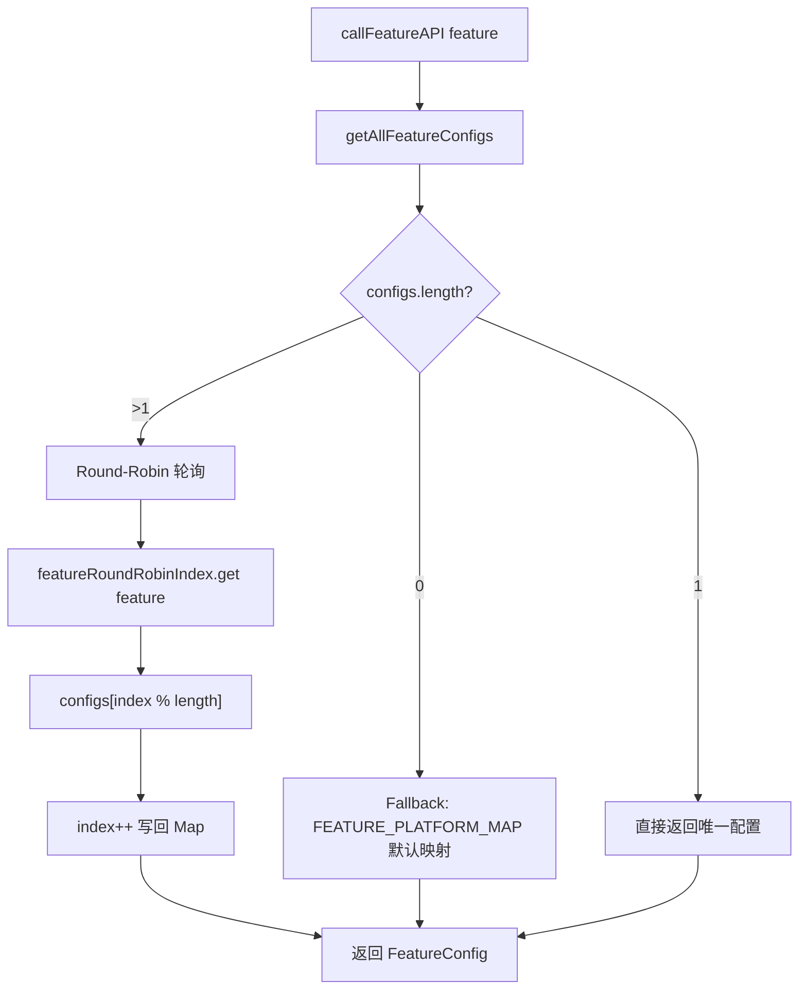
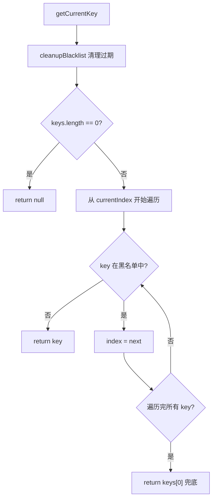
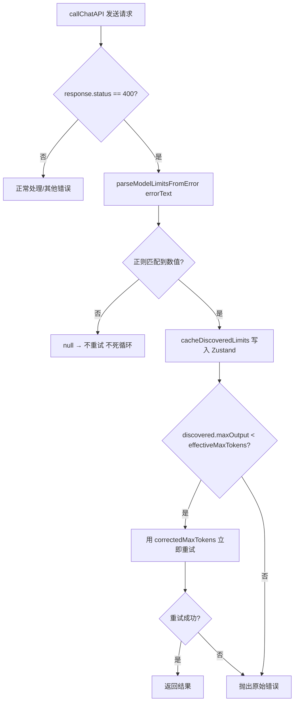

# PD-510.01 moyin-creator — 三层查表轮询与 Error-driven 模型发现

> 文档编号：PD-510.01
> 来源：moyin-creator `src/lib/ai/feature-router.ts` `src/lib/api-key-manager.ts` `src/lib/ai/model-registry.ts`
> GitHub：https://github.com/MemeCalculate/moyin-creator.git
> 问题域：PD-510 多供应商 AI 调度 Multi-Provider AI Dispatch
> 状态：可复用方案

---

## 第 1 章 问题与动机

### 1.1 核心问题

当一个应用需要调用多个 AI 供应商（OpenAI、智谱、DeepSeek、Gemini 等）的多种能力（文本、图片、视频、识图）时，面临三个层次的调度难题：

1. **功能→供应商绑定**：不同功能（剧本分析、角色生成、视频生成）需要路由到不同供应商的不同模型，且用户可能随时切换绑定关系
2. **多 Key 负载均衡**：同一供应商可能配置多个 API Key，需要轮询分散请求压力，且失败 Key 要临时隔离
3. **模型限制未知**：552+ 模型的 `max_tokens` 和 `contextWindow` 限制无法全部预知，代理平台（如 MemeFast）上的模型限制可能与官方不同

### 1.2 moyin-creator 的解法概述

moyin-creator 构建了三层调度架构，每层解决一个问题：

1. **Feature Router**（`src/lib/ai/feature-router.ts:133`）— 功能级路由 + 多模型 Round-Robin 轮询，每个 AI 功能可绑定多个 `platform:model` 对，调用时自动轮询
2. **ApiKeyManager**（`src/lib/api-key-manager.ts:259`）— 多 Key 随机起始 + 黑名单轮转，90 秒自动恢复，对 429/401/503 自动切换
3. **Model Registry**（`src/lib/ai/model-registry.ts:125`）— 三层查表（持久化缓存→静态注册表→保守默认值）+ Error-driven Discovery 从 400 错误中自动学习模型限制

### 1.3 设计思想

| 设计原则 | 具体实现 | 理由 | 替代方案 |
|----------|----------|------|----------|
| 功能级路由而非全局路由 | 每个 AIFeature 独立绑定 provider:model | 不同功能对模型能力要求不同（文本 vs 视频） | 全局单供应商（不灵活） |
| 随机起始索引 | `Math.floor(Math.random() * keys.length)` | 多实例/多标签页同时启动时避免全部命中同一 Key | 固定从 0 开始（热点问题） |
| 临时黑名单而非永久移除 | 90 秒 TTL 自动恢复 (`BLACKLIST_DURATION_MS = 90000`) | API 限流是暂时的，Key 本身没问题 | 永久移除（浪费可用 Key） |
| Error-driven Discovery | 从 400 错误消息正则提取 maxOutput/contextWindow | 552+ 模型无法全部预知限制，运行时自学习 | 维护完整静态表（不可行） |
| 依赖注入避免循环引用 | `injectDiscoveryCache()` 注入 getter/setter | model-registry 和 api-config-store 互相依赖 | 直接 import（循环依赖） |

---

## 第 2 章 源码实现分析

### 2.1 架构概览

moyin-creator 的多供应商调度系统由四个模块协作：

```
┌─────────────────────────────────────────────────────────┐
│                    callFeatureAPI()                       │
│              (统一 AI 调用入口)                            │
│         src/lib/ai/feature-router.ts:238                 │
└──────────────┬───────────────────────┬──────────────────┘
               │                       │
    ┌──────────▼──────────┐  ┌────────▼─────────────────┐
    │   Feature Router    │  │    Model Registry         │
    │  getFeatureConfig() │  │  getModelLimits()         │
    │  Round-Robin 轮询    │  │  三层查表 + Discovery     │
    │  :133               │  │  :125                     │
    └──────────┬──────────┘  └────────┬─────────────────┘
               │                       │
    ┌──────────▼──────────┐  ┌────────▼─────────────────┐
    │   ApiKeyManager     │  │  api-config-store         │
    │  多 Key 轮转+黑名单  │  │  Zustand + localStorage   │
    │  :259               │  │  discoveredModelLimits    │
    └─────────────────────┘  └──────────────────────────┘
```

数据流：用户点击功能 → `callFeatureAPI(feature)` → Feature Router 按 Round-Robin 选出 provider+model → Model Registry 查表得到 max_tokens 上限 → ApiKeyManager 选出当前可用 Key → 发起 API 请求 → 失败时 Key 轮转 + Error-driven Discovery 学习限制。

### 2.2 核心实现

#### 2.2.1 Feature Router — 功能级多模型轮询



对应源码 `src/lib/ai/feature-router.ts:133-182`：

```typescript
// 多模型轮询调度器：记录每个功能的当前索引
const featureRoundRobinIndex: Map<AIFeature, number> = new Map();

export function getFeatureConfig(feature: AIFeature): FeatureConfig | null {
  const configs = getAllFeatureConfigs(feature);
  
  if (configs.length === 0) {
    // Fallback: 尝试使用默认平台映射
    const store = useAPIConfigStore.getState();
    const defaultPlatform = FEATURE_PLATFORM_MAP[feature];
    if (defaultPlatform) {
      const provider = store.providers.find(p => p.platform === defaultPlatform);
      // ... 构建 FeatureConfig
    }
    return null;
  }
  
  if (configs.length === 1) return configs[0];
  
  // 多模型轮询
  const currentIndex = featureRoundRobinIndex.get(feature) || 0;
  const config = configs[currentIndex % configs.length];
  featureRoundRobinIndex.set(feature, currentIndex + 1);
  return config;
}
```

关键设计：`featureRoundRobinIndex` 是一个 `Map<AIFeature, number>`，每个功能独立计数。轮询索引只增不减，通过 `% configs.length` 取模实现循环。`resetFeatureRoundRobin()` 在新任务开始时重置索引（`feature-router.ts:187`）。

#### 2.2.2 ApiKeyManager — 随机起始 + 黑名单轮转



对应源码 `src/lib/api-key-manager.ts:259-387`：

```typescript
export class ApiKeyManager {
  private keys: string[];
  private currentIndex: number;
  private blacklist: Map<string, BlacklistedKey> = new Map();

  constructor(apiKeyString: string) {
    this.keys = parseApiKeys(apiKeyString);
    // 随机起始索引：多实例同时启动时分散到不同 Key
    this.currentIndex = this.keys.length > 0
      ? Math.floor(Math.random() * this.keys.length) : 0;
  }

  handleError(statusCode: number): boolean {
    // 429(限流) / 401(认证) / 503(不可用) → 黑名单 + 轮转
    if (statusCode === 429 || statusCode === 401 || statusCode === 503) {
      this.markCurrentKeyFailed();
      return true;
    }
    return false;
  }

  private cleanupBlacklist(): void {
    const now = Date.now();
    for (const [key, entry] of this.blacklist.entries()) {
      if (now - entry.blacklistedAt >= BLACKLIST_DURATION_MS) {
        this.blacklist.delete(key);  // 90 秒后自动恢复
      }
    }
  }
}
```

全局单例管理：`providerManagers` 是一个 `Map<string, ApiKeyManager>`，按 providerId 缓存实例（`api-key-manager.ts:392`）。`getProviderKeyManager()` 保证同一供应商共享同一个 Manager，避免多处调用各自维护独立状态。

### 2.3 实现细节

#### Error-driven Discovery 完整数据流



三层查表优先级（`model-registry.ts:125-142`）：

1. **Layer 1 — 持久化缓存**：`discoveredModelLimits`（Zustand + localStorage），从 API 错误中学到的真实值，最准确
2. **Layer 2 — 静态注册表**：`STATIC_REGISTRY`（精确匹配 → prefix 匹配，prefix 按长度降序排序避免短前缀误匹配）
3. **Layer 3 — 保守默认值**：`_default: { contextWindow: 32000, maxOutput: 4096 }`，宁可多分批也不撞限制

依赖注入解耦（`model-registry.ts:107-113`）：

```typescript
// model-registry 不直接 import api-config-store，而是暴露注入接口
export function injectDiscoveryCache(
  getter: (model: string) => DiscoveredModelLimits | undefined,
  setter: (model: string, limits: Partial<DiscoveredModelLimits>) => void,
): void {
  _getDiscoveredLimits = getter;
  _setDiscoveredLimits = setter;
}
```

在 `api-config-store.ts:1192-1195` 模块加载时注入：

```typescript
injectDiscoveryCache(
  (model) => useAPIConfigStore.getState().getDiscoveredModelLimits(model),
  (model, limits) => useAPIConfigStore.getState().setDiscoveredModelLimits(model, limits),
);
```

#### 模型能力自动分类

`classifyModelByName()`（`api-key-manager.ts:75-112`）通过模型名称模式匹配推断能力类型，覆盖视频、图片、视觉、推理、Embedding 等 8 种能力。用于 552+ 动态同步模型的自动分类，无需人工标注。

#### Token Budget Calculator

`callChatAPI` 在发送请求前执行预算检查（`script-parser.ts:254-283`）：
- 输入超过 contextWindow 的 90% → 直接抛错，不发请求（省钱）
- 输出空间不到请求的 50% → 打印 warning
- `estimateTokens()` 使用 `字符数/1.5` 保守算法，不引入 tiktoken 等重型库

---

## 第 3 章 迁移指南

### 3.1 迁移清单

**阶段 1：基础 Key 管理（1 个文件）**

- [ ] 移植 `ApiKeyManager` 类：多 Key 解析、随机起始、黑名单轮转
- [ ] 配置 `BLACKLIST_DURATION_MS`（默认 90 秒，可按供应商调整）
- [ ] 实现全局 `providerManagers` Map 单例管理

**阶段 2：模型注册表（1 个文件）**

- [ ] 移植 `ModelRegistry`：静态注册表 + prefix 匹配 + 保守默认值
- [ ] 实现 `parseModelLimitsFromError()` 正则解析器
- [ ] 接入持久化存储（localStorage / Redis / 数据库）
- [ ] 用 `injectDiscoveryCache()` 模式解耦存储依赖

**阶段 3：功能路由（1 个文件）**

- [ ] 定义 `AIFeature` 类型枚举和 `FeatureBindings` 映射
- [ ] 实现 `getFeatureConfig()` + Round-Robin 轮询
- [ ] 实现 `callFeatureAPI()` 统一入口，整合 Key 管理 + 模型限制查表

### 3.2 适配代码模板

以下是一个可独立运行的 Python 版本，保留了核心设计但适配 Python 生态：

```python
"""Multi-Provider AI Dispatch — 移植自 moyin-creator"""
import time
import random
import re
import json
from dataclasses import dataclass, field
from typing import Optional
from pathlib import Path

# ==================== ApiKeyManager ====================

BLACKLIST_DURATION_S = 90  # 90 秒黑名单

@dataclass
class ApiKeyManager:
    """多 Key 轮转 + 临时黑名单"""
    keys: list[str] = field(default_factory=list)
    _index: int = 0
    _blacklist: dict[str, float] = field(default_factory=dict)

    def __post_init__(self):
        if self.keys:
            self._index = random.randint(0, len(self.keys) - 1)

    def _cleanup(self):
        now = time.time()
        self._blacklist = {
            k: t for k, t in self._blacklist.items()
            if now - t < BLACKLIST_DURATION_S
        }

    def get_current_key(self) -> Optional[str]:
        self._cleanup()
        for i in range(len(self.keys)):
            idx = (self._index + i) % len(self.keys)
            if self.keys[idx] not in self._blacklist:
                self._index = idx
                return self.keys[idx]
        return self.keys[0] if self.keys else None

    def mark_failed(self):
        key = self.keys[self._index]
        self._blacklist[key] = time.time()
        self._index = (self._index + 1) % len(self.keys)

    def handle_error(self, status_code: int) -> bool:
        if status_code in (429, 401, 503):
            self.mark_failed()
            return True
        return False

# ==================== ModelRegistry ====================

@dataclass
class ModelLimits:
    context_window: int
    max_output: int

STATIC_REGISTRY: dict[str, ModelLimits] = {
    "deepseek-v3":   ModelLimits(128000, 8192),
    "glm-4.7":       ModelLimits(200000, 128000),
    "gemini-2.5-pro": ModelLimits(1048576, 65536),
    "_default":       ModelLimits(32000, 4096),
}

# prefix 按长度降序排列
SORTED_PREFIXES = sorted(
    [k for k in STATIC_REGISTRY if k != "_default"],
    key=len, reverse=True
)

_discovery_cache: dict[str, dict] = {}

def get_model_limits(model: str) -> ModelLimits:
    m = model.lower()
    # Layer 1: 持久化缓存
    if m in _discovery_cache:
        d = _discovery_cache[m]
        static = _lookup_static(m)
        return ModelLimits(
            d.get("context_window", static.context_window),
            d.get("max_output", static.max_output),
        )
    # Layer 2+3: 静态 → 默认
    return _lookup_static(m)

def _lookup_static(m: str) -> ModelLimits:
    if m in STATIC_REGISTRY:
        return STATIC_REGISTRY[m]
    for prefix in SORTED_PREFIXES:
        if m.startswith(prefix):
            return STATIC_REGISTRY[prefix]
    return STATIC_REGISTRY["_default"]

def parse_limits_from_error(error_text: str) -> Optional[dict]:
    result = {}
    # max_tokens 解析
    match = re.search(r"valid\s+range.*?\[\s*\d+\s*,\s*(\d+)\s*\]", error_text, re.I)
    if match:
        result["max_output"] = int(match.group(1))
    if "max_output" not in result:
        match = re.search(r"max_tokens.*?(\d{3,6})", error_text, re.I)
        if match:
            result["max_output"] = int(match.group(1))
    # context_window 解析
    match = re.search(r"context.*?length.*?(\d{4,7})", error_text, re.I)
    if match:
        result["context_window"] = int(match.group(1))
    return result if result else None

# ==================== FeatureRouter ====================

_round_robin: dict[str, int] = {}

def get_feature_config(feature: str, bindings: list[dict]) -> Optional[dict]:
    """bindings: [{"provider": ..., "model": ..., "key_manager": ...}]"""
    if not bindings:
        return None
    if len(bindings) == 1:
        return bindings[0]
    idx = _round_robin.get(feature, 0)
    config = bindings[idx % len(bindings)]
    _round_robin[feature] = idx + 1
    return config
```

### 3.3 适用场景

| 场景 | 适用度 | 说明 |
|------|--------|------|
| 多供应商 AI 应用（文本+图片+视频） | ⭐⭐⭐ | 核心场景，功能级路由 + 多 Key 轮转完美匹配 |
| 单供应商多 Key 负载均衡 | ⭐⭐⭐ | 只用 ApiKeyManager 即可，随机起始 + 黑名单 |
| 代理平台（MemeFast 等）模型限制未知 | ⭐⭐⭐ | Error-driven Discovery 自动学习，无需维护完整表 |
| 后端服务（Node.js / Python） | ⭐⭐ | 需将 Zustand 持久化替换为 Redis/数据库 |
| 高并发场景（>100 QPS） | ⭐ | Round-Robin 无权重，需扩展为加权轮询 |

---

## 第 4 章 测试用例

```python
import pytest
import time

class TestApiKeyManager:
    def test_random_start_index(self):
        """随机起始索引：多次创建应分散到不同 Key"""
        indices = set()
        for _ in range(100):
            mgr = ApiKeyManager(keys=["k1", "k2", "k3", "k4", "k5"])
            indices.add(mgr._index)
        assert len(indices) >= 3, "100 次创建应至少命中 3 个不同起始索引"

    def test_blacklist_and_recovery(self):
        """黑名单 90 秒后自动恢复"""
        mgr = ApiKeyManager(keys=["k1", "k2"])
        mgr._index = 0
        mgr.mark_failed()  # k1 进入黑名单
        assert mgr.get_current_key() == "k2"
        # 模拟 90 秒后
        mgr._blacklist["k1"] = time.time() - 91
        assert mgr.get_current_key() in ("k1", "k2")

    def test_handle_error_rotation(self):
        """429/401/503 触发轮转"""
        mgr = ApiKeyManager(keys=["k1", "k2", "k3"])
        mgr._index = 0
        assert mgr.handle_error(429) is True
        assert mgr.get_current_key() != "k1"
        assert mgr.handle_error(200) is False  # 200 不触发

    def test_all_keys_blacklisted_fallback(self):
        """所有 Key 都被黑名单时兜底返回第一个"""
        mgr = ApiKeyManager(keys=["k1", "k2"])
        mgr.mark_failed()
        mgr.mark_failed()
        assert mgr.get_current_key() == "k1"  # 兜底

class TestModelRegistry:
    def test_exact_match(self):
        """精确匹配优先"""
        limits = get_model_limits("deepseek-v3")
        assert limits.context_window == 128000
        assert limits.max_output == 8192

    def test_prefix_match_longest_first(self):
        """prefix 匹配按长度降序"""
        STATIC_REGISTRY["gemini-2.5-"] = ModelLimits(1048576, 65536)
        STATIC_REGISTRY["gemini-"] = ModelLimits(1048576, 8192)
        limits = get_model_limits("gemini-2.5-flash-latest")
        assert limits.max_output == 65536  # 长 prefix 优先

    def test_default_fallback(self):
        """未知模型返回保守默认值"""
        limits = get_model_limits("unknown-model-xyz")
        assert limits.context_window == 32000
        assert limits.max_output == 4096

    def test_error_driven_discovery(self):
        """从 API 错误中解析模型限制"""
        # DeepSeek 格式
        r = parse_limits_from_error(
            "Invalid max_tokens value, the valid range of max_tokens is [1, 8192]"
        )
        assert r["max_output"] == 8192

        # OpenAI 格式
        r = parse_limits_from_error(
            "maximum context length is 128000 tokens, you requested 150000 tokens"
        )
        assert r["context_window"] == 128000

        # 无匹配 → None（不死循环）
        assert parse_limits_from_error("some random error") is None

    def test_discovery_cache_priority(self):
        """持久化缓存优先于静态注册表"""
        _discovery_cache["test-model"] = {"max_output": 16384}
        limits = get_model_limits("test-model")
        assert limits.max_output == 16384
        assert limits.context_window == 32000  # 静态默认值补充
        del _discovery_cache["test-model"]

class TestFeatureRouter:
    def test_round_robin(self):
        """多模型轮询"""
        bindings = [
            {"provider": "a", "model": "m1"},
            {"provider": "b", "model": "m2"},
            {"provider": "c", "model": "m3"},
        ]
        _round_robin.clear()
        results = [get_feature_config("test", bindings)["model"] for _ in range(6)]
        assert results == ["m1", "m2", "m3", "m1", "m2", "m3"]

    def test_single_binding_no_rotation(self):
        """单绑定直接返回"""
        config = get_feature_config("test", [{"provider": "a", "model": "m1"}])
        assert config["model"] == "m1"

    def test_empty_bindings(self):
        """无绑定返回 None"""
        assert get_feature_config("test", []) is None
```

---

## 第 5 章 跨域关联

| 关联域 | 关系类型 | 说明 |
|--------|----------|------|
| PD-01 上下文管理 | 协同 | Model Registry 的 `getModelLimits()` 提供 contextWindow 限制，`estimateTokens()` + Token Budget Calculator 在发送前检查输入是否超限，属于上下文管理的前置防线 |
| PD-03 容错与重试 | 协同 | ApiKeyManager 的黑名单轮转是容错的一部分；Error-driven Discovery 的 400 错误自动重试也是容错机制；与 `retryOperation()` 配合形成多层容错 |
| PD-04 工具系统 | 依赖 | Feature Router 的 `callFeatureAPI()` 是所有 AI 工具调用的统一入口，工具系统通过它获取正确的 provider + model + apiKey |
| PD-06 记忆持久化 | 协同 | `discoveredModelLimits` 通过 Zustand persist 持久化到 localStorage，属于运行时学习到的知识的持久化 |
| PD-11 可观测性 | 协同 | `callChatAPI` 中大量 `console.log` 记录调度决策（轮询选择、Key 轮转、Token 预算），为调试和监控提供数据 |

---

## 第 6 章 来源文件索引

| 文件 | 行范围 | 关键实现 |
|------|--------|----------|
| `src/lib/ai/feature-router.ts` | L36-37 | `featureRoundRobinIndex` Map 定义 |
| `src/lib/ai/feature-router.ts` | L97-125 | `getAllFeatureConfigs()` 获取功能的所有可用配置 |
| `src/lib/ai/feature-router.ts` | L133-182 | `getFeatureConfig()` Round-Robin 轮询核心逻辑 |
| `src/lib/ai/feature-router.ts` | L238-279 | `callFeatureAPI()` 统一 AI 调用入口 |
| `src/lib/api-key-manager.ts` | L259-387 | `ApiKeyManager` 类：多 Key 轮转 + 黑名单 |
| `src/lib/api-key-manager.ts` | L75-112 | `classifyModelByName()` 模型能力自动分类 |
| `src/lib/api-key-manager.ts` | L158-208 | `resolveImageApiFormat()` / `resolveVideoApiFormat()` 端点路由 |
| `src/lib/api-key-manager.ts` | L392-406 | `providerManagers` 全局单例 Map |
| `src/lib/ai/model-registry.ts` | L50-89 | `STATIC_REGISTRY` 静态注册表 |
| `src/lib/ai/model-registry.ts` | L93-95 | `SORTED_KEYS` prefix 按长度降序排列 |
| `src/lib/ai/model-registry.ts` | L107-113 | `injectDiscoveryCache()` 依赖注入接口 |
| `src/lib/ai/model-registry.ts` | L125-162 | `getModelLimits()` 三层查表核心 |
| `src/lib/ai/model-registry.ts` | L178-229 | `parseModelLimitsFromError()` 错误消息正则解析 |
| `src/lib/ai/model-registry.ts` | L260-262 | `estimateTokens()` 保守 token 估算 |
| `src/lib/script/script-parser.ts` | L246-275 | Token Budget Calculator 预算检查 |
| `src/lib/script/script-parser.ts` | L336-367 | Error-driven Discovery 400 错误处理 + 自动重试 |
| `src/stores/api-config-store.ts` | L33-41 | `AIFeature` 类型定义（8 种功能） |
| `src/stores/api-config-store.ts` | L47-48 | `FeatureBindings` 多选绑定类型 |
| `src/stores/api-config-store.ts` | L583-609 | `getProvidersForFeature()` 绑定解析（id:model 优先 → platform fallback） |
| `src/stores/api-config-store.ts` | L842-858 | `discoveredModelLimits` 持久化读写 |
| `src/stores/api-config-store.ts` | L1192-1195 | `injectDiscoveryCache()` 注入调用 |

---

## 第 7 章 横向对比维度

```json comparison_data
{
  "project": "moyin-creator",
  "dimensions": {
    "调度架构": "三层分离：Feature Router → ApiKeyManager → Model Registry",
    "Key 管理": "随机起始索引 + 90 秒 TTL 黑名单 + 自动恢复",
    "模型限制发现": "Error-driven Discovery：从 400 错误正则提取 maxOutput/contextWindow 并持久化",
    "功能绑定": "AIFeature → platform:model[] 多选绑定 + Round-Robin 轮询",
    "模型分类": "classifyModelByName 模式匹配自动推断 8 种能力类型",
    "预算控制": "Token Budget Calculator 发送前检查，超 90% contextWindow 直接拒绝"
  }
}
```

### 域元数据补充

```json domain_metadata
{
  "solution_summary": "moyin-creator 用 Feature Router 功能级多模型 Round-Robin + ApiKeyManager 随机起始黑名单轮转 + Model Registry 三层查表与 Error-driven Discovery 构建完整多供应商调度",
  "description": "多供应商环境下的功能级路由、Key 负载均衡与运行时模型限制自学习",
  "sub_problems": [
    "端点格式路由：同一模型在不同平台的 API 端点格式不同",
    "Token 预算预检：发送前估算输入 token 避免浪费 API 调用"
  ],
  "best_practices": [
    "依赖注入解耦循环引用：model-registry 通过 injectDiscoveryCache 避免与 store 循环依赖",
    "prefix 匹配按长度降序排列避免短前缀误匹配具体模型"
  ]
}
```
