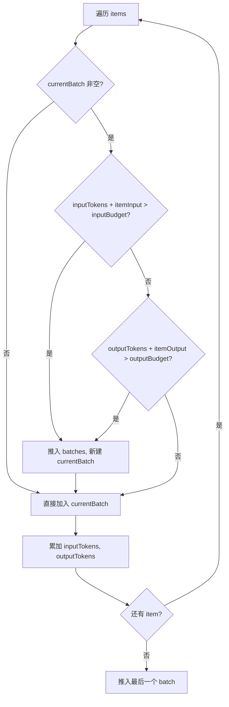
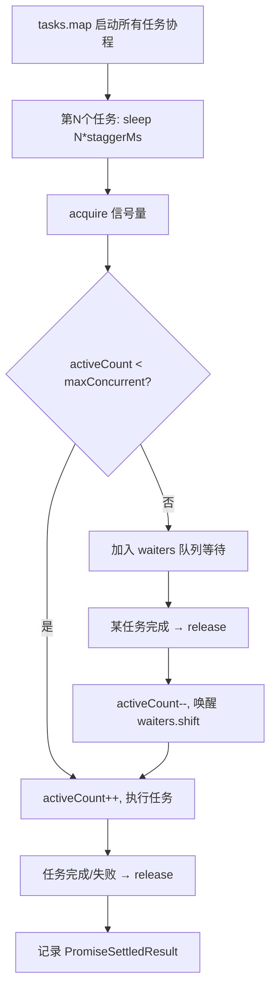

# PD-511.01 moyin-creator — 三层批量并发与双重 Token 约束分批

> 文档编号：PD-511.01
> 来源：moyin-creator `src/lib/ai/batch-processor.ts`, `src/lib/utils/concurrency.ts`, `src/packages/ai-core/api/task-queue.ts`
> GitHub：https://github.com/MemeCalculate/moyin-creator.git
> 问题域：PD-511 批量并发处理 Batch Concurrency Control
> 状态：可复用方案

---

## 第 1 章 问题与动机

### 1.1 核心问题

AI 应用中批量调用 LLM API 面临三重约束：

1. **Input Token 限制** — 每次请求的上下文窗口有上限，超出会被 API 拒绝或产生 "Lost in the middle" 效应
2. **Output Token 限制** — 模型单次最大输出有上限（如 DeepSeek-V3 仅 8192），批量 item 的预期输出总和不能超出
3. **并发速率限制** — API 提供商对 RPM/TPM 有限制，瞬时并发会触发 429 限流

moyin-creator 是一个 AI 驱动的影视剧本创作工具，需要对角色列表、场景列表、分镜列表等进行批量 AI 校准。一部 40 集电视剧可能有 200+ 角色、500+ 场景、数千个分镜，单次 API 调用无法处理全部数据。

### 1.2 moyin-creator 的解法概述

moyin-creator 构建了三层批量并发体系，每层解决不同粒度的问题：

1. **`processBatched`**（`batch-processor.ts:105`）— 自适应分批引擎，双重约束（input+output token）贪心分组，自动查询模型 Registry 获取限制参数
2. **`runStaggered`**（`concurrency.ts:27`）— 错开启动并发控制器，信号量 + stagger 间隔双重保护，避免瞬时并发触发限流
3. **`TaskQueue`**（`task-queue.ts:26`）— 优先级任务队列，按类型分发 handler，支持取消/恢复，用于图片/视频等异构任务调度

三层之间的关系：`processBatched` 内部调用 `runStaggered` 执行并发批次；`TaskQueue` 独立用于图片/视频生成等需要优先级排序的场景。

### 1.3 设计思想

| 设计原则 | 具体实现 | 理由 | 替代方案 |
|----------|----------|------|----------|
| 双重约束分批 | input + output token 同时约束，任一超出即开新批 | 仅约束 input 会导致 output 截断；仅约束 output 会导致请求被拒 | 固定 item 数分批（不精确） |
| 60K Hard Cap | `HARD_CAP_TOKENS = 60000`，无论模型支持多大上下文 | 防止超长上下文的 TTFT 过高和 Lost in the middle 效应 | 按模型 contextWindow 百分比（可能仍然太大） |
| 贪心保底 | 单个 item 超预算时仍独立成批（至少 1 个/批） | 避免死循环：超大 item 永远无法被分配 | 跳过超大 item（丢数据） |
| 错开启动 | `staggerMs` 间隔 + 信号量并发上限 | 即使并发=3，也不在同一毫秒发出 3 个请求 | 简单 Promise.all（瞬时并发） |
| 容错隔离 | `PromiseSettledResult` 收集，失败批次不影响成功批次 | 部分成功优于全部失败 | Promise.all（一个失败全部失败） |
| 用户可配并发 | `store.concurrency` 从 Zustand 读取，UI 可调 | 不同 API Key 的限流阈值不同 | 硬编码并发数 |

---

## 第 2 章 源码实现分析

### 2.1 架构概览

```
┌─────────────────────────────────────────────────────────────────┐
│                    调用方（Calibrator / Service）                  │
│  character-calibrator.ts / scene-calibrator.ts / full-script-   │
│  service.ts / shot-calibration-stages.ts                        │
└──────────────────────────┬──────────────────────────────────────┘
                           │ processBatched(opts)
                           ▼
┌─────────────────────────────────────────────────────────────────┐
│              Layer 1: processBatched (batch-processor.ts)        │
│                                                                  │
│  ① getModelLimits(modelName) → contextWindow, maxOutput         │
│  ② inputBudget = min(ctx*0.6, 60K), outputBudget = maxOut*0.8  │
│  ③ createBatches() → 双重约束贪心分组                             │
│  ④ 单批次 → 直接执行; 多批次 → runStaggered()                    │
│  ⑤ executeBatchWithRetry() → 指数退避重试(max 2次)               │
│  ⑥ 容错合并: PromiseSettledResult → 部分成功返回                  │
└──────────────────────────┬──────────────────────────────────────┘
                           │ runStaggered(tasks, concurrency, 5000)
                           ▼
┌─────────────────────────────────────────────────────────────────┐
│              Layer 2: runStaggered (concurrency.ts)              │
│                                                                  │
│  信号量: acquire()/release() 控制 maxConcurrent                  │
│  Stagger: 第N个任务在 N*staggerMs 后才启动                       │
│  双重保护: stagger 到期 + 信号量空闲 才真正启动                    │
└─────────────────────────────────────────────────────────────────┘

┌─────────────────────────────────────────────────────────────────┐
│              Layer 3: TaskQueue (task-queue.ts)                   │
│                                                                  │
│  优先级插入排序 → handler 分发 → 并发槽位控制                     │
│  支持: cancel / resume / getStats / isIdle                       │
│  用于: 图片生成(image) / 视频生成(video) / 剧本分析(screenplay)   │
└─────────────────────────────────────────────────────────────────┘
```

### 2.2 核心实现

#### 2.2.1 双重约束贪心分批算法



对应源码 `src/lib/ai/batch-processor.ts:246-285`：

```typescript
function createBatches<TItem>(
  items: TItem[],
  getItemTokens: (item: TItem) => number,
  getItemOutputTokens: (item: TItem) => number,
  inputBudget: number,
  outputBudget: number,
  systemPromptTokens: number,
): TItem[][] {
  const batches: TItem[][] = [];
  let currentBatch: TItem[] = [];
  let currentInputTokens = systemPromptTokens; // system prompt 每批都要带
  let currentOutputTokens = 0;

  for (const item of items) {
    const itemInput = getItemTokens(item);
    const itemOutput = getItemOutputTokens(item);

    const wouldExceedInput = currentInputTokens + itemInput > inputBudget;
    const wouldExceedOutput = currentOutputTokens + itemOutput > outputBudget;

    if (currentBatch.length > 0 && (wouldExceedInput || wouldExceedOutput)) {
      batches.push(currentBatch);
      currentBatch = [];
      currentInputTokens = systemPromptTokens;
      currentOutputTokens = 0;
    }

    currentBatch.push(item);
    currentInputTokens += itemInput;
    currentOutputTokens += itemOutput;
  }

  if (currentBatch.length > 0) {
    batches.push(currentBatch);
  }
  return batches;
}
```

关键细节：
- `systemPromptTokens` 每批都要重新计入（`batch-processor.ts:256`），因为每批都会带相同的 system prompt
- `currentBatch.length > 0` 判断（`batch-processor.ts:266`）保证单个超大 item 仍能独立成批，不会死循环
- 预算计算：`inputBudget = min(contextWindow * 0.6, 60000)`（`batch-processor.ts:131`），留 40% 给 system prompt 和安全余量

#### 2.2.2 错开启动并发控制器



对应源码 `src/lib/utils/concurrency.ts:27-83`：

```typescript
export async function runStaggered<T>(
  tasks: (() => Promise<T>)[],
  maxConcurrent: number,
  staggerMs: number = 5000
): Promise<PromiseSettledResult<T>[]> {
  if (tasks.length === 0) return [];
  const results: PromiseSettledResult<T>[] = new Array(tasks.length);

  // 信号量：控制最大并发数
  let activeCount = 0;
  const waiters: (() => void)[] = [];

  const acquire = async (): Promise<void> => {
    if (activeCount < maxConcurrent) { activeCount++; return; }
    await new Promise<void>((resolve) => waiters.push(resolve));
  };

  const release = (): void => {
    activeCount--;
    if (waiters.length > 0) {
      activeCount++;
      const next = waiters.shift()!;
      next();
    }
  };

  const taskPromises = tasks.map(async (task, idx) => {
    if (idx > 0) {
      await new Promise<void>((r) => setTimeout(r, idx * staggerMs));
    }
    await acquire();
    try {
      const value = await task();
      results[idx] = { status: 'fulfilled', value };
    } catch (reason) {
      results[idx] = { status: 'rejected', reason: reason as any };
    } finally {
      release();
    }
  });

  await Promise.all(taskPromises);
  return results;
}
```

关键设计：
- **双重保护**：stagger 延迟保证请求不在同一时刻发出，信号量保证同时运行数不超限
- **FIFO 唤醒**：`waiters.shift()` 保证先等待的任务先被唤醒，避免饥饿
- **结果保序**：`results[idx]` 按原始索引存储，返回顺序与输入一致

### 2.3 实现细节

#### 2.3.1 单批次重试与不可重试错误

`executeBatchWithRetry`（`batch-processor.ts:292-326`）实现指数退避重试，但对 `TOKEN_BUDGET_EXCEEDED` 错误直接抛出不重试——因为输入太大，重试也不会成功：

```typescript
// batch-processor.ts:310
if ((lastError as any).code === 'TOKEN_BUDGET_EXCEEDED') {
  throw lastError;  // 不重试
}
const delay = RETRY_BASE_DELAY * Math.pow(2, attempt); // 3s, 6s
```

#### 2.3.2 TaskQueue 优先级插入

`TaskQueue.enqueue`（`task-queue.ts:48-69`）使用插入排序维护优先级：

```typescript
// task-queue.ts:61-66
const idx = this.queue.findIndex(t => t.priority < fullTask.priority);
if (idx === -1) {
  this.queue.push(fullTask as TaskItem);
} else {
  this.queue.splice(idx, 0, fullTask as TaskItem);
}
```

高优先级任务插入到队列前部，`tryExecuteNext` 总是取第一个 `queued` 状态的任务执行。

#### 2.3.3 rateLimitedBatch 与 batchProcess

`rate-limiter.ts` 提供两个补充工具：
- `rateLimitedBatch`（`rate-limiter.ts:31-61`）— 串行执行 + 固定延迟，最简单的限流
- `batchProcess`（`rate-limiter.ts:96-165`）— 分批执行，批内并行（`itemDelayMs=0` 时用 `Promise.all`），批间延迟
- `createRateLimitedFn`（`rate-limiter.ts:74-91`）— 函数级限流装饰器，保证两次调用间隔 ≥ `minDelayMs`

#### 2.3.4 数据流：从 Calibrator 到 API

```
character-calibrator.ts:409
  → processBatched({ items: batchItems, feature: 'script_analysis', ... })
    → getModelLimits(modelName)           // model-registry.ts 三层查找
    → createBatches(items, ...)           // 双重约束分组
    → runStaggered(batchTasks, concurrency, 5000)  // 错开并发
      → executeBatchWithRetry(batch, ...)
        → callFeatureAPI(feature, system, user)  // feature-router.ts
          → 实际 API 调用
```

调用方只需提供 `buildPrompts` 和 `parseResult` 两个函数，分批、并发、重试、合并全部由 `processBatched` 自动处理。这在 `shot-calibration-stages.ts:104` 的注释中明确说明：

> 通用 Stage 执行器：使用 processBatched 自动分批（30+ shots 时自动拆分 sub-batch）


---

## 第 3 章 迁移指南

### 3.1 迁移清单

**阶段 1：核心分批引擎（1 个文件）**

- [ ] 移植 `createBatches` 函数 — 双重约束贪心分组，纯函数无外部依赖
- [ ] 定义 `ModelLimits` 接口（`contextWindow` + `maxOutput`）
- [ ] 实现 `getModelLimits` 查表函数（可简化为静态 Map）
- [ ] 设置 `HARD_CAP_TOKENS`（建议 60K，可根据场景调整）

**阶段 2：并发控制器（1 个文件）**

- [ ] 移植 `runStaggered` 函数 — 信号量 + stagger 间隔
- [ ] 确定 `staggerMs` 默认值（moyin-creator 用 5000ms，可根据 API 限流调整）
- [ ] 确定 `maxConcurrent` 来源（用户配置 or 硬编码）

**阶段 3：组装 processBatched（1 个文件）**

- [ ] 组装 `processBatched` 主函数，串联分批 → 并发 → 重试 → 合并
- [ ] 实现 `executeBatchWithRetry`，定义不可重试错误类型
- [ ] 实现容错合并逻辑（`PromiseSettledResult` 过滤）

**阶段 4（可选）：优先级任务队列**

- [ ] 移植 `TaskQueue` 类 — 适用于异构任务（图片/视频/文本混合）
- [ ] 注册 handler per type
- [ ] 实现 cancel/resume 生命周期

### 3.2 适配代码模板

以下是一个可直接运行的最小化 `processBatched` 实现：

```typescript
// batch-processor.ts — 最小化可复用版本

interface ModelLimits {
  contextWindow: number;
  maxOutput: number;
}

interface BatchOptions<TItem, TResult> {
  items: TItem[];
  modelLimits: ModelLimits;
  buildPrompts: (batch: TItem[]) => { system: string; user: string };
  parseResult: (raw: string, batch: TItem[]) => Map<string, TResult>;
  callAPI: (system: string, user: string) => Promise<string>;
  estimateItemTokens?: (item: TItem) => number;
  estimateItemOutputTokens?: (item: TItem) => number;
  concurrency?: number;
  staggerMs?: number;
  onProgress?: (completed: number, total: number) => void;
}

const HARD_CAP = 60000;
const MAX_RETRIES = 2;
const RETRY_BASE_DELAY = 3000;

export async function processBatched<TItem, TResult>(
  opts: BatchOptions<TItem, TResult>
): Promise<{ results: Map<string, TResult>; failedBatches: number }> {
  const {
    items, modelLimits, buildPrompts, parseResult, callAPI,
    estimateItemTokens = (item) => JSON.stringify(item).length / 4,
    estimateItemOutputTokens = () => 300,
    concurrency = 1, staggerMs = 5000, onProgress,
  } = opts;

  if (items.length === 0) return { results: new Map(), failedBatches: 0 };

  const inputBudget = Math.min(Math.floor(modelLimits.contextWindow * 0.6), HARD_CAP);
  const outputBudget = Math.floor(modelLimits.maxOutput * 0.8);

  // 估算 system prompt token 开销
  const samplePrompts = buildPrompts([items[0]]);
  const sysTokens = samplePrompts.system.length / 4; // 粗估

  // 双重约束贪心分批
  const batches: TItem[][] = [];
  let batch: TItem[] = [], inTok = sysTokens, outTok = 0;
  for (const item of items) {
    const iIn = estimateItemTokens(item), iOut = estimateItemOutputTokens(item);
    if (batch.length > 0 && (inTok + iIn > inputBudget || outTok + iOut > outputBudget)) {
      batches.push(batch);
      batch = []; inTok = sysTokens; outTok = 0;
    }
    batch.push(item); inTok += iIn; outTok += iOut;
  }
  if (batch.length > 0) batches.push(batch);

  // 并发执行（复用 runStaggered 逻辑）
  const tasks = batches.map((b, idx) => async () => {
    onProgress?.(idx, batches.length);
    for (let attempt = 0; attempt <= MAX_RETRIES; attempt++) {
      try {
        const { system, user } = buildPrompts(b);
        const raw = await callAPI(system, user);
        return parseResult(raw, b);
      } catch (e) {
        if (attempt < MAX_RETRIES) {
          await new Promise(r => setTimeout(r, RETRY_BASE_DELAY * 2 ** attempt));
        } else throw e;
      }
    }
    throw new Error('unreachable');
  });

  const settled = await runStaggered(tasks, concurrency, staggerMs);

  // 容错合并
  const results = new Map<string, TResult>();
  let failedBatches = 0;
  for (const r of settled) {
    if (r.status === 'fulfilled') {
      for (const [k, v] of r.value) results.set(k, v);
    } else failedBatches++;
  }
  return { results, failedBatches };
}

// runStaggered — 信号量 + 错开启动
async function runStaggered<T>(
  tasks: (() => Promise<T>)[], max: number, staggerMs: number
): Promise<PromiseSettledResult<T>[]> {
  const results: PromiseSettledResult<T>[] = new Array(tasks.length);
  let active = 0;
  const waiters: (() => void)[] = [];

  const acquire = async () => {
    if (active < max) { active++; return; }
    await new Promise<void>(r => waiters.push(r));
  };
  const release = () => {
    active--;
    if (waiters.length > 0) { active++; waiters.shift()!(); }
  };

  await Promise.all(tasks.map(async (task, i) => {
    if (i > 0) await new Promise<void>(r => setTimeout(r, i * staggerMs));
    await acquire();
    try {
      results[i] = { status: 'fulfilled', value: await task() };
    } catch (reason) {
      results[i] = { status: 'rejected', reason: reason as any };
    } finally { release(); }
  }));
  return results;
}
```

### 3.3 适用场景

| 场景 | 适用度 | 说明 |
|------|--------|------|
| 批量 LLM 文本生成（角色/场景/分镜校准） | ⭐⭐⭐ | 核心场景，双重 token 约束分批最有价值 |
| 批量图片/视频生成 | ⭐⭐⭐ | TaskQueue 优先级队列 + 并发槽位控制 |
| 批量 Embedding 计算 | ⭐⭐ | 通常只有 input 约束，output 约束可简化 |
| 批量 API 调用（非 LLM） | ⭐⭐ | runStaggered 单独使用即可，不需要 token 分批 |
| 实时流式对话 | ⭐ | 不适用，流式场景不需要分批 |

---

## 第 4 章 测试用例

```typescript
import { describe, it, expect, vi } from 'vitest';

// ==================== createBatches 测试 ====================

describe('createBatches - 双重约束贪心分批', () => {
  // 模拟 createBatches 逻辑
  function createBatches<T>(
    items: T[],
    getInput: (t: T) => number,
    getOutput: (t: T) => number,
    inputBudget: number,
    outputBudget: number,
    sysTok: number,
  ): T[][] {
    const batches: T[][] = [];
    let batch: T[] = [], inTok = sysTok, outTok = 0;
    for (const item of items) {
      const iIn = getInput(item), iOut = getOutput(item);
      if (batch.length > 0 && (inTok + iIn > inputBudget || outTok + iOut > outputBudget)) {
        batches.push(batch); batch = []; inTok = sysTok; outTok = 0;
      }
      batch.push(item); inTok += iIn; outTok += iOut;
    }
    if (batch.length > 0) batches.push(batch);
    return batches;
  }

  it('所有 item 放入单批次（未超限）', () => {
    const items = [{ id: 1, tok: 100 }, { id: 2, tok: 200 }];
    const batches = createBatches(items, i => i.tok, () => 50, 1000, 500, 100);
    expect(batches).toHaveLength(1);
    expect(batches[0]).toHaveLength(2);
  });

  it('input 约束触发分批', () => {
    const items = [{ id: 1, tok: 400 }, { id: 2, tok: 400 }, { id: 3, tok: 400 }];
    const batches = createBatches(items, i => i.tok, () => 50, 900, 5000, 100);
    // 100(sys) + 400 + 400 = 900 ≤ 900, 第三个 100+400+400+400=1300 > 900
    expect(batches).toHaveLength(2);
    expect(batches[0]).toHaveLength(2);
    expect(batches[1]).toHaveLength(1);
  });

  it('output 约束触发分批', () => {
    const items = [{ id: 1, tok: 10 }, { id: 2, tok: 10 }, { id: 3, tok: 10 }];
    const batches = createBatches(items, () => 10, () => 200, 10000, 350, 0);
    // 200+200=400 > 350, 所以第二个 item 开新批
    expect(batches).toHaveLength(2);
  });

  it('超大单 item 独立成批（不死循环）', () => {
    const items = [{ id: 1, tok: 99999 }];
    const batches = createBatches(items, i => i.tok, () => 50, 1000, 500, 100);
    expect(batches).toHaveLength(1);
    expect(batches[0]).toHaveLength(1);
  });

  it('空输入返回空数组', () => {
    const batches = createBatches([], () => 0, () => 0, 1000, 500, 100);
    expect(batches).toHaveLength(0);
  });
});

// ==================== runStaggered 测试 ====================

describe('runStaggered - 错开启动并发控制', () => {
  it('按顺序返回结果（保序）', async () => {
    const tasks = [1, 2, 3].map(n => async () => n * 10);
    const results = await runStaggered(tasks, 3, 0);
    expect(results.map(r => r.status === 'fulfilled' ? r.value : null)).toEqual([10, 20, 30]);
  });

  it('单个失败不影响其他任务', async () => {
    const tasks = [
      async () => 'ok1',
      async () => { throw new Error('fail'); },
      async () => 'ok3',
    ];
    const results = await runStaggered(tasks, 3, 0);
    expect(results[0].status).toBe('fulfilled');
    expect(results[1].status).toBe('rejected');
    expect(results[2].status).toBe('fulfilled');
  });

  it('并发数限制生效', async () => {
    let maxActive = 0, active = 0;
    const tasks = Array.from({ length: 5 }, () => async () => {
      active++;
      maxActive = Math.max(maxActive, active);
      await new Promise(r => setTimeout(r, 50));
      active--;
      return 'done';
    });
    await runStaggered(tasks, 2, 0);
    expect(maxActive).toBeLessThanOrEqual(2);
  });

  it('空任务列表返回空数组', async () => {
    const results = await runStaggered([], 3, 0);
    expect(results).toEqual([]);
  });
});

// 辅助函数
async function runStaggered<T>(
  tasks: (() => Promise<T>)[], max: number, staggerMs: number
): Promise<PromiseSettledResult<T>[]> {
  const results: PromiseSettledResult<T>[] = new Array(tasks.length);
  let active = 0;
  const waiters: (() => void)[] = [];
  const acquire = async () => {
    if (active < max) { active++; return; }
    await new Promise<void>(r => waiters.push(r));
  };
  const release = () => {
    active--;
    if (waiters.length > 0) { active++; waiters.shift()!(); }
  };
  await Promise.all(tasks.map(async (task, i) => {
    if (i > 0) await new Promise<void>(r => setTimeout(r, i * staggerMs));
    await acquire();
    try { results[i] = { status: 'fulfilled', value: await task() }; }
    catch (reason) { results[i] = { status: 'rejected', reason: reason as any }; }
    finally { release(); }
  }));
  return results;
}
```


---

## 第 5 章 跨域关联

| 关联域 | 关系类型 | 说明 |
|--------|----------|------|
| PD-01 上下文管理 | 依赖 | `processBatched` 的 `inputBudget` 计算依赖模型 contextWindow，`HARD_CAP_TOKENS=60K` 是上下文管理的硬约束 |
| PD-03 容错与重试 | 协同 | `executeBatchWithRetry` 实现批次级指数退避重试，`TOKEN_BUDGET_EXCEEDED` 不可重试错误识别 |
| PD-04 工具系统 | 协同 | `processBatched` 通过 `callFeatureAPI` 调用 feature-router，feature-router 是工具系统的一部分 |
| PD-483 异步任务轮询 | 协同 | `TaskQueue` 与 `TaskPoller`（同目录导出）配合，用于图片/视频等异步生成任务的状态轮询 |
| PD-476 API Key 轮转 | 依赖 | `concurrency` 设置与 API Key 数量相关，多 Key 时可提高并发数 |
| PD-481 批量生成管道 | 协同 | `processBatched` 是批量生成管道的执行引擎，管道负责编排多阶段调用顺序 |

---

## 第 6 章 来源文件索引

| 文件 | 行范围 | 关键实现 |
|------|--------|----------|
| `src/lib/ai/batch-processor.ts` | L1-327 | 完整的自适应批处理引擎：`processBatched` 主函数、`createBatches` 双重约束分批、`executeBatchWithRetry` 重试 |
| `src/lib/utils/concurrency.ts` | L1-83 | `runStaggered` 错开启动并发控制器：信号量 acquire/release + stagger 延迟 |
| `src/packages/ai-core/api/task-queue.ts` | L1-153 | `TaskQueue` 优先级任务队列：插入排序、handler 分发、cancel/resume 生命周期 |
| `src/lib/utils/rate-limiter.ts` | L1-178 | 限流工具集：`rateLimitedBatch` 串行限流、`batchProcess` 分批并行、`createRateLimitedFn` 函数装饰器 |
| `src/lib/ai/model-registry.ts` | L1-60+ | 模型能力注册表：三层查找（缓存→静态→默认）获取 contextWindow/maxOutput |
| `src/lib/script/character-calibrator.ts` | L409 | `processBatched` 调用示例：角色批量校准 |
| `src/lib/script/scene-calibrator.ts` | L327 | `processBatched` 调用示例：场景批量校准 |
| `src/lib/script/shot-calibration-stages.ts` | L104-127 | `processBatched` 调用示例：分镜多阶段批量校准 |
| `src/lib/script/full-script-service.ts` | L902, L1995 | `processBatched` 调用示例：集标题生成、剧情大纲生成 |
| `src/stores/api-config-store.ts` | L164, L303 | `concurrency` 用户配置项，默认值 1（串行执行） |
| `src/components/BatchProgressOverlay.tsx` | L1-60 | 批量进度 UI 覆盖层，展示 current/total 进度条 |

---

## 第 7 章 横向对比维度

```json comparison_data
{
  "project": "moyin-creator",
  "dimensions": {
    "分批策略": "双重约束（input+output token）贪心分组 + 60K Hard Cap",
    "并发模型": "信号量 + stagger 错开启动，用户可配并发数",
    "任务调度": "TaskQueue 优先级插入排序 + handler 类型分发",
    "容错策略": "PromiseSettledResult 部分成功返回 + 批次级指数退避重试",
    "限流机制": "三层限流：stagger 间隔 + 信号量 + rateLimitedBatch 批间延迟",
    "进度反馈": "onProgress 回调 + BatchProgressOverlay UI 组件"
  }
}
```

### 域元数据补充

```json domain_metadata
{
  "solution_summary": "moyin-creator 用 processBatched 双重 token 约束贪心分批 + runStaggered 信号量错开启动并发 + TaskQueue 优先级队列，三层体系覆盖文本/图片/视频批量 AI 调度",
  "description": "AI 应用中批量调用 LLM/多模态 API 的分批、并发、限流、容错一体化调度",
  "sub_problems": [
    "不可重试错误识别与快速失败（TOKEN_BUDGET_EXCEEDED 等）",
    "system prompt token 开销的跨批次重复计入",
    "异构任务（文本/图片/视频）的统一队列调度"
  ],
  "best_practices": [
    "60K Hard Cap 防止超长上下文 TTFT 过高和 Lost in the middle",
    "函数级限流装饰器 createRateLimitedFn 保证最小调用间隔",
    "并发数从用户配置读取而非硬编码，适配不同 API Key 限流阈值"
  ]
}
```

