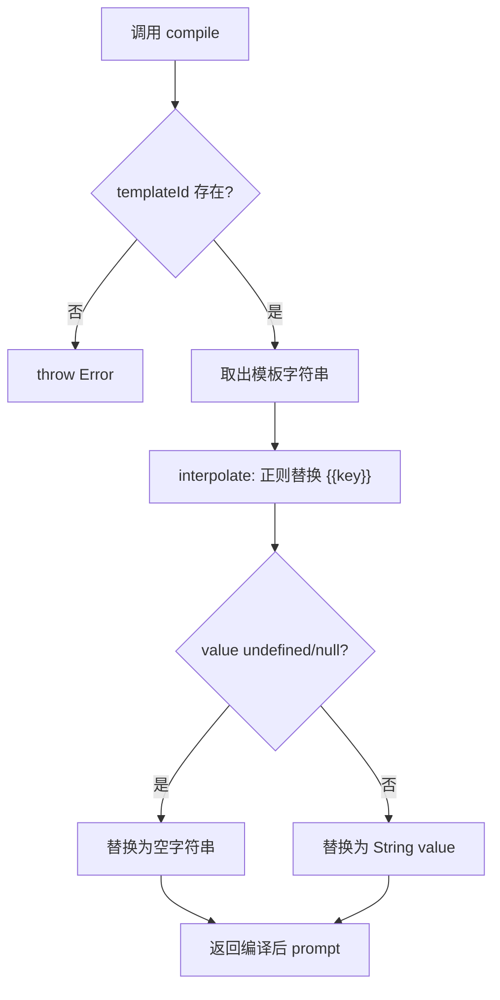
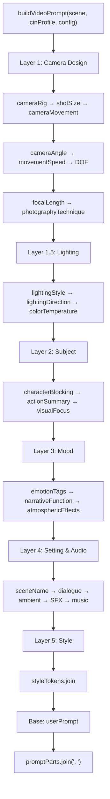
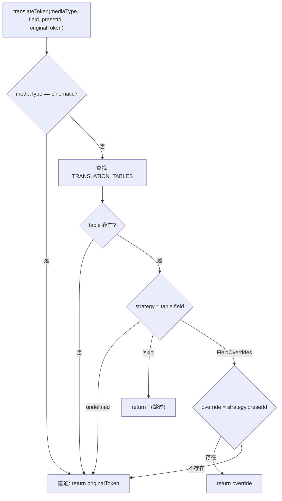

# PD-512.01 moyin-creator — 四层 Prompt 编译与媒介翻译管道

> 文档编号：PD-512.01
> 来源：moyin-creator `src/packages/ai-core/services/prompt-compiler.ts`, `src/lib/generation/prompt-builder.ts`, `src/lib/generation/media-type-tokens.ts`, `src/components/panels/sclass/sclass-prompt-builder.ts`, `src/lib/character/character-prompt-service.ts`
> GitHub：https://github.com/MemeCalculate/moyin-creator.git
> 问题域：PD-512 Prompt 工程系统 Prompt Engineering System
> 状态：可复用方案

---

## 第 1 章 问题与动机（≥ 30 行）

### 1.1 核心问题

AI 视频/图像生成的 Prompt 工程面临三重挑战：

1. **信号稀释**：将所有描述（镜头、灯光、角色、氛围、风格）平铺在一个字符串中，模型无法区分优先级，导致关键指令被淹没。
2. **媒介不兼容**：物理摄影词汇（dolly、rack focus、shallow DOF）在动画、定格动画、平面图形等非真人媒介下语义失效甚至产生负面效果。
3. **多模态引用管理**：S 级视频生成（如 Seedance 2.0）支持 @Image/@Video/@Audio 多模态引用，但有严格配额限制（≤9 图 + ≤3 视频 + ≤3 音频，总 ≤12，prompt ≤5000 字符），需要自动收集、去重、编号和配额校验。

### 1.2 moyin-creator 的解法概述

moyin-creator 构建了四层 Prompt 编译体系，每层解决不同粒度的问题：

1. **PromptCompiler（模板层）**：Mustache 风格模板引擎，支持 `sceneImage`/`sceneVideo`/`negative`/`screenplay` 四类模板，运行时可热更新（`prompt-compiler.ts:50-163`）。
2. **prompt-builder（语义层）**：5 层语义组装管道 Camera → Lighting → Subject → Mood → Style，每层独立拼接后用 `. ` 连接，避免信号稀释（`prompt-builder.ts:112-350`）。
3. **media-type-tokens（翻译层）**：4 种媒介类型（cinematic/animation/stop-motion/graphic）的参数翻译表，将物理摄影 token 翻译为媒介等效表达（`media-type-tokens.ts:57-208`）。
4. **sclass-prompt-builder（组装层）**：S 级多镜头组级 Prompt 构建器，自动收集 @Image/@Video/@Audio 引用、唇形同步指令、配额校验（`sclass-prompt-builder.ts:579-759`）。

辅助层：**character-prompt-service（角色锚点层）**：AI 驱动的多阶段角色设计，生成一致性元素（面部特征/体型/独特标记）作为跨镜头锚点（`character-prompt-service.ts:80-343`）。

### 1.3 设计思想

| 设计原则 | 具体实现 | 理由 | 替代方案 |
|----------|----------|------|----------|
| 语义分层优先级 | 5 层 Camera > Lighting > Subject > Mood > Style | 模型对 prompt 前部权重更高，镜头语言放最前 | 平铺所有描述（信号稀释） |
| 媒介感知翻译 | translateToken() 查表替换/跳过/直通三策略 | 动画不需要 dolly，graphic 不需要 DOF | 统一词汇不区分媒介 |
| 模板与数据分离 | Mustache `{{var}}` 插值 + 运行时 updateTemplates | 模板可由用户/AI 校准后替换 | 硬编码字符串拼接 |
| 配额感知组装 | SEEDANCE_LIMITS 常量 + collectAllRefs 配额校验 | 超限直接截断并警告，避免 API 报错 | 不校验直接发送 |
| 角色一致性锚点 | consistencyElements 前缀注入每个阶段 prompt | 面部/体型/标记不变，确保跨镜头可辨认 | 每镜头独立描述角色 |

---

## 第 2 章 源码实现分析（≥ 60 行，核心章节）

### 2.1 架构概览

```
┌─────────────────────────────────────────────────────────────────┐
│                    moyin-creator Prompt 编译体系                   │
├─────────────────────────────────────────────────────────────────┤
│                                                                 │
│  Layer 4: sclass-prompt-builder (S级组装)                        │
│  ┌─────────────────────────────────────────────────────────┐    │
│  │ buildGroupPrompt()                                       │    │
│  │  ├─ collectAllRefs() → @Image/@Video/@Audio 收集+编号    │    │
│  │  ├─ buildShotSegment() × N → 逐镜头描述                  │    │
│  │  ├─ extractDialogueSegments() → 唇形同步                 │    │
│  │  └─ 配额校验 (≤9图/≤3视频/≤3音频/≤5000字符)              │    │
│  └─────────────────────────────────────────────────────────┘    │
│                          ↓ 调用                                  │
│  Layer 3: media-type-tokens (媒介翻译)                           │
│  ┌─────────────────────────────────────────────────────────┐    │
│  │ translateToken(mediaType, field, presetId, original)     │    │
│  │  cinematic → 直通 | animation → 虚拟摄像机适配            │    │
│  │  stop-motion → 微缩实拍约束 | graphic → 跳过物理参数      │    │
│  └─────────────────────────────────────────────────────────┘    │
│                          ↓ 被调用                                │
│  Layer 2: prompt-builder (5层语义组装)                            │
│  ┌─────────────────────────────────────────────────────────┐    │
│  │ buildVideoPrompt(scene, cinProfile, config)              │    │
│  │  L1: Camera → L1.5: Lighting → L2: Subject              │    │
│  │  → L3: Mood → L4: Setting/Audio → L5: Style → Base      │    │
│  └─────────────────────────────────────────────────────────┘    │
│                          ↓ 底层                                  │
│  Layer 1: PromptCompiler (Mustache 模板)                         │
│  ┌─────────────────────────────────────────────────────────┐    │
│  │ compile(templateId, variables) → interpolate {{var}}     │    │
│  │  sceneImage / sceneVideo / negative / screenplay         │    │
│  └─────────────────────────────────────────────────────────┘    │
│                                                                 │
│  辅助: character-prompt-service (角色一致性锚点)                  │
│  ┌─────────────────────────────────────────────────────────┐    │
│  │ generateCharacterDesign() → consistencyElements          │    │
│  │ getCharacterPromptForEpisode() → 锚点前缀 + 阶段 prompt  │    │
│  └─────────────────────────────────────────────────────────┘    │
└─────────────────────────────────────────────────────────────────┘
```

### 2.2 核心实现

#### 2.2.1 PromptCompiler — Mustache 模板引擎



对应源码 `src/packages/ai-core/services/prompt-compiler.ts:50-82`：

```typescript
export class PromptCompiler {
  private templates: PromptTemplateConfig;

  constructor(customTemplates?: Partial<PromptTemplateConfig>) {
    this.templates = { ...DEFAULT_TEMPLATES, ...customTemplates };
  }

  compile(templateId: keyof PromptTemplateConfig,
          variables: Record<string, string | number | undefined>): string {
    const template = this.templates[templateId];
    if (!template) throw new Error(`Template "${templateId}" not found`);
    return this.interpolate(template, variables);
  }

  private interpolate(template: string,
                      variables: Record<string, string | number | undefined>): string {
    return template.replace(/\{\{(\w+)\}\}/g, (match, key) => {
      const value = variables[key];
      if (value === undefined || value === null) return '';
      return String(value);
    });
  }

  updateTemplates(updates: Partial<PromptTemplateConfig>): void {
    this.templates = { ...this.templates, ...updates };
  }
}

export const promptCompiler = new PromptCompiler(); // 单例
```

关键设计：模板引擎以单例导出，支持 `updateTemplates()` 运行时热更新。默认模板包含 4 类：`sceneImage`（图像生成）、`sceneVideo`（视频生成）、`negative`（负面提示词）、`screenplay`（剧本生成）。

#### 2.2.2 prompt-builder — 5 层语义组装管道



对应源码 `src/lib/generation/prompt-builder.ts:112-349`：

```typescript
export function buildVideoPrompt(
  scene: SplitScene,
  cinProfile: CinematographyProfile | undefined,
  config: VideoPromptConfig = {},
): string {
  const promptParts: string[] = [];
  const mt = config.mediaType;

  // Layer 1: Camera Design — 最高优先级
  const cameraDesignParts: string[] = [];
  const effectiveRig = scene.cameraRig || cinProfile?.defaultRig?.cameraRig;
  const rigToken = findPresetToken(CAMERA_RIG_PRESETS, effectiveRig, mt, 'cameraRig');
  if (rigToken) cameraDesignParts.push(rigToken);
  // ... shotSize, cameraMovement, cameraAngle, movementSpeed, DOF, focalLength, technique
  if (cameraDesignParts.length > 0) {
    promptParts.push(`Camera: ${cameraDesignParts.join(', ')}`);
  }

  // Layer 1.5: Lighting
  const lightingParts: string[] = [];
  // ... lightingStyle, lightingDirection, colorTemperature, lightingNotes
  if (lightingParts.length > 0) {
    promptParts.push(`Lighting: ${lightingParts.join(' ')}`);
  }

  // Layer 2: Subject → Layer 3: Mood → Layer 4: Audio → Layer 5: Style
  // ... 每层独立拼接

  return promptParts.join('. ');
}
```

核心机制：**逐镜字段优先，回退摄影档案**。每个摄影参数（如 `cameraRig`、`cameraAngle`、`depthOfField`）都遵循 `scene.field || cinProfile?.defaultField` 的回退链（`prompt-builder.ts:124`、`149`、`168`）。这使得项目级摄影档案作为全局默认值，逐镜头可覆盖。

#### 2.2.3 media-type-tokens — 媒介翻译层



对应源码 `src/lib/generation/media-type-tokens.ts:185-208`：

```typescript
export function translateToken(
  mediaType: MediaType,
  field: CinematographyField,
  presetId: string,
  originalToken: string,
): string {
  if (mediaType === 'cinematic') return originalToken;  // 直通
  const table = TRANSLATION_TABLES[mediaType];
  if (!table) return originalToken;
  const strategy = table[field];
  if (strategy === undefined) return originalToken;     // 无特殊处理
  if (strategy === 'skip') return '';                    // 整体跳过
  const override = strategy[presetId];
  return override !== undefined ? override : originalToken; // 查表替换
}
```

翻译表示例 — graphic 媒介下物理摄影参数全部跳过，灯光转译为色彩情绪（`media-type-tokens.ts:125-163`）：
- `cameraRig: 'skip'` — 平面图形无摄像机概念
- `lightingStyle.chiaroscuro → 'strong light-dark contrast zones,'` — 明暗对比转为色块描述
- `colorTemperature.golden-hour → 'warm golden cast,'` — 色温转为色调倾向

### 2.3 实现细节

**sclass-prompt-builder 的多模态引用收集**（`sclass-prompt-builder.ts:311-374`）：

引用收集遵循优先级策略：
1. **格子图模式**：格子图占 1 槽 → 剩余给角色参考图 → 再给场景参考图
2. **旧版模式**：首帧图 > 角色图 > 场景图，合计 ≤9 张
3. 所有引用重新编号 `@图片1`、`@图片2`...，消除副作用
4. 配额校验：总文件数 > 12 时生成 `limitWarnings`

**角色一致性锚点注入**（`character-prompt-service.ts:312-343`）：

`getCharacterPromptForEpisode()` 根据集数匹配阶段，将 `consistencyElements`（facialFeatures + bodyType + uniqueMarks）作为前缀注入阶段 prompt：

```typescript
const consistencyPrefix = [
  design.consistencyElements.facialFeatures,
  design.consistencyElements.bodyType,
  design.consistencyElements.uniqueMarks,
].filter(Boolean).join(', ');

return {
  promptEn: consistencyPrefix
    ? `${consistencyPrefix}, ${stage.visualPromptEn}`
    : stage.visualPromptEn,
  // ...
};
```

**三层提示词系统**（`scene-prompt-generator.ts:14-22`）：
- 首帧提示词（imagePrompt）：静态构图描述
- 尾帧提示词（endFramePrompt）：仅在大幅位移/镜头运动时生成
- 视频提示词（videoPrompt）：动态动作描述

尾帧需求通过关键词推断（`scene-prompt-generator.ts:95-123`）：移动关键词（走/跑/冲）、变化关键词（变/蜕变）、镜头关键词（360/环绕/推进）。

---

## 第 3 章 迁移指南（≥ 40 行）

### 3.1 迁移清单

**阶段 1：模板引擎（1 个文件）**
- [ ] 移植 `PromptCompiler` 类（~60 行），支持 Mustache `{{var}}` 插值
- [ ] 定义项目专属模板配置（sceneImage/sceneVideo/negative 等）
- [ ] 导出单例实例

**阶段 2：语义分层组装（1 个文件 + 预设数据）**
- [ ] 定义语义层次（Camera/Lighting/Subject/Mood/Style 或自定义层次）
- [ ] 实现 `buildVideoPrompt()` 函数，每层独立拼接
- [ ] 实现逐镜字段 + 项目级档案回退链
- [ ] 准备预设数据（SHOT_SIZE_PRESETS、CAMERA_RIG_PRESETS 等）

**阶段 3：媒介翻译层（1 个文件）**
- [ ] 定义 `CinematographyField` 类型和 `MediaType` 枚举
- [ ] 编写翻译表（至少 cinematic 直通 + 1 种非真人媒介）
- [ ] 实现 `translateToken()` 三策略函数（直通/跳过/查表替换）

**阶段 4：多模态引用管理（按需）**
- [ ] 定义 `AssetRef` 类型和配额常量
- [ ] 实现引用收集函数（角色图/场景图/首帧图）
- [ ] 实现配额校验和自动编号

### 3.2 适配代码模板

**最小可用的语义分层 Prompt Builder（TypeScript）：**

```typescript
// prompt-layers.ts — 可直接复用的语义分层 Prompt 构建器

type LayerName = 'camera' | 'lighting' | 'subject' | 'mood' | 'style';

interface LayerConfig {
  name: LayerName;
  prefix: string;  // 如 "Camera:", "Lighting:"
  priority: number; // 数字越小优先级越高
}

const DEFAULT_LAYERS: LayerConfig[] = [
  { name: 'camera',   prefix: 'Camera:',   priority: 1 },
  { name: 'lighting', prefix: 'Lighting:', priority: 2 },
  { name: 'subject',  prefix: 'Subject:',  priority: 3 },
  { name: 'mood',     prefix: 'Mood:',     priority: 4 },
  { name: 'style',    prefix: 'Style:',    priority: 5 },
];

interface PromptParts {
  camera?: string[];
  lighting?: string[];
  subject?: string[];
  mood?: string[];
  style?: string[];
  base?: string;
}

export function buildLayeredPrompt(
  parts: PromptParts,
  layers: LayerConfig[] = DEFAULT_LAYERS,
  separator: string = '. ',
): string {
  const segments: string[] = [];

  for (const layer of layers.sort((a, b) => a.priority - b.priority)) {
    const tokens = parts[layer.name];
    if (tokens && tokens.length > 0) {
      segments.push(`${layer.prefix} ${tokens.filter(Boolean).join(', ')}`);
    }
  }

  if (parts.base?.trim()) {
    segments.push(parts.base.trim());
  }

  return segments.join(separator);
}
```

**最小可用的媒介翻译器（TypeScript）：**

```typescript
// media-translator.ts — 可直接复用的媒介翻译器

type MediaType = 'cinematic' | 'animation' | 'graphic';
type FieldOverrides = Record<string, string>;
type FieldStrategy = FieldOverrides | 'skip';

const TRANSLATION_TABLES: Record<string, Partial<Record<string, FieldStrategy>>> = {
  graphic: {
    cameraRig: 'skip',
    depthOfField: 'skip',
    lightingStyle: {
      'high-key': 'bright palette, open composition,',
      'low-key': 'dark tones, heavy contrast,',
    },
  },
};

export function translateToken(
  mediaType: MediaType,
  field: string,
  presetId: string,
  originalToken: string,
): string {
  if (mediaType === 'cinematic') return originalToken;
  const table = TRANSLATION_TABLES[mediaType];
  if (!table) return originalToken;
  const strategy = table[field];
  if (strategy === undefined) return originalToken;
  if (strategy === 'skip') return '';
  const override = strategy[presetId];
  return override !== undefined ? override : originalToken;
}
```

### 3.3 适用场景

| 场景 | 适用度 | 说明 |
|------|--------|------|
| AI 视频生成（多镜头） | ⭐⭐⭐ | 完美匹配：语义分层 + 媒介翻译 + 多模态引用管理 |
| AI 图像生成（单帧） | ⭐⭐⭐ | 语义分层 + 模板引擎即可，无需组级管理 |
| 多风格切换（动画/真人/图形） | ⭐⭐⭐ | 媒介翻译层的核心价值场景 |
| 纯文本 LLM Prompt | ⭐⭐ | 模板引擎可用，语义分层意义不大 |
| 音频生成 Prompt | ⭐ | 需要重新定义语义层次 |

---

## 第 4 章 测试用例（≥ 20 行）

```typescript
import { describe, it, expect } from 'vitest';

// ===== PromptCompiler 测试 =====
describe('PromptCompiler', () => {
  it('should interpolate Mustache variables', () => {
    const compiler = new PromptCompiler();
    const result = compiler.compile('sceneImage', {
      style_tokens: 'anime, vibrant',
      character_description: 'a young girl',
      visual_content: 'standing in a field',
      camera: 'wide shot',
      quality_tokens: 'high quality, 4K',
    });
    expect(result).toContain('anime, vibrant');
    expect(result).toContain('a young girl');
    expect(result).not.toContain('{{');
  });

  it('should replace undefined variables with empty string', () => {
    const compiler = new PromptCompiler();
    const result = compiler.compile('sceneImage', {
      style_tokens: 'anime',
      character_description: undefined,
      visual_content: 'a scene',
      camera: 'close-up',
      quality_tokens: undefined,
    });
    expect(result).not.toContain('undefined');
    expect(result).not.toContain('{{');
  });

  it('should support runtime template update', () => {
    const compiler = new PromptCompiler();
    compiler.updateTemplates({ negative: 'custom negative' });
    expect(compiler.getNegativePrompt()).toBe('custom negative');
  });
});

// ===== translateToken 测试 =====
describe('translateToken', () => {
  it('should pass through for cinematic', () => {
    const result = translateToken('cinematic', 'cameraRig', 'dolly', 'smooth dolly push-in,');
    expect(result).toBe('smooth dolly push-in,');
  });

  it('should translate for animation', () => {
    const result = translateToken('animation', 'cameraRig', 'dolly', 'smooth dolly push-in,');
    expect(result).toBe('smooth tracking with parallax layers,');
  });

  it('should skip physical params for graphic', () => {
    const result = translateToken('graphic', 'cameraRig', 'dolly', 'smooth dolly push-in,');
    expect(result).toBe('');
  });

  it('should fallback to original for unknown preset', () => {
    const result = translateToken('animation', 'cameraRig', 'unknown_rig', 'original token');
    expect(result).toBe('original token');
  });
});

// ===== buildVideoPrompt 语义分层测试 =====
describe('buildVideoPrompt', () => {
  it('should produce Camera layer before Subject layer', () => {
    const scene = {
      cameraRig: 'dolly',
      actionSummary: 'walking forward',
      shotSize: 'medium',
    } as any;
    const result = buildVideoPrompt(scene, undefined, {});
    const cameraIdx = result.indexOf('Camera:');
    const subjectIdx = result.indexOf('Subject:');
    expect(cameraIdx).toBeLessThan(subjectIdx);
  });

  it('should fallback to cinProfile when scene field is empty', () => {
    const scene = { cameraRig: undefined } as any;
    const cinProfile = { defaultRig: { cameraRig: 'steadicam' } } as any;
    const result = buildVideoPrompt(scene, cinProfile, {});
    expect(result).toContain('Camera:');
  });
});
```

---

## 第 5 章 跨域关联

| 关联域 | 关系类型 | 说明 |
|--------|----------|------|
| PD-04 工具系统 | 协同 | PromptCompiler 作为 AI 调用前的预处理工具，与 callFeatureAPI 工具路由协同 |
| PD-01 上下文管理 | 协同 | 5 层语义组装本质是 prompt 上下文的结构化压缩，避免信号稀释 |
| PD-06 记忆持久化 | 依赖 | character-prompt-service 的 consistencyElements 需要持久化存储，跨会话复用 |
| PD-07 质量检查 | 协同 | sclass-prompt-builder 的配额校验（≤5000 字符、≤12 文件）是生成前的质量门控 |
| PD-10 中间件管道 | 类比 | 5 层语义组装 + 媒介翻译层的管道模式与中间件管道设计理念一致 |
| PD-513 角色一致性 | 依赖 | character-prompt-service 生成的一致性锚点直接服务于角色一致性域 |

---

## 第 6 章 来源文件索引

| 文件 | 行范围 | 关键实现 |
|------|--------|----------|
| `src/packages/ai-core/services/prompt-compiler.ts` | L50-L163 | PromptCompiler 类：Mustache 模板引擎 + 运行时热更新 |
| `src/lib/generation/prompt-builder.ts` | L7-L17 | 5 层语义层次定义注释 |
| `src/lib/generation/prompt-builder.ts` | L78-L89 | findPresetToken：预设查找 + 媒介翻译调用 |
| `src/lib/generation/prompt-builder.ts` | L112-L349 | buildVideoPrompt：5 层语义组装核心函数 |
| `src/lib/generation/media-type-tokens.ts` | L57-L163 | 三种非 cinematic 媒介翻译表 |
| `src/lib/generation/media-type-tokens.ts` | L185-L208 | translateToken：三策略翻译核心函数 |
| `src/lib/generation/media-type-tokens.ts` | L222-L233 | getMediaTypeGuidance：媒介类型 AI 校准指导 |
| `src/components/panels/sclass/sclass-prompt-builder.ts` | L80-L88 | SEEDANCE_LIMITS：多模态配额常量 |
| `src/components/panels/sclass/sclass-prompt-builder.ts` | L311-L374 | collectAllRefs：多模态引用收集 + 配额校验 |
| `src/components/panels/sclass/sclass-prompt-builder.ts` | L579-L759 | buildGroupPrompt：S 级组级 Prompt 核心组装 |
| `src/lib/character/character-prompt-service.ts` | L80-L113 | generateCharacterDesign：AI 角色设计入口 |
| `src/lib/character/character-prompt-service.ts` | L312-L343 | getCharacterPromptForEpisode：一致性锚点注入 |
| `src/lib/storyboard/scene-prompt-generator.ts` | L14-L22 | 三层提示词系统定义 |
| `src/lib/storyboard/scene-prompt-generator.ts` | L95-L123 | inferNeedsEndFrame：尾帧需求关键词推断 |
| `src/lib/storyboard/prompt-builder.ts` | L31-L97 | buildStoryboardPrompt：分镜板 Prompt 构建 |

---

## 第 7 章 横向对比维度

```json comparison_data
{
  "project": "moyin-creator",
  "dimensions": {
    "模板引擎": "Mustache {{var}} 插值 + 运行时 updateTemplates 热更新",
    "语义分层": "5 层 Camera > Lighting > Subject > Mood > Style 优先级组装",
    "媒介翻译": "4 种 MediaType 翻译表，直通/跳过/查表替换三策略",
    "多模态引用": "自动收集 @Image/@Video/@Audio + Seedance 配额校验",
    "角色一致性": "consistencyElements 前缀注入 + 多阶段 episodeRange 匹配",
    "负面提示词": "模板级默认 + additionalTerms 追加",
    "三层提示词": "首帧/尾帧/视频三层分离，关键词推断尾帧需求"
  }
}
```

### 域元数据补充

```json domain_metadata
{
  "solution_summary": "moyin-creator 用 4 层编译体系（Mustache 模板 → 5 层语义组装 → 媒介翻译表 → S 级多模态组装）实现 Prompt 从模板到多模态引用的全链路管理",
  "description": "Prompt 编译不仅是字符串拼接，更是语义优先级排序与跨媒介适配的工程问题",
  "sub_problems": [
    "三层提示词分离（首帧/尾帧/视频）与尾帧需求推断",
    "多模态引用配额管理（图片/视频/音频数量与总字符限制）",
    "角色一致性锚点跨集数阶段匹配与前缀注入",
    "唇形同步对白提取与时间轴定位"
  ],
  "best_practices": [
    "媒介翻译表用 skip 策略整体跳过不适用参数，避免逐条判断",
    "多模态引用收集后统一重新编号，消除副作用",
    "组级 Prompt 支持手动编辑 > AI 校准 > 自动拼接三级优先级"
  ]
}
```
