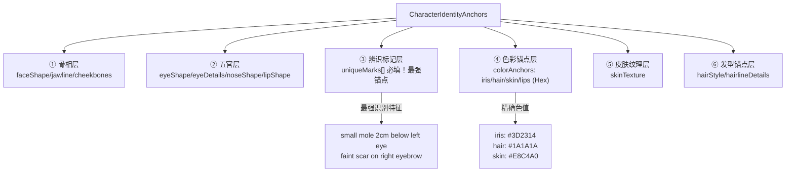
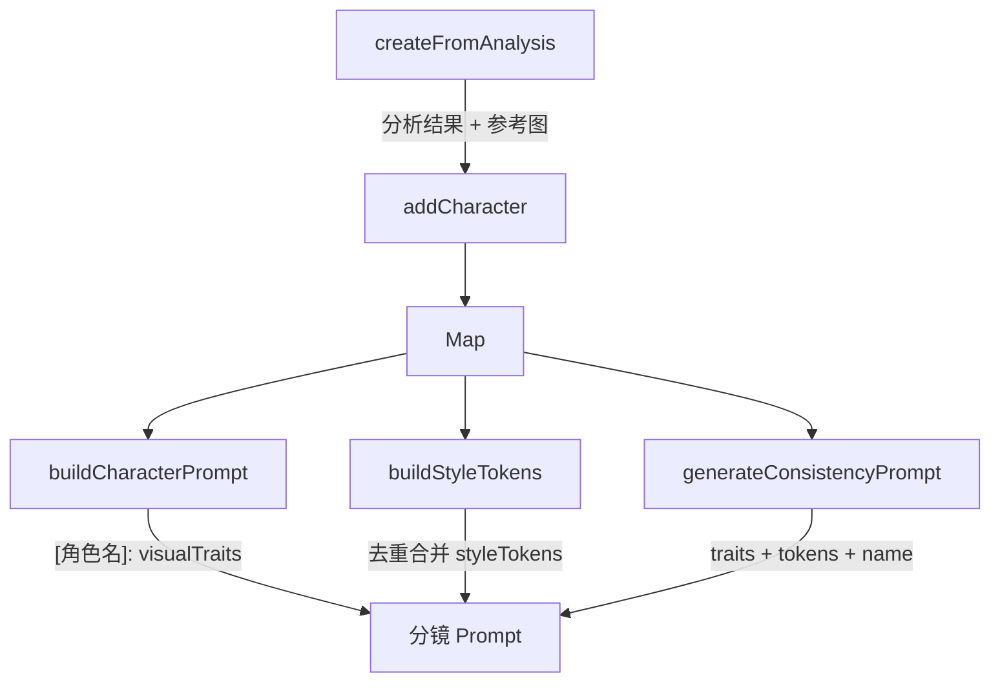
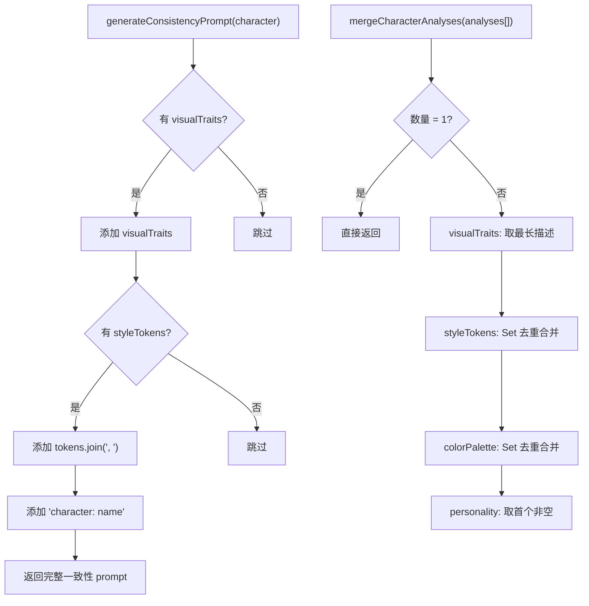

# PD-513.01 moyin-creator — 三层角色圣经与 6 层身份锚点一致性系统

> 文档编号：PD-513.01
> 来源：moyin-creator `src/packages/ai-core/services/character-bible.ts`, `src/lib/script/character-calibrator.ts`, `src/lib/character/character-prompt-service.ts`
> GitHub：https://github.com/MemeCalculate/moyin-creator.git
> 问题域：PD-513 角色一致性管理 Character Consistency Management
> 状态：可复用方案

---

## 第 1 章 问题与动机（≥ 30 行）

### 1.1 核心问题

在 AI 视频/漫画生成场景中，同一角色在不同分镜、不同集数中的视觉一致性是最大挑战。AI 图像生成模型（Midjourney、DALL-E、Stable Diffusion）每次生成都是独立的，没有"记忆"——即使用相同的文字描述，生成的角色面部、体型、服装都可能完全不同。

这个问题在长篇剧本（几十集电视剧）中尤为严重：
- 角色可能跨越多个年龄阶段（少年→青年→中年）
- 同一角色在不同场景穿不同服装
- 多个角色同时出现时需要各自保持一致
- 角色的面部特征、独特标记（疤痕、痣）必须在所有画面中保持不变

### 1.2 moyin-creator 的解法概述

moyin-creator 构建了一个三层角色一致性系统：

1. **CharacterBible 层**（`character-bible.ts:14-47`）：角色圣经数据结构，存储视觉特征、风格 token、色板、参考图，是角色的"身份证"
2. **CharacterCalibrator 层**（`character-calibrator.ts:262-655`）：AI 校准引擎，从剧本中提取角色并生成 6 层身份锚点（骨相/五官/辨识标记/色彩/皮肤纹理/发型）
3. **CharacterPromptService 层**（`character-prompt-service.ts:80-113`）：多阶段角色设计服务，根据剧情阶段生成不同形象，同时保持一致性元素不变

三层协同工作：Calibrator 从剧本提取角色并生成锚点 → Bible 存储和管理角色数据 → PromptService 在每个分镜注入一致性提示词。

### 1.3 设计思想

| 设计原则 | 具体实现 | 理由 | 替代方案 |
|----------|----------|------|----------|
| 6 层特征锁定 | `CharacterIdentityAnchors` 从骨相到发型 6 层递进描述 | 单一描述不够精确，分层后每层独立可控 | 单一 prompt 描述（不够精确） |
| 一致性元素与阶段分离 | `consistencyElements` 不变 + `stages` 可变 | 角色跨年龄段时面部不变但服装/状态变化 | 每阶段完全独立描述（丢失一致性） |
| 负面提示词排除 | `CharacterNegativePrompt.avoid[]` 排除不符合特征 | 正面描述不够，需要明确排除错误特征 | 仅靠正面描述（容易生成偏差） |
| 色彩锚点用 Hex 值 | `colorAnchors` 用 `#3D2314` 精确指定虹膜/发色/肤色 | 文字描述"深棕色"太模糊，Hex 值精确可复现 | 文字颜色描述（不精确） |
| 单例管理器 + 导入导出 | `CharacterBibleManager` 单例 + `exportAll/importAll` | 全局唯一实例保证数据一致，支持持久化 | 分散存储（数据不一致风险） |

---

## 第 2 章 源码实现分析（≥ 60 行，核心章节）

### 2.1 架构概览

moyin-creator 的角色一致性系统由三个核心模块组成，数据流从剧本解析到图像生成：

```
┌─────────────────────────────────────────────────────────────────┐
│                    角色一致性系统架构                              │
├─────────────────────────────────────────────────────────────────┤
│                                                                 │
│  ┌──────────────┐    ┌──────────────────┐    ┌───────────────┐ │
│  │ EpisodeRaw   │───→│ CharacterCalibra │───→│ CharacterBible│ │
│  │ Scripts      │    │ tor (AI校准)      │    │ Manager       │ │
│  │ (剧本数据)    │    │                  │    │ (角色圣经)     │ │
│  └──────────────┘    │ ① 出场统计        │    │               │ │
│                      │ ② AI角色分析      │    │ visualTraits  │ │
│                      │ ③ 视觉提示词生成   │    │ styleTokens   │ │
│                      │ ④ 6层身份锚点     │    │ colorPalette  │ │
│                      └──────────────────┘    │ referenceImgs │ │
│                             │                 └───────┬───────┘ │
│                             ▼                         │         │
│                    ┌──────────────────┐               │         │
│                    │ CharacterPrompt  │               │         │
│                    │ Service          │◄──────────────┘         │
│                    │                  │                          │
│                    │ ① 多阶段设计     │    ┌───────────────┐    │
│                    │ ② 集数→阶段映射  │───→│ 分镜图像生成   │    │
│                    │ ③ 一致性前缀注入  │    │ (AI Image Gen) │    │
│                    └──────────────────┘    └───────────────┘    │
│                                                                 │
│  ┌──────────────────────────────────────────────────────────┐  │
│  │ CharacterLibraryStore (Zustand 持久化)                    │  │
│  │ - characters[] with identityAnchors & negativePrompt     │  │
│  │ - variations[] (Wardrobe System: 服装/阶段变体)           │  │
│  │ - splitStorage (项目级隔离)                                │  │
│  └──────────────────────────────────────────────────────────┘  │
└─────────────────────────────────────────────────────────────────┘
```

### 2.2 核心实现

#### 2.2.1 CharacterIdentityAnchors — 6 层身份锚点类型定义



对应源码 `src/types/script.ts:31-60`：
```typescript
export interface CharacterIdentityAnchors {
  // ① 骨相层 - 面部骨骼结构
  faceShape?: string;       // oval/square/heart/round/diamond/oblong
  jawline?: string;         // sharp angular/soft rounded/prominent
  cheekbones?: string;      // high prominent/subtle/wide set
  
  // ② 五官层 - 眼鼻唇精确描述
  eyeShape?: string;        // almond/round/hooded/monolid/upturned
  eyeDetails?: string;      // double eyelids, slight epicanthic fold
  noseShape?: string;       // straight bridge, rounded tip
  lipShape?: string;        // full lips, defined cupid's bow
  
  // ③ 辨识标记层 - 最强锚点
  uniqueMarks: string[];    // 必填！精确位置："small mole 2cm below left eye"
  
  // ④ 色彩锚点层 - Hex色值
  colorAnchors?: {
    iris?: string;          // #3D2314 (dark brown)
    hair?: string;          // #1A1A1A (jet black)
    skin?: string;          // #E8C4A0 (warm beige)
    lips?: string;          // #C4727E (dusty rose)
  };
  
  // ⑤ 皮肤纹理层
  skinTexture?: string;     // visible pores, light smile lines
  
  // ⑥ 发型锚点层
  hairStyle?: string;       // shoulder-length, layered, side-parted
  hairlineDetails?: string; // natural hairline, slight widow's peak
}
```

#### 2.2.2 CharacterBibleManager — 角色圣经管理器



对应源码 `src/packages/ai-core/services/character-bible.ts:60-155`：
```typescript
export class CharacterBibleManager {
  private characters: Map<string, CharacterBible> = new Map();
  
  // 从分析结果创建角色（含参考图标记主次）
  createFromAnalysis(
    screenplayId: string,
    analysisResult: any,
    referenceImageUrl?: string
  ): CharacterBible {
    const referenceImages: ReferenceImage[] = [];
    if (referenceImageUrl) {
      referenceImages.push({
        id: `ref_${Date.now()}`,
        url: referenceImageUrl,
        analysisResult,
        isPrimary: true,  // 首张参考图标记为主参考
      });
    }
    return this.addCharacter({
      screenplayId,
      name: analysisResult.name || 'Unknown',
      type: analysisResult.type || 'other',
      visualTraits: analysisResult.visualTraits || '',
      styleTokens: analysisResult.styleTokens || [],
      colorPalette: analysisResult.colorPalette || [],
      personality: analysisResult.personality || '',
      referenceImages,
    });
  }
  
  // 为分镜构建角色提示词：[角色名]: 视觉特征
  buildCharacterPrompt(characterIds: string[]): string {
    const characters = characterIds
      .map(id => this.characters.get(id))
      .filter((c): c is CharacterBible => c !== null);
    if (characters.length === 0) return '';
    return characters
      .map(c => `[${c.name}]: ${c.visualTraits}`)
      .join('; ');
  }
}
```

#### 2.2.3 一致性提示词生成与多参考图合并



对应源码 `src/packages/ai-core/services/character-bible.ts:233-300`：
```typescript
// 生成跨分镜一致性提示词
export function generateConsistencyPrompt(character: CharacterBible): string {
  const parts: string[] = [];
  if (character.visualTraits) {
    parts.push(character.visualTraits);
  }
  if (character.styleTokens.length > 0) {
    parts.push(character.styleTokens.join(', '));
  }
  parts.push(`character: ${character.name}`);
  return parts.join(', ');
}

// 合并多参考图分析结果
export function mergeCharacterAnalyses(analyses: any[]): Partial<CharacterBible> {
  if (analyses.length === 1) {
    return {
      visualTraits: analyses[0].visualTraits,
      styleTokens: analyses[0].styleTokens || [],
      colorPalette: analyses[0].colorPalette || [],
      personality: analyses[0].personality,
    };
  }
  // 多图合并：visualTraits 取最长，tokens/palette 去重合并
  const visualTraits = analyses
    .map(a => a.visualTraits).filter(Boolean)
    .sort((a, b) => b.length - a.length)[0] || '';
  const styleTokenSet = new Set<string>();
  for (const a of analyses) {
    if (a.styleTokens) for (const t of a.styleTokens) styleTokenSet.add(t);
  }
  const colorSet = new Set<string>();
  for (const a of analyses) {
    if (a.colorPalette) for (const c of a.colorPalette) colorSet.add(c);
  }
  return {
    visualTraits,
    styleTokens: Array.from(styleTokenSet),
    colorPalette: Array.from(colorSet),
    personality: analyses.find(a => a.personality)?.personality || '',
  };
}
```

### 2.3 实现细节

#### 多阶段角色设计与一致性前缀注入

`getCharacterPromptForEpisode` 是连接角色设计与分镜生成的关键函数。它根据当前集数找到对应阶段，然后将一致性元素（面部特征、体型、独特标记）作为前缀注入到阶段提示词前面：

对应源码 `src/lib/character/character-prompt-service.ts:312-343`：
```typescript
export function getCharacterPromptForEpisode(
  design: CharacterDesign,
  episodeIndex: number
): { promptEn: string; promptZh: string; stageName: string } {
  for (const stage of design.stages) {
    const [start, end] = stage.episodeRange.split('-').map(Number);
    if (episodeIndex >= start && episodeIndex <= end) {
      // 组合一致性元素（不变）+ 阶段提示词（可变）
      const consistencyPrefix = [
        design.consistencyElements.facialFeatures,
        design.consistencyElements.bodyType,
        design.consistencyElements.uniqueMarks,
      ].filter(Boolean).join(', ');
      
      return {
        promptEn: consistencyPrefix 
          ? `${consistencyPrefix}, ${stage.visualPromptEn}`
          : stage.visualPromptEn,
        promptZh: stage.visualPromptZh,
        stageName: stage.stageName,
      };
    }
  }
  // 默认返回基础提示词
  return {
    promptEn: design.baseVisualPromptEn,
    promptZh: design.baseVisualPromptZh,
    stageName: '默认',
  };
}
```

#### AI 校准中的 6 层身份锚点生成

`enrichCharactersWithVisualPrompts`（`character-calibrator.ts:753-994`）为每个主角/重要配角逐个调用 AI 生成 6 层身份锚点。关键设计：
- 逐角色调用而非批量，避免 JSON 输出过长导致截断
- 单角色失败不影响其他角色（独立 try/catch）
- 合并时从 `identityAnchors` 提取兼容字段（`facialFeatures` 从骨相+五官层组合）
- `uniqueMarks` 数组转字符串保持向后兼容


---

## 第 3 章 迁移指南（≥ 40 行）

### 3.1 迁移清单

**阶段一：数据结构定义**
- [ ] 定义 `CharacterIdentityAnchors` 接口（6 层特征锁定）
- [ ] 定义 `CharacterNegativePrompt` 接口（排除特征）
- [ ] 定义 `CharacterBible` 接口（视觉特征 + 风格 token + 色板 + 参考图）
- [ ] 定义 `CharacterConsistencyElements` 接口（跨阶段不变元素）

**阶段二：角色圣经管理器**
- [ ] 实现 `CharacterBibleManager` 单例（CRUD + 导入导出）
- [ ] 实现 `buildCharacterPrompt` — 为分镜组合多角色提示词
- [ ] 实现 `generateConsistencyPrompt` — 生成单角色一致性提示词
- [ ] 实现 `mergeCharacterAnalyses` — 多参考图分析结果合并

**阶段三：AI 校准与锚点生成**
- [ ] 实现角色出场统计（`collectCharacterStats`）
- [ ] 实现 AI 角色校准（`calibrateCharacters`）— 可用批处理
- [ ] 实现 6 层身份锚点生成（`enrichCharactersWithVisualPrompts`）— 逐角色调用
- [ ] 实现负面提示词生成

**阶段四：多阶段设计与注入**
- [ ] 实现 `generateCharacterDesign` — AI 生成多阶段角色设计
- [ ] 实现 `getCharacterPromptForEpisode` — 集数→阶段映射 + 一致性前缀注入
- [ ] 实现 `convertDesignToVariations` — 设计转角色库变体

### 3.2 适配代码模板

以下是一个可直接复用的最小化角色一致性系统实现：

```typescript
// === 1. 类型定义 ===
interface IdentityAnchors {
  faceShape?: string;
  jawline?: string;
  eyeShape?: string;
  eyeDetails?: string;
  noseShape?: string;
  lipShape?: string;
  uniqueMarks: string[];  // 必填！最强锚点
  colorAnchors?: {
    iris?: string;   // Hex: #3D2314
    hair?: string;
    skin?: string;
    lips?: string;
  };
  skinTexture?: string;
  hairStyle?: string;
}

interface CharacterBible {
  id: string;
  name: string;
  visualTraits: string;
  styleTokens: string[];
  colorPalette: string[];
  identityAnchors?: IdentityAnchors;
  negativePrompt?: { avoid: string[]; styleExclusions?: string[] };
  referenceImages: { url: string; isPrimary: boolean }[];
  consistencyElements: {
    facialFeatures: string;
    bodyType: string;
    uniqueMarks: string;
  };
}

// === 2. 一致性提示词生成 ===
function buildConsistencyPrompt(character: CharacterBible): string {
  const parts: string[] = [];
  
  // 注入一致性元素（不变部分）
  const { facialFeatures, bodyType, uniqueMarks } = character.consistencyElements;
  if (facialFeatures) parts.push(facialFeatures);
  if (bodyType) parts.push(bodyType);
  if (uniqueMarks) parts.push(uniqueMarks);
  
  // 注入风格 token
  if (character.styleTokens.length > 0) {
    parts.push(character.styleTokens.join(', '));
  }
  
  // 注入身份锚点中的色彩信息
  if (character.identityAnchors?.colorAnchors) {
    const ca = character.identityAnchors.colorAnchors;
    if (ca.iris) parts.push(`iris color ${ca.iris}`);
    if (ca.hair) parts.push(`hair color ${ca.hair}`);
    if (ca.skin) parts.push(`skin tone ${ca.skin}`);
  }
  
  // 角色标识
  parts.push(`character: ${character.name}`);
  return parts.join(', ');
}

// === 3. 多参考图合并 ===
function mergeAnalyses(analyses: Partial<CharacterBible>[]): Partial<CharacterBible> {
  if (analyses.length <= 1) return analyses[0] || {};
  
  // visualTraits: 取最详细的（最长）
  const visualTraits = analyses
    .map(a => a.visualTraits).filter(Boolean)
    .sort((a, b) => (b?.length || 0) - (a?.length || 0))[0] || '';
  
  // styleTokens & colorPalette: Set 去重合并
  const tokens = new Set<string>();
  const colors = new Set<string>();
  for (const a of analyses) {
    a.styleTokens?.forEach(t => tokens.add(t));
    a.colorPalette?.forEach(c => colors.add(c));
  }
  
  return { visualTraits, styleTokens: [...tokens], colorPalette: [...colors] };
}
```

### 3.3 适用场景

| 场景 | 适用度 | 说明 |
|------|--------|------|
| AI 视频/漫画生成（多分镜） | ⭐⭐⭐ | 核心场景，角色跨分镜一致性 |
| AI 绘本/故事书生成 | ⭐⭐⭐ | 同一角色在不同页面保持一致 |
| 游戏角色设计系统 | ⭐⭐ | 可复用 6 层锚点结构，但游戏有 3D 模型更精确 |
| 单张图像生成 | ⭐ | 不需要跨图一致性，6 层锚点过重 |
| 文本角色管理（无图像） | ⭐ | 数据结构可复用，但锚点/色板无意义 |

---

## 第 4 章 测试用例（≥ 20 行）

```typescript
import { describe, it, expect, beforeEach } from 'vitest';

// 模拟类型
interface CharacterBible {
  id: string; name: string; visualTraits: string;
  styleTokens: string[]; colorPalette: string[];
  personality: string; referenceImages: { url: string; isPrimary: boolean }[];
}

interface CharacterDesign {
  consistencyElements: { facialFeatures: string; bodyType: string; uniqueMarks: string };
  stages: { episodeRange: string; visualPromptEn: string; visualPromptZh: string; stageName: string }[];
  baseVisualPromptEn: string; baseVisualPromptZh: string;
}

// 被测函数
function generateConsistencyPrompt(character: CharacterBible): string {
  const parts: string[] = [];
  if (character.visualTraits) parts.push(character.visualTraits);
  if (character.styleTokens.length > 0) parts.push(character.styleTokens.join(', '));
  parts.push(`character: ${character.name}`);
  return parts.join(', ');
}

function mergeCharacterAnalyses(analyses: Partial<CharacterBible>[]): Partial<CharacterBible> {
  if (analyses.length === 0) return {};
  if (analyses.length === 1) return analyses[0];
  const visualTraits = analyses.map(a => a.visualTraits).filter(Boolean)
    .sort((a, b) => (b?.length || 0) - (a?.length || 0))[0] || '';
  const tokenSet = new Set<string>();
  for (const a of analyses) a.styleTokens?.forEach(t => tokenSet.add(t));
  const colorSet = new Set<string>();
  for (const a of analyses) a.colorPalette?.forEach(c => colorSet.add(c));
  return { visualTraits, styleTokens: [...tokenSet], colorPalette: [...colorSet] };
}

function getCharacterPromptForEpisode(design: CharacterDesign, episodeIndex: number) {
  for (const stage of design.stages) {
    const [start, end] = stage.episodeRange.split('-').map(Number);
    if (episodeIndex >= start && episodeIndex <= end) {
      const prefix = [design.consistencyElements.facialFeatures,
        design.consistencyElements.bodyType, design.consistencyElements.uniqueMarks]
        .filter(Boolean).join(', ');
      return {
        promptEn: prefix ? `${prefix}, ${stage.visualPromptEn}` : stage.visualPromptEn,
        promptZh: stage.visualPromptZh, stageName: stage.stageName,
      };
    }
  }
  return { promptEn: design.baseVisualPromptEn, promptZh: design.baseVisualPromptZh, stageName: '默认' };
}

describe('CharacterConsistency', () => {
  describe('generateConsistencyPrompt', () => {
    it('should combine visualTraits + styleTokens + name', () => {
      const char: CharacterBible = {
        id: '1', name: '张明',
        visualTraits: 'young Chinese man, sharp jawline',
        styleTokens: ['realistic', 'cinematic lighting'],
        colorPalette: [], personality: '', referenceImages: [],
      };
      const result = generateConsistencyPrompt(char);
      expect(result).toBe('young Chinese man, sharp jawline, realistic, cinematic lighting, character: 张明');
    });

    it('should handle empty styleTokens', () => {
      const char: CharacterBible = {
        id: '2', name: '李强', visualTraits: 'middle-aged man',
        styleTokens: [], colorPalette: [], personality: '', referenceImages: [],
      };
      const result = generateConsistencyPrompt(char);
      expect(result).toBe('middle-aged man, character: 李强');
    });
  });

  describe('mergeCharacterAnalyses', () => {
    it('should return empty for no analyses', () => {
      expect(mergeCharacterAnalyses([])).toEqual({});
    });

    it('should merge multiple analyses with dedup', () => {
      const result = mergeCharacterAnalyses([
        { visualTraits: 'short', styleTokens: ['a', 'b'], colorPalette: ['#fff'] },
        { visualTraits: 'a much longer description here', styleTokens: ['b', 'c'], colorPalette: ['#fff', '#000'] },
      ]);
      expect(result.visualTraits).toBe('a much longer description here');
      expect(result.styleTokens).toEqual(expect.arrayContaining(['a', 'b', 'c']));
      expect(result.colorPalette).toEqual(expect.arrayContaining(['#fff', '#000']));
    });
  });

  describe('getCharacterPromptForEpisode', () => {
    const design: CharacterDesign = {
      consistencyElements: {
        facialFeatures: 'almond eyes, sharp jawline',
        bodyType: 'tall athletic build',
        uniqueMarks: 'small mole below left eye',
      },
      stages: [
        { episodeRange: '1-10', visualPromptEn: 'young student in uniform', visualPromptZh: '穿校服的年轻学生', stageName: '学生时期' },
        { episodeRange: '11-30', visualPromptEn: 'businessman in suit', visualPromptZh: '穿西装的商人', stageName: '创业时期' },
      ],
      baseVisualPromptEn: 'default prompt', baseVisualPromptZh: '默认提示词',
    };

    it('should return stage prompt with consistency prefix for episode in range', () => {
      const result = getCharacterPromptForEpisode(design, 5);
      expect(result.stageName).toBe('学生时期');
      expect(result.promptEn).toContain('almond eyes, sharp jawline');
      expect(result.promptEn).toContain('small mole below left eye');
      expect(result.promptEn).toContain('young student in uniform');
    });

    it('should return base prompt for episode outside all ranges', () => {
      const result = getCharacterPromptForEpisode(design, 50);
      expect(result.stageName).toBe('默认');
      expect(result.promptEn).toBe('default prompt');
    });
  });
});
```


---

## 第 5 章 跨域关联

| 关联域 | 关系类型 | 说明 |
|--------|----------|------|
| PD-04 工具系统 | 协同 | 角色校准通过 `callFeatureAPI` 调用 AI，依赖功能级模型路由（`feature-router.ts`） |
| PD-07 质量检查 | 协同 | 6 层身份锚点可作为角色一致性的质量检查维度，校准结果可用于 QA |
| PD-10 中间件管道 | 协同 | 角色一致性提示词注入可作为图像生成管道的中间件环节 |
| PD-01 上下文管理 | 依赖 | 角色校准需要剧本上下文（出场统计、对白样本），受上下文窗口限制（`safeTruncate` 截断） |
| PD-06 记忆持久化 | 依赖 | `CharacterLibraryStore` 使用 Zustand persist + splitStorage 实现项目级角色数据持久化 |
| PD-03 容错与重试 | 协同 | 视觉提示词生成失败不影响校准结果（独立 try/catch），单角色失败不影响其他角色 |

---

## 第 6 章 来源文件索引

| 文件 | 行范围 | 关键实现 |
|------|--------|----------|
| `src/types/script.ts` | L31-L60 | `CharacterIdentityAnchors` 6 层身份锚点类型定义 |
| `src/types/script.ts` | L66-L69 | `CharacterNegativePrompt` 负面提示词类型 |
| `src/types/script.ts` | L71-L99 | `ScriptCharacter` 含 identityAnchors/negativePrompt 字段 |
| `src/packages/ai-core/services/character-bible.ts` | L14-L47 | `CharacterBible` 接口（视觉特征/风格token/色板/参考图） |
| `src/packages/ai-core/services/character-bible.ts` | L60-L211 | `CharacterBibleManager` 单例管理器（CRUD/导入导出） |
| `src/packages/ai-core/services/character-bible.ts` | L233-L250 | `generateConsistencyPrompt` 一致性提示词生成 |
| `src/packages/ai-core/services/character-bible.ts` | L256-L300 | `mergeCharacterAnalyses` 多参考图分析合并 |
| `src/lib/script/character-calibrator.ts` | L24-L80 | `CalibratedCharacter` 含 6 层锚点字段 |
| `src/lib/script/character-calibrator.ts` | L262-L655 | `calibrateCharacters` AI 校准主流程（4 步） |
| `src/lib/script/character-calibrator.ts` | L753-L994 | `enrichCharactersWithVisualPrompts` 逐角色生成锚点 |
| `src/lib/character/character-prompt-service.ts` | L28-L61 | `CharacterDesign` 含 consistencyElements + stages |
| `src/lib/character/character-prompt-service.ts` | L80-L113 | `generateCharacterDesign` AI 多阶段角色设计 |
| `src/lib/character/character-prompt-service.ts` | L312-L343 | `getCharacterPromptForEpisode` 集数→阶段映射+一致性注入 |
| `src/lib/character/character-prompt-service.ts` | L352-L366 | `convertDesignToVariations` 设计转角色库变体 |
| `src/stores/character-library-store.ts` | L59-L94 | `Character` 含 identityAnchors/negativePrompt/variations |
| `src/components/panels/characters/generation-panel.tsx` | L118-L122 | UI 状态管理 identityAnchors/negativePrompt |

---

## 第 7 章 横向对比维度

> **重要：** 本章用于自动填充 Butcher Wiki 的横向对比表。

```json comparison_data
{
  "project": "moyin-creator",
  "dimensions": {
    "角色数据结构": "CharacterBible 三维描述（visualTraits + styleTokens + colorPalette）+ 6 层 IdentityAnchors",
    "一致性策略": "consistencyElements 不变前缀 + 阶段 prompt 可变后缀，自动注入每个分镜",
    "锚点精度": "6 层递进锁定：骨相→五官→辨识标记→Hex色值→皮肤纹理→发型",
    "多参考图处理": "mergeCharacterAnalyses: visualTraits 取最长，tokens/palette Set 去重合并",
    "负面约束": "CharacterNegativePrompt: avoid[] 排除特征 + styleExclusions[] 排除风格",
    "多阶段支持": "CharacterDesign.stages[] 按集数范围映射，getCharacterPromptForEpisode 自动选择阶段",
    "持久化方式": "Zustand persist + splitStorage 项目级隔离 + CharacterBibleManager 单例导入导出"
  }
}
```

### 域元数据补充

```json domain_metadata
{
  "solution_summary": "moyin-creator 通过 CharacterBibleManager 三维描述（视觉特征/风格token/色板）+ CharacterIdentityAnchors 6层递进锁定（骨相→五官→辨识标记→Hex色值→皮肤纹理→发型），实现跨分镜角色一致性",
  "description": "AI生图场景下通过结构化特征锁定与负面约束实现角色视觉一致性",
  "sub_problems": [
    "年代感知服装设计（根据故事年份自动匹配时代服装风格）",
    "角色校准降级策略（AI失败时基于出场统计的兜底方案）",
    "逐角色独立生成与批量失败隔离"
  ],
  "best_practices": [
    "色彩锚点用Hex值而非文字描述确保精确可复现",
    "负面提示词排除不符合角色设定的生成结果",
    "逐角色调用AI避免批量JSON截断",
    "校准结果与视觉增强独立try/catch互不影响"
  ]
}
```

