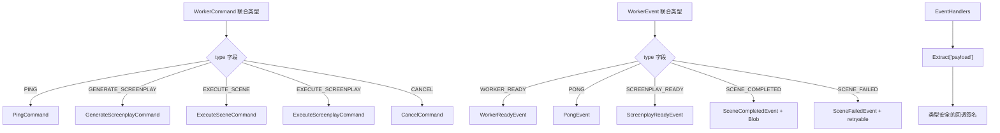
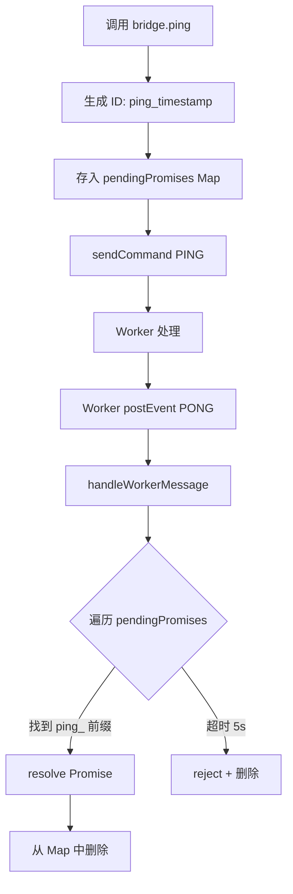
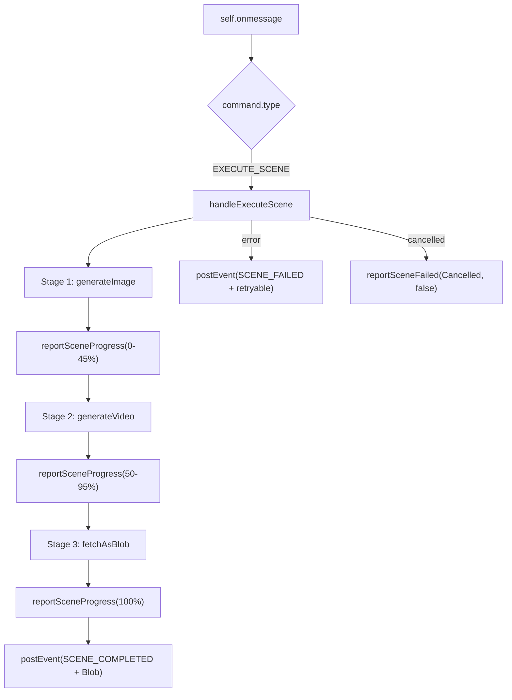

# PD-514.01 moyin-creator — AIWorkerBridge 单例桥接与类型安全命令-事件协议

> 文档编号：PD-514.01
> 来源：moyin-creator `src/lib/ai/worker-bridge.ts` `src/workers/ai-worker.ts` `src/packages/ai-core/protocol/index.ts`
> GitHub：https://github.com/MemeCalculate/moyin-creator.git
> 问题域：PD-514 Web Worker 通信桥 Web Worker Communication Bridge
> 状态：可复用方案

---

## 第 1 章 问题与动机

### 1.1 核心问题

在浏览器端 AI 应用中，AI 推理和媒体生成（图片/视频）是 CPU/网络密集型任务。如果在主线程执行，会导致 UI 冻结、交互卡顿。Web Worker 提供了将这些任务卸载到后台线程的能力，但引入了新的工程挑战：

1. **跨线程通信的类型安全** — `postMessage` 是无类型的，命令和事件容易出错
2. **请求-响应映射** — Worker 通信是异步的，需要将发出的命令与返回的事件正确配对
3. **多阶段任务进度追踪** — 一个场景生成包含 image → video → download 三个阶段，需要细粒度进度上报
4. **跨线程数据注入** — Worker 生成的媒体 Blob 需要注入到主线程的 Zustand store 中
5. **生命周期管理** — Worker 的初始化、就绪检测、终止需要可靠的协议

### 1.2 moyin-creator 的解法概述

moyin-creator 构建了一个三层 Worker 通信架构：

1. **协议层**（`protocol/index.ts:16-194`）— 用 TypeScript 联合类型定义 9 种 Command 和 9 种 Event，通过 `Extract` 工具类型实现类型安全的事件处理器映射
2. **桥接层**（`worker-bridge.ts:27-424`）— `AIWorkerBridge` 单例类封装 Worker 实例，提供 Promise 化的命令接口、`pendingPromises` Map 管理请求-响应映射、动态 import 避免循环依赖
3. **执行层**（`ai-worker.ts:84-1206`）— Worker 内部的命令路由 switch、三阶段场景执行（image→video→blob）、批量并发控制、取消信号传播

### 1.3 设计思想

| 设计原则 | 具体实现 | 理由 | 替代方案 |
|----------|----------|------|----------|
| 类型安全协议 | `WorkerCommand` / `WorkerEvent` 联合类型 + `Extract` 映射 | 编译期捕获消息类型错误，避免运行时 `type` 字符串拼写错误 | 手动 `switch` + `any` 类型（不安全） |
| 单例桥接 | `getWorkerBridge()` 懒初始化单例 | 全局唯一 Worker 实例，避免重复创建和资源浪费 | 每个组件各自创建 Worker（资源浪费） |
| Promise 化命令 | `pendingPromises` Map + 前缀 ID 匹配 | 将 postMessage 的 fire-and-forget 模式转为 async/await | 回调地狱或全局事件总线 |
| 动态 import 注入 | `handleSceneCompleted` 中 `await import('@/stores/...')` | 避免 Worker Bridge → Store → Worker Bridge 循环依赖 | 构造函数注入（增加耦合） |
| 两阶段生成流 | `EXECUTE_SCREENPLAY_IMAGES` + `EXECUTE_SCREENPLAY_VIDEOS` 分离 | 用户可在图片阶段审核后再决定是否生成视频，节省成本 | 一次性全量生成（无法中间审核） |

---

## 第 2 章 源码实现分析

### 2.1 架构概览

moyin-creator 的 Worker 通信架构分为三层，主线程和 Worker 线程通过类型化的消息协议通信：

```
┌─────────────────────────────────────────────────────────────┐
│                      Main Thread                             │
│                                                              │
│  ┌──────────────┐    ┌──────────────────┐    ┌────────────┐ │
│  │ React 组件    │───→│ AIWorkerBridge   │───→│ Zustand    │ │
│  │ (UI 层)      │    │ (单例桥接层)      │    │ Stores     │ │
│  │              │←───│ pendingPromises   │←───│ director   │ │
│  │              │    │ eventHandlers     │    │ media      │ │
│  └──────────────┘    └────────┬─────────┘    │ project    │ │
│                               │ postMessage   └────────────┘ │
├───────────────────────────────┼──────────────────────────────┤
│                               │ MessagePort                  │
├───────────────────────────────┼──────────────────────────────┤
│                      Worker Thread                           │
│                               ▼                              │
│                    ┌──────────────────┐                      │
│                    │   ai-worker.ts   │                      │
│                    │ ┌──────────────┐ │                      │
│                    │ │ onmessage    │ │                      │
│                    │ │ switch路由    │ │                      │
│                    │ └──────┬───────┘ │                      │
│                    │        ▼         │                      │
│                    │ ┌──────────────┐ │    ┌──────────────┐  │
│                    │ │ Handler 函数  │─┼───→│ API Server   │  │
│                    │ │ (fetch API)  │ │    │ /api/ai/*    │  │
│                    │ └──────┬───────┘ │    └──────────────┘  │
│                    │        ▼         │                      │
│                    │ postEvent(event) │                      │
│                    └──────────────────┘                      │
└─────────────────────────────────────────────────────────────┘
```

### 2.2 核心实现

#### 2.2.1 类型安全的消息协议



对应源码 `src/packages/ai-core/protocol/index.ts:16-194`：

```typescript
// 命令联合类型：主线程 → Worker（9 种命令）
export type WorkerCommand =
  | PingCommand
  | GenerateScreenplayCommand
  | ExecuteScreenplayCommand
  | ExecuteSceneCommand
  | RetrySceneCommand
  | CancelCommand
  | UpdateConfigCommand;

// 事件联合类型：Worker → 主线程（9 种事件）
export type WorkerEvent =
  | PongEvent
  | ScreenplayReadyEvent
  | ScreenplayErrorEvent
  | SceneProgressEvent
  | SceneCompletedEvent
  | SceneFailedEvent
  | AllScenesCompletedEvent
  | WorkerErrorEvent
  | WorkerReadyEvent;

// 类型安全的事件处理器映射
export type EventHandlers = {
  [K in EventType]?: (
    payload: Extract<WorkerEvent, { type: K }>['payload']
  ) => void;
};
```

关键设计：`Extract<WorkerEvent, { type: K }>['payload']` 利用 TypeScript 条件类型，自动从联合类型中提取对应事件的 payload 类型。注册 `SCENE_COMPLETED` 处理器时，回调参数自动推导为 `{ screenplayId: string; sceneId: number; mediaBlob: Blob; metadata: {...} }`。

#### 2.2.2 Bridge 的 pendingPromises 请求-响应映射



对应源码 `src/lib/ai/worker-bridge.ts:95-117`：

```typescript
async ping(): Promise<number> {
  const timestamp = Date.now();
  return new Promise((resolve, reject) => {
    const id = `ping_${timestamp}`;
    this.pendingPromises.set(id, {
      resolve: (payload: unknown) => {
        const p = payload as { workerTimestamp: number };
        resolve(p.workerTimestamp - timestamp);
      },
      reject,
    });

    this.sendCommand({ type: 'PING', payload: { timestamp } });

    // Timeout after 5 seconds
    setTimeout(() => {
      if (this.pendingPromises.has(id)) {
        this.pendingPromises.delete(id);
        reject(new Error('Ping timeout'));
      }
    }, 5000);
  });
}
```

响应端匹配逻辑 `worker-bridge.ts:244-253`：

```typescript
case 'PONG':
  // Resolve the oldest pending ping
  for (const [id, callbacks] of this.pendingPromises) {
    if (id.startsWith('ping_')) {
      callbacks.resolve(event.payload);
      this.pendingPromises.delete(id);
      break;
    }
  }
  break;
```

这里使用前缀匹配（`ping_`、`screenplay_`）而非精确 ID 匹配，因为 Worker 端不回传请求 ID。这意味着同类型的并发请求会按 FIFO 顺序匹配——对于 ping 和 screenplay 这种不会并发的操作是安全的。

#### 2.2.3 Worker 端命令路由与三阶段场景执行



对应源码 `src/workers/ai-worker.ts:407-510`（handleExecuteScene 核心流程）：

```typescript
async function handleExecuteScene(command: ExecuteSceneCommand): Promise<void> {
  const { screenplayId, scene, config, characterBible, characterReferenceImages } = command.payload;
  
  if (cancelled) {
    reportSceneFailed(screenplayId, scene.sceneId, 'Cancelled', false);
    return;
  }
  
  reportSceneProgress(screenplayId, scene.sceneId, 'generating', 'image', 0);
  
  try {
    // Stage 1: Image Generation (0-45%)
    const imageUrl = await generateImage(imagePrompt, negativePrompt, config,
      (progress) => {
        const mappedProgress = Math.floor(progress * 0.45);
        reportSceneProgress(screenplayId, scene.sceneId, 'generating', 'image', mappedProgress);
      },
      refImages
    );
    
    // Stage 2: Video Generation (50-95%)
    const videoUrl = await generateVideo(imageUrl, videoPrompt, config,
      (progress) => {
        const mappedProgress = 50 + Math.floor(progress * 0.45);
        reportSceneProgress(screenplayId, scene.sceneId, 'generating', 'video', mappedProgress);
      },
      refImages
    );
    
    // Stage 3: Download Blob (95-100%)
    const videoBlob = await fetchAsBlob(videoUrl);
    
    postEvent({
      type: 'SCENE_COMPLETED',
      payload: { screenplayId, sceneId: scene.sceneId, mediaBlob: videoBlob, metadata: {...} },
    });
  } catch (error) {
    reportSceneFailed(screenplayId, scene.sceneId, err.message, !isCancelled);
  }
}
```

### 2.3 实现细节

#### 动态 import 避免循环依赖

`worker-bridge.ts:332-388` 中的 `handleSceneCompleted` 使用动态 import 注入 store：

```typescript
private async handleSceneCompleted(payload: SceneCompletedEvent['payload']): Promise<void> {
  const { screenplayId, sceneId, mediaBlob, metadata } = payload;
  
  // 动态 import 避免 worker-bridge → store → worker-bridge 循环
  const { useMediaStore } = await import('@/stores/media-store');
  const { useProjectStore } = await import('@/stores/project-store');
  const { useDirectorStore } = await import('@/stores/director-store');
  
  // 1. Blob → File
  const file = new File([mediaBlob], `ai-scene-${sceneId}.mp4`, { type: metadata.mimeType });
  
  // 2. 注入 media store（AI视频分类文件夹）
  const videoFolderId = useMediaStore.getState().getOrCreateCategoryFolder('ai-video');
  const mediaFile = await useMediaStore.getState().addMediaFile(projectId, { ... });
  
  // 3. 更新 director store
  directorStore.onSceneCompleted(sceneId, mediaFile.id);
}
```

#### 批量并发控制

`ai-worker.ts:596-622` 中 `handleExecuteScreenplay` 使用 `concurrency` 参数控制批量场景的并行度：

```typescript
for (let i = 0; i < scenes.length; i += concurrency) {
  if (cancelled) break;
  const batch = scenes.slice(i, i + concurrency);
  await Promise.allSettled(
    batch.map(async (scene) => {
      await executeSceneInternal(screenplay.id, scene, extendedConfig, ...);
    })
  );
}
```

使用 `Promise.allSettled` 而非 `Promise.all`，确保单个场景失败不会中断整个批次。

#### Worker 就绪协议

Worker 初始化时立即发送 `WORKER_READY` 事件（`ai-worker.ts:1201-1204`），Bridge 通过 `readyPromise` 等待（`worker-bridge.ts:36-38, 60`）：

```
Worker 创建 → postEvent(WORKER_READY) → Bridge.readyResolve() → initialize() 返回
```

---

## 第 3 章 迁移指南

### 3.1 迁移清单

**阶段 1：协议定义（1 个文件）**
- [ ] 定义 `WorkerCommand` 联合类型（根据业务命令扩展）
- [ ] 定义 `WorkerEvent` 联合类型（根据业务事件扩展）
- [ ] 定义 `EventHandlers` 类型映射（使用 `Extract` 工具类型）

**阶段 2：Worker 实现（1 个文件）**
- [ ] 实现 `self.onmessage` 命令路由 switch
- [ ] 实现各命令处理函数
- [ ] 添加 `WORKER_READY` 初始化信号
- [ ] 添加进度上报函数 `reportProgress`
- [ ] 添加取消信号检查

**阶段 3：Bridge 实现（1 个文件）**
- [ ] 实现 `WorkerBridge` 类（单例模式）
- [ ] 实现 `pendingPromises` Map 管理请求-响应映射
- [ ] 实现 `readyPromise` 等待 Worker 初始化
- [ ] 实现事件分发到注册的 handlers
- [ ] 实现 `handleWorkerError` 批量 reject 所有 pending promises

**阶段 4：Store 集成**
- [ ] 在 Bridge 的事件处理中动态 import store（避免循环依赖）
- [ ] 实现 Blob → File → Store 注入链路

### 3.2 适配代码模板

以下是一个通用的 Worker Bridge 模板，可直接复用：

```typescript
// ========== protocol.ts ==========
export type WorkerCommand =
  | { type: 'PING'; payload: { timestamp: number } }
  | { type: 'PROCESS'; payload: { taskId: string; data: unknown } }
  | { type: 'CANCEL'; payload?: { taskId?: string } };

export type WorkerEvent =
  | { type: 'WORKER_READY'; payload: { version: string } }
  | { type: 'PONG'; payload: { timestamp: number; workerTimestamp: number } }
  | { type: 'PROGRESS'; payload: { taskId: string; progress: number; stage: string } }
  | { type: 'COMPLETED'; payload: { taskId: string; result: unknown } }
  | { type: 'FAILED'; payload: { taskId: string; error: string; retryable: boolean } }
  | { type: 'WORKER_ERROR'; payload: { message: string; stack?: string } };

export type EventType = WorkerEvent['type'];
export type EventHandlers = {
  [K in EventType]?: (payload: Extract<WorkerEvent, { type: K }>['payload']) => void;
};

// ========== worker-bridge.ts ==========
type PromiseCallbacks = {
  resolve: (value: unknown) => void;
  reject: (error: Error) => void;
};

export class WorkerBridge {
  private worker: Worker | null = null;
  private eventHandlers: Partial<EventHandlers> = {};
  private pendingPromises: Map<string, PromiseCallbacks> = new Map();
  private readyPromise: Promise<void>;
  private readyResolve: (() => void) | null = null;

  constructor() {
    this.readyPromise = new Promise((resolve) => { this.readyResolve = resolve; });
  }

  async initialize(workerUrl: URL): Promise<void> {
    if (this.worker) return;
    this.worker = new Worker(workerUrl);
    this.worker.onmessage = this.handleMessage.bind(this);
    this.worker.onerror = this.handleError.bind(this);
    await this.readyPromise;
  }

  terminate(): void {
    this.worker?.terminate();
    this.worker = null;
  }

  on<K extends keyof EventHandlers>(type: K, handler: EventHandlers[K]): void {
    this.eventHandlers[type] = handler;
  }

  off(type: keyof EventHandlers): void {
    delete this.eventHandlers[type];
  }

  /** 发送命令并等待对应响应 */
  sendAndWait<T>(command: WorkerCommand, prefix: string, timeoutMs = 30000): Promise<T> {
    return new Promise((resolve, reject) => {
      const id = `${prefix}_${Date.now()}`;
      this.pendingPromises.set(id, {
        resolve: resolve as (v: unknown) => void,
        reject,
      });
      this.send(command);
      setTimeout(() => {
        if (this.pendingPromises.has(id)) {
          this.pendingPromises.delete(id);
          reject(new Error(`${prefix} timeout after ${timeoutMs}ms`));
        }
      }, timeoutMs);
    });
  }

  send(command: WorkerCommand): void {
    if (!this.worker) throw new Error('Worker not initialized');
    this.worker.postMessage(command);
  }

  private handleMessage(e: MessageEvent<WorkerEvent>): void {
    const event = e.data;
    if (event.type === 'WORKER_READY') {
      this.readyResolve?.();
      return;
    }
    // 分发到注册的 handler
    (this.eventHandlers as Record<string, Function>)[event.type]?.(event.payload);
    // 匹配 pending promises（按前缀）
    this.resolvePending(event);
  }

  private handleError(error: ErrorEvent): void {
    for (const [, cb] of this.pendingPromises) {
      cb.reject(new Error(`Worker error: ${error.message}`));
    }
    this.pendingPromises.clear();
  }

  private resolvePending(event: WorkerEvent): void {
    // 子类可覆盖此方法实现自定义匹配逻辑
  }
}

// 单例
let instance: WorkerBridge | null = null;
export function getWorkerBridge(): WorkerBridge {
  if (!instance) instance = new WorkerBridge();
  return instance;
}
```

### 3.3 适用场景

| 场景 | 适用度 | 说明 |
|------|--------|------|
| AI 推理/生成任务卸载 | ⭐⭐⭐ | 核心场景，避免主线程阻塞 |
| 图片/视频处理管线 | ⭐⭐⭐ | 多阶段进度追踪 + Blob 传输 |
| 大文件解析（PDF/CSV） | ⭐⭐ | 适合，但可能需要 Transferable 优化 |
| 实时数据流处理 | ⭐⭐ | 需要扩展为 streaming 模式 |
| 简单计算任务 | ⭐ | 过度设计，直接用 requestIdleCallback 即可 |

---

## 第 4 章 测试用例

```typescript
import { describe, it, expect, vi, beforeEach, afterEach } from 'vitest';

// Mock Worker
class MockWorker {
  onmessage: ((e: MessageEvent) => void) | null = null;
  onerror: ((e: ErrorEvent) => void) | null = null;
  private messageHandler: ((data: any) => void) | null = null;

  postMessage(data: any): void {
    this.messageHandler?.(data);
  }

  // 模拟 Worker 发送事件到主线程
  simulateEvent(event: any): void {
    this.onmessage?.({ data: event } as MessageEvent);
  }

  terminate(): void {}

  onCommand(handler: (data: any) => void): void {
    this.messageHandler = handler;
  }
}

describe('AIWorkerBridge', () => {
  let bridge: any;
  let mockWorker: MockWorker;

  beforeEach(() => {
    mockWorker = new MockWorker();
    // 注入 mock worker
    vi.stubGlobal('Worker', vi.fn(() => mockWorker));
  });

  afterEach(() => {
    vi.restoreAllMocks();
  });

  describe('初始化与就绪', () => {
    it('should wait for WORKER_READY before resolving initialize()', async () => {
      const { AIWorkerBridge } = await import('./worker-bridge');
      bridge = new AIWorkerBridge();

      let initialized = false;
      const initPromise = bridge.initialize().then(() => { initialized = true; });

      // 尚未就绪
      expect(initialized).toBe(false);

      // 模拟 Worker 发送 READY
      mockWorker.simulateEvent({ type: 'WORKER_READY', payload: { version: '0.3.1' } });

      await initPromise;
      expect(initialized).toBe(true);
    });

    it('should not create duplicate workers on repeated initialize()', async () => {
      const { AIWorkerBridge } = await import('./worker-bridge');
      bridge = new AIWorkerBridge();

      const p = bridge.initialize();
      mockWorker.simulateEvent({ type: 'WORKER_READY', payload: { version: '0.3.1' } });
      await p;

      // 第二次调用应直接返回
      await bridge.initialize();
      expect(Worker).toHaveBeenCalledTimes(1);
    });
  });

  describe('Ping 请求-响应', () => {
    it('should resolve ping with latency', async () => {
      const { AIWorkerBridge } = await import('./worker-bridge');
      bridge = new AIWorkerBridge();
      const p = bridge.initialize();
      mockWorker.simulateEvent({ type: 'WORKER_READY', payload: { version: '0.3.1' } });
      await p;

      // 拦截命令并模拟响应
      mockWorker.onCommand((cmd) => {
        if (cmd.type === 'PING') {
          mockWorker.simulateEvent({
            type: 'PONG',
            payload: { timestamp: cmd.payload.timestamp, workerTimestamp: cmd.payload.timestamp + 5 },
          });
        }
      });

      const latency = await bridge.ping();
      expect(latency).toBe(5);
    });

    it('should reject ping on timeout', async () => {
      vi.useFakeTimers();
      const { AIWorkerBridge } = await import('./worker-bridge');
      bridge = new AIWorkerBridge();
      const p = bridge.initialize();
      mockWorker.simulateEvent({ type: 'WORKER_READY', payload: { version: '0.3.1' } });
      await p;

      const pingPromise = bridge.ping();
      vi.advanceTimersByTime(5001);

      await expect(pingPromise).rejects.toThrow('Ping timeout');
      vi.useRealTimers();
    });
  });

  describe('Worker 错误处理', () => {
    it('should reject all pending promises on worker error', async () => {
      const { AIWorkerBridge } = await import('./worker-bridge');
      bridge = new AIWorkerBridge();
      const p = bridge.initialize();
      mockWorker.simulateEvent({ type: 'WORKER_READY', payload: { version: '0.3.1' } });
      await p;

      // 创建一个 pending promise
      const pingPromise = bridge.ping();

      // 模拟 Worker 错误
      mockWorker.onerror?.({ message: 'Script error' } as ErrorEvent);

      await expect(pingPromise).rejects.toThrow('Worker error');
    });
  });

  describe('事件处理器注册', () => {
    it('should call registered handler on matching event', async () => {
      const { AIWorkerBridge } = await import('./worker-bridge');
      bridge = new AIWorkerBridge();
      const p = bridge.initialize();
      mockWorker.simulateEvent({ type: 'WORKER_READY', payload: { version: '0.3.1' } });
      await p;

      const handler = vi.fn();
      bridge.on('SCENE_PROGRESS', handler);

      const progressPayload = {
        screenplayId: 'sp-1',
        sceneId: 1,
        progress: { sceneId: 1, status: 'generating', stage: 'image', progress: 45 },
      };
      mockWorker.simulateEvent({ type: 'SCENE_PROGRESS', payload: progressPayload });

      expect(handler).toHaveBeenCalledWith(progressPayload);
    });

    it('should not call handler after off()', async () => {
      const { AIWorkerBridge } = await import('./worker-bridge');
      bridge = new AIWorkerBridge();
      const p = bridge.initialize();
      mockWorker.simulateEvent({ type: 'WORKER_READY', payload: { version: '0.3.1' } });
      await p;

      const handler = vi.fn();
      bridge.on('SCENE_PROGRESS', handler);
      bridge.off('SCENE_PROGRESS');

      mockWorker.simulateEvent({ type: 'SCENE_PROGRESS', payload: {} });
      expect(handler).not.toHaveBeenCalled();
    });
  });

  describe('取消操作', () => {
    it('should send CANCEL command to worker', async () => {
      const { AIWorkerBridge } = await import('./worker-bridge');
      bridge = new AIWorkerBridge();
      const p = bridge.initialize();
      mockWorker.simulateEvent({ type: 'WORKER_READY', payload: { version: '0.3.1' } });
      await p;

      const sentCommands: any[] = [];
      mockWorker.onCommand((cmd) => sentCommands.push(cmd));

      bridge.cancel('sp-1', 2);
      expect(sentCommands).toContainEqual({
        type: 'CANCEL',
        payload: { screenplayId: 'sp-1', sceneId: 2 },
      });
    });
  });
});
```

---

## 第 5 章 跨域关联

| 关联域 | 关系类型 | 说明 |
|--------|----------|------|
| PD-477 Web Worker 卸载 | 协同 | PD-477 关注 Worker 的创建/销毁和双阶段媒体生成卸载策略，PD-514 关注通信协议和消息路由的具体实现 |
| PD-483 异步任务轮询 | 依赖 | Worker 内部的 `pollTaskCompletion` 使用轮询模式等待 API 异步任务完成，是 PD-483 的具体应用 |
| PD-478 项目级状态隔离 | 协同 | Bridge 的 `handleSceneCompleted` 通过动态 import Zustand store 注入媒体，依赖 PD-478 的项目级状态路由 |
| PD-480 AI 输出解析 | 协同 | Worker 接收 API 返回的 JSON 并解析为 `AIScreenplay` / `TaskStatusResponse`，是 PD-480 的前端侧实现 |
| PD-03 容错与重试 | 依赖 | `SceneFailedEvent` 携带 `retryable` 标志，Bridge 提供 `retryScene()` 方法，Worker 端 `Promise.allSettled` 隔离单场景失败 |

---

## 第 6 章 来源文件索引

| 文件 | 行范围 | 关键实现 |
|------|--------|----------|
| `src/packages/ai-core/protocol/index.ts` | L16-L23 | `WorkerCommand` 联合类型定义（9 种命令） |
| `src/packages/ai-core/protocol/index.ts` | L83-L92 | `WorkerEvent` 联合类型定义（9 种事件） |
| `src/packages/ai-core/protocol/index.ts` | L190-L194 | `EventHandlers` 类型安全映射（Extract 工具类型） |
| `src/lib/ai/worker-bridge.ts` | L27-L39 | `AIWorkerBridge` 类定义 + readyPromise 初始化 |
| `src/lib/ai/worker-bridge.ts` | L45-L62 | `initialize()` Worker 创建 + 就绪等待 |
| `src/lib/ai/worker-bridge.ts` | L95-L117 | `ping()` pendingPromises 请求-响应映射 |
| `src/lib/ai/worker-bridge.ts` | L234-L317 | `handleWorkerMessage()` 事件路由 + Promise 匹配 |
| `src/lib/ai/worker-bridge.ts` | L332-L388 | `handleSceneCompleted()` 动态 import + Blob→Store 注入 |
| `src/lib/ai/worker-bridge.ts` | L414-L424 | 单例模式 `getWorkerBridge()` |
| `src/workers/ai-worker.ts` | L84-L130 | `self.onmessage` 命令路由 switch |
| `src/workers/ai-worker.ts` | L328-L394 | `pollTaskCompletion()` 异步任务轮询 |
| `src/workers/ai-worker.ts` | L407-L510 | `handleExecuteScene()` 三阶段场景执行 |
| `src/workers/ai-worker.ts` | L562-L636 | `handleExecuteScreenplay()` 批量并发控制 |
| `src/workers/ai-worker.ts` | L1178-L1186 | `handleCancel()` 取消信号 + 自动重置 |
| `src/workers/ai-worker.ts` | L1200-L1206 | Worker 初始化 + WORKER_READY 信号 |
| `src/stores/director-store.ts` | L1546-L1634 | Worker 回调方法（onSceneCompleted 等） |

---

## 第 7 章 横向对比维度

> **重要：** 本章用于自动填充 Butcher Wiki 的横向对比表。

```json comparison_data
{
  "project": "moyin-creator",
  "dimensions": {
    "通信协议": "TypeScript 联合类型 + Extract 映射，9 Command / 9 Event 双向类型安全",
    "请求响应映射": "pendingPromises Map + 前缀 ID 匹配（ping_/screenplay_），FIFO 顺序消费",
    "进度追踪": "三阶段映射（image 0-45%, video 50-95%, blob 95-100%），reportSceneProgress 统一上报",
    "并发控制": "configurable concurrency 批量 + Promise.allSettled 故障隔离",
    "Store 集成": "动态 import 避免循环依赖，Blob→File→MediaStore→DirectorStore 注入链",
    "生命周期管理": "WORKER_READY 信号 + readyPromise 等待 + terminate 清理",
    "两阶段流水线": "EXECUTE_SCREENPLAY_IMAGES → 用户审核 → EXECUTE_SCREENPLAY_VIDEOS 分离"
  }
}
```

### 域元数据补充

```json domain_metadata
{
  "solution_summary": "moyin-creator 用 TypeScript Extract 联合类型实现 9+9 双向类型安全消息协议，AIWorkerBridge 单例通过 pendingPromises Map 前缀匹配管理请求-响应映射，支持三阶段进度追踪和动态 import Store 注入",
  "description": "浏览器端 AI 任务卸载的类型安全通信层设计与跨线程状态同步",
  "sub_problems": [
    "两阶段生成流水线的中间审核点设计",
    "批量场景的并发度控制与故障隔离",
    "前缀 ID 匹配的 FIFO 请求-响应配对策略"
  ],
  "best_practices": [
    "Promise.allSettled 隔离批量任务中单个失败",
    "三阶段进度百分比映射（image/video/blob）",
    "SceneFailedEvent 携带 retryable 标志支持选择性重试"
  ]
}
```
