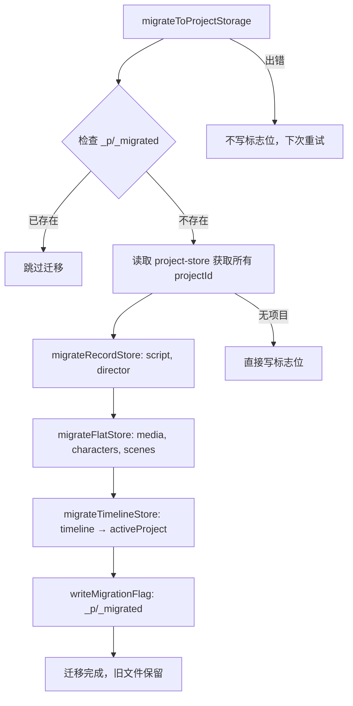

# PD-515.01 moyin-creator — 三层安全迁移与遗留数据自动恢复

> 文档编号：PD-515.01
> 来源：moyin-creator `src/lib/storage-migration.ts` `src/lib/project-switcher.ts` `src/lib/project-storage.ts`
> GitHub：https://github.com/MemeCalculate/moyin-creator.git
> 问题域：PD-515 数据迁移与恢复 Data Migration & Recovery
> 状态：可复用方案

---

## 第 1 章 问题与动机

### 1.1 核心问题

Electron 桌面应用在演进过程中，存储架构从"单体文件"升级到"按项目目录隔离"是常见需求。这个迁移面临三个核心挑战：

1. **数据安全**：迁移过程中断（崩溃、断电）不能导致数据丢失
2. **幂等性**：迁移必须可重复执行，不能因重复运行产生副作用
3. **Bug 引发的数据覆盖**：多 Store 协调 rehydrate 时，执行顺序错误会导致空数据覆盖已有数据

moyin-creator 是一个 Electron + React 的漫画创作工具，使用 Zustand persist 中间件管理 7 个 Store（script、director、media、character-library、scene、timeline、sclass）。当引入多项目支持时，需要将原来的单体 JSON 文件拆分到 `_p/{projectId}/` 目录下。

### 1.2 moyin-creator 的解法概述

moyin-creator 构建了三层防护体系：

1. **安全迁移层**（`storage-migration.ts:23`）：`migrateToProjectStorage()` 先写新文件再标记完成，旧文件保留作为回退，幂等标志位 `_p/_migrated` 防重复执行
2. **自动恢复层**（`storage-migration.ts:254`）：`recoverFromLegacy()` 在每次启动时对比遗留文件与按项目文件的数据丰富度，自动从遗留文件恢复被覆盖的数据
3. **协调切换层**（`project-switcher.ts:39`）：`switchProject()` 严格控制 7 个 Store 的 rehydrate 顺序——先更新路由指针，再逐个 rehydrate 加载数据，最后才同步内部 activeProjectId

三层在 App 启动时串行执行（`App.tsx:21-22`），迁移完成前显示 loading 界面阻塞用户操作。

### 1.3 设计思想

| 设计原则 | 具体实现 | 理由 | 替代方案 |
|----------|----------|------|----------|
| 先写后标记 | 新文件全部写入成功后才写 `_p/_migrated` 标志 | 中断时不写标志，下次启动重新迁移 | 事务日志（WAL），但对文件系统过重 |
| 旧文件保留 | 迁移后不删除原始单体文件 | 作为恢复数据源，且不影响新存储适配器 | 重命名为 .bak，但增加复杂度 |
| 丰富度对比恢复 | `isScriptDataRich()` / `isDirectorDataRich()` 判断数据是否有实质内容 | 精确检测空数据覆盖，避免误恢复 | 时间戳对比，但不可靠 |
| 顺序 rehydrate | 先路由指针 → 再 rehydrate → 最后 activeProjectId | 防止 persist 写入触发空数据覆盖 | 全局锁，但 Zustand 不支持 |
| 三源择优 | `indexed-db-storage.ts:62` 从 file/localStorage/IndexedDB 三源取最丰富数据 | 兼容历史版本的多种存储后端 | 只读一个源，但会丢失历史数据 |

---

## 第 2 章 源码实现分析

### 2.1 架构概览

moyin-creator 的数据迁移与恢复系统由四个模块协作：

```
┌─────────────────────────────────────────────────────────────────┐
│                        App.tsx (启动入口)                        │
│  useEffect: migrateToProjectStorage() → recoverFromLegacy()    │
│  isMigrating=true 时显示 Loading，阻塞用户操作                   │
└──────────────────────────┬──────────────────────────────────────┘
                           │
          ┌────────────────┼────────────────┐
          ▼                ▼                ▼
┌──────────────┐  ┌──────────────┐  ┌──────────────────┐
│  storage-    │  │  project-    │  │  project-        │
│  migration   │  │  switcher    │  │  storage         │
│              │  │              │  │                  │
│ • migrate()  │  │ • switch()   │  │ • Scoped adapter │
│ • recover()  │  │ • 7-store    │  │ • Split adapter  │
│ • 幂等标志   │  │   rehydrate  │  │ • 路由 + 回退    │
└──────┬───────┘  └──────┬───────┘  └────────┬─────────┘
       │                 │                   │
       └─────────────────┼───────────────────┘
                         ▼
              ┌─────────────────────┐
              │  indexed-db-storage │
              │  (三源择优适配器)     │
              │  file > local > IDB │
              └─────────────────────┘
```

存储目录结构迁移前后对比：

```
迁移前（单体）:                    迁移后（按项目）:
moyin-script-store.json           _p/
moyin-director-store.json           ├── {pid1}/
moyin-media-store.json              │   ├── script.json
moyin-character-library.json        │   ├── director.json
moyin-scene-store.json              │   ├── media.json
moyin-timeline-store.json           │   ├── characters.json
                                    │   ├── scenes.json
                                    │   └── timeline.json
                                    ├── {pid2}/
                                    │   └── ...
                                    ├── _migrated  ← 幂等标志
                                    └── _shared/
                                        ├── media.json
                                        ├── characters.json
                                        └── scenes.json
```

### 2.2 核心实现

#### 2.2.1 安全迁移：三类 Store 的差异化处理

迁移引擎根据 Store 的数据结构分为三种策略：Record 型、Flat Array 型、Timeline 型。



对应源码 `src/lib/storage-migration.ts:23-103`：

```typescript
export async function migrateToProjectStorage(): Promise<void> {
  if (!window.fileStorage) return;

  // 幂等检查：标志位存在则跳过
  try {
    const flagExists = await window.fileStorage.exists(MIGRATION_FLAG_KEY);
    if (flagExists) {
      console.log('[Migration] Already migrated, skipping.');
      return;
    }
  } catch {
    const flag = await fileStorage.getItem(MIGRATION_FLAG_KEY);
    if (flag) return;
  }

  try {
    // 读取项目索引
    const projectStoreRaw = await fileStorage.getItem('moyin-project-store');
    if (!projectStoreRaw) {
      await writeMigrationFlag();
      return;
    }
    const projectStoreData = JSON.parse(projectStoreRaw);
    const projectState = projectStoreData.state ?? projectStoreData;
    const projectIds: string[] = (projectState.projects ?? []).map((p: any) => p.id);

    // 三类 Store 差异化迁移
    await migrateRecordStore('moyin-script-store', 'script', projectIds);
    await migrateRecordStore('moyin-director-store', 'director', projectIds);
    await migrateFlatStore('moyin-media-store', 'media', projectIds, { /* config */ });
    await migrateFlatStore('moyin-character-library', 'characters', projectIds, { /* config */ });
    await migrateFlatStore('moyin-scene-store', 'scenes', projectIds, { /* config */ });
    await migrateTimelineStore(projectState.activeProjectId || projectIds[0]);

    // 全部成功后才写标志位
    await writeMigrationFlag();
  } catch (error) {
    console.error('[Migration] ❌ Migration failed:', error);
    // 不写标志位 → 下次启动重试
  }
}
```

#### 2.2.2 Flat Array 迁移：按 projectId 字段分流 + 共享数据分离

Flat Array 型 Store（media、characters、scenes）的数据是扁平数组，每个元素有 `projectId` 字段。迁移时需要按 projectId 分流到各项目目录，同时将无 projectId 的共享数据写入 `_shared/`。

```mermaid
graph TD
    A[migrateFlatStore] --> B[读取遗留单体文件]
    B --> C[遍历 arrayKeys: mediaFiles, folders]
    C --> D{item.projectId?}
    D -->|无| E[写入 _shared/media.json]
    D -->|有| F[按 projectId 分组]
    F --> G[写入 _p/{pid}/media.json]
    E --> H[完成]
    G --> H
```

对应源码 `src/lib/storage-migration.ts:162-218`：

```typescript
async function migrateFlatStore(
  legacyKey: string,
  storeName: string,
  projectIds: string[],
  config: FlatMigrationConfig,
): Promise<void> {
  const raw = await fileStorage.getItem(legacyKey);
  if (!raw) return;

  const parsed = JSON.parse(raw);
  const state = parsed.state ?? parsed;
  const version = parsed.version ?? 0;

  // 收集共享数据（无 projectId 的项）
  const sharedState: Record<string, any[]> = {};
  for (const key of config.arrayKeys) {
    const arr = state[key] ?? [];
    sharedState[key] = arr.filter((item: any) => config.sharedFilter(item, key));
  }
  await fileStorage.setItem(`_shared/${storeName}`, JSON.stringify({ state: sharedState, version }));

  // 按 projectId 分组写入各项目目录
  for (const pid of projectIds) {
    const projectState: Record<string, any[]> = {};
    let hasData = false;
    for (const key of config.arrayKeys) {
      const arr = state[key] ?? [];
      const projectItems = arr.filter((item: any) => {
        if (key === 'folders' && item.isSystem) return false;
        return item[config.projectIdField] === pid;
      });
      projectState[key] = projectItems;
      if (projectItems.length > 0) hasData = true;
    }
    if (hasData) {
      await fileStorage.setItem(`_p/${pid}/${storeName}`, JSON.stringify({ state: projectState, version }));
    }
  }
}
```

#### 2.2.3 遗留数据自动恢复：丰富度对比策略

```mermaid
graph TD
    A[recoverFromLegacy] --> B{_p/_migrated 存在?}
    B -->|否| C[迁移未完成，跳过恢复]
    B -->|是| D[读取遗留单体文件]
    D --> E[遍历每个 projectId]
    E --> F{isRich: 遗留数据有实质内容?}
    F -->|否| G[跳过该项目]
    F -->|是| H[读取 _p/{pid}/store.json]
    H --> I{isRich: 按项目数据有实质内容?}
    I -->|是| J[数据完好，跳过]
    I -->|否| K[从遗留文件恢复到按项目文件]
```

对应源码 `src/lib/storage-migration.ts:254-362`：

```typescript
export async function recoverFromLegacy(): Promise<void> {
  if (!window.fileStorage) return;

  // 只在迁移完成后运行
  try {
    const flagExists = await window.fileStorage.exists(MIGRATION_FLAG_KEY);
    if (!flagExists) return;
  } catch { return; }

  // 对比 Record 型 Store
  await recoverRecordStore('moyin-script-store', 'script', isScriptDataRich);
  await recoverRecordStore('moyin-director-store', 'director', isDirectorDataRich);
}

// 丰富度判断函数 — 检查数据是否有实质内容
function isScriptDataRich(data: any): boolean {
  if (!data) return false;
  if (data.rawScript && data.rawScript.length > 10) return true;
  if (data.shots && data.shots.length > 0) return true;
  if (data.scriptData?.episodes?.length > 0) return true;
  if (data.episodeRawScripts?.length > 0) return true;
  return false;
}
```

恢复逻辑的核心在 `recoverRecordStore`（`storage-migration.ts:301-361`）：逐项目对比遗留数据与按项目数据的丰富度，只在遗留数据更丰富时才覆盖。

### 2.3 实现细节

#### 项目切换的顺序陷阱

`project-switcher.ts:27-37` 的注释记录了一个真实 Bug：

> Previous bug: setting internal activeProjectId BEFORE rehydrate triggered persist writes that overwrote per-project files with empty/default data.

修复方案是严格的 5 步顺序（`project-switcher.ts:39-114`）：

1. **等待 50ms**：让 pending 的 persist 写入完成（persist 中间件同步触发 setItem，但 IPC 写入是异步的）
2. **更新路由指针**：`setActiveProject(newProjectId)` 只改 project-store 的 activeProjectId
3. **逐个 rehydrate**：7 个 Store 依次 rehydrate，每个用 try-catch 隔离失败
4. **同步内部 ID**：rehydrate 完成后才设置各 Store 的 activeProjectId
5. **确保数据存在**：`ensureProject()` 为新项目创建默认数据结构

#### 存储适配器的竞态防护

`project-storage.ts:96-133` 的 `setItem` 实现了一个精巧的竞态防护：从要写入的数据中提取 `activeProjectId`，而不是从全局 Store 读取。这避免了 rehydrate 期间全局 ID 已切换但数据还属于旧项目的竞态问题。

#### 三源择优适配器

`indexed-db-storage.ts:62-124` 的 `getItem` 同时从 file storage、localStorage、IndexedDB 三个源读取数据，用 `hasRichData()` 判断哪个源的数据最丰富，自动迁移到 file storage 并清理旧源。这解决了从 Web 版迁移到 Electron 版时的数据保留问题。

---

## 第 3 章 迁移指南

### 3.1 迁移清单

将 moyin-creator 的三层迁移方案移植到自己的 Electron + Zustand 项目，分三个阶段：

**阶段 1：存储适配器改造**
- [ ] 实现 `createProjectScopedStorage(storeName)` 适配器，路由到 `_p/{pid}/{storeName}`
- [ ] 实现 `createSplitStorage(storeName, splitFn, mergeFn)` 适配器（如有共享数据需求）
- [ ] 适配器的 `getItem` 中等待 project-store rehydrate 完成再读取 activeProjectId
- [ ] 适配器的 `setItem` 中从数据本身提取 projectId，防止竞态覆盖

**阶段 2：迁移引擎**
- [ ] 实现 `migrateToProjectStorage()`，包含幂等标志位检查
- [ ] 根据 Store 数据结构选择迁移策略（Record 型 / Flat Array 型 / 整体赋值型）
- [ ] 迁移失败时不写标志位，确保下次启动重试
- [ ] 在 App 入口处调用迁移，迁移完成前阻塞 UI

**阶段 3：恢复与切换**
- [ ] 实现 `recoverFromLegacy()`，定义每个 Store 的"丰富度判断函数"
- [ ] 实现 `switchProject()`，严格控制 rehydrate 顺序
- [ ] 为每个 Store 的 rehydrate 添加 try-catch 隔离

### 3.2 适配代码模板

以下是可直接复用的迁移引擎模板（TypeScript）：

```typescript
// === migration-engine.ts ===
// 通用迁移引擎模板，适用于任何 Zustand persist + 文件存储的项目

const MIGRATION_FLAG = '_p/_migrated';

interface MigrationConfig {
  /** 获取所有项目 ID */
  getProjectIds: () => Promise<string[]>;
  /** 存储适配器 */
  storage: {
    getItem: (key: string) => Promise<string | null>;
    setItem: (key: string, value: string) => Promise<void>;
    exists: (key: string) => Promise<boolean>;
  };
  /** Store 迁移配置 */
  stores: Array<{
    legacyKey: string;
    storeName: string;
    type: 'record' | 'flat-array' | 'whole-state';
    /** flat-array 型需要的配置 */
    arrayKeys?: string[];
    projectIdField?: string;
    sharedFilter?: (item: any, key: string) => boolean;
  }>;
}

export async function runMigration(config: MigrationConfig): Promise<void> {
  // 1. 幂等检查
  try {
    if (await config.storage.exists(MIGRATION_FLAG)) return;
  } catch {
    const flag = await config.storage.getItem(MIGRATION_FLAG);
    if (flag) return;
  }

  // 2. 获取项目列表
  const projectIds = await config.getProjectIds();
  if (projectIds.length === 0) {
    await writeMigrationFlag(config.storage);
    return;
  }

  try {
    // 3. 逐 Store 迁移
    for (const store of config.stores) {
      const raw = await config.storage.getItem(store.legacyKey);
      if (!raw) continue;

      const parsed = JSON.parse(raw);
      const state = parsed.state ?? parsed;

      switch (store.type) {
        case 'record':
          await migrateRecord(config.storage, store.storeName, state.projects, parsed.version);
          break;
        case 'flat-array':
          await migrateFlatArray(config.storage, store, state, projectIds, parsed.version);
          break;
        case 'whole-state':
          // 整体赋值到当前活跃项目
          await config.storage.setItem(`_p/${projectIds[0]}/${store.storeName}`, raw);
          break;
      }
    }

    // 4. 全部成功后写标志位
    await writeMigrationFlag(config.storage);
  } catch (error) {
    console.error('[Migration] Failed, will retry on next startup:', error);
    // 不写标志位
  }
}

async function migrateRecord(
  storage: MigrationConfig['storage'],
  storeName: string,
  projects: Record<string, any>,
  version: number,
): Promise<void> {
  if (!projects || typeof projects !== 'object') return;
  for (const [pid, data] of Object.entries(projects)) {
    if (!data) continue;
    await storage.setItem(
      `_p/${pid}/${storeName}`,
      JSON.stringify({ state: { activeProjectId: pid, projectData: data }, version: version ?? 0 }),
    );
  }
}

async function writeMigrationFlag(storage: MigrationConfig['storage']): Promise<void> {
  await storage.setItem(MIGRATION_FLAG, JSON.stringify({
    migratedAt: new Date().toISOString(),
    version: 1,
  }));
}
```

### 3.3 适用场景

| 场景 | 适用度 | 说明 |
|------|--------|------|
| Electron + Zustand 多项目桌面应用 | ⭐⭐⭐ | 完美匹配，可直接复用 |
| Web 应用 localStorage → IndexedDB 迁移 | ⭐⭐⭐ | 三源择优适配器可直接用 |
| React Native AsyncStorage 多租户 | ⭐⭐ | 思路可用，适配器需改写 |
| 后端数据库 schema 迁移 | ⭐ | 思路可参考，但后端有更成熟的方案（Flyway/Alembic） |
| 单 Store 简单应用 | ⭐ | 过度设计，直接版本号迁移即可 |

---

## 第 4 章 测试用例

```typescript
import { describe, it, expect, vi, beforeEach } from 'vitest';

// Mock storage
const mockStorage = new Map<string, string>();
const storage = {
  getItem: vi.fn(async (key: string) => mockStorage.get(key) ?? null),
  setItem: vi.fn(async (key: string, value: string) => { mockStorage.set(key, value); }),
  exists: vi.fn(async (key: string) => mockStorage.has(key)),
  removeItem: vi.fn(async (key: string) => { mockStorage.delete(key); }),
};

describe('Storage Migration', () => {
  beforeEach(() => {
    mockStorage.clear();
    vi.clearAllMocks();
  });

  // --- 幂等性测试 ---
  it('should skip migration when flag exists', async () => {
    mockStorage.set('_p/_migrated', JSON.stringify({ migratedAt: '2025-01-01', version: 1 }));
    mockStorage.set('moyin-script-store', JSON.stringify({ state: { projects: { p1: { rawScript: 'hello' } } } }));

    // migrateToProjectStorage 应直接返回，不写任何新文件
    // 验证：_p/p1/script 不应被创建
    expect(mockStorage.has('_p/p1/script')).toBe(false);
  });

  // --- Record 型迁移测试 ---
  it('should migrate record store to per-project files', async () => {
    const legacyData = {
      state: {
        projects: {
          'proj-001': { rawScript: 'Scene 1: ...', shots: [{ id: 's1' }] },
          'proj-002': { rawScript: 'Scene 2: ...', shots: [] },
        },
      },
      version: 3,
    };
    mockStorage.set('moyin-script-store', JSON.stringify(legacyData));

    // 模拟 migrateRecordStore 逻辑
    const raw = await storage.getItem('moyin-script-store');
    const parsed = JSON.parse(raw!);
    const projects = parsed.state.projects;

    for (const pid of Object.keys(projects)) {
      const key = `_p/${pid}/script`;
      await storage.setItem(key, JSON.stringify({
        state: { activeProjectId: pid, projectData: projects[pid] },
        version: parsed.version,
      }));
    }

    // 验证
    const p1 = JSON.parse(mockStorage.get('_p/proj-001/script')!);
    expect(p1.state.projectData.rawScript).toBe('Scene 1: ...');
    expect(p1.version).toBe(3);

    const p2 = JSON.parse(mockStorage.get('_p/proj-002/script')!);
    expect(p2.state.projectData.rawScript).toBe('Scene 2: ...');
  });

  // --- Flat Array 迁移测试 ---
  it('should split flat array by projectId and shared', async () => {
    const legacyMedia = {
      state: {
        mediaFiles: [
          { id: 'm1', name: 'bg.png', projectId: 'proj-001' },
          { id: 'm2', name: 'char.png', projectId: 'proj-002' },
          { id: 'm3', name: 'logo.png' }, // 无 projectId → 共享
        ],
        folders: [
          { id: 'f1', name: 'Backgrounds', projectId: 'proj-001' },
          { id: 'f-sys', name: 'System', isSystem: true }, // 系统文件夹 → 共享
        ],
      },
      version: 1,
    };

    const state = legacyMedia.state;
    const sharedMedia = state.mediaFiles.filter((m: any) => !m.projectId);
    const sharedFolders = state.folders.filter((f: any) => f.isSystem || !f.projectId);

    expect(sharedMedia).toHaveLength(1);
    expect(sharedMedia[0].id).toBe('m3');
    expect(sharedFolders).toHaveLength(1);
    expect(sharedFolders[0].id).toBe('f-sys');

    const proj1Media = state.mediaFiles.filter((m: any) => m.projectId === 'proj-001');
    expect(proj1Media).toHaveLength(1);
    expect(proj1Media[0].id).toBe('m1');
  });

  // --- 恢复测试 ---
  it('should recover from legacy when per-project data is empty', async () => {
    // 遗留文件有丰富数据
    const legacyScript = {
      state: {
        projects: {
          'proj-001': { rawScript: 'A long script with content...', shots: [{ id: 's1' }] },
        },
      },
      version: 2,
    };
    mockStorage.set('moyin-script-store', JSON.stringify(legacyScript));

    // 按项目文件被覆盖为空数据
    mockStorage.set('_p/proj-001/script', JSON.stringify({
      state: { activeProjectId: 'proj-001', projectData: {} },
      version: 2,
    }));

    // 丰富度判断
    const isRich = (data: any) => {
      if (!data) return false;
      if (data.rawScript && data.rawScript.length > 10) return true;
      if (data.shots && data.shots.length > 0) return true;
      return false;
    };

    const legacyData = legacyScript.state.projects['proj-001'];
    const currentParsed = JSON.parse(mockStorage.get('_p/proj-001/script')!);
    const currentData = currentParsed.state.projectData;

    expect(isRich(legacyData)).toBe(true);
    expect(isRich(currentData)).toBe(false);

    // 应触发恢复
    if (isRich(legacyData) && !isRich(currentData)) {
      await storage.setItem('_p/proj-001/script', JSON.stringify({
        state: { activeProjectId: 'proj-001', projectData: legacyData },
        version: 2,
      }));
    }

    const recovered = JSON.parse(mockStorage.get('_p/proj-001/script')!);
    expect(recovered.state.projectData.rawScript).toBe('A long script with content...');
  });

  // --- 切换顺序测试 ---
  it('should rehydrate stores before syncing activeProjectId', async () => {
    const callOrder: string[] = [];

    const mockSetActiveProject = vi.fn(() => callOrder.push('setActiveProject'));
    const mockRehydrate = vi.fn(async () => callOrder.push('rehydrate'));
    const mockSetActiveProjectId = vi.fn(() => callOrder.push('setActiveProjectId'));

    // 模拟 switchProject 顺序
    mockSetActiveProject();
    await mockRehydrate();
    mockSetActiveProjectId();

    expect(callOrder).toEqual(['setActiveProject', 'rehydrate', 'setActiveProjectId']);
  });
});
```

---

## 第 5 章 跨域关联

| 关联域 | 关系类型 | 说明 |
|--------|----------|------|
| PD-06 记忆持久化 | 强依赖 | 迁移的对象就是持久化的 Store 数据，`indexed-db-storage.ts` 的三源择优适配器同时服务于持久化和迁移 |
| PD-484 Store 版本迁移 | 协同 | PD-484 处理 Store schema 版本升级（Zustand `migrate` 钩子），PD-515 处理存储目录结构迁移，两者在 App 启动时串行执行 |
| PD-478 项目级状态隔离 | 协同 | PD-478 的 `project-storage.ts` 提供运行时路由适配器，PD-515 的 `storage-migration.ts` 负责一次性数据搬迁 |
| PD-03 容错与重试 | 设计借鉴 | 迁移的"先写后标记"和恢复的"丰富度对比"都是容错设计模式的具体应用 |
| PD-10 中间件管道 | 架构关联 | Zustand persist 中间件是整个迁移系统的基础设施，rehydrate 机制是 persist 中间件提供的能力 |

---

## 第 6 章 来源文件索引

| 文件 | 行范围 | 关键实现 |
|------|--------|----------|
| `src/lib/storage-migration.ts` | L1-L373 | 迁移引擎全部实现：migrateToProjectStorage、三类 Store 迁移、recoverFromLegacy、丰富度判断 |
| `src/lib/storage-migration.ts` | L23-L103 | `migrateToProjectStorage()` 主函数：幂等检查 + 三类 Store 差异化迁移 + 标志位写入 |
| `src/lib/storage-migration.ts` | L107-L152 | `migrateRecordStore()` Record 型迁移：按 projects Record 的 key 分流 |
| `src/lib/storage-migration.ts` | L162-L218 | `migrateFlatStore()` Flat Array 型迁移：按 projectId 字段分流 + 共享数据分离 |
| `src/lib/storage-migration.ts` | L222-L239 | `migrateTimelineStore()` Timeline 整体赋值迁移 |
| `src/lib/storage-migration.ts` | L254-L362 | `recoverFromLegacy()` 遗留数据恢复：丰富度对比 + 条件覆盖 |
| `src/lib/storage-migration.ts` | L279-L295 | `isScriptDataRich()` / `isDirectorDataRich()` 丰富度判断函数 |
| `src/lib/project-switcher.ts` | L39-L114 | `switchProject()` 5 步顺序切换：等待 → 路由指针 → rehydrate × 7 → 同步 ID → ensureProject |
| `src/lib/project-storage.ts` | L61-L145 | `createProjectScopedStorage()` 运行时路由适配器：等待 hydration + 竞态防护 |
| `src/lib/project-storage.ts` | L169-L315 | `createSplitStorage()` 分裂存储适配器：读时合并 + 写时分流 |
| `src/lib/indexed-db-storage.ts` | L61-L124 | `fileStorage.getItem()` 三源择优：file > localStorage > IndexedDB |
| `src/stores/project-store.ts` | L35-L143 | `useProjectStore` 项目索引 Store：DEFAULT_PROJECT + migrate 钩子 + onRehydrateStorage |
| `src/App.tsx` | L17-L29 | 启动时串行执行 migrateToProjectStorage → recoverFromLegacy，isMigrating 阻塞 UI |

---

## 第 7 章 横向对比维度

```json comparison_data
{
  "project": "moyin-creator",
  "dimensions": {
    "迁移策略": "三类 Store 差异化迁移：Record 按 key 分流、Flat Array 按 projectId 分流、Timeline 整体赋值",
    "幂等机制": "_p/_migrated 标志位文件，失败不写标志位自动重试",
    "数据恢复": "丰富度对比函数（isRich）检测空数据覆盖，从遗留文件自动恢复",
    "切换协调": "5 步顺序 switchProject：等待 → 路由指针 → 7 Store rehydrate → 同步 ID → ensure",
    "存储路由": "双适配器：ProjectScoped 路由到 _p/{pid}/，Split 分流到 _p/ + _shared/",
    "多源兼容": "三源择优适配器：file > localStorage > IndexedDB，自动迁移最丰富数据源"
  }
}
```

### 域元数据补充

```json domain_metadata
{
  "solution_summary": "moyin-creator 用三类 Store 差异化迁移（Record/FlatArray/WholeState）+ isRich 丰富度对比自动恢复 + 5 步顺序 switchProject 防空数据覆盖",
  "description": "Electron 桌面应用从单体存储到按项目目录隔离的安全迁移与运行时数据恢复",
  "sub_problems": [
    "Flat Array 型数据按 projectId 字段分流与共享数据分离",
    "persist 中间件异步写入与 rehydrate 的竞态防护",
    "多存储后端（file/localStorage/IndexedDB）的数据择优合并"
  ],
  "best_practices": [
    "从数据本身提取 projectId 而非全局 Store，防止竞态写错目录",
    "等待 project-store hydration 完成后再读取 activeProjectId",
    "迁移完成前用 loading 界面阻塞用户操作防止脏读"
  ]
}
```
