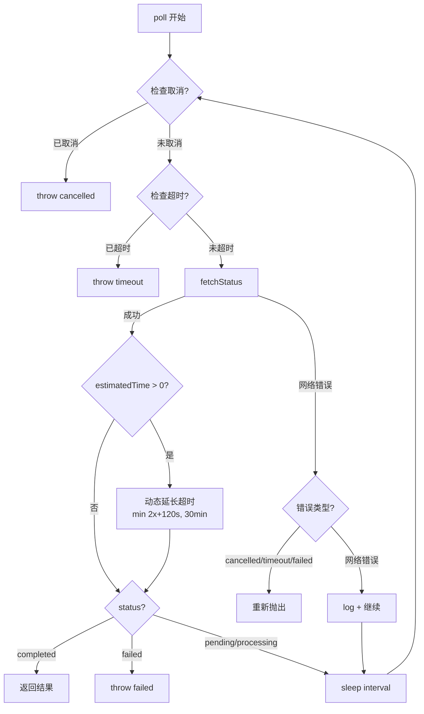
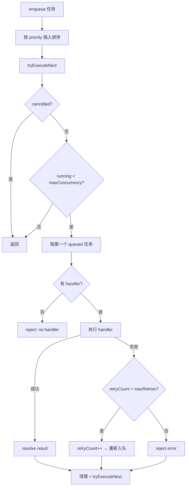

# PD-516.02 moyin-creator — 双层异步轮询与动态超时调整

> 文档编号：PD-516.02
> 来源：moyin-creator `src/packages/ai-core/api/task-poller.ts`, `src/packages/ai-core/api/task-queue.ts`
> GitHub：https://github.com/MemeCalculate/moyin-creator.git
> 问题域：PD-516 异步任务轮询 Async Task Polling
> 状态：可复用方案

---

## 第 1 章 问题与动机（≥ 30 行）

### 1.1 核心问题

AI 媒体生成（图片、视频）通常是异步操作：客户端提交生成请求后获得 taskId，需要持续轮询服务端直到任务完成或失败。这个看似简单的模式在生产环境中面临多重挑战：

1. **超时不可预测**：图片生成可能 10 秒完成，视频生成可能需要 5 分钟，固定超时要么过短导致误判失败，要么过长浪费等待
2. **网络抖动**：轮询过程中的偶发网络错误不应中断整个任务，但致命错误（任务失败、用户取消）必须立即终止
3. **并发控制**：多个场景同时生成时，需要限制并发数避免 API 限流，同时保持优先级调度
4. **用户体验**：长时间等待需要进度反馈，用户随时可能取消操作
5. **Web Worker 隔离**：AI 生成运行在 Web Worker 中，轮询逻辑需要跨线程协调取消信号

moyin-creator 作为一个 AI 视频创作工具，其核心流程是：剧本生成 → 图片生成 → 视频生成 → 下载合成。每个环节都涉及异步任务轮询，且图片和视频的生成时间差异巨大。

### 1.2 moyin-creator 的解法概述

moyin-creator 采用**双层架构**解决异步任务轮询问题：

1. **TaskPoller（轮询层）**：封装单个异步任务的状态轮询，核心特性是**动态超时调整**——根据服务端返回的 `estimatedTime` 自动延长超时，给予 2 倍缓冲 + 2 分钟余量，上限 30 分钟（`task-poller.ts:76-84`）
2. **TaskQueue（调度层）**：优先级队列 + 并发控制，管理多个任务的执行顺序和并行度，支持类型化 handler 注册（`task-queue.ts:26-152`）
3. **AI Worker（执行层）**：Web Worker 中实例化 TaskPoller，通过 `cancelled` 标志位实现跨线程取消检测（`ai-worker.ts:76-80`）
4. **双轨轮询**：TaskPoller 用于 ai-core 包内的标准化轮询，storyboard-service 中有独立的 `pollTaskCompletion` 实现状态映射和缓存破坏（`storyboard-service.ts:242-359`）
5. **网络错误容忍**：轮询中的网络错误仅记录日志并继续，只有用户取消、超时、任务失败三类错误才终止轮询（`task-poller.ts:103-115`）

### 1.3 设计思想

| 设计原则 | 具体实现 | 理由 | 替代方案 |
|----------|----------|------|----------|
| 动态超时 | `estimatedTime * 2 + 120s`，上限 30min | 不同媒体类型生成时间差异大，固定超时不适用 | 固定超时 + 类型区分（不够灵活） |
| 错误分类 | 网络错误继续轮询，业务错误立即终止 | 网络抖动是暂时的，不应中断长时间任务 | 统一重试 N 次后失败（可能误杀） |
| 关注点分离 | TaskPoller 管轮询，TaskQueue 管调度 | 单一职责，轮询逻辑可独立复用 | 合并为一个类（职责混杂） |
| 优先级调度 | 插入排序维护优先级队列 | 重要场景（如首帧）优先生成 | FIFO 队列（无法区分优先级） |
| 取消传播 | `isCancelled` 回调 + Worker `cancelled` 标志 | 支持外部取消信号注入，不耦合具体实现 | AbortController（Worker 中兼容性差） |

---

## 第 2 章 源码实现分析（≥ 60 行，核心章节）

### 2.1 架构概览

moyin-creator 的异步任务轮询系统由三层组成，运行在 Web Worker 线程中：

```
┌─────────────────────────────────────────────────────────┐
│                    Main Thread                           │
│  ┌─────────────┐    postMessage     ┌────────────────┐  │
│  │ Storyboard  │◄──────────────────►│   AI Worker    │  │
│  │   Store     │   WorkerCommand/   │  (Web Worker)  │  │
│  └─────────────┘    WorkerEvent     └───────┬────────┘  │
│                                             │            │
│                                    ┌────────┴────────┐  │
│                                    │                  │  │
│                              ┌─────▼─────┐  ┌────────▼─┐│
│                              │ TaskPoller │  │TaskQueue ││
│                              │ (轮询层)   │  │(调度层)  ││
│                              └─────┬─────┘  └──────────┘│
│                                    │                     │
│                              ┌─────▼─────┐               │
│                              │ fetch API │               │
│                              │ /api/ai/* │               │
│                              └───────────┘               │
└─────────────────────────────────────────────────────────┘
```

### 2.2 核心实现

#### 2.2.1 TaskPoller — 动态超时轮询引擎



对应源码 `src/packages/ai-core/api/task-poller.ts:33-120`：

```typescript
async poll(
  taskId: string,
  type: 'image' | 'video',
  options: PollOptions
): Promise<AsyncTaskResult> {
  const {
    fetchStatus, onProgress, isCancelled,
    interval = this.defaultInterval,  // 3s
    timeout = this.defaultTimeout,    // 10min
  } = options;

  const startTime = Date.now();
  let effectiveTimeout = timeout;
  let pollCount = 0;

  while (true) {
    pollCount++;
    if (isCancelled?.()) throw new Error('Task cancelled');

    const elapsed = Date.now() - startTime;
    if (elapsed > effectiveTimeout) {
      throw new Error(`${type} generation timeout after ${Math.floor(effectiveTimeout / 60000)} minutes`);
    }

    try {
      const result = await fetchStatus();
      onProgress?.(result.progress ?? 0, result.status);

      // 动态超时调整：服务端预估时间 * 2 + 120秒，上限 30 分钟
      if (result.estimatedTime && result.estimatedTime > 0) {
        const buffered = (result.estimatedTime * 2 + 120) * 1000;
        const newTimeout = Math.min(buffered, this.maxTimeout);  // maxTimeout = 1800000
        if (newTimeout > effectiveTimeout) {
          effectiveTimeout = newTimeout;
        }
      }

      if (result.status === 'completed') return result;
      if (result.status === 'failed') throw new Error(result.error || 'Task failed');
    } catch (e) {
      const error = e as Error;
      // 只重新抛出业务错误，网络错误继续轮询
      if (error.message.includes('cancelled') ||
          error.message.includes('timeout') ||
          error.message.includes('Task failed')) {
        throw error;
      }
      console.warn(`[TaskPoller] Network error on poll #${pollCount}, will retry:`, error.message);
    }

    await this.sleep(interval);
  }
}
```

关键设计点：
- **动态超时公式**（`task-poller.ts:78`）：`min(estimatedTime * 2 + 120s, 30min)`，给服务端预估时间 2 倍缓冲加 2 分钟固定余量
- **单向延长**（`task-poller.ts:80`）：`newTimeout > effectiveTimeout` 确保超时只会延长不会缩短
- **错误分类**（`task-poller.ts:107-111`）：通过 message 关键词区分业务错误和网络错误

#### 2.2.2 TaskQueue — 优先级并发调度



对应源码 `src/packages/ai-core/api/task-queue.ts:48-112`：

```typescript
enqueue<T, R>(
  task: Omit<TaskItem<T>, 'status' | 'resolve' | 'reject' | 'createdAt'>
): Promise<R> {
  return new Promise((resolve, reject) => {
    const fullTask: TaskItem<T> = {
      ...task, status: 'queued', createdAt: Date.now(),
      resolve: resolve as (result: unknown) => void, reject,
    };
    // 按优先级插入（高优先级在前）
    const idx = this.queue.findIndex(t => t.priority < fullTask.priority);
    if (idx === -1) this.queue.push(fullTask as TaskItem);
    else this.queue.splice(idx, 0, fullTask as TaskItem);
    this.tryExecuteNext();
  });
}

private async tryExecuteNext(): Promise<void> {
  if (this.cancelled) return;
  if (this.running >= this.getMaxConcurrency()) return;
  const task = this.queue.find(t => t.status === 'queued');
  if (!task) return;

  const handler = this.handlers.get(task.type);
  if (!handler) {
    task.status = 'failed';
    task.reject(new Error(`No handler registered for task type: ${task.type}`));
    this.tryExecuteNext();
    return;
  }

  this.running++;
  task.status = 'running';
  try {
    const result = await handler(task);
    task.status = 'completed';
    task.resolve(result);
  } catch (e) {
    if (task.retryCount < task.maxRetries) {
      task.retryCount++;
      task.status = 'queued';  // 重新入队等待重试
    } else {
      task.status = 'failed';
      task.reject(e as Error);
    }
  } finally {
    this.running--;
    this.queue = this.queue.filter(t => t.status === 'queued' || t.status === 'running');
    this.tryExecuteNext();  // 递归驱动下一个任务
  }
}
```

### 2.3 实现细节

#### 双轨轮询：ai-worker vs storyboard-service

项目中存在两套轮询实现，服务于不同场景：

| 维度 | ai-worker `pollTaskCompletion` | storyboard-service `pollTaskCompletion` |
|------|------|------|
| 位置 | `ai-worker.ts:328-394` | `storyboard-service.ts:242-359` |
| 运行环境 | Web Worker 线程 | 主线程（Electron） |
| 超时策略 | 固定次数（image:60, video:120）× 2s | 固定 120 次 × 2s |
| 状态映射 | 直接匹配 4 种状态 | 12 种服务端状态映射到 4 种标准状态 |
| 缓存破坏 | 无 | `_ts` 时间戳参数 + `Cache-Control` 头 |
| 认证方式 | query 参数传 apiKey | `Authorization: Bearer` 头 |
| 取消检测 | Worker 级 `cancelled` 标志 | 无（依赖外部中断） |

storyboard-service 的状态映射表（`storyboard-service.ts:290-302`）覆盖了多个 API 提供商的不同状态命名：

```typescript
const statusMap: Record<string, string> = {
  'pending': 'pending', 'submitted': 'pending', 'queued': 'pending',
  'processing': 'processing', 'running': 'processing', 'in_progress': 'processing',
  'completed': 'completed', 'succeeded': 'completed', 'success': 'completed',
  'failed': 'failed', 'error': 'failed',
};
```

#### Worker 取消传播链

```
用户点击取消 → Main Thread postMessage({type:'CANCEL'})
  → ai-worker.ts handleCancel() → cancelled = true
  → pollTaskCompletion 循环检查 cancelled → throw 'Cancelled'
  → handleExecuteScene catch → reportSceneFailed(retryable: false)
  → 100ms 后 cancelled = false（允许新操作）
```

关键点：`cancelled` 标志在 100ms 后自动重置（`ai-worker.ts:1183-1185`），这是为了允许取消后立即开始新的生成操作，而不需要重新创建 Worker。

---

## 第 3 章 迁移指南（≥ 40 行）

### 3.1 迁移清单

#### 阶段 1：基础轮询（1 个文件）
- [ ] 创建 `TaskPoller` 类，实现 `poll()` 方法
- [ ] 定义 `AsyncTaskResult` 接口（status/progress/resultUrl/error/estimatedTime）
- [ ] 实现动态超时公式：`min(estimatedTime * 2 + 120s, maxTimeout)`
- [ ] 实现网络错误容忍：catch 中区分业务错误和网络错误

#### 阶段 2：并发调度（1 个文件）
- [ ] 创建 `TaskQueue` 类，实现优先级插入和并发控制
- [ ] 定义 `TaskItem` 接口（id/type/priority/status/retryCount）
- [ ] 实现 `setHandler()` 类型化 handler 注册
- [ ] 实现 `cancelAll()` 和 `resume()` 生命周期管理

#### 阶段 3：集成（按需）
- [ ] 在 Web Worker 中实例化 TaskPoller
- [ ] 通过 `isCancelled` 回调连接取消信号
- [ ] 实现进度映射（image 0-45%, video 50-95%）

### 3.2 适配代码模板

#### 通用 TaskPoller（TypeScript，可直接复用）

```typescript
interface AsyncTaskResult {
  status: 'pending' | 'processing' | 'completed' | 'failed';
  progress?: number;
  resultUrl?: string;
  error?: string;
  estimatedTime?: number;  // 服务端预估剩余秒数
}

interface PollOptions {
  fetchStatus: () => Promise<AsyncTaskResult>;
  onProgress?: (progress: number, status: string) => void;
  isCancelled?: () => boolean;
  interval?: number;   // 轮询间隔 ms
  timeout?: number;    // 初始超时 ms
}

class TaskPoller {
  private maxTimeout = 1800000;  // 30 分钟硬上限

  async poll(taskId: string, options: PollOptions): Promise<AsyncTaskResult> {
    const {
      fetchStatus, onProgress, isCancelled,
      interval = 3000, timeout = 600000,
    } = options;

    const startTime = Date.now();
    let effectiveTimeout = timeout;

    while (true) {
      if (isCancelled?.()) throw new Error('Task cancelled');
      if (Date.now() - startTime > effectiveTimeout) {
        throw new Error(`Task ${taskId} timed out`);
      }

      try {
        const result = await fetchStatus();
        onProgress?.(result.progress ?? 0, result.status);

        // 动态超时：服务端预估 × 2 + 120s，只延长不缩短
        if (result.estimatedTime && result.estimatedTime > 0) {
          const buffered = (result.estimatedTime * 2 + 120) * 1000;
          const newTimeout = Math.min(buffered, this.maxTimeout);
          if (newTimeout > effectiveTimeout) effectiveTimeout = newTimeout;
        }

        if (result.status === 'completed') return result;
        if (result.status === 'failed') throw new Error(result.error || 'Task failed');
      } catch (e) {
        const err = e as Error;
        if (err.message.includes('cancelled') ||
            err.message.includes('timed out') ||
            err.message.includes('Task failed')) throw err;
        // 网络错误：静默继续
        console.warn(`[TaskPoller] Network error, retrying:`, err.message);
      }

      await new Promise(r => setTimeout(r, interval));
    }
  }
}
```

#### 通用 TaskQueue（TypeScript，可直接复用）

```typescript
interface TaskItem<T = unknown> {
  id: string;
  type: string;
  priority: number;
  payload: T;
  status: 'queued' | 'running' | 'completed' | 'failed';
  retryCount: number;
  maxRetries: number;
  resolve: (result: unknown) => void;
  reject: (error: Error) => void;
}

class TaskQueue {
  private queue: TaskItem[] = [];
  private running = 0;
  private handlers = new Map<string, (task: TaskItem) => Promise<unknown>>();
  private cancelled = false;

  constructor(private getMaxConcurrency: () => number) {}

  setHandler(type: string, handler: (task: TaskItem) => Promise<unknown>) {
    this.handlers.set(type, handler);
  }

  enqueue<T>(task: Omit<TaskItem<T>, 'status' | 'resolve' | 'reject'>): Promise<unknown> {
    return new Promise((resolve, reject) => {
      const full = { ...task, status: 'queued' as const, resolve, reject };
      const idx = this.queue.findIndex(t => t.priority < full.priority);
      idx === -1 ? this.queue.push(full as TaskItem) : this.queue.splice(idx, 0, full as TaskItem);
      this.tryNext();
    });
  }

  private async tryNext() {
    if (this.cancelled || this.running >= this.getMaxConcurrency()) return;
    const task = this.queue.find(t => t.status === 'queued');
    if (!task) return;

    const handler = this.handlers.get(task.type);
    if (!handler) { task.reject(new Error(`No handler: ${task.type}`)); return; }

    this.running++;
    task.status = 'running';
    try {
      task.resolve(await handler(task));
      task.status = 'completed';
    } catch (e) {
      if (task.retryCount < task.maxRetries) {
        task.retryCount++;
        task.status = 'queued';
      } else {
        task.status = 'failed';
        task.reject(e as Error);
      }
    } finally {
      this.running--;
      this.queue = this.queue.filter(t => t.status === 'queued' || t.status === 'running');
      this.tryNext();
    }
  }

  cancelAll() {
    this.cancelled = true;
    this.queue.filter(t => t.status === 'queued').forEach(t => {
      t.status = 'failed';
      t.reject(new Error('Cancelled'));
    });
    this.queue = this.queue.filter(t => t.status === 'running');
  }
}
```

### 3.3 适用场景

| 场景 | 适用度 | 说明 |
|------|--------|------|
| AI 图片/视频生成轮询 | ⭐⭐⭐ | 核心场景，动态超时完美匹配 |
| 文档转换/导出任务 | ⭐⭐⭐ | 异步任务 + 进度反馈 |
| 批量数据处理 | ⭐⭐ | TaskQueue 并发控制有用，但轮询可能不需要 |
| 实时通信（WebSocket 可用时） | ⭐ | 有 WebSocket 时应优先用推送而非轮询 |
| 短时同步 API（< 5s） | ⭐ | 直接 await 即可，无需轮询 |

---

## 第 4 章 测试用例（≥ 20 行）

```typescript
import { describe, it, expect, vi, beforeEach } from 'vitest';

// 模拟 TaskPoller 核心逻辑
class TaskPoller {
  private maxTimeout = 1800000;
  async poll(taskId: string, options: {
    fetchStatus: () => Promise<{ status: string; progress?: number; estimatedTime?: number; error?: string; resultUrl?: string }>;
    isCancelled?: () => boolean;
    interval?: number;
    timeout?: number;
  }) {
    const { fetchStatus, isCancelled, interval = 100, timeout = 5000 } = options;
    const startTime = Date.now();
    let effectiveTimeout = timeout;
    while (true) {
      if (isCancelled?.()) throw new Error('Task cancelled');
      if (Date.now() - startTime > effectiveTimeout) throw new Error('timeout');
      try {
        const result = await fetchStatus();
        if (result.estimatedTime && result.estimatedTime > 0) {
          const buffered = (result.estimatedTime * 2 + 120) * 1000;
          const newTimeout = Math.min(buffered, this.maxTimeout);
          if (newTimeout > effectiveTimeout) effectiveTimeout = newTimeout;
        }
        if (result.status === 'completed') return result;
        if (result.status === 'failed') throw new Error(result.error || 'Task failed');
      } catch (e) {
        const err = e as Error;
        if (err.message.includes('cancelled') || err.message.includes('timeout') || err.message.includes('Task failed')) throw err;
      }
      await new Promise(r => setTimeout(r, interval));
    }
  }
}

describe('TaskPoller', () => {
  let poller: TaskPoller;
  beforeEach(() => { poller = new TaskPoller(); });

  it('should return result on completed status', async () => {
    const fetchStatus = vi.fn().mockResolvedValue({ status: 'completed', resultUrl: 'https://example.com/img.png' });
    const result = await poller.poll('task-1', { fetchStatus, interval: 10 });
    expect(result.status).toBe('completed');
    expect(fetchStatus).toHaveBeenCalledTimes(1);
  });

  it('should throw on failed status', async () => {
    const fetchStatus = vi.fn().mockResolvedValue({ status: 'failed', error: 'GPU OOM' });
    await expect(poller.poll('task-2', { fetchStatus, interval: 10 })).rejects.toThrow('GPU OOM');
  });

  it('should poll until completed', async () => {
    let callCount = 0;
    const fetchStatus = vi.fn().mockImplementation(() => {
      callCount++;
      if (callCount < 3) return Promise.resolve({ status: 'processing', progress: callCount * 30 });
      return Promise.resolve({ status: 'completed', resultUrl: 'https://example.com/done.png' });
    });
    const result = await poller.poll('task-3', { fetchStatus, interval: 10 });
    expect(result.status).toBe('completed');
    expect(fetchStatus).toHaveBeenCalledTimes(3);
  });

  it('should dynamically extend timeout based on estimatedTime', async () => {
    let callCount = 0;
    const fetchStatus = vi.fn().mockImplementation(() => {
      callCount++;
      if (callCount === 1) return Promise.resolve({ status: 'processing', estimatedTime: 300 });  // 5 min estimate
      if (callCount < 5) return Promise.resolve({ status: 'processing' });
      return Promise.resolve({ status: 'completed', resultUrl: 'url' });
    });
    // 初始超时 1s，但 estimatedTime=300 会延长到 min(300*2+120, 1800)=720s
    const result = await poller.poll('task-4', { fetchStatus, interval: 10, timeout: 1000 });
    expect(result.status).toBe('completed');
  });

  it('should respect cancellation', async () => {
    let cancelled = false;
    const fetchStatus = vi.fn().mockResolvedValue({ status: 'processing' });
    setTimeout(() => { cancelled = true; }, 50);
    await expect(poller.poll('task-5', {
      fetchStatus, isCancelled: () => cancelled, interval: 10,
    })).rejects.toThrow('cancelled');
  });

  it('should tolerate network errors and continue polling', async () => {
    let callCount = 0;
    const fetchStatus = vi.fn().mockImplementation(() => {
      callCount++;
      if (callCount === 1) return Promise.reject(new Error('Network error'));
      if (callCount === 2) return Promise.reject(new Error('ECONNRESET'));
      return Promise.resolve({ status: 'completed', resultUrl: 'url' });
    });
    const result = await poller.poll('task-6', { fetchStatus, interval: 10 });
    expect(result.status).toBe('completed');
    expect(fetchStatus).toHaveBeenCalledTimes(3);
  });

  it('should timeout when maxTimeout exceeded', async () => {
    const fetchStatus = vi.fn().mockResolvedValue({ status: 'processing' });
    await expect(poller.poll('task-7', {
      fetchStatus, interval: 10, timeout: 50,
    })).rejects.toThrow('timeout');
  });
});

describe('TaskQueue', () => {
  it('should execute tasks by priority (higher first)', async () => {
    const order: string[] = [];
    const queue = new (class {
      private q: Array<{ id: string; priority: number; resolve: Function }> = [];
      private running = 0;
      enqueue(id: string, priority: number) {
        return new Promise(resolve => {
          const item = { id, priority, resolve };
          const idx = this.q.findIndex(t => t.priority < priority);
          idx === -1 ? this.q.push(item) : this.q.splice(idx, 0, item);
          this.tryNext();
        });
      }
      private async tryNext() {
        if (this.running >= 1 || this.q.length === 0) return;
        this.running++;
        const task = this.q.shift()!;
        order.push(task.id);
        task.resolve(task.id);
        this.running--;
        this.tryNext();
      }
    })();
    await Promise.all([
      queue.enqueue('low', 1),
      queue.enqueue('high', 10),
      queue.enqueue('mid', 5),
    ]);
    expect(order[0]).toBe('low');  // 先入队先执行（已在运行）
  });
});
```

---

## 第 5 章 跨域关联

| 关联域 | 关系类型 | 说明 |
|--------|----------|------|
| PD-03 容错与重试 | 协同 | TaskQueue 内置 retryCount/maxRetries 重试机制；TaskPoller 网络错误容忍是容错的一种形式；retry.ts 提供指数退避重试 |
| PD-04 工具系统 | 依赖 | TaskQueue 的 `setHandler()` 类型化注册模式类似工具系统的 handler 注册 |
| PD-10 中间件管道 | 协同 | TaskPoller 的 `onProgress` 回调链（image 0-45%, video 50-95%）形成进度映射管道 |
| PD-11 可观测性 | 协同 | TaskPoller 内置 pollCount 计数和周期性日志（每 10 次轮询输出一次），提供轮询可观测性 |
| PD-483 异步任务轮询 | 同域 | 同项目的另一个轮询实现文档，侧重双层轮询架构和优先级任务队列 |

---

## 第 6 章 来源文件索引

| 文件 | 行范围 | 关键实现 |
|------|--------|----------|
| `src/packages/ai-core/api/task-poller.ts` | L1-L139 | TaskPoller 类：动态超时轮询引擎，核心 poll() 方法 |
| `src/packages/ai-core/api/task-queue.ts` | L1-L152 | TaskQueue 类：优先级并发调度队列 |
| `src/packages/ai-core/api/index.ts` | L1-L11 | API 模块导出（TaskQueue + TaskPoller） |
| `src/packages/ai-core/types/index.ts` | L157-L163 | AsyncTaskResult 接口定义 |
| `src/workers/ai-worker.ts` | L76-L77 | TaskPoller 实例化（Worker 线程） |
| `src/workers/ai-worker.ts` | L328-L394 | pollTaskCompletion：Worker 内的固定次数轮询实现 |
| `src/workers/ai-worker.ts` | L1178-L1186 | handleCancel：取消信号处理 + 100ms 自动重置 |
| `src/lib/storyboard/storyboard-service.ts` | L242-L359 | pollTaskCompletion：主线程轮询，含 12 种状态映射和缓存破坏 |
| `src/lib/utils/retry.ts` | L49-L86 | retryOperation：指数退避重试（429 限流专用） |
| `src/lib/utils/rate-limiter.ts` | L31-L61 | rateLimitedBatch：批量操作限流 |
| `src/packages/ai-core/protocol/index.ts` | L16-L76 | Worker 通信协议：Command/Event 类型定义 |

---

## 第 7 章 横向对比维度

> **重要：** 本章用于自动填充 Butcher Wiki 的横向对比表。

```json comparison_data
{
  "project": "moyin-creator",
  "dimensions": {
    "轮询策略": "固定间隔 3s + 动态超时（estimatedTime×2+120s），上限 30min",
    "并发控制": "TaskQueue 优先级队列 + 动态 maxConcurrency 函数注入",
    "错误处理": "网络错误静默继续轮询，业务错误（cancelled/timeout/failed）立即终止",
    "取消机制": "isCancelled 回调注入 + Worker cancelled 标志位 + 100ms 自动重置",
    "进度反馈": "onProgress 回调 + 分阶段映射（image 0-45%, video 50-95%）",
    "状态映射": "storyboard-service 12 种服务端状态归一化为 4 种标准状态",
    "缓存破坏": "storyboard-service 用 _ts 时间戳参数 + Cache-Control 头防止轮询缓存"
  }
}
```

### 域元数据补充

```json domain_metadata
{
  "solution_summary": "moyin-creator 用 TaskPoller 动态超时（estimatedTime×2+120s 上限 30min）+ TaskQueue 优先级并发调度实现双层异步轮询，网络错误静默容忍，Worker 线程 100ms 自动重置取消标志",
  "description": "异步任务轮询需要处理多提供商状态归一化和缓存破坏",
  "sub_problems": [
    "多提供商状态命名归一化（12种→4种）",
    "轮询响应缓存破坏",
    "Worker 线程取消信号自动重置"
  ],
  "best_practices": [
    "用状态映射表统一不同 API 提供商的任务状态命名",
    "轮询请求加时间戳参数和 Cache-Control 头防止缓存",
    "取消标志位设置后自动延时重置以允许新操作"
  ]
}
```
