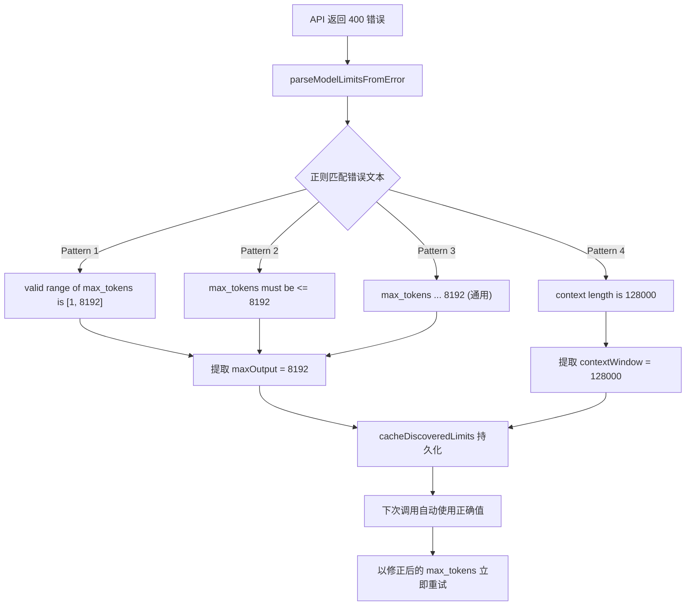

# PD-517.02 moyin-creator — 四层清洗管道与 Error-driven 模型发现

> 文档编号：PD-517.02
> 来源：moyin-creator `src/lib/utils/json-cleaner.ts` `src/lib/script/script-parser.ts` `src/lib/ai/model-registry.ts`
> GitHub：https://github.com/MemeCalculate/moyin-creator.git
> 问题域：PD-517 AI 输出清洗 AI Output Sanitization
> 状态：可复用方案

---

## 第 1 章 问题与动机

### 1.1 核心问题

LLM 返回的文本几乎不可能直接 `JSON.parse()`。实际生产中，AI 输出存在以下典型污染：

1. **Markdown 围栏包裹** — 模型习惯用 ` ```json ``` ` 包裹 JSON，导致解析失败
2. **前后缀噪声** — 模型在 JSON 前后附加解释性文字（"以下是结果："、"希望对你有帮助"）
3. **类型漂移** — 要求字符串 ID 却返回数字（`"id": 1` 而非 `"id": "char_1"`）
4. **输出截断** — 模型 max_tokens 不足导致 JSON 不完整，推理模型在 thinking 上耗尽 token
5. **模型限制未知** — 不同提供商的 max_tokens 上限各异，文档不全或过时

moyin-creator 作为一个影视剧本 AI 生成工具，每次 API 调用都需要解析复杂的嵌套 JSON（角色、场景、分镜），任何解析失败都意味着用户等待数十秒后看到空白页面。因此它构建了一套从"预防截断"到"清洗解析"到"类型修正"的完整管道。

### 1.2 moyin-creator 的解法概述

moyin-creator 的 AI 输出清洗方案由四层组成，形成一条从 API 调用前到解析后的完整管道：

1. **预防层（Token Budget Calculator）** — 调用前估算输入 token，超过 context window 90% 直接拒绝，避免无效请求（`script-parser.ts:254-275`）
2. **清洗层（cleanJsonString）** — 剥离 markdown 围栏，定位 JSON 边界（`json-cleaner.ts:13-41`）
3. **解析层（safeParseJson + extractJson）** — 带 fallback 的安全解析 + 正则提取（`json-cleaner.ts:46-98`）
4. **修正层（normalizeIds + cleanArray）** — 类型修正和数组验证（`json-cleaner.ts:60-83`）

额外的 **Error-driven Discovery** 机制从 API 400 错误中自动学习模型限制，缓存后避免重复踩坑（`model-registry.ts:178-229`）。

### 1.3 设计思想

| 设计原则 | 具体实现 | 理由 | 替代方案 |
|----------|----------|------|----------|
| 先预防再治疗 | Token Budget Calculator 在调用前拦截 | 省钱省时间，避免等 30 秒后才发现截断 | 不预检，靠解析层兜底 |
| 贪心边界定位 | indexOf/lastIndexOf 找最外层 `{}` 或 `[]` | 简单高效，覆盖 99% 场景 | 递归括号匹配（复杂但更精确） |
| 泛型 fallback | `safeParseJson<T>(str, fallback)` 返回类型安全的默认值 | 调用方不需要 try-catch | 抛异常让调用方处理 |
| Error-driven Discovery | 从 API 400 错误中正则提取 max_tokens 限制并缓存 | 模型限制文档不全，运行时自动学习最准确 | 手动维护所有模型限制表 |
| 三层查找 | 缓存 → 静态注册表 → 保守默认值 | 已知模型用精确值，未知模型用安全值 | 单一查找表 |

---

## 第 2 章 源码实现分析

### 2.1 架构概览

moyin-creator 的 AI 输出清洗管道贯穿从 API 调用到数据消费的全链路：

```
┌─────────────────────────────────────────────────────────────────┐
│                    AI Output Sanitization Pipeline               │
├─────────────────────────────────────────────────────────────────┤
│                                                                  │
│  ┌──────────────┐    ┌──────────────┐    ┌──────────────┐       │
│  │ Token Budget  │───→│  callChatAPI  │───→│ cleanJsonStr │       │
│  │  Calculator   │    │  + retry      │    │  (围栏剥离)   │       │
│  │ (预防截断)     │    │  + key轮换    │    │  (边界定位)   │       │
│  └──────────────┘    └──────────────┘    └──────┬───────┘       │
│                             │                    │               │
│                    ┌────────┴────────┐    ┌──────▼───────┐       │
│                    │ Error-driven    │    │ safeParseJson │       │
│                    │ Discovery       │    │ (安全解析)     │       │
│                    │ (学习模型限制)   │    └──────┬───────┘       │
│                    └─────────────────┘           │               │
│                                           ┌──────▼───────┐       │
│                                           │ normalizeIds  │       │
│                                           │ + cleanArray  │       │
│                                           │ (类型修正)     │       │
│                                           └──────────────┘       │
└─────────────────────────────────────────────────────────────────┘
```

关键组件分布在三个文件中：
- `json-cleaner.ts` — 纯函数工具集，无副作用，5 个导出函数
- `model-registry.ts` — 模型能力注册表，三层查找 + Error-driven Discovery
- `script-parser.ts` — 业务编排层，串联清洗管道 + API 调用

### 2.2 核心实现

#### 2.2.1 cleanJsonString — 围栏剥离与边界定位

```mermaid
graph TD
    A[输入: AI 原始响应文本] --> B{文本为空?}
    B -->|是| C["返回 '{}'"]
    B -->|否| D[正则移除 markdown 围栏]
    D --> E[trim 去除首尾空白]
    E --> F[indexOf 定位第一个 '{' 和 '[']
    F --> G[lastIndexOf 定位最后一个 '}' 和 ']']
    G --> H{'{' 在 '[' 之前?}
    H -->|是| I["slice(firstBrace, lastBrace+1)"]
    H -->|否| J["slice(firstBracket, lastBracket+1)"]
    I --> K[返回清洗后的 JSON 字符串]
    J --> K
```

对应源码 `src/lib/utils/json-cleaner.ts:13-41`：

```typescript
export function cleanJsonString(str: string): string {
  if (!str) return "{}";
  
  let cleaned = str;
  
  // Remove markdown code fences (```json ... ``` or ``` ... ```)
  cleaned = cleaned.replace(/```json\s*/gi, "");
  cleaned = cleaned.replace(/```\s*/g, "");
  
  // Remove leading/trailing whitespace
  cleaned = cleaned.trim();
  
  // Try to find JSON object or array bounds
  const firstBrace = cleaned.indexOf("{");
  const firstBracket = cleaned.indexOf("[");
  const lastBrace = cleaned.lastIndexOf("}");
  const lastBracket = cleaned.lastIndexOf("]");
  
  // If we found valid JSON bounds, extract just the JSON
  if (firstBrace !== -1 && lastBrace !== -1 && firstBrace < lastBrace) {
    if (firstBracket === -1 || firstBrace < firstBracket) {
      cleaned = cleaned.slice(firstBrace, lastBrace + 1);
    }
  } else if (firstBracket !== -1 && lastBracket !== -1 && firstBracket < lastBracket) {
    cleaned = cleaned.slice(firstBracket, lastBracket + 1);
  }
  
  return cleaned;
}
```

设计要点：
- 空输入返回 `"{}"` 而非空字符串，保证下游 `JSON.parse` 不会因空字符串报错
- 先移除围栏再定位边界，避免围栏中的 `{` 干扰定位
- 对象优先于数组（`firstBrace < firstBracket` 判断），因为大多数 AI 返回的是对象

#### 2.2.2 Error-driven Discovery — 从 API 错误中学习模型限制



对应源码 `src/lib/ai/model-registry.ts:178-229`：

```typescript
export function parseModelLimitsFromError(
  errorText: string
): Partial<DiscoveredModelLimits> | null {
  const result: Partial<DiscoveredModelLimits> = {};
  let found = false;

  // Pattern 1: "valid range of max_tokens is [1, 8192]"
  const rangeMatch = errorText.match(
    /valid\s+range.*?\[\s*\d+\s*,\s*(\d+)\s*\]/i
  );
  if (rangeMatch) {
    result.maxOutput = parseInt(rangeMatch[1], 10);
    found = true;
  }

  // Pattern 2: "max_tokens must be less than or equal to 8192"
  if (!found) {
    const lteMatch = errorText.match(
      /max_tokens.*?(?:less than or equal to|<=|不超过|上限为?)\s*(\d{3,6})/i
    );
    if (lteMatch) {
      result.maxOutput = parseInt(lteMatch[1], 10);
      found = true;
    }
  }

  // Pattern 3: Generic fallback
  if (!found) {
    const genericMatch = errorText.match(/max_tokens.*?\b(\d{3,6})\b/i);
    if (genericMatch) {
      result.maxOutput = parseInt(genericMatch[1], 10);
      found = true;
    }
  }

  // Context window pattern
  const ctxMatch = errorText.match(/context.*?length.*?(\d{4,7})/i);
  if (ctxMatch) {
    result.contextWindow = parseInt(ctxMatch[1], 10);
    found = true;
  }

  if (!found) return null;
  result.discoveredAt = Date.now();
  return result;
}
```

这个机制覆盖了 DeepSeek、OpenAI、智谱等主流 API 的错误格式，通过 4 种正则模式从错误消息中提取真实限制。


### 2.3 实现细节

#### Token Budget Calculator — 调用前预防截断

`callChatAPI` 在发送请求前执行 token 预算检查（`script-parser.ts:254-283`）：

```typescript
// 估算输入 token（保守算法：字符数/1.5）
const inputTokens = estimateTokens(systemPrompt + userPrompt);
const safetyMargin = Math.ceil(modelLimits.contextWindow * 0.1);
const availableForOutput = modelLimits.contextWindow - inputTokens - safetyMargin;

// 超过 90% → 直接拒绝（不发请求，省钱）
if (inputTokens > modelLimits.contextWindow * 0.9) {
  const err = new Error(
    `[TokenBudget] 输入 token (≈${inputTokens}) 超出 ${model} 的 context window`
  );
  (err as any).code = 'TOKEN_BUDGET_EXCEEDED';
  throw err;
}

// 输出空间不到请求的 50% → 打印 warning
if (availableForOutput < requestedMaxTokens * 0.5) {
  console.warn(`[Dispatch] ⚠️ 输出空间紧张！可用≈${availableForOutput} tokens`);
}
```

#### 推理模型回退 — 从 reasoning_content 中抢救 JSON

当推理模型（如 GLM-4.7）在 thinking 上耗尽 token 导致 content 为空时，`callChatAPI` 尝试从 `reasoning_content` 中提取 JSON（`script-parser.ts:399-451`）：

```typescript
if (finishReason === 'length' && reasoningContent) {
  // 尝试从 reasoning_content 提取 JSON
  const jsonMatch = reasoningContent.match(/```json\s*([\s\S]*?)```/) ||
                    reasoningContent.match(/(\{[\s\S]*"characters"[\s\S]*\})/);
  if (jsonMatch) {
    return jsonMatch[1] || jsonMatch[0];
  }
  
  // 推理 token 占比 >80% → 以双倍 max_tokens 自动重试
  if (reasoningTokens / completionTokens > 0.8 &&
      newMaxTokens > currentMaxTokens) {
    const retryBody = { ...body, max_tokens: newMaxTokens };
    const retryResp = await fetch(url, { method: 'POST', headers, body: JSON.stringify(retryBody) });
    // ...
  }
}
```

#### 三层模型查找 — getModelLimits

`model-registry.ts:125-142` 实现三层查找：

1. **持久化缓存**（Error-driven Discovery 学到的真实值）
2. **静态注册表**（精确匹配 → prefix 匹配，prefix 按长度降序排列避免短前缀误匹配）
3. **_default 保守默认值**（32K context / 4K output）

prefix 匹配的排序策略（`model-registry.ts:93-95`）：

```typescript
const SORTED_KEYS = Object.keys(STATIC_REGISTRY)
  .filter(k => k !== '_default')
  .sort((a, b) => b.length - a.length);
```

这保证 `deepseek-v3.2` 优先匹配精确 key，而不是被 `deepseek-` 前缀规则截获。

#### 业务编排 — parseScript 中的完整管道

`script-parser.ts:469-568` 展示了清洗管道在业务中的实际串联：

```typescript
export async function parseScript(rawScript: string, options: ParseOptions): Promise<ScriptData> {
  // 1. API 调用（内含 Token Budget + retry + key 轮换）
  const response = await callChatAPI(PARSE_SYSTEM_PROMPT, userPrompt, options);
  
  // 2. 清洗层：剥离围栏 + 定位边界
  const cleaned = cleanJsonString(response);
  
  // 3. 解析层：JSON.parse（此处未用 safeParseJson，因为需要区分解析失败和数据缺失）
  const parsed = JSON.parse(cleaned);
  
  // 4. 修正层：normalizeTimeValue 修正中文时间词到英文枚举
  const scenes = (parsed.scenes || []).map((s: any, i: number) => ({
    id: s.id || `scene_${i + 1}`,
    time: normalizeTimeValue(s.time),  // "白天" → "day", "深夜" → "midnight"
    // ...
  }));
  
  // 5. 修正层：默认值填充 + ID 生成
  const characters = (parsed.characters || []).map((c: any, i: number) => ({
    id: c.id || `char_${i + 1}`,
    name: c.name || `角色${i + 1}`,
    // ...
  }));
}
```

而在 `generateShotList` 中（`script-parser.ts:674-675`），对分镜数据使用了更防御性的 `safeParseJson`：

```typescript
const cleaned = cleanJsonString(response);
const shots = safeParseJson<any[]>(cleaned, []);  // 解析失败返回空数组，不崩溃
```

---

## 第 3 章 迁移指南

### 3.1 迁移清单

**阶段 1：基础清洗（1 个文件）**
- [ ] 复制 `json-cleaner.ts` 的 5 个函数到项目中
- [ ] 所有 AI 响应解析处替换 `JSON.parse(response)` 为 `safeParseJson(response, defaultValue)`

**阶段 2：Token 预算（可选，推荐）**
- [ ] 实现 `estimateTokens()` 函数（`text.length / 1.5`）
- [ ] 在 API 调用前检查输入 token 是否超过 context window 的 90%
- [ ] 输出空间不足时打印 warning

**阶段 3：Error-driven Discovery（可选，多模型场景推荐）**
- [ ] 实现 `parseModelLimitsFromError()` 正则解析
- [ ] 实现持久化缓存（localStorage / 数据库）
- [ ] 在 API 400 错误处理中调用 discovery + 自动重试

### 3.2 适配代码模板

以下是一个可直接复用的最小化清洗模块（TypeScript）：

```typescript
// ai-output-cleaner.ts — 可直接复用的 AI 输出清洗模块

/**
 * 清洗 AI 返回的 JSON 字符串
 * 1. 移除 markdown 代码围栏
 * 2. 定位 JSON 对象/数组边界
 */
export function cleanJsonString(str: string): string {
  if (!str) return "{}";
  let cleaned = str.replace(/```json\s*/gi, "").replace(/```\s*/g, "").trim();

  const firstBrace = cleaned.indexOf("{");
  const firstBracket = cleaned.indexOf("[");
  const lastBrace = cleaned.lastIndexOf("}");
  const lastBracket = cleaned.lastIndexOf("]");

  if (firstBrace !== -1 && lastBrace > firstBrace) {
    if (firstBracket === -1 || firstBrace < firstBracket) {
      return cleaned.slice(firstBrace, lastBrace + 1);
    }
  }
  if (firstBracket !== -1 && lastBracket > firstBracket) {
    return cleaned.slice(firstBracket, lastBracket + 1);
  }
  return cleaned;
}

/**
 * 安全解析 JSON，失败返回 fallback
 */
export function safeParseJson<T>(str: string, fallback: T): T {
  try {
    return JSON.parse(cleanJsonString(str)) as T;
  } catch {
    console.error("[JSON Parse Error]", str.slice(0, 200));
    return fallback;
  }
}

/**
 * 确保数组中所有对象的 id 字段为字符串
 */
export function normalizeIds<T extends { id?: string | number }>(
  items: T[]
): (T & { id: string })[] {
  return items.map(item => ({ ...item, id: String(item.id || "") }));
}

/**
 * 从 API 400 错误中提取模型限制（Error-driven Discovery）
 */
export function parseModelLimitsFromError(
  errorText: string
): { maxOutput?: number; contextWindow?: number } | null {
  let maxOutput: number | undefined;
  let contextWindow: number | undefined;

  const rangeMatch = errorText.match(/valid\s+range.*?\[\s*\d+\s*,\s*(\d+)\s*\]/i);
  if (rangeMatch) maxOutput = parseInt(rangeMatch[1], 10);

  if (!maxOutput) {
    const lteMatch = errorText.match(/max_tokens.*?(?:<=|less than or equal to)\s*(\d{3,6})/i);
    if (lteMatch) maxOutput = parseInt(lteMatch[1], 10);
  }

  const ctxMatch = errorText.match(/context.*?length.*?(\d{4,7})/i);
  if (ctxMatch) contextWindow = parseInt(ctxMatch[1], 10);

  return maxOutput || contextWindow ? { maxOutput, contextWindow } : null;
}
```

### 3.3 适用场景

| 场景 | 适用度 | 说明 |
|------|--------|------|
| LLM 返回 JSON 的任何应用 | ⭐⭐⭐ | cleanJsonString + safeParseJson 是通用方案 |
| 多模型/多提供商切换 | ⭐⭐⭐ | Error-driven Discovery 自动适配不同模型限制 |
| 推理模型（o1/r1/GLM-4.7） | ⭐⭐⭐ | reasoning_content 回退机制专门应对推理模型 |
| 简单文本生成（非 JSON） | ⭐ | 不需要 JSON 清洗，但 Token Budget 仍有价值 |
| 流式输出场景 | ⭐⭐ | 需要额外处理流式 JSON 拼接，本方案针对完整响应 |


---

## 第 4 章 测试用例

基于 `json-cleaner.ts` 和 `model-registry.ts` 的真实函数签名编写：

```typescript
import { describe, it, expect } from 'vitest';
import { cleanJsonString, safeParseJson, normalizeIds, extractJson, cleanArray } from './json-cleaner';
import { parseModelLimitsFromError, estimateTokens, safeTruncate } from './model-registry';

describe('cleanJsonString', () => {
  it('应移除 markdown 代码围栏', () => {
    const input = '```json\n{"name": "test"}\n```';
    expect(cleanJsonString(input)).toBe('{"name": "test"}');
  });

  it('应从混合文本中提取 JSON 对象', () => {
    const input = '以下是结果：\n{"id": 1, "name": "角色"}\n希望对你有帮助';
    expect(cleanJsonString(input)).toBe('{"id": 1, "name": "角色"}');
  });

  it('应从混合文本中提取 JSON 数组', () => {
    const input = 'Here are the shots:\n[{"id": 1}, {"id": 2}]\nDone.';
    expect(cleanJsonString(input)).toBe('[{"id": 1}, {"id": 2}]');
  });

  it('对象优先于数组（当对象在前时）', () => {
    const input = '{"items": [1, 2, 3]}';
    expect(cleanJsonString(input)).toBe('{"items": [1, 2, 3]}');
  });

  it('空输入返回 "{}"', () => {
    expect(cleanJsonString('')).toBe('{}');
    expect(cleanJsonString(null as any)).toBe('{}');
  });
});

describe('safeParseJson', () => {
  it('正常解析有效 JSON', () => {
    const result = safeParseJson('{"name": "test"}', { name: '' });
    expect(result).toEqual({ name: 'test' });
  });

  it('解析失败返回 fallback', () => {
    const fallback = { name: 'default' };
    const result = safeParseJson('invalid json', fallback);
    expect(result).toBe(fallback);
  });

  it('自动清洗后解析', () => {
    const result = safeParseJson('```json\n{"ok": true}\n```', { ok: false });
    expect(result).toEqual({ ok: true });
  });
});

describe('normalizeIds', () => {
  it('将数字 ID 转为字符串', () => {
    const items = [{ id: 1, name: 'a' }, { id: 2, name: 'b' }];
    const result = normalizeIds(items);
    expect(result[0].id).toBe('1');
    expect(result[1].id).toBe('2');
  });

  it('保留已有的字符串 ID', () => {
    const items = [{ id: 'char_1', name: 'a' }];
    const result = normalizeIds(items);
    expect(result[0].id).toBe('char_1');
  });

  it('缺失 ID 转为空字符串', () => {
    const items = [{ name: 'a' } as any];
    const result = normalizeIds(items);
    expect(result[0].id).toBe('');
  });
});

describe('extractJson', () => {
  it('从文本中提取 JSON 对象', () => {
    const text = 'prefix {"key": "value"} suffix';
    expect(extractJson(text)).toBe('{"key": "value"}');
  });

  it('无 JSON 返回 null', () => {
    expect(extractJson('no json here')).toBeNull();
  });
});

describe('parseModelLimitsFromError', () => {
  it('解析 DeepSeek 风格错误', () => {
    const error = 'Invalid max_tokens value, the valid range of max_tokens is [1, 8192]';
    const result = parseModelLimitsFromError(error);
    expect(result?.maxOutput).toBe(8192);
  });

  it('解析 OpenAI 风格错误', () => {
    const error = 'maximum context length is 128000 tokens, you requested 150000 tokens';
    const result = parseModelLimitsFromError(error);
    expect(result?.contextWindow).toBe(128000);
  });

  it('解析智谱风格错误', () => {
    const error = 'max_tokens must be less than or equal to 8192';
    const result = parseModelLimitsFromError(error);
    expect(result?.maxOutput).toBe(8192);
  });

  it('无匹配返回 null', () => {
    expect(parseModelLimitsFromError('unknown error')).toBeNull();
  });
});

describe('estimateTokens', () => {
  it('保守估算 token 数', () => {
    const tokens = estimateTokens('Hello World');
    expect(tokens).toBe(Math.ceil(11 / 1.5)); // 8
  });
});

describe('safeTruncate', () => {
  it('短文本不截断', () => {
    expect(safeTruncate('short', 100)).toBe('short');
  });

  it('在句末截断', () => {
    const text = '第一句话。第二句话。第三句话很长很长很长很长很长';
    const result = safeTruncate(text, 20);
    expect(result).toContain('...[后续内容已截断]');
  });
});
```

---

## 第 5 章 跨域关联

| 关联域 | 关系类型 | 说明 |
|--------|----------|------|
| PD-01 上下文管理 | 协同 | Token Budget Calculator 和 safeTruncate 直接服务于上下文窗口管理，estimateTokens 是共享基础设施 |
| PD-03 容错与重试 | 依赖 | retryOperation 提供指数退避重试，是清洗管道的外层保护；Error-driven Discovery 的自动重试依赖 retry 基础设施 |
| PD-04 工具系统 | 协同 | model-registry 的三层查找和 Error-driven Discovery 可作为工具系统的模型能力感知组件 |
| PD-07 质量检查 | 协同 | cleanArray 的 validator 参数支持自定义校验函数，可与质量检查管道集成 |
| PD-11 可观测性 | 协同 | callChatAPI 中大量的 console.log 诊断信息（token 利用率、重试次数、key 轮换）是可观测性的基础 |

---

## 第 6 章 来源文件索引

| 文件 | 行范围 | 关键实现 |
|------|--------|----------|
| `src/lib/utils/json-cleaner.ts` | L13-L41 | cleanJsonString：围栏剥离 + 边界定位 |
| `src/lib/utils/json-cleaner.ts` | L46-L54 | safeParseJson：泛型安全解析 |
| `src/lib/utils/json-cleaner.ts` | L60-L67 | normalizeIds：数字 ID 转字符串 |
| `src/lib/utils/json-cleaner.ts` | L72-L83 | cleanArray：数组验证 + 类型守卫 |
| `src/lib/utils/json-cleaner.ts` | L88-L98 | extractJson：正则提取 JSON |
| `src/lib/ai/model-registry.ts` | L50-L89 | STATIC_REGISTRY：静态模型限制表 |
| `src/lib/ai/model-registry.ts` | L125-L142 | getModelLimits：三层查找 |
| `src/lib/ai/model-registry.ts` | L178-L229 | parseModelLimitsFromError：Error-driven Discovery |
| `src/lib/ai/model-registry.ts` | L260-L262 | estimateTokens：保守 token 估算 |
| `src/lib/ai/model-registry.ts` | L272-L303 | safeTruncate：智能截断 |
| `src/lib/script/script-parser.ts` | L254-L275 | Token Budget Calculator |
| `src/lib/script/script-parser.ts` | L337-L367 | Error-driven Discovery 集成 + 自动重试 |
| `src/lib/script/script-parser.ts` | L399-L451 | 推理模型 reasoning_content 回退 |
| `src/lib/script/script-parser.ts` | L485-L488 | parseScript 中的清洗管道调用 |
| `src/lib/script/script-parser.ts` | L674-L675 | generateShotList 中的 safeParseJson 使用 |
| `src/lib/utils/retry.ts` | L49-L86 | retryOperation：指数退避重试 |
| `src/lib/utils/rate-limiter.ts` | L31-L61 | rateLimitedBatch：批量限速 |

---

## 第 7 章 横向对比维度

```json comparison_data
{
  "project": "moyin-creator",
  "dimensions": {
    "清洗策略": "四层管道：Token预算→围栏剥离→安全解析→类型修正",
    "边界定位": "indexOf/lastIndexOf 贪心匹配最外层 {} 或 []",
    "类型修正": "normalizeIds 泛型函数将数字 ID 统一转字符串",
    "模型适配": "三层查找（缓存→静态表→默认值）+ Error-driven Discovery 自动学习",
    "截断防护": "Token Budget Calculator 调用前拦截 + 推理模型 reasoning_content 回退",
    "容错机制": "safeParseJson 泛型 fallback + cleanArray validator 校验"
  }
}
```

### 域元数据补充

```json domain_metadata
{
  "solution_summary": "moyin-creator 用四层清洗管道（Token预算→围栏剥离→安全解析→类型修正）+ Error-driven Discovery 从 API 400 错误自动学习模型 max_tokens 限制并缓存重试",
  "description": "AI 输出清洗不仅是解析后的修复，还包括调用前的截断预防和运行时的模型限制自适应",
  "sub_problems": [
    "推理模型 reasoning_content 耗尽 token 导致 content 为空的回退处理",
    "多提供商 API 错误格式差异的统一解析",
    "Token 预算预检避免无效 API 调用"
  ],
  "best_practices": [
    "Error-driven Discovery：从 API 400 错误中正则提取模型限制并持久化缓存",
    "Token Budget Calculator：调用前估算输入 token，超 90% 直接拒绝省钱",
    "推理模型回退：content 为空时从 reasoning_content 中正则提取 JSON"
  ]
}
```
