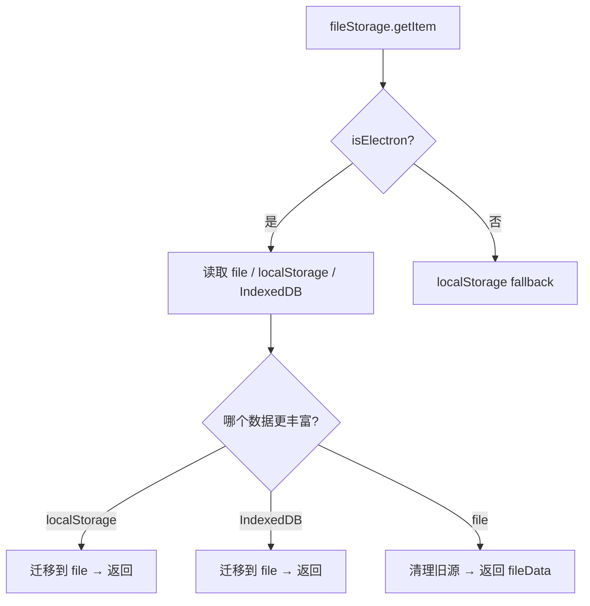
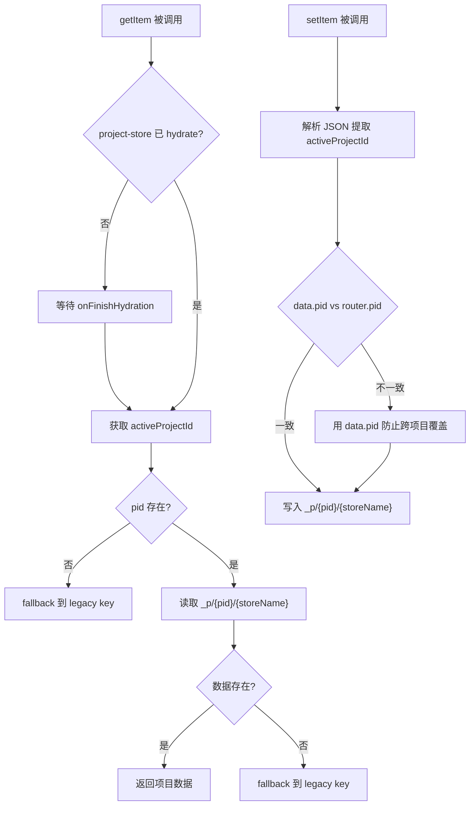
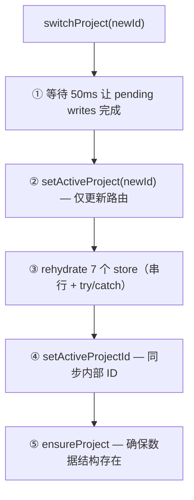

# PD-518.01 moyin-creator — 17 Store + 三层 Storage 适配器 + 项目级状态隔离

> 文档编号：PD-518.01
> 来源：moyin-creator `src/stores/`, `src/lib/project-storage.ts`, `src/lib/project-switcher.ts`
> GitHub：https://github.com/MemeCalculate/moyin-creator.git
> 问题域：PD-518 Zustand 状态管理架构
> 状态：可复用方案

---

## 第 1 章 问题与动机

### 1.1 核心问题

Electron 桌面应用中，多项目状态管理面临三个核心挑战：

1. **存储容量限制**：localStorage 5MB 上限无法承载含 base64 图片的分镜数据（单项目可达 100MB+），需要文件系统级持久化。
2. **项目隔离**：17 个 Zustand store 共享全局状态，切换项目时必须保证每个 store 的数据完整切换，不能出现 A 项目的分镜配上 B 项目的角色。
3. **版本迁移**：store schema 频繁演进（api-config-store 已到 v9），需要可靠的链式迁移机制，且不能丢失用户数据。

### 1.2 moyin-creator 的解法概述

1. **三层 Storage 适配器**：`fileStorage`（Electron IPC 文件系统）→ `createProjectScopedStorage`（项目级路由）→ `createSplitStorage`（项目/共享拆分），三层叠加实现从底层存储到项目隔离的完整链路（`src/lib/indexed-db-storage.ts:61`, `src/lib/project-storage.ts:61`, `src/lib/project-storage.ts:169`）。
2. **project-switcher 协调器**：集中管理 7 个 store 的 rehydrate 顺序，先更新路由再加载数据，避免空数据覆盖（`src/lib/project-switcher.ts:39`）。
3. **partialize 选择性序列化**：director-store 用 `stripBase64` 过滤 data: URL，避免 100MB+ JSON 写入磁盘（`src/stores/director-store.ts:1739`）。
4. **9 版本链式迁移**：api-config-store 实现 v0→v9 的完整迁移链，每个版本处理特定的 schema 变更（`src/stores/api-config-store.ts:864`）。
5. **onRehydrateStorage 恢复派生状态**：project-store 在 rehydrate 后自动恢复 `activeProject` 对象引用（`src/stores/project-store.ts:132`）。

### 1.3 设计思想

| 设计原则 | 具体实现 | 理由 | 替代方案 |
|----------|----------|------|----------|
| 存储层与业务层分离 | StateStorage 接口适配器模式 | Zustand persist 只关心 get/set/remove，底层可换 | 直接在 store 里写 fs 调用 |
| 项目数据物理隔离 | `_p/{projectId}/{storeName}` 文件路径 | 避免 JSON 内嵌套 projectId 导致的读写放大 | 单文件内按 projectId 分区 |
| 写入时数据清洗 | partialize + stripBase64 | base64 图片不应持久化到 JSON | 全量序列化后压缩 |
| 有序切换防竞态 | switchProject 先路由后 rehydrate 再同步 ID | 防止 persist 自动触发写入空数据 | 加锁或事务机制 |
| 渐进式迁移 | version + migrate 链式处理 | 用户可能从任意旧版本升级 | 一次性全量迁移 |

---

## 第 2 章 源码实现分析

### 2.1 架构概览

```
┌─────────────────────────────────────────────────────────────────┐
│                        17 Zustand Stores                        │
├──────────────┬──────────────┬──────────────┬───────────────────┤
│ project-store│ director-store│ script-store │ character-library │
│ api-config   │ media-store  │ scene-store  │ simple-timeline   │
│ freedom-store│ panel-store  │ preview-store│ theme-store       │
│ app-settings │ media-panel  │ sclass-store │ director-shot     │
│ director-presets (非 store)                                     │
├──────────────┴──────────────┴──────────────┴───────────────────┤
│                     Storage Adapter Layer                        │
├─────────────────┬──────────────────┬──────────────────────────┤
│ localStorage    │ ProjectScoped    │ SplitStorage             │
│ (api-config)    │ (script,director │ (media,character,scene)  │
│                 │  timeline,sclass)│                          │
├─────────────────┴──────────────────┴──────────────────────────┤
│                    fileStorage (底层)                            │
│  Electron: window.fileStorage IPC → 文件系统                    │
│  Browser:  localStorage fallback                                │
├───────────────────────────────────────────────────────────────┤
│                  project-switcher (协调器)                       │
│  switchProject() → setActiveProject → rehydrate×7 → syncId    │
└───────────────────────────────────────────────────────────────┘
```

三种 Storage 适配器的使用分布：
- **localStorage persist**：`api-config-store`（全局配置，不分项目）
- **createProjectScopedStorage**：`script-store`, `director-store`, `simple-timeline-store`, `sclass-store`（纯项目级数据）
- **createSplitStorage**：`media-store`, `character-library-store`, `scene-store`（项目数据 + 跨项目共享）

### 2.2 核心实现

#### 2.2.1 fileStorage — Electron 文件系统适配器



对应源码 `src/lib/indexed-db-storage.ts:61-156`：
```typescript
export const fileStorage: StateStorage = {
  getItem: async (name: string): Promise<string | null> => {
    if (isElectron()) {
      try {
        const fileData = await window.fileStorage!.getItem(name);
        const localData = localStorage.getItem(name);
        let idbData: string | null = null;
        try { idbData = await getFromIndexedDB(name); } catch (e) {}
        
        const fileHasData = hasRichData(fileData);
        const localHasData = hasRichData(localData);
        const idbHasData = hasRichData(idbData);
        
        // Priority: localStorage > IndexedDB > file (for migration)
        if (localHasData && !fileHasData) {
          await window.fileStorage!.setItem(name, localData!);
          localStorage.removeItem(name);
          return localData;
        }
        if (idbHasData && !fileHasData && !localHasData) {
          await window.fileStorage!.setItem(name, idbData!);
          await removeFromIndexedDB(name);
          return idbData;
        }
        if (fileHasData) {
          if (localData) localStorage.removeItem(name);
          if (idbData) await removeFromIndexedDB(name);
          return fileData;
        }
        return fileData || localData || idbData || null;
      } catch (error) { console.error('File storage getItem error:', error); }
    }
    return localStorage.getItem(name);
  },
  setItem: async (name: string, value: string): Promise<void> => {
    if (isElectron()) {
      try { await window.fileStorage!.setItem(name, value); return; }
      catch (error) { console.error('[Storage] File storage setItem error:', error); }
    }
    try { localStorage.setItem(name, value); }
    catch (error) { console.error('localStorage setItem error:', error); }
  },
};
```

关键设计：`hasRichData()` 函数通过检查数组长度和数据大小判断哪个存储源有"更丰富"的数据，实现从 localStorage/IndexedDB 到文件系统的自动迁移。

#### 2.2.2 createProjectScopedStorage — 项目级路由



对应源码 `src/lib/project-storage.ts:61-145`：
```typescript
export function createProjectScopedStorage(storeName: string): StateStorage {
  return {
    getItem: async (name: string): Promise<string | null> => {
      // 等待 project-store 完成 rehydration
      if (!useProjectStore.persist.hasHydrated()) {
        await new Promise<void>((resolve) => {
          const unsub = useProjectStore.persist.onFinishHydration(() => {
            unsub(); resolve();
          });
        });
      }
      const pid = getActiveProjectId();
      if (!pid) return fileStorage.getItem(name);
      const projectKey = `_p/${pid}/${storeName}`;
      const projectData = await fileStorage.getItem(projectKey);
      if (projectData) return projectData;
      // Fall back to legacy monolithic file
      return fileStorage.getItem(name);
    },
    setItem: async (name: string, value: string): Promise<void> => {
      // 从数据中提取 projectId，防止竞态条件下写错文件
      let dataProjectId: string | null = null;
      try {
        const parsed = JSON.parse(value);
        const state = parsed?.state ?? parsed;
        if (state?.activeProjectId) dataProjectId = state.activeProjectId;
      } catch {}
      const pid = dataProjectId || getActiveProjectId();
      if (!pid) { await fileStorage.setItem(name, value); return; }
      const projectKey = `_p/${pid}/${storeName}`;
      await fileStorage.setItem(projectKey, value);
    },
  };
}
```

关键防竞态设计：`setItem` 优先从序列化数据中提取 `activeProjectId`，而非依赖全局状态，避免项目切换过程中的写入错乱。

### 2.3 实现细节

#### project-switcher 的有序切换协议

`src/lib/project-switcher.ts:39-114` 实现了严格的 5 步切换协议：



为什么不能先设 ID 再 rehydrate？因为 Zustand persist 在 `set()` 时自动触发 `setItem`，如果先设了新 ID 但数据还是旧的，就会把旧数据（或空默认值）写入新项目的文件。

#### partialize + stripBase64 数据清洗

`src/stores/director-store.ts:1739-1776` 的 partialize 实现了两层过滤：

1. **stripBase64**：过滤 `data:` 开头的 base64 字符串，只保留 `local-image://` 和 `https://` URL
2. **单项目序列化**：只序列化当前活跃项目的数据，不写入所有项目

```typescript
partialize: (state) => {
  const stripBase64 = (val: string | null | undefined) => {
    if (!val) return val;
    if (typeof val === 'string' && val.startsWith('data:')) return '';
    return val;
  };
  const stripScene = (s: SplitScene): SplitScene => ({
    ...s,
    imageDataUrl: (stripBase64(s.imageDataUrl) ?? '') as string,
    endFrameImageUrl: stripBase64(s.endFrameImageUrl) as string | null,
    sceneReferenceImage: stripBase64(s.sceneReferenceImage) as string | undefined,
  });
  const pid = state.activeProjectId;
  let projectData = null;
  if (pid && state.projects[pid]) {
    const proj = state.projects[pid];
    projectData = {
      ...proj,
      storyboardImage: (stripBase64(proj.storyboardImage) ?? null),
      splitScenes: proj.splitScenes.map(stripScene),
      trailerScenes: proj.trailerScenes.map(stripScene),
    };
  }
  return { activeProjectId: pid, projectData, config: state.config };
}
```

#### api-config-store 的 9 版本迁移链

`src/stores/api-config-store.ts:864-1149` 实现了从 v0 到 v9 的完整迁移：

| 版本 | 迁移内容 |
|------|----------|
| v0/v1 → v2 | apiKeys 字典迁移到 IProvider 数组 |
| v2 → v3 | 确保 providers + featureBindings 存在 |
| v3 → v4 | RunningHub 模型 ID 更新为 AppId |
| v4/v5 → v6 | featureBindings 从 string 迁移到 string[] (多选) |
| v6 → v7 | 移除废弃供应商 (dik3, nanohajimi 等) |
| v8 → v9 | platform:model 绑定格式迁移到 id:model (修复多 custom 供应商 bug) |


---

## 第 3 章 迁移指南

### 3.1 迁移清单

**阶段 1：基础 Store + fileStorage 适配器**
- [ ] 安装 zustand：`pnpm add zustand`
- [ ] 实现 `fileStorage` 适配器（如果是 Electron 项目，需要 preload 暴露 `window.fileStorage` IPC）
- [ ] 创建第一个 store，使用 `persist` + `createJSONStorage(() => fileStorage)`
- [ ] 实现 `partialize` 过滤不需要持久化的字段

**阶段 2：项目级隔离**
- [ ] 实现 `createProjectScopedStorage(storeName)` 适配器
- [ ] 创建 `project-store` 管理项目列表和 activeProjectId
- [ ] 将业务 store 的 storage 切换为 `createProjectScopedStorage`
- [ ] 实现 `project-switcher.ts` 协调多 store rehydrate

**阶段 3：跨项目共享（可选）**
- [ ] 实现 `createSplitStorage(storeName, splitFn, mergeFn)` 适配器
- [ ] 为需要共享的 store（如角色库、素材库）配置 split/merge 函数

**阶段 4：版本迁移**
- [ ] 为每个 store 设置 `version` 号
- [ ] 实现 `migrate` 函数处理 schema 变更
- [ ] 测试从旧版本升级的完整路径

### 3.2 适配代码模板

#### 最小可用的 fileStorage 适配器（Electron）

```typescript
// lib/file-storage.ts
import type { StateStorage } from 'zustand/middleware';

declare global {
  interface Window {
    fileStorage?: {
      getItem: (key: string) => Promise<string | null>;
      setItem: (key: string, value: string) => Promise<boolean>;
      removeItem: (key: string) => Promise<boolean>;
    };
  }
}

const isElectron = () => typeof window !== 'undefined' && !!window.fileStorage;

export const fileStorage: StateStorage = {
  getItem: async (name) => {
    if (isElectron()) {
      return window.fileStorage!.getItem(name);
    }
    return localStorage.getItem(name);
  },
  setItem: async (name, value) => {
    if (isElectron()) {
      await window.fileStorage!.setItem(name, value);
      return;
    }
    localStorage.setItem(name, value);
  },
  removeItem: async (name) => {
    if (isElectron()) {
      await window.fileStorage!.removeItem(name);
      return;
    }
    localStorage.removeItem(name);
  },
};
```

#### 项目级 Storage 适配器

```typescript
// lib/project-storage.ts
import type { StateStorage } from 'zustand/middleware';
import { fileStorage } from './file-storage';
import { useProjectStore } from '@/stores/project-store';

export function createProjectScopedStorage(storeName: string): StateStorage {
  return {
    getItem: async (name) => {
      // 等待 project-store hydrate 完成
      if (!useProjectStore.persist.hasHydrated()) {
        await new Promise<void>((resolve) => {
          const unsub = useProjectStore.persist.onFinishHydration(() => {
            unsub(); resolve();
          });
        });
      }
      const pid = useProjectStore.getState().activeProjectId;
      if (!pid) return fileStorage.getItem(name);
      const key = `_p/${pid}/${storeName}`;
      return (await fileStorage.getItem(key)) ?? fileStorage.getItem(name);
    },
    setItem: async (name, value) => {
      // 从数据中提取 projectId 防竞态
      let dataPid: string | null = null;
      try {
        const s = JSON.parse(value)?.state;
        if (s?.activeProjectId) dataPid = s.activeProjectId;
      } catch {}
      const pid = dataPid || useProjectStore.getState().activeProjectId;
      if (!pid) { await fileStorage.setItem(name, value); return; }
      await fileStorage.setItem(`_p/${pid}/${storeName}`, value);
    },
    removeItem: async (name) => {
      const pid = useProjectStore.getState().activeProjectId;
      if (!pid) { await fileStorage.removeItem(name); return; }
      await fileStorage.removeItem(`_p/${pid}/${storeName}`);
    },
  };
}
```

#### project-switcher 协调器

```typescript
// lib/project-switcher.ts
import { useProjectStore } from '@/stores/project-store';
// import all project-scoped stores...

export async function switchProject(newId: string): Promise<void> {
  if (useProjectStore.getState().activeProjectId === newId) return;
  
  // 1. 等待 pending writes
  await new Promise((r) => setTimeout(r, 50));
  
  // 2. 更新路由（仅 project-store）
  useProjectStore.getState().setActiveProject(newId);
  
  // 3. 串行 rehydrate 所有项目级 store
  const stores = [useScriptStore, useDirectorStore, useMediaStore /* ... */];
  for (const store of stores) {
    try { await store.persist.rehydrate(); }
    catch (e) { console.warn('Rehydrate failed:', e); }
  }
  
  // 4. 同步内部 activeProjectId
  useDirectorStore.getState().setActiveProjectId(newId);
  useScriptStore.getState().setActiveProjectId(newId);
}
```

### 3.3 适用场景

| 场景 | 适用度 | 说明 |
|------|--------|------|
| Electron 多项目桌面应用 | ⭐⭐⭐ | 完美匹配，fileStorage + 项目隔离 |
| Web SPA 多租户 | ⭐⭐ | 可用 IndexedDB 替代 fileStorage |
| 移动端 React Native | ⭐⭐ | 可用 AsyncStorage 替代 fileStorage |
| 单项目简单应用 | ⭐ | 过度设计，直接用 localStorage persist 即可 |
| 需要实时同步的协作应用 | ⭐ | 缺少冲突解决机制，不适合多端同步 |

---

## 第 4 章 测试用例

```typescript
import { describe, it, expect, vi, beforeEach } from 'vitest';

// Mock fileStorage
const mockStorage = new Map<string, string>();
const fileStorage = {
  getItem: vi.fn(async (key: string) => mockStorage.get(key) ?? null),
  setItem: vi.fn(async (key: string, value: string) => { mockStorage.set(key, value); }),
  removeItem: vi.fn(async (key: string) => { mockStorage.delete(key); }),
};

describe('createProjectScopedStorage', () => {
  beforeEach(() => {
    mockStorage.clear();
    vi.clearAllMocks();
  });

  it('routes getItem to project-scoped path', async () => {
    // Setup: project-store has activeProjectId = 'proj-1'
    mockStorage.set('_p/proj-1/director', JSON.stringify({ state: { splitScenes: [1, 2] } }));
    
    const storage = createProjectScopedStorage('director');
    const result = await storage.getItem('moyin-director-store');
    
    expect(result).toContain('splitScenes');
    expect(fileStorage.getItem).toHaveBeenCalledWith('_p/proj-1/director');
  });

  it('falls back to legacy key when project file missing', async () => {
    mockStorage.set('moyin-director-store', JSON.stringify({ state: { legacy: true } }));
    
    const storage = createProjectScopedStorage('director');
    const result = await storage.getItem('moyin-director-store');
    
    expect(result).toContain('legacy');
  });

  it('extracts projectId from data to prevent race condition', async () => {
    const storage = createProjectScopedStorage('director');
    const data = JSON.stringify({ state: { activeProjectId: 'proj-2', scenes: [] } });
    
    await storage.setItem('moyin-director-store', data);
    
    // Should write to proj-2's path, not whatever getActiveProjectId returns
    expect(fileStorage.setItem).toHaveBeenCalledWith('_p/proj-2/director', data);
  });
});

describe('switchProject coordination', () => {
  it('rehydrates stores in correct order', async () => {
    const rehydrateOrder: string[] = [];
    
    // Mock stores with rehydrate tracking
    const mockStore = (name: string) => ({
      persist: {
        rehydrate: vi.fn(async () => { rehydrateOrder.push(name); }),
      },
      getState: () => ({
        setActiveProjectId: vi.fn(),
        ensureProject: vi.fn(),
      }),
    });
    
    await switchProject('new-project-id');
    
    // Verify: project-store updated BEFORE rehydrate
    expect(rehydrateOrder[0]).not.toBe('project-store');
    // Verify: all stores rehydrated
    expect(rehydrateOrder.length).toBeGreaterThanOrEqual(5);
  });
});

describe('partialize stripBase64', () => {
  it('strips data: URLs from splitScenes', () => {
    const scene = {
      id: 1,
      imageDataUrl: 'data:image/png;base64,iVBORw0KGgo...',
      imageHttpUrl: 'https://cdn.example.com/img.png',
      endFrameImageUrl: 'data:image/jpeg;base64,/9j/4AAQ...',
    };
    
    const stripped = stripScene(scene);
    
    expect(stripped.imageDataUrl).toBe('');
    expect(stripped.imageHttpUrl).toBe('https://cdn.example.com/img.png');
    expect(stripped.endFrameImageUrl).toBe('');
  });

  it('preserves non-base64 URLs', () => {
    const scene = {
      id: 1,
      imageDataUrl: 'local-image://abc123',
      sceneReferenceImage: 'https://example.com/ref.jpg',
    };
    
    const stripped = stripScene(scene);
    
    expect(stripped.imageDataUrl).toBe('local-image://abc123');
    expect(stripped.sceneReferenceImage).toBe('https://example.com/ref.jpg');
  });
});

describe('api-config-store migration', () => {
  it('migrates v1 apiKeys to v2 providers', () => {
    const v1State = {
      apiKeys: { memefast: 'sk-abc123', openai: 'sk-xyz789' },
    };
    
    const migrated = migrate(v1State, 1);
    
    expect(migrated.providers).toBeDefined();
    expect(migrated.providers.length).toBeGreaterThan(0);
    expect(migrated.providers[0].apiKey).toBeDefined();
    expect(migrated.featureBindings).toBeDefined();
  });

  it('migrates v5 string bindings to v6 array format', () => {
    const v5State = {
      featureBindings: {
        script_analysis: 'memefast:deepseek-v3',
        chat: null,
      },
    };
    
    const migrated = migrate(v5State, 5);
    
    expect(migrated.featureBindings.script_analysis).toEqual(['memefast:deepseek-v3']);
    expect(migrated.featureBindings.chat).toBeNull();
  });

  it('migrates v8 platform:model to v9 id:model', () => {
    const providers = [{ id: 'p1', platform: 'memefast', name: 'MemeFast' }];
    const v8State = {
      providers,
      featureBindings: {
        chat: ['memefast:deepseek-v3'],
      },
    };
    
    const migrated = migrate(v8State, 8);
    
    expect(migrated.featureBindings.chat[0]).toBe('p1:deepseek-v3');
  });
});
```


---

## 第 5 章 跨域关联

| 关联域 | 关系类型 | 说明 |
|--------|----------|------|
| PD-06 记忆持久化 | 协同 | fileStorage 适配器是持久化的底层实现，persist 中间件是 Zustand 层的持久化策略 |
| PD-04 工具系统 | 依赖 | api-config-store 管理 AI 供应商和模型绑定，是工具调用的配置源 |
| PD-10 中间件管道 | 协同 | Zustand persist 本身就是中间件模式，createProjectScopedStorage 是 Storage 层的中间件叠加 |
| PD-03 容错与重试 | 协同 | project-switcher 的 try/catch 串行 rehydrate 是容错设计，单个 store 失败不影响其他 store |
| PD-01 上下文管理 | 协同 | partialize + stripBase64 是上下文大小管理的持久化层体现，避免序列化膨胀 |

---

## 第 6 章 来源文件索引

| 文件 | 行范围 | 关键实现 |
|------|--------|----------|
| `src/lib/indexed-db-storage.ts` | L26-156 | fileStorage 适配器：Electron IPC + localStorage/IndexedDB 自动迁移 |
| `src/lib/project-storage.ts` | L61-145 | createProjectScopedStorage：项目级路由 + 竞态防护 |
| `src/lib/project-storage.ts` | L169-315 | createSplitStorage：项目/共享数据拆分与合并 |
| `src/lib/project-switcher.ts` | L39-114 | switchProject：5 步有序切换协议 |
| `src/stores/project-store.ts` | L35-143 | project-store：项目 CRUD + fileStorage persist + onRehydrateStorage |
| `src/stores/director-store.ts` | L560-1797 | director-store：项目级数据管理 + partialize stripBase64 |
| `src/stores/director-store.ts` | L1739-1796 | partialize + merge：单项目序列化 + legacy 格式兼容 |
| `src/stores/api-config-store.ts` | L316-1167 | api-config-store：localStorage persist + v0-v9 迁移链 |
| `src/stores/api-config-store.ts` | L1150-1164 | partialize：选择性序列化 11 个字段 |
| `src/stores/character-library-store.ts` | L1-80 | character-library-store：createSplitStorage 使用示例 |
| `src/stores/script-store.ts` | L1-80 | script-store：createProjectScopedStorage + 项目级数据结构 |

---

## 第 7 章 横向对比维度

```json comparison_data
{
  "project": "moyin-creator",
  "dimensions": {
    "Store 数量与粒度": "17 个独立 store，按业务域拆分（导演/剧本/角色/素材等）",
    "持久化策略": "三层 Storage 适配器：fileStorage → ProjectScoped → SplitStorage",
    "项目隔离机制": "_p/{projectId}/{storeName} 文件路径物理隔离",
    "版本迁移": "api-config-store 实现 v0→v9 链式 migrate，每版本独立处理",
    "序列化优化": "partialize + stripBase64 过滤 data: URL，避免 100MB+ JSON",
    "多 Store 协调": "project-switcher 5 步协议：路由→rehydrate×7→同步 ID",
    "跨项目共享": "createSplitStorage 拆分项目数据与共享数据到不同文件",
    "竞态防护": "setItem 从数据提取 projectId，不依赖全局状态"
  }
}
```

### 域元数据补充

```json domain_metadata
{
  "solution_summary": "moyin-creator 用三层 Storage 适配器（fileStorage→ProjectScoped→SplitStorage）+ project-switcher 5 步协议实现 17 个 Zustand store 的项目级物理隔离与有序切换",
  "description": "Electron 桌面应用中多项目状态的物理隔离、有序切换与大数据量序列化优化",
  "sub_problems": [
    "三层 Storage 适配器叠加与职责分离",
    "setItem 竞态条件下的跨项目数据覆盖防护",
    "base64 图片数据的序列化膨胀控制",
    "localStorage/IndexedDB 到文件系统的自动迁移",
    "9 版本链式 schema 迁移"
  ],
  "best_practices": [
    "setItem 从序列化数据提取 projectId 而非依赖全局状态防竞态",
    "partialize + stripBase64 过滤 data: URL 控制序列化体积",
    "switchProject 先路由后 rehydrate 再同步 ID 的有序协议",
    "hasRichData 启发式判断实现跨存储源自动迁移"
  ]
}
```
