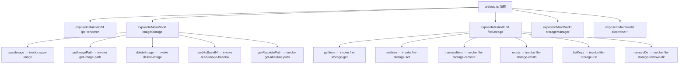
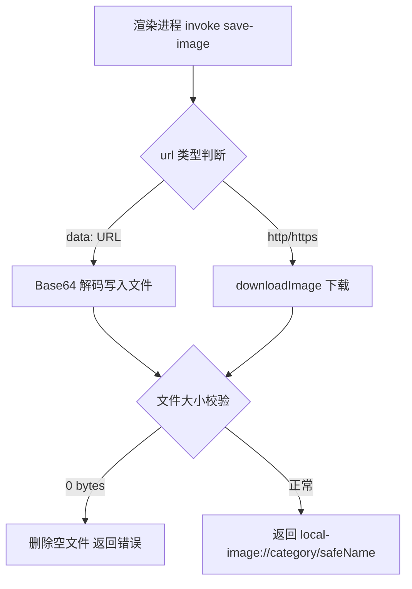
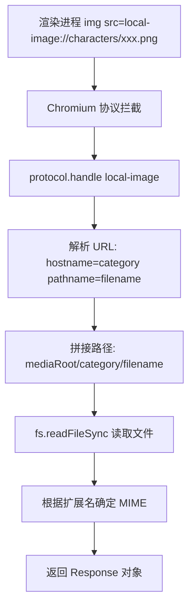

# PD-519.01 moyin-creator — 四命名空间 contextBridge 安全桥接与自定义协议媒体加载

> 文档编号：PD-519.01
> 来源：moyin-creator `electron/preload.ts` `electron/main.ts`
> GitHub：https://github.com/MemeCalculate/moyin-creator.git
> 问题域：PD-519 Electron IPC 安全桥接
> 状态：可复用方案

---

## 第 1 章 问题与动机

### 1.1 核心问题

Electron 应用的渲染进程运行在 Chromium 中，如果直接暴露 Node.js 的 `fs`、`path`、`child_process` 等模块，恶意网页脚本或 XSS 攻击可以直接读写用户文件系统。这是 Electron 安全模型中最关键的攻击面。

moyin-creator 是一个 Electron + React 的漫画创作工具，需要大量文件操作：图片下载保存、项目数据持久化、缓存管理、数据导入导出。如何在保证功能完整的前提下，让渲染进程完全无法直接访问 `fs`？

### 1.2 moyin-creator 的解法概述

1. **四命名空间 contextBridge 暴露**：通过 `preload.ts` 的 `contextBridge.exposeInMainWorld` 暴露 4 个功能命名空间（`imageStorage`、`fileStorage`、`storageManager`、`electronAPI`），每个命名空间只包含业务语义方法，不暴露底层 API（`electron/preload.ts:7-79`）
2. **IPC invoke 单向调用**：所有文件操作通过 `ipcRenderer.invoke` → `ipcMain.handle` 的请求-响应模式，渲染进程只能调用预定义的 channel，无法执行任意命令（`electron/main.ts:338-999`）
3. **自定义协议 `local-image://`**：注册特权协议用于媒体文件加载，避免 `file://` 协议的安全风险，同时支持 CSP bypass 和 Fetch API（`electron/main.ts:1067-1120`）
4. **三源存储降级**：渲染侧 `indexed-db-storage.ts` 实现 Electron 文件系统 → localStorage → IndexedDB 的三级降级，浏览器模式下自动回退（`src/lib/indexed-db-storage.ts:61-156`）
5. **TypeScript 全局类型声明**：通过 `declare global { interface Window }` 为每个命名空间提供完整类型，渲染侧代码获得类型安全（`src/types/electron.d.ts:6-23`、`src/lib/image-storage.ts:10-20`）

### 1.3 设计思想

| 设计原则 | 具体实现 | 理由 | 替代方案 |
|----------|----------|------|----------|
| 最小权限 | 每个命名空间只暴露业务方法，不暴露 fs/path | 渲染进程无法执行预定义之外的操作 | 暴露整个 ipcRenderer（不安全） |
| 功能内聚 | imageStorage 管图片、fileStorage 管数据、storageManager 管路径 | 职责清晰，API 表面积可控 | 单一 electronAPI 全包（难维护） |
| 协议隔离 | local-image:// 替代 file:// | 避免 file:// 的路径遍历风险 | 直接用 file:// + CSP 白名单 |
| 优雅降级 | isElectron() 检测 → 回退 localStorage | 支持浏览器预览模式 | 强制 Electron 环境 |
| 路径安全 | pathsConflict() + isSubdirectory() 校验 | 防止目录遍历和循环嵌套 | 信任用户输入 |

---

## 第 2 章 源码实现分析

### 2.1 架构概览

moyin-creator 的 IPC 安全桥接采用经典的 Electron 三进程隔离架构，preload 脚本作为唯一的桥梁：

```
┌─────────────────────────────────────────────────────────┐
│                    渲染进程 (Chromium)                     │
│                                                         │
│  window.imageStorage ──┐                                │
│  window.fileStorage  ──┤  contextBridge                 │
│  window.storageManager─┤  (序列化边界)                    │
│  window.electronAPI  ──┘                                │
│         │                                               │
│  src/lib/image-storage.ts  ← 业务封装层                   │
│  src/lib/indexed-db-storage.ts ← 存储适配层               │
│  src/lib/project-storage.ts ← 项目级路由层                │
└────────────┬────────────────────────────────────────────┘
             │ ipcRenderer.invoke (异步 IPC)
             ▼
┌─────────────────────────────────────────────────────────┐
│                   preload.ts (隔离沙箱)                    │
│  contextBridge.exposeInMainWorld('imageStorage', {...})  │
│  contextBridge.exposeInMainWorld('fileStorage', {...})   │
│  contextBridge.exposeInMainWorld('storageManager', {...})│
│  contextBridge.exposeInMainWorld('electronAPI', {...})   │
└────────────┬────────────────────────────────────────────┘
             │ ipcMain.handle (channel 路由)
             ▼
┌─────────────────────────────────────────────────────────┐
│                    主进程 (Node.js)                       │
│                                                         │
│  save-image / get-image-path / delete-image             │
│  read-image-base64 / get-absolute-path                  │
│  file-storage-get/set/remove/exists/list/remove-dir     │
│  storage-get-paths / storage-move-data / ...            │
│  save-file-dialog                                       │
│                                                         │
│  protocol.handle('local-image', ...) ← 自定义协议        │
│  fs / path / dialog / shell ← 仅主进程可用               │
└─────────────────────────────────────────────────────────┘
```

### 2.2 核心实现

#### 2.2.1 preload.ts — 四命名空间桥接



对应源码 `electron/preload.ts:7-79`：

```typescript
// 命名空间 1: 底层 IPC 通道（受限代理）
contextBridge.exposeInMainWorld('ipcRenderer', {
  on(...args: Parameters<typeof ipcRenderer.on>) {
    const [channel, listener] = args
    return ipcRenderer.on(channel, (event, ...args) => listener(event, ...args))
  },
  off(...args: Parameters<typeof ipcRenderer.off>) {
    const [channel, ...omit] = args
    return ipcRenderer.off(channel, ...omit)
  },
  send(...args: Parameters<typeof ipcRenderer.send>) {
    const [channel, ...omit] = args
    return ipcRenderer.send(channel, ...omit)
  },
  invoke(...args: Parameters<typeof ipcRenderer.invoke>) {
    const [channel, ...omit] = args
    return ipcRenderer.invoke(channel, ...omit)
  },
})

// 命名空间 2: 图片存储（5 个方法）
contextBridge.exposeInMainWorld('imageStorage', {
  saveImage: (url: string, category: string, filename: string) => 
    ipcRenderer.invoke('save-image', { url, category, filename }),
  getImagePath: (localPath: string) => 
    ipcRenderer.invoke('get-image-path', localPath),
  deleteImage: (localPath: string) => 
    ipcRenderer.invoke('delete-image', localPath),
  readAsBase64: (localPath: string) => 
    ipcRenderer.invoke('read-image-base64', localPath),
  getAbsolutePath: (localPath: string) => 
    ipcRenderer.invoke('get-absolute-path', localPath),
})

// 命名空间 3: 文件存储（6 个方法，类 KV 接口）
contextBridge.exposeInMainWorld('fileStorage', {
  getItem: (key: string) => ipcRenderer.invoke('file-storage-get', key),
  setItem: (key: string, value: string) => ipcRenderer.invoke('file-storage-set', key, value),
  removeItem: (key: string) => ipcRenderer.invoke('file-storage-remove', key),
  exists: (key: string) => ipcRenderer.invoke('file-storage-exists', key),
  listKeys: (prefix: string) => ipcRenderer.invoke('file-storage-list', prefix),
  removeDir: (prefix: string) => ipcRenderer.invoke('file-storage-remove-dir', prefix),
})

// 命名空间 4: 存储管理（路径、缓存、导入导出）
contextBridge.exposeInMainWorld('storageManager', {
  getPaths: () => ipcRenderer.invoke('storage-get-paths'),
  selectDirectory: () => ipcRenderer.invoke('storage-select-directory'),
  validateDataDir: (dirPath: string) => ipcRenderer.invoke('storage-validate-data-dir', dirPath),
  moveData: (newPath: string) => ipcRenderer.invoke('storage-move-data', newPath),
  linkData: (dirPath: string) => ipcRenderer.invoke('storage-link-data', dirPath),
  exportData: (targetPath: string) => ipcRenderer.invoke('storage-export-data', targetPath),
  importData: (sourcePath: string) => ipcRenderer.invoke('storage-import-data', sourcePath),
  getCacheSize: () => ipcRenderer.invoke('storage-get-cache-size'),
  clearCache: (options?: { olderThanDays?: number }) => ipcRenderer.invoke('storage-clear-cache', options),
  updateConfig: (config: { autoCleanEnabled?: boolean; autoCleanDays?: number }) =>
    ipcRenderer.invoke('storage-update-config', config),
})
```

#### 2.2.2 主进程 IPC Handler — 图片存储



对应源码 `electron/main.ts:338-373`：

```typescript
ipcMain.handle('save-image', async (_event, { url, category, filename }) => {
  try {
    const imagesDir = getImagesDir(category)
    const ext = path.extname(filename) || '.png'
    // 安全文件名：时间戳 + 随机字符串，防止路径注入
    const safeName = `${Date.now()}_${Math.random().toString(36).substring(2, 8)}${ext}`
    const filePath = path.join(imagesDir, safeName)
    
    // data: URL — 直接解码 base64 写入文件（canvas 切割产物）
    if (url.startsWith('data:')) {
      const matches = url.match(/^data:[^;]+;base64,(.+)$/s)
      if (!matches) {
        return { success: false, error: 'Invalid data URL format' }
      }
      const buffer = Buffer.from(matches[1], 'base64')
      if (buffer.length === 0) {
        return { success: false, error: 'Decoded base64 data is empty (0 bytes)' }
      }
      fs.writeFileSync(filePath, buffer)
    } else {
      await downloadImage(url, filePath)
    }
    
    // 零字节校验 — 防止空文件污染存储
    const stat = fs.statSync(filePath)
    if (stat.size === 0) {
      fs.unlinkSync(filePath)
      return { success: false, error: 'Saved file is 0 bytes' }
    }
    
    return { success: true, localPath: `local-image://${category}/${safeName}` }
  } catch (error) {
    return { success: false, error: String(error) }
  }
})
```

#### 2.2.3 自定义协议 local-image://



对应源码 `electron/main.ts:1067-1120`：

```typescript
// 注册为特权协议（必须在 app.ready 之前）
protocol.registerSchemesAsPrivileged([{
  scheme: 'local-image',
  privileges: {
    secure: true,          // 被视为安全来源
    supportFetchAPI: true, // 支持 fetch() 调用
    bypassCSP: true,       // 绕过 CSP 限制
    stream: true,          // 支持流式传输
  }
}])

app.whenReady().then(() => {
  protocol.handle('local-image', async (request) => {
    try {
      const url = new URL(request.url)
      const category = url.hostname
      const filename = decodeURIComponent(url.pathname.slice(1))
      const filePath = path.join(getMediaRoot(), category, filename)
      
      const data = fs.readFileSync(filePath)
      
      const ext = path.extname(filename).toLowerCase()
      const mimeTypes: Record<string, string> = {
        '.png': 'image/png', '.jpg': 'image/jpeg', '.jpeg': 'image/jpeg',
        '.gif': 'image/gif', '.webp': 'image/webp', '.svg': 'image/svg+xml',
        '.mp4': 'video/mp4', '.webm': 'video/webm', '.mov': 'video/quicktime',
      }
      const mimeType = mimeTypes[ext] || 'application/octet-stream'
      
      return new Response(data, {
        headers: { 'Content-Type': mimeType }
      })
    } catch (error) {
      return new Response('Image not found', { status: 404 })
    }
  })
})
```

### 2.3 实现细节

**路径安全校验**（`electron/main.ts:144-165`）：`pathsConflict()` 和 `isSubdirectory()` 在数据迁移时防止目录循环嵌套。

**三源存储降级**（`src/lib/indexed-db-storage.ts:61-124`）：`fileStorage.getItem` 同时检查 Electron 文件系统、localStorage、IndexedDB 三个数据源，自动将最丰富的数据迁移到文件系统，并清理旧源。

**安全文件名生成**（`electron/main.ts:342`）：`${Date.now()}_${Math.random().toString(36).substring(2, 8)}${ext}` 用时间戳+随机串替代用户提供的文件名，防止路径注入。

**导入回滚机制**（`electron/main.ts:731-808`）：`storage-import-data` handler 在导入前创建临时备份，导入失败时自动回滚到备份数据。


---

## 第 3 章 迁移指南

### 3.1 迁移清单

**阶段 1：基础 IPC 桥接**
- [ ] 创建 `preload.ts`，用 `contextBridge.exposeInMainWorld` 暴露命名空间
- [ ] 在 `main.ts` 的 `BrowserWindow` 配置中指定 preload 路径
- [ ] 确保 `nodeIntegration: false`（Electron 默认值）和 `contextIsolation: true`（默认值）
- [ ] 为每个命名空间创建 TypeScript 全局类型声明

**阶段 2：文件存储 IPC**
- [ ] 实现 `file-storage-get/set/remove/exists/list` 五个 ipcMain.handle
- [ ] 渲染侧创建 `StateStorage` 适配器，对接 Zustand persist
- [ ] 添加 `isElectron()` 检测，浏览器模式回退 localStorage

**阶段 3：媒体存储 + 自定义协议**
- [ ] 实现 `save-image` handler（支持 data: URL 和 http/https）
- [ ] 注册 `local-image://` 自定义协议（`registerSchemesAsPrivileged` + `protocol.handle`）
- [ ] 渲染侧创建 `image-storage.ts` 封装层

**阶段 4：存储管理**
- [ ] 实现路径选择、数据迁移、导入导出 handler
- [ ] 添加路径安全校验（`pathsConflict`、`isSubdirectory`）
- [ ] 实现导入回滚机制

### 3.2 适配代码模板

#### 最小可用 preload.ts

```typescript
import { ipcRenderer, contextBridge } from 'electron'

// 命名空间 1: 文件存储（KV 接口）
contextBridge.exposeInMainWorld('fileStorage', {
  getItem: (key: string) => ipcRenderer.invoke('fs:get', key),
  setItem: (key: string, value: string) => ipcRenderer.invoke('fs:set', key, value),
  removeItem: (key: string) => ipcRenderer.invoke('fs:remove', key),
})

// 命名空间 2: 媒体存储
contextBridge.exposeInMainWorld('mediaStorage', {
  saveFile: (data: string, category: string, ext: string) =>
    ipcRenderer.invoke('media:save', { data, category, ext }),
  getPath: (localUri: string) =>
    ipcRenderer.invoke('media:path', localUri),
  delete: (localUri: string) =>
    ipcRenderer.invoke('media:delete', localUri),
})
```

#### 最小可用 main.ts handler

```typescript
import { ipcMain, app } from 'electron'
import fs from 'node:fs'
import path from 'node:path'
import crypto from 'node:crypto'

const dataDir = () => path.join(app.getPath('userData'), 'data')

// 文件存储 handler
ipcMain.handle('fs:get', async (_e, key: string) => {
  const fp = path.join(dataDir(), `${key}.json`)
  return fs.existsSync(fp) ? fs.readFileSync(fp, 'utf-8') : null
})

ipcMain.handle('fs:set', async (_e, key: string, value: string) => {
  const fp = path.join(dataDir(), `${key}.json`)
  fs.mkdirSync(path.dirname(fp), { recursive: true })
  fs.writeFileSync(fp, value, 'utf-8')
  return true
})

ipcMain.handle('fs:remove', async (_e, key: string) => {
  const fp = path.join(dataDir(), `${key}.json`)
  if (fs.existsSync(fp)) fs.unlinkSync(fp)
  return true
})

// 媒体存储 handler（安全文件名）
ipcMain.handle('media:save', async (_e, { data, category, ext }) => {
  const mediaDir = path.join(app.getPath('userData'), 'media', category)
  fs.mkdirSync(mediaDir, { recursive: true })
  const safeName = `${Date.now()}_${crypto.randomBytes(4).toString('hex')}${ext}`
  const fp = path.join(mediaDir, safeName)
  
  if (data.startsWith('data:')) {
    const base64 = data.replace(/^data:[^;]+;base64,/, '')
    fs.writeFileSync(fp, Buffer.from(base64, 'base64'))
  }
  // 零字节校验
  if (fs.statSync(fp).size === 0) {
    fs.unlinkSync(fp)
    return { success: false, error: 'Empty file' }
  }
  return { success: true, uri: `app-media://${category}/${safeName}` }
})
```

#### Zustand StateStorage 适配器

```typescript
import type { StateStorage } from 'zustand/middleware'

const isElectron = () => typeof window !== 'undefined' && !!window.fileStorage

export const electronStorage: StateStorage = {
  getItem: async (name) => {
    if (isElectron()) {
      return window.fileStorage!.getItem(name)
    }
    return localStorage.getItem(name)
  },
  setItem: async (name, value) => {
    if (isElectron()) {
      await window.fileStorage!.setItem(name, value)
      return
    }
    localStorage.setItem(name, value)
  },
  removeItem: async (name) => {
    if (isElectron()) {
      await window.fileStorage!.removeItem(name)
      return
    }
    localStorage.removeItem(name)
  },
}
```

### 3.3 适用场景

| 场景 | 适用度 | 说明 |
|------|--------|------|
| Electron + React/Vue 桌面应用 | ⭐⭐⭐ | 完美匹配，直接复用 |
| Electron + 大量本地文件操作 | ⭐⭐⭐ | 自定义协议 + IPC 是标准做法 |
| Electron + Web 双端发布 | ⭐⭐⭐ | isElectron() 降级模式天然支持 |
| Tauri 应用 | ⭐⭐ | Tauri 有自己的 IPC 机制，但命名空间思路可借鉴 |
| 纯 Web 应用 | ⭐ | 不需要 IPC，但 KV 存储适配器模式可复用 |

---

## 第 4 章 测试用例

```typescript
import { describe, it, expect, vi, beforeEach } from 'vitest'

// Mock window.fileStorage
const mockFileStorage = {
  getItem: vi.fn(),
  setItem: vi.fn(),
  removeItem: vi.fn(),
  exists: vi.fn(),
  listKeys: vi.fn(),
  removeDir: vi.fn(),
}

// Mock window.imageStorage
const mockImageStorage = {
  saveImage: vi.fn(),
  getImagePath: vi.fn(),
  deleteImage: vi.fn(),
  readAsBase64: vi.fn(),
  getAbsolutePath: vi.fn(),
}

describe('IPC Bridge — fileStorage namespace', () => {
  beforeEach(() => {
    vi.clearAllMocks()
    Object.defineProperty(window, 'fileStorage', { value: mockFileStorage, writable: true })
  })

  it('getItem returns stored JSON data', async () => {
    const data = JSON.stringify({ state: { projects: [] }, version: 1 })
    mockFileStorage.getItem.mockResolvedValue(data)
    
    const result = await window.fileStorage!.getItem('moyin-project-store')
    expect(result).toBe(data)
    expect(mockFileStorage.getItem).toHaveBeenCalledWith('moyin-project-store')
  })

  it('setItem writes data and returns true', async () => {
    mockFileStorage.setItem.mockResolvedValue(true)
    
    const result = await window.fileStorage!.setItem('test-key', '{"data":1}')
    expect(result).toBe(true)
    expect(mockFileStorage.setItem).toHaveBeenCalledWith('test-key', '{"data":1}')
  })

  it('getItem returns null for non-existent key', async () => {
    mockFileStorage.getItem.mockResolvedValue(null)
    
    const result = await window.fileStorage!.getItem('non-existent')
    expect(result).toBeNull()
  })

  it('listKeys returns filtered JSON keys under prefix', async () => {
    mockFileStorage.listKeys.mockResolvedValue(['_p/abc/script', '_p/abc/director'])
    
    const result = await window.fileStorage!.listKeys('_p/abc')
    expect(result).toHaveLength(2)
    expect(result[0]).toBe('_p/abc/script')
  })
})

describe('IPC Bridge — imageStorage namespace', () => {
  beforeEach(() => {
    vi.clearAllMocks()
    Object.defineProperty(window, 'imageStorage', { value: mockImageStorage, writable: true })
  })

  it('saveImage with data: URL returns local-image:// path', async () => {
    mockImageStorage.saveImage.mockResolvedValue({
      success: true,
      localPath: 'local-image://characters/1234_abc.png',
    })
    
    const result = await window.imageStorage!.saveImage(
      'data:image/png;base64,iVBOR...', 'characters', 'avatar.png'
    )
    expect(result.success).toBe(true)
    expect(result.localPath).toMatch(/^local-image:\/\/characters\//)
  })

  it('saveImage returns error for empty base64', async () => {
    mockImageStorage.saveImage.mockResolvedValue({
      success: false,
      error: 'Decoded base64 data is empty (0 bytes)',
    })
    
    const result = await window.imageStorage!.saveImage(
      'data:image/png;base64,', 'characters', 'empty.png'
    )
    expect(result.success).toBe(false)
    expect(result.error).toContain('empty')
  })

  it('readAsBase64 returns data URL with MIME type', async () => {
    mockImageStorage.readAsBase64.mockResolvedValue({
      success: true,
      base64: 'data:image/png;base64,iVBOR...',
      mimeType: 'image/png',
      size: 1024,
    })
    
    const result = await window.imageStorage!.readAsBase64('local-image://characters/test.png')
    expect(result.success).toBe(true)
    expect(result.base64).toMatch(/^data:image\/png;base64,/)
  })
})

describe('Path Safety — isSubdirectory & pathsConflict', () => {
  // 模拟主进程的路径校验逻辑
  function isSubdirectory(parent: string, child: string): boolean {
    const normalizedParent = parent.toLowerCase() + '/'
    const normalizedChild = child.toLowerCase() + '/'
    return normalizedChild.startsWith(normalizedParent)
  }

  function pathsConflict(source: string, dest: string): string | null {
    if (source.toLowerCase() === dest.toLowerCase()) return null
    if (isSubdirectory(source, dest)) return '目标路径不能是当前路径的子目录'
    if (isSubdirectory(dest, source)) return '当前路径不能是目标路径的子目录'
    return null
  }

  it('detects child directory conflict', () => {
    expect(pathsConflict('/data', '/data/sub')).toBe('目标路径不能是当前路径的子目录')
  })

  it('detects parent directory conflict', () => {
    expect(pathsConflict('/data/sub', '/data')).toBe('当前路径不能是目标路径的子目录')
  })

  it('allows unrelated paths', () => {
    expect(pathsConflict('/data/a', '/data/b')).toBeNull()
  })

  it('allows same path', () => {
    expect(pathsConflict('/data', '/data')).toBeNull()
  })
})
```


---

## 第 5 章 跨域关联

| 关联域 | 关系类型 | 说明 |
|--------|----------|------|
| PD-06 记忆持久化 | 强依赖 | fileStorage 命名空间是 Zustand persist 的底层存储后端，项目级路由（`project-storage.ts`）和三源降级（`indexed-db-storage.ts`）都建立在 IPC 桥接之上 |
| PD-482 Electron 混合存储 | 协同 | PD-482 关注 Electron 环境下 localStorage/IndexedDB/文件系统的混合存储策略，PD-519 关注这些存储如何通过安全 IPC 桥接暴露给渲染进程 |
| PD-484 Store 版本迁移 | 协同 | `storage-migration.ts` 的迁移逻辑通过 fileStorage IPC 命名空间执行，迁移的安全性依赖 IPC 隔离 |
| PD-478 项目级状态 | 协同 | `createProjectScopedStorage` 和 `createSplitStorage` 通过 fileStorage IPC 实现项目级数据隔离路由 |
| PD-04 工具系统 | 类比 | IPC channel 注册模式类似工具系统的工具注册，每个 handler 是一个"工具"，preload 是"工具目录" |

---

## 第 6 章 来源文件索引

| 文件 | 行范围 | 关键实现 |
|------|--------|----------|
| `electron/preload.ts` | L7-L79 | 四命名空间 contextBridge 暴露，16 个 IPC 方法映射 |
| `electron/main.ts` | L31-L41 | BrowserWindow 创建，preload 路径配置 |
| `electron/main.ts` | L89-L165 | StorageConfig 类型定义、路径安全校验函数 |
| `electron/main.ts` | L338-L373 | save-image handler：data URL 解码、下载、零字节校验 |
| `electron/main.ts` | L375-L458 | get-image-path / delete-image / read-image-base64 / get-absolute-path handler |
| `electron/main.ts` | L469-L547 | file-storage-get/set/remove/exists/list/remove-dir handler |
| `electron/main.ts` | L549-L953 | storageManager 相关 handler：路径管理、数据迁移、导入导出、缓存清理 |
| `electron/main.ts` | L956-L999 | save-file-dialog handler |
| `electron/main.ts` | L1067-L1075 | registerSchemesAsPrivileged 自定义协议注册 |
| `electron/main.ts` | L1083-L1120 | protocol.handle local-image 协议处理 |
| `src/types/electron.d.ts` | L6-L23 | storageManager 全局类型声明 |
| `src/lib/image-storage.ts` | L10-L20 | imageStorage 全局类型声明 |
| `src/lib/image-storage.ts` | L27-L63 | isElectron() 检测 + saveImageToLocal 封装 |
| `src/lib/indexed-db-storage.ts` | L13-L24 | fileStorage 全局类型声明 |
| `src/lib/indexed-db-storage.ts` | L61-L156 | 三源存储降级适配器（Electron fs → localStorage → IndexedDB） |
| `src/lib/project-storage.ts` | L61-L145 | createProjectScopedStorage：项目级 IPC 路由 |
| `src/lib/storage-migration.ts` | L23-L103 | migrateToProjectStorage：基于 IPC 的数据迁移 |

---

## 第 7 章 横向对比维度

```json comparison_data
{
  "project": "moyin-creator",
  "dimensions": {
    "桥接架构": "contextBridge 四命名空间（imageStorage/fileStorage/storageManager/electronAPI）",
    "IPC 模式": "invoke/handle 请求-响应，16 个预定义 channel",
    "协议设计": "自定义 local-image:// 特权协议，支持 Fetch API + CSP bypass",
    "安全措施": "安全文件名生成 + 路径冲突校验 + 零字节校验 + 导入回滚",
    "降级策略": "isElectron() 检测，三源降级（fs → localStorage → IndexedDB）",
    "类型安全": "declare global Window 接口扩展，渲染侧完整类型推导"
  }
}
```

### 域元数据补充

```json domain_metadata
{
  "solution_summary": "moyin-creator 通过 contextBridge 暴露 4 个功能命名空间（16 个 IPC 方法），配合 local-image:// 自定义特权协议和三源存储降级，实现渲染进程零 fs 访问的安全桥接",
  "description": "Electron 渲染进程与主进程之间的安全通信边界设计与协议隔离",
  "sub_problems": [
    "自定义特权协议注册与 MIME 类型映射",
    "IPC 数据迁移的回滚与幂等性保证",
    "多存储源（fs/localStorage/IndexedDB）自动降级与数据迁移"
  ],
  "best_practices": [
    "安全文件名生成（时间戳+随机串）防路径注入",
    "导入操作先备份后执行，失败自动回滚",
    "路径冲突校验防止目录循环嵌套"
  ]
}
```

