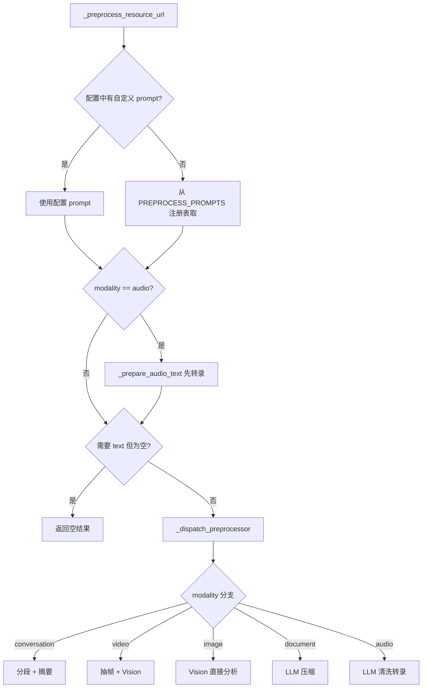
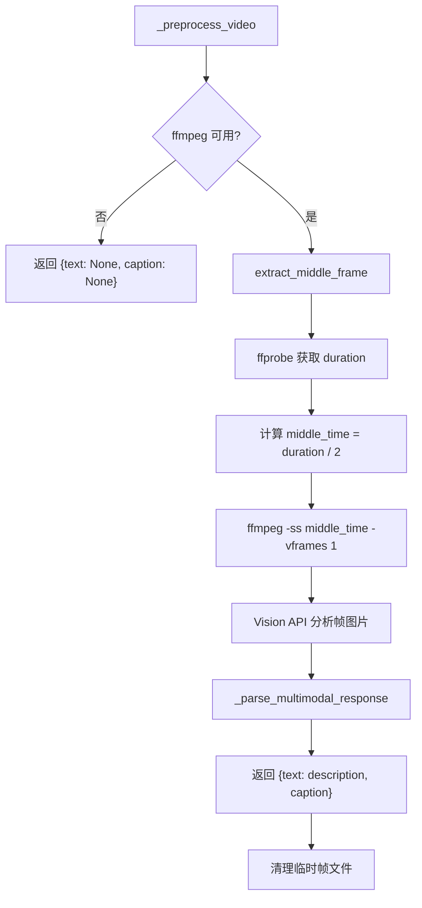
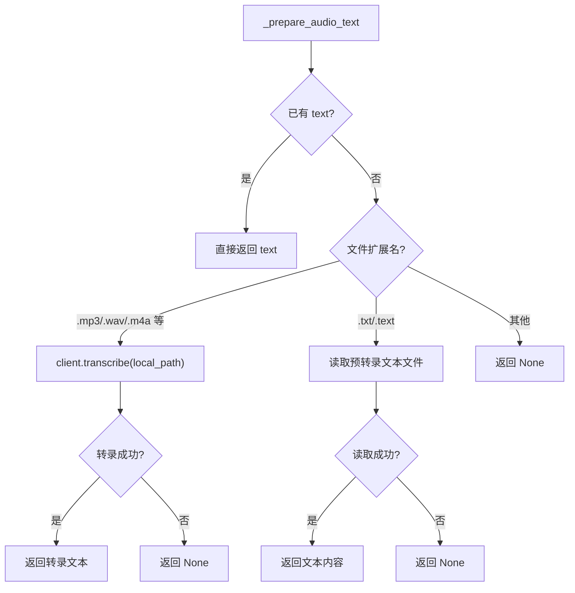

# PD-520.01 memU — 五模态预处理管道与 LLM 驱动模态归一化

> 文档编号：PD-520.01
> 来源：memU `src/memu/app/memorize.py` `src/memu/prompts/preprocess/`
> GitHub：https://github.com/NevaMind-AI/memU.git
> 问题域：PD-520 多模态预处理 Multimodal Preprocessing
> 状态：可复用方案

---

## 第 1 章 问题与动机

### 1.1 核心问题

记忆系统需要处理多种输入模态（文本、对话、图片、音频、视频），但下游的记忆提取、分类、去重等环节只能消费文本。如何将异构模态统一转化为高质量文本表示，同时保留每种模态的关键语义信息？

这个问题的难点在于：
- **模态差异巨大**：图片是像素矩阵，音频是波形信号，视频是时序帧序列，对话是多轮结构化文本——每种模态需要完全不同的预处理策略
- **信息损失控制**：模态转换必然丢失信息，需要通过精心设计的 prompt 最大化保留语义
- **统一输出接口**：下游管道不应关心输入是什么模态，预处理层必须输出统一的 `{text, caption}` 结构
- **外部依赖管理**：视频处理依赖 ffmpeg，音频转录依赖 LLM transcribe API，需要优雅处理依赖缺失

### 1.2 memU 的解法概述

memU 实现了一个五模态（conversation/document/image/audio/video）预处理管道，核心设计：

1. **Prompt 注册表模式**：每种模态对应一个独立的 prompt 模块（`src/memu/prompts/preprocess/__init__.py:3-9`），通过 `PREPROCESS_PROMPTS` 字典统一注册，支持配置覆盖
2. **两阶段音频处理**：音频先通过 `client.transcribe()` 转录为文本，再经 LLM 清洗格式化（`memorize.py:737-770`）
3. **中帧提取策略**：视频不做全帧分析，而是提取中间帧（duration/2 时刻）送 Vision API 分析（`video.py:77-78`）
4. **XML 标签解析协议**：所有模态的 LLM 输出统一使用 `<tag>content</tag>` 格式，由 `_parse_multimodal_response` 统一解析（`memorize.py:1146-1166`）
5. **WorkflowStep 集成**：预处理作为 memorize 工作流的第二步（`preprocess_multimodal`），通过 `requires/produces` 声明式依赖管理（`memorize.py:107-115`）

### 1.3 设计思想

| 设计原则 | 具体实现 | 理由 | 替代方案 |
|----------|----------|------|----------|
| 模态归一化 | 所有模态输出统一 `{text, caption}` 结构 | 下游管道无需感知模态差异 | 为每种模态设计不同的下游处理 |
| Prompt 即配置 | 每种模态的 prompt 独立文件，支持用户覆盖 | 预处理行为可调优而无需改代码 | 硬编码 prompt 在处理函数中 |
| 最小外部依赖 | ffmpeg 不可用时优雅降级返回 None | 视频处理是可选能力，不应阻塞其他模态 | 强制要求安装 ffmpeg |
| 对话分段 | LLM 识别话题边界，每段 ≥20 条消息 | 长对话拆分为语义连贯的记忆单元 | 固定长度切分 |
| 安全路径处理 | `_ensure_safe_cli_path` 拒绝 `-` 开头路径 | 防止 CLI 参数注入攻击 | 不做路径校验 |

---

## 第 2 章 源码实现分析

### 2.1 架构概览

memU 的多模态预处理管道嵌入在 memorize 工作流中，作为 7 步工作流的第 2 步：

```
┌──────────────┐    ┌─────────────────────┐    ┌───────────────┐
│ 1. ingest    │───→│ 2. preprocess_multi │───→│ 3. extract    │
│  (fetch file)│    │  modal (本文核心)     │    │  (记忆提取)    │
└──────────────┘    └─────────────────────┘    └───────────────┘
                              │
                    ┌─────────┼─────────┐
                    ▼         ▼         ▼
              ┌──────┐  ┌──────┐  ┌──────┐
              │ text │  │media │  │audio │
              │ path │  │ path │  │ path │
              └──┬───┘  └──┬───┘  └──┬───┘
                 │         │         │
                 ▼         ▼         ▼
            ┌────────┐ ┌────────┐ ┌────────┐
            │LLM chat│ │Vision  │ │transcr.│
            │        │ │  API   │ │+ chat  │
            └────┬───┘ └────┬───┘ └────┬───┘
                 │         │         │
                 └─────────┼─────────┘
                           ▼
                   {text, caption}[]
```

预处理管道内部的模态路由：

```
_preprocess_resource_url()
  ├── 解析 prompt 模板（配置优先 → 注册表兜底）
  ├── audio? → _prepare_audio_text() 先转录
  ├── text 模态需要 text? → 校验
  └── _dispatch_preprocessor()
        ├── conversation → _preprocess_conversation() → 分段 + 摘要
        ├── video → _preprocess_video() → 抽帧 + Vision
        ├── image → _preprocess_image() → Vision
        ├── document → _preprocess_document() → 压缩
        ├── audio → _preprocess_audio() → 清洗转录
        └── fallback → {text, None}
```

### 2.2 核心实现

#### 2.2.1 Prompt 注册表与模态路由



对应源码 `src/memu/prompts/preprocess/__init__.py:1-11`：

```python
from memu.prompts.preprocess import audio, conversation, document, image, video

PROMPTS: dict[str, str] = {
    "conversation": conversation.PROMPT.strip(),
    "video": video.PROMPT.strip(),
    "image": image.PROMPT.strip(),
    "document": document.PROMPT.strip(),
    "audio": audio.PROMPT.strip(),
}

__all__ = ["PROMPTS"]
```

对应源码 `src/memu/app/memorize.py:775-794`（调度器）：

```python
async def _dispatch_preprocessor(
    self,
    *,
    modality: str,
    local_path: str,
    text: str | None,
    template: str,
    llm_client: Any | None = None,
) -> list[dict[str, str | None]]:
    if modality == "conversation" and text is not None:
        return await self._preprocess_conversation(text, template, llm_client=llm_client)
    if modality == "video":
        return await self._preprocess_video(local_path, template, llm_client=llm_client)
    if modality == "image":
        return await self._preprocess_image(local_path, template, llm_client=llm_client)
    if modality == "document" and text is not None:
        return await self._preprocess_document(text, template, llm_client=llm_client)
    if modality == "audio" and text is not None:
        return await self._preprocess_audio(text, template, llm_client=llm_client)
    return [{"text": text, "caption": None}]
```

#### 2.2.2 视频帧提取与 Vision 分析



对应源码 `src/memu/utils/video.py:31-118`（核心抽帧逻辑）：

```python
@staticmethod
def extract_middle_frame(video_path: str, output_path: str | None = None) -> str:
    if not VideoFrameExtractor.is_ffmpeg_available():
        msg = "ffmpeg is not available. Please install ffmpeg to process videos."
        raise RuntimeError(msg)

    video_path_obj = VideoFrameExtractor._resolve_existing_path(video_path, description="Video file")
    safe_video_path = str(video_path_obj)

    # Create output path if not provided
    created_temp_file = False
    if output_path is None:
        with tempfile.NamedTemporaryFile(suffix=".jpg", delete=False) as tmp_file:
            output_path = tmp_file.name
        created_temp_file = True

    # Get video duration via ffprobe
    duration_cmd = [
        "ffprobe", "-v", "error",
        "-show_entries", "format=duration",
        "-of", "default=noprint_wrappers=1:nokey=1",
        safe_video_path,
    ]
    duration_result = VideoFrameExtractor._run_ffmpeg_command(duration_cmd, timeout=30)
    duration = float(duration_result.stdout.strip())
    middle_time = duration / 2

    # Extract frame at middle timestamp
    extract_cmd = [
        "ffmpeg", "-ss", str(middle_time),
        "-i", safe_video_path,
        "-vframes", "1", "-q:v", "2", "-y",
        safe_output_path,
    ]
    VideoFrameExtractor._run_ffmpeg_command(extract_cmd, timeout=30)
    return str(output_path_obj)
```

#### 2.2.3 音频两阶段处理



对应源码 `src/memu/app/memorize.py:737-770`：

```python
async def _prepare_audio_text(self, local_path: str, text: str | None,
                               llm_client: Any | None = None) -> str | None:
    """Ensure audio resources provide text either via transcription or file read."""
    if text:
        return text

    audio_extensions = {".mp3", ".mp4", ".mpeg", ".mpga", ".m4a", ".wav", ".webm"}
    text_extensions = {".txt", ".text"}
    file_ext = pathlib.Path(local_path).suffix.lower()

    if file_ext in audio_extensions:
        try:
            logger.info(f"Transcribing audio file: {local_path}")
            client = llm_client or self._get_llm_client()
            transcribed = cast(str, await client.transcribe(local_path))
            logger.info(f"Audio transcription completed: {len(transcribed)} characters")
        except Exception:
            logger.exception("Audio transcription failed for %s", local_path)
            return None
        else:
            return transcribed

    if file_ext in text_extensions:
        path_obj = pathlib.Path(local_path)
        try:
            text_content = path_obj.read_text(encoding="utf-8")
        except Exception:
            logger.exception("Failed to read text file %s", local_path)
            return None
        else:
            return text_content

    logger.warning(f"Unknown audio file type: {file_ext}, skipping transcription")
    return None
```

### 2.3 实现细节

**对话分段机制**：对话预处理是最复杂的模态，它不仅转换格式，还将长对话拆分为多个语义连贯的记忆单元。

核心流程（`memorize.py:796-829`）：
1. `format_conversation_for_preprocess()` 将 JSON 对话标准化为 `[idx] timestamp [role]: text` 格式（`conversation.py:7-36`）
2. LLM 根据 conversation prompt 识别话题边界，输出 `{"segments": [{"start": x, "end": x}]}` JSON
3. 每段 ≥20 条消息，确保语义完整性
4. 每个分段独立调用 `_summarize_segment()` 生成 caption
5. 返回多个 `{text, caption}` 资源——这是唯一返回多资源的模态

**XML 标签解析协议**：所有模态的 prompt 都要求 LLM 输出 XML 标签包裹的内容（`memorize.py:1146-1166`）：
- 视觉模态：`<detailed_description>` + `<caption>`
- 文本模态：`<processed_content>` + `<caption>`
- 解析失败时 fallback 到原始响应作为 content

**安全防护**：`VideoFrameExtractor._ensure_safe_cli_path()` 拒绝以 `-` 开头的路径（`video.py:224-230`），防止路径被 ffmpeg 解释为命令行参数。`_run_ffmpeg_command()` 白名单校验可执行文件名（`video.py:261-263`），只允许 `ffmpeg` 和 `ffprobe`。

**WorkflowStep 声明式集成**（`memorize.py:107-115`）：
```python
WorkflowStep(
    step_id="preprocess_multimodal",
    role="preprocess",
    handler=self._memorize_preprocess_multimodal,
    requires={"local_path", "modality", "raw_text"},
    produces={"preprocessed_resources"},
    capabilities={"llm"},
    config={"chat_llm_profile": self.memorize_config.preprocess_llm_profile},
)
```

---

## 第 3 章 迁移指南

### 3.1 迁移清单

**阶段 1：基础框架（必选）**
- [ ] 定义模态枚举或字面量类型（conversation/document/image/audio/video）
- [ ] 创建 prompt 注册表：每种模态一个 prompt 文件 + 统一字典
- [ ] 实现 `_dispatch_preprocessor` 路由函数
- [ ] 实现 `_parse_multimodal_response` XML 标签解析器
- [ ] 定义统一输出结构 `{text: str | None, caption: str | None}`

**阶段 2：模态处理器（按需选择）**
- [ ] 文档处理器：LLM 压缩 + caption 提取
- [ ] 图片处理器：Vision API 描述 + caption
- [ ] 音频处理器：transcribe API + LLM 清洗
- [ ] 视频处理器：ffmpeg 抽帧 + Vision API
- [ ] 对话处理器：格式标准化 + LLM 分段 + 逐段摘要

**阶段 3：生产加固（推荐）**
- [ ] 配置覆盖机制：允许用户自定义 prompt
- [ ] ffmpeg 可用性检测与优雅降级
- [ ] CLI 路径安全校验
- [ ] 临时文件清理（finally 块）

### 3.2 适配代码模板

```python
"""可直接复用的多模态预处理管道模板"""
from __future__ import annotations

import re
import tempfile
from dataclasses import dataclass
from pathlib import Path
from typing import Protocol

# --- 统一输出结构 ---
@dataclass
class PreprocessResult:
    text: str | None
    caption: str | None

# --- LLM 客户端协议 ---
class LLMClient(Protocol):
    async def chat(self, prompt: str, system_prompt: str | None = None) -> str: ...
    async def vision(self, prompt: str, image_path: str) -> str: ...
    async def transcribe(self, audio_path: str) -> str: ...

# --- Prompt 注册表 ---
PREPROCESS_PROMPTS: dict[str, str] = {
    "document": "Condense the document...\n{document_text}",
    "image": "Describe the image...",
    "audio": "Clean the transcription...\n{transcription}",
    "video": "Describe the video frame...",
}

# --- XML 标签解析 ---
def parse_tag(raw: str, tag: str) -> str | None:
    pattern = rf"<{tag}>(.*?)</{tag}>"
    match = re.search(pattern, raw, re.DOTALL)
    return match.group(1).strip() if match else None

def parse_multimodal_response(
    raw: str, content_tag: str, caption_tag: str
) -> PreprocessResult:
    content = parse_tag(raw, content_tag)
    caption = parse_tag(raw, caption_tag)
    if not content:
        content = raw.strip()
    return PreprocessResult(text=content, caption=caption)

# --- 模态路由调度器 ---
async def preprocess(
    modality: str,
    local_path: str,
    text: str | None,
    client: LLMClient,
    prompts: dict[str, str] | None = None,
) -> list[PreprocessResult]:
    registry = prompts or PREPROCESS_PROMPTS
    template = registry.get(modality)
    if not template:
        return [PreprocessResult(text=text, caption=None)]

    if modality == "audio" and not text:
        text = await client.transcribe(local_path)

    if modality in ("document", "audio") and text:
        prompt = template.format(
            document_text=text, transcription=text
        )
        raw = await client.chat(prompt)
        return [parse_multimodal_response(raw, "processed_content", "caption")]

    if modality in ("image", "video"):
        image_path = local_path
        if modality == "video":
            image_path = extract_middle_frame(local_path)  # 需实现
        raw = await client.vision(template, image_path)
        return [parse_multimodal_response(raw, "detailed_description", "caption")]

    return [PreprocessResult(text=text, caption=None)]
```

### 3.3 适用场景

| 场景 | 适用度 | 说明 |
|------|--------|------|
| 多模态记忆/知识库系统 | ⭐⭐⭐ | 完美匹配：将异构输入归一化为文本记忆 |
| RAG 文档预处理 | ⭐⭐⭐ | 图片/PDF/音频转文本后入向量库 |
| 多模态聊天机器人 | ⭐⭐ | 可复用 prompt 注册表和路由模式 |
| 实时视频分析 | ⭐ | 中帧策略不适合实时场景，需改为流式抽帧 |
| 大规模批量转录 | ⭐⭐ | 音频两阶段模式可复用，但需加并发控制 |

---

## 第 4 章 测试用例

```python
"""基于 memU 真实函数签名的测试用例"""
import json
import pytest
from unittest.mock import AsyncMock, patch, MagicMock
from pathlib import Path


class TestDispatchPreprocessor:
    """测试模态路由调度器 (_dispatch_preprocessor)"""

    @pytest.fixture
    def memorize_service(self):
        """模拟 MemorizeService 实例"""
        service = MagicMock()
        service._get_llm_client = MagicMock(return_value=AsyncMock())
        service._parse_multimodal_response = MagicMock(
            return_value=("description text", "caption text")
        )
        service._escape_prompt_value = lambda self, v: v
        return service

    @pytest.mark.asyncio
    async def test_document_modality(self):
        """文档模态：LLM 压缩 + caption"""
        client = AsyncMock()
        client.chat.return_value = (
            "<processed_content>condensed</processed_content>"
            "<caption>A technical doc</caption>"
        )
        result = await preprocess("document", "/tmp/doc.txt", "long text...", client)
        assert len(result) == 1
        assert result[0].text == "condensed"
        assert result[0].caption == "A technical doc"

    @pytest.mark.asyncio
    async def test_image_modality(self):
        """图片模态：Vision API 描述"""
        client = AsyncMock()
        client.vision.return_value = (
            "<detailed_description>A cat on a desk</detailed_description>"
            "<caption>Photo of a cat</caption>"
        )
        result = await preprocess("image", "/tmp/cat.png", None, client)
        assert len(result) == 1
        assert "cat" in result[0].text

    @pytest.mark.asyncio
    async def test_audio_without_text_triggers_transcription(self):
        """音频模态无 text 时触发转录"""
        client = AsyncMock()
        client.transcribe.return_value = "Hello world"
        client.chat.return_value = (
            "<processed_content>Hello world.</processed_content>"
            "<caption>A greeting</caption>"
        )
        result = await preprocess("audio", "/tmp/audio.mp3", None, client)
        client.transcribe.assert_called_once_with("/tmp/audio.mp3")
        assert result[0].text == "Hello world."

    @pytest.mark.asyncio
    async def test_unknown_modality_passthrough(self):
        """未知模态直接透传 text"""
        client = AsyncMock()
        result = await preprocess("unknown", "/tmp/file", "raw text", client)
        assert result[0].text == "raw text"
        assert result[0].caption is None


class TestVideoFrameExtractor:
    """测试视频帧提取 (VideoFrameExtractor)"""

    def test_safe_path_rejects_dash_prefix(self):
        """拒绝以 - 开头的路径（防 CLI 注入）"""
        from memu.utils.video import VideoFrameExtractor
        with pytest.raises(ValueError, match="Unsafe path"):
            VideoFrameExtractor._ensure_safe_cli_path(Path("-malicious"))

    def test_run_ffmpeg_rejects_unknown_binary(self):
        """只允许 ffmpeg/ffprobe 可执行文件"""
        from memu.utils.video import VideoFrameExtractor
        with pytest.raises(ValueError, match="Unsupported executable"):
            VideoFrameExtractor._run_ffmpeg_command(["curl", "http://evil"], timeout=5)

    @patch("memu.utils.video.VideoFrameExtractor.is_ffmpeg_available", return_value=False)
    def test_extract_raises_without_ffmpeg(self, mock_avail):
        """ffmpeg 不可用时抛出 RuntimeError"""
        from memu.utils.video import VideoFrameExtractor
        with pytest.raises(RuntimeError, match="ffmpeg is not available"):
            VideoFrameExtractor.extract_middle_frame("/tmp/video.mp4")


class TestParseMultimodalResponse:
    """测试 XML 标签解析"""

    def test_normal_parsing(self):
        raw = "<detailed_description>A cat</detailed_description><caption>Cat photo</caption>"
        result = parse_multimodal_response(raw, "detailed_description", "caption")
        assert result.text == "A cat"
        assert result.caption == "Cat photo"

    def test_fallback_when_no_tags(self):
        raw = "Just plain text without tags"
        result = parse_multimodal_response(raw, "detailed_description", "caption")
        assert result.text == "Just plain text without tags"
        assert result.caption is None


class TestConversationFormatting:
    """测试对话格式标准化"""

    def test_json_list_format(self):
        from memu.utils.conversation import format_conversation_for_preprocess
        data = json.dumps([
            {"role": "user", "content": "Hello"},
            {"role": "assistant", "content": "Hi there"},
        ])
        result = format_conversation_for_preprocess(data)
        assert "[0]" in result
        assert "[user]: Hello" in result
        assert "[1]" in result
        assert "[assistant]: Hi there" in result

    def test_empty_input(self):
        from memu.utils.conversation import format_conversation_for_preprocess
        assert format_conversation_for_preprocess("") == ""
```

---

## 第 5 章 跨域关联

| 关联域 | 关系类型 | 说明 |
|--------|----------|------|
| PD-01 上下文管理 | 协同 | 文档压缩和对话分段本质上是上下文窗口管理——将长内容压缩/分段以适配 LLM 上下文限制 |
| PD-04 工具系统 | 依赖 | 视频处理依赖 ffmpeg 外部工具，音频转录依赖 LLM transcribe API，工具可用性检测是预处理的前置条件 |
| PD-06 记忆持久化 | 协同 | 预处理输出的 `{text, caption}` 直接作为记忆持久化的输入，caption 用于记忆索引和检索 |
| PD-10 中间件管道 | 依赖 | 预处理作为 WorkflowStep 嵌入 memorize 工作流管道，通过 `requires/produces` 声明式依赖 |
| PD-472 多模态预处理 | 同域 | 本文档是 PD-520 域的 memU 实现方案，与其他项目的多模态预处理方案形成横向对比 |

---

## 第 6 章 来源文件索引

| 文件 | 行范围 | 关键实现 |
|------|--------|----------|
| `src/memu/prompts/preprocess/__init__.py` | L1-11 | Prompt 注册表，5 模态 PROMPTS 字典 |
| `src/memu/prompts/preprocess/audio.py` | L1-35 | 音频转录清洗 prompt |
| `src/memu/prompts/preprocess/image.py` | L1-34 | 图片描述 prompt（7 步工作流） |
| `src/memu/prompts/preprocess/video.py` | L1-35 | 视频帧分析 prompt |
| `src/memu/prompts/preprocess/document.py` | L1-35 | 文档压缩 prompt |
| `src/memu/prompts/preprocess/conversation.py` | L1-43 | 对话分段 prompt（≥20 消息约束） |
| `src/memu/app/memorize.py` | L107-115 | WorkflowStep 声明式预处理步骤 |
| `src/memu/app/memorize.py` | L186-197 | 预处理步骤 handler |
| `src/memu/app/memorize.py` | L689-735 | `_preprocess_resource_url` 入口函数 |
| `src/memu/app/memorize.py` | L737-770 | `_prepare_audio_text` 音频两阶段处理 |
| `src/memu/app/memorize.py` | L775-794 | `_dispatch_preprocessor` 模态路由 |
| `src/memu/app/memorize.py` | L796-829 | `_preprocess_conversation` 对话分段 |
| `src/memu/app/memorize.py` | L845-889 | `_preprocess_video` 视频处理 |
| `src/memu/app/memorize.py` | L891-908 | `_preprocess_image` 图片处理 |
| `src/memu/app/memorize.py` | L910-928 | `_preprocess_document` / `_preprocess_audio` |
| `src/memu/app/memorize.py` | L1146-1166 | `_parse_multimodal_response` XML 解析 |
| `src/memu/utils/video.py` | L15-271 | `VideoFrameExtractor` 完整实现 |
| `src/memu/utils/conversation.py` | L7-89 | `format_conversation_for_preprocess` 对话标准化 |
| `examples/example_3_multimodal_memory.py` | L58-137 | 多模态记忆处理示例 |

---

## 第 7 章 横向对比维度

```json comparison_data
{
  "project": "memU",
  "dimensions": {
    "模态覆盖": "5 模态：conversation/document/image/audio/video",
    "路由机制": "if-elif 链式调度，modality 字符串匹配",
    "视频策略": "中帧提取（duration/2），单帧 Vision 分析",
    "音频策略": "两阶段：transcribe API 转录 → LLM 清洗格式化",
    "输出协议": "统一 {text, caption} 字典，XML 标签解析",
    "对话分段": "LLM 识别话题边界，每段 ≥20 消息，逐段摘要",
    "Prompt 管理": "注册表字典 + 配置覆盖，每模态独立文件",
    "安全防护": "CLI 路径校验 + 可执行文件白名单"
  }
}
```

### 域元数据补充

```json domain_metadata
{
  "solution_summary": "memU 用 Prompt 注册表 + if-elif 调度器实现 5 模态（conversation/document/image/audio/video）归一化预处理，音频两阶段转录清洗，视频中帧 Vision 分析，对话 LLM 分段",
  "description": "将异构模态统一转化为 {text, caption} 文本表示供下游记忆提取消费",
  "sub_problems": [
    "文档压缩与关键信息保留",
    "对话长文本语义分段与逐段摘要",
    "预处理 prompt 的用户可配置覆盖"
  ],
  "best_practices": [
    "统一 XML 标签输出协议简化多模态解析",
    "音频支持预转录文本文件(.txt)作为 transcribe API 的替代输入",
    "CLI 路径安全校验防止参数注入攻击"
  ]
}
```
