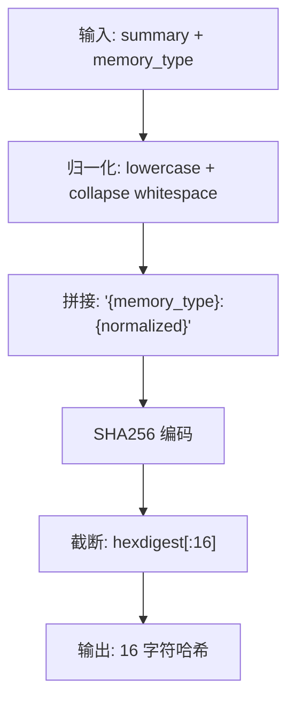
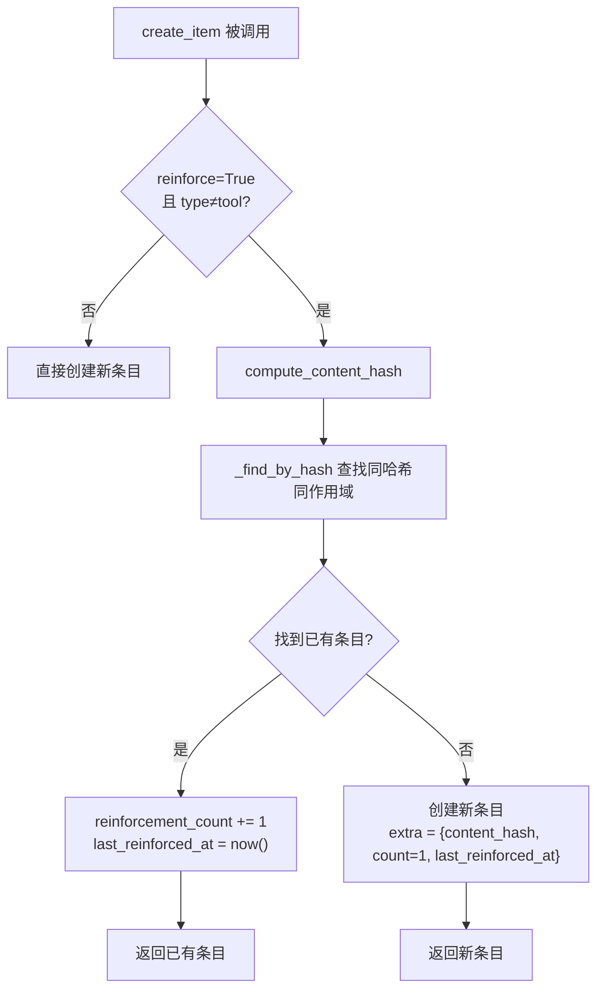
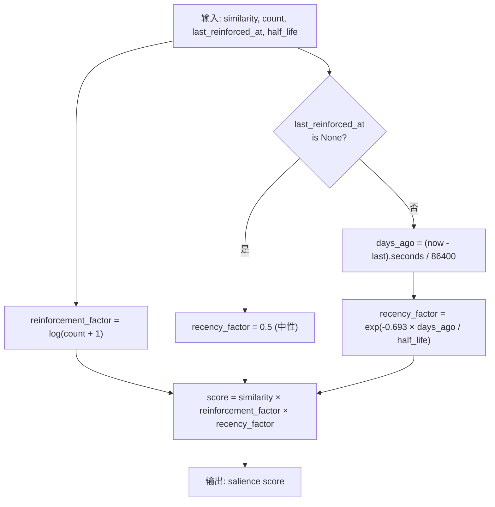

# PD-521.01 memU — SHA256 内容哈希去重与 Salience 强化评分

> 文档编号：PD-521.01
> 来源：memU `src/memu/database/models.py`, `src/memu/database/inmemory/vector.py`
> GitHub：https://github.com/NevaMind-AI/memU.git
> 问题域：PD-521 记忆去重与强化 Memory Deduplication & Reinforcement
> 状态：可复用方案

---

## 第 1 章 问题与动机

### 1.1 核心问题

长期记忆系统在持续对话中会反复提取相同或近似的事实。如果不做去重，记忆库会膨胀出大量冗余条目，既浪费存储又干扰检索排序。同时，被多次提及的记忆应当比只出现一次的记忆更"重要"——这就是强化（reinforcement）的价值。而随着时间推移，久未被提及的记忆应当自然衰减，让近期活跃的记忆优先浮现。

这三个需求——去重、强化、衰减——构成了记忆质量管理的核心三角。

### 1.2 memU 的解法概述

memU 采用三层机制解决这一问题：

1. **内容哈希去重**：对 `summary + memory_type` 做归一化后计算 SHA256 前 16 位十六进制哈希，作为唯一标识。相同哈希 + 相同用户作用域 = 重复记忆（`src/memu/database/models.py:15-32`）
2. **强化计数追踪**：重复记忆不创建新条目，而是递增已有条目的 `reinforcement_count` 并更新 `last_reinforced_at` 时间戳（`src/memu/database/inmemory/repositories/memory_item_repo.py:122-167`）
3. **Salience 综合评分**：检索时可选 salience 排序模式，公式为 `similarity × log(reinforcement+1) × exp(-0.693 × days/half_life)`，融合语义相似度、强化频次和时间衰减三个维度（`src/memu/database/inmemory/vector.py:16-53`）
4. **三后端一致实现**：InMemory / SQLite / PostgreSQL 三个存储后端均实现相同的去重-强化-salience 逻辑，通过 Repository Protocol 保证行为一致（`src/memu/database/repositories/memory_item.py:10-54`）
5. **双层哈希体系**：除了记忆级 SHA256 去重，工具调用记录（ToolCallResult）还有独立的 MD5 `call_hash` 去重（`src/memu/database/models.py:56-65`）

### 1.3 设计思想

| 设计原则 | 具体实现 | 理由 | 替代方案 |
|----------|----------|------|----------|
| 后摘要哈希 | 对 LLM 生成的 summary 而非原始输入计算哈希 | 原始输入格式多变，summary 是归一化后的语义表示 | 对原始输入哈希（格式敏感，误判率高） |
| 归一化预处理 | `" ".join(summary.lower().split())` 消除大小写和多余空白 | 避免 "I love coffee" 与 "I  love  coffee" 被判为不同 | 正则替换（更复杂但效果类似） |
| 截断哈希 | SHA256 取前 16 hex（64 bit） | 在记忆量级（万级）下碰撞概率极低，节省存储 | 全量 64 hex（浪费存储）或 CRC32（碰撞率高） |
| 对数强化因子 | `log(count + 1)` 而非线性 count | 防止高频重复记忆的分数爆炸性增长 | 线性（分数膨胀）、平方根（衰减不够） |
| 半衰期衰减 | `exp(-0.693 × days / half_life)` | 物理学半衰期模型，half_life 天后因子恰好为 0.5 | 线性衰减（不符合遗忘曲线）、阶梯衰减（不平滑） |
| 配置驱动 | `enable_item_reinforcement` 开关 + `recency_decay_days` 参数 | 不同场景需要不同策略，默认关闭避免副作用 | 硬编码（不灵活） |

---

## 第 2 章 源码实现分析

### 2.1 架构概览

memU 的去重-强化-检索架构分为三层：模型层定义哈希函数，仓库层实现去重逻辑，向量层提供 salience 评分。

```
┌─────────────────────────────────────────────────────────────┐
│                    MemorizeMixin (应用层)                      │
│  memorize() → _persist_memory_items() → create_item(reinforce=True) │
└──────────────────────────┬──────────────────────────────────┘
                           │
┌──────────────────────────▼──────────────────────────────────┐
│              MemoryItemRepo Protocol (协议层)                  │
│  create_item() / vector_search_items() / update_item()       │
├──────────────┬──────────────────┬───────────────────────────┤
│  InMemory    │     SQLite       │     PostgreSQL            │
│  dict 存储    │  json_extract    │  extra->>'key' / pgvector │
│  cosine_topk │  cosine_topk     │  cosine_distance / local  │
└──────┬───────┴────────┬─────────┴──────────┬────────────────┘
       │                │                    │
┌──────▼────────────────▼────────────────────▼────────────────┐
│                  models.py (模型层)                           │
│  compute_content_hash()  MemoryItem.extra{content_hash,     │
│                          reinforcement_count,                │
│                          last_reinforced_at}                 │
└──────────────────────────┬──────────────────────────────────┘
                           │
┌──────────────────────────▼──────────────────────────────────┐
│                  vector.py (评分层)                           │
│  salience_score()  cosine_topk_salience()  cosine_topk()    │
└─────────────────────────────────────────────────────────────┘
```

### 2.2 核心实现

#### 2.2.1 内容哈希计算



对应源码 `src/memu/database/models.py:15-32`：

```python
def compute_content_hash(summary: str, memory_type: str) -> str:
    """
    Generate unique hash for memory deduplication.

    Operates on post-summary content. Normalizes whitespace to handle
    minor formatting differences like "I love coffee" vs "I  love  coffee".
    """
    # Normalize: lowercase, strip, collapse whitespace
    normalized = " ".join(summary.lower().split())
    content = f"{memory_type}:{normalized}"
    return hashlib.sha256(content.encode()).hexdigest()[:16]
```

关键设计点：
- 哈希输入包含 `memory_type` 前缀，确保不同类型的相同文本不会被误判为重复（`models.py:31`）
- 归一化使用 `split()` + `join()` 而非正则，简洁高效（`models.py:30`）
- 截断到 16 hex = 64 bit，在万级记忆规模下碰撞概率约 10^-14（`models.py:32`）

#### 2.2.2 去重与强化流程



对应源码 `src/memu/database/inmemory/repositories/memory_item_repo.py:122-167`：

```python
def create_item_reinforce(
    self,
    *,
    resource_id: str,
    memory_type: MemoryType,
    summary: str,
    embedding: list[float],
    user_data: dict[str, Any],
    reinforce: bool = False,
) -> MemoryItem:
    content_hash = compute_content_hash(summary, memory_type)

    # Check for existing item with same hash in same scope (deduplication)
    existing = self._find_by_hash(content_hash, user_data)
    if existing:
        # Reinforce existing memory instead of creating duplicate
        current_extra = existing.extra or {}
        current_count = current_extra.get("reinforcement_count", 1)
        existing.extra = {
            **current_extra,
            "reinforcement_count": current_count + 1,
            "last_reinforced_at": pendulum.now("UTC").isoformat(),
        }
        existing.updated_at = pendulum.now("UTC")
        return existing

    # Create new item with salience tracking in extra
    mid = str(uuid.uuid4())
    now = pendulum.now("UTC")
    item_extra = user_data.pop("extra", {}) if "extra" in user_data else {}
    item_extra.update({
        "content_hash": content_hash,
        "reinforcement_count": 1,
        "last_reinforced_at": now.isoformat(),
    })
    it = self.memory_item_model(
        id=mid, resource_id=resource_id, memory_type=memory_type,
        summary=summary, embedding=embedding, extra=item_extra, **user_data,
    )
    self.items[mid] = it
    return it
```

#### 2.2.3 Salience 评分函数



对应源码 `src/memu/database/inmemory/vector.py:16-53`：

```python
def salience_score(
    similarity: float,
    reinforcement_count: int,
    last_reinforced_at: datetime | None,
    recency_decay_days: float = 30.0,
) -> float:
    """
    Compute salience-aware score combining similarity, reinforcement, and recency.
    Formula: similarity * reinforcement_factor * recency_factor
    """
    # Reinforcement factor (logarithmic to prevent runaway scores)
    reinforcement_factor = math.log(reinforcement_count + 1)

    # Recency factor (exponential decay with half-life)
    if last_reinforced_at is None:
        recency_factor = 0.5  # Unknown recency gets neutral score
    else:
        now = datetime.now(last_reinforced_at.tzinfo) if last_reinforced_at.tzinfo else datetime.utcnow()
        days_ago = (now - last_reinforced_at).total_seconds() / 86400
        # 0.693 = ln(2), gives us proper half-life decay
        recency_factor = math.exp(-0.693 * days_ago / recency_decay_days)

    return similarity * reinforcement_factor * recency_factor
```

### 2.3 实现细节

**三后端一致性**：SQLite 后端通过 `json_extract(extra, '$.content_hash')` 查询哈希（`sqlite/repositories/memory_item_repo.py:316`），PostgreSQL 通过 `extra->>'content_hash'` JSONB 操作符（`postgres/repositories/memory_item_repo.py:178`），InMemory 通过 Python dict 遍历（`inmemory/repositories/memory_item_repo.py:62-77`）。三者的 `create_item_reinforce` 逻辑完全对称。

**工具调用双层哈希**：`ToolCallResult` 模型有独立的 `call_hash` 字段，使用 MD5 对 `tool_name|input|output` 计算哈希（`models.py:56-60`），用于工具记忆的去重。这与记忆级 SHA256 哈希形成双层去重体系。

**Salience 检索集成**：`vector_search_items` 方法通过 `ranking` 参数切换纯 cosine 和 salience 两种模式（`inmemory/repositories/memory_item_repo.py:169-196`）。salience 模式从 `extra` dict 读取 `reinforcement_count` 和 `last_reinforced_at`，传入 `cosine_topk_salience` 函数。

**向量化 Top-K 优化**：`cosine_topk` 使用 numpy 矩阵运算批量计算 cosine 相似度，并用 `np.argpartition` 实现 O(n) 的 top-k 选择（`vector.py:56-91`），避免全量排序。

**配置开关**：`enable_item_reinforcement`（`settings.py:239-242`）控制是否启用去重强化，`ranking` 和 `recency_decay_days`（`settings.py:160-167`）控制检索时的排序策略。默认均关闭/使用纯相似度，确保向后兼容。


---

## 第 3 章 迁移指南

### 3.1 迁移清单

**阶段 1：内容哈希去重（最小可用）**

- [ ] 实现 `compute_content_hash(summary, memory_type)` 函数
- [ ] 在记忆模型中添加 `content_hash` 字段（或 extra dict）
- [ ] 在 `create_item` 流程中增加哈希查重逻辑
- [ ] 重复时更新 `reinforcement_count` 和 `last_reinforced_at`

**阶段 2：Salience 评分（增强检索）**

- [ ] 实现 `salience_score(similarity, count, last_reinforced_at, half_life)` 函数
- [ ] 在向量检索接口中增加 `ranking` 参数切换
- [ ] 配置 `recency_decay_days` 半衰期参数

**阶段 3：多后端适配（可选）**

- [ ] SQLite：使用 `json_extract(extra, '$.content_hash')` 查询
- [ ] PostgreSQL：使用 `extra->>'content_hash'` JSONB 查询
- [ ] 确保三后端 `create_item_reinforce` 行为一致

### 3.2 适配代码模板

以下代码可直接复用，仅依赖 Python 标准库 + numpy：

```python
import hashlib
import math
from datetime import datetime


def compute_content_hash(summary: str, memory_type: str) -> str:
    """对 summary 归一化后计算 SHA256 前 16 位哈希。"""
    normalized = " ".join(summary.lower().split())
    content = f"{memory_type}:{normalized}"
    return hashlib.sha256(content.encode()).hexdigest()[:16]


def salience_score(
    similarity: float,
    reinforcement_count: int,
    last_reinforced_at: datetime | None,
    recency_decay_days: float = 30.0,
) -> float:
    """
    综合评分 = 语义相似度 × 对数强化因子 × 指数时间衰减。

    Args:
        similarity: cosine 相似度 (0~1)
        reinforcement_count: 强化次数 (≥1)
        last_reinforced_at: 最后强化时间
        recency_decay_days: 半衰期天数（默认 30 天）

    Returns:
        salience 分数，越高越显著
    """
    reinforcement_factor = math.log(reinforcement_count + 1)

    if last_reinforced_at is None:
        recency_factor = 0.5
    else:
        now = datetime.now(last_reinforced_at.tzinfo) if last_reinforced_at.tzinfo else datetime.utcnow()
        days_ago = (now - last_reinforced_at).total_seconds() / 86400
        recency_factor = math.exp(-0.693 * days_ago / recency_decay_days)

    return similarity * reinforcement_factor * recency_factor


class MemoryDeduplicator:
    """可嵌入任何记忆系统的去重-强化组件。"""

    def __init__(self, recency_decay_days: float = 30.0):
        self.recency_decay_days = recency_decay_days
        self._hash_index: dict[str, str] = {}  # content_hash -> item_id

    def should_reinforce(self, summary: str, memory_type: str, scope_key: str) -> str | None:
        """检查是否应强化已有记忆。返回已有 item_id 或 None。"""
        content_hash = compute_content_hash(summary, memory_type)
        lookup_key = f"{scope_key}:{content_hash}"
        return self._hash_index.get(lookup_key)

    def register(self, summary: str, memory_type: str, scope_key: str, item_id: str) -> None:
        """注册新记忆的哈希。"""
        content_hash = compute_content_hash(summary, memory_type)
        lookup_key = f"{scope_key}:{content_hash}"
        self._hash_index[lookup_key] = item_id
```

### 3.3 适用场景

| 场景 | 适用度 | 说明 |
|------|--------|------|
| 长期对话记忆系统 | ⭐⭐⭐ | 核心场景，对话中反复提及的事实需要去重和强化 |
| 知识库增量更新 | ⭐⭐⭐ | 多次导入相同知识时自动去重，强化高频知识 |
| Agent 工具记忆 | ⭐⭐ | 工具调用结果去重（memU 用 MD5 call_hash） |
| 短期会话缓存 | ⭐ | 会话内重复少，去重收益有限 |
| 多用户共享记忆 | ⭐⭐⭐ | 哈希 + 用户作用域确保跨用户隔离 |

---

## 第 4 章 测试用例

```python
import math
from datetime import datetime, timedelta, timezone

import pytest


class TestComputeContentHash:
    """测试内容哈希计算。"""

    def test_basic_hash(self):
        """相同输入产生相同哈希。"""
        h1 = compute_content_hash("I love coffee", "profile")
        h2 = compute_content_hash("I love coffee", "profile")
        assert h1 == h2
        assert len(h1) == 16

    def test_whitespace_normalization(self):
        """多余空白不影响哈希。"""
        h1 = compute_content_hash("I love coffee", "profile")
        h2 = compute_content_hash("I  love  coffee", "profile")
        h3 = compute_content_hash("  I love coffee  ", "profile")
        assert h1 == h2 == h3

    def test_case_insensitive(self):
        """大小写不影响哈希。"""
        h1 = compute_content_hash("I Love Coffee", "profile")
        h2 = compute_content_hash("i love coffee", "profile")
        assert h1 == h2

    def test_different_type_different_hash(self):
        """不同 memory_type 产生不同哈希。"""
        h1 = compute_content_hash("I love coffee", "profile")
        h2 = compute_content_hash("I love coffee", "event")
        assert h1 != h2

    def test_different_content_different_hash(self):
        """不同内容产生不同哈希。"""
        h1 = compute_content_hash("I love coffee", "profile")
        h2 = compute_content_hash("I love tea", "profile")
        assert h1 != h2


class TestSalienceScore:
    """测试 salience 评分函数。"""

    def test_basic_score(self):
        """基本评分：similarity=1.0, count=1, 刚刚强化。"""
        now = datetime.now(timezone.utc)
        score = salience_score(1.0, 1, now, 30.0)
        expected = 1.0 * math.log(2) * 1.0  # ~0.693
        assert abs(score - expected) < 0.01

    def test_reinforcement_logarithmic(self):
        """强化因子是对数增长，不是线性。"""
        now = datetime.now(timezone.utc)
        score_1 = salience_score(1.0, 1, now, 30.0)
        score_10 = salience_score(1.0, 10, now, 30.0)
        score_100 = salience_score(1.0, 100, now, 30.0)
        # 10x 强化不应带来 10x 分数
        assert score_10 / score_1 < 5
        assert score_100 / score_1 < 10

    def test_half_life_decay(self):
        """半衰期后分数约为一半。"""
        now = datetime.now(timezone.utc)
        past = now - timedelta(days=30)
        score_now = salience_score(1.0, 1, now, 30.0)
        score_past = salience_score(1.0, 1, past, 30.0)
        ratio = score_past / score_now
        assert abs(ratio - 0.5) < 0.05

    def test_none_recency_neutral(self):
        """last_reinforced_at=None 时 recency_factor=0.5。"""
        score = salience_score(1.0, 1, None, 30.0)
        expected = 1.0 * math.log(2) * 0.5
        assert abs(score - expected) < 0.01

    def test_zero_similarity(self):
        """similarity=0 时分数为 0。"""
        now = datetime.now(timezone.utc)
        score = salience_score(0.0, 10, now, 30.0)
        assert score == 0.0


class TestDeduplicationFlow:
    """测试去重-强化完整流程。"""

    def test_first_create_sets_hash(self):
        """首次创建记忆应设置 content_hash 和 reinforcement_count=1。"""
        dedup = MemoryDeduplicator()
        result = dedup.should_reinforce("I love coffee", "profile", "user_1")
        assert result is None  # 首次无重复

        dedup.register("I love coffee", "profile", "user_1", "item_001")
        result = dedup.should_reinforce("I love coffee", "profile", "user_1")
        assert result == "item_001"  # 第二次检测到重复

    def test_different_scope_no_dedup(self):
        """不同用户作用域不去重。"""
        dedup = MemoryDeduplicator()
        dedup.register("I love coffee", "profile", "user_1", "item_001")
        result = dedup.should_reinforce("I love coffee", "profile", "user_2")
        assert result is None  # 不同用户不去重
```


---

## 第 5 章 跨域关联

| 关联域 | 关系类型 | 说明 |
|--------|----------|------|
| PD-06 记忆持久化 | 依赖 | 去重和强化元数据（content_hash, reinforcement_count）存储在 MemoryItem.extra 中，依赖持久化层的 JSON/JSONB 支持 |
| PD-08 搜索与检索 | 协同 | salience_score 直接影响向量检索排序，是检索质量的关键增强。cosine_topk_salience 替代纯 cosine_topk |
| PD-01 上下文管理 | 协同 | 去重减少冗余记忆注入上下文，强化排序让高频记忆优先进入有限的上下文窗口 |
| PD-10 中间件管道 | 协同 | memorize 工作流中 `dedupe_merge` 是独立的 WorkflowStep（`memorize.py:132-138`），可作为管道中间件插入 |
| PD-07 质量检查 | 协同 | 去重本身是记忆质量保障的一环，防止冗余条目污染检索结果 |

---

## 第 6 章 来源文件索引

| 文件 | 行范围 | 关键实现 |
|------|--------|----------|
| `src/memu/database/models.py` | L15-L32 | `compute_content_hash()` 哈希函数 |
| `src/memu/database/models.py` | L56-L65 | `ToolCallResult.generate_hash()` 工具调用 MD5 去重 |
| `src/memu/database/models.py` | L76-L94 | `MemoryItem` 模型定义，extra 字段说明 |
| `src/memu/database/inmemory/vector.py` | L16-L53 | `salience_score()` 综合评分函数 |
| `src/memu/database/inmemory/vector.py` | L56-L91 | `cosine_topk()` 向量化 Top-K |
| `src/memu/database/inmemory/vector.py` | L94-L127 | `cosine_topk_salience()` salience 排序检索 |
| `src/memu/database/inmemory/repositories/memory_item_repo.py` | L62-L77 | `_find_by_hash()` 哈希查找 |
| `src/memu/database/inmemory/repositories/memory_item_repo.py` | L122-L167 | `create_item_reinforce()` InMemory 去重强化 |
| `src/memu/database/inmemory/repositories/memory_item_repo.py` | L169-L196 | `vector_search_items()` 双模式检索 |
| `src/memu/database/sqlite/repositories/memory_item_repo.py` | L285-L386 | `create_item_reinforce()` SQLite 去重强化 |
| `src/memu/database/sqlite/repositories/memory_item_repo.py` | L477-L519 | `vector_search_items()` SQLite salience 检索 |
| `src/memu/database/postgres/repositories/memory_item_repo.py` | L162-L223 | `create_item_reinforce()` PostgreSQL 去重强化 |
| `src/memu/database/postgres/repositories/memory_item_repo.py` | L280-L354 | `vector_search_items()` + `_vector_search_local()` |
| `src/memu/database/repositories/memory_item.py` | L10-L54 | `MemoryItemRepo` Protocol 定义 |
| `src/memu/app/settings.py` | L151-L167 | `RetrieveItemConfig` salience 配置 |
| `src/memu/app/settings.py` | L239-L242 | `enable_item_reinforcement` 开关 |
| `src/memu/app/memorize.py` | L132-L138 | `dedupe_merge` WorkflowStep |
| `src/memu/app/memorize.py` | L603-L616 | `_persist_memory_items()` 强化调用入口 |

---

## 第 7 章 横向对比维度

```json comparison_data
{
  "project": "memU",
  "dimensions": {
    "去重策略": "SHA256 前 16 hex 对 summary+type 归一化哈希，用户作用域隔离",
    "强化机制": "reinforcement_count 递增 + last_reinforced_at 时间戳，存储在 extra JSON",
    "衰减模型": "指数半衰期衰减 exp(-0.693×days/half_life)，half_life 可配",
    "评分公式": "similarity × log(count+1) × recency_factor 三因子乘积",
    "多后端一致性": "InMemory/SQLite/PostgreSQL 三后端对称实现，Protocol 约束接口",
    "工具记忆去重": "ToolCallResult 独立 MD5 call_hash 对 name|input|output 去重"
  }
}
```

### 域元数据补充

```json domain_metadata
{
  "solution_summary": "memU 用 SHA256 前 16 hex 对 summary+type 归一化哈希实现去重，重复记忆触发 reinforcement_count 递增，检索时通过 similarity×log(count+1)×exp_decay 三因子 salience 评分排序",
  "description": "记忆系统中重复内容的识别、合并与重要性动态排序机制",
  "sub_problems": [
    "多后端哈希查询适配（JSON extract vs JSONB operator）",
    "工具调用记录的独立去重（MD5 call_hash）",
    "去重与强化的配置化开关控制"
  ],
  "best_practices": [
    "哈希输入包含 memory_type 前缀防止跨类型误判",
    "未知 last_reinforced_at 时给予 0.5 中性衰减因子而非 0 或 1",
    "向量 Top-K 用 argpartition O(n) 选择替代全量排序"
  ]
}
```

